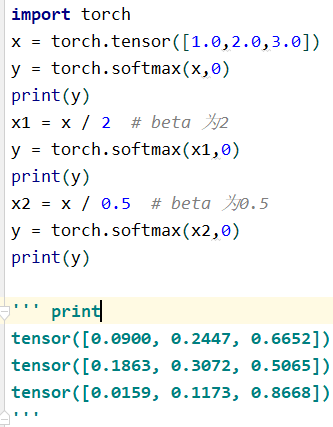
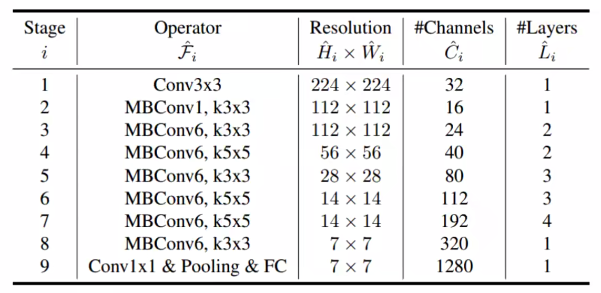
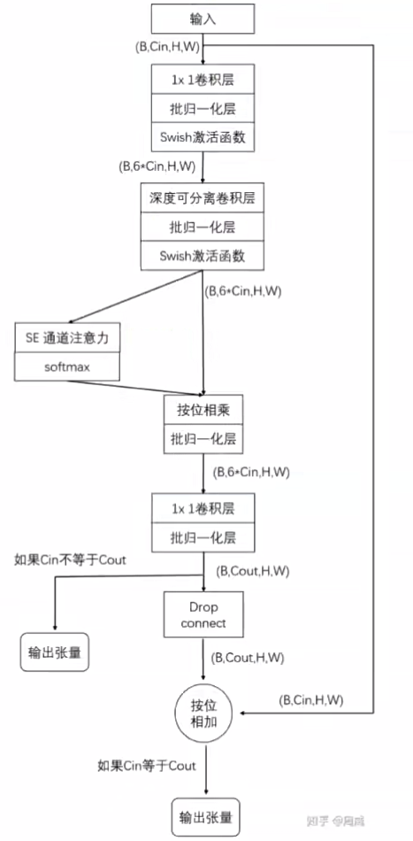

# EfficientNet

## 名词解释

### backbone

1. 主干网络:
这个主干网络大多时候指的是提取特征的网络，其作用就是提取图片中的信息，供后面的网络使用

2. 这些网络经常使用的是resnet VGG等，而不是我们自己设计的网络，因为这些网络已经证明了在分类等问题上的特征提取能力是很强的。在用这些网络作为backbone的时候，都是直接加载官方已经训练好的模型参数，后面接着我们自己的网络。让网络的这两个部分同时进行训练，因为加载的backbone模型已经具有提取特征的能力了，在我们的训练过程中，会对他进行微调，使得其更适合于我们自己的任务。

### head

head是获取网络输出内容的网络，利用之前提取的特征，head利用这些特征，做出预测。

### neck

neck是放在backbone和head之间的，是为了更好的利用backbone提取的特征

### bottleneck

瓶颈的意思，通常指的是网络输入的数据维度和输出的维度不同，输出的维度比输入的小了许多，就像脖子一样，变细了。经常设置的参数bottle_num=256，指的是网络输出的数据的维度是256 ，可是输入进来的可能是1024维度的。

### GAP

Global Average Pool全局平均池化，就是将某个通道的特征取平均值，经常使用AdaptativeAvgpoold(1)，在pytorch中，这个代表自适应性全局平均池化

### Embedding

深度学习方法都是利用使用线性和非线性转换对复杂的数据进行自动特征抽取，并将特征表示为“向量”（vector），这一过程一般也称为“嵌入”（embedding）

### pretext/downstream task

- pretext task：用于预训练的任务被称为前置/代理任务
- downstream task：用于微调的任务被称为下游任务

### temperature parameters

在论文中经常能看到这个温度参数的身影，那么他都有什么用处呢？比如经常看到下面这样的式子：

里面的beta就是temperature parameter，它可以起到平滑softmax输出结果的作用，举例子如下：

> 当beta>1的时候，可以将输出结果变得平滑，当beta<1的时候，可以让输出结果变得差异更大一下，更尖锐一些。如果beta比较大，则分类的crossentropy损失会很大，可以在不同的迭代次数里，使用不同的beta数值，有点类似于学习率的效果。

### end to end

端到端：给定一个输入，就能得到一个输出

## EfficientNet介绍

### 基本网络架构

### 流程图

### Depthwise卷积

深度可分离卷积：

### SE模块

对每个特征图计算其权重（注意力机制）

## EfficientDet

整体=EfficientNet + BiFPN

### BiFPN

## CenterNet

物体检测，关键点定位任务都能完成，而且速度很快

### 与其他经典算法的区别

- 一般检测算法都需要预先设置好anchor（框大的大小，长宽比）

- 需要通过比较候选框与GT的IOU来设置正负样本

- CenterNet可以当作不需要anchor或者单anchor的方法

1. 先通过下采样倍率将GT分布到下采样特征图上（512->128）
2. 利用干死分布将GT分布到特征图中各个点上，如果重叠则取大值

### 反卷积

上采样常用的两种方法

- 线性插值

- 反卷积：相当于卷积的逆过程，`Y=CX->X=C^TY`
