# LeetCode 刷题

## 栈

### 42. 接雨水

给定 n 个非负整数表示每个宽度为 1 的柱子的高度图，计算按此排列的柱子，下雨之后能接多少雨水。

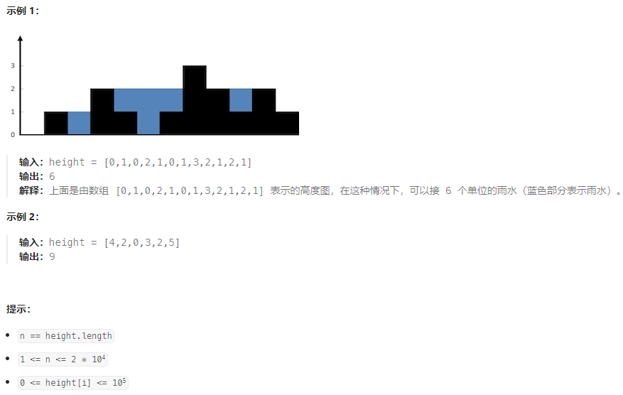

```java
class Solution {
    public int trap(int[] height) {
        int ans = 0;
        Stack<Integer> st = new Stack<>();
        for (int i = 0; i < height.length; i ++) {
            int last = 0;
            while (!st.isEmpty() && height[st.peek()] <= height[i]) {
                ans += (i - st.peek() - 1) * (height[st.peek()] - last);
                last = height[st.pop()]; 
            }
            if (!st.isEmpty()) {
                ans += (i - st.peek() - 1) * (height[i] - last);
            }
            st.push(i);
        }
        return ans;
    }
}
```

### 394. 字符串解码

给定一个经过编码的字符串，返回它解码后的字符串。

编码规则为: `k[encoded_string]`，表示其中方括号内部的 encoded_string 正好重复 k 次。注意 k 保证为正整数。

你可以认为输入字符串总是有效的；输入字符串中没有额外的空格，且输入的方括号总是符合格式要求的。

此外，你可以认为原始数据不包含数字，所有的数字只表示重复的次数 k ，例如不会出现像 3a 或 2[4] 的输入。

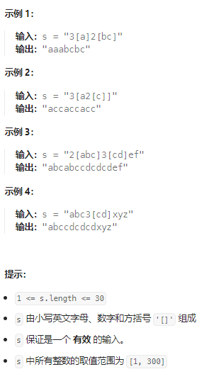

```java
class Solution {
    public String decodeString(String s) {
        StringBuilder result = new StringBuilder();
        Stack<Integer> countStack = new Stack<>();
        Stack<StringBuilder> strStack = new Stack<>();
        int index = 0;
        
        while (index < s.length()) {
            char c = s.charAt(index);
            
            if (Character.isDigit(c)) {
                // 获取重复次数
                int count = 0;
                while (Character.isDigit(s.charAt(index))) {
                    count = count * 10 + (s.charAt(index) - '0');
                    index++;
                }
                countStack.push(count);
            } else if (c == '[') {
                // 将结果和重复次数入栈
                strStack.push(result);
                result = new StringBuilder();
                index++;
            } else if (c == ']') {
                // 出栈计算结果
                StringBuilder temp = strStack.pop();
                int repeatTimes = countStack.pop();
                for (int i = 0; i < repeatTimes; i++) {
                    temp.append(result);
                }
                result = temp;
                index++;
            } else {
                // 字符串部分直接添加到结果中
                result.append(c);
                index++;
            }
        }
        
        return result.toString();
    }
}
```

### 901. 股票价格跨度

设计一个算法收集某些股票的每日报价，并返回该股票当日价格的 **跨度** 。

当日股票价格的 **跨度** 被定义为股票价格小于或等于今天价格的最大连续日数（从今天开始往回数，包括今天）。

- 例如，如果未来 7 天股票的价格是 `[100,80,60,70,60,75,85]`，那么股票跨度将是 `[1,1,1,2,1,4,6]` 。

实现 `StockSpanner` 类：

- `StockSpanner()` 初始化类对象。
- `int next(int price)` 给出今天的股价 `price` ，返回该股票当日价格的 **跨度** 。

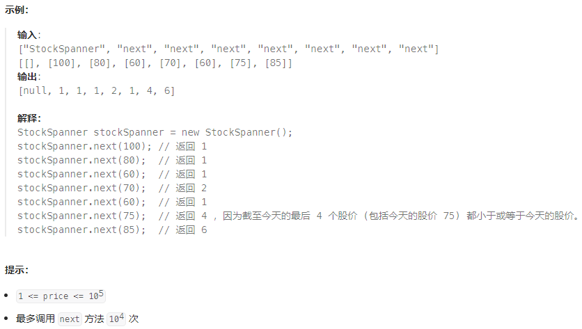

```java
class StockSpanner {
    Stack<int[]> stk;
    int top = -1;
    public StockSpanner() {
        stk = new Stack<int[]>();
        stk.push(new int[]{-1, Integer.MAX_VALUE / 2});
    }
    
    public int next(int price) {
        top ++;
        while (price >= stk.peek()[1]) {
            stk.pop();
        }
        int res = top - stk.peek()[0];
        stk.push(new int[]{top, price});
        return res;
    }
}

/**
 * Your StockSpanner object will be instantiated and called as such:
 * StockSpanner obj = new StockSpanner();
 * int param_1 = obj.next(price);
 */
```

## 模拟

### 1222. 可以攻击国王的皇后

在一个 `8x8` 的棋盘上，放置着若干「黑皇后」和一个「白国王」。

给定一个由整数坐标组成的数组 queens ，表示黑皇后的位置；以及一对坐标 king ，表示白国王的位置，返回所有可以攻击国王的皇后的坐标(任意顺序)。

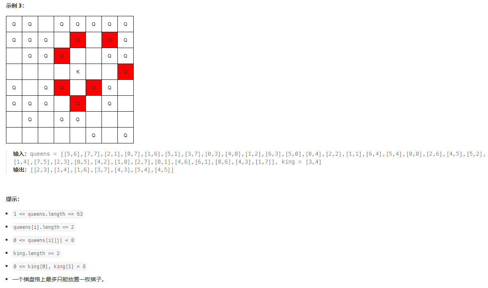

```java
class Solution {
    public List<List<Integer>> queensAttacktheKing(int[][] queens, int[] king) {
        List<List<Integer>> res = new ArrayList<>();
        boolean[][] st = new boolean[8][8];
        for (int[] q : queens) {
            st[q[0]][q[1]] = true;
        }
        for (int i = -1; i <= 1; i ++) {
            for (int j = -1; j <= 1; j ++) {
                if (i != 0 || j != 0) {
                    int x = king[0], y = king[1];
                    while (true) {
                        x += i; y += j;
                        if (x < 0 || x >= 8 || y < 0 || y >= 8) {
                            break;
                        }
                        if (st[x][y]) {
                            res.add(Arrays.asList(new Integer[]{x, y}));
                            break;
                        }
                    }
                }
            }
        }
        return res;
    }
}
```

### 2596. 检查骑士巡视方案

骑士在一张 n x n 的棋盘上巡视。在有效的巡视方案中，骑士会从棋盘的 **左上角** 出发，并且访问棋盘上的每个格子 恰好一次 。

给你一个 n x n 的整数矩阵 grid ，由范围 `[0, n * n - 1] `内的不同整数组成，其中 `grid[row][col]` 表示单元格 (row, col) 是骑士访问的第 `grid[row][col]` 个单元格。骑士的行动是从下标 0 开始的。

如果 grid 表示了骑士的有效巡视方案，返回 true；否则返回 false。

注意，骑士行动时可以垂直移动两个格子且水平移动一个格子，或水平移动两个格子且垂直移动一个格子。下图展示了骑士从某个格子出发可能的八种行动路线。

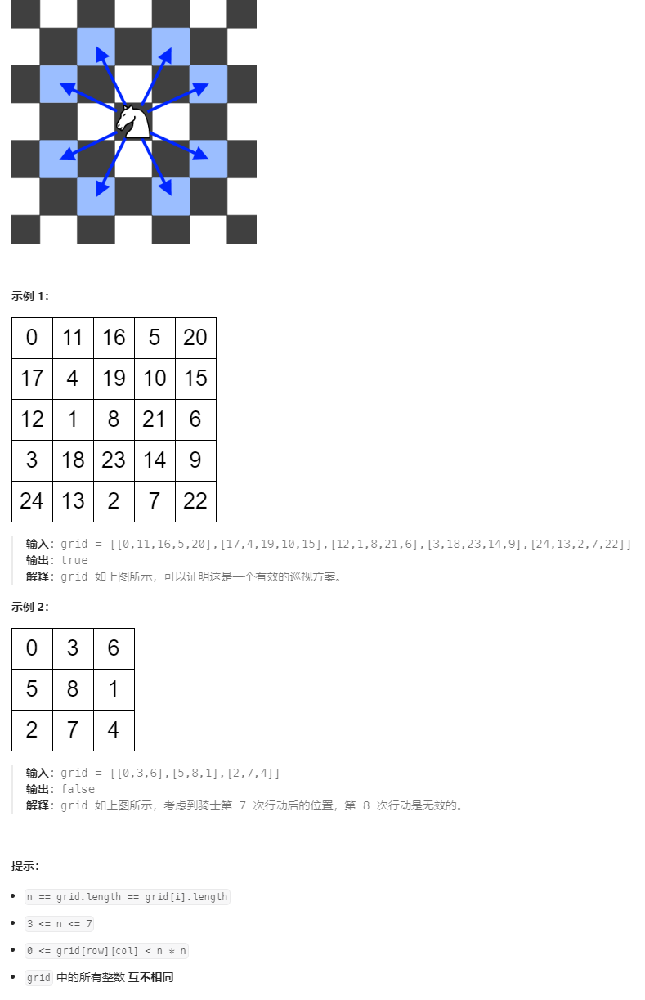

```java
class Solution {
    // 时间复杂度 O(n^2) 空间复杂度 O(n^2)
    public boolean checkValidGrid(int[][] grid) {
        if (grid[0][0] != 0) {
            return false;
        }
        int n = grid.length;
        int[][] indices = new int[n * n][2];
        for (int i = 0; i < n; i++) {
            for (int j = 0; j < n; j++) {
                indices[grid[i][j]][0] = i;
                indices[grid[i][j]][1] = j;
            }
        }
        for (int i = 1; i < n * n; i++) {
            int dx = Math.abs(indices[i][0] - indices[i - 1][0]);
            int dy = Math.abs(indices[i][1] - indices[i - 1][1]);
            if (dx * dy != 2) {
                return false;
            }
        }
        return true;
    }
}
```

**递归解法**

```java
class Solution {
    int n;
    boolean ans;
    int[] dx = new int[]{2, 2, -2, -2, 1, 1, -1, -1}, dy = new int[]{1, -1, 1, -1, 2, -2, 2, -2};

    public boolean checkValidGrid(int[][] grid) {
        if (grid[0][0] != 0) {
            return false;
        }
        n = grid.length;
        int originX = 0, originY = 0;
        dfs(originX, originY, 0, grid);
        return ans;
    }
    void dfs(int i, int j, int u, int[][] grid) {
        if (u == n * n - 1) {
            ans = grid[i][j] == u;
            return;
        }
        for (int k = 0; k < 8; k ++) {
            int x = i + dx[k], y = j + dy[k];
            if (x >= 0 && x < n && y >= 0 && y < n && grid[x][y] == u + 1) {
                dfs(x, y, u + 1, grid);
            }
        }
    }
}
```

## 计数

### 1267. 统计参与通信的服务器

这里有一幅服务器分布图，服务器的位置标识在 m * n 的整数矩阵网格 grid 中，1 表示单元格上有服务器，0 表示没有。

如果两台服务器位于同一行或者同一列，我们就认为它们之间可以进行通信。

请你统计并返回能够与至少一台其他服务器进行通信的服务器的数量。

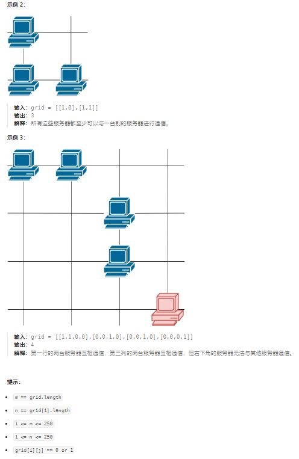

```java
class Solution {
    public int countServers(int[][] grid) {
        int n = grid.length;
        int m = grid[0].length;
        Map<Integer, Integer> rows = new HashMap<>();
        Map<Integer, Integer> cols = new HashMap<>();
        for (int i = 0; i < n; i ++) {
            for (int j = 0; j < m; j ++) {
                if (grid[i][j] == 1) {
                    rows.put(i, rows.getOrDefault(i, 0) + 1);
                    cols.put(j, cols.getOrDefault(j, 0) + 1);
                }
            }
        }
        int ans = 0;
        for (int i = 0; i < n; i ++) {
            for (int j = 0; j < m; j ++) {
                if (grid[i][j] == 1 && (rows.get(i) > 1 || cols.get(j) > 1)) {
                    ans ++;
                }
            }
        }
        return ans;
    }
}
```

### 1419. 数青蛙

给你一个字符串 croakOfFrogs，它表示不同青蛙发出的蛙鸣声（字符串 "croak" ）的组合。由于同一时间可以有多只青蛙呱呱作响，所以 croakOfFrogs 中会混合多个 “croak” 。

请你返回模拟字符串中所有蛙鸣所需不同青蛙的最少数目。

要想发出蛙鸣 "croak"，青蛙必须 依序 输出 ‘c’, ’r’, ’o’, ’a’, ’k’ 这 5 个字母。如果没有输出全部五个字母，那么它就不会发出声音。如果字符串 croakOfFrogs 不是由若干有效的 "croak" 字符混合而成，请返回 -1 。

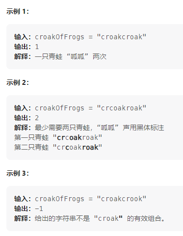

```java
class Solution {
    public int minNumberOfFrogs(String croakOfFrogs) {
        int n = croakOfFrogs.length();
        Map<Character, Integer> map = new HashMap<Character, Integer>(){{
            put('c', 0);
            put('r', 1);
            put('o', 2);
            put('a', 3);
            put('k', 4);
        }};
        int ans = 0, frog_num = 0;
        int[] cnt = new int[4];
        for (int i = 0; i < n; i ++) {
            char c = croakOfFrogs.charAt(i);
            int t = map.get(c);
            if (t == 0) {
                frog_num ++;
                cnt[t] ++;
                ans = Math.max(ans, frog_num);
            } else {
                if (cnt[t - 1] == 0) {
                    return -1;
                }
                cnt[t - 1] --;
                if (t == 4) {
                    frog_num --;
                } else {
                    cnt[t] ++;
                }
            }
        }
        if (frog_num > 0) {
            return -1;
        }
        return ans;
    }
}
```

### 1010. 总持续时间可被 60 整除的歌曲

在歌曲列表中，第 i 首歌曲的持续时间为 time[i] 秒。

返回其总持续时间（以秒为单位）可被 60 整除的歌曲对的数量。形式上，我们希望下标数字 i 和 j 满足  i < j 且有 `(time[i] + time[j]) % 60 == 0`。

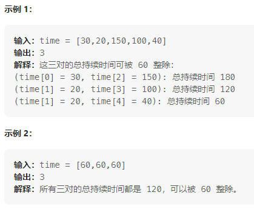

```java
class Solution {
    public int numPairsDivisibleBy60(int[] time) {
    int[] cnt = new int[60];
        for (int t : time) {
            cnt[t % 60] ++;
        }
        long res = 0;
        for (int i = 1; i < 30; i ++) {
            res += cnt[i] * cnt[60 - i];
        }
        res += (long)cnt[0] * (cnt[0] - 1) / 2 + (long)cnt[30] * (cnt[30] - 1) / 2;
        return (int)res;
    }
}
```

## 哈希 

### 1726. 同积元组

给你一个由 **不同** 正整数组成的数组 `nums` ，请你返回满足 `a * b = c * d` 的元组 `(a, b, c, d)` 的数量。其中 `a`、`b`、`c` 和 `d` 都是 `nums` 中的元素，且 `a != b != c != d` 。

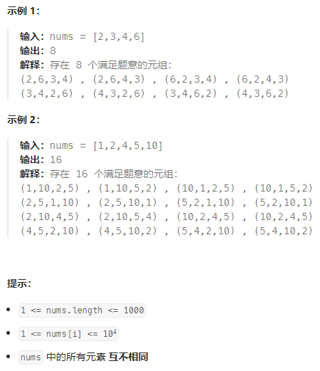

**思路与算法：**统计数组中所有不同元素的乘积组合数目，然后计算在相同乘积的**数对**可以构成**同积元组**的数目，并求和即可得到最终的结果。

```java
class Solution {
    public int tupleSameProduct(int[] nums) {
        int n = nums.length;
        Map<Integer, Integer> map = new HashMap<>();
        for (int i = 0; i < nums.length; i ++) {
            for (int j = i + 1; j < nums.length; j ++) {
                int x = nums[i] * nums[j];
                map.put(x, map.getOrDefault(x, 0) + 1);
            }
        }
        int res = 0;
        for (int x : map.values()) {
            res += x * (x - 1) * 4;
        }
        return res;
    }
}
```

### 2342. 数位和相等数对的最大和

给你一个下标从 **0** 开始的数组 `nums` ，数组中的元素都是 **正** 整数。请你选出两个下标 `i` 和 `j`（`i != j`），且 `nums[i]` 的数位和 与 `nums[j]` 的数位和相等。

请你找出所有满足条件的下标 `i` 和 `j` ，找出并返回 `nums[i] + nums[j]` 可以得到的 **最大值** *。*


```java
class Solution {
    public int maximumSum(int[] nums) {
        int ans = -1;
        int[] mx = new int[82];
        for (int x : nums) {
            int s = 0, t = x;
            while (t > 0) {
                s += t % 10;
                t /= 10;
            }
            if (mx[s] > 0) {
                ans = Math.max(ans, mx[s] + x);
            }
            mx[s] = Math.max(mx[s], x);
        }
        return ans;
    }
}
```

### 2441. 与对应负数同时存在的最大正整数

给你一个 不包含 任何零的整数数组 nums ，找出自身与对应的负数都在数组中存在的最大正整数 k 。

返回正整数 k ，如果不存在这样的整数，返回 -1 。

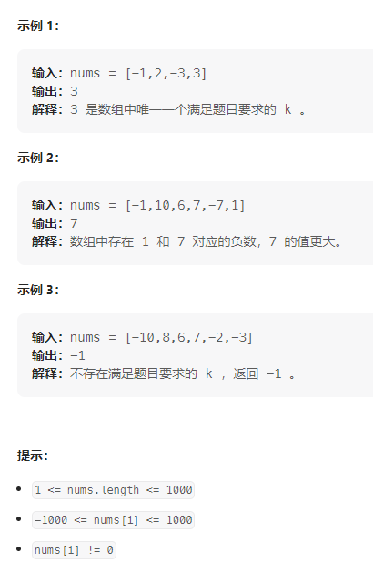

> `[-9,-43,24,-23,-16,-30,-38,-30]`
>
> `-1`

```java
class Solution {
    public int findMaxK(int[] nums) {
        Set<Integer> set = new HashSet<>();
        for (int i = 0; i < nums.length; i ++ ) {
            set.add(nums[i]);
        }
        int res = -1;
        for (int i = 0; i < nums.length; i ++) {
            if (set.contains(-nums[i])) {
                res = Math.max(Math.abs(nums[i]), res);
            }
        }
        return res;
    }
}
```

### 874. 模拟行走机器人

机器人在一个无限大小的 XY 网格平面上行走，从点 (0, 0) 处开始出发，面向北方。该机器人可以接收以下三种类型的命令 commands ：

- -2 ：向左转 90 度
- -1 ：向右转 90 度
- 1 <= x <= 9 ：向前移动 x 个单位长度

在网格上有一些格子被视为障碍物 obstacles 。第 i 个障碍物位于网格点  obstacles[i] = (xi, yi) 。

机器人无法走到障碍物上，它将会停留在障碍物的前一个网格方块上，但仍然可以继续尝试进行该路线的其余部分。

返回从原点到机器人所有经过的路径点（坐标为整数）的最大欧式距离的平方。（即，如果距离为 5 ，则返回 25 ）
 
注意：

- 北表示 +Y 方向。
- 东表示 +X 方向。
- 南表示 -Y 方向。
- 西表示 -X 方向。

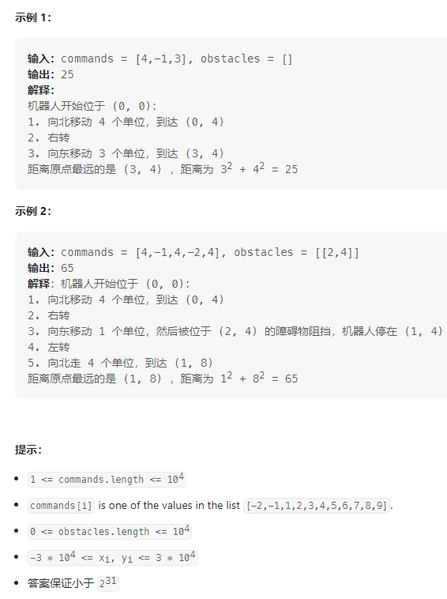

```java
class Solution {
    public int robotSim(int[] commands, int[][] obstacles) {
        Set<String> set = new HashSet<>();
        int x = 0, y = 0, d = 0;
        int[] dx = new int[]{0, 1, 0, -1}, dy = new int[]{1, 0, -1, 0};
        int res = 0;
        for (int[] p : obstacles) {
            set.add(p[0] + "#" + p[1]);
        }
        for (int c : commands) {
            if (c == -2) {
                d = (d + 3) % 4;
            } else if (c == -1) {
                d = (d + 1) % 4;
            } else {
                for (int i = 0; i < c; i ++) {
                    int a = x + dx[d], b = y + dy[d];
                    if (set.contains(a + "#" + b)) {
                        break;
                    }
                    x = a; y = b;
                    res = Math.max(res, x * x + y * y);
                }
            }
        }
        return res;
    }
}
```

## 矩阵

### 1072. 按列翻转得到最大值等行数

给定 m x n 矩阵 matrix 。

你可以从中选出任意数量的列并翻转其上的 每个 单元格。（即翻转后，单元格的值从 0 变成 1，或者从 1 变为 0 。）

返回 经过一些翻转后，行与行之间所有值都相等的最大行数 。

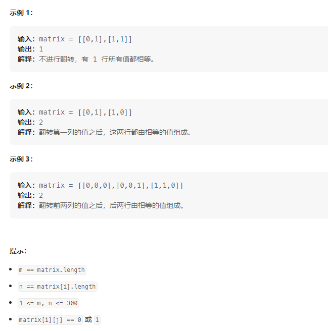

```java
class Solution {
    public int maxEqualRowsAfterFlips(int[][] matrix) {
        int n = matrix.length, m = matrix[0].length, res = 1;
        Map<String, Integer> map = new HashMap<>();
        for (int i = 0; i < n; i ++) {
            StringBuilder a = new StringBuilder(""), b = new StringBuilder(""); 
            for (int x : matrix[i]) {
                a.append(x);
                b.append(x ^ 1);
            }
            map.put(a.toString(), map.getOrDefault(a.toString(), 0) + 1);
            map.put(b.toString(), map.getOrDefault(b.toString(), 0) + 1);
            res = Math.max(res, Math.max(map.get(a.toString()), map.get(b.toString())));
        }
        
        return res;
    }
}
```

### 2679. 矩阵中的和

给你一个下标从 0 开始的二维整数数组 nums 。一开始你的分数为 0 。你需要执行以下操作直到矩阵变为空：

矩阵中每一行选取最大的一个数，并删除它。如果一行中有多个最大的数，选择任意一个并删除。
在步骤 1 删除的所有数字中找到最大的一个数字，将它添加到你的 分数 中。
请你返回最后的 分数 。

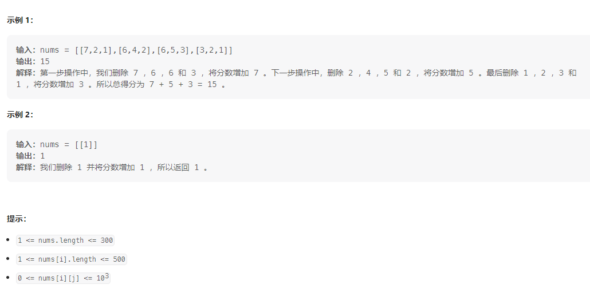

**枚举**

```java
class Solution {
    public int matrixSum(int[][] nums) {
        int res = 0;
        int m = nums.length;
        int n = nums[0].length;
        for (int i = 0; i < m; i++) {
            Arrays.sort(nums[i]);
        }
        for (int j = 0; j < n; j++) {
            int maxVal = 0;
            for (int i = 0; i < m; i++) {
                maxVal = Math.max(maxVal, nums[i][j]);
            }
            res += maxVal;
        }
        return res;
    }
}
```

**使用优先队列**

```java
class Solution {
    public int matrixSum(int[][] nums) {
        int res = 0;
        int m = nums.length;
        int n = nums[0].length;
        PriorityQueue<Integer>[] pq = new PriorityQueue[m];
        for (int i = 0; i < m; i++) {
            pq[i] = new PriorityQueue<Integer>((a, b) -> b - a);
            for (int j = 0; j < n; j++) {
                pq[i].offer(nums[i][j]);
            }
        }
        for (int j = 0; j < n; j++) {
            int maxVal = 0;
            for (int i = 0; i < m; i++) {
                maxVal = Math.max(maxVal, pq[i].poll());
            }
            res += maxVal;
        }
        return res;
    }
}
```

## 贪心

### 630. 课程表 III

这里有 n 门不同的在线课程，按从 1 到 n 编号。给你一个数组 courses ，其中 `courses[i] = [durationi, lastDayi]` 表示第 i 门课将会 持续 上 durationi 天课，并且必须在不晚于 lastDayi 的时候完成。

你的学期从第 1 天开始。且不能同时修读两门及两门以上的课程。

返回你最多可以修读的课程数目。

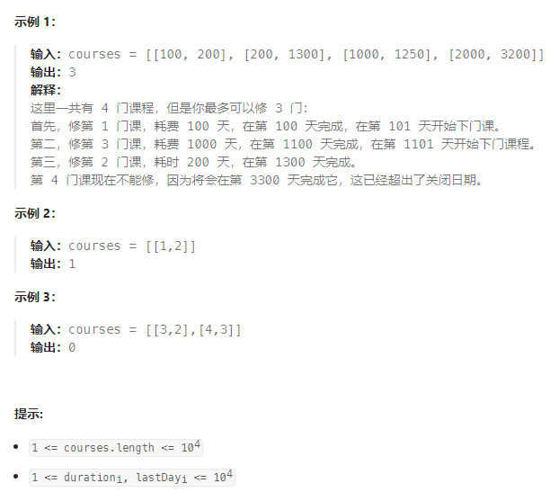

```java
class Solution {
    /**
     * f(i) 考虑前i 个任务的所有合法方案： 
     * 1. 选的课程个数最多
     * 2. 总用时最少（每种方案用时相同）
     * 加入第i 个任务后：
     *      方案合法： f(i) = f(i-1) + 1
     *      方案不合法： 删除一个最长任务 f(i) = f(i-1)
     */
    public int scheduleCourse(int[][] courses) {
        Arrays.sort(courses, (i1, i2) -> i1[1] - i2[1]);
        PriorityQueue<Integer> heap = new PriorityQueue<>((a, b) -> b - a);
        int tot = 0;
        for (int[] c : courses) {
            tot += c[0];
            heap.offer(c[0]);
            if (tot > c[1]) {
                tot -= heap.poll();
            }
        }
        return heap.size();
    }
}
```

### 1054. 距离相等的条形码

在一个仓库里，有一排条形码，其中第 i 个条形码为 `barcodes[i]`。

请你重新排列这些条形码，使其中任意两个相邻的条形码不能相等。 你可以返回任何满足该要求的答案，此题保证存在答案。

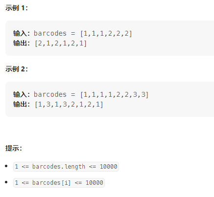

```java
class Solution {
    public int[] rearrangeBarcodes(int[] barcodes) {
        int n = barcodes.length;
        if (n < 2) {
            return barcodes;
        }
        Map<Integer, Integer> map = new HashMap<>();
        for (int x : barcodes) {
            map.put(x, map.getOrDefault(x, 0) + 1);
        }
        int evenIdx = 0, oddIdx = 1, half_n = n / 2;
        int[] res = new int[n];
        for (Map.Entry<Integer, Integer> entry : map.entrySet()) {
            int k = entry.getKey(), v = entry.getValue();
            while (v > 0 && v <= half_n && oddIdx < n) {
                v --;
                res[oddIdx] = k;
                oddIdx += 2;
            }
            while (v > 0) {
                v --;
                res[evenIdx] = k;
                evenIdx += 2;
            }
        }
        return res;
    }
}
```

### 1402. 做菜顺序

一个厨师收集了他 `n` 道菜的满意程度 `satisfaction` ，这个厨师做出每道菜的时间都是 1 单位时间。

一道菜的 「 **like-time 系数** 」定义为烹饪这道菜结束的时间（包含之前每道菜所花费的时间）乘以这道菜的满意程度，也就是 `time[i]`*`satisfaction[i]` 。

返回厨师在准备了一定数量的菜肴后可以获得的最大 **like-time 系数** 总和。

你可以按 **任意** 顺序安排做菜的顺序，你也可以选择放弃做某些菜来获得更大的总和。

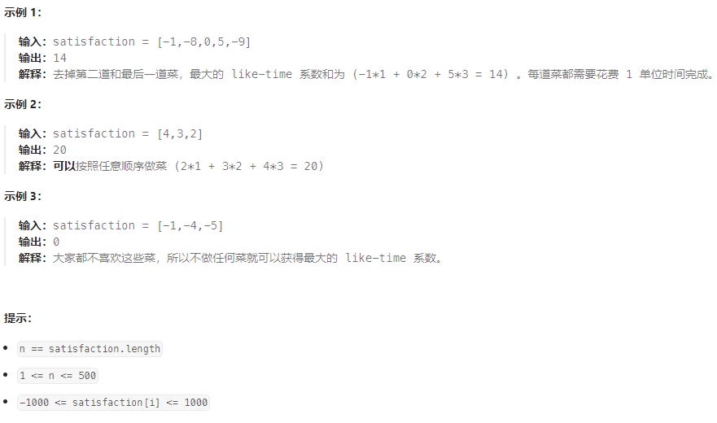

**思路：**可以任意顺序安排做菜的顺序，把 satisfaction 从大到小排序。f(k)=k⋅a[0]+(k−1)⋅a[1]+⋯+2⋅a[k−2]+a[k−1] -> f(k)=f(k−1)+(a[0]+a[1]+⋯+a[k−1])

```java
class Solution {
    public int maxSatisfaction(int[] satisfaction) {
        Arrays.sort(satisfaction);
        int f = 0, s = 0;
        for (int i = satisfaction.length - 1; i >= 0; i --) {
            s += satisfaction[i];
            if (s < 0) {
                break;
            }
            f += s;
        }
        return f;
    }
}
```

### 1488. 避免洪水泛滥

你的国家有无数个湖泊，所有湖泊一开始都是空的。当第 `n` 个湖泊下雨前是空的，那么它就会装满水。如果第 `n` 个湖泊下雨前是 **满的** ，这个湖泊会发生 **洪水** 。你的目标是避免任意一个湖泊发生洪水。

给你一个整数数组 `rains` ，其中：

- `rains[i] > 0` 表示第 `i` 天时，第 `rains[i]` 个湖泊会下雨。
- `rains[i] == 0` 表示第 `i` 天没有湖泊会下雨，你可以选择 **一个** 湖泊并 **抽干** 这个湖泊的水。

请返回一个数组 `ans` ，满足：

- `ans.length == rains.length`
- 如果 `rains[i] > 0` ，那么`ans[i] == -1` 。
- 如果 `rains[i] == 0` ，`ans[i]` 是你第 `i` 天选择抽干的湖泊。

如果有多种可行解，请返回它们中的 **任意一个** 。如果没办法阻止洪水，请返回一个 **空的数组** 。

请注意，如果你选择抽干一个装满水的湖泊，它会变成一个空的湖泊。但如果你选择抽干一个空的湖泊，那么将无事发生。

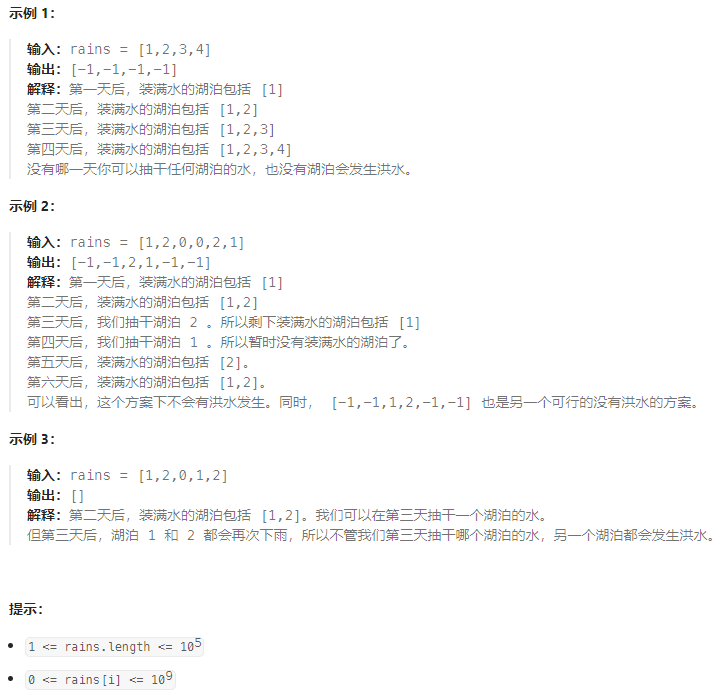

**思路**

**思考如何在洪水即将发生时，进行抽干操作。**使用有序集合 st 存储那些在某些日期没有下雨的日子。这些晴天日子可以被用来在湖泊即将发生洪水时，有选择地抽干湖泊，st 的排序方式是按照晴天日子的顺序排列的：

- 若 `rains[i]=0`，则将 i 加入有序集合 `st`。
- 若 `rains[i]>0`，表示第 `rains[i]` 湖泊将下雨，令 `ans[i]=−1` 表示这一天的湖泊不可抽干：
  - 若第 `rains[i]` 是第一次下雨，则此时不会发生洪水。
  - 否则我们需要在有序集合 `st` 中找到大于等于该湖泊上一次下雨天数的最小索引 `idx`（可以用二分查找实现），如果 `idx `不存在（即没有晴天可以用于抽干），此时不能避免洪水的发生，按照题目要求返回一个空数组。否则我们令 `ans[idx]=rains[i]`，并在 `st` 中删除 `idx`，表示我们会在第 `idx` 天抽干 `rains[i]` 湖泊的水来避免第 i 天洪水的发生。

```java
class Solution {
    public int[] avoidFlood(int[] rains) {
        int[] ans = new int[rains.length];
        Arrays.fill(ans, 1);
        TreeSet<Integer> st = new TreeSet<>();
        Map<Integer, Integer> map = new HashMap<>();
        for (int i = 0; i < rains.length; i ++) {
            if (rains[i] == 0) {
                st.add(i);
            } else {
                ans[i] = -1;
                if (map.containsKey(rains[i])) {
                    var a = st.ceiling(map.get(rains[i]));
                    if (a == null) {
                        return new int[0];
                    }
                    ans[a] = rains[i];
                    st.remove(a);
                }
                map.put(rains[i], i);
            }
        }
        return ans;
    }
}
```

### 1465. 切割后面积最大的蛋糕

矩形蛋糕的高度为 `h` 且宽度为 `w`，给你两个整数数组 `horizontalCuts` 和 `verticalCuts`，其中：

-  `horizontalCuts[i]` 是从矩形蛋糕顶部到第 `i` 个水平切口的距离
- `verticalCuts[j]` 是从矩形蛋糕的左侧到第 `j` 个竖直切口的距离

请你按数组 *`horizontalCuts`* 和 *`verticalCuts`* 中提供的水平和竖直位置切割后，请你找出 **面积最大** 的那份蛋糕，并返回其 **面积** 。由于答案可能是一个很大的数字，因此需要将结果 **对** `109 + 7` **取余** 后返回。

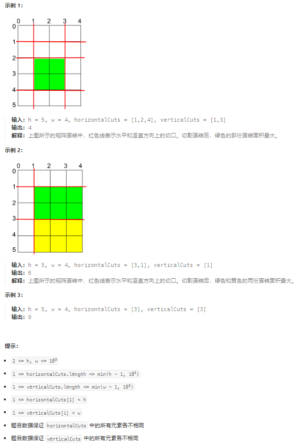

**思路**

可以这样理解，先横着切，那么间隔最大的那两刀，就决定了最大的那条蛋糕，它包含着最终面积最大的那份蛋糕。接下来只需要知道竖着切时，两刀的最大间隔是多少，就知道了蛋糕的最大面积。

```java
class Solution {
    public int maxArea(int h, int w, int[] horizontalCuts, int[] verticalCuts) {
        int maxh = getMax(h, horizontalCuts);
        int maxv = getMax(w, verticalCuts);
        return (int)((long)maxh * maxv % 1000000007);
    }
    int getMax(int border, int[] arr) {
        Arrays.sort(arr);
        int pre = 0, res = 0;
        for (int x : arr) {
            res = Math.max(res, x - pre);
            pre = x;
        }
        return Math.max(res, border - pre);
    }
}
```

### 2578. 最小和分割

给你一个正整数 `num` ，请你将它分割成两个非负整数 `num1` 和 `num2` ，满足：

- `num1` 和 `num2`  直接连起来，得到 `num` 各数位的一个排列。
  - 换句话说，`num1` 和 `num2` 中所有数字出现的次数之和等于 `num` 中所有数字出现的次数。
- `num1` 和 `num2` 可以包含前导 0 。

请你返回 `num1` 和 `num2` 可以得到的和的 **最小** 值。

**注意：**

- `num` 保证没有前导 0 。
- `num1` 和 `num2` 中数位顺序可以与 `num` 中数位顺序不同。

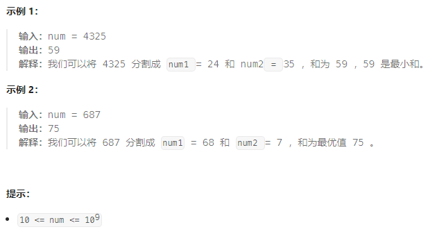

```java
class Solution {
    public int splitNum(int num) {
        char[] stnum = Integer.toString(num).toCharArray();
        Arrays.sort(stnum);
        int num1 = 0, num2 = 0;
        for (int i = 0; i < stnum.length; ++i) {
            if (i % 2 == 0) {
                num1 = num1 * 10 + (stnum[i] - '0');
            } else {
                num2 = num2 * 10 + (stnum[i] - '0');
            }
        }
        return num1 + num2;
    }
}
```

### 2600. K 件物品的最大和

袋子中装有一些物品，每个物品上都标记着数字 1 、0 或 -1 。

给你四个非负整数 numOnes 、numZeros 、numNegOnes 和 k 。

袋子最初包含：

- `numOnes `件标记为 1 的物品。
- `numZeroes `件标记为 0 的物品。
- `numNegOnes `件标记为 -1 的物品。

现计划从这些物品中恰好选出 k 件物品。返回所有可行方案中，物品上所标记数字之和的最大值。

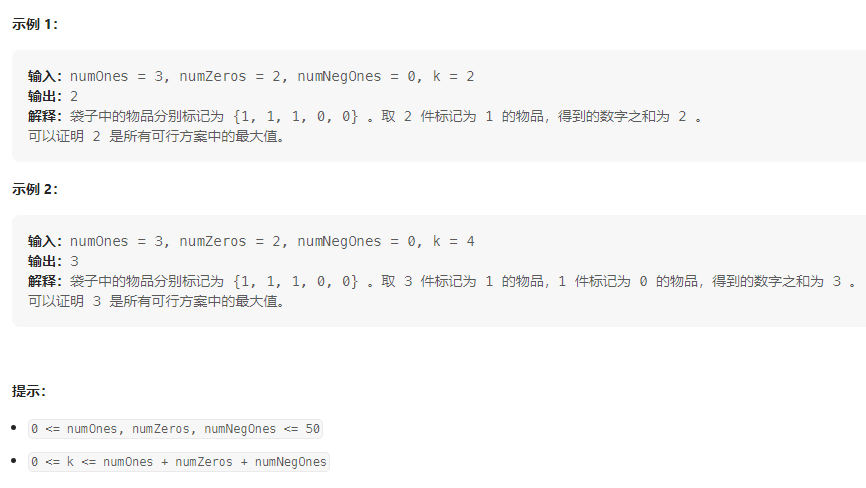

```java
class Solution {
    public int kItemsWithMaximumSum(int numOnes, int numZeros, int numNegOnes, int k) {
        return k <= numOnes ? k : (k - numOnes - numZeros < 0 ? numOnes : 2 * numOnes - k + numZeros);
    }
}
```
### 2178. 拆分成最多数目的正偶数之和

给你一个整数 finalSum 。请你将它拆分成若干个 互不相同 的正偶数之和，且拆分出来的正偶数数目 最多 。

- 比方说，给你` finalSum = 12 `，那么这些拆分是 符合要求 的（互不相同的正偶数且和为 `finalSum`）：`(2 + 10) ，(2 + 4 + 6) 和 (4 + 8)` 。它们中，`(2 + 4 + 6) `包含最多数目的整数。

注意 `finalSum` 不能拆分成 `(2 + 2 + 4 + 4)` ，因为拆分出来的整数必须互不相同。
请你返回一个整数数组，表示将整数拆分成 最多 数目的正偶数数组。如果没有办法将 `finalSum` 进行拆分，请你返回一个 空 数组。你可以按 任意 顺序返回这些整数。

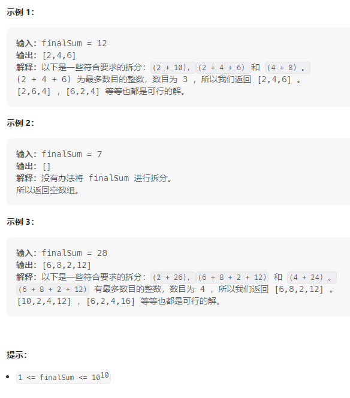

```java
class Solution {
    public List<Long> maximumEvenSplit(long finalSum) {
        List<Long> res = new ArrayList<>();
        if (finalSum % 2 != 0) {
            return res;
        }
        for (long i = 2; i <= finalSum; i += 2) {
            res.add(i);
            finalSum -= i;
        }
        int k = res.size() - 1;
        res.set(k, res.get(k) + finalSum);
        return res;
    }
}
```

## 字符串

### 2446. 判断两个事件是否存在冲突

给你两个字符串数组 event1 和 event2 ，表示发生在同一天的两个闭区间时间段事件，其中：

- `event1 = [startTime1, endTime1]` 且
- `event2 = [startTime2, endTime2]`
事件的时间为有效的 24 小时制且按 HH:MM 格式给出。

当两个事件存在某个非空的交集时（即，某些时刻是两个事件都包含的），则认为出现 冲突 。

如果两个事件之间存在冲突，返回 true ；否则，返回 false 。

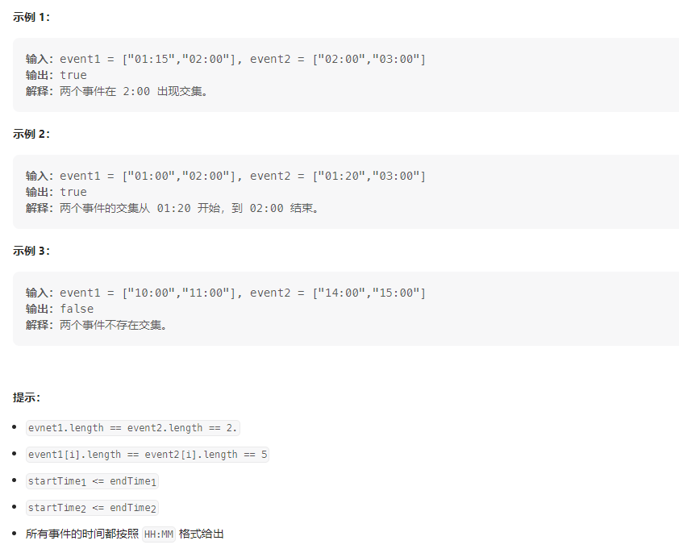

```java
class Solution {
    public boolean haveConflict(String[] event1, String[] event2) {
        return !(event1[1].compareTo(event2[0]) < 0 || event2[1].compareTo(event1[0]) < 0);
    }
}
```

### 415. 字符串相加

给定两个字符串形式的非负整数 num1 和num2 ，计算它们的和并同样以字符串形式返回。

你不能使用任何內建的用于处理大整数的库（比如 BigInteger）， 也不能直接将输入的字符串转换为整数形式。

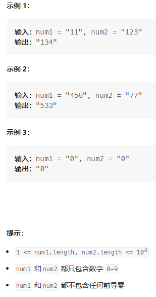

```java
class Solution {
    public String addStrings(String num1, String num2) {
        int l1 = num1.length(), l2 = num2.length();
        StringBuilder sb = new StringBuilder();
        int cur = 0;
        for (int i = l1 - 1, j = l2 - 1; i >= 0 || j >= 0;) {
            if (i >= 0) {
                cur += num1.charAt(i --) - '0';
            }
            if (j >= 0) {
                cur += num2.charAt(j --) - '0';
            }
            sb.append(cur % 10);
            cur /= 10;
        }
        if (cur != 0) {
            sb.append(cur);
        }
        return sb.reverse().toString();
    }
}
```

## 数组

### 57. 插入区间

给你一个 **无重叠的** ，按照区间起始端点排序的区间列表。

在列表中插入一个新的区间，你需要确保列表中的区间仍然有序且不重叠（如果有必要的话，可以合并区间）。

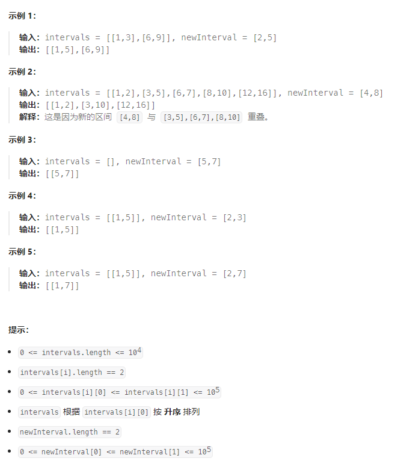

```java
class Solution {
    public int[][] insert(int[][] intervals, int[] newInterval) {
        int n = intervals.length;
        List<int[]> res = new ArrayList<>();
        boolean flag = false;
        for (int[] x : intervals) {
            if (x[1] < newInterval[0]) {
                res.add(x);
            } else if (x[0] > newInterval[1]) {
                if (!flag) {
                    flag = true;
                    res.add(newInterval);
                }
                res.add(x);
            } else {
                newInterval[0] = Math.min(x[0], newInterval[0]);
                newInterval[1] = Math.max(x[1], newInterval[1]);
            }
        }
        if (!flag) {
            res.add(newInterval);
        }
        return res.toArray(new int[res.size()][]);
    }
}
```

### 2731. 移动机器人

有一些机器人分布在一条无限长的数轴上，他们初始坐标用一个下标从 **0** 开始的整数数组 `nums` 表示。当你给机器人下达命令时，它们以每秒钟一单位的速度开始移动。

给你一个字符串 `s` ，每个字符按顺序分别表示每个机器人移动的方向。`'L'` 表示机器人往左或者数轴的负方向移动，`'R'` 表示机器人往右或者数轴的正方向移动。

当两个机器人相撞时，它们开始沿着原本相反的方向移动。

请你返回指令重复执行 `d` 秒后，所有机器人之间两两距离之和。由于答案可能很大，请你将答案对 `109 + 7` 取余后返回。

**注意：**

- 对于坐标在 `i` 和 `j` 的两个机器人，`(i,j)` 和 `(j,i)` 视为相同的坐标对。也就是说，机器人视为无差别的。
- 当机器人相撞时，它们 **立即改变** 它们的前进方向，这个过程不消耗任何时间。
- 当两个机器人在同一时刻占据相同的位置时，就会相撞。
  - 例如，如果一个机器人位于位置 0 并往右移动，另一个机器人位于位置 2 并往左移动，下一秒，它们都将占据位置 1，并改变方向。再下一秒钟后，第一个机器人位于位置 0 并往左移动，而另一个机器人位于位置 2 并往右移动。
  - 例如，如果一个机器人位于位置 0 并往右移动，另一个机器人位于位置 1 并往左移动，下一秒，第一个机器人位于位置 0 并往左行驶，而另一个机器人位于位置 1 并往右移动。

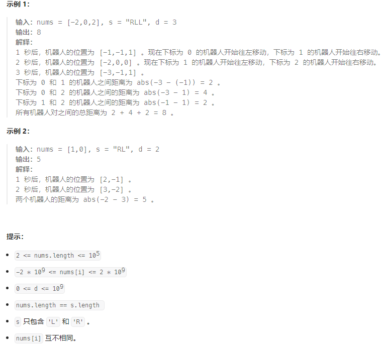

**思路**

> 1. 两个机器人相互碰撞, 只进行方向交换, 并且机器人是视为无差别的, 那么可以看做所有机器人之间不存在碰撞, 可以相互穿过，只需要将机器人根据对应方向加上或减去d秒移动的距离(d个单位长度)。
>
> 2. 然后将移动后的坐标点排序, 来计算两两之间的距离。

下图 表示在O(n)复杂度, 求两两之间的距离和 (有序的)

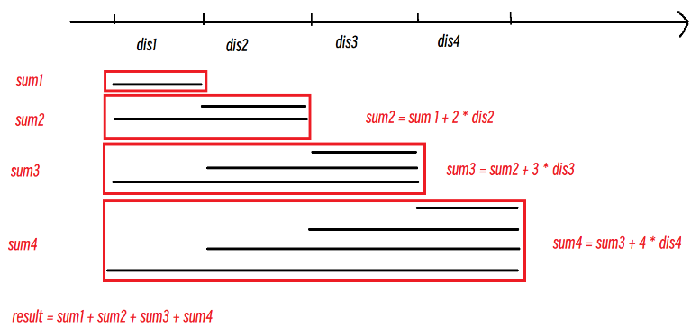

```java
class Solution {
    public int sumDistance(int[] nums, String s, int d) {
        int n = nums.length;
        long[] arr = new long[n];
        for (int i = 0; i < n; i ++) {
            arr[i] = nums[i] + (s.charAt(i) == 'R' ? d : -d);
        }
        Arrays.sort(arr);
        final int MOD = 1000000007;
        long res = 0, sum = 0;
        for (int i = 1; i < n; i ++) {
            long x = arr[i] - arr[i - 1];
            sum = sum % MOD + (i * x) % MOD;
            res = res % MOD + sum % MOD;
        }
        return (int) res % MOD;
    }
}
```

### 2815. 数组中的最大数对和

给你一个下标从 0 开始的整数数组 nums 。请你从 nums 中找出和 最大 的一对数，且这两个数数位上最大的数字相等。

返回最大和，如果不存在满足题意的数字对，返回 -1 。

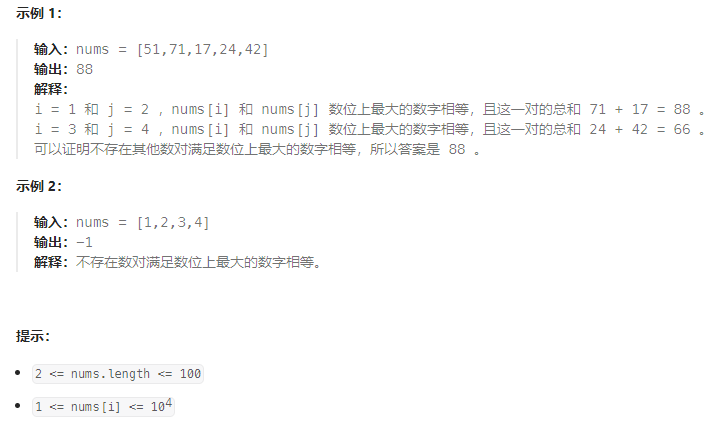

```java
class Solution {
    public int maxSum(int[] nums) {
        int ans = -1;
        int[] max_val = new int[10];
        Arrays.fill(max_val, Integer.MIN_VALUE);
        for (int x : nums) {
            int max_idx = getMax(x);
            ans = Math.max(ans, x + max_val[max_idx]);
            max_val[max_idx] = Math.max(max_val[max_idx], x);    
        }
        return ans;
    }
    int getMax(int x) {
        int max = 0;
        while (x > 0) {
            max = Math.max(max, x % 10);
            x /= 10;
        }
        return max;
    }
}
```

## 链表

### 2816. 翻倍以链表形式表示的数字

给你一个 非空 链表的头节点 head ，表示一个不含前导零的非负数整数。

将链表 翻倍 后，返回头节点 head 。

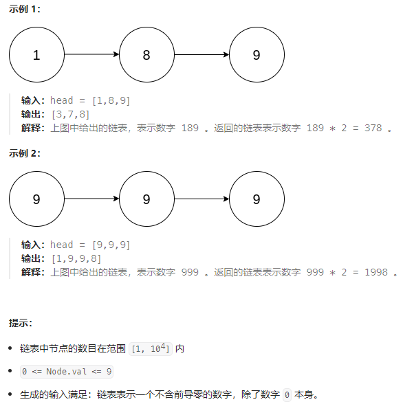

**翻转链表**

```java
/**
 * Definition for singly-linked list.
 * public class ListNode {
 *     int val;
 *     ListNode next;
 *     ListNode() {}
 *     ListNode(int val) { this.val = val; }
 *     ListNode(int val, ListNode next) { this.val = val; this.next = next; }
 * }
 */
class Solution {
    public ListNode doubleIt(ListNode head) {
        ListNode p = reverse(head);
        ListNode dummy = new ListNode(-1);
        dummy.next = p;
        int cur = 0;
        while(p != null) {
            cur += p.val * 2;
            p.val = cur % 10;
            cur /= 10;
            p = p.next;
        }
        dummy.next = reverse(dummy.next);
        if (cur != 0) {
            ListNode node = new ListNode(cur);
            node.next = dummy.next;
            dummy.next = node;
        }
        return dummy.next;
    }
    ListNode reverse(ListNode head) {
        ListNode dummy = new ListNode(-1), p = head;
        while(p != null) {
            ListNode temp = p.next;
            p.next = dummy.next;
            dummy.next = p;
            p = temp;
        }
        return dummy.next;
    }
}
```

**不翻转链表（推荐使用）**

```java
class Solution {
    public ListNode doubleIt(ListNode head) {
        if (head.val >= 5) {
            head = new ListNode(0, head);
        }
        var cur = head;
        while (cur != null) {
            cur.val = cur.val * 2 % 10;
            if (cur.next != null && cur.next.val >= 5) {
                cur.val += 1;
            }
            cur = cur.next;
        }
        return head;
    }
}
```

## 二分

### 34. 在排序数组中查找元素的第一个和最后一个位置

给你一个按照非递减顺序排列的整数数组 nums，和一个目标值 `target`。请你找出给定目标值在数组中的开始位置和结束位置。

如果数组中不存在目标值 `target`，返回 `[-1, -1]`。

你必须设计并实现时间复杂度为 `O(log n)` 的算法解决此问题。

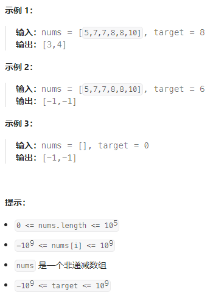

```java
class Solution {
    public int[] searchRange(int[] nums, int target) {
        int[] res = new int[]{-1, -1};
        if (nums.length == 0) {
            return res;
        }
        int l = 0, r = nums.length - 1;
        while (l < r) {
            int mid = (l + r) / 2;
            if (nums[mid] < target) {
                l = mid + 1;
            } else {
                r = mid;
            }
        }
        if (nums[l] == target) {
            res[0] = l;
        }
        l = 0; r = nums.length - 1;
        while (l < r) {
            int mid = (l + r + 1) / 2;
            if (nums[mid] > target) {
                r = mid - 1;
            } else {
                l = mid;
            }
        }
        if (nums[r] == target) {
            res[1] = r;
        }
        return res;
    }
}
```

### 153. 寻找旋转排序数组中的最小值

已知一个长度为 n 的数组，预先按照升序排列，经由 1 到 n 次 旋转 后，得到输入数组。例如，原数组 `nums = [0,1,2,4,5,6,7]` 在变化后可能得到：

- 若旋转 4 次，则可以得到 `[4,5,6,7,0,1,2]`
- 若旋转 7 次，则可以得到 [0,1,2,4,5,6,7]

**注意**，数组 `[a[0], a[1], a[2], ..., a[n-1]]` 旋转一次 的结果为数组 `[a[n-1], a[0], a[1], a[2], ..., a[n-2]]` 。

给你一个元素值 互不相同 的数组 nums ，它原来是一个升序排列的数组，并按上述情形进行了多次旋转。请你找出并返回数组中的 最小元素 。

你必须设计一个时间复杂度为 O(log n) 的算法解决此问题。

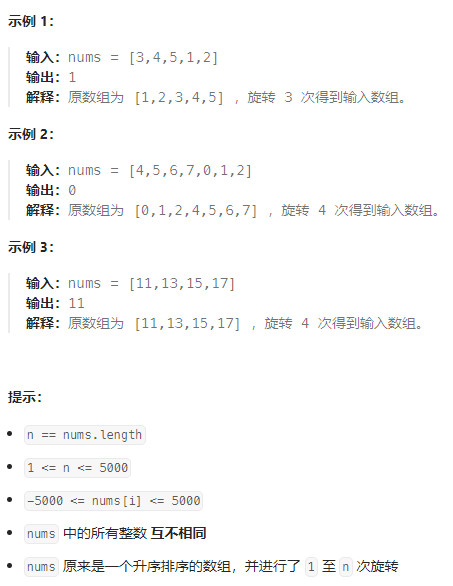

```java
class Solution {
    public int findMin(int[] nums) {
        int l = 0, r = nums.length - 1;
        if (nums[r] >= nums[0]) {
            return nums[0];
        }
        while (l < r) {
            int mid = l + r >> 1;
            if (nums[mid] < nums[0]) {
                r = mid;
            } else {
                l = mid + 1;
            }
        }
        return nums[r];
    }
}
```

### 167. 两数之和 II - 输入有序数组

给你一个下标从 1 开始的整数数组 numbers ，该数组已按 非递减顺序排列  ，请你从数组中找出满足相加之和等于目标数 target 的两个数。如果设这两个数分别是 numbers[index1] 和 numbers[index2] ，则 1 <= index1 < index2 <= numbers.length 。

以长度为 2 的整数数组 [index1, index2] 的形式返回这两个整数的下标 index1 和 index2。

你可以假设每个输入 只对应唯一的答案 ，而且你 不可以 重复使用相同的元素。

你所设计的解决方案必须只使用常量级的额外空间。

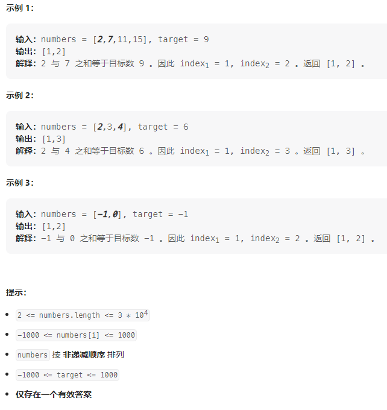

```java
class Solution {
    public int[] twoSum(int[] numbers, int target) {
        int i = 0, j = numbers.length - 1;
        while (i < j) {
            int x = numbers[i] + numbers[j];
            if (x == target) {
                return new int[]{i + 1, j + 1};
            } else if (x < target) {
                i ++;
            } else {
                j --;
            }
        }
        return new int[]{0, 0};
    }
}
```

### 275. H 指数

给你一个整数数组 `citations` ，其中 `citations[i]` 表示研究者的第 `i` 篇论文被引用的次数，`citations` 已经按照 **升序排列** 。计算并返回该研究者的 h 指数。

[h 指数的定义](https://baike.baidu.com/item/h-index/3991452?fr=aladdin)：h 代表“高引用次数”（high citations），一名科研人员的 `h` 指数是指他（她）的 （`n` 篇论文中）**总共**有 `h` 篇论文分别被引用了**至少** `h` 次。

请你设计并实现对数时间复杂度的算法解决此问题。

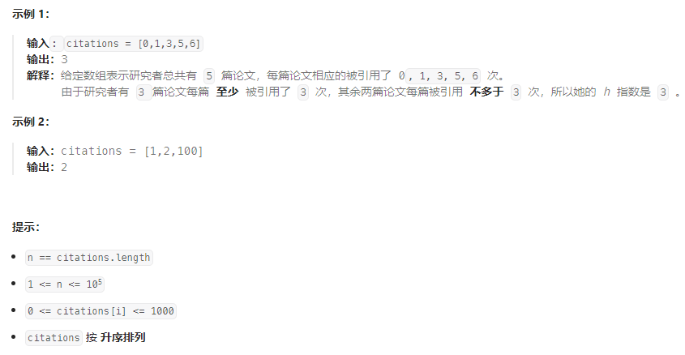

```java
class Solution {
    public int hIndex(int[] citations) {
        int n = citations.length;
        int l = 0, r = n - 1;
        while (l <= r) {
            int mid = l + (r - l) / 2;
            if (citations[mid] >= n - mid) {
                r = mid - 1;
            } else {
                l = mid + 1;
            }
        }
        return n - l;
    }
}
```

### 2251. 花期内花的数目

给你一个下标从 **0** 开始的二维整数数组 `flowers` ，其中 `flowers[i] = [starti, endi]` 表示第 `i` 朵花的 **花期** 从 `starti` 到 `endi` （都 **包含**）。同时给你一个下标从 **0** 开始大小为 `n` 的整数数组 `people` ，`people[i]` 是第 `i` 个人来看花的时间。

请你返回一个大小为 `n` 的整数数组 `answer` ，其中 `answer[i]`是第 `i` 个人到达时在花期内花的 **数目** 。


```java
class Solution {
    public int[] fullBloomFlowers(int[][] flowers, int[] people) {
        int n = flowers.length;
        int[] start = new int[n], end = new int[n];
        for (int i = 0; i < n; i ++) {
            start[i] = flowers[i][0];
            end[i] = flowers[i][1];
        }
        Arrays.sort(start);
        Arrays.sort(end);
        int m = people.length;
        int[] ans = new int[m];
        for (int i = 0; i < m; i ++) {
            int x = find(start, people[i] + 1);
            int y = find(end, people[i]);
            ans[i] = x - y;
        }
        return ans;
    }
    int find(int[] arr, int x) {
        int l = 0, r = arr.length - 1, res = arr.length;
        while (l <= r) {
            int mid = l + r >> 1;
            if (arr[mid] < x) {
                l = mid + 1;
            } else {
                res = mid;
                r = mid - 1;
            }
        }
        return res;
    }
}
```

### 2560. 打家劫舍 IV

沿街有一排连续的房屋。每间房屋内都藏有一定的现金。现在有一位小偷计划从这些房屋中窃取现金。

由于相邻的房屋装有相互连通的防盗系统，所以小偷 `不会窃取相邻的房屋` 。

小偷的 `窃取能力` 定义为他在窃取过程中能从单间房屋中窃取的 `最大金额` 。

给你一个整数数组 nums 表示每间房屋存放的现金金额。形式上，从左起第 i 间房屋中放有 nums[i] 美元。

另给你一个整数 k ，表示窃贼将会窃取的 最少 房屋数。小偷总能窃取至少 k 间房屋。

返回小偷的 `最小` 窃取能力。

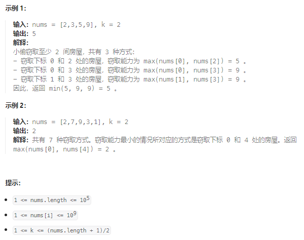

```java
class Solution {
    public int minCapability(int[] nums, int k) {
        int lower = Arrays.stream(nums).min().getAsInt();
        int upper = Arrays.stream(nums).max().getAsInt();
        while (lower <= upper) {
            int middle = (lower + upper) / 2;
            int count = 0;
            boolean visited = false;
            for (int x : nums) {
                if (x <= middle && !visited) {
                    count++;
                    visited = true;
                } else {
                    visited = false;
                }
            }
            if (count >= k) {
                upper = middle - 1;
            } else {
                lower = middle + 1;
            }
        }
        return lower;
    }
}
```

### 2594. 修车的最少时间

给你一个整数数组 ranks ，表示一些机械工的 能力值 。ranksi 是第 i 位机械工的能力值。能力值为 r 的机械工可以在 r * n2 分钟内修好 n 辆车。

同时给你一个整数 cars ，表示总共需要修理的汽车数目。

请你返回修理所有汽车 最少 需要多少时间。

注意：所有机械工可以同时修理汽车。

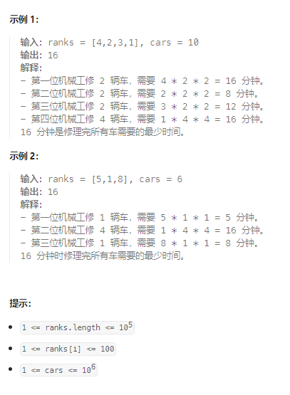

```java
class Solution {
    public long repairCars(int[] ranks, int cars) {
        long left = 1, right = 1l * ranks[0] * cars * cars;
        while (left < right) {
            long mid = (right - left) / 2 + left;
            if (check(ranks, cars, mid)) {
                right = mid;
            } else {
                left = mid + 1;
            }
        }
        return right;
    }
    boolean check(int[] ranks, int cars, long k) {
        long cnt = 0;
        for (int x : ranks) {
            cnt += (long) Math.sqrt(k / x); 
        }
        return cnt >= cars;
    }
}
```

### 2817. 限制条件下元素之间的最小绝对差

给你一个下标从 0 开始的整数数组 nums 和一个整数 x 。

请你找到数组中下标距离至少为 x 的两个元素的 差值绝对值 的 最小值 。

换言之，请你找到两个下标 i 和 j ，满足 `abs(i - j) >= x 且 abs(nums[i] - nums[j])` 的值最小。

请你返回一个整数，表示下标距离至少为 x 的两个元素之间的差值绝对值的 最小值 。

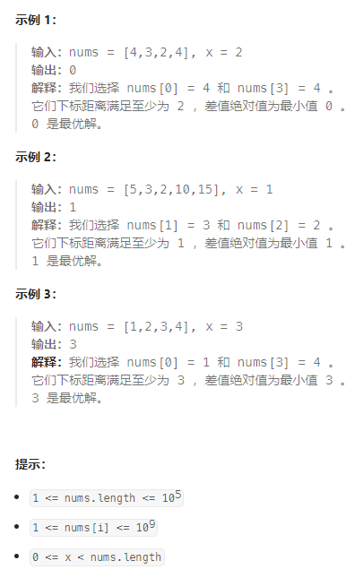

**二分法**
枚举 i 和 j ，其中 j = i + x，这样从 0 ~ i 范围内都是 nums[j] 可以配对的数字。 将 0 ~ i 的数字排序之后，就可以使用二分查找寻找其中最接近 nums[j] 的数字了。

```java
class Solution {
    public int minAbsoluteDifference(List<Integer> nums, int x) {
        int n = nums.size(), ans = Integer.MAX_VALUE;
        List<Integer> ls = new ArrayList();         // 维护前面元素的有序序列（升序）
        for (int i = 0, j = x; j < n; ++i, ++j) {
            // 将nums[i]加入有序序列ls，使用二分查找寻找nums[i]应该插入的位置。
            int l = 0, r = ls.size(), v = nums.get(i);
            while (l < r) {
                int mid = l + r >> 1;
                if (ls.get(mid) <= v) l = mid + 1;
                else r = mid;
            }
            ls.add(l, v);
            
            // 使用二分查找寻找前面序列中最后一个<=nums[j]的元素
            l = 0;
            r = ls.size() - 1;
            v = nums.get(j);
            while (l < r) {
                int mid = l + r + 1 >> 1;
                if (ls.get(mid) > v) r = mid - 1;
                else l = mid;
            }
            // 使用和nums[j]最接近的元素更新答案
            ans = Math.min(ans, Math.abs(v - ls.get(l)));
            if (l + 1 < ls.size()) ans = Math.min(ans, Math.abs(ls.get(l + 1) - v));
        }
        return ans;
    }
}
```

**使用API**
TreeSet 会自动排序，关于 TreeSet 可见：https://docs.oracle.com/en/java/javase/11/docs/api/java.base/java/util/TreeSet.html#ceiling(E)

- floor()：返回集合中小于或等于给定元素的最大元素，如果没有这样的元素，则返回null。
- ceiling()：返回集合中大于或等于给定元素的最小元素，如果不存在这样的元素则返回null。

```java
class Solution {
    public int minAbsoluteDifference(List<Integer> nums, int x) {
        var a = nums.stream().mapToInt(i -> i).toArray();
        int ans = Integer.MAX_VALUE, n = a.length;
        var s = new TreeSet<Integer>();
        s.add(Integer.MAX_VALUE);
        s.add(Integer.MIN_VALUE / 2);
        for (int i = x; i < n; i ++) {
            s.add(a[i - x]);
            int y = a[i];
            ans = Math.min(ans, Math.min(s.ceiling(y) - y, y - s.floor(y)));
        }
        return ans;
    }
}
```

## 双指针

### 15. 三数之和

给你一个整数数组 nums ，判断是否存在三元组 `[nums[i], nums[j], nums[k]]` 满足 `i != j、i != k 且 j != k` ，同时还满足 `nums[i] + nums[j] + nums[k] == 0 `。请

你返回所有和为 0 且不重复的三元组。

> 注意：答案中不可以包含重复的三元组。

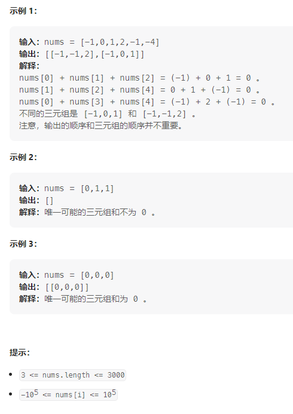

```java
class Solution {
    public List<List<Integer>> threeSum(int[] nums) {
        int n = nums.length;
        Arrays.sort(nums);
        List<List<Integer>> ans = new ArrayList<>();
        for (int l = 0; l < n; l ++) {
            if (l > 0 && nums[l] == nums[l - 1]) {
                continue;
            }
            int r = n - 1;
            int target = -nums[l];
            for (int m = l + 1; m < n; m ++) {
                if (m > l + 1 && nums[m] == nums[m - 1]) {
                    continue;
                }
                while (m < r && nums[m] + nums[r] > target) {
                    r --;
                }
                if (m == r) {
                    break;
                }
                if (nums[m] + nums[r] == target) {
                    ans.add(List.of(nums[l], nums[m], nums[r]));
                }
            }
        }
        return ans;
    }
}
```

### 18. 四数之和

给你一个由 n 个整数组成的数组 nums ，和一个目标值 target 。请你找出并返回满足下述全部条件且不重复的四元组 [nums[a], nums[b], nums[c], nums[d]] （若两个四元组元素一一对应，则认为两个四元组重复）：

- `0 <= a, b, c, d < n`
- `a、b、c 和 d 互不相同`
- `nums[a] + nums[b] + nums[c] + nums[d] == target`

你可以按 任意顺序 返回答案 。

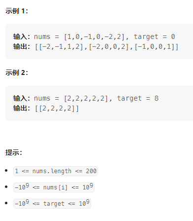

```java
class Solution {
    public List<List<Integer>> fourSum(int[] nums, int target) {
        Arrays.sort(nums);
        List<List<Integer>> ans = new ArrayList<>();
        int n = nums.length;
        for (int a = 0; a < n - 3; a ++) {
            long x = nums[a];
            if (a > 0 && x == nums[a - 1]) continue;
            if (x + nums[a + 1] + nums[a + 2] + nums[a + 3] > target) break;
            if (x + nums[n - 1] + nums[n - 2] + nums[n - 3] < target) continue;
            for (int b = a + 1; b < n - 2; b ++) {
                long y = nums[b];
                if (b > a + 1 && y == nums[b - 1]) continue;
                if (x + y + nums[b + 1] + nums[b + 1] > target) break;
                if (x + y + nums[n - 1] + nums[n - 2] < target) continue;
                int c = b + 1, d = n - 1;
                while (c < d) {
                    long s = x + y + nums[c] + nums[d];
                    if (s < target) {
                        c ++;
                    } else if (s > target) {
                        d --;
                    } else {
                        ans.add(List.of((int) x, (int) y, nums[c], nums[d]));
                        for (c ++; c < d && nums[c] == nums[c - 1]; c ++);
                        for (d --; d > c && nums[d] == nums[d + 1]; d --);
                    }
                }
            }
        }
        return ans;
    }
}
```

### 228. 汇总区间

给定一个  无重复元素 的 有序 整数数组 nums 。

返回 **恰好覆盖数组中所有数字** 的 最小有序 区间范围列表 。也就是说，nums 的每个元素都恰好被某个区间范围所覆盖，并且不存在属于某个范围但不属于 nums 的数字 x 。

列表中的每个区间范围 [a,b] 应该按如下格式输出：

- `"a->b" ，如果 a != b`
- `"a" ，如果 a == b`

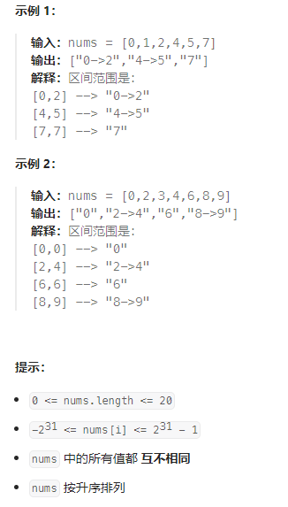

```java
class Solution {
    public List<String> summaryRanges(int[] nums) {
        int n = nums.length;
        List<String> res = new ArrayList<>();
        for (int i = 0; i < n; i ++) {
            int j = i + 1;  
            while (j < n && nums[j] == nums[j - 1] + 1) {
                j ++;
            }
            if (i + 1 == j) {
                res.add(Integer.toString(nums[i]));
            } else {
                res.add(nums[i] + "->" + nums[j - 1]);
            }
            i = j - 1;
        }
        return res;
    }
}
```
### 849. 到最近的人的最大距离

给你一个数组 seats 表示一排座位，其中 seats[i] = 1 代表有人坐在第 i 个座位上，seats[i] = 0 代表座位 i 上是空的（下标从 0 开始）。

至少有一个空座位，且至少有一人已经坐在座位上。

亚历克斯希望坐在一个能够使他与离他最近的人之间的距离达到最大化的座位上。

返回他到离他最近的人的最大距离。

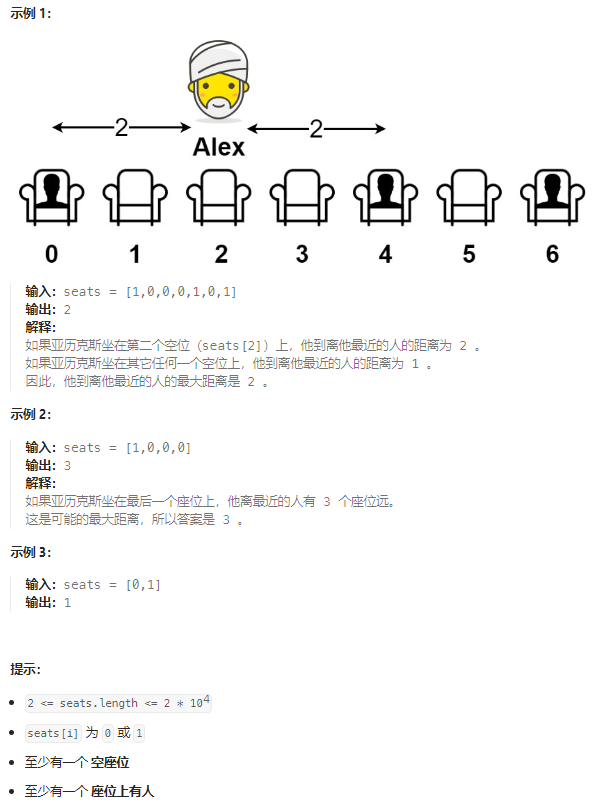

```java
class Solution {
    public int maxDistToClosest(int[] seats) {
        int res = 0;
        for (int i = 0; i < seats.length; i ++) {
            if (seats[i] == 1) {
                continue;
            }
            int j = i + 1;
            while (j < seats.length && seats[j] == 0) {
                j ++;
            }
            if (i == 0 || j == seats.length) {
                res = Math.max(res, j - i);
            } else {
                res = Math.max(res, (j - i + 1) / 2);
            }
        }
        return res;
    }
}
```

## 数学

### 453. 最小操作次数使数组元素相等

给你一个长度为 n 的整数数组，每次操作将会使 n - 1 个元素增加 1 。返回让数组所有元素相等的最小操作次数。

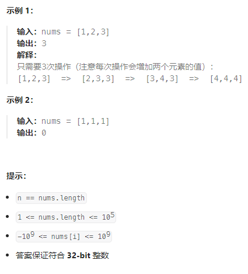

```java
class Solution {
    public int minMoves(int[] nums) {
        // 每次操作将会使 n - 1 个元素增加 1 <=> 将 1 个元素 减去 1
        int min = Integer.MAX_VALUE;
        for (int x : nums) {
            min = Math.min(min, x);
        }
        int res = 0;
        for (int x : nums) {
            res += x - min;
        }
        return res;
    }
}
```

### 2544. 交替数字和

给你一个正整数 n 。n 中的每一位数字都会按下述规则分配一个符号：

- 最高有效位 上的数字分配到 正 号。
- 剩余每位上数字的符号都与其相邻数字相反。

返回所有数字及其对应符号的和。

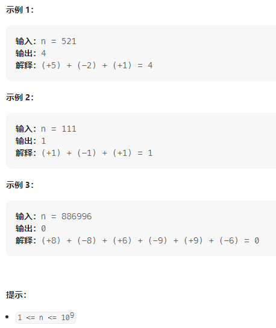

```java
class Solution {
    public int alternateDigitSum(int n) {
        int res = 0, sign = 1;
        while (n > 0) {
            res += n % 10 * sign;
            sign = -sign;
            n /= 10;
        }
        return -sign * res;
    }
}
```

## 动态规划

### 53. 最大子数组和

给你一个整数数组 nums ，请你找出一个具有最大和的连续子数组（子数组最少包含一个元素），返回其最大和。

子数组 是数组中的一个连续部分。

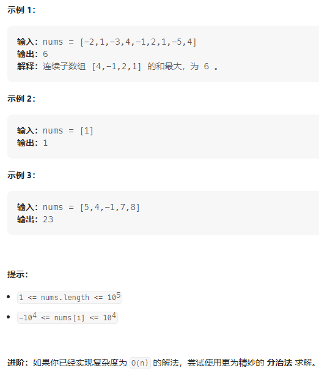

```java
class Solution {
    public int maxSubArray(int[] nums) {
        int ans = Integer.MIN_VALUE, sum = 0;
        for (int x : nums) {
            sum = Math.max(sum, 0) + x;
            ans = Math.max(ans, sum);
        }
        return ans;
    }
}
```

### 132. 分割回文串 II

给你一个字符串 s，请你将 s 分割成一些子串，使每个子串都是回文。

返回符合要求的 最少分割次数 。

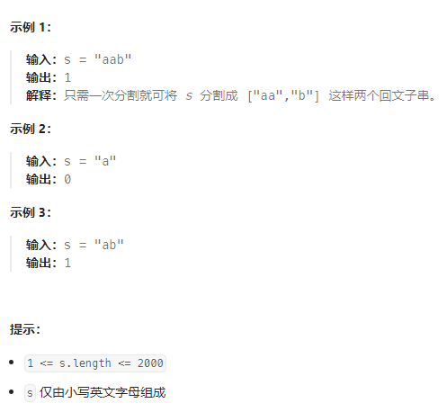

```java
class Solution {
    public int minCut(String s) {
        s = " " + s;
        int n = s.length();
        int[] f = new int[n];
        boolean[][] g = new boolean[n][n];
        
        Arrays.fill(f, Integer.MAX_VALUE);
        for (int i = 0; i < n; i ++) {
            Arrays.fill(g[i], true);
        }

        for (int i = n - 1; i >= 0; i --) {
            for (int j = i + 1; j < n; j ++) {
                g[i][j] = (s.charAt(i) == s.charAt(j)) && g[i + 1][j - 1];
            }
        }

        f[0] = 0;
        for (int i = 0; i < n; i ++) {
            for (int j = 0; j <= i; j ++) {
                if (g[j][i] && j != 0) {
                    f[i] = Math.min(f[i], f[j - 1] + 1);
                }
            }
        }
        return f[n - 1] - 1;
    }
}
```

### 188. 买卖股票的最佳时机 IV

给你一个整数数组 `prices` 和一个整数 `k` ，其中 `prices[i]` 是某支给定的股票在第 `i` 天的价格。

设计一个算法来计算你所能获取的最大利润。你最多可以完成 `k` 笔交易。也就是说，你最多可以买 `k` 次，卖 `k` 次。

**注意：**你不能同时参与多笔交易（你必须在再次购买前出售掉之前的股票）。

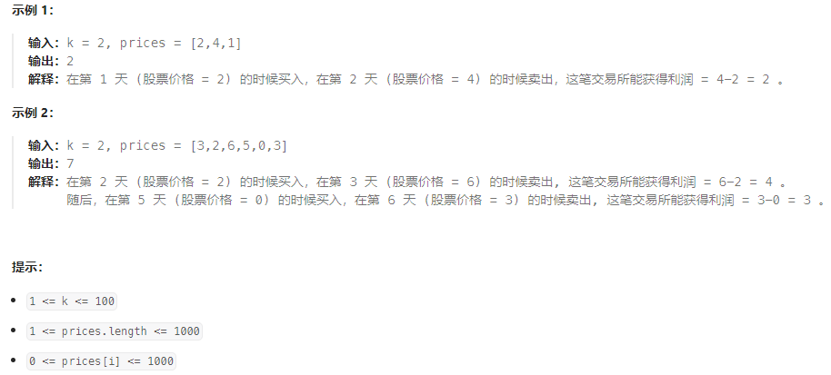

```java
class Solution {
    public int maxProfit(int k, int[] prices) {
        int n = prices.length;
        int[][][] f = new int[n + 1][k + 2][2];
        for (int i = 0; i < n; i ++) {
            for (int j = 0; j <= k + 1; j ++) {
                Arrays.fill(f[i][j], Integer.MIN_VALUE / 2);
            }
        }
        for (int j = 1; j <= k + 1; j ++) {
            f[0][j][0] = 0;
        }
        for (int i = 0; i < n; i ++) {
            for (int j = 1; j <= k + 1; j ++) {
                f[i + 1][j][0] = Math.max(f[i][j][0], f[i][j][1] + prices[i]);
                f[i + 1][j][1] = Math.max(f[i][j][1], f[i][j - 1][0] - prices[i]);
            }
        }
        return f[n][k + 1][0];
    }
}
```

### 309. 买卖股票的最佳时机含冷冻期

给定一个整数数组`prices`，其中第 `prices[i]` 表示第 `*i*` 天的股票价格 。

设计一个算法计算出最大利润。在满足以下约束条件下，你可以尽可能地完成更多的交易（多次买卖一支股票）:

- 卖出股票后，你无法在第二天买入股票 (即冷冻期为 1 天)。

**注意：**你不能同时参与多笔交易（你必须在再次购买前出售掉之前的股票）。

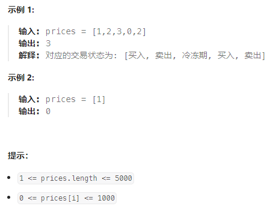

```java
class Solution {
    public int maxProfit(int[] prices) {
        /**
        f[i][j]表示收益 j=0: 持有股票 j=1: 未持有股票，处于冷冻期 j=2: 未持有股票，未处于冷冻期
        f[i][0] = max(f[i - 1][0], f[i - 1][2] - prices[i]);
        f[i][1] = f[i - 1][0] + prices[i];
        f[i][2] = max(f[i - 1][1], f[i - 1][2]);
        */
        int n = prices.length;
        if (n == 0) {
            return 0;
        }
        int[][] f = new int[n + 1][3];
        f[0][0] = -prices[0];
        for (int i = 1; i <= n; i ++) {
            f[i][0] = Math.max(f[i - 1][0], f[i - 1][2] - prices[i - 1]);
            f[i][1] = f[i - 1][0] + prices[i - 1];
            f[i][2] = Math.max(f[i - 1][1], f[i - 1][2]);
        }
        return Math.max(f[n][1], f[n][2]);

        // 优化空间
        // int f0 = -prices[0], f1 = 0, f2 = 0;
        // for (int x : prices) {
        //     int new_f0 = Math.max(f0, f2 - x);
        //     int new_f1 = f0 + x;
        //     int new_f2 = Math.max(f1, f2);
        //     f0 = new_f0;
        //     f1 = new_f1;
        //     f2 = new_f2;
        // }
        // return Math.max(f1, f2);
    }
}
```

### 337. 打家劫舍 III

小偷又发现了一个新的可行窃的地区。这个地区只有一个入口，我们称之为 root 。

除了 root 之外，每栋房子有且只有一个“父“房子与之相连。一番侦察之后，聪明的小偷意识到“这个地方的所有房屋的排列类似于一棵二叉树”。 如果 两个直接相连的房子在同一天晚上被打劫 ，房屋将自动报警。

给定二叉树的 root 。返回 `在不触动警报的情况下` ，小偷能够盗取的最高金额 。

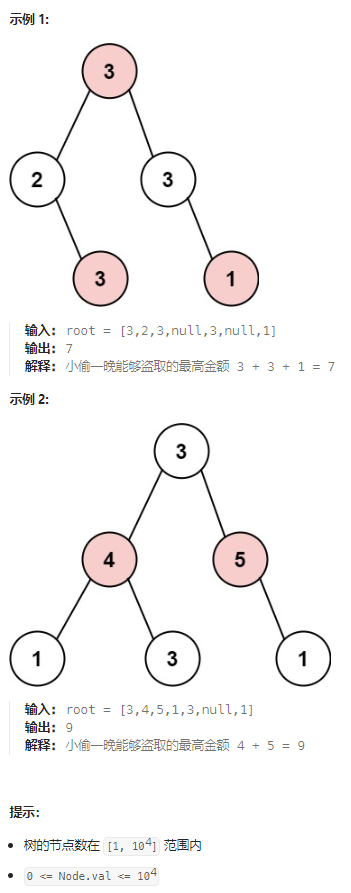

```java
/**
 * Definition for a binary tree node.
 * public class TreeNode {
 *     int val;
 *     TreeNode left;
 *     TreeNode right;
 *     TreeNode() {}
 *     TreeNode(int val) { this.val = val; }
 *     TreeNode(int val, TreeNode left, TreeNode right) {
 *         this.val = val;
 *         this.left = left;
 *         this.right = right;
 *     }
 * }
 */
class Solution {
    Map<TreeNode, Integer> f = new HashMap<>();
    Map<TreeNode, Integer> g = new HashMap<>();
    
    public int rob(TreeNode root) {
        dfs(root);
        return Math.max(f.getOrDefault(root, 0), g.getOrDefault(root, 0)); 
    }
    void dfs(TreeNode root) {
        if (root == null) {
            return;
        }
        dfs(root.left);
        dfs(root.right);
        f.put(root, root.val + g.getOrDefault(root.left, 0) + g.getOrDefault(root.right, 0));
        g.put(root, Math.max(f.getOrDefault(root.left, 0), g.getOrDefault(root.left, 0)) + Math.max(f.getOrDefault(root.right, 0), g.getOrDefault(root.right, 0)));
    }
}
```

### 714. 买卖股票的最佳时机含手续费

给定一个整数数组 `prices`，其中 `prices[i]`表示第 `i` 天的股票价格 ；整数 `fee` 代表了交易股票的手续费用。

你可以无限次地完成交易，但是你每笔交易都需要付手续费。如果你已经购买了一个股票，在卖出它之前你就不能再继续购买股票了。

返回获得利润的最大值。

**注意：**这里的一笔交易指买入持有并卖出股票的整个过程，每笔交易你只需要为支付一次手续费。

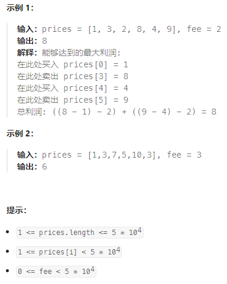

```java
class Solution {
    public int maxProfit(int[] prices, int fee) {
        /**
        f[i][0] = max(f[i - 1][0], f[i - 1][1] + prices[i] - fee)
        f[i][1] = max(f[i - 1][0] + fee - prices[i], f[i - 1][1])
        */
        int n = prices.length;
        int[][] f = new int[n + 1][2];
        f[0][1] = Integer.MIN_VALUE / 2;
        for (int i = 1; i <= n; i ++) {
            f[i][0] = Math.max(f[i - 1][0], f[i - 1][1] + prices[i - 1] - fee);
            f[i][1] = Math.max(f[i - 1][0] - prices[i - 1], f[i - 1][1]);
        }
        return f[n][0];

        // 优化空间
        // int f0 = 0, f1 = Integer.MIN_VALUE / 2;
        // for (int x : prices) {
        //     int new_f0 = Math.max(f0, f1 + x - fee);
        //     int new_f1 = Math.max(f0 - x, f1);
        //     f0 = new_f0;
        //     f1 = new_f1;
        // }
        // return f0;
    }
}
```

### 823. 带因子的二叉树

给出一个含有不重复整数元素的数组 arr ，每个整数 arr[i] 均大于 1。

用这些整数来构建二叉树，每个整数可以使用任意次数。其中：每个非叶结点的值应等于它的两个子结点的值的乘积。

满足条件的二叉树一共有多少个？答案可能很大，返回 对 109 + 7 取余 的结果。

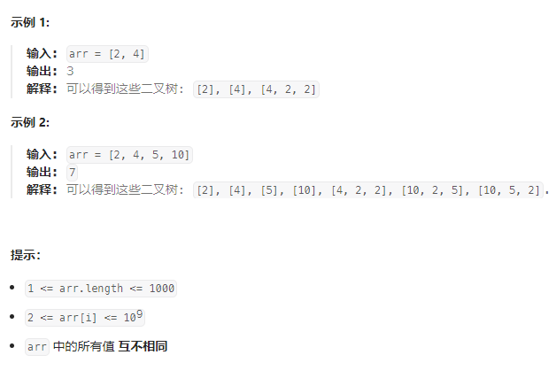

```java
class Solution {
    public int numFactoredBinaryTrees(int[] arr) {
        /**
        考虑以 arr[i] 为根结点的带因子的二叉树，那么它的所有子孙结点的值都小于 arr[i]
        将 arr 从小到大进行排序，那么对于以 arr[i] 为根结点的带因子的二叉树，它的子孙结点值的下标只能在区间 [0,i−1)
        f[i] 表示以第 i 个元素 为根的二叉树的数量
        如 2,3,4,6,8
        f[i]:
            无儿子：1
            有儿子：(3*8)、(8*3)、(4*6)、(6*4) 其中 4*6 的方案数=f[4] * f[6]
        O(n^2)
        */
        Arrays.sort(arr);
        int n = arr.length;
        long[] f = new long[n];
        Map<Integer, Integer> hash = new HashMap<>();
        for (int i = 0; i < n; i ++) {
            hash.put(arr[i], i);
        }
        long res = 0, MOD = 1000000007;
        for (int i = 0; i < n; i ++) {
            f[i] = 1;
            for (int j = 0; j < i; j ++) {
                if (arr[i] % arr[j] == 0) {
                    int d = arr[i] / arr[j];
                    if (hash.containsKey(d)) {
                        int k = hash.get(d);
                        f[i] = (f[i] + f[j] * f[k]) % MOD;
                    }
                }
            }
            res = (res + f[i]) % MOD;
        }
        return (int)res;
    }
}
```

### 918. 环形子数组的最大和

给定一个长度为 n 的环形整数数组 nums ，返回 nums 的非空 子数组 的最大可能和 。

环形数组 意味着数组的末端将会与开头相连呈环状。形式上， nums[i] 的下一个元素是 nums[(i + 1) % n] ， nums[i] 的前一个元素是 nums[(i - 1 + n) % n] 。

子数组 最多只能包含固定缓冲区 nums 中的每个元素一次。形式上，对于子数组 nums[i], nums[i + 1], ..., nums[j] ，不存在 i <= k1, k2 <= j 其中 k1 % n == k2 % n 。

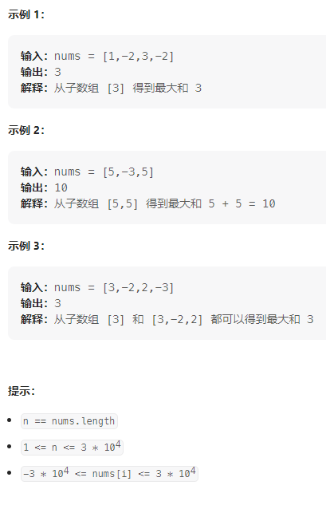

```java
class Solution {
    public int maxSubarraySumCircular(int[] nums) {
        int maxS = Integer.MIN_VALUE, minS = 0;
        int maxF = 0, minF = 0, sum = 0;
        for (int x : nums) {
            maxF = Math.max(maxF, 0) + x;
            maxS = Math.max(maxS, maxF);
            minF = Math.min(minF, 0) + x;
            minS = Math.min(minS, minF);
            sum += x;
        }
        return sum == minS ? maxS : Math.max(maxS, sum - minS);
    }
}
```

### 931. 下降路径最小和

给你一个 n x n 的 方形 整数数组 matrix ，请你找出并返回通过 matrix 的下降路径 的 最小和 。

下降路径 可以从第一行中的任何元素开始，并从每一行中选择一个元素。在下一行选择的元素和当前行所选元素最多相隔一列（即位于正下方或者沿对角线向左或者向右的第一个元素）。具体来说，位置` (row, col) `的下一个元素应当是 `(row + 1, col - 1)、(row + 1, col)` 或者` (row + 1, col + 1)` 。

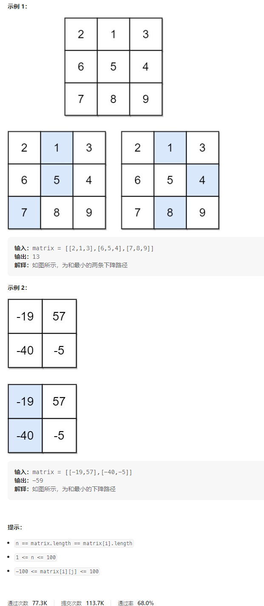

```java
class Solution {
    public int minFallingPathSum(int[][] matrix) {
        int n = matrix.length;
        int[][] dp = new int[n][n];
        System.arraycopy(matrix[0], 0, dp[0], 0, n);
        for (int i = 1; i < n; i ++) {
            for (int j = 0; j < n; j ++) {
                int mn = dp[i - 1][j];
                if (j > 0) {
                    mn = Math.min(mn, dp[i - 1][j - 1]);
                }
                if (j < n - 1) {
                    mn = Math.min(mn, dp[i - 1][j + 1]);
                }
                dp[i][j] = mn + matrix[i][j];
            }
        }
        return Arrays.stream(dp[n - 1]).min().getAsInt();
    }
}
```

.jpg)

### 1155. 掷骰子等于目标和的方法数

这里有 `n` 个一样的骰子，每个骰子上都有 `k` 个面，分别标号为 `1` 到 `k` 。

给定三个整数 `n` , `k` 和 `target` ，返回可能的方式(从总共 `kn` 种方式中)滚动骰子的数量，使正面朝上的数字之和等于 `target` 。

答案可能很大，你需要对 `109 + 7` **取模** 。

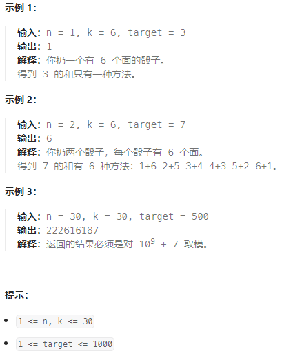

```java
class Solution {
    static final int MOD = 1000000007;
    public int numRollsToTarget(int n, int k, int target) {
        /**
        f[i][j] 投第i个骰子时，和为 j的方案数
        f[i + 1][j + 1] = f[i][j] + f[i][j - 1] + f[i][j - 2] + f[i][j - 3] + ... + f[i][j - k + 1]
        */
        int[][] f = new int[n + 1][target + 1];
        f[0][0] = 1;
        for (int i = 0; i < n; i ++) {
            for (int j = 0; j < target; j ++) {
                for (int v = 0; v < k; v ++) {
                    if (j - v >= 0) {
                        f[i + 1][j + 1] = (f[i + 1][j + 1] + f[i][j - v]) % MOD;
                    }
                }
            }
        }
        return f[n][target];
    }
}
```


### 100107. 使数组变美的最小增量运算数

给你一个下标从 **0** 开始、长度为 `n` 的整数数组 `nums` ，和一个整数 `k` 。

你可以执行下述 **递增** 运算 **任意** 次（可以是 **0** 次）：

- 从范围 `[0, n - 1]` 中选则一个下标 `i` ，并将 `nums[i]` 的值加 `1` 。

如果数组中任何长度 **大于或等于 3** 的子数组，其 **最大** 元素都大于或等于 `k` ，则认为数组是一个 **美丽数组** 。

以整数形式返回使数组变为 **美丽数组** 需要执行的 **最小** 递增运算数。

子数组是数组中的一个连续 **非空** 元素序列。

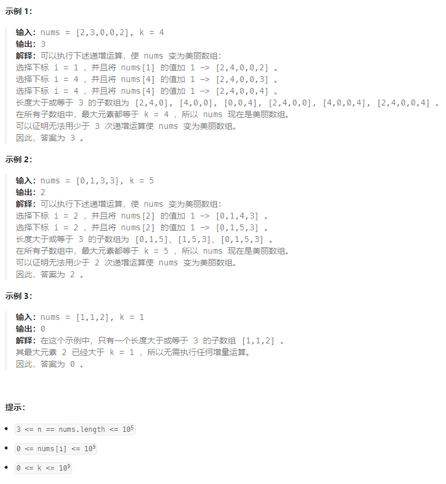

**思路**
定义 `dfs(i，j)`表示现在要处理 `nums[0]`到`nums[i]`这段子数组并且` nums[i]`右边有j个没有变大的数
选:`dfs(i, j)=dfs(i-1，0) +max (k-nums[i], 0)`不选（当j<2的时候）:`dfs(i, j) = dfs(i-1，j+1)`
递归边界:当`i < 0`的时候，返回0
递归入口:`dfs(n-1，0)`

```java
class Solution {
    public long minIncrementOperations(int[] nums, int k) {
        int n = nums.length;
        long[][] g = new long[n][3];
        for (long[] arr : g) {
            Arrays.fill(arr, -1);
        }
        // 记忆化搜索
        return dfs(n - 1, 0, g, nums, k);
    }
    long dfs(int i, int j, long[][] g, int[] nums, int k) {
        if (i < 0) {
            return 0;
        }
        if (g[i][j] != -1) {
            return g[i][j];
        }
        long res = dfs(i - 1, 0, g, nums, k) + Math.max(k - nums[i], 0); // 选 i
        if (j < 2) {
            res = Math.min(res, dfs(i - 1, j + 1, g, nums, k)); // 不选 i
        }
        return g[i][j] = res;
    }
}
```

## 离散

### 1851. 包含每个查询的最小区间

给你一个二维整数数组 intervals ，其中 `intervals[i] = [lefti, righti]` 表示第 i 个区间开始于 lefti 、结束于 righti（包含两侧取值，闭区间）。区间的 长度 定义为区间中包含的整数数目，更正式地表达是 `righti - lefti + 1` 。

再给你一个整数数组 queries 。第 j 个查询的答案是满足 `lefti <= queries[j] <= righti` 的 长度最小区间 i 的长度 。如果不存在这样的区间，那么答案是 -1 。

以数组形式返回对应查询的所有答案。

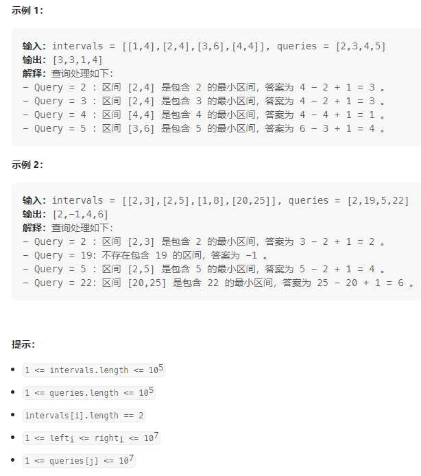

```java
class Solution {
    public int[] minInterval(int[][] intervals, int[] queries) {
        Integer[] qindex = new Integer[queries.length];
        for (int i = 0; i < queries.length; i ++) {
            qindex[i] = i;
        }
        Arrays.sort(qindex, (i, j) -> queries[i] - queries[j]);
        Arrays.sort(intervals, (i1, i2) -> i1[0] - i2[0]);
        PriorityQueue<int[]> pq = new PriorityQueue<>((p1, p2) -> p1[0] - p2[0]);
        int[] res = new int[queries.length];
        Arrays.fill(res, -1);
        int i = 0;
        for (int qi : qindex) {
            while (i < intervals.length && intervals[i][0] <= queries[qi]) {
                pq.offer(new int[]{intervals[i][1] - intervals[i][0] + 1, intervals[i][0], intervals[i][1]});
                i ++;
            }
            while (!pq.isEmpty() && pq.peek()[2] < queries[qi]) {
                pq.poll();
            }
            if (!pq.isEmpty()) {
                res[qi] = pq.peek()[0];
            }
        }
        return res;
    }
}
```

## 树

### 236. 二叉树的最近公共祖先

给定一个二叉树, 找到该树中两个指定节点的最近公共祖先。

百度百科中最近公共祖先的定义为：“对于有根树 T 的两个节点 p、q，最近公共祖先表示为一个节点 x，满足 x 是 p、q 的祖先且 x 的深度尽可能大（一个节点也可以是它自己的祖先）。”

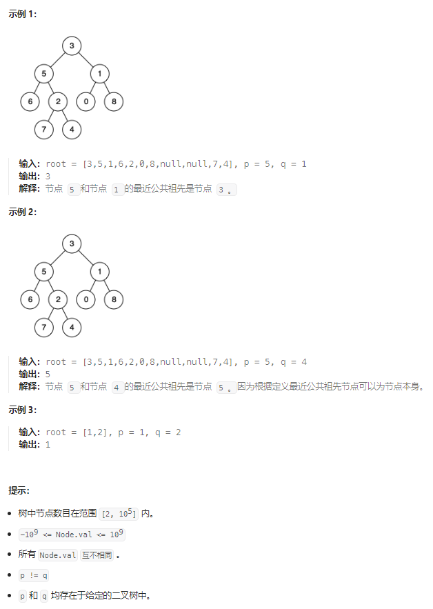

```java
/**
 * Definition for a binary tree node.
 * public class TreeNode {
 *     int val;
 *     TreeNode left;
 *     TreeNode right;
 *     TreeNode(int x) { val = x; }
 * }
 */
class Solution {
    public TreeNode lowestCommonAncestor(TreeNode root, TreeNode p, TreeNode q) {
        if (root == null || p == root || q == root) {
            return root;
        }
        TreeNode left = lowestCommonAncestor(root.left, p, q);
        TreeNode right = lowestCommonAncestor(root.right, p, q);

        if (left == null) {
            return right;
        }
        if (right == null) {
            return left;
        }
        return root;
    }
}
```

### 617. 合并二叉树

给你两棵二叉树： root1 和 root2 。

想象一下，当你将其中一棵覆盖到另一棵之上时，两棵树上的一些节点将会重叠（而另一些不会）。你需要将这两棵树合并成一棵新二叉树。合并的规则是：如果两个节点重叠，那么将这两个节点的值相加作为合并后节点的新值；否则，不为 null 的节点将直接作为新二叉树的节点。

返回合并后的二叉树。

> 注意: 合并过程必须从两个树的根节点开始。

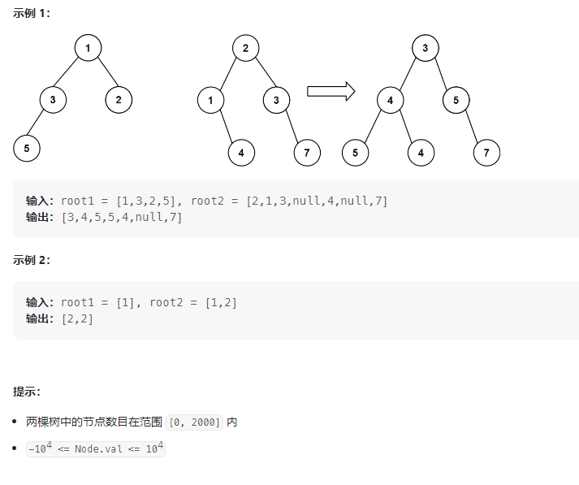

```java
/**
 * Definition for a binary tree node.
 * public class TreeNode {
 *     int val;
 *     TreeNode left;
 *     TreeNode right;
 *     TreeNode() {}
 *     TreeNode(int val) { this.val = val; }
 *     TreeNode(int val, TreeNode left, TreeNode right) {
 *         this.val = val;
 *         this.left = left;
 *         this.right = right;
 *     }
 * }
 */
class Solution {
    public TreeNode mergeTrees(TreeNode root1, TreeNode root2) {
        if (root1 == null) {
            return root2;
        }
        if (root2 == null) {
            return root1;
        }
        var cur = new TreeNode(root1.val + root2.val);
        cur.left = mergeTrees(root1.left, root2.left);
        cur.right = mergeTrees(root1.right, root2.right);
        return cur;
    }
}
```

### 1123. 最深叶节点的最近公共祖先

给你一个有根节点 root 的二叉树，返回它 最深的叶节点的最近公共祖先 。

回想一下：

- 叶节点 是二叉树中没有子节点的节点
- 树的根节点的 深度 为 0，如果某一节点的深度为 d，那它的子节点的深度就是 d+1
- 如果我们假定 A 是一组节点 S 的 最近公共祖先，S 中的每个节点都在以 A 为根节点的子树中，且 A 的深度达到此条件下可能的最大值。


```java
/**
 * Definition for a binary tree node.
 * public class TreeNode {
 *     int val;
 *     TreeNode left;
 *     TreeNode right;
 *     TreeNode() {}
 *     TreeNode(int val) { this.val = val; }
 *     TreeNode(int val, TreeNode left, TreeNode right) {
 *         this.val = val;
 *         this.left = left;
 *         this.right = right;
 *     }
 * }
 */
class Solution {
    public TreeNode lcaDeepestLeaves(TreeNode root) {
        return dfs(root).getKey();
    }
    Pair<TreeNode, Integer> dfs(TreeNode root) {
        if (root == null) {
            return new Pair<>(root, 0);
        }
        var left = dfs(root.left);
        var right = dfs(root.right);
        if (left.getValue() > right.getValue()) {
            return new Pair<>(left.getKey(), left.getValue() + 1);
        }
        if (left.getValue() < right.getValue()) {
            return new Pair<>(right.getKey(), right.getValue() + 1);
        }
        return new Pair<>(root, left.getValue() + 1);
    }
}
```

### 1448. 统计二叉树中好节点的数目

给你一棵根为 root 的二叉树，请你返回二叉树中好节点的数目。

「好节点」X 定义为：从根到该节点 X 所经过的节点中，没有任何节点的值大于 X 的值。

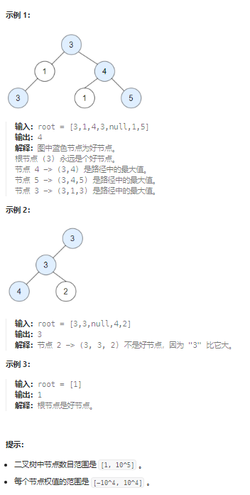

```java
/**
 * Definition for a binary tree node.
 * public class TreeNode {
 *     int val;
 *     TreeNode left;
 *     TreeNode right;
 *     TreeNode() {}
 *     TreeNode(int val) { this.val = val; }
 *     TreeNode(int val, TreeNode left, TreeNode right) {
 *         this.val = val;
 *         this.left = left;
 *         this.right = right;
 *     }
 * }
 */
class Solution {
    public int goodNodes(TreeNode root) {
        int res = dfs(root, Integer.MIN_VALUE);
        return res;
    }
    int dfs(TreeNode root, int val) {
        if (root != null) {
            val = Math.max(val, root.val);
            return dfs(root.left, val)  + dfs(root.right, val) + (root.val >= val ? 1 : 0);
        }
        return 0;
    }
}
```

## 图

### 1334. 阈值距离内邻居最少的城市

有 `n` 个城市，按从 `0` 到 `n-1` 编号。给你一个边数组 `edges`，其中 `edges[i] = [fromi, toi, weighti]` 代表 `fromi` 和 `toi` 两个城市之间的双向加权边，距离阈值是一个整数 `distanceThreshold`。

返回能通过某些路径到达其他城市数目最少、且路径距离 **最大** 为 `distanceThreshold` 的城市。如果有多个这样的城市，则返回编号最大的城市。

注意，连接城市 ***i*** 和 ***j*** 的路径的距离等于沿该路径的所有边的权重之和。

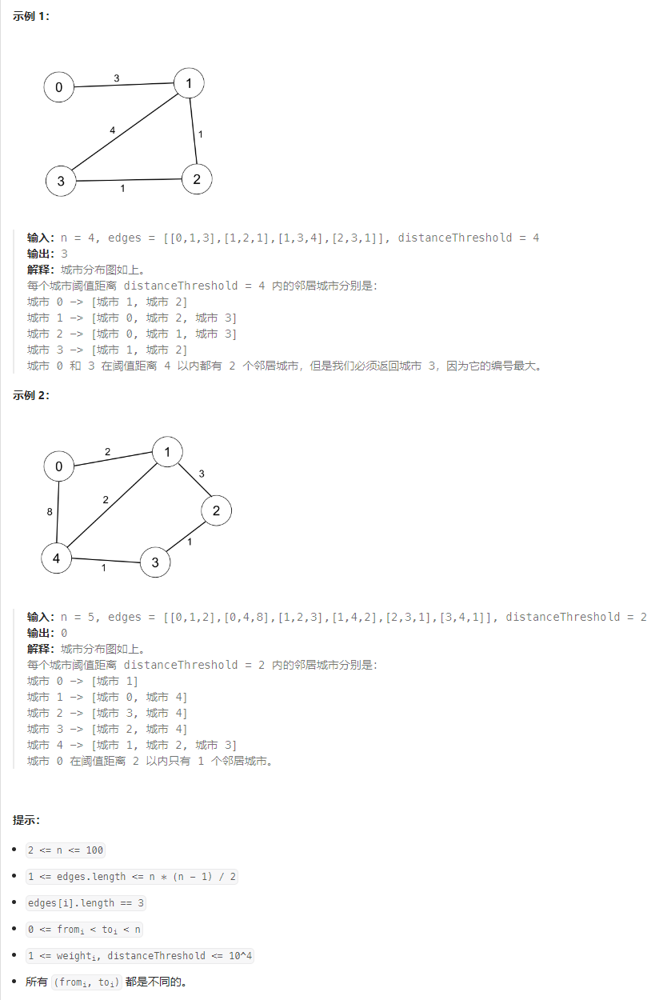

```java
class Solution {
    public int findTheCity(int n, int[][] edges, int distanceThreshold) {
        int[][] g = new int[n][n];
        for (int i = 0; i < n; i ++) {
            Arrays.fill(g[i], Integer.MAX_VALUE / 2);
        }   
        for (int[] edge : edges) {
            int a = edge[0], b = edge[1], c = edge[2];
            g[a][b] = g[b][a] = c;
        }
        for (int k = 0; k < n; k ++) {
            g[k][k] = 0;
            for (int i = 0; i < n; i ++) {
                for (int j = 0; j < n; j ++) {
                    g[i][j] = Math.min(g[i][j], g[i][k] + g[k][j]);
                }
            }
        }
        int[] ans = {Integer.MAX_VALUE / 2, -1};
        for (int i = 0; i < n; i ++) {
            int cnt = 0;
            for (int j = 0; j < n; j ++) {
                if (g[i][j] <= distanceThreshold) {
                    cnt ++;
                }
            }
            if (cnt <= ans[0]) {
                ans[1] = i;
                ans[0] = cnt;
            }
        }
        return ans[1];
    }
}
```

### 1462. 课程表 IV

你总共需要上 numCourses 门课，课程编号依次为 0 到 numCourses-1 。你会得到一个数组 prerequisite ，其中 `prerequisites[i] = [ai, bi]` 表示如果你想选 bi 课程，你 必须 先选 ai 课程。

- 有的课会有直接的先修课程，比如如果想上课程 1 ，你必须先上课程 0 ，那么会以 [0,1] 数对的形式给出先修课程数对。
先决条件也可以是 间接 的。如果课程 a 是课程 b 的先决条件，课程 b 是课程 c 的先决条件，那么课程 a 就是课程 c 的先决条件。

你也得到一个数组 queries ，其中 `queries[j] = [uj, vj]`。对于第 j 个查询，您应该回答课程 uj 是否是课程 vj 的先决条件。

返回一个布尔数组 answer ，其中 answer[j] 是第 j 个查询的答案。

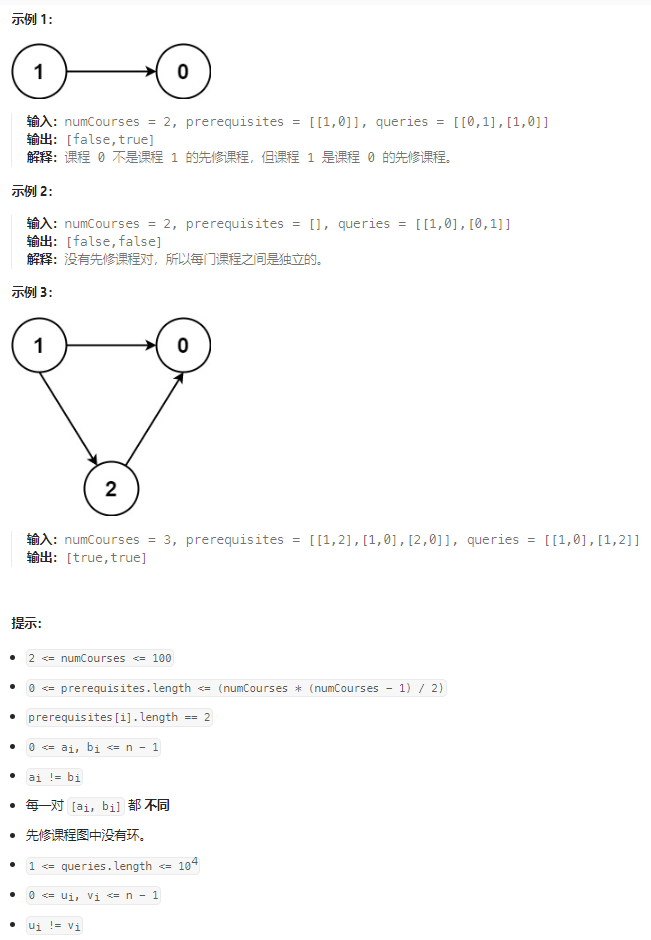

```java
class Solution {
    public List<Boolean> checkIfPrerequisite(int numCourses, int[][] prerequisites, int[][] queries) {
      Map<Integer, Set<Integer>> g = new HashMap<>();
      int[] d = new int[numCourses];
      for (int i = 0; i < numCourses; i ++) {
        g.put(i, new HashSet<>());
      }
      for (int[] p : prerequisites) {
        int a = p[0], b = p[1];
        g.get(a).add(b);
        d[b] ++;
      }
      Queue<Integer> queue = new LinkedList<>();
      int tail = 0;
      for (int i = 0; i < numCourses; i ++) {
        if (d[i] == 0) {
          queue.offer(i);
          tail = i;
        }
      }
      boolean[][] isPre = new boolean[numCourses][numCourses];
      while (!queue.isEmpty()) {
        int cur = queue.poll();
        for (int next : g.get(cur)) {
          isPre[cur][next] = true;
          for (int i = 0; i < numCourses; i ++) {
            isPre[i][next] = isPre[i][cur] | isPre[i][next];
          }
          d[next] --;
          if (d[next] == 0) {
            queue.offer(next);
          }
        }
      }
      List<Boolean> ans = new ArrayList<>();
      for (int i = 0; i < queries.length; i ++) {
        int a = queries[i][0], b = queries[i][1];
        ans.add(isPre[a][b]);
      }
      return ans;
    }
}
```

## 堆

### 2034. 股票价格波动

给你一支股票价格的数据流。数据流中每一条记录包含一个 **时间戳** 和该时间点股票对应的 **价格** 。

不巧的是，由于股票市场内在的波动性，股票价格记录可能不是按时间顺序到来的。某些情况下，有的记录可能是错的。如果两个有相同时间戳的记录出现在数据流中，前一条记录视为错误记录，后出现的记录 **更正** 前一条错误的记录。

请你设计一个算法，实现：

- **更新** 股票在某一时间戳的股票价格，如果有之前同一时间戳的价格，这一操作将 **更正** 之前的错误价格。
- 找到当前记录里 **最新股票价格** 。**最新股票价格** 定义为时间戳最晚的股票价格。
- 找到当前记录里股票的 **最高价格** 。
- 找到当前记录里股票的 **最低价格** 。

请你实现 `StockPrice` 类：

- `StockPrice()` 初始化对象，当前无股票价格记录。
- `void update(int timestamp, int price)` 在时间点 `timestamp` 更新股票价格为 `price` 。
- `int current()` 返回股票 **最新价格** 。
- `int maximum()` 返回股票 **最高价格** 。
- `int minimum()` 返回股票 **最低价格** 。

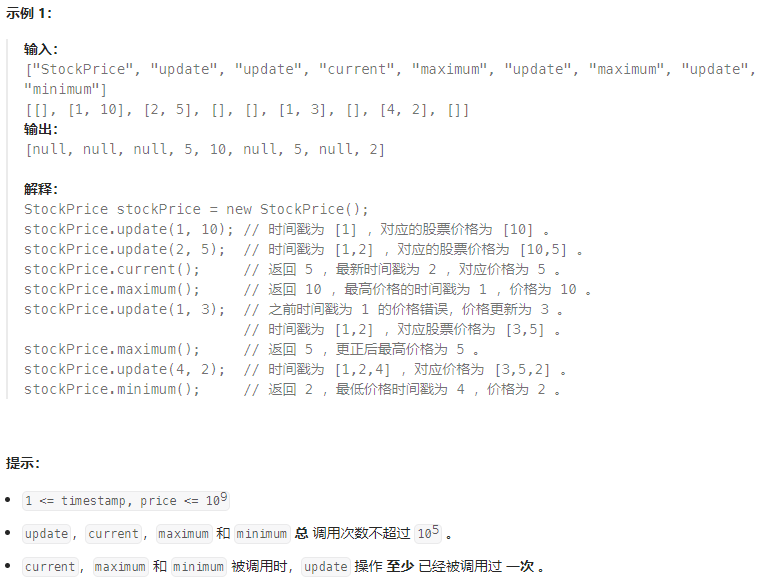

```java
class StockPrice {
    int maxTime;
    Map<Integer, Integer> map;
    PriorityQueue<int[]> minHeap, maxHeap;
    
    public StockPrice() {
        maxTime = 0;
        map = new HashMap<>();
        minHeap = new PriorityQueue<>((a, b) -> a[1] - b[1]);
        maxHeap = new PriorityQueue<>((a, b) -> b[1] - a[1]);
    }
    
    public void update(int timestamp, int price) {
        maxTime = Math.max(timestamp, maxTime);
        map.put(timestamp, price);
        minHeap.offer(new int[]{timestamp, price});
        maxHeap.offer(new int[]{timestamp, price});
    }
    
    public int current() {
        return map.get(maxTime);
    }
    
    public int maximum() {
        while (true) {
            int[] cur = maxHeap.peek();
            if (map.get(cur[0]) == cur[1]) {
                return cur[1];
            }
            maxHeap.poll();
        }
    }
    
    public int minimum() {
        while (true) {
            int[] cur = minHeap.peek();
            if (map.get(cur[0]) == cur[1]) {
                return cur[1];
            }
            minHeap.poll();
        }
    }
}

/**
 * Your StockPrice object will be instantiated and called as such:
 * StockPrice obj = new StockPrice();
 * obj.update(timestamp,price);
 * int param_2 = obj.current();
 * int param_3 = obj.maximum();
 * int param_4 = obj.minimum();
 */
```

## 回溯

### 2698. 求一个整数的惩罚数

给你一个正整数 `n` ，请你返回 `n` 的 **惩罚数** 。

`n` 的 **惩罚数** 定义为所有满足以下条件 `i` 的数的平方和：

- `1 <= i <= n`
- `i * i` 的十进制表示的字符串可以分割成若干连续子字符串，且这些子字符串对应的整数值之和等于 `i` 。

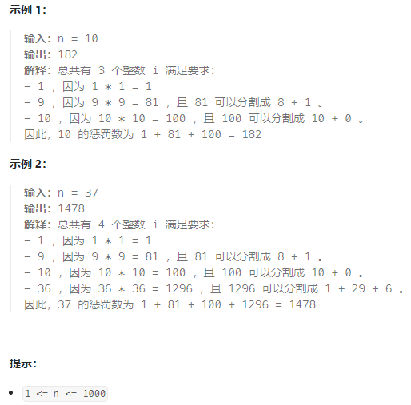

```java
class Solution {
    public int punishmentNumber(int n) {
        int res = 0;
        for (int i = 1; i <= n; i ++) {
            String s = Integer.toString(i * i);
            if (dfs(s, 0, 0, i)) {
                res += i * i;
            }
        }
        return res;
    }
    boolean dfs(String s, int u, int x, int k) {
        if (u == s.length()) {
            return x == k;
        }
        int sum = 0;
        for (int i = u; i < s.length(); i ++) {
            sum = sum * 10 + s.charAt(i) - '0';
            if (sum + x > k) {
                break;
            }
            if (dfs(s, i + 1, sum + x, k)) {
                return true;
            }
        }
        return false;
    }

}
```

### 2850. 将石头分散到网格图的最少移动次数

给你一个大小为 `3 * 3` ，下标从 **0** 开始的二维整数矩阵 `grid` ，分别表示每一个格子里石头的数目。网格图中总共恰好有 `9` 个石头，一个格子里可能会有 **多个** 石头。

每一次操作中，你可以将一个石头从它当前所在格子移动到一个至少有一条公共边的相邻格子。

请你返回每个格子恰好有一个石头的 **最少移动次数** 。

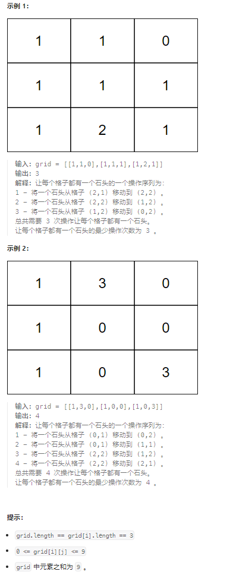

```java
class Solution {
    public int minimumMoves(int[][] grid) {
        List<int[]> from = new ArrayList<>();
        List<int[]> to = new ArrayList<>();
        for (int i = 0; i < 3; i ++) {
            for (int j = 0; j < 3; j ++) {
                int x = grid[i][j];
                if (x == 0) {
                    to.add(new int[]{i, j});
                } else if (x > 1) {
                    for (int k = 1; k < x; k ++) {
                        from.add(new int[]{i, j});
                    }
                }
            }
        }
        int res = 100;
        for (List<int[]> premution : getPermutions(from)) {
            int total = 0;
            for (int i = 0; i < premution.size(); i ++) {
                int[] p = premution.get(i), t = to.get(i);
                total += Math.abs(p[0] - t[0]) + Math.abs(p[1] - t[1]);
            }
            res = Math.min(res, total);
        }
        return res;
    }
    List<List<int[]>> getPermutions(List<int[]> from) {
        List<List<int[]>> res = new ArrayList<>();
        dfs(from, 0, res);
        return res;
    }
    void dfs(List<int[]> arr, int u, List<List<int[]>> res) {
        if (u == arr.size()) {
            res.add(new ArrayList<>(arr));
        }
        for (int i = u; i < arr.size(); i ++) {
            swap(arr, u, i);
            dfs(arr, u + 1, res);
            swap(arr, u, i);
        }
    }
    void swap(List<int[]> arr, int i, int j) {
        int[] t = arr.get(i);
        arr.set(i, arr.get(j));
        arr.set(j, t);
    }
}
```

## 并查集

### 2316. 统计无向图中无法互相到达点对数

给你一个整数 `n` ，表示一张 **无向图** 中有 `n` 个节点，编号为 `0` 到 `n - 1` 。同时给你一个二维整数数组 `edges` ，其中 `edges[i] = [ai, bi]` 表示节点 `ai` 和 `bi` 之间有一条 **无向** 边。

请你返回 **无法互相到达** 的不同 **点对数目** 。

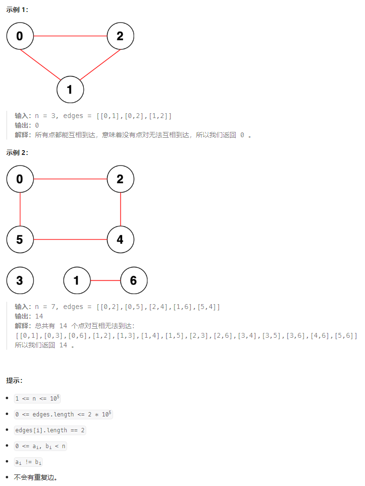

**深度优先搜索**

```java
class Solution {
    public long countPairs(int n, int[][] edges) {
        List<Integer>[] g = new ArrayList[n];
        Arrays.setAll(g, e -> new ArrayList<>());
        // 建图
        for (int[] e : edges) {
            int x = e[0], y = e[1];
            g[x].add(y);
            g[y].add(x);
        }
        boolean[] vis = new boolean[n];
        long ans = 0;
        for (int i = 0, total = 0; i < n; i ++) {
            if (!vis[i]) {
                int size = dfs(i, g, vis);
                total += size;
                ans += (long) size * (n - total);
            }
        }
        return ans;
    }
    int dfs(int x, List<Integer>[] g, boolean[] vis) {
        vis[x] = true;
        int size = 1;
        for (int y : g[x]) {
            if (!vis[y]) {
                size += dfs(y, g, vis);
            }
        }
        return size;
    }
}
```

**并查集**

```java
class Solution {
    public long countPairs(int n, int[][] edges) {
        int[] f = new int[n], fsize = new int[n];
        Arrays.fill(fsize, 1);
        for (int i = 0; i < n; i ++) {
            f[i] = i;
        }
        for (int[] e : edges) {
            union(f, fsize, e[0], e[1]);
        }
        long res = 0, presum = 0;
        for (int i = 0; i < n; i ++) {
            if (fsize[i] > 0) {
                presum += fsize[i];
                res += fsize[i] * (n - presum);
            }
        }
        return res;
    }
    int find(int[] f, int i) {
        if (f[i] != i) {
            return find(f, f[i]);
        }
        return f[i];
    }
    void union(int[] f, int[] fsize, int i, int j) {
        int fi = find(f, i);
        int fj = find(f, j);
        if (fi != fj) {
            f[fi] = fj;
            // 计算每个连通块的大小
            fsize[fj] += fsize[fi];
            fsize[fi] = 0;
        }
    }
}
```

## 位运算

### 318. 最大单词长度乘积

给你一个字符串数组 `words` ，找出并返回 `length(words[i]) * length(words[j])` 的最大值，并且这两个单词不含有公共字母。如果不存在这样的两个单词，返回 `0` 。

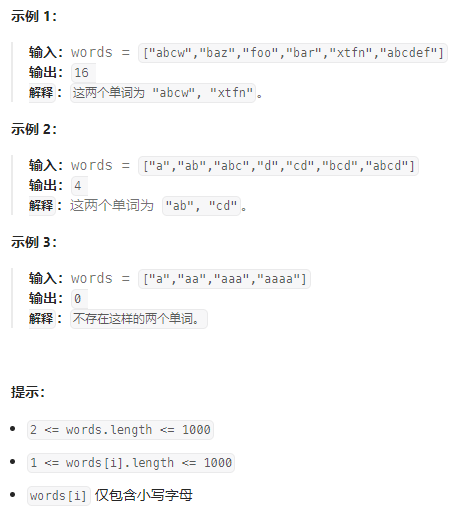

```java
class Solution {
    public int maxProduct(String[] words) {
        int n = words.length;
        int[] bit = new int[n];
        for (int i = 0; i < n; i ++) {
            String s = words[i];
            for (int j = 0; j < s.length(); j ++) {
                bit[i] |= 1 << (s.charAt(j) - 'a');
            }
        }
        int res = 0;
        for (int i = 0; i < n - 1; i ++) {
            for (int j = i + 1; j < n; j ++) {
                if ((bit[i] & bit[j]) == 0) {
                    res = Math.max(res, words[i].length() * words[j].length());
                }
            }
        }
        return res;
    }
}
```

## 广度优先搜索

### 2258. 逃离火灾

给你一个下标从 **0** 开始大小为 `m x n` 的二维整数数组 `grid` ，它表示一个网格图。每个格子为下面 3 个值之一：

- `0` 表示草地。
- `1` 表示着火的格子。
- `2` 表示一座墙，你跟火都不能通过这个格子。

一开始你在最左上角的格子 `(0, 0)` ，你想要到达最右下角的安全屋格子 `(m - 1, n - 1)` 。每一分钟，你可以移动到 **相邻** 的草地格子。每次你移动 **之后** ，着火的格子会扩散到所有不是墙的 **相邻** 格子。

请你返回你在初始位置可以停留的 **最多** 分钟数，且停留完这段时间后你还能安全到达安全屋。如果无法实现，请你返回 `-1` 。如果不管你在初始位置停留多久，你 **总是** 能到达安全屋，请你返回 `109` 。

注意，如果你到达安全屋后，火马上到了安全屋，这视为你能够安全到达安全屋。

如果两个格子有共同边，那么它们为 **相邻** 格子。

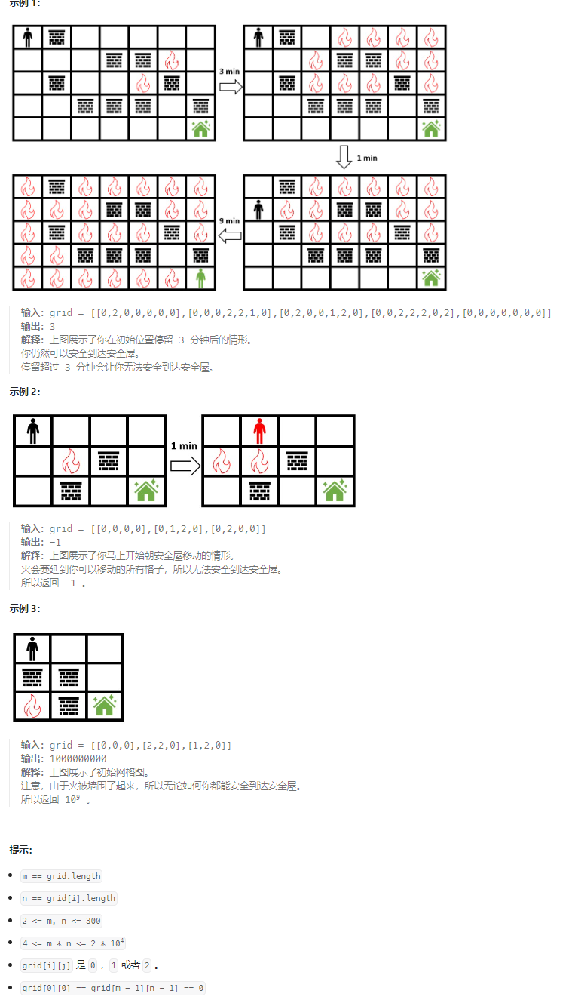

**思路**

BFS + 分类讨论
通过比较双方到达时间来求解。

具体的，用` fg `和` pg `，分别预处理出「火势」和「人员」到达每个网格的最早时间。其中火势蔓延唯一确定，而人员的预处理是在不考虑火势的情况下进行。

根据` f=fg[n−1][m−1]f = fg[n-1][m-1]f=fg[n−1][m−1] `和` p=pg[n−1][m−1]p = pg[n-1][m-1]p=pg[n−1][m−1] `进行分情况讨论：

若 `p=0`：人与安全屋不连通，返回 `−1`；

若 `f=0`：火与安全屋不连通，同时上述条件不满足（`p≠0`），即人与安全屋是联通 ，返回 `1e9`；

若 `f<pf`： 火和人都能到达安全屋。即使不考虑人员中途被火影响（人员可能无法按照最佳路线前往安全屋）的情况下，火也比人要更早到达安全屋，返回 `−1`；

若 `f⩾pf`：理想情况下，人比火更早到达安全屋，但存在「人火同时到达」、「人员中途被烧」或「通路被火拦截」等问题，需要进一步分情况讨论：

不难发现，由于安全屋的位于 `(n−1,m−1)(n - 1, m - 1)(n−1,m−1)`，人员只能从 `(n−1,m−2)(n - 1, m - 2)(n−1,m−2) `或 `(n−2,m−1)(n - 2, m - 1)(n−2,m−1)` 两个位置之一到达安全屋（这两个属于普通位置，不允许人和火同时到达），因此可以将「对特殊位置安全屋」的讨论转为「对普通位置」的讨论：

若 `pg[n−1][m−2]≠0`，人与该位置联通，且 `f−p+pg[n−1][m−2]<fg[n−1][m−2]`，人比火更早到达该位置，返回 `f−pf`；
若 `pg[n−2][m−1]≠0`，人与该位置联通，且 `f−p+pg[n−2][m−1]<fg[n−2][m−1]`，人比火更早到达该位置，返回 `f−pf`；
否则，说明延迟 `f−pf`秒出发，唯二的通路会被火提前拦截，需要早一秒出发，返回 `f−p−1`;

```java
class Solution {
    int[][] dirs = new int[][]{{1, 0}, {-1, 0}, {0, 1}, {0, -1}};
    int[][] g;
    int n, m;
    public int maximumMinutes(int[][] grid) {
        g = grid;
        n = g.length;
        m = g[0].length;
        int[][] ft = new int[n][m], pt = new int[n][m];
        Queue<int[]> fires = new LinkedList<>();
        for (int i = 0; i < n; i ++) {
            for (int j = 0; j < m; j ++) {
                if (g[i][j] == 1) {
                    ft[i][j] = 1;
                    fires.offer(new int[]{i, j});
                }
            }
        }
        dfs(fires, ft);
        Queue<int[]> people = new LinkedList<>();
        people.offer(new int[]{0, 0});
        pt[0][0] = 1;
        dfs(people, pt);
        int p = pt[n - 1][m - 1], f = ft[n - 1][m - 1], res = f - p;
        if (p == 0) return -1;
        if (f == 0) return (int)1e9;
        if (p > f) return -1;
        if (pt[n - 1][m - 2] != 0 && res + pt[n - 1][m - 2] < ft[n - 1][m - 2]) return res;
        if (pt[n - 2][m - 1] != 0 && res + pt[n - 2][m - 1] < ft[n - 2][m - 1]) return res;
        return res - 1;
    }
    void dfs(Queue<int[]> queue, int[][] time) {
        while (!queue.isEmpty()) {
            int[] cur = queue.poll();
            for (int[] dir : dirs) {
                int x = cur[0] + dir[0], y = cur[1] + dir[1];
                if (x >= 0 && x < n && y >= 0 && y < m && g[x][y] != 2 && time[x][y] == 0) {
                    time[x][y] = time[cur[0]][cur[1]] + 1;
                    queue.offer(new int[]{x, y});
                }
            }
        }
    }
}
```

## 树状数组

### 307. 区域和检索 - 数组可修改

给你一个数组 `nums` ，请你完成两类查询。

1. 其中一类查询要求 **更新** 数组 `nums` 下标对应的值
2. 另一类查询要求返回数组 `nums` 中索引 `left` 和索引 `right` 之间（ **包含** ）的nums元素的 **和** ，其中 `left <= right`

实现 `NumArray` 类：

- `NumArray(int[] nums)` 用整数数组 `nums` 初始化对象
- `void update(int index, int val)` 将 `nums[index]` 的值 **更新** 为 `val`
- `int sumRange(int left, int right)` 返回数组 `nums` 中索引 `left` 和索引 `right` 之间（ **包含** ）的nums元素的 **和** （即，`nums[left] + nums[left + 1], ..., nums[right]`）

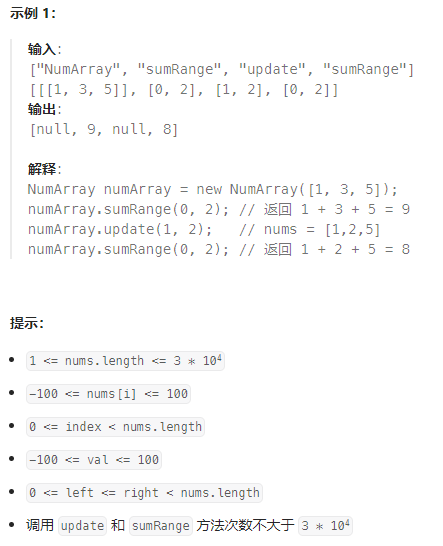

**思路**
针对不同的题目，我们有不同的方案可以选择（假设我们有一个数组）：

1. 数组不变，求区间和：「前缀和」、「树状数组」、「线段树」
2. 多次修改某个数（单点），求区间和：「树状数组」、「线段树」
3. 多次修改某个区间，输出最终结果：「差分」
4. 多次修改某个区间，求区间和：「线段树」、「树状数组」（看修改区间范围大小）
5. 多次将某个区间变成同一个数，求区间和：「线段树」、「树状数组」（看修改区间范围大小）

按这样的优先级进行考虑：

1. 简单求区间和，用「前缀和」
2. 多次将某个区间变成同一个数，用「线段树」
3. 其他情况，用「树状数组」

```java
class NumArray {
    /**
     * 树状数组模板代码
     */
    int[] p;
    int lowbit(int x) {
        return x & (-x);
    }
    int query(int x) {
        int ans = 0;
        for (int i = x; i > 0; i -= lowbit(i)) ans += p[i];
        return ans;
    }
    void add(int x, int u) {
        for (int i = x; i <= n; i += lowbit(i)) p[i] += u;
    }
    /** ------------------------------------------------- */
    int n;
    int[] arr;
    public NumArray(int[] nums) {
        arr = nums;
        n = arr.length;
        p = new int[n + 1];
        for (int i = 0; i < n; i ++) add(i + 1, arr[i]);
    }
    
    public void update(int i, int val) {
        add(i + 1, val - arr[i]);
        arr[i] = val;
    }
    
    public int sumRange(int l, int r) {
        return query(r + 1) - query(l);
    }
}

/**
 * Your NumArray object will be instantiated and called as such:
 * NumArray obj = new NumArray(nums);
 * obj.update(i,val);
 * int param_2 = obj.sumRange(left,right);
 */
```

## 线段树


