# Java并发

[并发导图](https://www.processon.com/view/link/615d4a610e3e74663e97fa0e.png)

## 并发与线程

### 进程和线程

**进程**是程序运行资源分配（以内存为主）的最小单位。

**线程**是 CPU 调度的最小单位。

> 线程必须依赖于进程而存在，线程是进程中的一个实体，是 CPU 调度和分派的基本单位，它是比进程更小的、能独立运行的基本单位。线程拥有在运行中必不可少的资源，但是它可与同属一个进程的其他的线程共享进程所拥有的全部资源。

**Java线程的无处不在**

1. Java 中不管任何程序都必须启动一个 main 函数的主线程；

2. Java Web 开发里 面的定时任务、定时器、JSP 和 Servlet、异步消息处理机制，远程访问接口 RM 等。 任何一个监听事件，onclick 的触发事件等都离不开线程和并发的知识。

**进程间的通信**

同一台计算机的进程通信称为 `IPC（Inter-process communication）`，不同计 算机之间的进程通信被称为 `RPC`，需要通过网络，并遵守共同的协议，比如大家熟悉的 `Dubbo` 就是一个 `RPC` 框架， 而 `Http` 协议也经常用在 `RPC` 上， 比如 `SpringCloud` 微服务。

进程间通信有以下几种方式：

1. 管道：分为匿名管道`（pipe）`及命名管道`（named pipe）`，匿名管道可用于具有亲缘关系的父子进程间的通信，命名管道除了具有管道所具有的功能外， 它还允许无亲缘关系进程间的通信。

2. 信号`（signal）`：信号是在软件层次上对中断机制的一种模拟，它是比较复杂的通信方式， 用于通知进程有某事件发生， 一个进程收到一个信号与处理器收到一个中断请求效果上可以说是一致的。

3. 消息队列`（message queue）`：消息队列是消息的链接表，它克服了上两种通信方式中信号量有限的缺点， 具有写权限得进程可以按照一定得规则向消息队列中添加新信息；对消息队列有读权限得进程则可以从消息队列中读取信息。

4. 共享内存`（shared memory）`：可以说这是最有用的进程间通信方式。它使得多个进程可以访问同一块内存空间， 不同进程可以及时看到对方进程中对共享内存中数据得更新。这种方式需要依靠某种同步操作， 如互斥锁和信号量等。

5. 信号量`（semaphore）`：主要作为进程之间及同一种进程的不同线程之间的同步和互斥手段。

6. 套接字`（socket）`：这是一种更为一般得进程间通信机制， 它可用于网络 中不同机器之间的进程间通信，应用非常广泛。同一机器中的进程还可以使用 `Unix domain socket`（比如同一机器中 `MySQL` 中的控制台 `mysql shell` 和 `MySQL` 服务程序的连接），这种方式不需要经过网络协议栈， 不需要打包拆包、计算校验和、维护序号和应答等，比纯粹基于网络的进程间通信肯定效率更高。

**CPU核心数和线程数的关系**

目前主流 CPU 都是多核的。同一 时刻， 一个 CPU 核心只能运行一个线程，也就是 CPU  内核和同时运行的线程数 是 1:1 的关系， 也就是说 8 核 CPU  同时可以执行 8 个线程的代码。

但 Intel 引入超线程技术后，产生了逻辑处理器的概念，使核心数与线程数形成 1:2 的关系。可以从 Windows 看到，内核数是 14 而逻辑处理器数是 20。

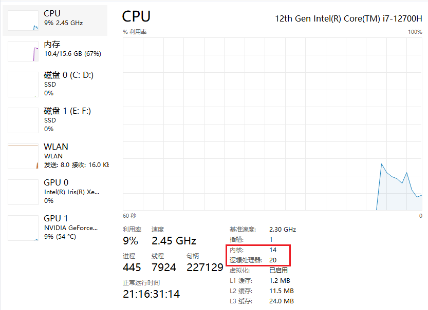

在 Java 中提供了 `Runtime.getRuntime().availableProcessors()`，可以获取当前的 CPU 核心数， 注意这个核心数指的是逻辑处理器数。

> 获得当前的 CPU 核心数在并发编程中很重要，并发编程下的性能优化往往和 CPU 核心数密切相关。

**上下文切换（Context switch）**

操作系统要在多个进程（线程）之间进行调度， 而每个线程在使用 CPU  时总是要使用 CPU 中的资源，比如 CPU 寄存器和程序计数器。这就意味着，操作系统要保证线程在调度前后的正常执行，所以操作系统中就有**上下文切换**的概念，它是指**CPU(中央处理单元)从一个进程或线程到另一个进程或线程的切换。**

- 上下文是CPU寄存器和程序计数器在任何时间点的内容。

- 寄存器是CPU内部的一小部分非常快的内存(相对于CPU内部的缓存和CPU外部较慢的RAM主内存)，它通过提供对常用值的快速访问来加快计算机程序的执行。

- 程序计数器是一种专门的寄存器，它指示CPU 在其指令序列中的位置，并保存着正在执行的指令的地址或下一条要执行的指令的地址，这取决于具体的系统。

**上下文切换**的流程：

1. 暂停一个进程的处理，并将该进程的 CPU 状态(即上下文)存储在内存中；

2. 从内存中获取下一个进程的上下文，并在 CPU 的寄存器中恢复它；

3. 返回到程序计数器指示的位置以恢复进程。

> 引发上下文切换的原因一般包括： 线程、进程切换、系统调用等等。上下文切换通常是计算密集型的，因为涉及一系列数据在各种寄存器、缓存中的来回拷贝。
>
> 就 CPU 时间而言， 一次上下文切换大概需要 5000~20000 个时钟周期，相对一个简单指令几个乃至十几个左右的执行时钟周期， 可以看出这个成本的巨大。

**并行和并发**

**并发 `Concurrent`**：指应用能够交替执行不同的任务，比如单 CPU 核心下执行多线程并非是同时执行多个任务，如果开两个线程执行，就是在几乎不可能察觉到的速度不断去切换这两个任务，已达到**"同时执行效果"**，其实只是计算机的速度太快，无法察觉到而已。

**并行 `Parallel`**：指应用能够同时执行不同的任务，与并发的区别是一个是交替执行，一个是同时执行。

### Java的线程

一个 Java 程序从 `main()`方法开始执行，然后按照既定的代码逻辑执行，看似没有其他线程参与， 但实际上**Java程序天生就是多线程的**， 因为执行 `main()` 方法的是一个名称为 `main` 的线程。

而一个 Java 程序的运行就算是没有用户自己开启的线程，实际也有有很多 JVM  自行启动的线程， 一般来说有：

```java
Monitor Ctrl-Break 	//监控 Ctrl-Break 中断信号的
Attach Listener 		//内存 dump，线程 dump，类信息统计， 获取系统属性等 [4] Signal Dispatcher    //  分发处理发送给 JVM 信号的线程
Finalizer    				//调用对象 finalize 方法的线程
Reference Handler		//清除 Reference 的线程
main 								//main 线程， 用户程序入口
```

**线程的启动与中止**

启动线程的方式有：

1. 继承 `thread` 类；

2. 实现 `Runnable` 接口，然后交给 `Thread` 运行

```java
public class Test1 {
    public static void main(String[] args) {
        System.out.println("主线程开始");
        new Thread(() -> {
            System.out.println("匿名内部类线程");
        }).start();
        Thread thread = new Thread(() -> {
            System.out.println("线程名：" + Thread.currentThread().getName());
        }, "线程名666");
        Thread t1 = new MyThread1();
        t1.start();
        Thread t2 = new Thread(new MyThread2());
        System.out.println("主线程结束");
    }
}
class MyThread1 extends Thread {
    @Override
    public void run() {}
}
class MyThread2 implements Runnable {
    @Override
    public void run() { }
}
```

> `Thread` 和 `Runnable` 的区别：Thread 才是 Java 里对线程的唯一抽象， Runnable 只是对任务（业务逻辑）的抽象。 Thread 可以接受任意一个 Runnable 的实例并执行。

**Callable、Future 和 FutureTask**

`Runnable` 是一个接口， 在它里面只声明了一个 `run()`方法，由于 `run()`方法返回值为 `void` 类型，所以在执行完任务之后无法返回任何结果。

1. **Callable**：
   - Callable 接口是 `java.util.concurrent` 包中的一个接口，它类似于 Runnable 接口，但是可以返回结果并且可以抛出异常。
   - 它只包含一个 `call()` 方法，这个方法可以在其他线程中执行，并且可以返回一个结果或者抛出一个异常。

2. **Future**：
   - Future 接口表示一个可能还没有完成的异步任务的结果。它提供了检查任务是否完成、等待任务完成以及检索任务执行结果的方法。
   - 通过调用 `submit` 方法，可以将 Callable 对象提交给 `ExecutorService` 来执行，并返回一个 Future 对象，通过这个 Future 对象可以获取任务执行的结果。

3. **FutureTask**：
   - FutureTask 类实现了 `RunnableFuture` 接口，该接口继承了 Runnable 和 Future 接口，因此它既可以作为 Runnable 被线程执行，又可以作为 Future 得到 Callable 的返回值。
   - FutureTask 可以在构造时接受 Callable 对象，并提供方法来启动和取消任务，以及查询任务是否已完成。

> 这些接口和类通常与 Executor 框架一起使用，用于支持异步计算和任务执行。Callable 用于定义需要执行的任务，Future 用于获取任务的执行状态和结果，而 FutureTask 则是一个实现了这两个接口的具体任务类。

```java
public class Test1 {
    public static void main(String[] args) {
        ExecutorService threadPool = Executors.newFixedThreadPool(5);
        MyTask myTask = new MyTask(5);
        // Callable + Future
        Future<Integer> future = threadPool.submit(myTask);
				// Callable + FutureTask
        FutureTask<Integer> myFutureTask = new FutureTask<>(myTask);
        threadPool.submit(myFutureTask);
        threadPool.shutdown();
        try {
            // 返回任务结果
            System.out.println("Callable + Future 执行结果为：" + future.get());
            System.out.println("Callable + FutureTask 执行结果为：" + myFutureTask.get());
        } catch (InterruptedException e) {
            throw new RuntimeException(e);
        } catch (ExecutionException e) {
            throw new RuntimeException(e);
        }
    }
}
class MyTask implements Callable<Integer> {
    private int n;
    public MyTask(int n) {
        this.n = n;
    }

    @Override
    public Integer call() throws Exception {
        int sum = 0;
        for (int i = 1; i <= this.n; i ++) {
            sum += i;
        }
        return sum;
    }
}
```

**新启线程的几种方式**

1. 官方说法是在 Java 中有两种方式创建一个线程用以执行， 一种是继承自 Thread 类，另一种是实现 Runnable 接口。
2. 至于基于 `Callable` 接口的方式，因为最终是要把实现了 `Callable` 接口的对象通过 `FutureTask` 包装成 `Runnable`，再交给 `Thread` 去执行，所以这个其实可以和实现 `Runnable` 接口看成同一类。
3. 而线程池的方式， 本质上是池化技术， 是资源的复用，和新启线程没什么关系。

**中止**

- **线程自然终止**：要么是 run 执行完成了，要么是抛出了一个未处理的异常导致线程提前结束。

- **stop**：暂停、恢复和停止操作对应在线程 `Thread` 的 API 就是 `suspend()、resume()、stop()`。

> 这些 API 是过期的，是不建议使用的。主要原因有：
>
> 1. 以 `suspend()`方法为例，在调用后，线程不会释放已经占有的资源（比如锁），而是占有着资源进入睡眠状态，这样容易引发死锁问题。
>
> 2. 同样，`stop()`方法在终结一个线程时不会保证线程的资源正常释放，通常是没有给予线程完成资源释放工作的机会， 因此会导致程序可能工作在不确定状态下。

- **中断**：安全的中止则是其他线程通过调用某个线程 A 的 **`interrupt()`**方法对其进行中断操作,  中断好比其他线程对该线程打了个招呼，不代表线程 A 会立即停止自己的工作，同样的 A 线程完全可以不理会这种中断请求。线程通过检查**自身的中断标志位**是否被置为 `true` 来进行响应，

线程通过方法 **`isInterrupted()`**来进行判断是否被中断，也可以调用静态方法 **`Thread.interrupted()`**来进行判断当前线程是否被中断，不过 `Thread.interrupted()` 会同时将中断标识位改写为 `false`。

如果一个线程处于了**阻塞状态**（如线程调用了 `thread.sleep、thread.join、thread.wait` 等），则在线程在检查中断标示时如果发现中断标示为 `true`，则会在这些阻塞方法调用处抛出 `InterruptedException` 异常，并且在抛出异常后会立即将线程的中断标示位清除，即重新设置为 `false`。

> 不建议自定义一个取消标志位来中止线程的运行。因为 `run` 方法里有阻塞调用时会无法很快检测到取消标志，线程必须从阻塞调用返回后，才会检查这个取消标志。这种情况下，使用中断会更好，原因如下：
>
> 1. 一般的阻塞方法，如 `sleep` 等本身就支持中断的检查；
>
> 2. 检查中断位的状态和检查取消标志位没什么区别，用中断位的状态还可以避免声明取消标志位，减少资源的消耗。
>
> **处于死锁状态的线程无法被中断**

**深入理解 `run()`和 `start()`**

Thread 类是Java 里对线程概念的抽象，可以这样理解：我们通过 new Thread() 其实只是 new 出一个 Thread 的实例，还没有操作系统中真正的线程挂起钩来。 只有执行了 `start()`方法后，才实现了真正意义上的启动线程。

`start()`方法让一个线程进入就绪队列等待分配 cpu，分到 cpu 后才调用实现的 `run()`方法，`start()`方法不能重复调用，如果重复调用会抛出异常。

**线程的状态/生命周期**

Java 中线程的状态分为 6 种：

1. 初始`(NEW)`：新创建了一个线程对象，但还没有调用 `start()`方法。

2. 运行`(RUNNABLE)`：Java 线程中将就绪（ready）和运行中（running）。

3. 阻塞`(BLOCKED)`：表示线程阻塞于锁。

4. 等待`(WAITING)`：进入该状态的线程需要等待其他线程做出一些特定动作（通知或中断）。

5. 超时等待`(TIMED_WAITING)`：该状态不同于 WAITING，它可以在指定的时 间后自行返回。

6. 终止`(TERMINATED)`：表示该线程已经执行完毕。

状态之间的变迁图如下

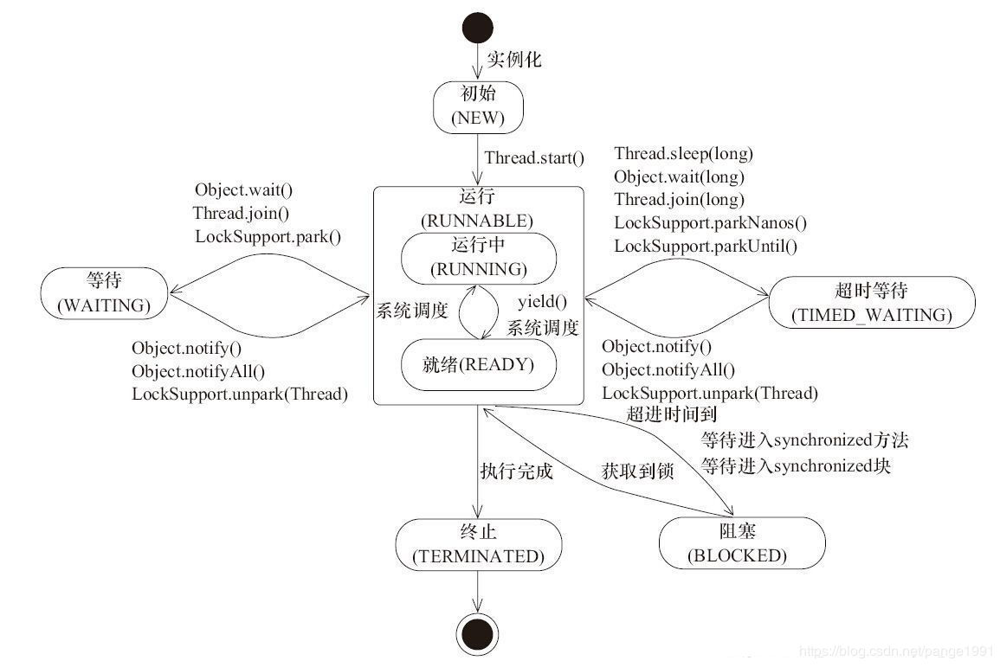

**线程的优先级**

在 Java 线程中，通过一个整型成员变量 `priority` 来控制优先级，优先级的范围从 1~10，在线程构建的时候可以通过 `setPriority(int)`方法来修改优先级，默认优先级是 5，优先级高的线程分配时间片的数量要多于优先级低的线程。

设置线程优先级时，针对频繁阻塞（休眠或者 I/O 操作）的线程需要设置较高优先级，而偏重计算（需要较多 CPU 时间或者偏运算）的线程则设置较低的优先级，确保处理器不会被独占。在不同的 JVM 以及操作系统上，线程规划会存在差异，有些操作系统甚至会忽略对线程优先级的设定。

**线程的调度**

线程调度是指系统为线程分配 CPU 使用权的过程，主要调度方式有两种：协同式线程调度、抢占式线程调度

使用协同式线程调度的多线程系统，线程执行的时间由线程本身来控制，线程把自己的工作执行完之后，要主动通知系统切换到另外一个线程上。使用协同式线程调度的最大好处是实现简单，由于线程要把自己的事情做完后才会通知系统进行线程切换，所以没有线程同步的问题，但是坏处也很明显，如果一个线程出了问题，则程序就会一直阻塞。

使用抢占式线程调度的多线程系统， 每个线程执行的时间以及是否切换都由系统决定。在这种情况下， 线程的执行时间不可控， 所以不会有一个线程导致整个进程阻塞的问题出现。

**Java线程的实现**

Java 线程调度是**抢占式调度**。而且 Java 中的线程优先级是通过映射到操作系统的原生线程上实现的，所以线程的调度最终取决于操作系统，操作系统中线程的优先级有时并不能和 Java 中的一一对应，所以 Java 优先级并不是特别靠谱。

**守护线程**

Daemon（守护）线程是一种支持型线程，因为它主要被用作程序中后台调度以及支持性工作。这意味着，当一个 Java 虚拟机中不存在非 Daemon 线程的时候， Java 虚拟机将会退出。可以通过调用 `Thread.setDaemon(true)`将线程设置 为 Daemon 线程。我们一般用不上，比如垃圾回收线程就是 `Daemon` 线程。

### 并发编程

并发编程Bug的源头：原子性、可见性和有序性问题

#### 原子性

一个或多个操作，要么全部执行且在执行过程中不被任何因素打断，要么全部不执行。在 Java 中，对基本数据类型的变量的读取和赋值操作是原子性操作（64位处理器）。不采取任何的原子性保障措施的自增操作并不是原子性的，比如`i++`操作。

下面例子模拟多线程累加操作

```java
public class AtomicTest {
    private static int counter = 0;

    public static void main(String[] args) {
        for (int i = 0; i < 10; i++) {
            Thread thread = new Thread(() -> {
                for (int j = 0; j < 10000; j++) {
                    counter++;
                }
            });
            thread.start();
        }
        try {
            Thread.sleep(3000);
        } catch (InterruptedException e) {
            e.printStackTrace();
        }
        System.out.println(counter);
    }
}

// 结果：10000~100000不等
```

**如何保证原子性**

- 通过 `synchronized` 关键字保证原子性
- 通过 `Lock`锁保证原子性
- 通过 `CAS`保证原子性

#### 可见性 

可见性是指当多个线程访问同一个变量时，一个线程修改了这个变量的值，其他线程能够立即看得到修改的值。

下面是模拟两个线程对共享变量操作的例子，用来分析线程间的可见性问题

```java
public  class VisibilityTest {

    private  boolean flag = true;

    public void refresh() {
        // 希望结束数据加载工作
        flag = false;
        System.out.println(Thread.currentThread().getName() + "修改flag:"+flag);
    }

    public void load() {
        System.out.println(Thread.currentThread().getName() + "开始执行.....");
        while (flag) {
            //TODO  业务逻辑：加载数据
        }
        System.out.println(Thread.currentThread().getName() + "数据加载完成，跳出循环");
    }

    public static void main(String[] args) throws InterruptedException {
        VisibilityTest test = new VisibilityTest();

        // 线程threadA模拟数据加载场景
        Thread threadA = new Thread(() -> test.load(), "threadA");
        threadA.start();

        // 让threadA先执行一会儿后再启动线程B
        Thread.sleep(1000);

        // 线程threadB通过修改flag控制threadA的执行时间，数据加载可以结束了
        Thread threadB = new Thread(() -> test.refresh(), "threadB");
        threadB.start();
    }
}

// 运行结果：threadA没有跳出循环，也就是说threadB对共享变量flag的更新操作对threadA不可见，存在可见性问题。
```

**如何保证可见性**

- 通过 `volatile` 关键字保证可见性
- 通过 内存屏障保证可见性
- 通过 `synchronized` 关键字保证可见性
- 通过 `Lock`锁保证可见性

#### 有序性

**即程序执行的顺序按照代码的先后顺序执行。**为了提升性能，编译器和处理器常常会对指令做**重排序**，所以存在有序性问题。

```java
public class ReOrderTest {

    private static  int x = 0, y = 0;
    private  static  int a = 0, b = 0;

    public static void main(String[] args) throws InterruptedException {
        int i=0;
        while (true) {
            i++; x = 0; y = 0; a = 0; b = 0;
						// x,y的值是多少:

            Thread thread1 = new Thread(new Runnable() {
                @Override
                public void run() {
                    //用于调整两个线程的执行顺序
                    shortWait(20000);
                    a = 1; x = b;
                }
            });
            Thread thread2 = new Thread(new Runnable() {
                @Override
                public void run() {
                    b = 1; y = a;
                }
            });
            thread1.start();
            thread2.start();
            thread1.join();
            thread2.join();
            System.out.println("第" + i + "次（" + x + "," + y + ")");
            if (x==0&&y==0){
                break;
            }
        }
    }

    public static void shortWait(long interval){
        long start = System.nanoTime();
        long end;
        do{
            end = System.nanoTime();
        }while(start + interval >= end);
    }
}

// 执行结果：x,y出现了0，0的结果，程序终止。出现这种结果有可能是重排序导致的
```

**如何保证有序性**

- 通过 `volatile` 关键字保证有序性
- 通过 内存屏障保证有序性

- 通过 `synchronized`关键字保证有序性
- 通过`Lock`锁保证有序性

### Java内存模型

在并发编程中，需要处理的两个关键问题：

1. 多线程之间如何通信（线程之间以何种机制来交换数据）。

2. 多线程之间如何同步 （控制不同线程间操作发生的相对顺序）。

线程之间常用的通信机制有两种：共享内存和消息传递，Java采用的是共享内存模型。

#### Java内存模型的抽象结构

Java线程之间的通信由Java内存模型（`Java Memory Model`，简称`JMM`）控制，`JMM`决定一个线程对共享变量的写入何时对另一个线程可见。

从抽象的角度来看，`JMM定义了线程和主内存之间的抽象关系：线程之间的共享变量存储在主内存中，每个线程都有一个私有的本地内存，本地内存中存储了共享变量的副本。`本地内存是`JMM`的一个抽象概念，并不真实存在，它涵盖了缓存，写缓冲区，寄存器以及其他的硬件和编译器优化。

根据JMM的规定，**线程对共享变量的所有操作都必须在自己的本地内存中进行，不能直接从主内存中读取**。

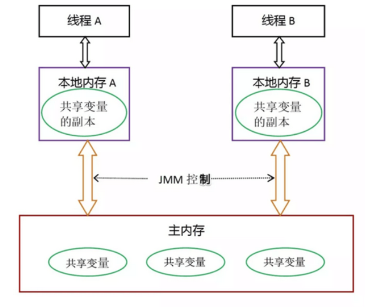

从图中看，线程A和线程B之间要通信的话，必须经历以下两个步骤：

1. 线程A把本地内存A中更新过的共享变量刷新到主内存中

2. 线程B到主内存中去读取线程A之前已更新过的共享变量

所以，线程A无法直接访问线程B的工作内存，线程间通信必须经过主内存。**JMM通过控制主内存与每个线程的本地内存之间的交互，来为Java程序提供内存可见性的保证。**

> Java内存结构：堆，栈，GC垃圾回收。

#### 主内存与工作内存交互协议

关于主内存与工作内存之间的具体交互协议，即一个变量如何从主内存拷贝到工作内存、如何从工作内存同步到主内存之间的实现细节，Java内存模型定义了以下八种**原子操作**来完成：

- lock（锁定）：作用于主内存的变量，把一个变量标识为一条线程独占状态。
- unlock（解锁）：作用于主内存变量，把一个处于锁定状态的变量释放出来，释放后的变量才可以被其他线程锁定。
- read（读取）：作用于主内存变量，把一个变量值从主内存传输到线程的工作内存中，以便随后的load动作使用
- load（载入）：作用于工作内存的变量，它把read操作从主内存中得到的变量值放入工作内存的变量副本中。
- use（使用）：作用于工作内存的变量，把工作内存中的一个变量值传递给执行引擎，每当虚拟机遇到一个需要使用变量的值的字节码指令时将会执行这个操作。
- assign（赋值）：作用于工作内存的变量，它把一个从执行引擎接收到的值赋值给工作内存的变量，每当虚拟机遇到一个给变量赋值的字节码指令时执行这个操作。
- store（存储）：作用于工作内存的变量，把工作内存中的一个变量的值传送到主内存中，以便随后的write的操作。
- write（写入）：作用于主内存的变量，它把store操作从工作内存中得到的变量的值放入主内存的变量中。

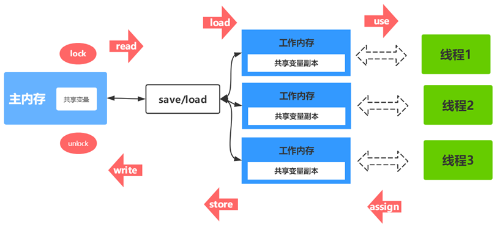

Java内存模型还规定了在执行上述八种基本操作时，必须满足如下规则：

- 如果要把一个变量从主内存中复制到工作内存，就需要按顺序地执行read和load操作， 如果把变量从工作内存中同步回主内存中，就要按顺序地执行store和write操作。**但Java内存模型只要求上述操作必须按顺序执行，而没有保证必须是连续执行。**
- 不允许read和load、store和write操作之一单独出现
- 不允许一个线程丢弃它的最近assign的操作，即**变量在工作内存中改变了之后必须同步到主内存中**。
- 不允许一个线程无原因地（没有发生过任何assign操作）把数据从工作内存同步回主内存中。
- 一个新的变量只能在主内存中诞生，不允许在工作内存中直接使用一个未被初始化（load或assign）的变量。即就是对一个变量实施use和store操作之前，必须先执行过了assign和load操作。
- 一个变量在同一时刻只允许一条线程对其进行lock操作，但lock操作可以被同一条线程重复执行多次，多次执行lock后，只有执行相同次数的unlock操作，变量才会被解锁。lock和unlock必须成对出现
- **如果对一个变量执行lock操作，将会清空工作内存中此变量的值**，在执行引擎使用这个变量前需要重新执行load或assign操作初始化变量的值
- 如果一个变量事先没有被lock操作锁定，则不允许对它执行unlock操作；也不允许去unlock一个被其他线程锁定的变量。
- **对一个变量执行unlock操作之前，必须先把此变量同步到主内存中（执行store和write操作）。**

#### 可见性案例深入分析

**主内存和工作内存的交互过程**

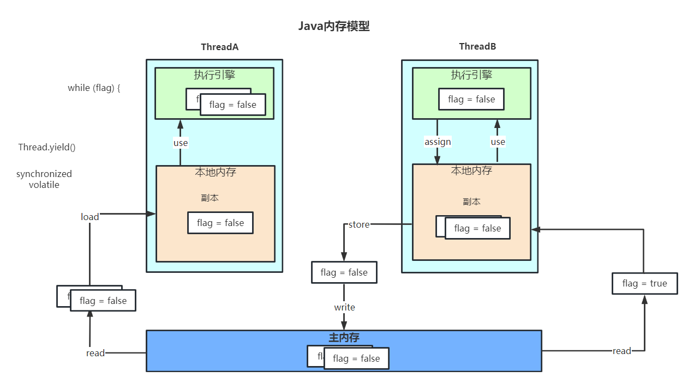

Java中可见性底层有两种实现：

1. 内存屏障（`synchronized、Threed.sleep(10)、volatile`）
2. cup上下文切换 （`Threed.yield()、Threed.sleep(0)`）

**锁的内存语义**

- 当线程获取锁时，`JMM`会把该线程对应的本地内存置为无效。
- 当线程释放锁时，`JMM`会把该线程对应的本地内存中的共享变量刷新到主内存中。

`synchronized`关键字的作用是确保多个线程访问共享资源时的互斥性和可见性。在获取锁之前，线程会将共享变量的最新值从主内存中读取到线程本地的缓存中，释放锁时会将修改后的共享变量的值刷新到主内存中，以保证可见性。

**volatile内存语义**

`volatile`写的内存语义：当写一个`volatile`变量时，`JMM`会把该线程对应的本地内存中的共享变量值刷新到主内存。

`volatile`读的内存语义：当读一个`volatile`变量时，`JMM`会把该线程对应的本地内存置为无效，线程接下来将从主内存中读取共享变量。

**volatile内存语义的实现原理**：`JMM`属于语言级的内存模型，它确保在不同的编译器和不同的处理器平台之上，通过禁止特定类型的编译器重排序和处理器重排序，为程序员提供一致的内存可见性保证。

**volatile禁止重排序规则**：为了实现`volatile`的内存语义，**`JMM`会限制编译器重排序**，JMM针对编译器制定了`volatile`重排序规则表。

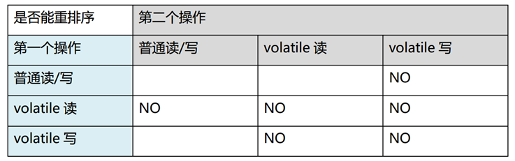

由表中可以看出，**volatile禁止重排序场景**：

1. 当第二个操作是volatile写时，不管第一个操作是什么，都不能重排序。

2. 当第一个操作是volatile读时，不管第二个操作是什么，都不能重排序。

3. 当第一个操作是volatile写，第二个操作是volatile读时，不能重排序。

> **Java中的`volatile`关键字可以保证多线程操作共享变量的可见性以及禁止指令重排序，`synchronized`关键字不仅保证可见性，同时也保证了原子性（互斥性）。在更底层，`JMM`通过内存屏障来实现内存的可见性以及禁止重排序。**为了程序员的方便理解，提出了`happens-before`，它更加的简单易懂，从而避免了程序员为了理解内存可见性而去学习复杂的重排序规则以及这些规则的具体实现方法。

#### 线程安全的单例模式

```java
public class Single {
    private static Single single;
    public static Single getInstance() {
        if (single == null) {
            synchronized (Single.class) {
                if (single == null) {
                    single = new Single();
                }
            }
        }
        return single;
    }
}
```

上面的双重检查锁定却存在着线程安全问题，因为

```java
single = new Single();
```

虽然只有一行代码，但是其实在具体执行的时候有好几步操作：

1. JVM 为 `single` 的对象实例在内存中分配空间

2. 进行对象初始化，完成 `new` 操作

3. JVM 把这个空间的地址赋给引用 `single`

因为 JVM 内部的实现原理（并发相关的重排序等），会产生一种情况，第 3 步会在第 2 步之前执行。于是在多线程下就会产生问题：

A 线程正在 `syn` 同步块中执行`single = new Single();`，此时 B 线程也来执行 `getInstance()`，进行了 `singleDcl == null` 的检查，因为第 3 步会在第 2 步之前执行，B 线程检查发现 `single`不为 `null` ，会直接拿着 `single` 实例使用，但是这时 A 线程还在执行对象初始化，这就导致 B 线程拿到的 `single` 实例可能只初始化了一半，B 线程访问 `single` 实例中的对象域就很有可能出错。

如果想解决这个问题，可以在前面声明 `single` 的位置：`private static Single single;`加上`volatile`关键字即可。

#### JMM内存屏障插入策略

为了实现`volatile`的内存语义，编译器在生成字节码时，会在指令序列中插入内存屏障来禁止特定类型的处理器重排序。**JMM内存屏障插入策略**：

1. 在每个volatile写操作的**前面**插入一个`StoreStore`屏障

2. 在每个volatile写操作的**后面**插入一个`StoreLoad`屏障

3. 在每个volatile读操作的**后面**插入一个`LoadLoad`屏障

4. 在每个volatile读操作的**后面**插入一个`LoadStore`屏障

上述内存屏障的插入策略非常保守，但它可以保证在任意处理器平台，任意程序中都能得到正确的`volatile`内存语义。

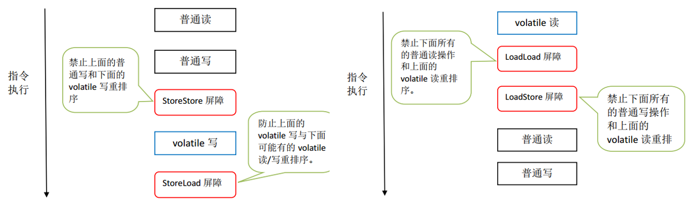

由于不同的处理器有不同的松紧度的处理器内存模型，内存屏障的插入还可以根据具体的处理器内存模型继续优化。以x86处理器为例，x86不会对读-读、读-写、写-写操作做重排序，因此在x86处理器中会省略这3类操作对应的内存屏障，**仅会对写-读操作做重排序**。

内存屏障有两个能力：

1. 阻止屏障两边的指令重排序

2. 刷新处理器缓存

#### happens-before

`JSR-133`使用`happens-before`的概念来指定两个操作之间的执行顺序。

`JSR-133`规范对`happens-before`关系的定义如下：

1. 如果一个操作`happens-before` 另一个操作，那么第一个操作的执行结果将对第二个操作可见，而且第一个操作的执行顺序排在第二个操作之前。

2. 两个操作之间存在`happens-before`关系，并不意味着Java平台的具体实现必须要按照happens-before关系指定的顺序来执行。如果重排序之后的执行结果，与按happens-before关系来执行的结果一致，那么这种排序并不非法。

**JMM遵循一个基本原则：只要不改变程序的执行结果，编译器和处理器怎么优化都行。**

- `as-if-serial`语义保证单线程内程序的执行结果不被改变
- `happens-before`关系保证正确同步的多线程程序的执行结果不被改变。

这么做的目的是为了在不改变程序执行结果的前提下，尽可能地提高程序执行的并行度。

**`happens-before`规则**

`JSR-133`规范定义了如下`happens-before`规则：

1. 程序顺序规则：一个线程中的每个操作，happens-before于该线程中的任意后续操作；

2. 锁定规则：对一个锁的解锁，happens-before于随后对这个锁的加锁；

3. volatile变量规则：对一个volatile变量的写操作，happens-before于任意后续对这个volatile变量的读操作；

4. 传递规则：如果A happens-before B，并且B happens-before C，则A happens-before C；

5. 线程启动规则：如果线程A调用线程B的start()方法来启动线程B，则start()操作happens-before于线程B中的任意操作；

6. 线程中断规则：对线程interrupt()方法的调用happens-before于被中断线程的代码检测到中断事件的发生；

7. 线程终结规则：如果线程A执行操作ThreadB.join()并成功返回，那么线程B中的任意操作happens-before于线程A从ThreadB.join()操作成功返回；

8. 对象终结规则：一个对象的初始化完成happens-before于它的finalize()方法的开始。

### 线程间的通信

很多时候是很多线程一起工作，而且是这些线程间进行通信，或者配合着完成某项工作，这就离不开线程间的通信和协调、协作。

#### join() 方法

现在有 `T1、T2、T3` 三个线程，怎样保证 T2 在 T1 执行完后执行， T3 在 T2 执行完后执行？

用 `Thread.join()` 方法即可， 在 T3  中调用 `T2.join`，在 T2 中调用 `T1.join`。

> join()方法把指定的线程加入到当前线程，可以将两个交替执行的线程合并为顺序执行。比如在线程 B 中调用了线程 A 的 `Join()`方法，直到线程 A 执行完毕后，才会继续执行线程 B 剩下的代码。

#### synchronized 内置锁

Java 支持多个线程同时访问一个对象或者对象的成员变量，但是多个线程同时访问同一个变量，会导致不可预料的结果。关键字 `synchronized` 可以修饰方法或者以同步块的形式来进行使用，**它主要确保多个线程在同一个时刻， 只能有一 个线程处于方法或者同步块中**，它保证了线程对变量访问的可见性和排他性，使多个线程访问同一个变量的结果正确，它又称为内置锁机制。

**对象锁和类锁**

- 对象锁是用于对象实例方法，或者一个对象实例上的；

- 类锁是用于类的静态 方法或者一个类的 class 对象上的。

> 当对同一个变量操作时， 用来做锁的对象必须是同一个，否则加锁毫无作用。

```java
public class Test1 {
    private static int k = 0;
    public static void main(String[] args) {
      	for (int v = 0; v < 2; v ++) {
            new Thread(() -> {
                for (int i = 0; i < 100000; i ++) {
//                    synchronized (Test1.class) { // 最后结果为 200000
//                        k ++;
//                    }
                    synchronized (new Test1()) { // 最后结果为 <=200000
                        k ++;
                    }
                }
            }).start();
        }
        try {
            Thread.sleep(100L);
        } catch (InterruptedException e) {
            throw new RuntimeException(e);
        }
        System.out.println(k);
    }
}
```

#### volatile

volatile 最轻量的通信/同步机制，保证了不同线程对这个变量进行操作时的可见性，即一个线程修改了某个变量的值，这新值对其他线程来说是**立即可见**的。

不加 `volatile` 时，子线程无法到数据的修改。但是 `volatile` 不能保证数据在多个线程下同时写时的线程安全，`volatile` 最适用的场景：一个线程写，多个线程读。

```java
public class Test1 {
    private static boolean flag;
    public static void main(String[] args) throws InterruptedException {
        volatileDemo();   // volatile 可见性
    }

    private static void volatileDemo() {
        new Thread(() -> {
            System.out.println(flag);
            while (!flag) {
                System.out.println("感知数据变化"); // sout中有synchronized 锁，会将对共享资源的修改刷新到主内存中
            } // 阻塞
            System.out.println(flag);
        }).start();
        new Thread(() -> {
            flag = false;
        }).start();
    }
}
```

#### 等待唤醒机制

等待唤醒机制是指一个线程 A 调用了对象O的 `wait()`方法进入等待状态，而另一个线程 B 调用了对象O的 `notify()`或者 `notifyAll()`方法，线程 A 收到通知后从对象O的 `wait()`方法返回，进而执行后续操作。上述两个线程通过对象O来完成交互，而对象上的 `wait()`和 `notify/notifyAll()` 的关系就如同开关信号一样，用来完成等待方和通知方之间的交互工作。

| 方法            | 描述                                                         |
| --------------- | ------------------------------------------------------------ |
| notify()        | 通知一个在对象上等待的线程，使其从 wait 方法返回，前提是该线程获取到了对象的锁；没有获得锁的线程重新进入 WAITING 状态 |
| notifyAll()     | 通知所有等待在该对象上的线程                                 |
| wait()          | 调用该方法的线程进入 WAITING 状态，只有等待另外线程的通知或被中断才会返回；调用 wait()方法后会释放对象的锁 |
| wait(long)      | 超时等待一段时间，参数为毫秒，等待长达 n 毫秒，如果没有通知就超时返回 |
| wait(long, int) | 提供更细粒度的控制超时时间，可以达到纳秒级别                 |

**等待唤醒的标准范式**

等待方遵循如下原则

1. 获取对象的锁。

2. 如果条件不满足， 那么调用对象的 `wait()`方法， 被通知后仍要检查条件。

3. 条件满足则执行对应的逻辑。

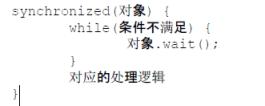

通知方遵循如下原则。

1. 获得对象的锁。

2. 改变条件。

3. 通知所有等待在对象上的线程。

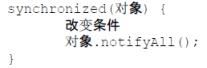

在调用 `wait()、notify()`方法之前，线程必须要获得该对象的对象级别锁，即只能在同步方法或同步块中调用 `wait() 、notify()`方法，进入`wait()`方法后，当前线程释放锁，在从`wait()`返回前，线程与其他线程竞争重新获得锁，如果其中一个线程获得了该对象锁，它就会继续往下执行，在它退出 `synchronized` 代码块，释放锁后，其他的已经被唤醒的线程将会继续竞争获取该锁，一直进行下去，直到所有被唤醒的线程都执行完毕。

```java
public class Test1 {
    private static int count = 0;
    public static void main(String[] args) throws InterruptedException {
				new Thread(() -> {
            synchronized (this) {
                while (count <= 0) {
                    try {
                        this.wait();
                    } catch (InterruptedException e) {
                        throw new RuntimeException(e);
                    }
                }
                count --;
                System.out.println(k);
            }
        }).start();
        new Thread(() -> {
            synchronized (this) {
                count ++;
                System.out.println(count);
                this.notifyAll();
            }
        }).start();
    }
}
```

> 尽可能用 `notifyall()`唤醒线程

**方法和锁**

调用 `yield()、sleep()、wait()、notify()`等方法对锁的影响

- `yield()、sleep()`被调用后，都不会释放当前线程所持有的锁。

- 调用`wait()`方法后，会释放当前线程持有的锁，而且当前被唤醒后，会重新去竞争锁，锁竞争到后才会执行 `wait` 方法后面的代码。

- 调用`notify()`系列方法后，对锁无影响，线程只有在 syn  同步代码执行完后才会自然而然的释放锁，所以 `notify()`方法一般都是 syn 同步代码的最后一行。

**wait 和 notify方法要在同步块中调用**

**原因**：Java API 强制要求这样做，如果不这么做，会抛出 `IllegalMonitorStateException` 异常。根本原因是会发生**lost wake up  问题**。

假如我们有两个线程，一个消费者线程，一个生产者线程。

```java
// 生产者
count++;
notify();

// 消费者
while(count<=0)
wait()
count--
```

如果初始的时候 count 等于 0，这个时候消费者检查 count 的值，发现 count 小于等于 0 的条件成立；就在这个时候，发生了上下文切换，生产者进行了其他操作，把两个步骤都执行完了，也就是发出了通知，准备唤醒一个线程。

这个时候消费者刚决定睡觉，还没睡，所以这个通知就会被丢掉。紧接着，消费者就睡过去了。这就是**lost wake up  问题**。

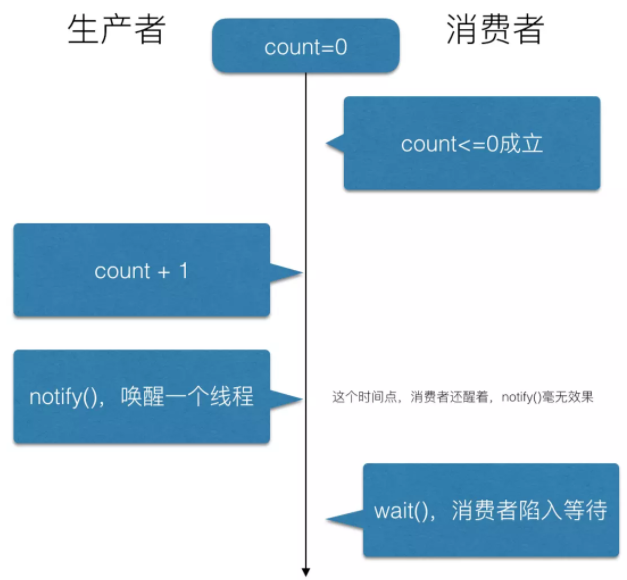

**解决方案**

问题的根源在于，消费者在检查 count 到调用 `wait()`之间，count 就可能被修改。这就是一种很常见的竞态条件。

一般的解决方法是让消费者和生产者竞争一把锁，竞争到了锁才能够修改 count 的值。

**在循环中检查等待条件**

处于等待状态的线程可能会收到错误警报和伪唤醒，如果不在循环中检查等待条件，程序就会在没有满足结束条件的情况下退出。因此，当一个等待线程醒来时，不能认为它原来的等待状态仍然是有效的，在 `notify()`调用之后并且等待线程醒来之前这段时间它可能会改变。这就是在循环中使用 `wait()`方法效果更好的原因。

#### CompleteableFuture

[参考博客](https://juejin.cn/post/6970558076642394142#heading-14)

JDK1.5 版本引入了 `Future`，可以把它简单的理解为运算结果的占位符， 它提供了两个方法来获取运算结果。

- `get()`：调用该方法线程将会无限期等待运算结果。

- `get(longtimeout, TimeUnit unit)`：调用该方法线程将仅在指定时间 `timeout` 内等待结果，如果等待超时就会抛出 `TimeoutException`  异常。

`Future`  可以使用 `Runnable`  或 `Callable` 实例来完成提交的任务，它存在如 下几个问题：

1. **阻塞**：调用 `get()` 方法会一直阻塞，直到等待直到计算完成，它没有提供任何方法可以在完成时通知，同时也不具有附加回调函数的功能。

2. **链式调用和结果聚合处理**：在很多时候链接多个 `Future`来完成耗时较长的计算，此时需要合并结果并将结果发送到另一个任务中，该接口很难完成这种处理。

3. **异常处理**：`Future`  没有提供任何异常处理的方式。

JDK1.8 才新加入的一个实现类 `CompletableFuture` ，很好的解决了这些问题，`CompletableFuture` 实现了 `Future` ，`CompletionStage`两个接口。 实现了`Future` 接口，意味着可以像以前一样通过阻塞或者轮询的方式获得结果。

**示例**

假设我们有两个任务服务，一个查询用户基本信息，一个是查询用户勋章信息。

```java
public class UserInfoService {

    public UserInfo getUserInfo(Long userId) throws InterruptedException {
        Thread.sleep(300);//模拟调用耗时
        return new UserInfo("666", "小男孩", 27); //一般是查数据库，或者远程调用返回的
    }
}

public class MedalService {

    public MedalInfo getMedalInfo(long userId) throws InterruptedException {
        Thread.sleep(500); //模拟调用耗时
        return new MedalInfo("666", "守护勋章");
    }
}
```

- 使用`Future`来进行异步调用

```java
public class FutureTest {

    public static void main(String[] args) throws ExecutionException, InterruptedException {

        ExecutorService executorService = Executors.newFixedThreadPool(10);

        UserInfoService userInfoService = new UserInfoService();
        MedalService medalService = new MedalService();
        long userId =666L;
        long startTime = System.currentTimeMillis();

        //调用用户服务获取用户基本信息
        FutureTask<UserInfo> userInfoFutureTask = new FutureTask<>(new Callable<UserInfo>() {
            @Override
            public UserInfo call() throws Exception {
                return userInfoService.getUserInfo(userId);
            }
        });
        executorService.submit(userInfoFutureTask);

        Thread.sleep(300); //模拟主线程其它操作耗时

        FutureTask<MedalInfo> medalInfoFutureTask = new FutureTask<>(new Callable<MedalInfo>() {
            @Override
            public MedalInfo call() throws Exception {
                return medalService.getMedalInfo(userId);
            }
        });
        executorService.submit(medalInfoFutureTask);

        UserInfo userInfo = userInfoFutureTask.get();//获取个人信息结果
        MedalInfo medalInfo = medalInfoFutureTask.get();//获取勋章信息结果

        System.out.println("总共用时" + (System.currentTimeMillis() - startTime) + "ms");
    }
}
    
// 总共用时806ms
```

- 改用`CompletableFuture`实现

```java
public class FutureTest {

    public static void main(String[] args) throws InterruptedException, ExecutionException, TimeoutException {

        UserInfoService userInfoService = new UserInfoService();
        MedalService medalService = new MedalService();
        long userId =666L;
        long startTime = System.currentTimeMillis();

        //调用用户服务获取用户基本信息
        CompletableFuture<UserInfo> completableUserInfoFuture = CompletableFuture.supplyAsync(() -> userInfoService.getUserInfo(userId));

        Thread.sleep(300); //模拟主线程其它操作耗时

        CompletableFuture<MedalInfo> completableMedalInfoFuture = CompletableFuture.supplyAsync(() -> medalService.getMedalInfo(userId)); 

        UserInfo userInfo = completableUserInfoFuture.get(2,TimeUnit.SECONDS);//获取个人信息结果
        MedalInfo medalInfo = completableMedalInfoFuture.get();//获取勋章信息结果
        System.out.println("总共用时" + (System.currentTimeMillis() - startTime) + "ms");

    }
}
```

`CompletableFuture`的`supplyAsync`方法，提供了异步执行的功能，线程池也不用单独创建了。实际上`CompletableFuture`使用了默认线程池是**`ForkJoinPool.commonPool`**。

**`CompletableFuture`使用场景**

- **创建异步任务**


1. `supplyAsync`执行`CompletableFuture`任务，支持返回值

2. `runAsync`执行`CompletableFuture`任务，没有返回值。

```java
//使用默认内置线程池ForkJoinPool.commonPool()，根据supplier构建执行任务
public static <U> CompletableFuture<U> supplyAsync(Supplier<U> supplier)
//自定义线程，根据supplier构建执行任务
public static <U> CompletableFuture<U> supplyAsync(Supplier<U> supplier, Executor executor)

  
//使用默认内置线程池ForkJoinPool.commonPool()，根据runnable构建执行任务
public static CompletableFuture<Void> runAsync(Runnable runnable) 
//自定义线程，根据runnable构建执行任务
public static CompletableFuture<Void> runAsync(Runnable runnable,  Executor executor)
```

示例

```java
public class FutureTest {

    public static void main(String[] args) {
        //可以自定义线程池
        ExecutorService executor = Executors.newCachedThreadPool();
        //runAsync的使用
        CompletableFuture<Void> runFuture = CompletableFuture.runAsync(() -> System.out.println("run"), executor);
        //supplyAsync的使用
        CompletableFuture<String> supplyFuture = CompletableFuture.supplyAsync(() -> {
                    System.out.print("supply");
                    return "666"; }, executor);
        //runAsync的future没有返回值，输出null
        System.out.println(runFuture.join());
        //supplyAsync的future，有返回值
        System.out.println(supplyFuture.join());
        executor.shutdown(); // 线程池需要关闭
    }
}
//输出
run
null
supply666
```

- **任务异步回调**

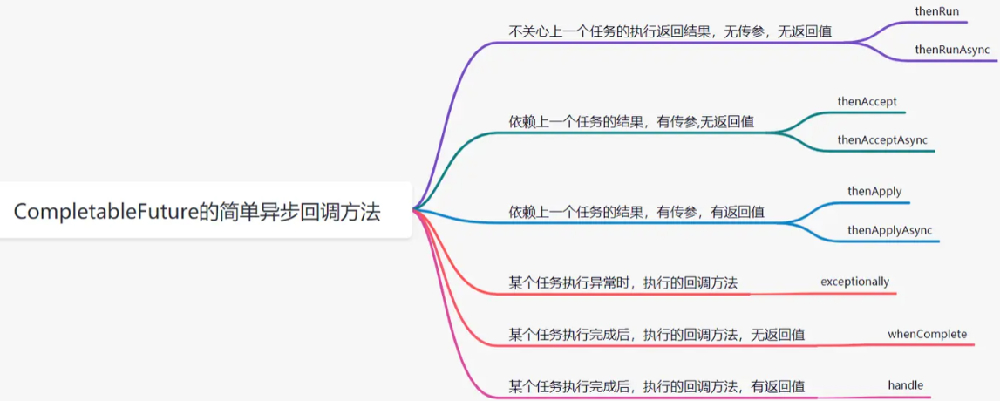

1. `thenRun/thenRunAsync`：**做完第一个任务后，再做第二个任务**。某个任务执行完成后，执行回调方法；但是前后两个任务**没有参数传递，第二个任务也没有返回值**

```java
public CompletableFuture<Void> thenRun(Runnable action);
public CompletableFuture<Void> thenRunAsync(Runnable action);
```

**示例**

```java
public class FutureThenRunTest {

    public static void main(String[] args) throws ExecutionException, InterruptedException {

        CompletableFuture<String> orgFuture = CompletableFuture.supplyAsync(
                ()->{
                    System.out.println("先执行第一个CompletableFuture方法任务");
                    return "666";
                }
        );

        CompletableFuture thenRunFuture = orgFuture.thenRun(() -> {
            System.out.println("接着执行第二个任务");
        });

        System.out.println(thenRunFuture.get());
    }
}
//输出
先执行第一个CompletableFuture方法任务
接着执行第二个任务
null
```

2. `thenAccept/thenAcceptAsync`：第一个任务执行完成后，执行第二个回调方法任务，会将该任务的执行结果，作为入参，传递到回调方法中，但是回调方法是**没有返回值**的。

```java
public class FutureThenAcceptTest {

    public static void main(String[] args) throws ExecutionException, InterruptedException {

        CompletableFuture<String> orgFuture = CompletableFuture.supplyAsync(
                ()->{
                    System.out.println("原始CompletableFuture方法任务");
                    return "666";
                }
        );

        CompletableFuture thenAcceptFuture = orgFuture.thenAccept((a) -> {
            if ("666".equals(a)) {
                System.out.println("9");
            }

            System.out.println("先考虑考虑");
        });

        System.out.println(thenAcceptFuture.get());
    }
}
```

3. `thenApply/thenApplyAsync`：第一个任务执行完成后，执行第二个回调方法任务，会将该任务的执行结果，作为入参，传递到回调方法中，并且回调方法是有返回值的。

```java
public class FutureThenApplyTest {

    public static void main(String[] args) throws ExecutionException, InterruptedException {

        CompletableFuture<String> orgFuture = CompletableFuture.supplyAsync(
                ()->{
                    System.out.println("原始CompletableFuture方法任务");
                    return "666";
                }
        );

        CompletableFuture<String> thenApplyFuture = orgFuture.thenApply((a) -> {
            if ("666".equals(a)) {
                return "9";
            }

            return "先考虑考虑";
        });

        System.out.println(thenApplyFuture.get());
    }
}
//输出
原始CompletableFuture方法任务
666
```

4. `exceptionally`：某个任务执行异常时，执行的回调方法;并且有**抛出异常作为参数**，传递到回调方法。

```java
public class FutureExceptionTest {

    public static void main(String[] args) throws ExecutionException, InterruptedException {

        CompletableFuture<String> orgFuture = CompletableFuture.supplyAsync(
                ()->{
                    System.out.println("当前线程名称：" + Thread.currentThread().getName());
                    throw new RuntimeException();
                }
        );

        CompletableFuture<String> exceptionFuture = orgFuture.exceptionally((e) -> {
            e.printStackTrace();
            return "你的程序异常啦";
        });

        System.out.println(exceptionFuture.get());
    }
}
//输出
当前线程名称：ForkJoinPool.commonPool-worker-1
java.util.concurrent.CompletionException: java.lang.RuntimeException
	at java.util.concurrent.CompletableFuture.encodeThrowable(CompletableFuture.java:273)
	at java.util.concurrent.CompletableFuture.completeThrowable(CompletableFuture.java:280)
	at java.util.concurrent.CompletableFuture$AsyncSupply.run(CompletableFuture.java:1592)
	at java.util.concurrent.CompletableFuture$AsyncSupply.exec(CompletableFuture.java:1582)
	at java.util.concurrent.ForkJoinTask.doExec(ForkJoinTask.java:289)
	at java.util.concurrent.ForkJoinPool$WorkQueue.runTask(ForkJoinPool.java:1056)
	at java.util.concurrent.ForkJoinPool.runWorker(ForkJoinPool.java:1692)
	at java.util.concurrent.ForkJoinWorkerThread.run(ForkJoinWorkerThread.java:157)
Caused by: java.lang.RuntimeException
	at cn.eovie.future.FutureWhenTest.lambda$main$0(FutureWhenTest.java:13)
	at java.util.concurrent.CompletableFuture$AsyncSupply.run(CompletableFuture.java:1590)
	... 5 more
你的程序异常啦
```

5. `whenComplete`：某个任务执行完成后，执行的回调方法，**无返回值**；并且`whenComplete`方法返回的`CompletableFuture`的**result是上个任务的结果**。

```java
public class FutureWhenTest {

    public static void main(String[] args) throws ExecutionException, InterruptedException {

        CompletableFuture<String> orgFuture = CompletableFuture.supplyAsync(
                ()->{
                    System.out.println("当前线程名称：" + Thread.currentThread().getName());
                    try {
                        Thread.sleep(2000L);
                    } catch (InterruptedException e) {
                        e.printStackTrace();
                    }
                    return "666";
                }
        );

        CompletableFuture<String> rstFuture = orgFuture.whenComplete((a, throwable) -> {
            System.out.println("当前线程名称：" + Thread.currentThread().getName());
            System.out.println("上个任务执行完啦，还把" + a + "传过来");
            if ("666".equals(a)) {
                System.out.println("999");
            }
            System.out.println("233333");
        });

        System.out.println(rstFuture.get());
    }
}
//输出
当前线程名称：ForkJoinPool.commonPool-worker-1
当前线程名称：ForkJoinPool.commonPool-worker-1
上个任务执行完啦，还把666传过来
999
233333
666
```

6. `handle`：**某个任务执行完成后，执行回调方法，并且是有返回值的**；并且`handle`方法返回的`CompletableFuture`的result是**回调方法**执行的结果。

```java
public class FutureHandlerTest {

    public static void main(String[] args) throws ExecutionException, InterruptedException {

        CompletableFuture<String> orgFuture = CompletableFuture.supplyAsync(
                ()->{
                    System.out.println("当前线程名称：" + Thread.currentThread().getName());
                    try {
                        Thread.sleep(2000L);
                    } catch (InterruptedException e) {
                        e.printStackTrace();
                    }
                    return "666";
                }
        );

        CompletableFuture<String> rstFuture = orgFuture.handle((a, throwable) -> {

            System.out.println("上个任务执行完啦，还把" + a + "传过来");
            if ("666".equals(a)) {
                System.out.println("999");
                return "aaa";
            }
            System.out.println("233333");
            return null;
        });

        System.out.println(rstFuture.get());
    }
}
//输出
当前线程名称：ForkJoinPool.commonPool-worker-1
上个任务执行完啦，还把666传过来
999
aaa
```

- **多个任务组合处理**

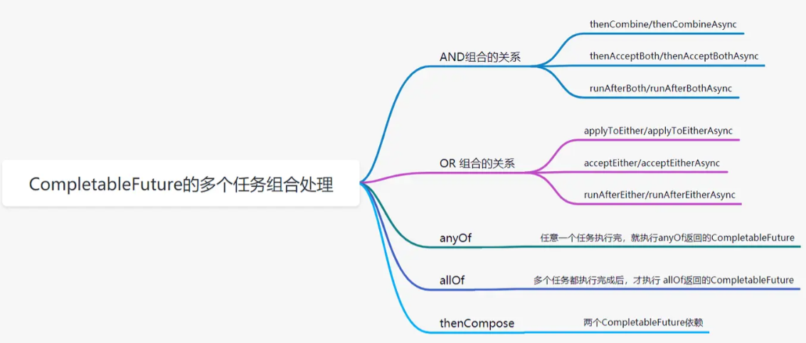

1. AND组合关系

`thenCombine / thenAcceptBoth / runAfterBoth` 都表示：**将两个`CompletableFuture`组合起来，只有这两个都正常执行完了，才会执行某个任务**。

区别在于：

- `thenCombine`：会将两个任务的执行结果作为方法入参，传递到指定方法中，且**有返回值**
- `thenAcceptBoth`：会将两个任务的执行结果作为方法入参，传递到指定方法中，且**无返回值**
- `runAfterBoth`：不会把执行结果当做方法入参，且没有返回值。

```java
public class ThenCombineTest {

    public static void main(String[] args) throws InterruptedException, ExecutionException, TimeoutException {

        CompletableFuture<String> first = CompletableFuture.completedFuture("第一个异步任务");
        ExecutorService executor = Executors.newFixedThreadPool(10);
        CompletableFuture<String> future = CompletableFuture
                //第二个异步任务
                .supplyAsync(() -> "第二个异步任务", executor)
                // (w, s) -> System.out.println(s) 是第三个任务
                .thenCombineAsync(first, (s, w) -> {
                    System.out.println(w);
                    System.out.println(s);
                    return "两个异步任务的组合";
                }, executor);
        System.out.println(future.join());
        executor.shutdown();

    }
}
//输出
第一个异步任务
第二个异步任务
两个异步任务的组合
```

2. OR组合关系

`applyToEither / acceptEither / runAfterEither` 都表示：将两个`CompletableFuture`组合起来，只要其中一个执行完了,就会执行某个任务。

区别在于：

- `applyToEither`：会将已经执行完成的任务，作为方法入参，传递到指定方法中，且有返回值
- `acceptEither`：会将已经执行完成的任务，作为方法入参，传递到指定方法中，且无返回值
- `runAfterEither`：不会把执行结果当做方法入参，且没有返回值。

```java
public class AcceptEitherTest {
    public static void main(String[] args) {
        //第一个异步任务，休眠2秒，保证它执行晚点
        CompletableFuture<String> first = CompletableFuture.supplyAsync(()->{
            try{

                Thread.sleep(2000L);
                System.out.println("执行完第一个异步任务");}
                catch (Exception e){
                    return "第一个任务异常";
                }
            return "第一个异步任务";
        });
        ExecutorService executor = Executors.newSingleThreadExecutor();
        CompletableFuture<Void> future = CompletableFuture
                //第二个异步任务
                .supplyAsync(() -> {
                            System.out.println("执行完第二个任务");
                            return "第二个任务";}
                , executor)
                //第三个任务
                .acceptEitherAsync(first, System.out::println, executor);

        executor.shutdown();
    }
}
//输出
执行完第二个任务
第二个任务
```

**`CompletableFuture` 使用注意事项**

1. Future需要获取返回值，才能获取异常信息

```java
ExecutorService executorService = new ThreadPoolExecutor(5, 10, 5L,
    TimeUnit.SECONDS, new ArrayBlockingQueue<>(10));
CompletableFuture<Void> future = CompletableFuture.supplyAsync(() -> {
      int a = 0;
      int b = 666;
      int c = b / a;
      return true;
   },executorService).thenAccept(System.out::println);
   
 //如果不加 get()方法这一行，看不到异常信息
 //future.get();
```

Future需要获取返回值，才能获取到异常信息。如果不加 `get()/join()`方法，看不到异常信息。使用的时候，注意一下哈，考虑是否加`try...catch...`或者使用`exceptionally`方法。

2. `CompletableFuture`的`get()`方法是阻塞的。

`CompletableFuture`的`get()`方法是阻塞的，如果使用它来获取异步调用的返回值，需要添加超时时间

```java
//反例
CompletableFuture.get();
//正例
CompletableFuture.get(5, TimeUnit.SECONDS);
```

3. 默认线程池的注意点

`CompletableFuture`代码中又使用了默认的线程池，处理的线程个数是**电脑CPU核数-1**。在**大量请求过来的时候，处理逻辑复杂的话，响应会很慢**。一般建议使用自定义线程池，优化线程池配置参数。

4. 自定义线程池时，注意饱和策略

`CompletableFuture`的`get()`方法是阻塞的，我们一般建议使用`future.get(3, TimeUnit.SECONDS)`。并且一般建议使用自定义线程池。

但是如果线程池拒绝策略是`DiscardPolicy`或者`DiscardOldestPolicy`，当线程池饱和时，会直接丢弃任务，不会抛弃异常。因此建议，`CompletableFuture`线程池策略**最好使用`AbortPolicy`**，然后耗时的异步线程，做好**线程池隔离**。

### CPU多核缓存架构缓存一致性

**场景一**


**场景二**

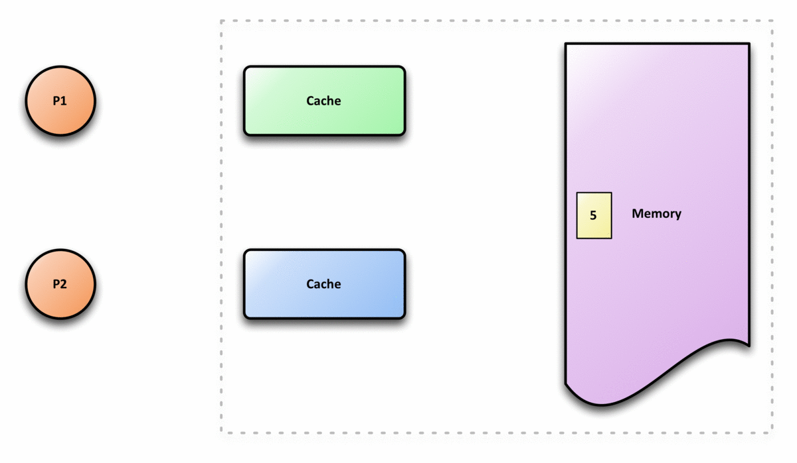

在CPU多核缓存架构中，每个处理器都有一个单独的缓存，共享数据可能有多个副本：一个副本在主内存中，一个副本在请求它的每个处理器的本地缓存中。当数据的一个副本发生更改时，其他副本必须反映该更改。**CPU多核缓存架构要保证缓存一致性**。

#### 缓存一致性解决方案

- 有保证的原子操作：处理器提供一些特殊的指令或者机制，可以保证在多个处理器同时执行原子操作时，它们不会相互干扰，从而保证原子性。

- 总线锁定，使用`LOCK#`信号和`LOCK`指令前缀：总线锁定是一种用于确保原子操作的机制，通常会在`LOCK`指令前缀和一些特殊指令中使用。在执行`LOCK`指令前缀时，处理器会将`LOCK#`信号拉低，这个信号会通知其他处理器当前总线上的数据已经被锁定，从而确保原子性。

- 缓存一致性协议，确保原子操作可以在缓存的数据结构上执行(缓存锁定);

**缓存一致性协议是一种用于确保处理器缓存中的数据和主存中的数据一致的机制。**缓存一致性协议会通过处理器之间的通信，确保在一个处理器修改了某个数据后，其他处理器缓存中的该数据会被更新或者失效，从而保证在多个处理器同时对同一个数据进行操作时，它们所看到的数据始终是一致的。

**缓存锁定则是在缓存一致性协议的基础上实现原子操作的机制，**它会利用缓存一致性协议来确保在多个处理器同时修改同一个缓存行中的数据时，只有一个处理器能够获得锁定，从而保证原子性。缓存锁定的实现也需要硬件的支持，而且不同的处理器架构可能会有不同的实现方式。

缓存一致性协议不能使用的特殊情况：

- **当操作的数据不能被缓存在处理器内部，或操作的数据跨多个缓存行时**，则处理器会调用**总线锁定**。不能被缓存在处理器内部的数据通常指的是不可缓存的设备内存（如显存、网络接口卡的缓存等），这些设备内存一般不受缓存一致性协议的管辖，处理器无法将其缓存到自己的缓存行中。

- 有些处理器不支持缓存锁定。在这些处理器上，只能使用总线锁定来实现原子操作。但现代的处理器通常都支持缓存锁定机制，因此应该尽量使用缓存锁定来实现原子操作，以获得更好的性能。

#### 总线窥探

总线窥探(`Bus snooping`)是缓存中的一致性控制器(`snoopy cache`)监视或窥探总线事务的一种方案，其目标是**在分布式共享内存系统中维护缓存一致性**。包含一致性控制器(`snooper`)的缓存称为`snoopy`缓存。

> 在计算机中，`数据通过总线在处理器和内存之间传递`。每次处理器和内存之间的数据传递都是通过一系列步骤来完成的，这一系列步骤称之为总线事务（Bus Transaction）

**工作原理**

**当特定数据被多个缓存共享时，处理器修改了共享数据的值，更改必须传播到所有其他具有该数据副本的缓存中。这种更改传播可以防止系统违反缓存一致性。**数据变更的通知可以通过总线窥探来完成。所有的窥探者都在监视总线上的每一个事务。如果一个修改共享缓存块的事务出现在总线上，所有的窥探者都会检查他们的缓存是否有共享块的相同副本。如果缓存中有共享块的副本，则相应的窥探者执行一个动作以确保缓存一致性。这个动作可以是刷新缓存块或使缓存块失效。它还涉及到缓存块状态的改变，这取决于缓存一致性协议（`cache coherence protocol`）。

**窥探协议类型**

根据管理写操作的本地副本的方式，有两种窥探协议:

1. **写失效（`Write-invalidate`）**

**当处理器写入一个共享缓存块时，其他缓存中的所有共享副本都会通过总线窥探失效。**这种方法确保处理器只能读写一个数据的一个副本。其他缓存中的所有其他副本都无效。这是最常用的窥探协议。MSI、`MESI`、MOSI、MOESI和MESIF协议属于该类型。 

2. **写更新（`Write-update`）**

当处理器写入一个共享缓存块时，其他缓存的所有共享副本都会通过总线窥探更新。这个方法将写数据广播到总线上的所有缓存中。它比`write-invalidate`协议引起更大的总线流量。这种方法不常见。

#### MESI协议

**MESI协议**是一个基于写失效的缓存一致性协议，是支持回写（`write-back`）缓存的最常用协议。

**缓存行有4种不同的状态:**

- **已修改Modified (M)**：缓存行是脏的（*dirty*），与主存的值不同。如果别的CPU内核要读主存这块数据，该缓存行必须回写到主存，状态变为共享(S).

- **独占Exclusive (E)**：缓存行只在当前缓存中，但是干净的——缓存数据同于主存数据。当别的缓存读取它时，状态变为共享；当前写数据时，变为已修改状态。

- **共享Shared (S)**：缓存行也存在于其它缓存中且是未修改的。缓存行可以在任意时刻抛弃。

- **无效Invalid (I)**：缓存行是无效的

`MESI`协议用于确保多个处理器之间共享的内存数据的一致性。当一个处理器需要访问某个内存数据时：

1. 它首先会检查自己的缓存中是否有该数据的副本。如果缓存中没有该数据的副本，则会发出一个缓存不命中（`miss`）请求，从主内存中获取该数据的副本，并将该数据的副本存储到自己的缓存中。

2. 当一个处理器发出一个缓存不命中请求时，如果该数据的副本已经存在于另一个处理器或核心的缓存中（即处于共享状态），则该处理器可以从另一个处理器的缓存中复制该数据的副本。这个过程称为缓存到**缓存复制（`cache-to-cache transfer`）**。

缓存到缓存复制可以减少对主内存的访问，从而提高系统的性能。但是，需要确保数据的一致性，否则会出现数据错误或不一致的情况。因此，在进行缓存到缓存复制时，需要使用`MESI`协议中的其他状态转换来确保数据的一致性。例如，如果两个缓存都处于修改状态，那么必须先将其中一个缓存的数据写回到主内存，然后才能进行缓存到缓存复制。


## ThreadLocal

### ThreadLocal概念

`ThreadLocal`类提供线程局部变量。这些变量与普通对应变量的不同之处在于，访问一 个变量的每个线程（通过其 get  或 set   方法）都有自己独立初始化的变量副本。`ThreadLocal`  实例通常是希望将状态与线程（例如，用户 ID 或事务 ID）相关联的类中的私有静态字段。

也就是说 `ThreadLocal` 为每个线程都提供了变量的副本，使得每个线程在某 一时间访问到的并非同一个对象，这样就隔离了多个线程对数据的数据共享。

由此也可以看出 `ThreadLocal` 和 `synchonized` 都用于解决多线程并发访问。可是 `ThreadLocal` 与 `synchronized` 有本质的差别。`synchronized` 是利用锁的机制，使变量或代码块在某一时该仅仅能被一个线程访问，`ThreadLocal` 则是副本机制。所以不论多少线程并发访问都是线程安全的。

`ThreadLocal` 的一大应用场景就是跨方法进行参数传递，比如 Web 容器中， 每个完整的请求周期会由一个线程来处理。比如，在微服务领域，链路跟踪中的 `traceId` 传递也是利用了 `ThreadLocal`。

**常用方法**

| 方法                              | 描述                                                         |
| --------------------------------- | ------------------------------------------------------------ |
| `void set(Object value)`          | 设置当前线程的线程局部变量的值。                             |
| `public Object get()`             | 返回当前线程所对应的线程局部变量。                           |
| `public void remove()`            | 删除当前线程局部变量的值，以减少内存占用。当线程结束后，对应该线程的局部变量将自动被垃圾回收，所以显式调用该方法清除线程的局部变量并不是必须的操作，但它可以加快内存回收的速度。 |
| `protected Object initialValue()` | 返回线程局部变量的初始值。这是一个受保护的方法，供子类覆盖。延迟调用，仅在线程第一次调用`get()`或`set(Object)`时执行。`ThreadLocal`默认实现返回`null`。 |

因为每个线程所拥有的变量的副本数是不定的，所以线程内部存放变量副本需要一个容器，而且容器要支持快速存取，这就可以在每个线程内部设置一个 Map 来支持多个变量副本，这个 Map 被称为`ThreadLocalMap`。

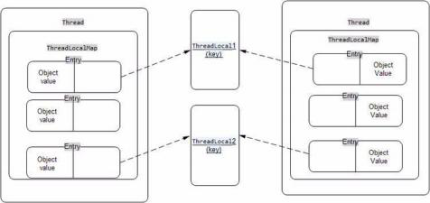

```java
public class Test2 {
    static ThreadLocal<String> threadLocal1 = new ThreadLocal<>();
    static ThreadLocal<Integer> threadLocal2 = new ThreadLocal<>();

    public static void main(String[] args) {
        Test2 test2 = new Test2();
        test2.startThreadArray();
    }

    public void startThreadArray() {
        Thread[] runs = new Thread[3];
        for (int i = 0; i < runs.length; i++) {
            new MyThread(i).start();
        }
    }

    public static class MyThread extends Thread {
        int id;

        public MyThread(int id) {
            this.id = id;
        }

        public void run() {
            String threadName = Thread.currentThread().getName();

            threadLocal1.set("线程_" + id);
            if (id == 2) {
                threadLocal2.set(id);//线程2才会执行
            }

            System.out.println(threadName + ":" + threadLocal1.get());
            System.out.println(threadName + ":" + threadLocal2.get());

        }
    }
}

// 输出
Thread-0:线程_0
Thread-1:线程_1
Thread-1:null
Thread-2:线程_2
Thread-2:2
Thread-0:null
```

### ThreadLocal引发的内存泄露

在使用`ThreadLocal`后需要进行移除，否则会出现内存泄漏的情况

```java
// 将堆内存大小设置为-Xmx 256m
public class ThreadLocalMemoryLeak {
    private static final int TASK_LOOP_SIZE = 500;

    /*线程池*/
    final static ThreadPoolExecutor poolExecutor
            = new ThreadPoolExecutor(5, 5, 1,
            TimeUnit.MINUTES,
            new LinkedBlockingQueue<>());

    static class LocalVariable {
        private byte[] a = new byte[1024*1024*5];/*5M大小的数组*/
    }

    ThreadLocal<LocalVariable> threadLocalLV;

    public static void main(String[] args) throws InterruptedException {
        Thread.sleep(4000);
        for (int i = 0; i < TASK_LOOP_SIZE; ++i) {
            poolExecutor.execute(new Runnable() {
                public void run() {
                    try {
                        Thread.sleep(500);
                    } catch (InterruptedException e) {
                        throw new RuntimeException(e);
                    }
                    LocalVariable localVariable = new LocalVariable();          // 2、创建一个数组时，内存占用为25M
                    ThreadLocalMemoryLeak oom = new ThreadLocalMemoryLeak();
                    oom.threadLocalLV = new ThreadLocal<>();
                    oom.threadLocalLV.set(new LocalVariable());                 // 3、使用ThreadLocal时，内存占用为100+M
                    oom.threadLocalLV.remove();									// 4、使用ThreadLocal后移除，内存占用恢复为25M
                    System.out.println("use local varaible"); 		            // 1、只有输出时，内存占用为25M
                }
            });
            Thread.sleep(100);
        }
        System.out.println("pool execute over");
    }
}
```

**分析**

每个 Thread 维护一个 `ThreadLocalMap`，这个映射表的 key 是 `ThreadLocal` 实例本身，value 是真正需要存储的 `Object`，也就是说 `ThreadLocal` 本身并不存储值，它只是作为一个 key 来让线程从`ThreadLocalMap` 中获取 value。仔细观察 `ThreadLocalMap`，这个 map 是使用 `ThreadLocal` 的弱引用作为 Key 的，弱引用的对象在 `GC` 时会被回收。

因此使用了 `ThreadLocal` 后，引用链如图所示，图中的虚线表示弱引用。

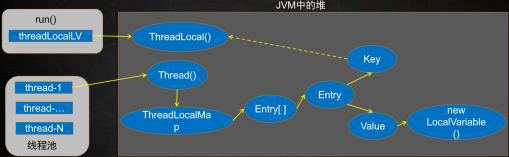

这样，当把 `Threadlocal` 变量置为 `null` 以后，没有任何强引用指向 `Threadlocal` 实例，所以 `Threadlocal` 将会被 `GC` 回收。这样一来，`ThreadLocalMap` 中就会出现 key 为 `null` 的 `Entry`，就没有办法访问访问到这些 key 对应的 value，如果当前一直不结束的话，这些 key 为 `null` 的 `Entry` 的 value 就会一直存在一条**强引用链**（`Thread Ref -> Thread -> ThreaLocalMap -> Entry -> value`），而这些 value 永远不会被访问到，所以存在着**内存泄露**。

只有当前 thread 结束以后，`current thread` 就不会存在栈中，强引用断开，`Current Thread 、Map value` 将全部被 `GC` 回收。最好的做法是不在需要使用`ThreadLocal` 变量后，都调用它的 `remove()`方法，清除数据。

> 无论是 `get()、set()`在某些时候，调用了 `expungeStaleEntry` 方法用来清除 `Entry` 中 `Key` 为 `null` 的 `Value` ，但是这是不及时的，也不是每次都会执行的，所以一些情况下还是会发生内存泄露。只有 `remove()`方法中显式调用了 `expungeStaleEntry` 方法。

**从表面上看内存泄漏的根源在于使用了弱引用**， 但是另一个问题也同样值得思考：为什么使用弱引用而不是强引用？

下面我们分两种情况讨论：

- key 使用强引用：对 `ThreadLocal` 对象实例的引用被置为 `null`  了，但是`ThreadLocalMap` 还持有这个 `ThreadLocal` 对象实例的强引用，如果没有手动删除，`ThreadLocal` 的对象实例不会被回收，导致 `Entry` 内存泄漏。

- key 使用弱引用：对 `ThreadLocal` 对象实例的引用被被置为 `null` 了，由于`ThreadLocalMap`持有 `ThreadLocal` 的弱引用， 即使没有手动删除，`ThreadLocal` 的对象实例也会被回收。value 在下一次 `ThreadLocalMap` 调用 `set、get、remove` 都有机会被回收。

比较两种情况可以发现：由于 `ThreadLocalMap` 的生命周期跟 Thread 一样长，如果都没有手动删除对应 key，都会导致内存泄漏，但是使用弱引用可 以多一层保障。

因此，`ThreadLocal` 内存泄漏的根源是：**由于 `ThreadLocalMap` 的生命周期跟 Thread 一样长，如果没有手动删除对应的 key 就会导致内存泄漏，而不是因为使用了弱引用。**

**总结**

JVM 利用设置 `ThreadLocalMap` 的 `Key` 为弱引用，来避免内存泄露。JVM 调用 `remove、get、set` 方法的时候，回收弱引用。

当 `ThreadLocal` 存储很多 `Key` 为 `null` 的 `Entry` 的时候，而不再去调用 `remove、get、set` 方法，就会导致内存泄漏。

### 错误使用ThreadLocal导致线程不安全

```java
public class ThreadLocalUnsafe implements Runnable {

    public static Number number = new Number(0);
    public static ThreadLocal<Number> value = new ThreadLocal<Number>()/*{
    // 正确写法，让每个线程中的ThreadLocal都持有一个新的Number对象
        @Override
        protected Number initialValue() {
            return new Number(0);
        }
    }*/;

    public void run() {
        Random r = new Random();
        //Number number = value.get();
        //每个线程计数加随机数
        number.setNum(number.getNum()+r.nextInt(100));
      	//将其存储到ThreadLocal中
        value.set(number);
        try {
            Thread.sleep(2);
        } catch (InterruptedException e) {
            throw new RuntimeException(e);
        }
        //输出num值
        System.out.println(Thread.currentThread().getName()+"="+value.get().getNum());
    }

    public static void main(String[] args) {
        for (int i = 0; i < 5; i++) {
            new Thread(new ThreadLocalUnsafe()).start();
        }
    }

    private static class Number {
        private int num;  
      	public Number(int num) {
            this.num = num;
        }
				// get set toString()
    }

}
// 输出
Thread-3=148
Thread-1=148
Thread-2=148
Thread-4=148
Thread-0=148
```

可以看到每个线程输出的结果都是148，是他们没有独自保存自己的 `Number` 副本吗，

仔细考察 `ThreadLocal` 和 `Thead` 的代码，我们发现 `ThreadLocalMap` 中保存的其实是对象的一个引用，这样的话，当有其他线程对这个引用指向的对象实例进行修改时，其实也同时影响了所有的线程持有的对象引用所指向的同一个对象实例。这也就是为什么上面的程序会输出 一样的结果。

而上面的程序的正确写法是让每个线程中的 `ThreadLocal` 都持有一个新的 `Number` 对象。

## CAS与Atomic操作

### 原子操作

原子操作是指一个程序包含多个操作，这些操作要么全部执行，要么全都不执行。

实现原子操作可以使用锁机制，但是实际场景中如果为了实现原子操作而使用锁的话就会显得过于笨重，因此Java提供了`Atomic`系列的原子操作类。

这些原子操作类其实是使用当前的处理器基本都支持的 CAS 指令实现，每一个 CAS 操作过程都包含三个运算符：**一个内存地址 V，一个期望的值 A 和一 个新值 B**，操作的时候如果这个地址上存放的值等于这个期望的值 A，则将地址上的值赋为新值 B，否则不做任何操作。

CAS 的基本思路就是：如果这个地址上的值和期望的值相等，则给其赋予新值，否则不做任何事，但是要返回原值是多少。自然 CAS 操作执行完成时，在业务上不一定完成了，这个时候我们就会对 CAS 操作进行反复重试，于是就有了 **循环 CAS**。很明显，**循环 CAS** 就是在一个循环里不断的 CAS 操作，直到成功为止。Java 中的 `Atomic` 系列的原子操作类的实现则是利用了**循环 CAS** 来实现。

### CAS实现原子操作的三大问题

- **ABA问题**

因为 CAS 需要在操作值的时候，检查值有没有发生变化，如果没有发生变化则更新，但是如果一个值原来是 A，变成了 B，又变成了 A，那么使用 CAS 进行检查时会发现它的值没有发生变化，但是实际上却变化了。

ABA 问题的解决思路就是**使用版本号**。在变量前面追加上版本号，每次变量更新的时候把版本号加 1，那么 `A →B →A` 就会变成`1A →2B →3A`。

- **循环时间长开销大**

自旋 CAS 如果长时间不成功，会给 CPU 带来非常大的执行开销。

- **只能保证一个共享变量的原子操作**

当对一个共享变量执行操作时，我们可以使用循环 CAS 的方式来保证原子操作，但是对多个共享变量操作时，循环 CAS 就无法保证操作的原子性，这个时候就可以用锁。

还有一个取巧的办法， 就是把多个共享变量合并成一个共享变量来操作。比 如，有两个共享变量 `i＝2,j=a,`合并一下 `ij=2a`，然后用 CAS 来操作 `ij`。从 Java 1.5 开始，JDK 提供了 `AtomicReference` 类来保证引用对象之间的原子性，就可以把多个变量放在一个对象里来进行 CAS 操作。

### 原子操作类

**原子更新基本类型**

1. `AtomicInteger`
2. `AtomicIntegerArray`

数组 value 通过构造方法传递进去，然后 `AtomicIntegerArray` 会将当前数组复制一份，所以当 `AtomicIntegerArray` 对内部的数组元素进行修改时，不会影响传入的数组。

```java
public class Test3 {
//    static int ai = 0;
    static AtomicInteger ai = new AtomicInteger(0);
    public static void main(String[] args) {
        for (int i = 0; i < 5; i++) {
            new Thread(() -> {
                for (int j = 0; j < 1000000; j ++) {
//                    ai ++;
                    ai.incrementAndGet();
                }
            }).start();
        }
        try {
            Thread.sleep(100);
        } catch (InterruptedException e) {
            throw new RuntimeException(e);
        }
//        System.out.println(ai);
        System.out.println(ai.get());
    }
}

```

**原子更新引用类型**

原子更新基本类型只能更新一个变量，如果要原子更新多个变量，就需要使用这个原子更新引用类型提供的类。

1. `AtomicReference`：原子更新引用类型。

2. `AtomicStampedReference`：利用版本戳的形式记录每次改变以后的版本号，解决了 ABA 问题。

**原子更新字段类**

如果需原子地更新某个类里的某个字段时，就需要使用原子更新字段类。

使用原子更新字段类需要两步。

第一步，因为原子更新字段类都是抽象类，每次使用的时候必须使用静态方法 `newUpdater()`创建一个更新器，并且需要设置想要更新的类和属性。

第二步，更新类的字段（属性）必须使用 `public volatile`修饰符。

1. `AtomicIntegerFieldUpdater`：原子更新整型的字段的更新器。

2. `AtomicLongFieldUpdater`：原子更新长整型字段的更新器。

3. `AtomicReferenceFieldUpdater`：原子更新引用类型里的字段。

**LongAdder**

JDK1.8 时，Java提供了一个新的原子类：`LongAdder`。根据 Oracle 官方文档的介绍，`LongAdder` 在高并发的场景下会比`AtomicLong` 具有更好的性能，代价是消耗更多的内存空间。

`AtomicLong` 是利用了底层的 CAS 操作来提供并发性的，调用`Unsafe` 类的 `getAndAddLong` 方法，该方法采用自旋的方式不断更新目标值，直到更新成功。

在并发量较低的环境下，线程冲突的概率比较小，自旋的次数不会很多。但是高并发环境下，N 个线程同时进行自旋操作，会出现大量失败并不断自旋的情况，此时 `AtomicLong` 的自旋会成为瓶颈。

这就是 `LongAdder` 引入的初衷——**解决高并发环境下 `AtomicLong` 的自旋瓶颈问题。**

`AtomicLong`中有个内部变量`value`保存着实际的 long 值，所有的操作都是针对该变量进行。也就是说，高并发环境下，value 变量其实是一个**热点**，也就是 N个线程竞争一个热点。

`LongAdder` 的基本思路就是 **分散热点**，将 value 值分散到一个数组中，不同线程会命中到数组的不同槽中，各个线程只对自己槽中的那个值进行 CAS 操作，这样热点就被分散了，冲突的概率就小很多。如果要获取真正的 long 值，只要将各个槽中的变量值累加返回。

这种做法和 `ConcurrentHashMap` 中的**“分段锁”**其实就是类似的思路。

`LongAdder` 提供的 API 和 `AtomicLong` 比较接近，两者都能以原子的方式对 long 型变量进行增减。

但是`AtomicLong`提供的功能其实更丰富，尤其是`addAndGet、decrementAndGet、compareAndSet` 这些方法。

`addAndGet、decrementAndGet` 除了单纯的做自增自减外，还可以立即获取增减后的值， 而 `LongAdder`则需要做同步控制才能精确获取增减后的值。如果业务需求需要精确的控制计数，做计数比较，`AtomicLong`也更合适。

另外，从空间方面考虑，`LongAdder`其实是一种**“空间换时间”**的思想，从这一点来讲 `AtomicLong` 更适合。

> 总之，低并发、一般的业务场景下 `AtomicLong` 是足够了。如果并发量很多，存在大量写多读少的情况，那 `LongAdder` 可能更合适。

对于`LongAdder` 来说，内部有一个 `base` 变量，一个 `Cell[]`数组。

- base 变量：非竞态条件下，直接累加到该变量上。

- `Cell[]`数组：竞态条件下，累加个各个线程自己的槽 `Cell[i]`中。

在实际运用的时候，只有从未出现过并发冲突的时候，`base` 基数才会使用到，一旦出现了并发冲突，之后所有的操作都只针对 `Cell[]`数组中的单元 `Cell`。

而 `LongAdder` 最终结果的求和，并没有使用全局锁，返回值不是绝对准确的，因为调用这个方法时还有其他线程可能正在进行计数累加，所以只能得到某个时刻的近似值，这也就是 `LongAdder`并不能完全替代`LongAtomic` 的原因之一。

而且从实际使用来看，线程数越多，并发操作数越大，`LongAdder` 的优势越大，线程数较小时，`AtomicLong` 的性能还超过了 `LongAdder`。

## 并发安全

### 线程安全

当多个线程访问某个类时，不管运行时环境采用何种调度方式或者这些线程将如何交替执行，并且在调用代码中不需要任何额外的同步或者协同，这个类都能表现出正确的行为，那么就称这个类是**线程安全的**。

#### 线程封闭

实现好的并发是一件困难的事情， 所以很多时候我们都想躲避并发。避免并发最简单的方法就是线程封闭。

**线程封闭**就是把对象封装到一个线程里，只有这一个线程能看到此对象。那么这个对象就算不是线程安全的也不会出现任何安全问题。

**栈封闭**

栈封闭是我们编程当中遇到的最多的线程封闭。简单的说栈封闭就是局部变量。多个线程访问一个方法，此方法中的局部变量都会被拷贝一份到

线程栈中。所以局部变量是不被多个线程所共享的，也就不会出现并发问题。所以能用局部变量就别用全局的变量，全局变量容易引起并发问题。

**TheadLocal**

`ThreadLocal` 是实现线程封闭的最好方法。`ThreadLocal` 内部维护了一个 `Map`，`Map` 的 `key` 是每个线程的名称，而 `Map` 的值就是我们要封闭的对象。每个线程  中的对象都对应着 `Map` 中一个值，也就是 `ThreadLocal` 利用 `Map` 实现了对象的线程封闭。

#### 无状态的类

没有任何成员变量的类，就叫**无状态的类**，这种类一定是线程安全的。如果这个类的方法参数中使用了对象它依然是线程安全的，可能造成线程不安全的是传入方法参数的对象。

#### 让类不可变

让状态不可变，加 `final`关键字，对于一个类，所有的成员变量应该是私有的，同样的只要有可能，所有的成员变量都应该加上 `final` 关键字。

> 要注意如果成员变量又是一个对象时，这个对象所对应的类也要是不可变，才能保证整个类是不可变的；一旦类的成员变量中有对象，上述的 `final` 关键字保证不可变并不能保证类的安全性。
>
> 因为在多线程下，虽然对象的引用不可变，但是对象在堆上的实例是有可能被多个线程同时修改的，没有正确处理的情况下，对象实例在堆中的数据是不可预知的。

#### 加锁和CAS

最常使用的保证线程安全的手段是使用 `synchronized`关键字，使用显式锁，使用各种原子变量，修改数据时使用 `CAS` 机制等等。

### 死锁

#### 概念

**死锁**是指两个或两个以上的进程在执行过程中，由于竞争资源或者由于彼此通信而造成的一种阻塞的现象，若无外力作用，它们都将无法推进下去。此时称系统处于死锁状态或系统产生了死锁。

**死锁形成的条件**

1. 互斥条件：指进程对所分配到的资源进行排它性使用，即在一段时间内某资源只由一个进程占用。如果此时还有其它进程请求资源，则请求者只能等待，直至占有资源的进程用毕释放。

2. 请求和保持条件：指进程已经保持至少一个资源，但又提出了新的资源请求，而该资源已被其它进程占有，此时请求进程阻塞，但又对自己已获得的其它资源保持不放。

3. 不剥夺条件：指进程已获得的资源，在未使用完之前，不能被剥夺，只能在使用完时由自己释放。

4. 环路等待条件：指在发生死锁时，必然存在一个进程——资源的环形链，如进程P0 正在等待一个 P1 占用的资源；P0 正在等待 P1 占用的资源。

**打破死锁**

1. 打破互斥条件：改造独占性资源为虚拟资源，大部分资源已无法改造。

2. 打破不可抢占条件：当一进程占有一独占性资源后又申请一独占性资源而无 法满足，则退出原占有的资源。

3. 打破占有且申请条件：采用资源预先分配策略，即进程运行前申请全部资源，满足则运行，不然就等待，这样就不会占有且申请。

4. 打破循环等待条件：实现资源有序分配策略，对所有设备实现分类编号，所有进程只能采用按序号递增的形式申请资源。

避免死锁常见的算法有有序资源分配法、银行家算法。

#### Java并发解决死锁问题

通过 `jps` 查询应用的进程id，再通过 `jstack id` 查看应用的锁的持有情况

解决死锁问题关键是**保证拿锁的顺序一致**

1. 内部通过顺序比较，确定拿锁的顺序；

2. 采用尝试拿锁的机制。

### 其他安全问题

**活锁**：两个线程在尝试拿锁的机制中，发生多个线程之间互相谦让，不断发生同一个线程总是拿到同一把锁，在尝试拿另一把锁时因为拿不到，而将本来已经持有的锁释放的过程。解决办法是**每个线程休眠随机数，错开拿锁的时间**。

**线程饥饿**：低优先级的线程，总是拿不到执行时间

## AQS与ReentrantLock

### 管程

管程：指的是管理共享变量以及对共享变量的操作过程，让他们支持并发；

互斥：同一时刻只允许一个线程访问共享资源；

同步：线程之间如何通信、协作。

**MESA模型**

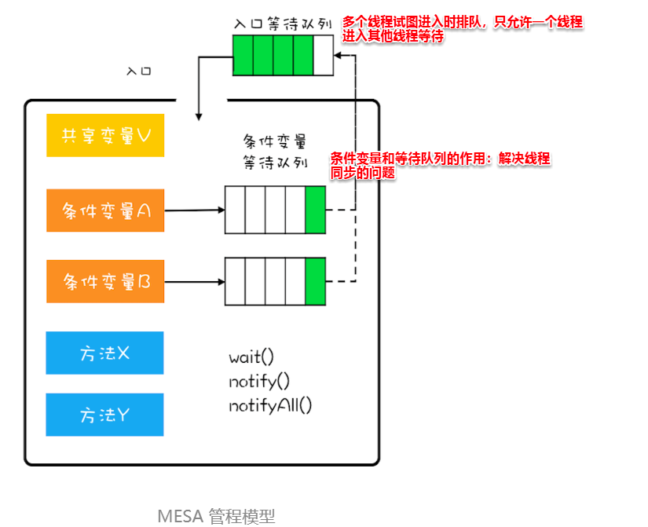

管程中引入了条件变量的概念，而且每个条件变量都对应有一个等待队列。条件变量和等待队列的作用是解决线程之间的同步问题。

Java中针对管程有两种实现

- 一种是基于`Object`的`Monitor`机制，用于`synchronized`内置锁的实现
- 一种是抽象队列同步器`AQS`，用于JUC包下`Lock`锁机制的实现

### AQS简介

`java.util.concurrent`包中的大多数同步器实现都是围绕着共同的基础行为，比如等待队列、条件队列、独占获取、共享获取等，而这些行为的抽象就是基于`AbstractQueuedSynchronizer`（简称`AQS`）实现的，`AQS`是一个抽象同步框架，可以用来实现一个依赖状态的同步器。

JDK中提供的大多数的同步器如`Lock,Latch,Barrier`等，都是基于`AQS`框架来实现的

- 一般是通过一个内部类`Sync`继承 `AQS`
- 将同步器所有调用都映射到`Sync`对应的方法

AQS具备的特性：

- 阻塞等待队列
- 共享/独占
- 公平/非公平
- 可重入
- 允许中断 

### AQS核心结构

AQS内部维护属性`volatile int state`，state表示资源的可用状态

State三种访问方式：

- `getState()` 
- `setState()` 
- `compareAndSetState()`

定义了两种资源访问方式： 

- `Exclusive`：独占，只有一个线程能执行，如`ReentrantLock`
- `Share`：共享，多个线程可以同时执行，如`Semaphore/CountDownLatch`

AQS实现时主要实现以下几种方法：

| 方法名                | 功能描述                                                     |
| --------------------- | ------------------------------------------------------------ |
| isHeldExclusively()   | 该线程是否正在独占资源。只有用到condition才需要去实现它。    |
| tryAcquire(int)       | 独占方式。尝试获取资源，成功则返回true，失败则返回false。    |
| tryRelease(int)       | 独占方式。尝试释放资源，成功则返回true，失败则返回false。    |
| tryAcquireShared(int) | 共享方式。尝试获取资源。负数表示失败；0表示成功，但没有剩余可用资源；正数表示成功，且有剩余资源。 |
| tryReleaseShared(int) | 共享方式。尝试释放资源，如果释放后允许唤醒后续等待结点返回true，否则返回false。 |

### AQS定义两种队列

- 同步等待队列：主要用于维护获取锁失败时入队的线程。
- 条件等待队列：调用`await()`的时候会释放锁，然后线程会加入到条件队列，调用`signal()`唤醒的时候会把条件队列中的线程节点移动到同步队列中，等待再次获得锁。

AQS 定义了5个队列中节点状态：

| 状态值       | 描述                                                 |
| ------------ | ---------------------------------------------------- |
| 0            | 初始化状态，表示当前节点在sync队列中，等待着获取锁。 |
| CANCELLED=1  | 当前的线程被取消。                                   |
| SIGNAL=-1    | 当前节点的后继节点包含的线程需要运行，也就是unpark。 |
| CONDITION=-2 | 当前节点在等待condition，也就是在condition队列中。   |
| PROPAGATE=-3 | 当前场景下后续的acquireShared能够得以执行。          |

#### 同步等待队列

AQS当中的同步等待队列也称`CLH`队列，CLH队列是一种基于双向链表数据结构的队列，是`FIFO`先进先出线程等待队列，Java中的`CLH`队列是原`CLH`队列的一个变种，线程由原自旋机制改为阻塞机制。

AQS 依赖`CLH`同步队列来完成同步状态的管理：

- 当前线程如果获取同步状态失败时，AQS则会将当前线程已经等待状态等信息构造成一个节点（Node）并将其加入到`CLH`同步队列，同时会阻塞当前线程
- 当同步状态释放时，会把首节点唤醒（公平锁），使其再次尝试获取同步状态。
- 通过`signal`或`signalAll`将条件队列中的节点转移到同步队列。（由条件队列转化为同步队列）

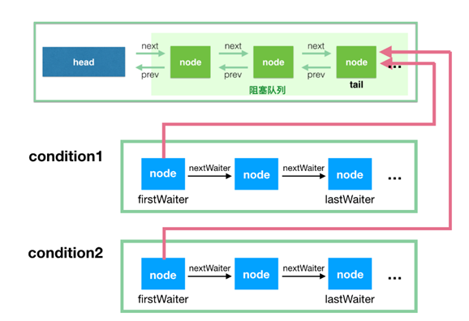

#### 条件等待队列

AQS中条件队列是使用单向列表保存的，用`nextWaiter`来连接:

- 调用`await`方法阻塞线程；
- 当前线程存在于同步队列的头结点，调用`await`方法进行阻塞（从同步队列转化到条件队列）

### ReentrantLock

`ReentrantLock`是一种基于AQS框架的应用实现，是JDK中的一种线程并发访问的同步手段，它的功能类似于`synchronized`是一种互斥锁，可以保证线程安全。

`ReentrantLock`基本使用方式

```java
public class ReentrantLockTest {
    private final ReentrantLock lock = new ReentrantLock();
    // ...
    public void doSomething() {
        lock.lock();  // block until condition holds
        try {
            // ... method body
        } finally {
            lock.unlock();
        }
    }
}
```

`ReentrantLock`源码分析流程

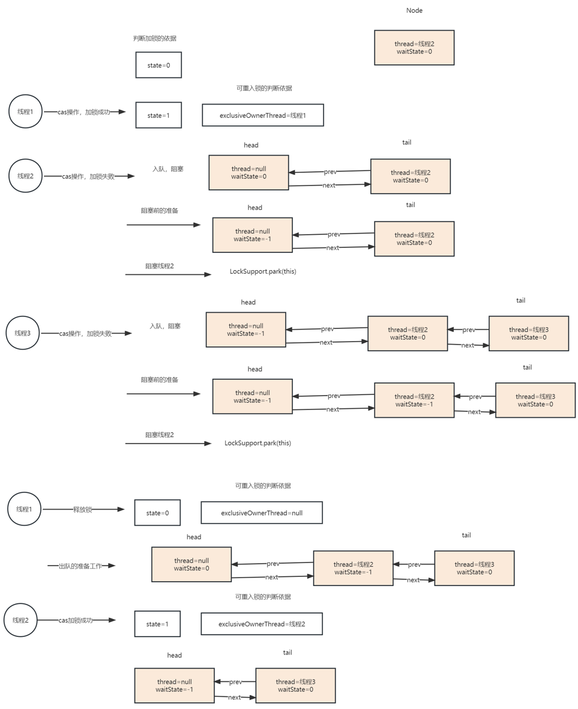

## 读写锁

针对对共享资源读多写少的场景，应该该允许多个线程同时读取共享资源（读读共享）；但是如果一个线程想去写这些共享资源，就不应该允许其他线程对该资源进行读和写操作了（读写，写写互斥）。

### ReentrantReadWriteLock

读写锁，顾名思义一把锁分为读与写两部分，读锁允许多个线程同时获得，因为读操作本身是线程安全的。而写锁是互斥锁，不允许多个线程同时获得写锁。并且读与写操作也是互斥的。读写锁适合读多写少的业务场景。

针对这种场景，JAVA的并发包提供了读写锁`ReentrantReadWriteLock`，它内部维护了两把锁，一个用于只读操作，称为读锁；一个用于写入操作，称为写锁，描述如下：

线程进入读锁的前提条件：

- 没有其他线程的写锁；
- 没有写请求或者有写请求，但调用线程和持有锁的线程是同一个。

线程进入写锁的前提条件：

- 没有其他线程的读锁
- 没有其他线程的写锁

而读写锁有以下三个重要的特性：

- 公平选择性：支持非公平（默认）和公平的锁获取方式，吞吐量还是非公平优于公平。
- 可重入：读锁和写锁都支持线程重入。以读写线程为例：读线程获取读锁后，能够再次获取读锁。写线程在获取写锁之后能够再次获取写锁，同时也可以获取读锁。
- 锁降级：遵循获取写锁、再获取读锁最后释放写锁的次序，写锁能够降级成为读锁。

#### ReentrantReadWriteLock使用

**读写锁接口`ReadWriteLock`**

```java
Lock readLock();
Lock writeLock();
```

`ReentrantReadWriteLock`是可重入的读写锁实现类。只要没有 `Writer` 线程，读锁可以由多个 `Reader` 线程同时持有。也就是说，写锁是独占的，读锁是共享的。

```java
private ReadWriteLock readWriteLock = new ReentrantReadWriteLock();
private Lock r = readWriteLock.readLock();
private Lock w = readWriteLock.writeLock();

// 读操作上读锁
public Data get(String key) {
  r.lock();
  try { 
      // TODO 业务逻辑
  }finally { 
       r.unlock(); 
   }
}

// 写操作上写锁
public Data put(String key, Data value) {
  w.lock();
  try { 
      // TODO 业务逻辑
  }finally { 
       w.unlock(); 
   }
}
```

> **注意事项**
>
> - 读锁不支持条件变量
> - 重入时不支持升级：持有读锁的情况下去获取写锁，会导致获取永久等待
> - 重入时支持降级： 持有写锁的情况下可以去获取读锁

#### 应用场景

`ReentrantReadWriteLock`的常见场景：

1. 读多写少：`ReentrantReadWriteLock`适用于读操作比写操作频繁的场景，因为它允许多个读线程同时访问共享数据，而写操作是独占的。
2. 缓存：`ReentrantReadWriteLock`可以用于实现缓存，因为它可以有效地处理大量的读操作，同时保护缓存数据的一致性。

**读写锁在缓存中的应用**

```java
public class Cache {
    static Map<String, Object> map = new HashMap<String, Object>();
    static ReentrantReadWriteLock rwl = new ReentrantReadWriteLock();
    static Lock r = rwl.readLock();
    static Lock w = rwl.writeLock();

    // 获取一个key对应的value
    public static final Object get(String key) {
        r.lock();
        try {
            return map.get(key);
        } finally {
            r.unlock();
        }
    }

    // 设置key对应的value，并返回旧的value
    public static final Object put(String key, Object value) {
        w.lock();
        try {
            return map.put(key, value);
        } finally {
            w.unlock();
        }
    }

    // 清空所有的内容
    public static final void clear() {
        w.lock();
        try {
            map.clear();
        } finally {
            w.unlock();
        }
    }
}
```

上述示例中，`Cache`组合一个非线程安全的`HashMap`作为缓存的实现，同时使用读锁和写锁来保证`Cache`是线程安全的。

- 读操作`get(String key)`方法中，需要获取读锁，这使得并发访问该方法时不会被阻塞。

- 写操作`put(String key,Object value)`方法和`clear()`方法，在更新`HashMap` 时必须提前获取写锁，当获取写锁后，其他线程对于读锁和写锁的获取均被阻塞，而只有写锁被释放之后，其他读写操作才能继续。

`Cache` 使用读写锁提升读操作的并发性，也保证每次写操作对所有的读写操作的可见性，同时简化了编程方式

####  锁降级

锁降级指的是**写锁降级成为读锁**。如果当前线程拥有写锁，然后将其释放，最后再获取读锁，这种分段完成的过程不能称之为锁降级。

锁降级是指**把持住（当前拥有的）写锁，再获取到读锁，随后释放（先前拥有的）写锁**的过程。锁降级可以帮助我们拿到当前线程修改后的结果而不被其他线程所破坏，防止更新丢失。

**锁降级的使用示例**

如果数据不常变化，那多个线程可以并发地进行数据处理，当数据变更后，如果当前线程感知到数据变化，则进行数据的准备工作，同时其他处理线程被阻塞，直到当前线程完成数据的准备工作。

```java
private final ReentrantReadWriteLock rwl = new ReentrantReadWriteLock();
private final Lock r = rwl.readLock();
private final Lock w = rwl.writeLock();
private volatile boolean update = false;

public void processData() {
    readLock.lock();
    if (!update) {
        // 必须先释放读锁
        readLock.unlock();
        // 锁降级从写锁获取到开始
        writeLock.lock();
        try {
            if (!update) {
                // TODO 准备数据的流程（略）  
                update = true;
            }
            readLock.lock();
        } finally {
            writeLock.unlock();
        }
        // 锁降级完成，写锁降级为读锁
    }
    try {
        //TODO  使用数据的流程（略）
    } finally {
        readLock.unlock();
    }
}
```

> 锁降级中读锁的获取是否必要呢？答案是必要的。
>
> 主要是为了保证数据的可见性，如果当前线程不获取读锁而是直接释放写锁，假设此刻另一个线程（记作线程T）获取了写锁并修改了数据，那么当前线程无法感知线程T的数据更新。
>
> 如果当前线程获取读锁，即遵循锁降级的步骤，则线程T将会被阻塞，直到当前线程使用数据并释放读锁之后，线程T才能获取写锁进行数据更新。

`RentrantReadWriteLock`不支持锁升级（把持读锁、获取写锁，最后释放读锁的过程）。目的也是保证数据可见性，如果读锁已被多个线程获取，其中任意线程成功获取了写锁并更新了数据，则其更新对其他获取到读锁的线程是不可见的。

#### 读写锁设计思路

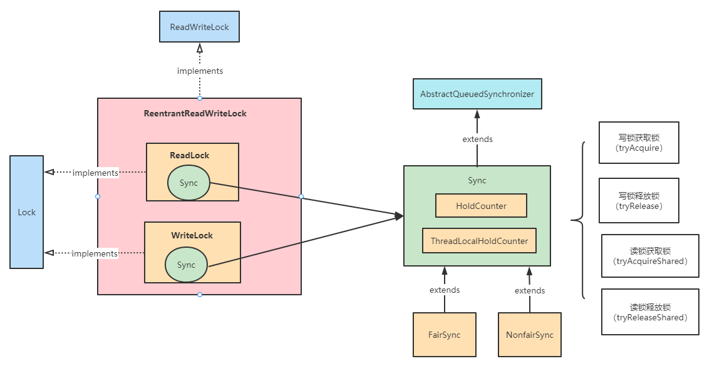

**读写状态的设计**

**设计的精髓：用一个变量如何维护多种状态**

在 `ReentrantLock` 中，使用 `Sync` ( 实际是 `AQS` )的 `int` 类型的 `state` 来表示**同步状态**，表示锁被一个线程重复获取的次数。但是，读写锁 `ReentrantReadWriteLock` 内部维护着一对读写锁，如果要用一个变量维护多种状态，需要采用**高低位分割使用**的方式来维护这个变量，将其切分为两部分：**高16为表示读，低16为表示写**。

分割之后，读写锁通过位运算迅速确定读锁和写锁的状态。假如当前同步状态为S，那么：

- 写状态，等于 `S & 0x0000FFFF`（将高 16 位全部抹去）。当写状态加1，等于S+1；
- 读状态，等于 `S >>> 16` (无符号补 0 右移 16 位)。当读状态加1，等于`S+（1<<16`。

根据状态的划分能得出一个推论：S不等于0时，当写状态（`S&0x0000FFFF`）等于0时，则读状态（`S>>>16`）大于0，即读锁已被获取。

代码实现：`java.util.concurrent.locks.ReentrantReadWriteLock.Sync`

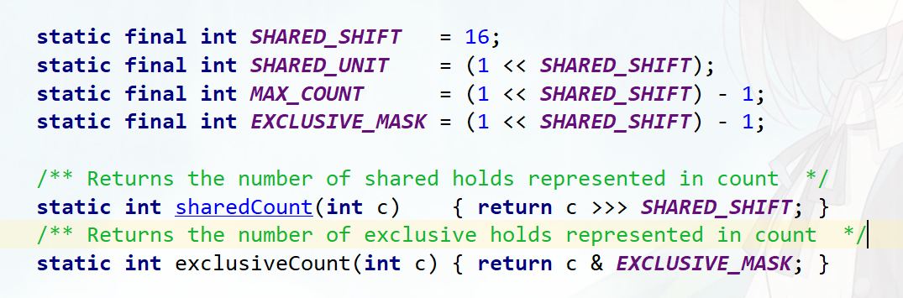

- `exclusiveCount(int c)`：获得持有写状态的锁的次数；
- `sharedCount(int c) `：获得持有读状态的锁的数量。不同于写锁，读锁可以同时被多个线程持有。而每个线程持有的读锁支持重入的特性，所以需要对每个线程持有的读锁的数量单独计数，这就需要用到 `HoldCounter` 计数器。

**HoldCounter 计数器**

读锁的内在机制其实就是一个共享锁。一次共享锁的操作就相当于对`HoldCounter` 计数器的操作。

- 获取共享锁，则该计数器 + 1；
- 释放共享锁，该计数器 - 1。

只有当线程获取共享锁后才能对共享锁进行释放、重入操作。

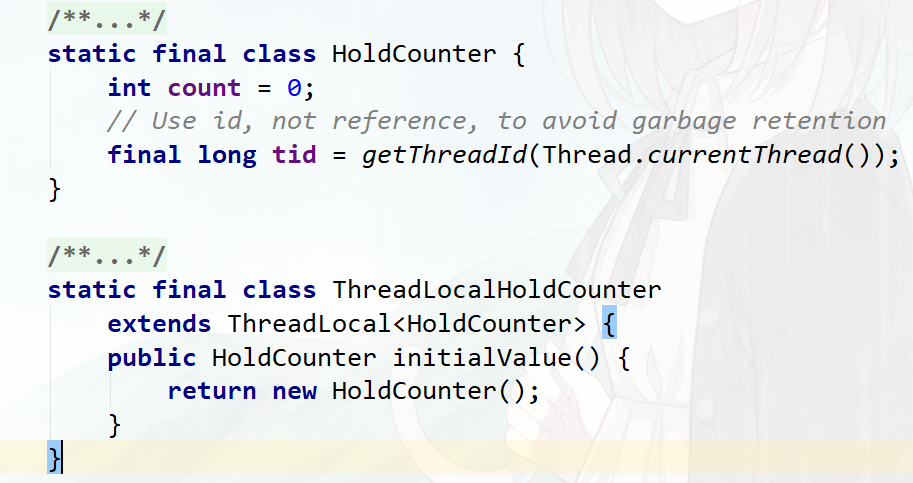

通过 `ThreadLocalHoldCounter` 类，`HoldCounter`与线程进行绑定。`HoldCounter` 是绑定线程的一个计数器，而 `ThreadLocalHoldCounter` 则是线程绑定的 `ThreadLocal`。

- `HoldCounter`用来记录读锁重入数的对象；
- `ThreadLocalHoldCounter`是`ThreadLocal`变量，用来存放第二个获取读锁的线程重入数。

### StampedLock

深入分析`ReentrantReadWriteLock`，会发现它有个潜在的问题：如果有线程正在读，写线程需要等待读线程释放锁后才能获取写锁，即**读的过程中不允许写**，这是一种悲观的读锁。

为了进一步提升并发执行效率，Java8引入了新的读写锁：`StampedLock`。

`StampedLock`和`ReentrantReadWriteLock`相比，改进之处在于：读的过程中也允许获取写锁后写入。

在原先读写锁的基础上新增了一种叫乐观读（`Optimistic Reading`）的模式。该模式并不会加锁，所以不会阻塞线程，会有更高的吞吐量和更高的性能。

它的设计初衷是作为一个内部工具类，用于开发其他线程安全的组件，提升系统性能，并且编程模型也比`ReentrantReadWriteLock `复杂，所以用不好就很容易出现死锁或者线程安全等莫名其妙的问题。

#### StampedLock使用

**StampLock三种访问模式**

- **`Writing`（独占写锁）**：`writeLock` 方法会使线程阻塞等待独占访问，可类比`ReentrantReadWriteLock` 的写锁模式，同一时刻有且只有一个写线程获取锁资源；
- **`Reading`（悲观读锁）**：`readLock`方法，允许多个线程同时获取悲观读锁，悲观读锁与独占写锁互斥，与乐观读共享。
- **`Optimistic Reading`（乐观读）**：这里**乐观读并没有加锁**，也就是不会有 `CAS` 机制并且没有阻塞线程。仅在当前未处于`Writing` 模式 `tryOptimisticRead` 才会返回非 0 的戳（`Stamp`），如果在获取乐观读之后没有出现写模式线程获取锁，则在方法`validate`返回 `true` ，允许多个线程获取乐观读以及读锁，同时允许一个写线程获取写锁。

在使用乐观读的时候要按照固定模板编写，否则很容易出 bug，总结下乐观读编程模型的模板：

```java
public void optimisticRead() {
    // 1. 非阻塞乐观读模式获取版本信息
    long stamp = lock.tryOptimisticRead();
    // 2. 拷贝共享数据到线程本地栈中
    copyVaraibale2ThreadMemory();
    // 3. 校验乐观读模式读取的数据是否被修改过
    if (!lock.validate(stamp)) {
        // 3.1 校验未通过，上读锁
        stamp = lock.readLock();
        try {
            // 3.2 拷贝共享变量数据到局部变量
            copyVaraibale2ThreadMemory();
        } finally {
            // 释放读锁
            lock.unlockRead(stamp);
        }
    }
    // 3.3 校验通过，使用线程本地栈的数据进行逻辑操作
    useThreadMemoryVarables();
}
```

**`StampedLock` 性能比 `ReentrantReadWriteLock` 好？**

关键在于`StampedLock` 提供的乐观读。

`ReentrantReadWriteLock `支持多个线程同时获取读锁，但是当多个线程同时读的时候，所有的写线程都是阻塞的。

`StampedLock` 的乐观读允许一个写线程获取写锁，所以不会导致所有写线程阻塞，也就是当读多写少的时候，写线程有机会获取写锁，减少了线程饥饿的问题，吞吐量大大提高。

**允许多个乐观读和一个写线程同时进入临界资源操作，那读取的数据可能是错的？**

乐观读不能保证读取到的数据是最新的，所以将数据读取到局部变量的时候需要通过`lock.validate(stamp)`

校验是否被写线程修改过，若是修改过则需要上悲观读锁，再重新读取数据到局部变量。

**乐观读**

```java
public class StampedLockTest{

    public static void main(String[] args) throws InterruptedException {
        Point point = new Point();

        //第一次移动x,y
        new Thread(()-> point.move(100,200)).start();
        Thread.sleep(100);
        new Thread(()-> point.distanceFromOrigin()).start();
        Thread.sleep(500);
        //第二次移动x,y
        new Thread(()-> point.move(300,400)).start();

    }
}

@Slf4j
class Point {
    private final StampedLock stampedLock = new StampedLock();

    private double x;
    private double y;

    public void move(double deltaX, double deltaY) {
        // 获取写锁
        long stamp = stampedLock.writeLock();
        log.debug("获取到writeLock");
        try {
            x += deltaX;
            y += deltaY;
        } finally {
            // 释放写锁
            stampedLock.unlockWrite(stamp);
            log.debug("释放writeLock");
        }
    }

    public double distanceFromOrigin() {
        // 获得一个乐观读锁
        long stamp = stampedLock.tryOptimisticRead();
        // 注意下面两行代码不是原子操作
        // 假设x,y = (100,200)
        // 此处已读取到x=100，但x,y可能被写线程修改为(300,400)
        double currentX = x;
        log.debug("第1次读，x:{},y:{},currentX:{}",
                x,y,currentX);
        try {
            Thread.sleep(2000);
        } catch (InterruptedException e) {
            e.printStackTrace();
        }

        // 此处已读取到y，如果没有写入，读取是正确的(100,200)
        // 如果有写入，读取是错误的(100,400)
        double currentY = y;
        log.debug("第2次读，x:{},y:{},currentX:{},currentY:{}",
                x,y,currentX,currentY);

        // 检查乐观读锁后是否有其他写锁发生
        if (!stampedLock.validate(stamp)) {
            // 获取一个悲观读锁
            stamp = stampedLock.readLock();
            try {
                currentX = x;
                currentY = y;

                log.debug("最终结果，x:{},y:{},currentX:{},currentY:{}",
                        x,y,currentX,currentY);
            } finally {
                // 释放悲观读锁
                stampedLock.unlockRead(stamp);
            }
        }
        return Math.sqrt(currentX * currentX + currentY * currentY);
    }

}
```

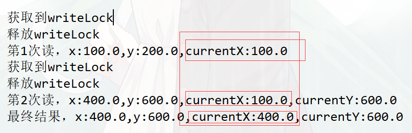

**在缓存中的应用**

将用户id与用户名数据保存在共享变量`idMap` 中，并且提供 `put` 方法添加数据、`get`方法获取数据、以及 `getIfNotExist` 先从 `map` 中获取数据，若没有则模拟从数据库查询数据并放到 `map` 中。

```java
public class CacheStampedLock {
    /**
     * 共享变量数据
     */
    private final Map<Integer, String> idMap = new HashMap<>();
    private final StampedLock lock = new StampedLock();


    /**
     * 添加数据，独占模式
     */
    public void put(Integer key, String value) {
        long stamp = lock.writeLock();
        try {
            idMap.put(key, value);
        } finally {
            lock.unlockWrite(stamp);
        }
    }

    /**
     * 读取数据，只读方法
     */
    public String get(Integer key) {
        // 1. 尝试通过乐观读模式读取数据，非阻塞
        long stamp = lock.tryOptimisticRead();
        // 2. 读取数据到当前线程栈
        String currentValue = idMap.get(key);
        // 3. 校验是否被其他线程修改过,true 表示未修改，否则需要加悲观读锁
        if (!lock.validate(stamp)) {
            // 4. 上悲观读锁，并重新读取数据到当前线程局部变量
            stamp = lock.readLock();
            try {
                currentValue = idMap.get(key);
            } finally {
                lock.unlockRead(stamp);
            }
        }
        // 5. 若校验通过，则直接返回数据
        return currentValue;
    }

    /**
     * 如果数据不存在则从数据库读取添加到 map 中,锁升级运用
     * @param key
     * @return
     */
    public String getIfNotExist(Integer key) {
        // 获取读锁，也可以直接调用 get 方法使用乐观读
        long stamp = lock.readLock();
        String currentValue = idMap.get(key);
        // 缓存为空则尝试上写锁从数据库读取数据并写入缓存
        try {
            while (Objects.isNull(currentValue)) {
                // 尝试升级写锁
                long wl = lock.tryConvertToWriteLock(stamp);
                // 不为 0 升级写锁成功
                if (wl != 0L) {
                    stamp = wl;
                    // 模拟从数据库读取数据, 写入缓存中
                    currentValue = "query db";
                    idMap.put(key, currentValue);
                    break;
                } else {
                    // 升级失败，释放之前加的读锁并上写锁，通过循环再试
                    lock.unlockRead(stamp);
                    stamp = lock.writeLock();
                }
            }
        } finally {
            // 释放最后加的锁
            lock.unlock(stamp);
        }
        return currentValue;
    }

}
```

- `get()` 方法使用了乐观读，使得读写可以并发执行；

- `getIfNotExist()`方法则是使用了读锁转换成写锁的编程模型，先查询缓存，当不存在的时候从数据库读取数据并添加到缓存中。

#### 应用场景

对于读多写少的高并发场景`StampedLock`的性能很好，通过乐观读模式很好的解决了**写线程“饥饿”**的问题，我们可以使用`StampedLock`来代替`ReentrantReadWriteLock` ，但是需要注意的是 `StampedLock `的功能仅仅是 `ReadWriteLock` 的子集，在使用的时候，还是有几个地方需要注意一下。

- `StampedLock` 写锁是不可重入的，如果当前线程已经获取了写锁，再次重复获取的话就会死锁，使用过程中一定要注意；
- 悲观读、写锁都不支持条件变量 `Conditon` ，当需要这个特性的时候需要注意；
- 如果线程阻塞在 `StampedLock` 的 `readLock()` 或者 `writeLock()` 上时，此时调用该阻塞线程的 `interrupt()`方法，会导致 CPU 飙升。所以，使用 `StampedLock`一定不要调用中断操作，如果需要支持中断功能，一定使用可中断的悲观读锁`readLockInterruptibly()` 和写锁`writeLockInterruptibly()`。

## JUC的并发容器

Java的集合容器框架中，主要有四大类别：`List、Set、Queue、Map`，大家熟知的这些集合类`ArrayList、LinkedList、HashMap`都是非线程安全的。

所以，Java先提供了同步容器供用户使用。同步容器可以简单地理解为通过`synchronized`来实现同步的容器，比如`Vector、Hashtable`以及`SynchronizedList`等容器。这样做的代价是削弱了并发性，当多个线程共同竞争容器级的锁时，吞吐量就会降低。

因此为了解决同步容器的性能问题。`java.util.concurrent`包中提供了多种并发类容器：

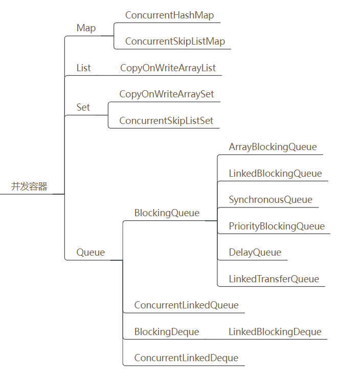

**CopyOnWriteArrayList**

对应的非并发容器：ArrayList

目标：代替`Vector、synchronizedList`

原理：利用高并发往往是读多写少的特性，对读操作不加锁，对写操作，先复制一份新的集合，在新的集合上面修改，然后将新集合赋值给旧的引用，并通过`volatile` 保证其可见性，当然写操作的锁是必不可少的了。

**CopyOnWriteArraySet**

对应的非并发容器：HashSet

目标：代替`synchronizedSet`

原理：基于`CopyOnWriteArrayList`实现，其唯一的不同是在add时调用的是`CopyOnWriteArrayList`的`addIfAbsent`方法，其遍历当前Object数组，如Object数组中已有了当前元素，则直接返回，如果没有则放入Object数组的尾部，并返回。

**ConcurrentHashMap**

对应的非并发容器：HashMap

目标：代替`Hashtable、synchronizedMap`，支持复合操作

原理：JDK6中采用一种更加细粒度的加锁机制Segment“分段锁”，JDK8中采用CAS无锁算法。

**ConcurrentSkipListMap**

对应的非并发容器：TreeMap

目标：代替`synchronizedSortedMap(TreeMap)`

原理：`Skip list`（跳表）是一种可以代替平衡树的数据结构，默认是按照Key值升序的。

### CopyOnWriteArrayList

`CopyOnWriteArrayList` 是 Java 中的一种线程安全的 `List`，它是一个可变的数组，支持并发读和写。与普通的 `ArrayList` 不同，它的读取操作不需要加锁，因此具有很高的并发性能。

#### 应用场景

`CopyOnWriteArrayList` 的应用场景主要有两个方面：

1. **读多写少的场景**

由于 `CopyOnWriteArrayList` 的读操作不需要加锁，因此它非常适合在读多写少的场景中使用。

例如，一个读取频率比写入频率高得多的缓存，使用 `CopyOnWriteArrayList` 可以提高读取性能，并减少锁竞争的开销。

2. **不需要实时更新的数据**

由于`CopyOnWriteArrayList` 读取的数据可能不是最新的，因此它适合于不需要实时更新的数据。

例如，在日志应用中，为了保证应用的性能，日志记录的操作可能被缓冲，并不是实时写入文件系统，而是在某个时刻批量写入。这种情况下，使用 `CopyOnWriteArrayList` 可以避免多个线程之间的竞争，提高应用的性能。

#### CopyOnWriteArrayList使用

**基本使用**

```java
// 创建一个 CopyOnWriteArrayList 对象
CopyOnWriteArrayList phaser = new CopyOnWriteArrayList();
// 新增
copyOnWriteArrayList.add(1);
// 设置（指定下标）
copyOnWriteArrayList.set(0, 2);
// 获取（查询）
copyOnWriteArrayList.get(0);
// 删除
copyOnWriteArrayList.remove(0);
// 清空
copyOnWriteArrayList.clear();
// 是否为空
copyOnWriteArrayList.isEmpty();
// 是否包含
copyOnWriteArrayList.contains(1);
// 获取元素个数
copyOnWriteArrayList.size();
```

**IP 黑名单判定**

当应用接入外部请求后，为了防范风险，一般会对请求做一些特征判定，如对请求 IP 是否合法的判定就是一种。IP 黑名单偶尔会被系统运维人员做更新。

```java
public class CopyOnWriteArrayListDemo {

    private static CopyOnWriteArrayList<String> copyOnWriteArrayList = new CopyOnWriteArrayList<>();
    // 模拟初始化的黑名单数据
    static {
        copyOnWriteArrayList.add("ipAddr0");
        copyOnWriteArrayList.add("ipAddr1");
        copyOnWriteArrayList.add("ipAddr2");
    }

    public static void main(String[] args) throws InterruptedException {
        Runnable task = new Runnable() {
            public void run() {
                // 模拟接入用时
                try {
                    Thread.sleep(new Random().nextInt(5000));
                } catch (Exception e) {}

                String currentIP = "ipAddr" + new Random().nextInt(6);
                if (copyOnWriteArrayList.contains(currentIP)) {
                    System.out.println(Thread.currentThread().getName() + " IP " + currentIP + "命中黑名单，拒绝接入处理");
                    return;
                }
                System.out.println(Thread.currentThread().getName() + " IP " + currentIP + "接入处理...");
            }
        };
        new Thread(task, "请求1").start();
        new Thread(task, "请求2").start();
        new Thread(task, "请求3").start();

        new Thread(new Runnable() {
            public void run() {
                // 模拟用时
                try {
                    Thread.sleep(new Random().nextInt(2000));
                } catch (Exception e) {}

                String newBlackIP = "ipAddr3";
                copyOnWriteArrayList.add(newBlackIP);
                System.out.println(Thread.currentThread().getName() + " 添加了新的非法IP " + newBlackIP);
            }
        }, "IP黑名单更新").start();

        Thread.sleep(1000000);
    }
}
```

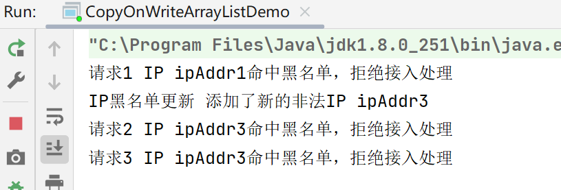

#### 实现原理

`CopyOnWriteArrayList`内部使用了一种称为**“写时复制”**的机制。**当需要进行写操作时，它会创建一个新的数组，并将原始数组的内容复制到新数组中，然后进行写操作**。因此，读操作不会被写操作阻塞，读操作返回的结果可能不是最新的，但是对于许多应用场景来说，这是可以接受的。此外，由于读操作不需要加锁，因此它可以支持更高的并发度。

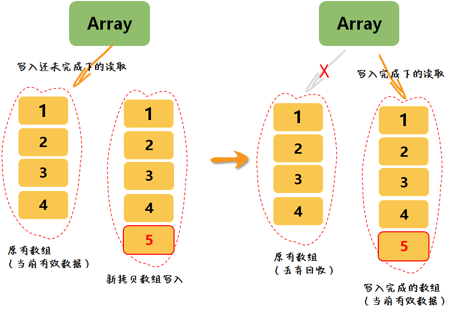

**`CopyOnWriteArrayList` 的缺陷**

`CopyOnWriteArrayList` 有几个缺点：

- 由于写操作的时候，需要拷贝数组，会消耗内存，如果原数组的内容比较多的情况下，可能导致 `young gc` 或者 `full gc`；
- 不能用于实时读的场景，像拷贝数组、新增元素都需要时间，所以调用一个 `set` 操作后，读取到数据可能还是旧的，虽然 `CopyOnWriteArrayList` 能做到最终一致性，但还是没法满足实时性要求；
- `CopyOnWriteArrayList` 合适**读多写少**的场景，不过这类慎用。因为无法保证 `CopyOnWriteArrayList` 要放置多少数据，每次 `add/set` 都要重新复制数组，这个代价非常高昂。在高性能的互联网应用中，这种操作容易引起故障。

#### 迭代器的 `fail-fast、fail-safe`机制

在 Java 中，迭代器（Iterator）在迭代的过程中，如果底层的集合被修改（添加或删除元素），不同的迭代器对此的表现行为是不一样的，可分为两类：`Fail-Fast`（快速失败）和 `Fail-Safe`（安全失败）。

**fail-fast 机制**

`fail-fast` 机制是java集合(`Collection`)中的一种错误机制。当多个线程对同一个集合的内容进行操作时，就可能会产生 `fail-fast` 事件。

例如：当某一个线程A通过 `iterator`去遍历某集合的过程中，若该集合的内容被其他线程所改变了；那么线程A访问集合时，就会抛出`ConcurrentModificationException`异常，产生`fail-fast` 事件。

在 `java.util` 包中的集合，如 `ArrayList、HashMap`等，它们的迭代器默认都是采用 `Fail-Fast`机制。

**fail-fast解决方案**

- 方案一：在遍历过程中所有涉及到改变`modCount`值的地方全部加上`synchronized` 或者直接使用 `Collection#synchronizedList`，这样就可以解决问题，但是不推荐，因为增删造成的同步锁可能会阻塞遍历操作。
- 方案二：使用`CopyOnWriteArrayList`替换 `ArrayList`，推荐使用该方案（即`fail-safe`）。

**fail-safe机制**

任何对集合结构的修改都会在一个复制的集合上进行，因此不会抛出`ConcurrentModificationException`。在`java.util.concurrent` 包中的集合，如`CopyOnWriteArrayList、ConcurrentHashMap`等，它们的迭代器一般都是采用`Fail-Safe` 机制。

缺点：

- 采用 `Fail-Safe`机制的集合类都是线程安全的，但是它们无法保证数据的实时一致性，它们只能保证数据的最终一致性。在迭代过程中，如果集合被修改了，可能读取到的仍然是旧的数据。
- `Fail-Safe`机制还存在另外一个问题，就是**内存占用**。由于这类集合一般都是通过**复制**来实现读写分离的，因此它们会创建出更多的对象，导致占用更多的内存，甚至可能引起频繁的垃圾回收，严重影响性能。

### ConcurrentHashMap

`ConcurrentHashMap`是 Java 中线程安全的哈希表，它支持高并发并且能够同时进行读写操作。

在JDK1.8之前，`ConcurrentHashMap`使用**分段锁保证线程安全的同时获得更大的效率**。JDK1.8开始舍弃了分段锁，使用**自旋+`CAS`+`synchronized`**来实现同步。有如下几个优点：

1. 节省内存空间 ；
2. 分段锁需要更多的内存空间，而大多数情况下，并发粒度达不到设置的粒度，竞争概率较小，反而导致更新的长时间等待（因为锁定一段后整个段就无法更新了）；
3. 提高`GC`效率。

#### 应用场景

`ConcurrentHashMap`的应用场景包括但不限于以下几种：

1. 共享数据的线程安全：在多线程编程中，如果需要进行共享数据的读写，可以使用`ConcurrentHashMap`保证线程安全。
2. **缓存**：`ConcurrentHashMap`的高并发性能和线程安全能力，使其成为一种很好的缓存实现方案。在多线程环境下，使用 `ConcurrentHashMap`作为缓存的数据结构，能够提高程序的并发性能，同时**保证数据一致性**。

#### ConcurrentHashMap使用

**统计文件中英文字母出现的总次数**

```java
public class ConcurrentHashMapDemo {

    private static ConcurrentHashMap<String, AtomicLong> concurrentHashMap = new ConcurrentHashMap<>();
    // 创建一个 CountDownLatch 对象用于统计线程控制
    private static CountDownLatch countDownLatch = new CountDownLatch(3);
    // 模拟文本文件中的单词
    private static String[] words = {"we", "it", "is"};

    public static void main(String[] args) throws InterruptedException {
        Runnable task = new Runnable() {
            public void run() {
                for(int i=0; i<3; i++) {
                    // 模拟从文本文件中读取到的单词
                    String word = words[new Random().nextInt(3)];
                    // 尝试获取全局统计结果
                    AtomicLong number = concurrentHashMap.get(word);
                    // 在未获取到的情况下，进行初次统计结果设置
                    if (number == null) {
                        // 在设置时发现如果不存在则初始化
                        AtomicLong newNumber = new AtomicLong(0);
                        number = concurrentHashMap.putIfAbsent(word, newNumber);
                        if (number == null) {
                            number = newNumber;
                        }
                    }
                    // 在获取到的情况下，统计次数直接加1
                    number.incrementAndGet();

                    System.out.println(Thread.currentThread().getName() + ":" + word + " 出现" + number + " 次");
                }
                countDownLatch.countDown();
            }
        };

        new Thread(task, "线程1").start();
        new Thread(task, "线程2").start();
        new Thread(task, "线程3").start();

        try {
            countDownLatch.await();
            System.out.println(concurrentHashMap.toString());
        } catch (Exception e) {}
    }
}
```

#### HashTable与ConcurrentHashMap

`HashTable`结构

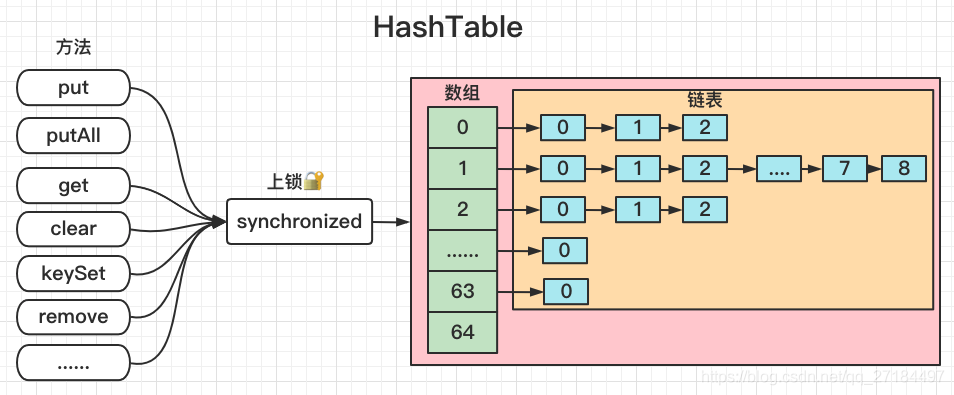

**JDK1.7 中的`ConcurrentHashMap`**

在jdk1.7及其以下的版本中，结构是用**`Segments`数组 + `HashEntry`数组 + 链表**实现（写分散）

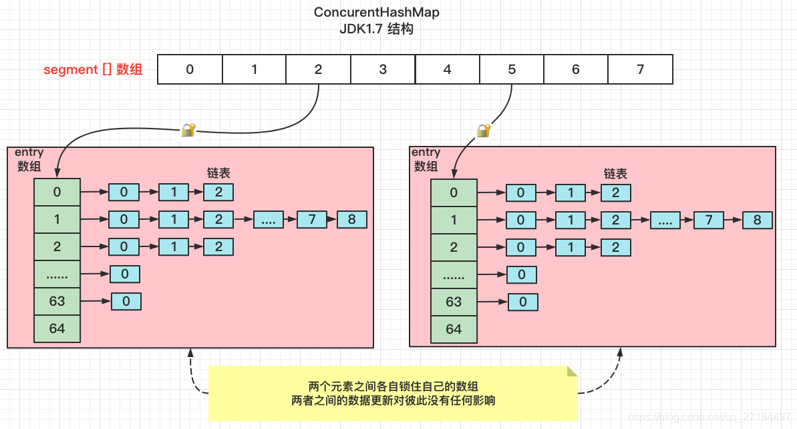

**JDK1.8中的`ConcurrentHashMap`**

jdk1.8抛弃了**`Segments`分段锁**的方案，而是改用了和`HashMap`一样的结构操作，也就是**数组 + 链表 + 红黑树**结构，比jdk1.7中的`ConcurrentHashMap`提高了效率，在并发方面，使用了`cas + synchronized`的方式保证数据的一致性

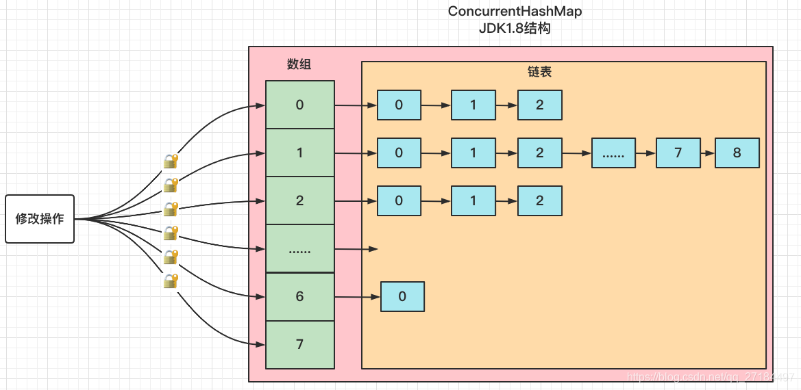

链表转化为红黑树需要满足2个条件:

- 链表的节点数量大于等于树化阈值8
- Node数组的长度大于等于最小树化容量值64

```java
#树化阈值为8
static final int TREEIFY_THRESHOLD = 8;
#最小树化容量值为64
static final int MIN_TREEIFY_CAPACITY = 64;
```

### ConcurrentSkipListMap

`ConcurrentSkipListMap`是 Java 中的一种线程安全、基于跳表实现的有序映射（`Map`）数据结构。它是对`TreeMap` 的并发实现，支持高并发读写操作。

`ConcurrentSkipListMap`适用于需要高并发性能、支持**有序性**和区间查询的场景，能够有效地提高系统的性能和可扩展性。

#### 跳表

跳表是一种基于有序链表的数据结构，支持快速插入、删除、查找操作，其时间复杂度为`O(log n)`，比普通链表的`O(n)`更高效。

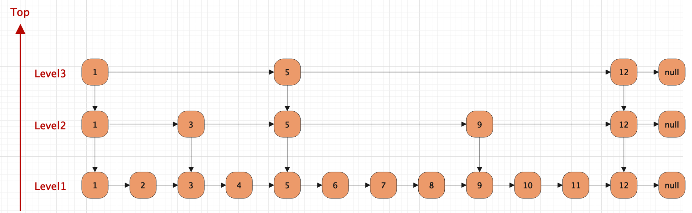

**跳表的特性：**

- 一个跳表结构由很多层结构组成。
- 每一层都是一个有序的链表，默认是升序。也可以自定义排序方法。
- 最底层链表（Level1）包含了所有的元素。
- 如果每一个元素出现在LevelN的链表中（N>1)，那么这个元素必定在下层链表出现。
- 每一个节点都包含了两个指针，一个指向同一级链表中的下一个元素，一个指向下一层级别链表中的相同值元素。

#### ConcurrentSkipListMap使用

```java
public class ConcurrentSkipListMapDemo {
    public static void main(String[] args) {
        ConcurrentSkipListMap<Integer, String> map = new ConcurrentSkipListMap<>();
        
        // 添加元素
        map.put(1, "a");
        map.put(3, "c");
        map.put(2, "b");
        map.put(4, "d");
        
        // 获取元素
        String value1 = map.get(2);
        System.out.println(value1); // 输出：b
        
        // 遍历元素
        for (Integer key : map.keySet()) {
            String value = map.get(key);
            System.out.println(key + " : " + value);
        }
        
        // 删除元素
        String value2 = map.remove(3);
        System.out.println(value2); // 输出：c
    }
}
```

### 实际场景中的并发容器

**案例一：电商网站中记录一次活动下各个商品售卖的数量。**

场景分析：需要频繁按商品id做get和set，但是商品id（key）的数量相对稳定不会频繁增删

初级方案：选用`HashMap`，key为商品id，value为商品购买的次数。每次下单取出次数，增加后再写入

问题：`HashMap`线程不安全。在多次商品id写入后，如果发生扩容，在JDK1.7 之前，在并发场景下`HashMap` 会出现死循环，从而导致CPU 使用率居高不下。JDK1.8 中修复了`HashMap` 扩容导致的死循环问题，但在高并发场景下，依然会有数据丢失以及不准确的情况出现。

选型：`Hashtable`不推荐，锁太重，选`ConcurrentHashMap`确保高并发下多线程的安全性

**案例二：在一次活动下，为每个用户记录浏览商品的历史和次数。**

场景分析：每个用户各自浏览的商品量级非常大，并且每次访问都要更新次数，频繁读写

初级方案：为确保线程安全，采用上面的思路，`ConcurrentHashMap`

问题：`ConcurrentHashMap`内部机制在数据量大时，会把链表转换为红黑树。而红黑树在高并发情况下，删除和插入过程中有个平衡的过程，会牵涉到大量节点，因此竞争锁资源的代价相对比较高

选型：用跳表，`ConcurrentSkipListMap`将key值分层，逐个切段，增删效率高于`ConcurrentHashMap`

> 结论：如果对数据有强一致要求，则需使用`Hashtable`；在大部分场景通常都是弱一致性的情况下，使用`ConcurrentHashMap` 即可；如果数据量级很高，且存在大量增删改操作，则可以考虑使用`ConcurrentSkipListMap`。

**案例三：在活动中，创建一个用户列表，记录冻结的用户。一旦冻结，不允许再下单抢购，但是可以浏览。**

场景分析：违规被冻结的用户不会太多，但是绝大多数非冻结用户每次抢单都要去查一下这个列表。低频写，高频读。

初级方案：`ArrayList`记录要冻结的用户id

问题：`ArrayList`对冻结用户id的插入和读取操作在高并发时，线程不安全。`Vector`可以做到线程安全，但并发性能差，锁太重。

选型：综合业务场景，选`CopyOnWriteArrayList`，会占空间，但是也仅仅发生在添加新冻结用户的时候。绝大多数的访问在非冻结用户的读取和比对上，不会阻塞。

### 阻塞队列

阻塞队列`(BlockingQueue)` 是`java.util.concurrent` 包下重要的数据结构，`BlockingQueue`提供了线程安全的队列访问方式：

**当阻塞队列插入数据时，如果队列已满，线程将会阻塞等待直到队列非满；从阻塞队列取数据时，如果队列已空，线程将会阻塞等待直到队列非空。**并发包下很多高级同步类的实现都是基于`BlockingQueue` 实现的。

#### BlockingQueue接口

| 方法         | 抛出异常  | 返回特定值 | 阻塞   | 阻塞特定时间         |
| ------------ | --------- | ---------- | ------ | -------------------- |
| 入队         | add(e)    | offer(e)   | put(e) | offer(e, time, unit) |
| 出队         | remove()  | poll()     | take() | poll(time, unit)     |
| 获取队首元素 | element() | peek()     | 不支持 | 不支持               |

**应用场景**

阻塞队列在实际应用中有很多场景，以下是一些常见的应用场景：

1. 线程池

线程池中的任务队列通常是一个阻塞队列。当任务数超过线程池的容量时，新提交的任务将被放入任务队列中等待执行。线程池中的工作线程从任务队列中取出任务进行处理，如果队列为空，则工作线程会被阻塞，直到队列中有新的任务被提交。

2. 生产者-消费者模型

在生产者-消费者模型中，生产者向队列中添加元素，消费者从队列中取出元素进行处理。阻塞队列可以很好地解决生产者和消费者之间的并发问题，避免线程间的竞争和冲突。

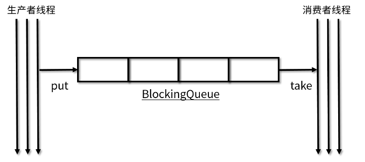

3. 消息队列

消息队列使用阻塞队列来存储消息，生产者将消息放入队列中，消费者从队列中取出消息进行处理。消息队列可以实现异步通信，提高系统的吞吐量和响应性能，同时还可以将不同的组件解耦，提高系统的可维护性和可扩展性。

4. 缓存系统

缓存系统使用阻塞队列来存储缓存数据，当缓存数据被更新时，它会被放入队列中，其他线程可以从队列中取出最新的数据进行使用。使用阻塞队列可以避免并发更新缓存数据时的竞争和冲突。

5. 并发任务处理

在并发任务处理中，可以将待处理的任务放入阻塞队列中，多个工作线程可以从队列中取出任务进行处理。使用阻塞队列可以避免多个线程同时处理同一个任务的问题，并且可以将任务的提交和执行解耦，提高系统的可维护性和可扩展性。

#### JUC中的阻塞队列

`BlockingQueue` 接口的实现类都被放在了 `juc` 包中，它们的区别主要体现在存储结构上或对元素操作上的不同，但是对于`take`与`put`操作的原理却是类似的。[导图](https://www.processon.com/view/link/618ce3941e0853689b0818e2.png)

| **队列**                  | 描述                                                       |
| ------------------------- | ---------------------------------------------------------- |
| **ArrayBlockingQueue**    | 基于数组结构实现的一个有界阻塞队列                         |
| **LinkedBlockingQueue**   | 基于链表结构实现的一个无界阻塞队列，指定容量为有界阻塞队列 |
| **PriorityBlockingQueue** | 支持按优先级排序的无界阻塞队列                             |
| **DelayQueue**            | 基于优先级队列（PriorityBlockingQueue）实现的无界阻塞队列  |
| **SynchronousQueue**      | 不存储元素的阻塞队列                                       |
| **LinkedTransferQueue**   | 基于链表结构实现的一个无界阻塞队列                         |
| **LinkedBlockingDeque**   | 基于链表结构实现的一个双端阻塞队列                         |

#### ArrayBlockingQueue

`ArrayBlockingQueue`是最典型的有界阻塞队列，其内部是用**数组存储元素**，初始化时需要指定容量大小，利用 `ReentrantLock` 实现线程安全。`ArrayBlockingQueue`可以用于实现数据缓存、限流、生产者-消费者模式等各种应用。

在生产者-消费者模型中使用时，如果生产速度和消费速度基本匹配的情况下，使用`ArrayBlockingQueue`是个不错选择；对应的如果生产速度远远大于消费速度，则会导致队列填满，大量生产线程被阻塞。

**`ArrayBlockingQueue`使用**

```java
BlockingQueue queue = new ArrayBlockingQueue(1024);
queue.put("1");   //向队列中添加元素
Object object = queue.take();   //从队列中取出元素
```

**`ArrayBlockingQueue`的原理**

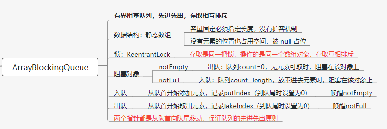

`ArrayBlockingQueue`使用独占锁`ReentrantLock`实现线程安全，入队和出队操作使用同一个锁对象，也就是只能有一个线程可以进行入队或者出队操作；这也就意味着生产者和消费者无法并行操作，在高并发场景下会成为性能瓶颈。

利用了`Lock`锁的`Condition`通知机制进行阻塞控制。核心：**一把锁，两个条件**

```java
//数据元素数组
final Object[] items;
//下一个待取出元素索引
int takeIndex;
//下一个待添加元素索引
int putIndex;
//元素个数
int count;
//内部锁
final ReentrantLock lock;
//消费者
private final Condition notEmpty;
//生产者
private final Condition notFull;  

public ArrayBlockingQueue(int capacity) {
    this(capacity, false);
}
public ArrayBlockingQueue(int capacity, boolean fair) {
    ...
    lock = new ReentrantLock(fair); //公平，非公平
    notEmpty = lock.newCondition();
    notFull =  lock.newCondition();
}

/**
* 入队put方法
**/
public void put(E e) throws InterruptedException {
    //检查是否为空
    checkNotNull(e);
    final ReentrantLock lock = this.lock;
    //加锁，如果线程中断抛出异常 
    lock.lockInterruptibly();
    try {
       //阻塞队列已满，则将生产者挂起，等待消费者唤醒
       //设计注意点： 用while不用if是为了防止虚假唤醒
        while (count == items.length)
            notFull.await(); //队列满了，使用notFull等待（生产者阻塞）
        // 入队
        enqueue(e);
    } finally {
        lock.unlock(); // 唤醒消费者线程
    }
}
    
private void enqueue(E x) {
    final Object[] items = this.items;
    //入队   使用的putIndex
    items[putIndex] = x;
    if (++putIndex == items.length) 
        putIndex = 0;  //设计的精髓： 环形数组，putIndex指针到数组尽头了，返回头部
    count++;
    //notEmpty条件队列转同步队列，准备唤醒消费者线程，因为入队了一个元素，肯定不为空了
    notEmpty.signal();
}

/**
* 出队take方法
**/
public E take() throws InterruptedException {
    final ReentrantLock lock = this.lock;
    //加锁，如果线程中断抛出异常 
    lock.lockInterruptibly();
    try {
       //如果队列为空，则消费者挂起
        while (count == 0)
            notEmpty.await();
        //出队
        return dequeue();
    } finally {
        lock.unlock();// 唤醒生产者线程
    }
}
private E dequeue() {
    final Object[] items = this.items;
    @SuppressWarnings("unchecked")
    E x = (E) items[takeIndex]; //取出takeIndex位置的元素
    items[takeIndex] = null;
    if (++takeIndex == items.length)
        takeIndex = 0; //设计的精髓： 环形数组，takeIndex 指针到数组尽头了，返回头部
    count--;
    if (itrs != null)
        itrs.elementDequeued();
    //notFull条件队列转同步队列，准备唤醒生产者线程，此时队列有空位
    notFull.signal();
    return x;
}
```

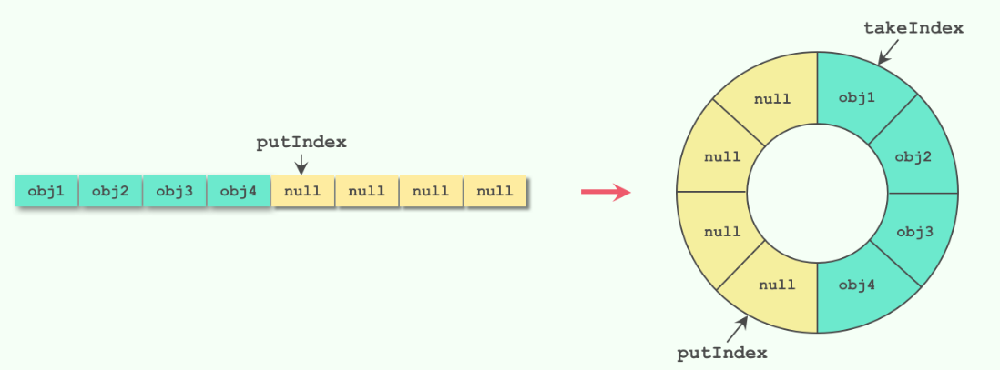

#### LinkedBlockingQueue

`LinkedBlockingQueue`是一个**基于链表实现的阻塞队列**，默认情况下，该阻塞队列的大小为`Integer.MAX_VALUE`，由于这个数值特别大，所以 `LinkedBlockingQueue` 也被称作无界队列，代表它几乎没有界限，队列可以随着元素的添加而动态增长，但是如果没有剩余内存，队列将抛出`OOM`错误。所以为了避免队列过大造成机器负载或者内存爆满的情况出现，我们在使用的时候建议手动传一个队列的大小。

```java
//指定队列的大小创建有界队列
BlockingQueue<Integer> boundedQueue = new LinkedBlockingQueue<>(100);
//无界队列
BlockingQueue<Integer> unboundedQueue = new LinkedBlockingQueue<>();
```

**`LinkedBlockingQueue`原理**

`LinkedBlockingQueue`内部由单链表实现，只能从`head`取元素，从tail添加元素。`LinkedBlockingQueue`采用**两把锁的锁分离技术实现入队出队互不阻塞，添加元素和获取元素都有独立的锁**，也就是说`LinkedBlockingQueue`是读写分离的，读写操作可以并行执行。

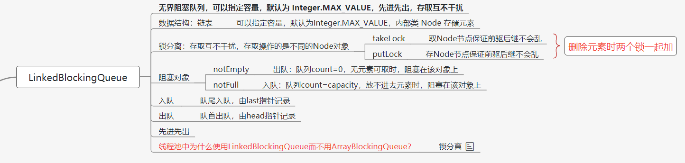

```java
// 容量,指定容量就是有界队列
private final int capacity;
// 元素数量
private final AtomicInteger count = new AtomicInteger();
// 链表头  本身是不存储任何元素的，初始化时item指向null
transient Node<E> head;
// 链表尾
private transient Node<E> last;
// take锁   锁分离，提高效率
private final ReentrantLock takeLock = new ReentrantLock();
// notEmpty条件
// 当队列无元素时，take锁会阻塞在notEmpty条件上，等待其它线程唤醒
private final Condition notEmpty = takeLock.newCondition();
// put锁
private final ReentrantLock putLock = new ReentrantLock();
// notFull条件
// 当队列满了时，put锁会会阻塞在notFull上，等待其它线程唤醒
private final Condition notFull = putLock.newCondition();

//典型的单链表结构
static class Node<E> {
    E item;  //存储元素
    Node<E> next;  //后继节点    单链表结构
    Node(E x) { item = x; }
}
/**
* 入队put方法
**/
public void put(E e) throws InterruptedException {    
    // 不允许null元素
    if (e == null) throw new NullPointerException();
    int c = -1;
    // 新建一个节点
    Node<E> node = new Node<E>(e);
    final ReentrantLock putLock = this.putLock;
    final AtomicInteger count = this.count;
    // 使用put锁加锁
    putLock.lockInterruptibly();
    try {
        // 如果队列满了，就阻塞在notFull上等待被其它线程唤醒（阻塞生产者线程）
        while (count.get() == capacity) {
            notFull.await();
        }  
        // 队列不满，就入队
        enqueue(node);
        c = count.getAndIncrement();// 队列长度加1，返回原值
        // 如果现队列长度小于容量，notFull条件队列转同步队列，准备唤醒一个阻塞在notFull条件上的线程(可以继续入队) 
        // 这里为啥要唤醒一下呢？
        // 因为可能有很多线程阻塞在notFull这个条件上,而取元素时只有取之前队列是满的才会唤醒notFull,此处不用等到取元素时才唤醒
        if (c + 1 < capacity)
            notFull.signal();
    } finally {
        putLock.unlock(); // 真正唤醒生产者线程
    }  
    // 如果原队列长度为0，现在加了一个元素后立即唤醒阻塞在notEmpty上的线程
    if (c == 0)
        signalNotEmpty();
}
private void enqueue(Node<E> node) { 
    // 直接加到last后面,last指向入队元素
    last = last.next = node;
}    
private void signalNotEmpty() {
    final ReentrantLock takeLock = this.takeLock; 
    takeLock.lock();// 加take锁
    try {  
        notEmpty.signal();// notEmpty条件队列转同步队列，准备唤醒阻塞在notEmpty上的线程
    } finally {
        takeLock.unlock();  // 真正唤醒消费者线程
    }
}

/**
* 出队take方法
**/
public E take() throws InterruptedException {
    E x;
    int c = -1;
    final AtomicInteger count = this.count;
    final ReentrantLock takeLock = this.takeLock;
    // 使用takeLock加锁
    takeLock.lockInterruptibly();
    try {
        // 如果队列无元素，则阻塞在notEmpty条件上（消费者线程阻塞）
        while (count.get() == 0) {
            notEmpty.await();
        }
        // 否则，出队
        x = dequeue();
        c = count.getAndDecrement();//长度-1，返回原值
        if (c > 1)// 如果取之前队列长度大于1，notEmpty条件队列转同步队列，准备唤醒阻塞在notEmpty上的线程，原因与入队同理
            notEmpty.signal();
    } finally {
        takeLock.unlock(); // 真正唤醒消费者线程
    }
    // 为什么队列是满的才唤醒阻塞在notFull上的线程呢？
    // 因为唤醒是需要加putLock的，这是为了减少锁的次数,所以，这里索性在放完元素就检测一下，未满就唤醒其它notFull上的线程,
    // 这也是锁分离带来的代价
    // 如果取之前队列长度等于容量（已满），则唤醒阻塞在notFull的线程
    if (c == capacity)
        signalNotFull();
    return x;
}
private E dequeue() {
     // head节点本身是不存储任何元素的
    // 这里把head删除，并把head下一个节点作为新的值
    // 并把其值置空，返回原来的值
    Node<E> h = head;
    Node<E> first = h.next;
    h.next = h; // 方便GC
    head = first;
    E x = first.item;
    first.item = null;
    return x;
}
private void signalNotFull() {
    final ReentrantLock putLock = this.putLock;
    putLock.lock();
    try {
        notFull.signal();// notFull条件队列转同步队列，准备唤醒阻塞在notFull上的线程
    } finally {
        putLock.unlock(); // 解锁，这才会真正的唤醒生产者线程
    }
}
```

#### `LinkedBlockingQueue`与`ArrayBlockingQueue`对比

`LinkedBlockingQueue`是一个阻塞队列，内部由两个`ReentrantLock`来实现出入队列的线程安全，由各自的`Condition`对象的`await`和`signal`来实现等待和唤醒功能。它和`ArrayBlockingQueue`的不同点在于：

- 队列大小有所不同，`ArrayBlockingQueue`是有界的初始化必须指定大小，而`LinkedBlockingQueue`可以是有界的也可以是无界的(`Integer.MAX_VALUE`)，对于后者而言，当添加速度大于移除速度时，在无界的情况下，可能会造成内存溢出等问题。
- 数据存储容器不同，`ArrayBlockingQueue`采用的是数组作为数据存储容器，而`LinkedBlockingQueue`采用的则是以Node节点作为连接对象的链表。
- 由于`ArrayBlockingQueue`采用的是数组的存储容器，因此在插入或删除元素时不会产生或销毁任何额外的对象实例，而`LinkedBlockingQueue`则会生成一个额外的`Node`对象。这可能在长时间内需要高效并发地处理大批量数据的时，对于`GC`可能存在较大影响。
- 两者的实现队列添加或移除的锁不一样，`ArrayBlockingQueue`实现的队列中的**锁是没有分离的**，即添加操作和移除操作采用的同一个`ReenterLock`锁，而`LinkedBlockingQueue`实现的队列中的**锁是分离的**，其添加采用的是`putLock`，移除采用的则是`takeLock`，这样能大大提高队列的吞吐量，也意味着在高并发的情况下生产者和消费者可以并行地操作队列中的数据，以此来提高整个队列的并发性能。

#### DelayQueue

`DelayQueue` 是一个**支持延时获取元素的阻塞队列**， 内部采用优先队列 `PriorityQueue` 存储元素，同时元素必须实现 `Delayed` 接口；在创建元素时可以指定多久才可以从队列中获取当前元素，只有在延迟期满时才能从队列中提取元素。

延迟队列的特点是：不是先进先出，而是会按照延迟时间的长短来排序，下一个即将执行的任务会排到队列的最前面。

它是无界队列，放入的元素必须实现 `Delayed` 接口，而 `Delayed` 接口又继承了 `Comparable` 接口，所以自然就拥有了比较和排序的能力，代码如下：

```JAVA
public interface Delayed extends Comparable<Delayed> {
    //getDelay 方法返回的是“还剩下多长的延迟时间才会被执行”，
    //如果返回 0 或者负数则代表任务已过期。
    //元素会根据延迟时间的长短被放到队列的不同位置，越靠近队列头代表越早过期。
    long getDelay(TimeUnit unit);
}
```

**`DelayQueue` 实现延迟订单**

在实现一个延迟订单的场景中，我们可以定义一个 `Order` 类，其中包含订单的基本信息，例如订单编号、订单金额、订单创建时间等。同时，我们可以让 `Order` 类实现 `Delayed` 接口，重写 `getDelay` 和 `compareTo` 方法。在 `getDelay` 方法中，我们可以计算订单的剩余延迟时间，而在 `compareTo` 方法中，我们可以根据订单的延迟时间进行比较。

下面是一个简单的示例代码，演示了如何使用 `DelayQueue` 来实现一个延迟订单的场景：

```java
public class DelayQueueExample {

    public static void main(String[] args) throws InterruptedException {
        DelayQueue<Order> delayQueue = new DelayQueue<>();

        // 添加三个订单，分别延迟 5 秒、2 秒和 3 秒
        delayQueue.put(new Order("order1", System.currentTimeMillis(), 5000));
        delayQueue.put(new Order("order2", System.currentTimeMillis(), 2000));
        delayQueue.put(new Order("order3", System.currentTimeMillis(), 3000));

        // 循环取出订单，直到所有订单都被处理完毕
        while (!delayQueue.isEmpty()) {
            Order order = delayQueue.take();
            System.out.println("处理订单：" + order.getOrderId());
        }
    }

    static class  Order implements Delayed{
        private String orderId;
        private long createTime;
        private long delayTime;

        public Order(String orderId, long createTime, long delayTime) {
            this.orderId = orderId;
            this.createTime = createTime;
            this.delayTime = delayTime;
        }

        public String getOrderId() {
            return orderId;
        }

        @Override
        public long getDelay(TimeUnit unit) {
            long diff = createTime + delayTime - System.currentTimeMillis();
            return unit.convert(diff, TimeUnit.MILLISECONDS);
        }

        @Override
        public int compareTo(Delayed o) {
            long diff = this.getDelay(TimeUnit.MILLISECONDS) - o.getDelay(TimeUnit.MILLISECONDS);
            return Long.compare(diff, 0);
        }
    }
}
```

由于每个订单都有不同的延迟时间，因此它们将会按照延迟时间的顺序被取出。当延迟时间到达时，对应的订单对象将会被从队列中取出，并被处理。


**DelayQueue原理**

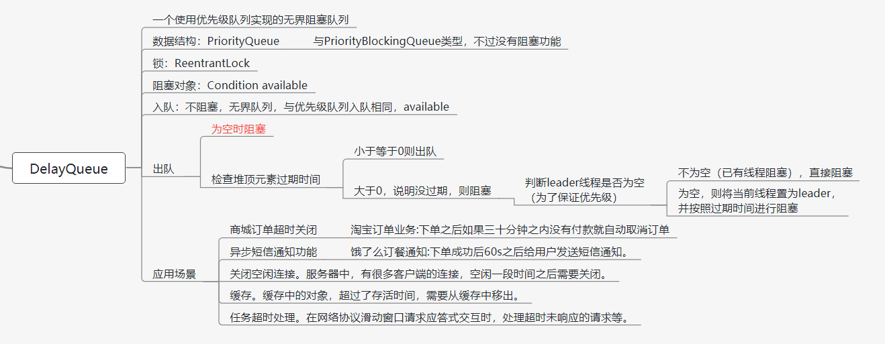

```java
//用于保证队列操作的线程安全
private final transient ReentrantLock lock = new ReentrantLock();
// 优先级队列,存储元素，用于保证延迟低的优先执行
private final PriorityQueue<E> q = new PriorityQueue<E>();
// 用于标记当前是否有线程在排队（仅用于取元素时） leader 指向的是第一个从队列获取元素阻塞的线程
private Thread leader = null;
// 条件，用于表示现在是否有可取的元素   当新元素到达，或新线程可能需要成为leader时被通知
private final Condition available = lock.newCondition();

public DelayQueue() {}
public DelayQueue(Collection<? extends E> c) {
    this.addAll(c);
}

/**
* 入队put方法
**/
public void put(E e) {
    offer(e);
}
public boolean offer(E e) {
    final ReentrantLock lock = this.lock;
    lock.lock();
    try {
        // 入队
        q.offer(e);
        if (q.peek() == e) {
            // 若入队的元素位于队列头部，说明当前元素延迟最小
            // 将 leader 置空
            leader = null;
            // available条件队列转同步队列,准备唤醒阻塞在available上的线程
            available.signal();
        }
        return true;
    } finally {
        lock.unlock(); // 解锁，真正唤醒阻塞的线程
    }
}

/**
* 出队take方法
**/
public E take() throws InterruptedException {
    final ReentrantLock lock = this.lock;
    lock.lockInterruptibly();
    try {
        for (;;) {
            E first = q.peek();// 取出堆顶元素( 最早过期的元素，但是不弹出对象)   
            if (first == null)// 如果堆顶元素为空，说明队列中还没有元素，直接阻塞等待
                available.await();//当前线程无限期等待，直到被唤醒，并且释放锁。
            else {
                long delay = first.getDelay(NANOSECONDS);// 堆顶元素的到期时间             
                if (delay <= 0)// 如果小于0说明已到期，直接调用poll()方法弹出堆顶元素
                    return q.poll();
                
                // 如果delay大于0 ，则下面要阻塞了
                // 将first置为空方便gc
                first = null; 
                // 如果有线程争抢的Leader线程，则进行无限期等待。
                if (leader != null)
                    available.await();
                else {
                    // 如果leader为null，把当前线程赋值给它
                    Thread thisThread = Thread.currentThread();
                    leader = thisThread;
                    try {
                        // 等待剩余等待时间
                        available.awaitNanos(delay);
                    } finally {
                        // 如果leader还是当前线程就把它置为空，让其它线程有机会获取元素
                        if (leader == thisThread)
                            leader = null;
                    }
                }
            }
        }
    } finally {
        // 成功出队后，如果leader为空且堆顶还有元素，就唤醒下一个等待的线程
        if (leader == null && q.peek() != null)
            // available条件队列转同步队列,准备唤醒阻塞在available上的线程
            available.signal();
        // 解锁，真正唤醒阻塞的线程
        lock.unlock();
    }
}
```

**出队流程：**

1. 当获取元素时，先获取到锁对象。
2. 获取最早过期的元素，但是并不从队列中弹出元素。
3. 最早过期元素是否为空，如果为空则直接让当前线程无限期等待状态，并且让出当前锁对象。
4. 如果最早过期的元素不为空
5. 获取最早过期元素的剩余过期时间，如果已经过期则直接返回当前元素
6. 如果没有过期，也就是说剩余时间还存在，则先获取Leader对象，如果Leader已经有线程在处理，则当前线程进行无限期等待，如果Leader为空，则首先将Leader设置为当前线程，并且让当前线程等待剩余时间。
7. 最后将Leader线程设置为空
8. 如果Leader已经为空，并且队列有内容则唤醒一个等待的队列。

#### 阻塞队列选择策略

通常我们可以从以下 5 个角度考虑，来选择合适的阻塞队列：

- **功能**：是否需要阻塞队列帮我们排序，如优先级排序、延迟执行等。如果有这个需要，我们就必须选择类似于 `PriorityBlockingQueue` 之类的有排序能力的阻塞队列。

- **容量**：前面介绍的阻塞队列，有的是容量固定的，如 `ArrayBlockingQueue`；有的默认是容量无限的，如 `LinkedBlockingQueue`；而有的里面没有任何容量，如 `SynchronousQueue`；而对于 `DelayQueue` 而言，它的容量固定就是 `Integer.MAX_VALUE`。所以不同阻塞队列的容量是千差万别的，我们需要根据任务数量来推算出合适的容量，从而去选取合适的 `BlockingQueue`。

- **动态扩容**：有时我们并不能在初始的时候很好的准确估计队列的大小，因为业务可能有高峰期、低谷期。如果一开始就固定一个容量，可能无法应对所有的情况，也是不合适的，有可能需要动态扩容。如果我们需要动态扩容的话，那么就不能选择 `ArrayBlockingQueue` ，因为它的容量在创建时就确定了，无法扩容。相反，`PriorityBlockingQueue` 即使在指定了初始容量之后，后续如果有需要，也可以自动扩容。所以我们可以根据是否需要扩容来选取合适的队列。

- **内存结构**：`ArrayBlockingQueue` 的内部结构是“数组”的形式。`LinkedBlockingQueue` 的内部是用链表实现的，所以这里就需要我们考虑到，`ArrayBlockingQueue` 空间利用率更高。如果对性能有要求可以从内存的结构角度去考虑这个问题。

- **性能**：`LinkedBlockingQueue` 由于拥有两把锁，它的操作粒度更细，在并发程度高的时候，相对于只有一把锁的 `ArrayBlockingQueue` 性能会更好。另外，`SynchronousQueue` 性能往往优于其他实现，因为它只需要“直接传递”，而不需要存储的过程。如果我们的场景需要直接传递的话，可以优先考虑 `SynchronousQueue`。

**线程池对于阻塞队列的选择**

线程池有很多种，不同种类的线程池会根据自己的特点，来选择适合自己的阻塞队列。

`Executors`类下的线程池类型：

- `FixedThreadPool`（`SingleThreadExecutor` 同理）选取的是 `LinkedBlockingQueue`
- `CachedThreadPool` 选取的是 `SynchronousQueue`
- `ScheduledThreadPool`（`SingleThreadScheduledExecutor`同理）选取的是**延迟队列**

## JUC的应用场景

JDK提供了比`synchronized`更加高级的各种同步工具，包括`ReentrantLock、Semaphore、CountDownLatch、CyclicBarrier`等，可以实现更加丰富的多线程操作。

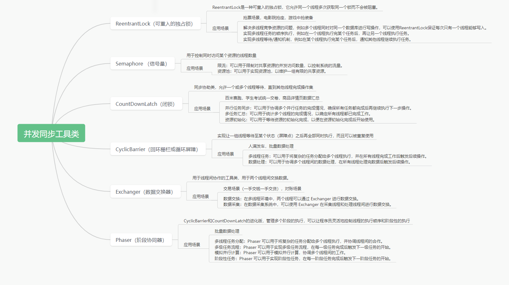

### ReentrantLock

`ReentrantLock`是一种可重入的独占锁，它允许同一个线程多次获取同一个锁而不会被阻塞。

它的功能类似于`synchronized`是一种互斥锁，可以保证线程安全。相对于`synchronized，ReentrantLock`具备如下特点：

- 可中断 
- 可以设置超时时间
- 可以设置为公平锁 
- 支持多个条件变量
- 与 synchronized 一样，都支持可重入

它的主要应用场景是在多线程环境下对共享资源进行独占式访问，以保证数据的一致性和安全性。

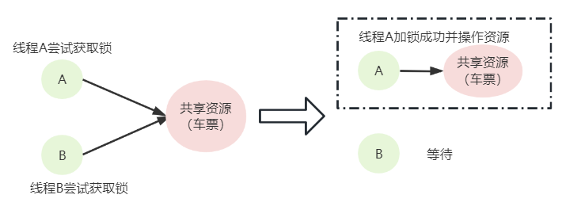

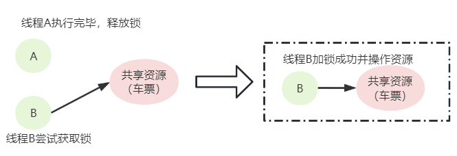

#### 常用API

ReentrantLock实现了Lock接口规范，常见API如下：

| 方法                                                         | 描述                                                         |
| ------------------------------------------------------------ | ------------------------------------------------------------ |
| void lock()                                                  | 获取锁，调用该方法当前线程会获取锁，当锁获得后，该方法返回   |
| void lockInterruptibly() throws InterruptedException         | 可中断的获取锁，和lock()方法不同之处在于该方法会响应中断，即在锁的获取中可以中断当前线程 |
| boolean tryLock()                                            | 尝试非阻塞的获取锁，调用该方法后立即返回。如果能够获取到返回true，否则返回false |
| boolean tryLock(long time, TimeUnit unit) throws InterruptedException | 超时获取锁，当前线程在以下三种情况下会被返回:当前线程在超时时间内获取了锁当前线程在超时时间内被中断超时时间结束，返回false |
| void unlock()                                                | 释放锁                                                       |
| Condition newCondition()                                     | 获取等待通知组件，该组件和当前的锁绑定，当前线程只有获取了锁，才能调用该组件的await()方法，而调用后，当前线程将释放锁 |

**基本语法**

```java
//加锁  阻塞 
lock.lock(); 
try {  
    ...
} finally { 
    // 解锁 
    lock.unlock();  
}

//尝试加锁   非阻塞
if (lock.tryLock(1, TimeUnit.SECONDS)) {
    try {
        ...
    } finally {
        lock.unlock();
    }
}
```

在使用时要注意 4 个问题：

1. 默认情况下 `ReentrantLock` 为非公平锁而非公平锁;
2. 加锁次数和释放锁次数一定要保持一致，否则会导致线程阻塞或程序异常;
3. 加锁操作一定要放在`try` 代码之前，这样可以避免未加锁成功又释放锁的异常;
4. 释放锁一定要放在 `finally` 中，否则会导致线程阻塞。

#### ReentrantLock使用

**独占锁：模拟抢票场景**

```java
/**
 *  模拟抢票场景：8张票，10个人抢
 */
public class ReentrantLockDemo {

    private final ReentrantLock lock = new ReentrantLock();//默认非公平
    private static int tickets = 8; // 总票数

    public void buyTicket() {
        lock.lock(); // 获取锁
        try {
            if (tickets > 0) { // 还有票
                try {
                    Thread.sleep(10); // 休眠10ms,模拟出并发效果
                } catch (InterruptedException e) {
                    e.printStackTrace();
                }
                System.out.println(Thread.currentThread().getName() + "购买了第" + tickets-- + "张票");
            } else {
                System.out.println("票已经卖完了，" + Thread.currentThread().getName() + "抢票失败");
            }

        } finally {
            lock.unlock(); // 释放锁
        }
    }

    public static void main(String[] args) {
        ReentrantLockDemo ticketSystem = new ReentrantLockDemo();
        for (int i = 1; i <= 10; i++) {
            Thread thread = new Thread(() -> {

                ticketSystem.buyTicket(); // 抢票

            }, "线程" + i);
            // 启动线程
            thread.start();

        }


        try {
            Thread.sleep(3000);
        } catch (InterruptedException e) {
            throw new RuntimeException(e);
        }
        System.out.println("剩余票数：" + tickets);
    }
}
```

不加锁的效果： 出现超卖的问题

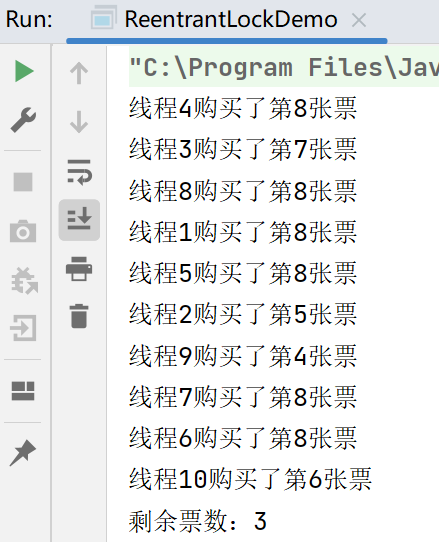

加锁效果： 正常，两个人抢票失败

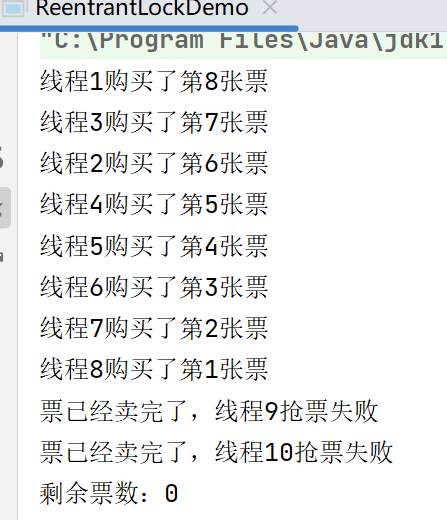

**公平锁和非公平锁**

`ReentrantLock`支持公平锁和非公平锁两种模式：

- 公平锁：线程在获取锁时，按照等待的先后顺序获取锁。
- 非公平锁：线程在获取锁时，不按照等待的先后顺序获取锁，而是随机获取锁。`ReentrantLock`默认是非公平锁

```java
ReentrantLock lock = new ReentrantLock(); //参数默认false，不公平锁  
ReentrantLock lock = new ReentrantLock(true); //公平锁  
```

比如买票的时候就有可能出现插队的场景，允许插队就是非公平锁，如下图：

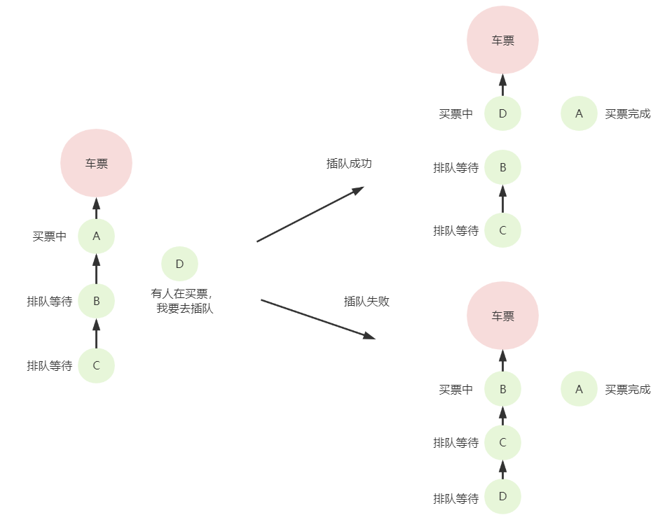

**可重入锁**

可重入锁又名递归锁，是指在同一个线程在外层方法获取锁的时候，再进入该线程的内层方法会自动获取锁（前提锁对象得是同一个对象），不会因为之前已经获取过还没释放而阻塞。Java中`ReentrantLock`和`synchronized`都是可重入锁，**可重入锁的一个优点是可一定程度避免死锁**。在实际开发中，可重入锁常常应用于**递归操作、调用同一个类中的其他方法、锁嵌套**等场景中。

```java
class Counter {
    private final ReentrantLock lock = new ReentrantLock(); // 创建 ReentrantLock 对象

    public void recursiveCall(int num) {
        lock.lock(); // 获取锁
        try {
            if (num == 0) { return; }
            System.out.println("执行递归，num = " + num);
            recursiveCall(num - 1);
        } finally {
            lock.unlock(); // 释放锁
        }
    }
    public static void main(String[] args) throws InterruptedException {
        Counter counter = new Counter(); // 创建计数器对象
        // 测试递归调用
        counter.recursiveCall(10);
    }
}
```

**结合Condition实现生产者消费者模式**

`java.util.concurrent`类库中提供`Condition`类来实现线程之间的协调。调用`Condition.await()` 方法使线程等待，其他线程调用`Condition.signal()` 或 `Condition.signalAll()` 方法唤醒等待的线程。

> 调用Condition的await()和signal()方法，都必须在lock保护之内。

**案例：基于`ReentrantLock`和`Condition`实现一个简单队列**

```java
public class ReentrantLockDemo3 {
    public static void main(String[] args) {
        // 创建队列
        Queue queue = new Queue(5);
        //启动生产者线程
        new Thread(new Producer(queue)).start();
        //启动消费者线程
        new Thread(new Customer(queue)).start();
    }
}
/**
 * 队列封装类
 */
class Queue {
    private Object[] items ;
    int size = 0;
    int takeIndex;
    int putIndex;
    private ReentrantLock lock;
    public Condition notEmpty;	//消费者线程阻塞唤醒条件，队列为空阻塞，生产者生产完唤醒
    public Condition notFull;		//生产者线程阻塞唤醒条件，队列满了阻塞，消费者消费完唤醒

    public Queue(int capacity){
        this.items = new Object[capacity];
        lock = new ReentrantLock();
        notEmpty = lock.newCondition();
        notFull =  lock.newCondition();
    }
    public void put(Object value) throws Exception {
        //加锁
        lock.lock();
        try {
            while (size == items.length)
                // 队列满了让生产者等待
                notFull.await();
            items[putIndex] = value;
            if (++putIndex == items.length) { putIndex = 0; }
            size++;
            notEmpty.signal(); // 生产完唤醒消费者
        } finally {
            System.out.println("producer生产：" + value);
            //解锁
            lock.unlock();
        }
    }
    public Object take() throws Exception {
        lock.lock();
        try {
            // 队列空了就让消费者等待
            while (size == 0) { notEmpty.await(); }
            Object value = items[takeIndex];
            items[takeIndex] = null;
            if (++takeIndex == items.length) { takeIndex = 0; }
            size--;
            notFull.signal(); //消费完唤醒生产者生产
            return value;
        } finally {
            lock.unlock();
        }
    }
}
/**
 * 生产者
 */
class Producer implements Runnable {
    private Queue queue;
    public Producer(Queue queue) {
        this.queue = queue;
    }

    @Override
    public void run() {
        try {
            // 隔1秒轮询生产一次
            while (true) {
                Thread.sleep(1000);
                queue.put(new Random().nextInt(1000));
            }
        } catch (Exception e) {
            e.printStackTrace();
        }
    }
}
/**
 * 消费者
 */
class Customer implements Runnable {

    private Queue queue;
    public Customer(Queue queue) {
        this.queue = queue;
    }

    @Override
    public void run() {
        try {
            // 隔2秒轮询消费一次
            while (true) {
                Thread.sleep(2000);
                System.out.println("consumer消费：" + queue.take());
            }
        } catch (Exception e) {
            e.printStackTrace();
        }
    }
}
```

#### 应用场景

`ReentrantLock`具体应用场景如下：

1. 解决多线程竞争资源的问题，例如多个线程同时对同一个数据库进行写操作，可以使用`ReentrantLock`保证每次只有一个线程能够写入。
2. 实现多线程任务的顺序执行，例如在一个线程执行完某个任务后，再让另一个线程执行任务。
3. 实现多线程**等待/通知机制**，例如在某个线程执行完某个任务后，通知其他线程继续执行任务。

### Semaphore

`Semaphore`（信号量）是一种用于多线程编程的同步工具，用于控制同时访问某个资源的线程数量。

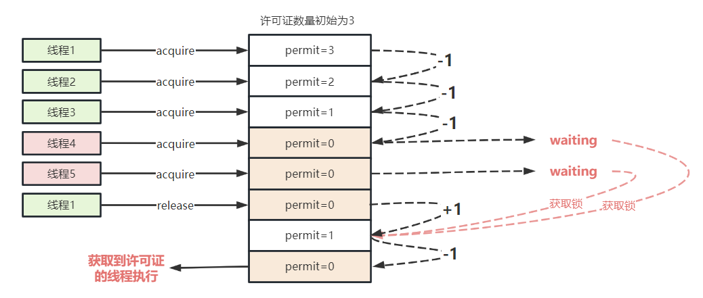   

`Semaphore`维护了一个计数器，线程可以通过调用`acquire()`方法来获取`Semaphore`中的许可证，当计数器为0时，调用`acquire()`的线程将被阻塞，直到有其他线程释放许可证；线程可以通过调用`release()`方法来释放Semaphore中的许可证，这会使`Semaphore`中的计数器增加，从而允许更多的线程访问共享资源。

#### 常用API

| 方法                     | 功能描述                                                     |
| ------------------------ | ------------------------------------------------------------ |
| Semaphore(permits, fair) | 构造函数，permits表示许可证的数量（资源数），fair表示公平性，如果这个设为true的话，下次执行的线程会是等待最久的线程 |
| acquire()                | 阻塞并获取许可                                               |
| tryAcquire()             | 在没有许可的情况下立即返回 false，不会阻塞                   |
| release()                | 释放许可                                                     |

#### Semaphore使用

1. **Semaphore实现服务接口限流**

```java
@Slf4j
public class SemaphoreDemo {

    /**
     * 同一时刻最多只允许有两个并发
     */
    private static Semaphore semaphore = new Semaphore(2);

    private static Executor executor = Executors.newFixedThreadPool(10);

    public static void main(String[] args) {
        for(int i=0;i<10;i++){
            executor.execute(()->getProductInfo2());
        }
    }

    public static String getProductInfo() {
        try {
            semaphore.acquire();
            log.info("请求服务");
            Thread.sleep(2000);
        } catch (InterruptedException e) {
            throw new RuntimeException(e);
        }finally {
            semaphore.release();
        }
        return "返回商品详情信息";
    }

    public static String getProductInfo2() {

        if(!semaphore.tryAcquire()){
            log.error("请求被流控了");
            return "请求被流控了";
        }
        try {
            log.info("请求服务");
            Thread.sleep(2000);
        } catch (InterruptedException e) {
            throw new RuntimeException(e);
        }finally {
            semaphore.release();
        }
        return "返回商品详情信息";
    }
}
```

2. **Semaphore实现数据库连接池**

```java
public class SemaphoreDemo2 {

    public static void main(String[] args) {
        final ConnectPool pool = new ConnectPool(2);
        ExecutorService executorService = Executors.newCachedThreadPool();

        //5个线程并发来争抢连接资源
        for (int i = 0; i < 5; i++) {
            final int id = i + 1;
            executorService.execute(new Runnable() {
                @Override
                public void run() {
                    Connect connect = null;
                    try {
                        System.out.println("线程" + id + "等待获取数据库连接");
                        connect = pool.openConnect();
                        System.out.println("线程" + id + "已拿到数据库连接:" + connect);
                        //进行数据库操作2秒...然后释放连接
                        Thread.sleep(2000);
                        System.out.println("线程" + id + "释放数据库连接:" + connect);

                    } catch (InterruptedException e) {
                        e.printStackTrace();
                    } finally {
                        pool.releaseConnect(connect);
                    }

                }
            });
        }
    }
}

//数据库连接池
class ConnectPool {
    private int size;
    private Connect[] connects;

    //记录对应下标的Connect是否已被使用
    private boolean[] connectFlag;
    //信号量对象
    private Semaphore semaphore;

    /**
     * size:初始化连接池大小
     */
    public ConnectPool(int size) {
        this.size = size;
        semaphore = new Semaphore(size, true);
        connects = new Connect[size];
        connectFlag = new boolean[size];
        initConnects();//初始化连接池
    }

    private void initConnects() {
        for (int i = 0; i < this.size; i++) {
            connects[i] = new Connect();
        }
    }

    /**
     * 获取数据库连接
     *
     * @return
     * @throws InterruptedException
     */
    public Connect openConnect() throws InterruptedException {
        //得先获得使用许可证，如果信号量为0，则拿不到许可证，一直阻塞直到能获得
        semaphore.acquire();
        return getConnect();
    }

    private synchronized Connect getConnect() {
        for (int i = 0; i < connectFlag.length; i++) {
            if (!connectFlag[i]) {
                //标记该连接已被使用
                connectFlag[i] = true;
                return connects[i];
            }
        }
        return null;
    }

    /**
     * 释放某个数据库连接
     */
    public synchronized void releaseConnect(Connect connect) {
        for (int i = 0; i < this.size; i++) {
            if (connect == connects[i]) {
                connectFlag[i] = false;
                semaphore.release();
            }
        }
    }
}

/**
 * 数据库连接
 */
class Connect {

    private static int count = 1;
    private int id = count++;

    public Connect() {
        //假设打开一个连接很耗费资源，需要等待1秒
        try {
            Thread.sleep(1000);
        } catch (InterruptedException e) {
            e.printStackTrace();
        }
        System.out.println("连接#" + id + "#已与数据库建立通道！");
    }
    @Override
    public String toString() {
        return "#" + id + "#";

    }
}
```

#### 应用场景

以下是一些使用`Semaphore`的常见场景：

1. 限流：`Semaphore`可以用于限制对共享资源的并发访问数量，以控制系统的流量。
2. 资源池：`Semaphore`可以用于实现资源池，以维护一组有限的共享资源。

### CountDownLatch

`CountDownLatch`（闭锁）是一个同步协助类，允许一个或多个线程等待，直到其他线程完成操作集。

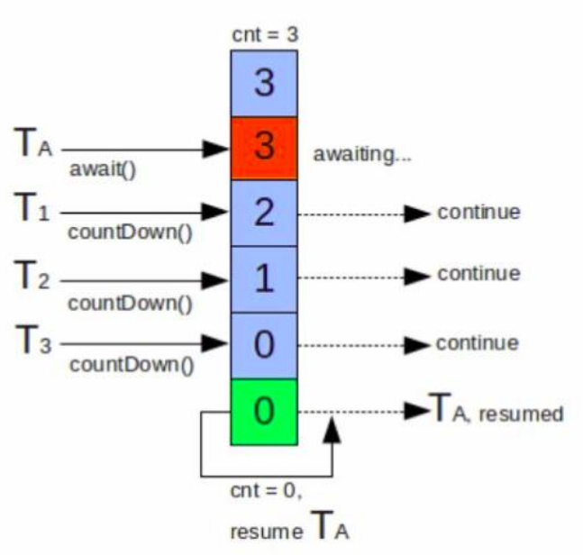

`CountDownLatch`使用给定的计数值（`count`）初始化。`await`方法会阻塞直到当前的计数值（`count`），由于`countDown`方法的调用达到0，`count`为0之后所有等待的线程都会被释放，并且随后对`await`方法的调用都会立即返回。这是一个一次性现象 —— count不会被重置。

#### 常用API

```java
// 调用 await() 方法的线程会被挂起，它会等待直到 count 值为 0 才继续执行
public void await() throws InterruptedException { };  
// 和 await() 类似，若等待 timeout 时长后，count 值还是没有变为 0，不再等待，继续执行
public boolean await(long timeout, TimeUnit unit) throws InterruptedException { };  
// 会将 count 减 1，直至为 0
public void countDown() { }; 
```

#### CountDownLatch使用

**模拟实现百米赛跑**

```java
public class CountDownLatchDemo {
    // begin 代表裁判 初始为 1
    private static CountDownLatch begin = new CountDownLatch(1);

    // end 代表玩家 初始为 8
    private static CountDownLatch end = new CountDownLatch(8);

    public static void main(String[] args) throws InterruptedException {

        for (int i = 1; i <= 8; i++) {
            new Thread(new Runnable() {
                @SneakyThrows
                @Override
                public void run() {
                    // 预备状态
                    System.out.println("参赛者"+Thread.currentThread().getName()+ "已经准备好了");
                    // 等待裁判吹哨
                    begin.await();
                    // 开始跑步
                    System.out.println("参赛者"+Thread.currentThread().getName() + "开始跑步");
                    Thread.sleep(1000);
                    // 跑步结束, 跑完了
                    System.out.println("参赛者"+Thread.currentThread().getName()+ "到达终点");
                    // 跑到终点, 计数器就减一
                    end.countDown();
                }
            }).start();
        }
        // 等待 5s 就开始吹哨
        Thread.sleep(5000);
        System.out.println("开始比赛");
        // 裁判吹哨, 计数器减一
        begin.countDown();
        // 等待所有玩家到达终点
        end.await();
        System.out.println("比赛结束");
    }
}
```

**多任务完成后合并汇总**

很多时候，我们的并发任务，存在前后依赖关系；比如数据详情页需要同时调用多个接口获取数据，并发请求获取到数据后、需要进行结果合并；或者多个数据操作完成后，需要数据check。

```java
public class CountDownLatchDemo2 {
    public static void main(String[] args) throws Exception {
        CountDownLatch countDownLatch = new CountDownLatch(5);
        for (int i = 0; i < 5; i++) {
            final int index = i;
            new Thread(() -> {
                try {
                    Thread.sleep(1000 + ThreadLocalRandom.current().nextInt(2000));
                    System.out.println("任务" + index +"执行完成");
                    countDownLatch.countDown();
                } catch (InterruptedException e) {
                    e.printStackTrace();
                }
            }).start();
        }
        // 主线程在阻塞，当计数器为0，就唤醒主线程往下执行
        countDownLatch.await();
        System.out.println("主线程:在所有任务运行完成后，进行结果汇总");
    }
}
```

#### 应用场景

以下是使用`CountDownLatch`的常见场景：

1. 并行任务同步：`CountDownLatch`可以用于协调多个并行任务的完成情况，确保所有任务都完成后再继续执行下一步操作。
2. 多任务汇总：`CountDownLatch`可以用于统计多个线程的完成情况，以确定所有线程都已完成工作。
3. 资源初始化：`CountDownLatch`可以用于等待资源的初始化完成，以便在资源初始化完成后开始使用。

### CyclicBarrier

`CyclicBarrier`（回环栅栏或循环屏障），是 Java 并发库中的一个同步工具，通过它可以实现让一组线程等待至某个状态（屏障点）之后再全部同时执行。叫做回环是因为当所有等待线程都被释放以后，`CyclicBarrier`可以被重用。

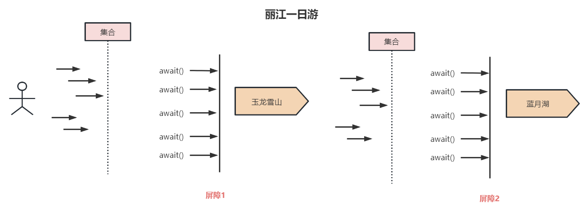

#### 常用API

```java
// parties表示屏障拦截的线程数量，每个线程调用 await 方法告诉 CyclicBarrier 我已经到达了屏障，然后当前线程被阻塞。
public CyclicBarrier(int parties)
// 用于在线程到达屏障时，优先执行 barrierAction，方便处理更复杂的业务场景(该线程的执行时机是在到达屏障之后再执行)
public CyclicBarrier(int parties, Runnable barrierAction)

//指定数量的线程全部调用await()方法时，这些线程不再阻塞
// BrokenBarrierException 表示栅栏已经被破坏，破坏的原因可能是其中一个线程 await() 时被中断或者超时
public int await() throws InterruptedException, BrokenBarrierException
public int await(long timeout, TimeUnit unit) throws InterruptedException, BrokenBarrierException, TimeoutException

//循环  通过reset()方法可以进行重置
public void reset()
```

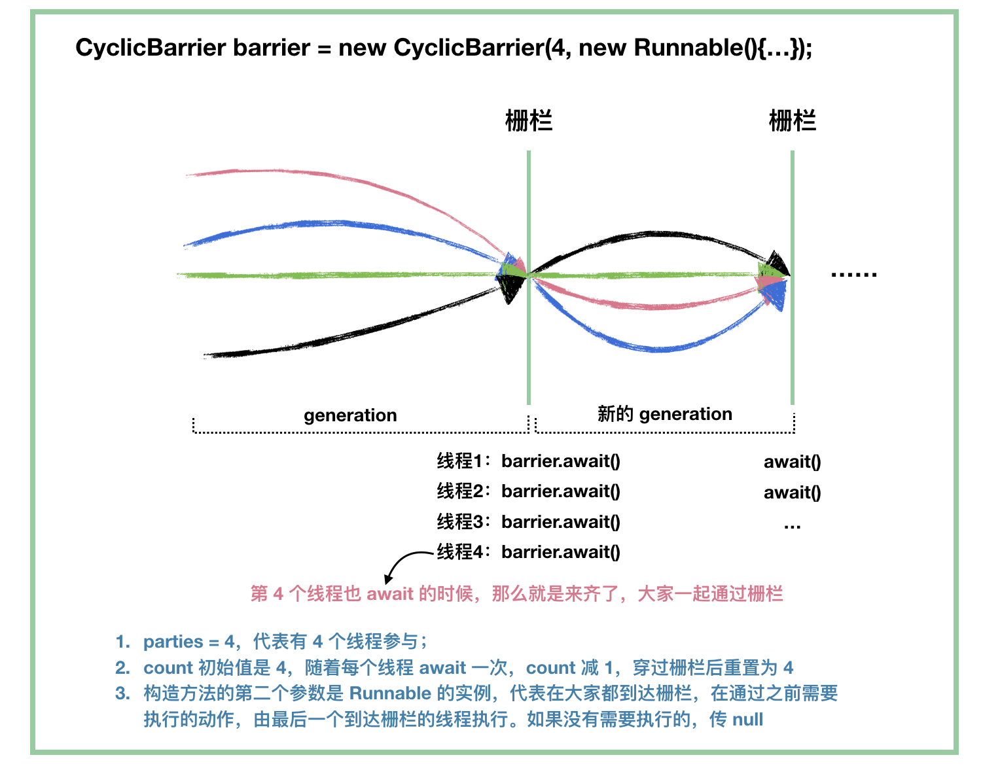

#### CyclicBarrier使用

**模拟人满发车**

利用`CyclicBarrier`的计数器能够重置，屏障可以重复使用的特性，可以支持类似**“人满发车”**的场景

```java
public class CyclicBarrierDemo {

    public static void main(String[] args) {

        ExecutorService executorService = Executors.newFixedThreadPool(5);

        CyclicBarrier cyclicBarrier = new CyclicBarrier(5,
                () -> System.out.println("人齐了，准备发车"));

        for (int i = 0; i < 10; i++) {
            final int id = i+1;
            executorService.submit(new Runnable() {
                @Override
                public void run() {
                    try {
                        System.out.println(id+"号马上就到");
                        int sleepMills = ThreadLocalRandom.current().nextInt(2000);
                        Thread.sleep(sleepMills);
                        System.out.println(id + "号到了，上车");
                        cyclicBarrier.await();
                    } catch (InterruptedException e) {
                        e.printStackTrace();
                    }catch(BrokenBarrierException e){
                        e.printStackTrace();
                    }
                }
            });
        }
    }
}
```

**多线程批量处理数据**

```java
public class CyclicBarrierBatchProcessorDemo {

    public static void main(String[] args) {
        //生成数据
        List<Integer> data = new ArrayList<>();
        for (int i = 1; i <= 50; i++) {
            data.add(i);
        }
        //指定数据处理大小
        int batchSize = 5;
        CyclicBarrierBatchProcessor processor = new CyclicBarrierBatchProcessor(data, batchSize);
        //处理数据
        processor.process(batchData -> {
            for (Integer i : batchData) {
                System.out.println(Thread.currentThread().getName() + "处理数据" + i);
            }
        });
    }
}

class CyclicBarrierBatchProcessor {
    private List<Integer> data;
    private int batchSize;
    private CyclicBarrier barrier;
    private List<Thread> threads;

    public CyclicBarrierBatchProcessor(List<Integer> data, int batchSize) {
        this.data = data;
        this.batchSize = batchSize;
        this.barrier = new CyclicBarrier(batchSize);
        this.threads = new ArrayList<>();
    }

    public void process(BatchTask task) {
        // 对任务分批，获取线程数
        int threadCount = (data.size() + batchSize - 1) / batchSize;
        for (int i = 0; i < threadCount; i++) {
            int start = i * batchSize;
            int end = Math.min(start + batchSize, data.size());
            //获取每个线程处理的任务数
            List<Integer> batchData = data.subList(start, end);
            Thread thread = new Thread(() -> {
                task.process(batchData);
                try {
                    barrier.await();
                } catch (InterruptedException | BrokenBarrierException e) {
                    e.printStackTrace();
                }
            });
            threads.add(thread);
            thread.start();
        }

    }
    public interface BatchTask {
        void process(List<Integer> batchData);
    }
}
```

#### 应用场景

以下是一些常见的`CyclicBarrier`应用场景：

1. 多线程任务：`CyclicBarrier` 可以用于将复杂的任务分配给多个线程执行，并在所有线程完成工作后触发后续操作。
2. 数据处理：`CyclicBarrier` 可以用于协调多个线程间的数据处理，在所有线程处理完数据后触发后续操作。

**`CyclicBarrier` 与 `CountDownLatch` 区别**

- `CountDownLatch` 是一次性的，`CyclicBarrier` 是可循环利用的
- `CountDownLatch` 参与的线程的职责是不一样的，有的在倒计时，有的在等待倒计时结束。`CyclicBarrier` 参与的线程职责是一样的。

### Exchanger

`Exchanger`是一个用于线程间协作的工具类，用于两个线程间交换数据。具体交换数据是通过`exchange`方法来实现的，如果一个线程先执行`exchange`方法，那么它会同步等待另一个线程也执行`exchange`方法，这个时候两个线程就都达到了同步点，两个线程就可以交换数据。

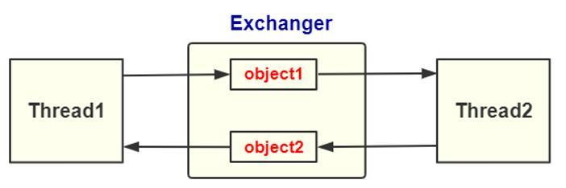

#### 常用API

```java
// 等待另一个线程到达此交换点（除非当前线程被中断），然后将给定的对象传送给该线程，并接收该线程的对象。
public V exchange(V x) throws InterruptedException
// 等待另一个线程到达此交换点，或者当前线程被中断——抛出中断异常；又或者是等候超时——抛出超时异常，然后将给定的对象传送给该线程，并接收该线程的对象。
public V exchange(V x, long timeout, TimeUnit unit) throws InterruptedException, TimeoutException
```

#### Exchanger使用

**模拟交易场景**

用一个简单的例子来看下`Exchanger`的具体使用。两方做交易，如果一方先到要等另一方也到了才能交易，交易就是执行`exchange`方法交换数据。

```java
public class ExchangerDemo {
    private static Exchanger exchanger = new Exchanger();
    static String goods = "电脑";
    static String money = "$4000";
    public static void main(String[] args) throws InterruptedException {

        System.out.println("准备交易，一手交钱一手交货...");
        // 卖家
        new Thread(new Runnable() {
            @Override
            public void run() {
                System.out.println("卖家到了，已经准备好货：" + goods);
                try {
                    String money = (String) exchanger.exchange(goods);
                    System.out.println("卖家收到钱：" + money);
                } catch (Exception e) {
                    e.printStackTrace();
                }
            }
        }).start();
        Thread.sleep(3000);
        // 买家
        new Thread(new Runnable() {
            @Override
            public void run() {
                try {
                    System.out.println("买家到了，已经准备好钱：" + money);
                    String goods = (String) exchanger.exchange(money);
                    System.out.println("买家收到货：" + goods);
                } catch (Exception e) {
                    e.printStackTrace();
                }
            }
        }).start();
    }
}
```

**模拟对账场景**

```java
public class ExchangerDemo2 {

    private static final Exchanger<String> exchanger = new Exchanger();
    private static ExecutorService threadPool = Executors.newFixedThreadPool(2);

    public static void main(String[] args) {
        threadPool.execute(new Runnable() {
            @Override
            public void run() {
                try {
                    String A = "12379871924sfkhfksdhfks";
                    exchanger.exchange(A);
                } catch (InterruptedException e) {
                }
            }
        });

        threadPool.execute(new Runnable() {
            @Override
            public void run() {
                try {
                    String B = "32423423jknjkfsbfj";
                    String A = exchanger.exchange(B);
                    System.out.println("A和B数据是否一致：" + A.equals(B));
                    System.out.println("A= "+A);
                    System.out.println("B= "+B);
                } catch (InterruptedException e) {
                }
            }
        });
        threadPool.shutdown();

    }
}
```

**模拟队列中交换数据场景**

```java
public class ExchangerDemo3 {

    private static ArrayBlockingQueue<String> fullQueue
            = new ArrayBlockingQueue<>(5);
    private static ArrayBlockingQueue<String> emptyQueue
            = new ArrayBlockingQueue<>(5);
    private static Exchanger<ArrayBlockingQueue<String>> exchanger
            = new Exchanger<>();

    public static void main(String[] args) {
        new Thread(new Producer()).start();
        new Thread(new Consumer()).start();

    }

    /**
     * 生产者
     */
    static class Producer implements Runnable {
        @Override
        public void run() {
            ArrayBlockingQueue<String> current = emptyQueue;
            try {
                while (current != null) {
                    String str = UUID.randomUUID().toString();
                    try {
                        current.add(str);
                        System.out.println("producer：生产了一个序列：" + str + ">>>>>加入到交换区");
                        Thread.sleep(2000);
                    } catch (IllegalStateException e) {
                        System.out.println("producer：队列已满，换一个空的");
                        current = exchanger.exchange(current);
                    }
                }
            } catch (Exception e) {
                e.printStackTrace();
            }
        }
    }

    /**
     * 消费者
     */
    static class Consumer implements Runnable {
        @Override
        public void run() {
            ArrayBlockingQueue<String> current = fullQueue;
            try {
                while (current != null) {
                    if (!current.isEmpty()) {
                        String str = current.poll();
                        System.out.println("consumer：消耗一个序列：" + str);
                        Thread.sleep(1000);
                    } else {
                        System.out.println("consumer：队列空了，换个满的");
                        current = exchanger.exchange(current);
                        System.out.println("consumer：换满的成功~~~~~~~~~~~~~~~~~~~~~~");
                    }
                }
            } catch (Exception e) {
                e.printStackTrace();
            }
        }
    }
}
```

#### 应用场景

`Exchanger`可以用于各种应用场景，具体取决于`Exchanger` 的实现。常见的场景包括：

1. 数据交换：在多线程环境中，两个线程可以通过 `Exchanger` 进行数据交换。
2. 数据采集：在数据采集系统中，可以使用 `Exchanger` 在采集线程和处理线程间进行数据交换。

### Phaser

`Phaser`（阶段协同器）是一个Java实现的并发工具类，用于协调多个线程的执行。它提供了一些方便的方法来管理多个阶段的执行，可以让程序员灵活地控制线程的执行顺序和阶段性的执行。`Phaser`可以被视为`CyclicBarrier`和`CountDownLatch`的进化版，它能够自适应地调整并发线程数，可以动态地增加或减少参与线程的数量。所以`Phaser`特别适合使用在重复执行或者重用的情况。

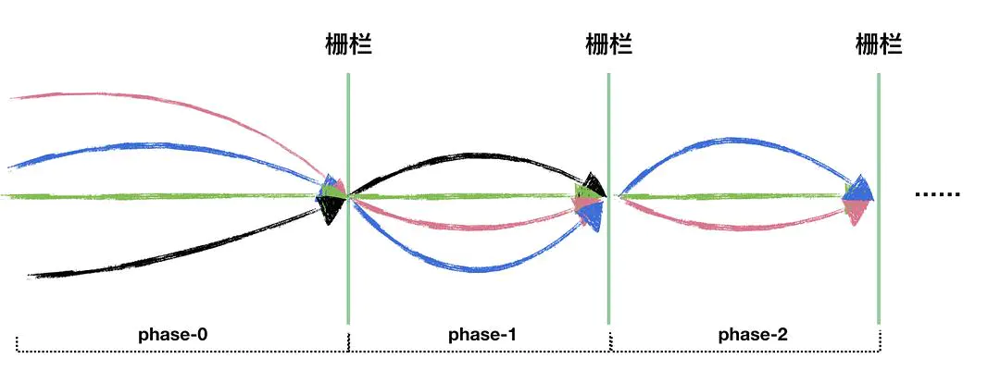

#### 常用API

**构造方法**

| 方法                               | 描述                                                         |
| ---------------------------------- | ------------------------------------------------------------ |
| **Phaser(int parties)**            | **指定初始参与任务数**                                       |
| Phaser(Phaser parent)              | 指定parent阶段器，子对象作为一个整体加入parent对象。当子对象中没有参与者时，会自动从parent对象解除注册。 |
| Phaser(Phaser parent, int parties) | 集合上面两个方法。                                           |

**增减参与任务数方法**

| 方法名                        | 功能描述                             |
| ----------------------------- | ------------------------------------ |
| **int register()**            | **增加一个任务数，返回当前阶段号。** |
| int bulkRegister(int parties) | 增加指定任务个数，返回当前阶段号。   |
| **int arriveAndDeregister()** | **减少一个任务数，返回当前阶段号。** |

**到达、等待方法**

| 方法名                                                       | 功能描述                                                     |
| ------------------------------------------------------------ | ------------------------------------------------------------ |
| int arrive()                                                 | 到达(任务完成)，返回当前阶段号。                             |
| **int arriveAndAwaitAdvance()**                              | **到达后等待其他任务到达，返回到达阶段号。**                 |
| int awaitAdvance(int phase)                                  | 在指定阶段等待(必须是当前阶段才有效)                         |
| int awaitAdvanceInterruptibly(int phase)                     | 阶段到达触发动作                                             |
| int awaitAdvanceInterruptibly(int phase, long timeout, TimeUnit unit) | 在指定时间内等待阶段到达并触发动作                           |
| **protected boolean onAdvance(int phase, int registeredParties)** | **类似`CyclicBarrier`的触发命令，通过重写该方法来增加阶段到达动作。该方法返回true将终结Phaser对象。** |

#### Phaser使用

**多线程批量处理数据**

```java
public class PhaserBatchProcessorDemo {

    private final List<String> data;
    private final int batchSize;  //一次处理多少数据
    private final int threadCount; //处理的线程数
    private final Phaser phaser;
    private final List<String> processedData;

    public PhaserBatchProcessorDemo(List<String> data, int batchSize, int threadCount) {
        this.data = data;
        this.batchSize = batchSize;
        this.threadCount = threadCount;
        this.phaser = new Phaser(1);
        this.processedData = new ArrayList<>();
    }

    public void process() {
        for (int i = 0; i < threadCount; i++) {

            phaser.register();
            new Thread(new BatchProcessor(i)).start();
        }

        phaser.arriveAndDeregister();
    }

    private class BatchProcessor implements Runnable {

        private final int threadIndex;

        public BatchProcessor(int threadIndex) {
            this.threadIndex = threadIndex;
        }

        @Override
        public void run() {
            int index = 0;
            while (true) {
                // 所有线程都到达这个点之前会阻塞
                phaser.arriveAndAwaitAdvance();
                // 从未处理数据中找到一个可以处理的批次
                List<String> batch = new ArrayList<>();
                synchronized (data) {
                    while (index < data.size() && batch.size() < batchSize) {
                        String d = data.get(index);
                        if (!processedData.contains(d)) {
                            batch.add(d);
                            processedData.add(d);
                        }
                        index++;
                    }
                }
                // 处理数据
                for (String d : batch) {
                    System.out.println("线程" + threadIndex + "处理数据" + d);
                }
                // 所有线程都处理完当前批次之前会阻塞
                phaser.arriveAndAwaitAdvance();

                // 所有线程都处理完当前批次或者未处理数据处理完之前会阻塞
                if (batch.isEmpty() || index >= data.size()) {
                    phaser.arriveAndDeregister();
                    break;
                }
            }
        }
    }

    public static void main(String[] args) {
        //数据准备
        List<String> data = new ArrayList<>();
        for (int i = 1; i <= 15; i++) {
            data.add(String.valueOf(i));
        }

        int batchSize = 4;
        int threadCount = 3;
        PhaserBatchProcessorDemo processor = new PhaserBatchProcessorDemo(data, batchSize, threadCount);
        //处理数据
        processor.process();
    }
}
```

**阶段性任务：模拟公司团建**

```java
public class PhaserDemo {
    public static void main(String[] args) {
        final Phaser phaser = new Phaser() {
            //重写该方法来增加阶段到达动作
            @Override
            protected boolean onAdvance(int phase, int registeredParties) {
                // 参与者数量，去除主线程
                int staffs = registeredParties - 1;
                switch (phase) {
                    case 0:
                        System.out.println("大家都到公司了，出发去公园，人数：" + staffs);
                        break;
                    case 1:
                        System.out.println("大家都到公园门口了，出发去餐厅，人数：" + staffs);
                        break;
                    case 2:
                        System.out.println("大家都到餐厅了，开始用餐，人数：" + staffs);
                        break;
                }
                // 判断是否只剩下主线程（一个参与者），如果是，则返回true，代表终止
                return registeredParties == 1;
            }
        };

        // 注册主线程 ———— 让主线程全程参与
        phaser.register();
        final StaffTask staffTask = new StaffTask();

        // 3个全程参与团建的员工
        for (int i = 0; i < 3; i++) {
            // 添加任务数
            phaser.register();
            new Thread(() -> {
                try {
                    staffTask.step1Task();
                    //到达后等待其他任务到达
                    phaser.arriveAndAwaitAdvance();

                    staffTask.step2Task();
                    phaser.arriveAndAwaitAdvance();

                    staffTask.step3Task();
                    phaser.arriveAndAwaitAdvance();

                    staffTask.step4Task();
                    // 完成了，注销离开
                    phaser.arriveAndDeregister();
                } catch (InterruptedException e) {
                    e.printStackTrace();
                }
            }).start();
        }

        // 两个不聚餐的员工加入
        for (int i = 0; i < 2; i++) {
            phaser.register();
            new Thread(() -> {
                try {
                    staffTask.step1Task();
                    phaser.arriveAndAwaitAdvance();

                    staffTask.step2Task();
                    System.out.println("员工【" + Thread.currentThread().getName() + "】回家了");
                    // 完成了，注销离开
                    phaser.arriveAndDeregister();
                } catch (InterruptedException e) {
                    e.printStackTrace();
                }
            }).start();
        }

        while (!phaser.isTerminated()) {
            int phase = phaser.arriveAndAwaitAdvance();
            if (phase == 2) {
                // 到了去餐厅的阶段，又新增4人，参加晚上的聚餐
                for (int i = 0; i < 4; i++) {
                    phaser.register();
                    new Thread(() -> {
                        try {
                            staffTask.step3Task();
                            phaser.arriveAndAwaitAdvance();

                            staffTask.step4Task();
                            // 完成了，注销离开
                            phaser.arriveAndDeregister();
                        } catch (InterruptedException e) {
                            e.printStackTrace();
                        }
                    }).start();
                }
            }
        }
    }

    static final Random random = new Random();

    static class StaffTask {
        public void step1Task() throws InterruptedException {
            // 第一阶段：来公司集合
            String staff = "员工【" + Thread.currentThread().getName() + "】";
            System.out.println(staff + "从家出发了……");
            Thread.sleep(random.nextInt(5000));
            System.out.println(staff + "到达公司");
        }

        public void step2Task() throws InterruptedException {
            // 第二阶段：出发去公园
            String staff = "员工【" + Thread.currentThread().getName() + "】";
            System.out.println(staff + "出发去公园玩");
            Thread.sleep(random.nextInt(5000));
            System.out.println(staff + "到达公园门口集合");

        }

        public void step3Task() throws InterruptedException {
            // 第三阶段：去餐厅
            String staff = "员工【" + Thread.currentThread().getName() + "】";
            System.out.println(staff + "出发去餐厅");
            Thread.sleep(random.nextInt(5000));
            System.out.println(staff + "到达餐厅");

        }

        public void step4Task() throws InterruptedException {
            // 第四阶段：就餐
            String staff = "员工【" + Thread.currentThread().getName() + "】";
            System.out.println(staff + "开始用餐");
            Thread.sleep(random.nextInt(5000));
            System.out.println(staff + "用餐结束，回家");
        }
    }
}
```

#### 应用场景

以下是一些常见的`Phaser`应用场景：

1. 多线程任务分配：`Phaser`可以用于将复杂的任务分配给多个线程执行，并协调线程间的合作。
2. 多级任务流程：`Phaser`可以用于实现多级任务流程，在每一级任务完成后触发下一级任务的开始。
3. 模拟并行计算：`Phaser`可以用于模拟并行计算，协调多个线程间的工作。
4. 阶段性任务：`Phaser`可以用于实现阶段性任务，在每一阶段任务完成后触发下一阶段任务的开始。

## ThreadPool

### ThreadPool基础

#### 线程池执行任务的流程

`ThreadPoolExecutor`中提供了两种执行任务的方法：

```java
void execute(Runnable command)
Future submit(Runnable task)
```

实际上`submit`中最终还是调用的`execute()`方法，只不过会返回一个`Future`对象，用来获取任务执行结果：

```java
public Future<?> submit(Runnable task) {
    if (task == null) throw new NullPointerException();
    RunnableFuture<Void> ftask = newTaskFor(task, null);
    execute(ftask);
    return ftask;
}
```

`execute(Runnable command)`方法执行时会分为三步：

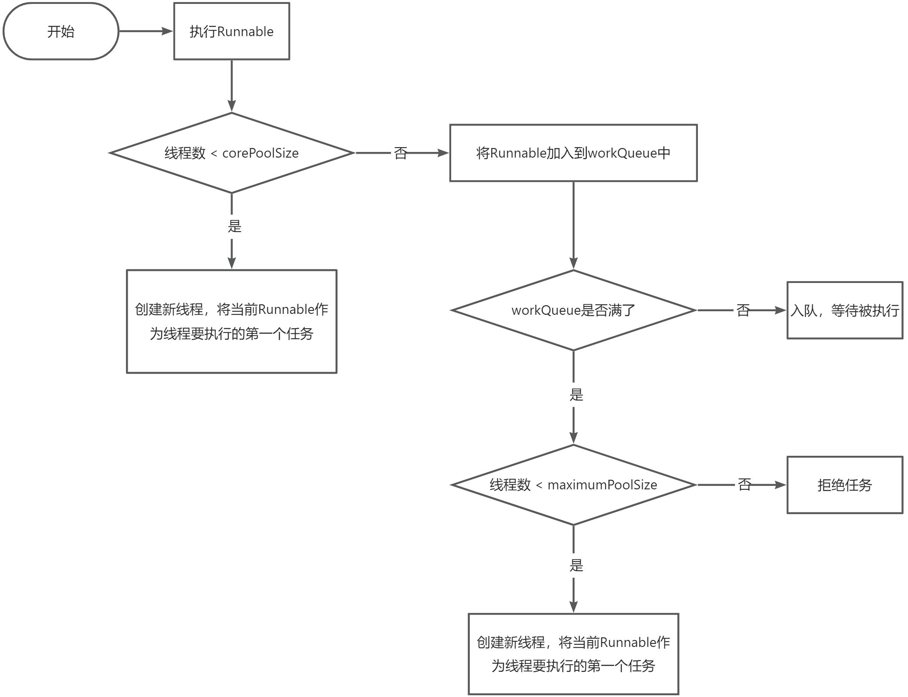

>**提交一个`Runnable`时，不管当前线程池中的线程是否空闲，只要数量小于核心线程数就会创建新线程。**
>
>**`ThreadPoolExecutor`相当于是非公平的，比如队列满了之后提交的`Runnable`可能会比正在排队的`Runnable`先执行。**

#### 线程池的状态流转

线程池有五种状态：

- `RUNNING`：**会**接收新任务并且**会**处理队列中的任务
- `SHUTDOWN`：**不会**接收新任务并且**会**处理队列中的任务，剩余任务都处理完之后，会中断所有工作线程
- `STOP`：**不会**接收新任务并且**不会**处理队列中的任务，并且会中断在处理的任务（注意：一个任务能不能被中断得看任务本身）
- `TIDYING`：所有任务都终止了，线程池中也没有线程了，这样线程池的状态就会转为`TIDYING`，一旦达到此状态，就会调用线程池的`terminated()`
- `TERMINATED`：`terminated()`执行完之后就会转变为`TERMINATED`

这五种状态并不能任意转换，只会有以下几种转换情况：

1. `RUNNING -> SHUTDOWN`：手动调用`shutdown()`触发，或者线程池对象`GC`时会调用`finalize()`从而调用`shutdown()`
2. `(RUNNING or SHUTDOWN) -> STOP`：调用`shutdownNow()`触发，如果先调`shutdown()`紧着调`shutdownNow()`，就会发生`SHUTDOWN -> STOP`
3. `SHUTDOWN -> TIDYING`：队列为空并且线程池中没有线程时自动转换
4. `STOP -> TIDYING`：线程池中没有线程时自动转换（队列中可能还有任务）
5. `TIDYING -> TERMINATED`：`terminated()`执行完后就会自动转换

#### 线程池中的线程关闭

我们一般会使用`thread.start()`方法来开启一个线程，那如何停掉一个线程呢？

`Thread`类提供了一个`stop()`，但是标记了`@Deprecated`，为什么不推荐用`stop()`方法来停掉线程呢？因为`stop()`方法太粗暴了，一旦调用了`stop()`，就会**直接停掉线程**，但是调用的时候根本不知道线程刚刚在做什么，任务做到哪一步了，这是很危险的。这里强调一点，`stop()`会释放线程占用的`synchronized`锁（不会自动释放`ReentrantLock`锁，这也是不建议用`stop()`的一个因素）。

```java
public class ThreadTest {

    static int count = 0;
    static final Object lock = new Object();
    static final ReentrantLock reentrantLock = new ReentrantLock();

    public static void main(String[] args) throws InterruptedException {
        Thread thread = new Thread(new Runnable() {
            public void run() {
//                synchronized (lock) {
                reentrantLock.lock();
                    for (int i = 0; i < 100; i++) {
                        count++;
                        try {
                            Thread.sleep(1000);
                        } catch (InterruptedException e) {
                            throw new RuntimeException(e);
                        }
                    }
//                }
                reentrantLock.unlock();
            }
        });
        thread.start();
        Thread.sleep(5*1000);
        thread.stop();
//
//        Thread.sleep(5*1000);

        reentrantLock.lock();
        System.out.println(count);
        reentrantLock.unlock();
      
//        synchronized (lock) {
//            System.out.println(count);
//        }
    }
}
```

所以，通常会通过**自定义一个变量，或者通过中断来停掉一个线程**

```java
public class ThreadTest {

    static int count = 0;
    static boolean stop = false;

    public static void main(String[] args) throws InterruptedException {

        Thread thread = new Thread(new Runnable() {
            public void run() {

                for (int i = 0; i < 100; i++) {
                    if (stop) {
                        break;
                    }

                    count++;
                    try {
                        Thread.sleep(1000);
                    } catch (InterruptedException e) {
                        throw new RuntimeException(e);
                    }
                }
            }
        });
        thread.start();
        Thread.sleep(5 * 1000);
        stop = true;
        Thread.sleep(5 * 1000);
        System.out.println(count);
    }
}
```

不同点在于，当我们把`stop`设置为`true`时，线程自身可以控制到底要不要停止，何时停止，同样，我们可以调用`thread`的`interrupt()`来中断线程：

```java
public class ThreadTest {

    static int count = 0;
    static boolean stop = false;

    public static void main(String[] args) throws InterruptedException {

        Thread thread = new Thread(new Runnable() {
            public void run() {
                for (int i = 0; i < 100; i++) {
                    if (Thread.currentThread().isInterrupted()) {
                        break;
                    }
                    count++;
                    try {
                        Thread.sleep(1000);
                    } catch (InterruptedException e) {
                        break;
                    }
                }
            }
        });
        thread.start();
        Thread.sleep(5 * 1000);
        thread.interrupt();
        Thread.sleep(5 * 1000);
        System.out.println(count);
    }
}
```

不同的地方在于，线程`sleep`过程中如果被中断了会接收到异常。

其实线程池中就是通过`interrupt()`来停止线程的，比如`shutdownNow()`方法中会调用：

```java
void interruptIfStarted() {
    Thread t;
    if (getState() >= 0 && (t = thread) != null && !t.isInterrupted()) {
        try {
            t.interrupt();
        } catch (SecurityException ignore) {
        }
    }
}
```

#### 线程池中的阻塞队列

线程池中的线程在运行过程中，执行完创建线程时绑定的第一个任务后，就会不断的从队列中获取任务并执行，那么如果队列中没有任务了，线程为了不自然消亡，就会阻塞在获取队列任务时，等着队列中有任务过来就会拿到任务从而去执行任务。

通过这种方法**能最终确保，线程池中能保留指定个数的核心线程数**，关键代码为：

```java
try {
    Runnable r = timed ?
        workQueue.poll(keepAliveTime, TimeUnit.NANOSECONDS) :
        workQueue.take();
    if (r != null)
        return r;
    timedOut = true;
} catch (InterruptedException retry) {
    timedOut = false;
}
```

某个线程在从队列获取任务时，会判断是否使用超时阻塞获取，我们可以认为非核心线程会`poll()`，核心线程会`take()`，非核心线程超过时间还没获取到任务后面就会自然消亡了。

#### 线程池中的线程异常

**线程发生异常，会被移出线程池**

在源码中，当执行任务时出现异常时，最终会执行`processWorkerExit()`，执行完这个方法后，当前线程也就自然消亡了，但是！`processWorkerExit()`方法中会额外再新增一个线程，这样就能维持住固定的核心线程数。

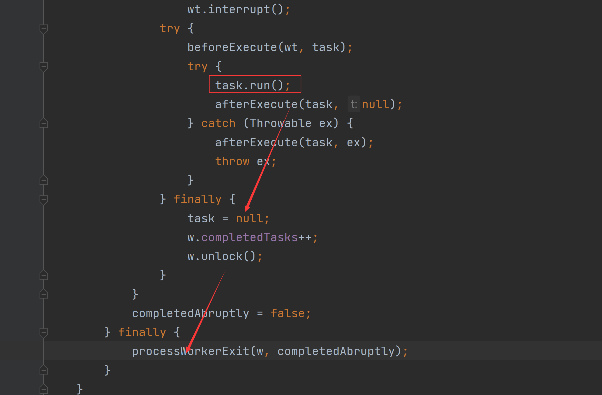

#### Tomcat中的自定义线程池

`Tomcat`中用的线程池为`org.apache.tomcat.util.threads.ThreadPoolExecutor`，注意类名和`JUC`下的一样，但是包名不一样。

`Tomcat`会创建这个线程池：

```java
public void createExecutor() {
    internalExecutor = true;
    TaskQueue taskqueue = new TaskQueue();
    TaskThreadFactory tf = new TaskThreadFactory(getName() + "-exec-", daemon, getThreadPriority());
    executor = new ThreadPoolExecutor(getMinSpareThreads(), getMaxThreads(), 60, TimeUnit.SECONDS,taskqueue, tf);
    taskqueue.setParent( (ThreadPoolExecutor) executor);
}
```

注入传入的队列为`TaskQueue`，它的入队逻辑为：

```java
public boolean offer(Runnable o) {
    //we can't do any checks
    if (parent==null) {
        return super.offer(o);
    }

    //we are maxed out on threads, simply queue the object
    if (parent.getPoolSize() == parent.getMaximumPoolSize()) {
        return super.offer(o);
    }

    //we have idle threads, just add it to the queue
    if (parent.getSubmittedCount()<=(parent.getPoolSize())) {
        return super.offer(o);
    }

    //if we have less threads than maximum force creation of a new thread
    if (parent.getPoolSize()<parent.getMaximumPoolSize()) {
        return false;
    }

    //if we reached here, we need to add it to the queue
    return super.offer(o);
}
```

特殊在：

- 入队时，如果线程池的线程个数等于最大线程池数才入队
- 入队时，如果线程池的线程个数小于最大线程池数，会返回`false`，表示入队失败

这样就控制了，`Tomcat`的这个线程池，在提交任务时：

1. 仍然会先判断线程个数是否小于核心线程数，如果小于则创建线程
2. 如果等于核心线程数，会入队，但是线程个数小于最大线程数会入队失败，从而会去创建线程

所以随着任务的提交，会优先创建线程，直到线程个数等于最大线程数才会入队。

当然其中有一个比较细的逻辑是：在提交任务时，如果正在处理的任务数小于线程池中的线程个数，那么也会直接入队，而不会去创建线程，也就是上面源码中`getSubmittedCount`的作用。

#### 线程池的corePoolSize与maximumPoolSize

线程池中有两个非常重要的参数：

1. `corePoolSize`：核心线程数，表示线程池中的常驻线程的个数
2. `maximumPoolSize`：最大线程数，表示线程池中能开辟的最大线程个数

对线程池负责执行的任务分为三种情况：

1. CPU密集型任务，比如找出1-1000000中的素数
2. IO密集型任务，比如文件IO、网络IO
3. 混合型任务

**CPU密集型任务**

CPU密集型任务的特点是：线程在执行任务时会一直利用CPU，所以对于这种情况，就尽可能避免发生线程上下文切换。

比如，现在我的电脑只有一个CPU，如果有两个线程在同时执行找素数的任务，那么这个CPU就需要额外的进行线程上下文切换，从而达到线程并行的效果，此时执行这两个任务的总时间为：

任务执行时间*2+线程上下文切换的时间

而如果只有一个线程，这个线程来执行两个任务，那么时间为：

任务执行时间*2

所以对于CPU密集型任务，线程数最好就等于CPU核心数，可以通过以下API拿到你电脑的核心数：

```java
Runtime.getRuntime().availableProcessors()
```

只不过，为了应对线程执行过程发生缺页中断或其他异常导致线程阻塞的请求，我们可以额外在多设置一个线程，这样当某个线程暂时不需要CPU时，可以有替补线程来继续利用CPU。

所以，对于CPU密集型任务，我们可以设置线程数为：**CPU核心数+1**

**IO型任务**

线程在执行IO型任务时，可能大部分时间都阻塞在IO上，假如现在有10个CPU，如果我们只设置了10个线程来执行IO型任务，那么很有可能这10个线程都阻塞在了IO上，这样这10个CPU就都没活干了，所以，对于IO型任务，我们通常会设置线程数为：**2\*CPU核心数**

不过，就算是设置为了**2\*CPU核心数**，也不一定是最佳的，比如，有10个CPU，线程数为20，那么也有可能这20个线程同时阻塞在了IO上，所以可以再增加线程，从而去压榨CPU的利用率。

**通常，如果IO型任务执行的时间越长，那么同时阻塞在IO上的线程就可能越多，我们就可以设置更多的线程，但是，线程肯定不是越多越好**，我们可以通过以下这个公式来进行计算：

**线程数 = CPU核心数   *（ 1 + 线程等待时间 / 线程运行总时间 ）**

- 线程等待时间：指的就是线程没有使用CPU的时间，比如阻塞在了IO
- 线程运行总时间：指的是线程执行完某个任务的总时间

**在工作中的参数设置：**

1. CPU密集型任务：CPU核心数+1，这样既能充分利用CPU，也不至于有太多的上下文切换成本
2. IO型任务：建议压测，或者先用公式计算出一个理论值（理论值通常都比较小）
3. 对于核心业务（访问频率高），可以把核心线程数设置为我们压测出来的结果，最大线程数可以等于核心线程数，或者大一点点，比如我们压测时可能会发现500个线程最佳，但是600个线程时也还行，此时600就可以为最大线程数
4. 对于非核心业务（访问频率不高），核心线程数可以比较小，避免操作系统去维护不必要的线程，最大线程数可以设置为我们计算或压测出来的结果。

### 源码分析

#### 基本属性和方法

在线程池的源码中，会通过一个`AtomicInteger`类型的变量**ctl**，来表示**线程池的状态**和**当前线程池中的工作线程数量**。

一个`Integer`占4个字节，也就是32个bit，线程池有5个状态：`RUNNING、SHUTDOWN、STOP、TIDYING、TERMINATED`

2个bit能表示4种状态，那5种状态就至少需要三个bit位，比如在线程池的源码中就是这么来表示的：

```java
// 源码
private static final int COUNT_BITS = Integer.SIZE - 3;

private static final int RUNNING    = -1 << COUNT_BITS;
private static final int SHUTDOWN   =  0 << COUNT_BITS;
private static final int STOP       =  1 << COUNT_BITS;
private static final int TIDYING    =  2 << COUNT_BITS;
private static final int TERMINATED =  3 << COUNT_BITS;

/**
Integer.SIZE为32，所以COUNT_BITS为29，最终各个状态对应的二级制为：
RUNNING：11100000 00000000 00000000 00000000
SHUTDOWN：00000000 00000000 00000000 00000000
STOP：00100000 00000000 00000000 00000000
TIDYING：01000000 00000000 00000000 00000000
TERMINATED：01100000 00000000 00000000 00000000
**/

// c状态是否小于s状态，比如RUNNING小于SHUTDOWN
private static boolean runStateLessThan(int c, int s) {
    return c < s;
}

// c状态是否大于等于s状态，比如STOP大于SHUTDOWN
private static boolean runStateAtLeast(int c, int s) {
    return c >= s;
}

// c状态是不是RUNNING，只有RUNNING是小于SHUTDOWN的
private static boolean isRunning(int c) {
    return c < SHUTDOWN;
}

// 通过cas来增加工作线程数量，直接对ctl进行加1
// 这个方法没考虑是否超过最大工作线程数的（2的29次方）限制，源码中在调用该方法之前会进行判断的
private boolean compareAndIncrementWorkerCount(int expect) {
    return ctl.compareAndSet(expect, expect + 1);
}

// 通过cas来减少工作线程数量，直接对ctl进行减1
private boolean compareAndDecrementWorkerCount(int expect) {
    return ctl.compareAndSet(expect, expect - 1);
}
```

前面说到线程池有5个状态，这5个状态分别表示：

1. `RUNNING`：线程池正常运行中，可以正常的接受并处理任务
2. `SHUTDOWN`：线程池关闭了，**不能接受新任务**，但是**线程池会把阻塞队列中的剩余任务执行完**，剩余任务都处理完之后，会中断所有工作线程
3. STOP：线程池停止了，**不能接受新任务**，并且也**不会处理阻塞队列中的任务**，会中断所有工作线程
4. TIDYING：当前线程池中的工作线程都被停止后，就会进入TIDYING
5. TERMINATED：线程池处于TIDYING状态后，会执行terminated()方法，执行完后就会进入TERMINATED状态，在ThreadPoolExecutor中terminated()是一个空方法，可以自定义线程池重写这个方法

#### execute方法

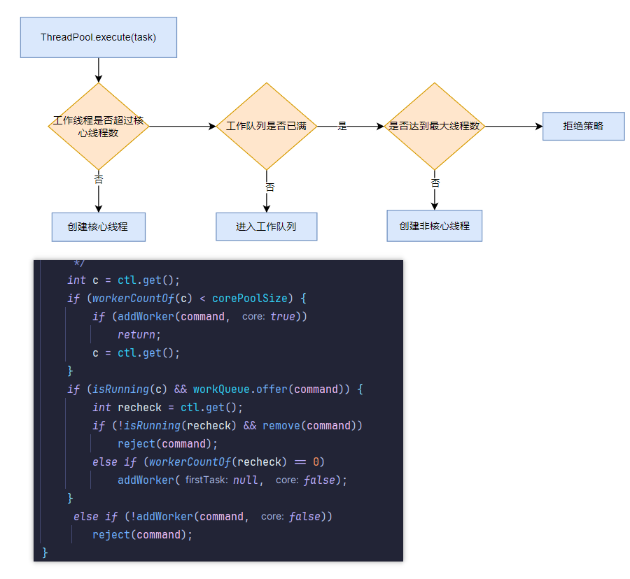

**源码部分**

```java
public void execute(Runnable command) {
    
    if (command == null)
        throw new NullPointerException();
    
    // 获取ctl
    // ctl初始值是ctlOf(RUNNING, 0)，表示线程池处于运行中，工作线程数为0
    int c = ctl.get();
    
    // 工作线程数小于corePoolSize，则添加工作线程，并把command作为该线程要执行的任务
    if (workerCountOf(c) < corePoolSize) {
        // true表示添加的是核心工作线程，具体一点就是，在addWorker内部会判断当前工作线程数是不是超过了corePoolSize
        // 如果超过了则会添加失败，addWorker返回false，表示不能直接开启新的线程来执行任务，而是应该先入队
        if (addWorker(command, true))
            return;
        
        // 如果添加核心工作线程失败，那就重新获取ctl，可能是线程池状态被其他线程修改了
        // 也可能是其他线程也在向线程池提交任务，导致核心工作线程已经超过了corePoolSize
        c = ctl.get();
    }
    
    // 线程池状态是否还是RUNNING，如果是就把任务添加到阻塞队列中
    if (isRunning(c) && workQueue.offer(command)) {
        
        // 在任务入队时，线程池的状态可能也会发生改变
        // 再次检查线程池的状态，如果线程池不是RUNNING了，那就不能再接受任务了，就得把任务从队列中移除，并进行拒绝策略
        
        // 如果线程池的状态没有发生改变，仍然是RUNNING，那就不需要把任务从队列中移除掉
        // 不过，为了确保刚刚入队的任务有线程会去处理它，需要判断一下工作线程数，如果为0，那就添加一个非核心的工作线程
        // 添加的这个线程没有自己的任务，目的就是从队列中获取任务来执行
        int recheck = ctl.get();
        if (! isRunning(recheck) && remove(command))
            reject(command);
        else if (workerCountOf(recheck) == 0)
            addWorker(null, false);
    }
    // 如果线程池状态不是RUNNING，或者线程池状态是RUNNING但是队列满了，则去添加一个非核心工作线程
    // 实际上，addWorker中会判断线程池状态如果不是RUNNING，是不会添加工作线程的
    // false表示非核心工作线程，作用是，在addWorker内部会判断当前工作线程数已经超过了maximumPoolSize，如果超过了则会添加不成功，执行拒绝策略
    else if (!addWorker(command, false))
        reject(command);
}
```

#### addWorker方法

`addWorker`方法是核心方法，是用来添加线程的，core参数表示添加的是核心线程还是非核心线程。

添加线程实际上就要开启一个线程，不管是核心线程还是非核心线程其实都只是一个普通的线程，而核心和非核心的区别在于：

- 如果是要添加**核心工作线程**，那么就得判断目前的工作线程数是否超过`corePoolSize`

- 1. 如果没有超过，则直接开启新的工作线程执行任务
  2. 如果超过了，则不会开启新的工作线程，而是把任务进行入队

- 如果要添加的是**非核心工作线程**，那就要判断目前的工作线程数是否超过`maximumPoolSize`

- 1. 如果没有超过，则直接开启新的工作线程执行任务
  2. 如果超过了，则拒绝执行任务

所以在`addWorker`方法中，首先就要判断工作线程有没有超过限制，如果没有超过限制再去开启一个线程。

并且在`addWorker`方法中，还得判断线程池的状态，如果线程池的状态不是`RUNNING`状态了，那就没必要要去添加线程了

当然有一种特例，就是线程池的状态是`SHUTDOWN`，但是队列中有任务，那此时还是需要添加添加一个线程的。

**那这种特例是如何产生的呢？**

我们前面提到的都是开启新的工作线程，那么工作线程怎么回收呢？不可能开启的工作线程一直活着，因为如果任务由多变少，那也就不需要过多的线程资源，所以线程池中会有机制对开启的工作线程进行回收，如何回收的，后文会提到，我们这里先分析，有没有可能线程池中所有的线程都被回收了，答案的是有的。

首先非核心工作线程被回收是可以理解的，那核心工作线程要不要回收掉呢？其实线程池存在的意义，就是提前生成好线程资源，需要线程的时候直接使用就可以，而不需要临时去开启线程，所以正常情况下，开启的核心工作线程是不用回收掉的，就算暂时没有任务要处理，也不用回收，就让核心工作线程在那等着就可以了。

**但是！**在线程池中有这么一个参数：**allowCoreThreadTimeOut**，表示是否允许核心工作线程超时，意思就是**是否允许核心工作线程回收**，默认这个参数为false，但是我们可以调用`allowCoreThreadTimeOut(boolean value)`来把这个参数改为true，只要改了，那么核心工作线程也就会被回收了，那这样线程池中的所有工作线程都可能被回收掉，那如果所有工作线程都被回收掉之后，阻塞队列中来了一个任务，这样就形成了特例情况。

**源码部分**

```java
private boolean addWorker(Runnable firstTask, boolean core) {
    retry:
    for (;;) {
        int c = ctl.get();
        int rs = runStateOf(c);
        
        // 线程池如果是SHUTDOWN状态并且队列非空则创建线程，如果队列为空则不创建线程了
        // 线程池如果是STOP状态则直接不创建线程了
        // Check if queue empty only if necessary.
        if (rs >= SHUTDOWN &&
            ! (rs == SHUTDOWN &&
               firstTask == null &&
               ! workQueue.isEmpty()))
            return false;
        
        // 判断工作线程数是否超过了限制
        // 如果超过限制了，则return false
        // 如果没有超过限制，则修改ctl，增加工作线程数，cas成功则退出外层retry循环，去创建新的工作线程
        // 如果cas失败，则表示有其他线程也在提交任务，也在增加工作线程数，此时重新获取ctl
        // 如果发现线程池的状态发生了变化，则继续回到retry，重新判断线程池的状态是不是SHUTDOWN或STOP
        // 如果状态没有变化，则继续利用cas来增加工作线程数，直到cas成功
        for (;;) {
            int wc = workerCountOf(c);
            if (wc >= CAPACITY ||
                wc >= (core ? corePoolSize : maximumPoolSize))
                return false;
            if (compareAndIncrementWorkerCount(c))
                break retry;
            c = ctl.get();  // Re-read ctl
            if (runStateOf(c) != rs)
                continue retry;
            // else CAS failed due to workerCount change; retry inner loop
        }
    }
    
    // ctl修改成功，也就是工作线程数+1成功
    // 接下来就要开启一个新的工作线程了
    
    boolean workerStarted = false;
    boolean workerAdded = false;
    Worker w = null;
    try {
        // Worker实现了Runnable接口
        // 在构造一个Worker对象时，就会利用ThreadFactory新建一个线程
        // Worker对象有两个属性：
        // Runnable firstTask：表示Worker待执行的第一个任务，第二个任务会从阻塞队列中获取
        // Thread thread：表示Worker对应的线程，就是这个线程来获取队列中的任务并执行的
        w = new Worker(firstTask);
        
        // 拿出线程对象，还没有start
        final Thread t = w.thread;
        if (t != null) {
            final ReentrantLock mainLock = this.mainLock;
            mainLock.lock();
            try {
                // Recheck while holding lock.
                // Back out on ThreadFactory failure or if
                // shut down before lock acquired.
                int rs = runStateOf(ctl.get());
                
                // 如果线程池的状态是RUNNING
                // 或者线程池的状态变成了SHUTDOWN，但是当前线程没有自己的第一个任务，那就表示当前调用addWorker方法是为了从队列中获取任务来执行
                // 正常情况下线程池的状态如果是SHUTDOWN，是不能创建新的工作线程的，但是队列中如果有任务，那就是上面说的特例情况
                if (rs < SHUTDOWN ||
                    (rs == SHUTDOWN && firstTask == null)) {
                    
                    // 如果Worker对象对应的线程已经在运行了，那就有问题，直接抛异常
                    if (t.isAlive()) // precheck that t is startable
                        throw new IllegalThreadStateException();
                    
                    // workers用来记录当前线程池中工作线程，调用线程池的shutdown方法时会遍历worker对象中断对应线程
                    workers.add(w);
                    
                    // largestPoolSize用来跟踪线程池在运行过程中工作线程数的峰值
                    int s = workers.size();
                    if (s > largestPoolSize)
                        largestPoolSize = s;
                    workerAdded = true;
                }
            } finally {
                mainLock.unlock();
            }
            
            // 运行线程
            if (workerAdded) {
                t.start();
                workerStarted = true;
            }
        }
    } finally {
        // 在上述过程中如果抛了异常，需要从works中移除所添加的work，并且还要修改ctl，工作线程数-1，表示新建工作线程失败
        if (! workerStarted)
            addWorkerFailed(w);
    }
    
    // 最后表示添加工作线程成功
    return workerStarted;
}
```

对于addWorker方法，核心逻辑就是：

1. 先判断工作线程数是否超过了限制
2. 修改ctl，使得工作线程数+1
3. 构造Work对象，并把它添加到workers集合中
4. 启动Work对象对应的工作线程

#### runWorker方法

工作线程`(Work)`的运行过程

构造方法

```java
Worker(Runnable firstTask) {
    setState(-1); // inhibit interrupts until runWorker
    this.firstTask = firstTask;
    this.thread = getThreadFactory().newThread(this);
}
```

在利用`ThreadFactory`创建线程时，会把`this`，也就是当前`Work`对象作为`Runnable`传给线程，所以工作线程运行时，就会执行`Worker`的`run`方法：

```java
public void run() {
    // 这个方法就是工作线程运行时的执行逻辑
    runWorker(this);
}
```

**源码部分**

```java
final void runWorker(Worker w) {
    // 就是当前工作线程
    Thread wt = Thread.currentThread();
    
    // 把Worker要执行的第一个任务拿出来
    Runnable task = w.firstTask;
    w.firstTask = null;
    
    // 这个地方，后面单独分析中断的时候来分析
    w.unlock(); // allow interrupts
    
    boolean completedAbruptly = true;
    try {
        
        // 判断当前线程是否有自己的第一个任务，如果没有就从阻塞队列中获取任务
        // 如果阻塞队列中也没有任务，那线程就会阻塞在这里
        // 但是并不会一直阻塞，在getTask方法中，会根据我们所设置的keepAliveTime来设置阻塞时间
        // 如果当前线程去阻塞队列中获取任务时，等了keepAliveTime时间，还没有获取到任务，则getTask方法返回null，相当于退出循环
        // 当然并不是所有线程都会有这个超时判断，主要还得看allowCoreThreadTimeOut属性和当前的工作线程数等等，后面单独分析
        // 目前，我们只需要知道工作线程在执行getTask()方法时，可能能直接拿到任务，也可能阻塞，也可能阻塞超时最终返回null
        while (task != null || (task = getTask()) != null) {
            // 只要拿到了任务，就要去执行任务
            
            // Work先加锁，跟shutdown方法有关，先忽略，后面会分析
            w.lock();
            
            
            // If pool is stopping, ensure thread is interrupted;
            // if not, ensure thread is not interrupted.  This
            // requires a recheck in second case to deal with
            // shutdownNow race while clearing interrupt
            
            // 下面这个if，最好把整篇文章都看完之后再来看这个if的逻辑
            
            // 工作线程在运行过程中
            // 如果发现线程池的状态变成了STOP，正常来说当前工作线程的中断标记应该为true，如果发现中断标记不为true，则需要中断自己
            
            // 如果线程池的状态不是STOP，要么是RUNNING，要么是SHUTDOWN
            // 但是如果发现中断标记为true，那是不对的，因为线程池状态不是STOP，工作线程仍然是要正常工作的，不能中断掉
            // 就算是SHUTDOWN，也要等任务都执行完之后，线程才结束，而目前线程还在执行任务的过程中，不能中断
            // 所以需要重置线程的中断标记，不过interrupted方法会自动清空中断标记
            // 清空为中断标记后，再次判断一下线程池的状态，如果又变成了STOP，那就仍然中断自己
            
            // 中断了自己后，会把当前任务执行完，在下一次循环调用getTask()方法时，从阻塞队列获取任务时，阻塞队列会负责判断当前线程的中断标记
            // 如果发现中断标记为true，那就会抛出异常，最终退出while循环，线程执行结束
            if ((runStateAtLeast(ctl.get(), STOP) ||
                 (Thread.interrupted() &&
                  runStateAtLeast(ctl.get(), STOP))) &&
                !wt.isInterrupted())
                wt.interrupt();
            
            
            try {
                // 空方法，给自定义线程池来实现
                beforeExecute(wt, task);
                Throwable thrown = null;
                try {
                    // 执行任务
                    // 注意执行任务时可能会抛异常，如果抛了异常会先依次执行三个finally，从而导致completedAbruptly = false这行代码没有执行
                    task.run();
                } catch (RuntimeException x) {
                    thrown = x; throw x;
                } catch (Error x) {
                    thrown = x; throw x;
                } catch (Throwable x) {
                    thrown = x; throw new Error(x);
                } finally {
                    // 空方法，给自定义线程池来实现
                    afterExecute(task, thrown);
                }
            } finally {
                task = null;
                w.completedTasks++; // 跟踪当前Work总共执行了多少了任务
                w.unlock();
            }
        }
        
        // 正常退出了While循环
        // 如果是执行任务的时候抛了异常，虽然也退出了循环，但是是不会执行这行代码的，只会直接进去下面的finally块中
        
        // 所以，要么是线程从队列中获取任务时阻塞超时了从而退出了循环会进入到这里
        // 要么是线程在阻塞的过程中被中断了，在getTask()方法中会处理中断的情况，如果被中断了，那么getTask()方法会返回null，从而退出循环
        // completedAbruptly=false，表示线程正常退出
        completedAbruptly = false;
    } finally {
        // 因为当前线程退出了循环，如果不做某些处理，那么这个线程就运行结束了，就是上文说的回收（自然消亡）掉了，线程自己运行完了也就结束了
        // 但是如果是由于执行任务的时候抛了异常，那么这个线程不应该直接结束，而应该继续从队列中获取下一个任务
        // 可是代码都执行到这里了，该怎么继续回到while循环呢，怎么实现这个效果呢？
        // 当然，如果是由于线程被中断了，或者线程阻塞超时了，那就应该正常的运行结束
        // 只不过有一些善后工作要处理，比如修改ctl，工作线程数-1
        processWorkerExit(w, completedAbruptly);
    }
}
```

#### processWorkerExit方法

**源码部分**

```java
private void processWorkerExit(Worker w, boolean completedAbruptly) {
    
    // 如果completedAbruptly为true，表示是执行任务的时候抛了异常，那就修改ctl，工作线程数-1
    // 如果completedAbruptly为false，表示是线程阻塞超时了或者被中断了，实际上也要修改ctl，工作线程数-1
    // 只不过在getTask方法中已经做过了，这里就不用再做一次了
    if (completedAbruptly) // If abrupt, then workerCount wasn't adjusted
        decrementWorkerCount();
    
    final ReentrantLock mainLock = this.mainLock;
    mainLock.lock();
    try {
        // 当前Work要运行结束了，将完成的任务数累加到线程池上
        completedTaskCount += w.completedTasks;
        
        // 将当前Work对象从workers中移除
        workers.remove(w);
    } finally {
        mainLock.unlock();
    }
    
    // 因为当前是处理线程退出流程中，所以要尝试去修改线程池的状态为TINDYING
    tryTerminate();
    
    
    int c = ctl.get();
    // 如果线程池的状态为RUNNING或者SHUTDOWN，则可能要替补一个线程
    if (runStateLessThan(c, STOP)) {
        
        // completedAbruptly为false，表示线程是正常要退出了，则看是否需要保留线程
        if (!completedAbruptly) {
            
            // 如果allowCoreThreadTimeOut为true，但是阻塞队列中还有任务，那就至少得保留一个工作线程来处理阻塞队列中的任务
            // 如果allowCoreThreadTimeOut为false，那min就是corePoolSize，表示至少得保留corePoolSize个工作线程活着
            int min = allowCoreThreadTimeOut ? 0 : corePoolSize;
            if (min == 0 && ! workQueue.isEmpty())
                min = 1;
            
            // 如果当前工作线程数大于等于min，则表示符合所需要保留的最小线程数，那就直接return，不会调用下面的addWorker方法新开一个工作线程了
            if (workerCountOf(c) >= min)
                return; // replacement not needed
        }
        
        // 如果线程池的状态为RUNNING或者SHUTDOWN
        // 如果completedAbruptly为true，表示当前线程是执行任务时抛了异常，那就得新开一个工作线程
        // 如果completedAbruptly为false，但是不符合所需要保留的最小线程数，那也得新开一个工作线程
        addWorker(null, false);
    }
}
```

总结一下，某个工作线程正常情况下会不停的循环从阻塞队列中获取任务来执行，正常情况下就是通过阻塞来保证线程永远活着，但是会有一些特殊情况：

1. 如果线程被中断了，那就会退出循环，然后做一些善后处理，比如`ctl`中的工作线程数-1，然后自己运行结束
2. 如果线程阻塞超时了，那也会退出循环，此时就需要判断线程池中的当前工作线程够不够，比如是否有`corePoolSize`个工作线程，如果不够就需要新开一个线程，然后当前线程自己运行结束，这种看上去效率比较低，但是也没办法，当然如果当前工作线程数足够，那就正常，自己正常的运行结束即可
3. 如果线程是在执行任务的时候抛了移除，从而退出循环，那就直接新开一个线程作为替补，当然前提是线程池的状态是`RUNNING`

#### getTask方法

**源码部分**

```java
private Runnable getTask() {
    boolean timedOut = false; // Did the last poll() time out?
    
    for (;;) {
        int c = ctl.get();
        int rs = runStateOf(c);
        
        // Check if queue empty only if necessary.
        // 如果线程池状态是STOP，表示当前线程不需要处理任务了，那就修改ctl工作线程数-1
        // 如果线程池状态是SHUTDOWN，但是阻塞队列中为空，表示当前任务没有任务要处理了，那就修改ctl工作线程数-1
        // return null表示当前线程无需处理任务，线程退出
        if (rs >= SHUTDOWN && (rs >= STOP || workQueue.isEmpty())) {
            decrementWorkerCount();
            return null;
        }
        
        // 当前工作线程数
        int wc = workerCountOf(c);
        
        // Are workers subject to culling?
        // 用来判断当前线程是无限阻塞还是超时阻塞，如果一个线程超时阻塞，那么一旦超时了，那么这个线程最终就会退出
        // 如果是无限阻塞，那除非被中断了，不然这个线程就一直等着获取队列中的任务
    
        // allowCoreThreadTimeOut为true，表示线程池中的所有线程都可以被回收掉，则当前线程应该直接使用超时阻塞，一旦超时就回收
        // allowCoreThreadTimeOut为false，则要看当前工作线程数是否超过了corePoolSize，如果超过了，则表示超过部分的线程要用超时阻塞，一旦超时就回收
        
        boolean timed = allowCoreThreadTimeOut || wc > corePoolSize;
        
        // 如果工作线程数超过了工作线程的最大限制或者线程超时了，则要修改ctl，工作线程数减1，并且return null
        // return null就会导致外层的while循环退出，从而导致线程直接运行结束
        // 直播课程里会细讲timed && timedOut
        if ((wc > maximumPoolSize || (timed && timedOut))
            && (wc > 1 || workQueue.isEmpty())) {
            if (compareAndDecrementWorkerCount(c))
                return null;
            continue;
        }
        
        
        try {
            // 要么超时阻塞，要么无限阻塞
            Runnable r = timed ? workQueue.poll(keepAliveTime, TimeUnit.NANOSECONDS) : workQueue.take();
            
            // 表示没有超时，在阻塞期间获取到了任务
            if (r != null)
                return r;
            
            // 超时了，重新进入循环，上面的代码会判断出来当前线程阻塞超时了，最后return null，线程会运行结束
            timedOut = true;
        } catch (InterruptedException retry) {
            // 从阻塞队列获取任务时，被中断了，也会再次进入循环，此时并不是超时，但是重新进入循环后，会判断线程池的状态
            // 如果线程池的状态变成了STOP或者SHUTDOWN，最终也会return null，线程会运行结束
            // 但是如果线程池的状态仍然是RUNNING，那当前线程会继续从队列中去获取任务，表示忽略了本次中断
            // 只有通过调用线程池的shutdown方法或shutdownNow方法才能真正中断线程池中的线程
            timedOut = false;
        }
    }
}
```

> **只有通过调用线程池的`shutdown`方法或`shutdownNow`方法才能真正中断线程池中的线程**。

因为在java，中断一个线程，只是修改了该线程的一个标记，并不是直接kill了这个线程，被中断的线程到底要不要消失，由被中断的线程自己来判断，比如上面代码中，线程遇到了中断异常，它可以选择什么都不做，那线程就会继续进行外层循环，如果选择return，那就退出了循环，后续就会运行结束从而消失。

#### shutdown方法

调用线程池的`shutdown`方法，表示要关闭线程池，不接受新任务，但是要把阻塞队列中剩余的任务执行完。

根据前面`execute`方法的源码，只要线程池的状态不是`RUNNING`，那么就表示线程池不接受新任务，所以`shutdown`方法要做的第一件事情就是修改线程池状态。那第二件事情就是要中断线程池中的工作线程，这些工作线程要么在执行任务，要么在阻塞等待任务：

1. 对于在阻塞等待任务的线程，直接中断即可，
2. 对于正在执行任务的线程，其实只要等它们把任务执行完，就可以中断了，因为此时线程池不能接受新任务，所以正在执行的任务就是最后剩余的任务

**源码部分**

```java
public void shutdown() {
    final ReentrantLock mainLock = this.mainLock;
    mainLock.lock();
    try {
        checkShutdownAccess();
        // 修改ctl，将线程池状态改为SHUTDOWN
        advanceRunState(SHUTDOWN);
        // 中断工作线程
        interruptIdleWorkers();
        // 空方法，给子类扩展使用
        onShutdown(); // hook for ScheduledThreadPoolExecutor
    } finally {
        mainLock.unlock();
    }
    // 调用terminated方法
    tryTerminate();
}


private void interruptIdleWorkers() {
    interruptIdleWorkers(false);
}


private void interruptIdleWorkers(boolean onlyOne) {
    final ReentrantLock mainLock = this.mainLock;
    mainLock.lock();
    try {
        // 遍历所有正在工作的线程，要么在执行任务，要么在阻塞等待任务
        for (Worker w : workers) {
            Thread t = w.thread;
            
            // 如果线程没有被中断，并且能够拿到锁，就中断线程
            // Worker在执行任务时会先加锁，执行完任务之后会释放锁
            // 所以只要这里拿到了锁，就表示线程空出来了，可以中断了
            if (!t.isInterrupted() && w.tryLock()) {
                try {
                    t.interrupt();
                } catch (SecurityException ignore) {
                } finally {
                    w.unlock();
                }
            }
            if (onlyOne)
                break;
        }
    } finally {
        mainLock.unlock();
    }
}
```

不过还有一个种情况，就是目前所有工作线程都在执行任务，但是阻塞队列中还有剩余任务，那逻辑应该就是这些工作线程执行完当前任务后要继续执行队列中的剩余任务，但是根据我们看到的`shutdown`方法的逻辑，发现这些工作线程在执行完当前任务后，就会释放锁，那就可能会被中断掉，那队列中剩余的任务怎么办呢？

工作线程一旦被中断，就会进入`processWorkerExit`方法，根据前面的分析，我们发现，在这个方法中会会线程池状态为`SHUTDOWN`进行判断，会重新生成新的工作线程，那么这样就能保证队列中剩余的任务一定会被执行完。

#### shutdownNow方法

看懂了`shutdown`方法，再来看`shutdownNow`方法就简单了。

**源码部分**

```java
public List<Runnable> shutdownNow() {
    List<Runnable> tasks;
    final ReentrantLock mainLock = this.mainLock;
    mainLock.lock();
    try {
        checkShutdownAccess();
        // 修改ctl，将线程池状态改为STOP
        advanceRunState(STOP);
        // 中断工作线程
        interruptWorkers();
        // 返回阻塞队列中剩余的任务
        tasks = drainQueue();
    } finally {
        mainLock.unlock();
    }
    
    // 调用terminated方法
    tryTerminate();
    return tasks;
}

private void interruptWorkers() {
    final ReentrantLock mainLock = this.mainLock;
    mainLock.lock();
    try {
        // 中断所有工作线程，不管有没有在执行任务
        for (Worker w : workers)
            w.interruptIfStarted();
    } finally {
        mainLock.unlock();
    }
}


void interruptIfStarted() {
    Thread t;
    
    // 只要线程没有被中断，那就中断线程，中断的线程虽然也会进入processWorkerExit方法，但是该方法中判断了线程池的状态
    // 线程池状态为STOP的情况下，不会再开启新的工作线程了
    // 这里getState>-0表示，一个工作线程在创建好，但是还没运行时，这时state为-1，可以看看Worker的构造方法就知道了
    // 表示一个工作线程还没开始运行，不能被中断，就算中断也没意义，都还没运行
    if (getState() >= 0 && (t = thread) != null && !t.isInterrupted()) {
        try {
            t.interrupt();
        } catch (SecurityException ignore) {
        }
    }
}
```

#### mainLock

在上述源码中，发现很多地方都会用到`mainLock`，它是线程池中的一把**全局锁**，主要是用来控制`workers`集合的并发安全，因为如果没有这把全局锁，就有可能多个线程公用同一个线程池对象，如果一个线程在向线程池提交任务，一个线程在`shutdown`线程池，如果不做并发控制，那就有可能线程池`shutdown`了，但是还有工作线程没有被中断，如果1个线程在`shutdown`，99个线程在提交任务，那么最终就可能导致线程池关闭了，但是线程池中的很多线程都没有停止，仍然在运行，这肯定是不行，所以需要这把全局锁来对`workers`集合的操作进行并发安全控制。

## 并发设计模式

**两阶段终止模式**是一种用于优雅终止线程的设计模式。

**不变性（`Immutability`）模式**，**写时复制（`Copy-on-Write`）模式**，**线程本地存储（`Thread-Specific Storage`）模式**本质上都是为了**避免共享**。

- 使用时需要注意不变性模式的属性的不可变性
- 写时复制模式需要注意拷贝的性能问题
- 线程本地存储模式需要注意异步执行问题。

**守护挂起（`Guarded Suspension`）模式**和**避免执行（`Balking`）模式**属于多线程版本的if模式

- 守护挂起模式需要注意性能。
- 避免重复执行模式需要注意竞态问题。

**`Thread-Per-Message` 模式**、`Worker Thread` 模式和**生产者 - 消费者模式**属于多线程分工模式。

- `Thread-Per-Message` 模式需要注意线程的创建，销毁以及是否会导致`OOM`。
- `Worker Thread` 模式需要注意死锁问题，提交的任务之间不要有依赖性。
- 生产者 - 消费者模式可以直接使用线程池来实现

### 两阶段终止模式

在一个线程 T1 中如何优雅的终止线程 T2？

**错误思路：**

1. **使用线程对象的`stop()` 方法停止线程：**`stop` 方法会真正杀死线程，如果这时线程锁住了共享资源，那么当它被杀死后就再也没有机会释放锁，其它线程将永远无法获取锁 。

2. **使用 `System.exit(int)` 方法停止线程：**目的仅是停止一个线程，但这种做法会让整个程序都停止

**正确思路：两阶段终止模式**

两阶段终止模式（`Two-phase Termination`）是一种用于优雅终止线程的设计模式。该模式的基本思想是通过两个阶段来终止线程，**第一个阶段是发送终止请求，第二个阶段是等待线程终止。**

- 思考：第一阶段，在Java中如何发送终止请求？

回顾一下Java线程的生命周期：

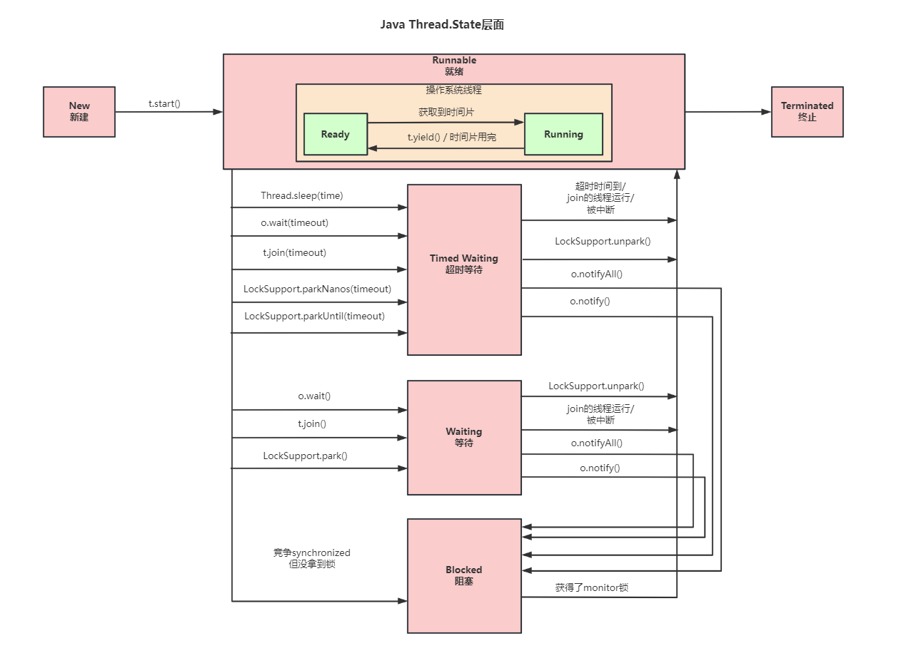

`Java` 线程进入终止状态的前提是线程进入 `RUNNABLE` 状态，而实际上线程也可能处在休眠状态，也就是说，我们要想终止一个线程，首先要把线程的状态从休眠状态转换到 `RUNNABLE` 状态。**利用java线程中断机制的`interrupt()` 方法，可以让线程从休眠状态转换到`RUNNABLE` 状态。**

- 思考：第二阶段，线程转换到 `RUNNABLE` 状态之后，我们如何再将其终止呢？

`RUNNABLE` 状态转换到终止状态，优雅的方式是让 Java 线程自己执行完 `run()`方法，所以一般我们采用的方法是**设置一个标志位，然后线程会在合适的时机检查这个标志位，如果发现符合终止条件，则自动退出 `run()` 方法**。

综合上面这两点，我们能总结出终止指令，其实包括两方面内容：**interrupt() 方法和线程终止的标志位。**

两阶段终止模式可以带来多种好处，例如：

1. 优雅终止：两阶段终止模式可以优雅地终止线程，避免突然终止线程带来的副作用。
2. 安全性：两阶段终止模式可以在线程终止前执行必要的清理工作，以确保程序的安全性和稳定性。
3. 灵活性：两阶段终止模式可以根据具体情况灵活地设置终止条件和清理工作。

#### 使用场景

两阶段终止模式适用于需要优雅终止线程的场景，例如：

1. 服务器应用程序：在服务器应用程序中，需要处理大量的请求和数据，并且需要在终止时正确地保存和释放资源，以避免数据丢失和资源泄漏。
2. 大规模并发系统：在大规模并发系统中，线程数量可能非常多，并且需要在终止时正确地关闭和释放所有的线程和资源。
3. 定时任务系统：在定时任务系统中，需要在任务执行完毕后正确地终止任务线程，并清理相关资源。
4. 数据处理系统：在数据处理系统中，需要在处理完所有数据后正确地终止线程，并清理相关资源。
5. 消息订阅系统：在消息订阅系统中，需要在订阅结束后正确地终止订阅线程，并清理相关资源。

总之，两阶段终止模式适用于需要优雅终止线程的各种场景，可以提高程序的可靠性和可维护性。在应用该模式时，需要注意正确设计终止条件和清理工作，以避免出现线程安全问题和资源泄漏问题。

#### 终止监控操作

在多线程程序中，如果有一些线程**需要执行长时间的监控或者轮询操作**，可以使用两阶段终止模式来终止这些线程的执行。使用两阶段终止模式可以保证监控线程在执行终止操作时能够安全地释放资源和退出线程。同时，该模式还可以保证监控线程在终止前能够完成必要的清理工作，从而避免资源泄露和其他问题。

```java
public class MonitorThread extends Thread {
    //在监控线程中添加一个volatile类型的标志变量，用于标识是否需要终止线程的执行
    private volatile boolean terminated = false;

    public void run() {
        while (!terminated) {
            // 执行监控操作
            System.out.println("监控线程正在执行监控操作...");
            try {
                Thread.sleep(1000);
            } catch (InterruptedException e) {
                e.printStackTrace();
            }
        }
        // 执行清理操作
        System.out.println("监控线程正在执行清理操作...");
        releaseResources();
    }

    public void terminate() {
        //设置标志变量为true，并等待一段时间
        terminated = true;
        try {
            join(5000); // 等待5秒钟,期间监控线程会检查terminated的状态
        } catch (InterruptedException e) {
            e.printStackTrace();
        }
    }

    private void releaseResources() {
        // 释放资源和进行必要的清理工作
        System.out.println("监控线程正在释放资源和进行必要的清理工作...");
    }

    public static void main(String[] args) throws InterruptedException {
        MonitorThread thread = new MonitorThread();
        //启动监控线程
        thread.start();
        //主线程休眠期间，监控线程在执行监控操作
        Thread.sleep(10000);
        //终止监控线程
        thread.terminate();
        Thread.sleep(100000);
    }
}
```

在使用两阶段终止模式终止线程的同时，还可以结合中断机制实现更加可靠和灵活的线程终止操作。使用中断机制可以让线程在终止前及时响应中断请求，并退出线程的阻塞状态。同时，还可以通过检查中断状态和标志变量的状态来判断是否需要终止线程的执行，从而实现更加可靠和灵活的线程终止操作。

```java
public class MonitorThread2 extends Thread {
    //在监控线程中添加一个volatile类型的标志变量，用于标识是否需要终止线程的执行
    private volatile boolean terminated = false;

    public void run() {
        while (!Thread.interrupted()&&!terminated) {
            // 执行监控操作
            System.out.println("监控线程正在执行监控操作...");
            try {
                Thread.sleep(1000);
            } catch (InterruptedException e) {
                System.out.println("监控线程被中断，准备退出...");
                Thread.currentThread().interrupt();
                e.printStackTrace();
            }
        }
        // 执行清理操作
        System.out.println("监控线程正在执行清理操作...");
        releaseResources();
    }

    public void terminate() {
        //设置标志变量为true，并等待一段时间
        terminated = true;
        try {
            join(5000); // 等待5秒钟,期间监控线程会检查terminated的状态
        } catch (InterruptedException e) {
            e.printStackTrace();
        }
    }

    private void releaseResources() {
        // 释放资源和进行必要的清理工作
        System.out.println("监控线程正在释放资源和进行必要的清理工作...");
    }

    public static void main(String[] args) throws InterruptedException {
        MonitorThread2 thread = new MonitorThread2();
        //启动监控线程
        thread.start();
        //主线程休眠期间，监控线程在执行监控操作
        Thread.sleep(10000);
        //为监控线程设置中断标志位
        thread.interrupt();
        //终止监控线程
        //thread.terminate();
        Thread.sleep(100000);
    }
}
```

#### 终止线程池

线程池提供了两个终止线程池的方法：

- **`shutdown()`方法会停止线程池接受新的任务，并等待线程池中的所有任务执行完毕，然后关闭线程池**。在调用`shutdown()`方法后，线程池不再接受新的任务，但是会将任务队列中的任务继续执行直到队列为空。如果线程池中的任务正在执行，但是还没有执行完毕，线程池会等待所有任务执行完毕后再关闭线程池。
- **`shutdownNow()`方法会停止线程池接受新的任务，并尝试中断正在执行任务的线程，然后关闭线程池**。在调用`shutdownNow()`方法后，线程池不再接受新的任务，**同时会中断正在执行任务的线程并返回一个未执行的任务列表**。该方法会调用每个任务的`interrupt()`方法尝试中断任务执行的线程，但是并不能保证线程一定会被中断，因为线程可以选择忽略中断请求。

```java
public class ThreadPoolDemo {
    public static void main(String[] args) throws InterruptedException {
        ExecutorService executorService = Executors.newFixedThreadPool(5);
        for (int i = 0; i < 10; i++) {
            executorService.submit(() -> {
                try {
                    // 执行任务操作
                    System.out.println(Thread.currentThread().getName() + "正在执行任务...");
                    Thread.sleep(5000);
                } catch (InterruptedException e) {
                    // 重新设置中断状态
                    Thread.currentThread().interrupt();
                    e.printStackTrace();
                } finally {
                    System.out.println(Thread.currentThread().getName() + "任务执行完毕");
                }
            });
        }
        // 停止线程池接受新的任务，但不能强制停止已经提交的任务
        executorService.shutdown();
        // 等待线程池中的任务执行完毕，或者超时时间到达
        boolean terminated = executorService.awaitTermination(8, TimeUnit.SECONDS);
        if (!terminated) {
            // 如果线程池中还有未执行完毕的任务，则调用线程池的shutdownNow方法，中断所有正在执行任务的线程
            // 如果有还没开始执行的任务，则返回未执行的任务列表
            List<Runnable> tasks = executorService.shutdownNow();
            System.out.println("剩余未执行的任务数：" + tasks.size());
        }
    }
}

// 运行该程序，可以看到线程池会依次执行10个任务，然后优雅地终止线程池的执行，中断所有正在执行的任务。
```

#### 注意事项

两阶段终止模式是一种应用很广泛的并发设计模式，在 Java 语言中使用两阶段终止模式来优雅地终止线程，需要注意两个关键点：

- **仅检查终止标志位是不够的**，因为线程的状态可能处于休眠态；
- **仅检查线程的中断状态也是不够的**，因为我们依赖的第三方类库很可能没有正确处理中断异常，例如第三方类库在捕获到 `Thread.sleep()` 方法抛出的中断异常后，没有重新设置线程的中断状态，那么就会导致线程不能够正常终止。所以我们可以自定义线程的终止标志位用于终止线程。

当你使用 `Java` 的线程池来管理线程的时候，需要依赖线程池提供的 `shutdown()` 和 `shutdownNow()` 方法来终止线程池。不过在使用时需要注意它们的应用场景，尤其是在使用 `shutdownNow()` 的时候，一定要谨慎。

### 不变性模式

**“多个线程同时读写同一共享变量存在并发问题”**，这里的必要条件之一是读写，如果只有读，而没有写，是没有并发问题的。解决并发问题，其实最简单的办法就是让共享变量只有读操作，而没有写操作。这个办法如此重要，以至于被上升到了一种解决并发问题的设计模式：**不变性（`Immutability`）模式**。

**不变性模式是一种创建不可变对象的设计模式**，即对象一旦创建后，就不能再进行修改。**在多线程环境下，使用不可变对象可以避免线程安全问题，并提高程序的性能和可读性。**

使用不变性模式可以带来多种好处，例如：

1. 线程安全性：不可变对象在多线程环境下不需要进行同步操作，可以避免线程安全问题。
2. 可读性：不可变对象的状态在创建后不可修改，可以更加清晰地表达对象的含义和作用。
3. 性能：由于不可变对象的状态不可变，可以进行更加有效的缓存和优化操作。
4. 可测试性：不可变对象对单元测试非常友好，可以更容易地进行测试和验证。

不变性模式虽然有很多优点，但也有一些限制。例如，不可变对象的状态一旦创建后就无法修改，需要重新创建一个新的对象。因此，在需要频繁修改对象状态的场景下，不可变对象可能不太适用。同时，在不可变对象之间存在引用关系的情况下，需要注意对象状态的变化。

#### 使用场景

不变性模式适用于需要确保对象状态不变的场景，例如：

1. 缓存：在缓存系统中，需要缓存一些数据，以避免重复计算和频繁访问。由于缓存数据是共享的，为了避免数据被修改，通常使用不变性模式来确保缓存数据的不变性。
2. 值对象：在一些系统中，需要定义一些值对象来表示一些常量或者不可变的对象。使用不变性模式可以确保这些值对象的状态不变，从而避免出现错误和不一致。
3. 配置信息：在一些系统中，需要读取一些配置信息来配置系统参数和行为。由于配置信息通常是不变的，可以使用不变性模式来确保配置信息的不变性。

#### 实现不变性模式

不变性模式的主要思想是通过**将对象的状态设置为`final`和私有，并提供只读方法来保证对象的不可变性。**在创建不可变对象时，需要确保对象的所有属性都是不可变的，即在创建后不会被修改。同时，还需要注意不可变对象之间的引用关系，以避免出现对象的状态变化。

`jdk`中很多类都具备不可变性，例如经常用到的 `String、Long、Integer、Double`等基础类型的包装类都具备不可变性，这些对象的线程安全性都是靠不可变性来保证的。它们都严格遵守了不可变类的三点要求：类和属性都是 `final` 的，所有方法均是只读的。

#### 注意事项

在使用 `Immutability` 模式的时候，需要注意以下两点：

- 对象的所有属性都是 `final` 的，并不能保证不可变性；
- 不可变对象也需要正确发布。

在 Java 语言中，`final` 修饰的属性一旦被赋值，就不可以再修改，但是如果属性的类型是普通对象，那么这个普通对象的属性是可以被修改的。所以，**在使用 `Immutability` 模式的时候一定要确认保持不变性的边界在哪里，是否要求属性对象也具备不可变性。**

下面的代码中，`Bar` 的属性 `foo` 虽然是 `final` 的，依然可以通过 `setAge()` 方法来设置 `foo` 的属性 `age`。

```java
class Foo{
  int age=0;
  int name="abc";
}
final class Bar {
  final Foo foo;
  void setAge(int a){
    foo.age=a;
  }
}
```

**可变对象虽然是线程安全的，但是并不意味着引用这些不可变对象的对象就是线程安全的。**

下面的代码中，`Foo` 具备不可变性，线程安全，但是类 `Bar` 并不是线程安全的，类 `Bar` 中持有对 `Foo` 的引用 `foo`，对 `foo` 这个引用的修改在多线程中并不能保证可见性和原子性。

```java
//Foo线程安全
final class Foo{
  final int age=0;
  final String name="abc";
}
//Bar线程不安全
class Bar {
  Foo foo;
  void setFoo(Foo f){
    this.foo=f;
  }
}
```

### 写时复制模式

在多线程环境下，`Copy-on-Write`模式可以提高共享数据的并发性能。该模式的基本思想是**在共享数据被修改时，先将数据复制一份，然后对副本进行修改，最后再将副本替换为原始的共享数据。**通过这种方式，可以避免多个线程同时访问同一个共享数据造成的竞争和冲突。

**不可变对象的写操作往往都是使用 `Copy-on-Write` 方法解决的，**当然 `Copy-on-Write` 的应用领域并不局限于 `Immutability` 模式。

`Copy-on-Write` 才是最简单的并发解决方案，很多人都在无意中把它忽视了。它是如此简单，以至于 Java 中的基本数据类型 `String、Integer、Long` 等都是基于 `Copy-on-Write` 方案实现的。

`Copy-on-Write` 缺点就是消耗内存，每次修改都需要复制一个新的对象出来，好在随着自动垃圾回收（`GC`）算法的成熟以及硬件的发展，这种内存消耗已经渐渐可以接受了。所以在实际工作中，如果写操作非常少（读多写少的场景），可以尝试使用 `Copy-on-Write`。

#### 使用场景

在Java中，**`CopyOnWriteArrayList`** 和 **`CopyOnWriteArraySet`** 这两个 `Copy-on-Write` 容器，它们背后的设计思想就是 `Copy-on-Write`；**通过 `Copy-on-Write` 这两个容器实现的读操作是无锁的，由于无锁，所以将读操作的性能发挥到了极致。**

`Copy-on-Write` 在操作系统领域也有广泛的应用。类 Unix 的操作系统中创建进程的 API 是 `fork()`，传统的 `fork()` 函数会创建父进程的一个完整副本，例如父进程的地址空间现在用到了 1G 的内存，那么 `fork()` 子进程的时候要复制父进程整个进程的地址空间（占有 1G 内存）给子进程，这个过程是很耗时的。而**Linux 中`fork()` 子进程的时候，并不复制整个进程的地址空间，而是让父子进程共享同一个地址空间；只用在父进程或者子进程需要写入的时候才会复制地址空间，从而使父子进程拥有各自的地址空间。**

`Copy-on-Write` 最大的应用领域还是在函数式编程领域。函数式编程的基础是不可变性（`Immutability`），所以函数式编程里面所有的修改操作都需要 `Copy-on-Write` 来解决。

像一些RPC框架还有服务注册中心，也会**利用`Copy-on-Write`设计思想维护服务路由表。路由表是典型的读多写少，而且路由表对数据的一致性要求并不高，**一个服务提供方从上线到反馈到客户端的路由表里，即便有 5 秒钟延迟，很多时候也都是能接受的。

### 线程本地存储

线程本地存储模式用于解决多线程环境下的数据共享和数据隔离问题。该模式的基本思想是为每个线程创建独立的存储空间，用于存储线程私有的数据。通过这种方式，可以保证线程之间的数据隔离和互不干扰。在 Java 标准类库中，**`ThreadLocal` 类实现了该模式。**

线程本地存储模式本质上是一种避免共享的方案，由于没有共享，所以自然也就没有并发问题。**如果你需要在并发场景中使用一个线程不安全的工具类，最简单的方案就是避免共享。避免共享有两种方案，一种方案是将这个工具类作为局部变量使用，另外一种方案就是线程本地存储模式。**这两种方案，局部变量方案的缺点是在高并发场景下会频繁创建对象，而线程本地存储方案，每个线程只需要创建一个工具类的实例，所以不存在频繁创建对象的问题。

#### 使用场景

线程本地存储模式通常用于以下场景：

1. **保存上下文信息**：在多线程环境中，每个线程都有自己的执行上下文，包括线程的状态、环境变量、运行时状态等。线程本地存储可以用来保存这些上下文信息，使得每个线程都可以独立地访问和修改自己的上下文信息。
2. **管理线程安全对象**：在多线程环境中，共享对象通常需要进行同步操作以避免竞争条件。但是，有些对象是线程安全的，可以被多个线程同时访问而不需要同步操作。线程本地存储可以用来管理这些线程安全对象，使得每个线程都可以独立地访问自己的对象实例，而不需要进行同步操作。
3. **实现线程特定的行为**：有些应用程序需要在每个线程中执行特定的行为，例如跟踪日志、统计数据、授权访问等。线程本地存储可以用来实现这些线程特定的行为，使得每个线程都可以独立地执行自己的行为逻辑，而不需要与其他线程进行协调。

需要注意的是，线程本地存储虽然可以提高性能，但也可能会导致内存泄漏和数据一致性问题。因此，在使用线程本地存储时，需要仔细考虑数据的生命周期和线程的使用情况，避免出现潜在的问题。

> 注意：在线程池中使用`ThreadLocal` 需要避免内存泄漏和线程安全的问题

```java
ExecutorService es;
ThreadLocal tl;
es.execute(()->{
  //ThreadLocal增加变量
  tl.set(obj);
  try {
    // 省略业务逻辑代码
  }finally {
    //手动清理ThreadLocal 
    tl.remove();
  }
});
```

### Thread-Per-Message 模式

`Thread-Per-Message` 模式就是**为每个任务分配一个独立的线程**，这是一种最简单的分工方法。

**应用场景**

`Thread-Per-Message` 模式的一个最经典的应用场景是**网络编程里服务端的实现**，服务端为每个客户端请求创建一个独立的线程，当线程处理完请求后，自动销毁，这是一种最简单的并发处理网络请求的方法。

```java
final ServerSocketChannel ssc = ServerSocketChannel.open().bind(new InetSocketAddress(8080));
//处理请求
try {
  while (true) {
    // 接收请求
    SocketChannel sc = ssc.accept();
    // 每个请求都创建一个线程
    new Thread(()->{
      try {
        // 读Socket
        ByteBuffer rb = ByteBuffer.allocateDirect(1024);
        sc.read(rb);
        //模拟处理请求
        Thread.sleep(2000);
        // 写Socket
        ByteBuffer wb = (ByteBuffer)rb.flip();
        sc.write(wb);
        // 关闭Socket
        sc.close();
      }catch(Exception e){
        throw new UncheckedIOException(e);
      }
    }).start();
  }
} finally {
  ssc.close();
}
```

`Thread-Per-Message` 模式作为一种最简单的分工方案，**使用中会存在性能缺陷**。在 Java 中的线程是一个重量级的对象，创建成本很高，一方面创建线程比较耗时，另一方面线程占用的内存也比较大。所以为每个请求创建一个新的线程并不适合高并发场景。为了解决这个缺点，**Java 并发包里提供了线程池等工具类**。

在其他编程语言里，例如 Go 语言，**基于轻量级线程实现 `Thread-Per-Message` 模式**就完全没有问题。

对于一些并发度没那么高的异步场景，例如定时任务，采用 `Thread-Per-Message` 模式是完全没有问题的。

### Worker Thread模式

**要想有效避免线程的频繁创建、销毁以及 `OOM` 问题，就不得不提 Java 领域使用最多的 `Worker Thread` 模式**。`Worker Thread` 模式可以类比现实世界里车间的工作模式：车间里的工人，有活儿了，大家一起干，没活儿了就聊聊天等着。`Worker Thread` 模式中 `Worker Thread` 对应到现实世界里，其实指的就是车间里的工人。

**`Worker Thread` 模式实现**之前的服务端例子用线程池实现

```java
ExecutorService es = Executors.newFixedThreadPool(200);
final ServerSocketChannel ssc = ServerSocketChannel.open().bind(new InetSocketAddress(8080));
//处理请求    
try {
  while (true) {
    // 接收请求
    SocketChannel sc = ssc.accept();
    // 将请求处理任务提交给线程池
    es.execute(()->{
      try {
        // 读Socket
        ByteBuffer rb = ByteBuffer.allocateDirect(1024);
        sc.read(rb);
        //模拟处理请求
        Thread.sleep(2000);
        // 写Socket
        ByteBuffer wb = 
          (ByteBuffer)rb.flip();
        sc.write(wb);
        // 关闭Socket
        sc.close();
      }catch(Exception e){
        throw new UncheckedIOException(e);
      }
    });
  }
} finally {
  ssc.close();
  es.shutdown();
}   
```

**应用场景**

`Worker Thread` 模式能避免线程频繁创建、销毁的问题，而且能够限制线程的最大数量。Java 语言里可以**直接使用线程池来实现 `Worker Thread` 模式**，线程池是一个非常基础和优秀的工具类，甚至有些大厂的编码规范都不允许用 `new Thread()` 来创建线程，必须使用线程池。

###  生产者 - 消费者模式

`Worker Thread` 模式类比的是工厂里车间工人的工作模式。但其实在现实世界，工厂里还有一种流水线的工作模式，类比到编程领域，就是生产者 - 消费者模式。

**生产者 - 消费者模式的核心是一个任务队列**，生产者线程生产任务，并将任务添加到任务队列中，而消费者线程从任务队列中获取任务并执行。

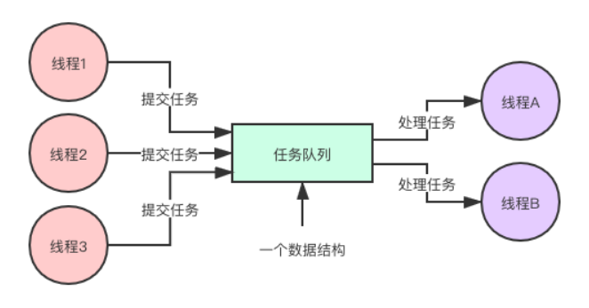

```java
public class BlockingQueueExample {

    private static final int QUEUE_CAPACITY = 5;
    private static final int PRODUCER_DELAY_MS = 1000;
    private static final int CONSUMER_DELAY_MS = 2000;

    public static void main(String[] args) throws InterruptedException {
        // 创建一个容量为QUEUE_CAPACITY的阻塞队列
        BlockingQueue<String> queue = new ArrayBlockingQueue<>(QUEUE_CAPACITY);

        // 创建一个生产者线程
        Runnable producer = () -> {
            while (true) {
                try {
                    // 在队列满时阻塞
                    queue.put("producer");

                    System.out.println("生产了一个元素，队列中元素个数：" + queue.size());
                    Thread.sleep(PRODUCER_DELAY_MS);
                } catch (InterruptedException e) {
                    e.printStackTrace();
                }
            }
        };
        new Thread(producer).start();
        // 创建一个消费者线程
        Runnable consumer = () -> {
            while (true) {
                try {
                    // 在队列为空时阻塞
                    String element = queue.take();
                    System.out.println("消费了一个元素，队列中元素个数：" + queue.size());
                    Thread.sleep(CONSUMER_DELAY_MS);
                } catch (InterruptedException e) {
                    e.printStackTrace();
                }
            }
        };
        new Thread(consumer).start();
    }
}
```

#### 优点

**支持异步处理**

场景：用户注册后，需要发注册邮件和注册短信。传统的做法有两种 1.串行的方式；2.并行方式

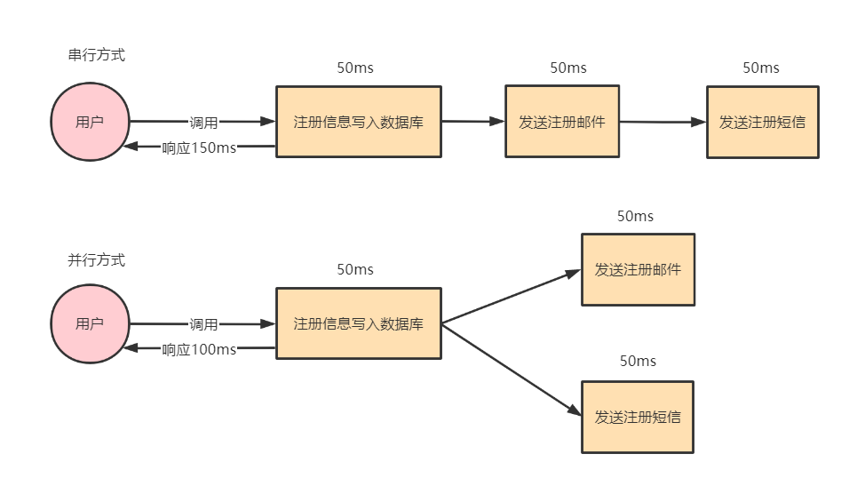

引入消息队列，将不是必须的业务逻辑异步处理

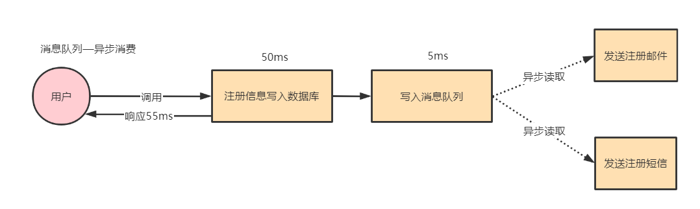

**解耦**

场景：用户下单后，订单系统需要通知库存系统扣减库存。

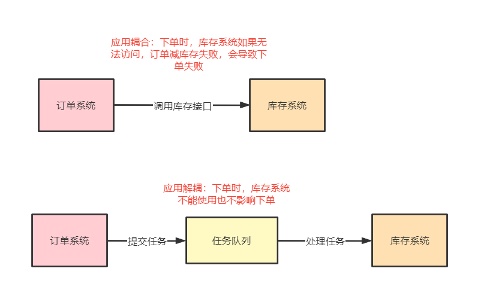

**可以消除生产者生产与消费者消费之间速度差异**

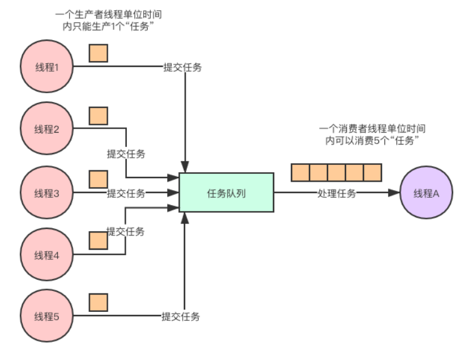

在计算机当中，创建的线程越多，CPU进行上下文切换的成本就越大，所以我们在编程的时候创建的线程并不是越多越好，而是适量即可，采用生产者和消费者模式就可以很好的支持我们使用适量的线程来完成任务。

如果在某一段业务高峰期的时间里生产者“生产”任务的速率很快，而消费者“消费”任务速率很慢，由于中间的任务队列的存在，也可以起到缓冲的作用，我们在使用`MQ`中间件的时候，经常说的**削峰填谷**也就是这个意思。

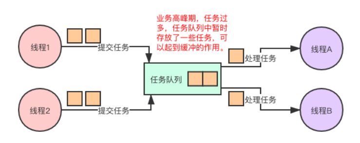

#### 过饱问题解决方案

在实际生产项目中会有些极端的情况，导致生产者/消费者模式可能出现过饱的问题。**单位时间内，生产者生产的速度大于消费者消费的速度，导致任务不断堆积到阻塞队列中，队列堆满只是时间问题。**

思考：是不是只要保证消费者的消费速度一直比生产者生产速度快就可以解决过饱问题？

**我们只要在业务可以容忍的最长响应时间内，把堆积的任务处理完，那就不算过饱。**

> 什么是**业务容忍的最长响应时间**？
>
> 比如埋点数据统计前一天的数据生成报表，第二天老板要看的，你前一天的数据第二天还没处理完，那就不行，这样的系统我们就要保证，消费者在24小时内的消费能力要比生产者高才行。

- **场景一：消费者每天能处理的量比生产者生产的少；如生产者每天1万条，消费者每天只能消费5千条。**

**解决办法：消费者加机器**

原因：生产者没法限流，因为要一天内处理完，只能消费者加机器

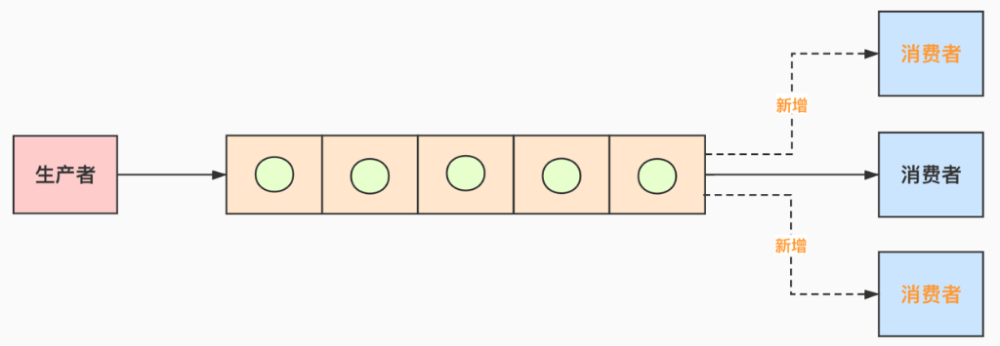

- **场景二：消费者每天能处理的量比生产者生产的多。系统高峰期生产者速度太快，把队列塞爆了**

**解决办法：适当的加大队列**

原因：消费者一天的消费能力已经高于生产者，那说明一天之内肯定能处理完，保证高峰期别把队列塞满就好

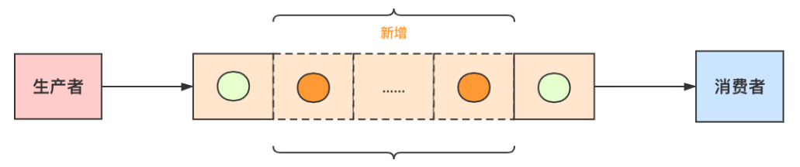

场景三：消费者每天能处理的量比生产者生产的多。条件有限或其他原因，**队列没法设置特别大**。系统高峰期生产者速度太快，把队列塞爆了

**解决办法：生产者限流**

原因：消费者一天的消费能力高于生产者，说明一天内能处理完，队列又太小，那只能限流生产者，让高峰期塞队列的速度慢点

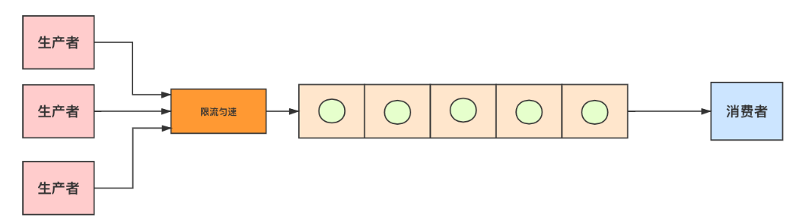
