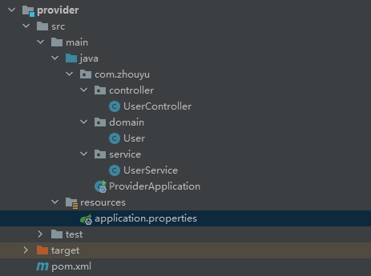
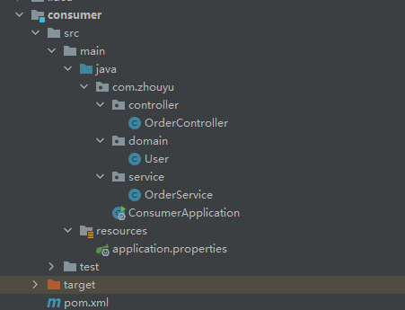
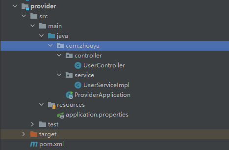
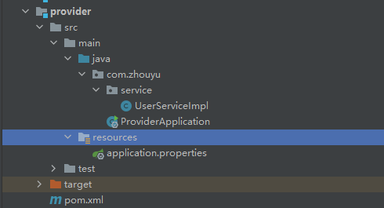
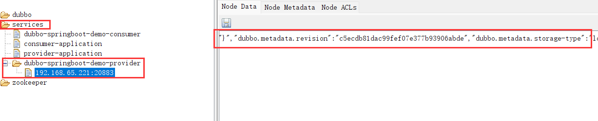
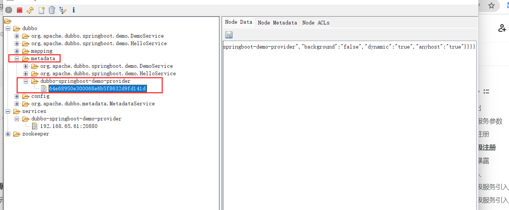
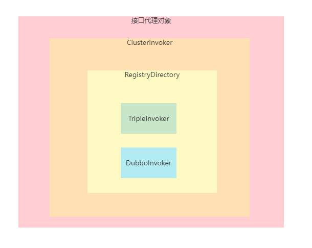
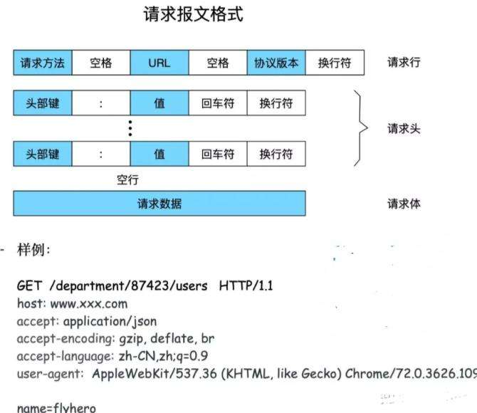
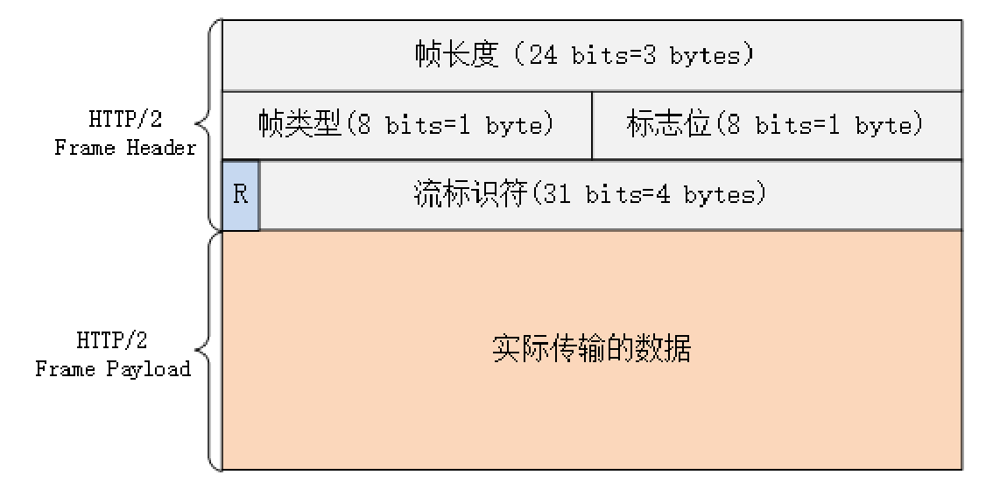

# Dubbo3.0

- [手写Dubbo地址](https://gitee.com/archguide/rpc-zhouyu)

- [Dubbo3.0源码](https://gitee.com/archguide/dubbo-dubbo-3.0.7)

- [服务导出和引入整体流程](https://www.processon.com/view/link/62c441e80791293dccaebded)

## Dubbo简介

### RPC

在分布式计算，**远程过程调用**（`Remote Procedure Call`）是一个计算机通信协议。该协议允许运行于一台计算机的程序调用另一个地址空间（通常为一个开放网络的一台计算机）的子程序，而程序员就像调用本地程序一样，无需额外地为这个交互作用编程（无需关注细节）。`RPC`是一种服务器-客户端（`Client/Server`）模式，经典实现是一个通过**发送请求-接受回应**进行信息交互的系统。

如果涉及的软件采用[面向对象编程](https://zh.wikipedia.org/wiki/面向对象编程)，那么远程过程调用亦可称作**远程调用**或**远程方法调用**，例：[Java RMI](https://zh.wikipedia.org/wiki/Java_RMI)，所以，对于Java程序员而言，RPC就是**远程方法调用**。

**远程方法调用**和**本地方法调用**是相对的两个概念，本地方法调用指的是进程内部的方法调用，而远程方法调用指的是两个进程内的方法相互调用。

如果实现远程方法调用，基本的就是通过网络，通过传输数据来进行调用。所以就有了：

1. `RPC over Http`：基于`Http`协议来传输数据
2. `PRC over Tcp`：基于`Tcp`协议来传输数据

对于所传输的数据，可以交由`RPC`的双方来协商定义，但基本都会包括：

1. 调用的是哪个类或接口
2. 调用的是哪个方法，方法名和方法参数类型（考虑方法重载）
3. 调用方法的入参

所以，可以看到`RPC`的自定义性是很高的，各个公司内部都可以实现自己的一套`RPC`框架，而**Dubbo**就是阿里所开源出来的一套`RPC`框架。

### Dubbo

[官网地址](http://dubbo.apache.org/zh/)，**Apache Dubbo 是一款微服务框架，为大规模微服务实践提供高性能 RPC 通信、流量治理、可观测性等解决方案，涵盖 Java、Golang 等多种语言 SDK 实现**

`Dubbo`一开始的定位就是`RPC`，专注于两个服务之间的调用。但随着微服务的盛行，除开**服务调用**之外，`Dubbo`也在逐步的涉猎服务治理、服务监控、服务网关等等，所以现在的`Dubbo`目标已经不止是`RPC`框架了，而是和`Spring Cloud`类似想成为了一个**服务**框架。

## Dubbo3.0使用

- [Dubbo3.0 Demo](https://gitee.com/archguide/dubbo3-demo)

- [grpc Demo](https://gitee.com/archguide/grpc-demo)

- [springcloud Demo](https://gitee.com/archguide/spring-cloud-demo)

- [spring-cloud-alibaba-dubbo-examples](https://gitee.com/archguide/spring-cloud-alibaba-dubbo-examples.git)

### 改造`SpringBoot`项目为`Dubbo`应用

首先，新建两个`SpringBoot`项目，分别为`consumer, provider`

#### provider项目

**项目结构**



**`pom`文件**

```xml
<dependencies>
    <dependency>
        <groupId>org.springframework.boot</groupId>
        <artifactId>spring-boot-starter-web</artifactId>
        <version>2.6.6</version>
    </dependency>

    <dependency>
        <groupId>org.projectlombok</groupId>
        <artifactId>lombok</artifactId>
        <version>1.18.22</version>
    </dependency>
</dependencies>
```

**`application.properties`**

```properties
server.port=8082
```

**`ProviderApplication`**

```java
@SpringBootApplication
public class ProviderApplication {

    public static void main(String[] args) {
        SpringApplication.run(ProviderApplication.class);
    }
}
```

**`User`**

```java
@Data
@NoArgsConstructor
@AllArgsConstructor
public class User {
    private String uid;
    private String username;
}
```

**`UserService`**

```java
@Service
public class UserService {

    public User getUser(String uid) {
        User zhouyu = new User(uid, "zhouyu");
        return zhouyu;
    }
}
```

**`UserController`**

```java
@RestController
public class UserController {

    @Resource
    private UserService userService;

    @GetMapping("/user/{uid}")
    public User getUser(@PathVariable("uid") String uid) {
        return userService.getUser(uid);
    }
}
```

#### consumer项目

**项目结构**



**`pom`文件**

```xml
<dependencies>
    <dependency>
        <groupId>org.springframework.boot</groupId>
        <artifactId>spring-boot-starter-web</artifactId>
        <version>2.6.6</version>
    </dependency>

    <dependency>
        <groupId>org.projectlombok</groupId>
        <artifactId>lombok</artifactId>
        <version>1.18.22</version>
    </dependency>
</dependencies>
```

**`application.properties`**

```properties
server.port=8081
```

**`ConsumerApplication`**

```java
@SpringBootApplication
public class ConsumerApplication {

    @Bean
    public RestTemplate restTemplate(){
        return new RestTemplate();
    }

    public static void main(String[] args) {
        SpringApplication.run(ConsumerApplication.class);
    }
}
```

**`User`**

```java
@Data
@NoArgsConstructor
@AllArgsConstructor
public class User {
    private String uid;
    private String username;
}
```

**`OrderService`**

```java
@Service
public class OrderService {

    @Resource
    private RestTemplate restTemplate;

    public String createOrder(){
        User user = restTemplate.getForObject("http://localhost:8082/user/1", User.class);
        System.out.println("创建订单");

        return user.toString()+" succeeded in creating the order";
    }
}
```

**`OrderController`**

```java
@RestController
public class OrderController {

    @Resource
    private OrderService orderService;

    @GetMapping("/createOrder")
    public String createOrder() {
        return orderService.createOrder();
    }
}
```

> `consumer`中的`OrderService`会通过`RestTemplate`调用`provider`中的`UserService`。

#### 改造为`Dubbo`

改造成`Dubbo`项目的步骤：

1. 添加`dubbo`核心依赖
2. 添加要使用的注册中心依赖
3. 添加要使用的协议的依赖
4. 配置`dubbo`相关的基本信息
5. 配置注册中心地址
6. 配置所使用的协议

**增加依赖，并且可以不使用`spring-boot-starter-web`了，只需要使用`spring-boot-starter`即可。**

```xml
<dependency>
    <groupId>org.apache.dubbo</groupId>
    <artifactId>dubbo-spring-boot-starter</artifactId>
    <version>3.0.7</version>
</dependency>

<dependency>
    <groupId>org.apache.dubbo</groupId>
    <artifactId>dubbo-rpc-dubbo</artifactId>
    <version>3.0.7</version>
</dependency>

<dependency>
    <groupId>org.apache.dubbo</groupId>
    <artifactId>dubbo-registry-zookeeper</artifactId>
    <version>3.0.7</version>
</dependency>
```

**配置`properties`**

```properties
dubbo.application.name=provider-application
dubbo.protocol.name=dubbo
dubbo.protocol.port=20880
dubbo.registry.address=zookeeper://127.0.0.1:2181
```

**改造服务**

`consumer`和`provider`中都用到了`User`类，所以可以单独新建一个`maven`项目用来存`consumer`和`provider`公用的一些类，新增一个`common`模块，把`User`类转移到这个模块中。

要改造成`Dubbo`，得先抽象出来服务，用接口表示。

像`UserService`就是一个服务，不过我们得额外定义一个接口，我们把之前的`UserService`改为`UserServiceImpl`，然后新定义一个接口`UserService`，该接口表示一个服务，`UserServiceImpl`为该服务的具体实现。

```java
public interface UserService {
    public User getUser(String uid);
}
```

**要把`Spring`中的`@Service`注解替换成`Dubbo`中的`@DubboService`注解。**

```java
@DubboService
public class UserServiceImpl implements UserService {

    public User getUser(String uid) {
        User zhouyu = new User(uid, "zhouyu");
        return zhouyu;
    }
}
```

然后把`UserService`接口也转移到`common`模块中去，在`provider`中依赖`common`。

改造之后的`provider`为：



其实`UserController`也可以去掉，去掉之后`provider`就更加简单了



此时就可以启动该`Provider`了，注意先启动`zookeeper`（**高版本的`Zookeeper`启动过程中不仅会占用2181，也会占用8080，所以可以把`provider`的端口改为8082**）

**开启Dubbo**

在`ProviderApplication`上加上**`@EnableDubbo(scanBasePackages = "com.zhouyu.service")`**，表示`Dubbo`会去扫描某个路径下的`@DubboService`，从而对外提供该`Dubbo`服务。

```java
@SpringBootApplication
@EnableDubbo(scanBasePackages = "com.zhouyu.service")
public class ProviderApplication {

    public static void main(String[] args) {
        SpringApplication.run(ProviderApplication.class);
    }
}
```

**兼容**

前面我们仅仅是把`provider`应用改造成了`Dubbo`，但是在开发过程中，很有可能有其他多个应用在调用`provider`应用，对于`provider`应用要做到，既要能支持`dubbo`协议调用，也要能支持`http`调用（和`controller`效果一样），所以，要么仍然保留`SpringMVC`那一套，如果不想保留那一套，就可以开启`dubbo`中的`rest`协议，比如：

```properties
dubbo.application.name=provider-application
dubbo.protocols.p1.name=dubbo
dubbo.protocols.p1.port=20880
dubbo.protocols.p2.name=rest
dubbo.protocols.p2.port=8082
dubbo.registry.address=zookeeper://127.0.0.1:2181
```

并且添加`rest`的依赖：

```xml
<dependency>
    <groupId>org.apache.dubbo</groupId>
    <artifactId>dubbo-rpc-rest</artifactId>
    <version>3.0.7</version>
</dependency>
```

然后改造`UserServiceImpl`：

```java
@DubboService
@Path("/user")
@Produces
public class UserServiceImpl implements UserService{

    @Override
    @GET
    @Path("/{uid}")
    @Produces(MediaType.APPLICATION_JSON)
    public User getUser(@PathParam("uid")  String uid) {
        User zhouyu = new User(uid, "zhouyu");
        return zhouyu;
    }
}
```

这样只要启动`provider`应用，`consumer`虽然还没有改造为`dubbo`，但是照样可以用`restTemplate`调用`provider`中的`getUser()`方法。

#### 调用`Dubbo`服务

**引入依赖**

在`consumer`中如果想要调用`Dubbo`服务，也要引入相关的依赖：

1. 引入`common`，主要是引入要用调用的接口
2. 引入`dubbo`依赖
3. 引入需要使用的协议的依赖
4. 引入需要使用的注册中心的依赖

```xml
<dependency>
    <groupId>org.apache.dubbo</groupId>
    <artifactId>dubbo-spring-boot-starter</artifactId>
    <version>3.0.7</version>
</dependency>

<dependency>
    <groupId>org.apache.dubbo</groupId>
    <artifactId>dubbo-rpc-dubbo</artifactId>
    <version>3.0.7</version>
</dependency>

<dependency>
    <groupId>org.apache.dubbo</groupId>
    <artifactId>dubbo-registry-zookeeper</artifactId>
    <version>3.0.7</version>
</dependency>

<dependency>
    <groupId>com.zhouyu</groupId>
    <artifactId>common</artifactId>
    <version>1.0-SNAPSHOT</version>
</dependency>
```

**引入服务**

通过`@DubboReference`注解来引入一个`Dubbo`服务。这样就不需要用`RestTemplate`了。

```java
@Service
public class OrderService {

    @DubboReference
    private UserService userService;

    public String createOrder(){
        User user = userService.getUser("1");
        System.out.println("创建订单");
        return user.toString()+" succeeded in creating the order";
    }
}
```

**配置`properties`**

```properties
dubbo.application.name=consumer-application
dubbo.registry.address=zookeeper://127.0.0.1:2181
```

> 调用时如果`User`没有实现`Serializable`接口，则会报错。

#### 总结

自此，`Dubbo`的改造就完成了，总结一下：

1. 添加`pom`依赖
2. 配置`dubbo`应用名、协议、注册中心
3. 定义服务接口和实现类
4. 使用`@DubboService`来定义一个`Dubbo`服务
5. 使用`@DubboReference`来使用一个`Dubbo`服务
6. 使用`@EnableDubbo`开启`Dubbo`

### Dubbo3.0新特性

#### 注册模型的改变

在服务注册领域，市面上有两种模型，一种是**应用级注册**，一种是**接口级注册**，在`Spring Cloud`中，一个应用是一个微服务，而在`Dubbo2.7`中，一个接口是一个微服务。

- `Spring Cloud`在进行服务注册时，是把应用名以及应用所在服务器的IP地址和应用所绑定的端口注册到注册中心，相当于key是应用名，value是`ip+port`；
- 在`Dubbo2.7`中，是把接口名以及对应应用的IP地址和所绑定的端口注册到注册中心，相当于key是接口名，value是`ip+port`。

所以在`Dubbo2.7`中，一个应用如果提供了10个`Dubbo`服务，那么注册中心中就会存储10对k-v，而`Spring Cloud`就只会存一对k-v，所以以`Spring Cloud`为首的应用级注册是更加适合的。

因此`Dubbo3.0`中将注册模型也改为了应用级注册，提升效率节省资源的同时，通过统一注册模型，也为各个微服务框架的互通打下了基础。

#### Triple协议

服务消费者是通过发送一个`Invocation`对象来表示要调用的是哪个接口中的哪个方法，我们是直接把`Invocation`对象进行**JDK序列化得到字节流**然后发送出去，那如果现在不使用**JDK序列化**，比如JSON、Hessian等等。

此时服务消费者最好能在发送的请求中，能标记所使用的序列化方式，这个标记是不能放在`Invocation`对象中的，因为这个标记指的就是`Invocation`对象的序列化方法，服务端接收到字节流后，首先要能拿到**序列化标记**，看采用的是什么序列化方法，再解析反序列化。

如果我们通过`HTTP`协议（特指`HTTP1.x`），那实现起来就比较方便，把序列化标记放在请求头，`Invocation`对象序列化之后的结果放在请求体，服务端收到`HTTP`请求后，就先解析请求头得到序列化标记，再取请求体进行反序列化。

但是`Dubbo`觉得用`HTTP1.x`协议性能太低了，原因在于：

1. `HTTP1.x`协议中，多余无用的字符太多了，比如回车符、换行符，这每一个字符都会占用一个字节，这些字节占用了网络带宽，降低了网络IO的效率
2. `HTTP1.x`协议中，一条`Socket`连接，一次只能发送一个`HTTP`请求，因为如果连续发送两个`HTTP`请求，然后收到了一个响应，那怎么知道这个响应对应的是哪个请求呢，这样导致`Socket`连接的利用低，并发、吞吐量低。

所以有了`dubbo`协议，它就是为了解决上面两个问题，**协议**描述的就是一份数据长什么样子，HTTP协议也是一样，描述的就是一个HTTP请求长什么样子，以什么开始，到哪里结束。

比如HTTP协议就描述了，从第一个字节开始，遇到第一个空格符时，那就是表示前面每个字节对应的字符组合成的字符串就表示请求方法（字符编码为`ascii`，一个字符对应一个字节），紧接着继续解析字节，将会按`HTTP`协议格式解析出请求行、请求头，解析完请求头之后，取出`content-length`对应的`value`，该`value`表示请求体的字节数，所以直接再获取`content-length`个字节，就表示获取到了请求体（`Invocation`对象序列化之后的字节），从而一个`HTTP`请求就获取出来，下一个字节就是另外一个`HTTP`请求了。

而`dubbo`协议也有自己的格式，比如：


`dubbo`协议在`Dubbo`框架内使用还是比较舒服的，并且`dubbo`协议相比于`http1.x`协议，性能会更好，因为请求中没有多余的无用的字节，都是必要的字节，并且每个`Dubbo`请求和响应中都有一个**请求ID**，这样可以基于一个`Socket`连接同时发送多个`Dubbo`请求，不用担心请求和响应对不上，所以`dubbo`协议成为了`Dubbo`框架中的**默认协议**。

但是`dubbo`协议一旦涉及到跨`RPC`框架，比如一个`Dubbo`服务要调用`gPRC`服务，就比较麻烦了，因为发一个`dubbo`协议的请求给一个`gPRC`服务，`gPRC`服务只会按照`gRPC`的格式来解析字节流，最终肯定会解析不成功的。

`dubbo`协议虽好，但是不够通用，所以这就出现了`Triple`协议，`Triple`协议是基于HTTP2，没有性能问题，并且兼容了gRPC，还支持流式调用，另外`HTTP`协议非常通用，全世界都认它，兼容起来也比较简单，而且还有很多额外的功能，比如流式调用。

大概对比一下`triple、dubbo、rest`这三个协议

- triple协议基于的是`HTTP2`，rest协议目前基于的是`HTTP1`，都可以做到跨语言。
- triple协议兼容了`gPRC`（Triple服务可以直接调用`gRPC`服务，反过来也可以），rest协议不行
- triple协议支持流式调用，rest协议不行
- rest协议更方便浏览器、客户端直接调用，`triple`协议不行（原理上支持，当得对triple协议的底层实现比较熟悉才行，得知道具体的请求头、请求体是怎么生成的）
- `dubbo`协议是Dubbo3.0之前的默认协议，triple协议是`Dubbo3.0`之后的默认协议，优先用Triple协议
- dubbo协议不是基于的HTTP，不够**通用**，triple协议底层基于HTTP所以更**通用**（比如跨语言、跨异构系统实现起来比较方便）
- dubbo协议不支持流式调用

#### Triple协议的流式调用

当使用Triple协议进行`RPC`调用时，支持多种方式来调用服务，只不过在服务接口中要定义不同的方法，比如：

```java
public interface UserService {
    // UNARY
    String sayHello(String name);
    // SERVER_STREAM
    default void sayHelloServerStream(String name, StreamObserver<String> response) {
    }
    // CLIENT_STREAM / BI_STREAM
    default StreamObserver<String> sayHelloStream(StreamObserver<String> response) {
        return response;
    }
}
```

`StreamObserver`在`dubbo-common`模块下：

```xml
<dependency>
    <groupId>org.apache.dubbo</groupId>
    <artifactId>dubbo-common</artifactId>
    <version>3.0.7</version>
</dependency>
```

另外在`provider`和`consumer`下都要加上`triple`协议的依赖：

```xml
<dependency>
    <groupId>org.apache.dubbo</groupId>
    <artifactId>dubbo-rpc-triple</artifactId>
    <version>3.0.7</version>
</dependency>
```

**UNARY**

```java
// UNARY 服务提供者
@Override
public String sayHello(String name) {
    return "Hello " + name;
}

// 服务消费者调用方式：
String result = userService.sayHello("zhouyu");
```

**SERVER_STREAM**

```java
// SERVER_STREAM 服务提供者
@Override
public void sayHelloServerStream(String name, StreamObserver<String> response) {
    response.onNext(name + " hello");
    response.onNext(name + " world");
    response.onCompleted();
}

// 服务消费者调用方式
userService.sayHelloServerStream("zhouyu", new StreamObserver<String>() {
    @Override
    public void onNext(String data) {
        // 服务端返回的数据
        System.out.println(data);
    }

    @Override
    public void onError(Throwable throwable) {}

    @Override
    public void onCompleted() {
        System.out.println("complete");
    }
});
```

**CLIENT_STREAM 与 BI_STREAM类似**

```java
// CLIENT_STREAM 服务提供者
@Override
public StreamObserver<String> sayHelloStream(StreamObserver<String> response) {
    return new StreamObserver<String>() {
        @Override
        public void onNext(String data) {
            // 接收客户端发送过来的数据，然后返回数据给客户端
            response.onNext("result：" + data);
        }

        @Override
        public void onError(Throwable throwable) {}

        @Override
        public void onCompleted() {
            System.out.println("completed");
        }
    };
}

// 服务消费者调用方式：
StreamObserver<String> streamObserver = userService.sayHelloStream(new StreamObserver<String>() {
     @Override
     public void onNext(String data) {
         System.out.println("接收到响应数据："+ data);
     }

     @Override
     public void onError(Throwable throwable) {}

     @Override
     public void onCompleted() {
         System.out.println("接收到响应数据完毕");
     }
});

// 发送数据
streamObserver.onNext("request zhouyu hello");
streamObserver.onNext("request zhouyu world");
streamObserver.onCompleted();
```

## 服务导出和引入

- [Dubbo3.0源码](https://gitee.com/archguide/dubbo-dubbo-3.0.7)

- [服务导出和引入整体流程](https://www.processon.com/view/link/62c441e80791293dccaebded)

不管是服务导出还是服务引入，都发生在应用启动过程中

1. 当我们在启动类上加上`@EnableDubbo`时，该注解上有一个`@DubboComponentScan`注解，`@DubboComponentScan`注解`Import`了一个`DubboComponentScanRegistrar`，`DubboComponentScanRegistrar`中会调用`DubboSpringInitializer.initialize()`，该方法中会注册一个`DubboDeployApplicationListener`
2. `DubboDeployApplicationListener`会监听Spring容器启动完成事件`ContextRefreshedEvent`，一旦接收到这个事件后，就会开始Dubbo的启动流程，就会执行`DefaultModuleDeployer`的`start()`进行**服务导出**与**服务引入**。

在启动过程中，在做完**服务导出**与**服务引入**后，还会做几件非常重要的事情：

1. 导出一个应用元数据服务（就是一个`MetadataService`服务，这个服务也会注册到注册中心，或者将应用元数据注册到元数据中心
2. 生成当前应用的实例信息对象`ServiceInstance`，比如应用名、实例ip、实例port，并将实例信息注册到注册中心，也就是应用级注册

### 服务导出

当我们在**某个接口的实现类**上加上**`@DubboService`**后，就表示定义了一个`Dubbo`服务，应用启动时`Dubbo`只要扫描到了`@DubboService`，就会解析对应的类，得到服务相关的配置信息，比如：

1. 服务的类型，也就是接口，接口名就是服务名
2. 服务的具体实现类，也就是当前类
3. 服务的`version、timeout`等信息，就是`@DubboService`中所定义的各种配置

解析完服务的配置信息后，就会把这些配置信息封装成为一个`ServiceConfig`对象，并调用其**`export()`**进行服务导出，此时一个`ServiceConfig`对象就表示一个`Dubbo`服务。

而所谓的**服务导出**，主要就是完成三件事情：

1. 确定服务的最终参数配置
2. 按不同协议启动对应的`Server`（**服务暴露**）
3. 将服务注册到注册中心（**服务注册**）

#### 确定服务参数

一个Dubbo服务，除开服务的名字，也就是接口名，还会有很多其他的属性，比如超时时间、版本号、服务所属应用名、所支持的协议及绑定的端口等众多信息。

但是，通常这些信息并不会全部在**`@DubboService`**中进行定义，比如，一个Dubbo服务肯定是属于某个应用的，而一个应用下可以有多个Dubbo服务，所以我们可以在应用级别定义一些通用的配置，比如**协议**。

通常在`application.yml`中定义：

```yaml
dubbo:
  application:
    name: dubbo-springboot-demo-provider
  protocol:
    name: tri
    port: 20880
```

表示当前应用下所有的`Dubbo`服务都支持通过`tri`协议进行访问，并且访问端口为`20880`，所以在进行**某个服务**的服务导出时，就需要将应用中的这些配置信息合并到当前服务的配置信息中。

另外，除开可以通过**`@DubboService`**来配置服务，我们也可以在配置中心对服务进行配置，比如在配置中心中配置：

```properties
# 表示当前服务的超时时间为5s。
dubbo.service.org.apache.dubbo.samples.api.DemoService.timeout=5000
```

> 在服务导出时，也需要从配置中心获取当前服务的配置，如果在`@DubboService`中也定义了`timeout`，那么就用配置中心的覆盖掉，配置中心的配置优先级更高。最终确定出服务的各种参数。

#### 服务注册

当确定好了最终的服务配置后，Dubbo就会根据这些配置信息生成对应的**服务URL**，比如：

```http
tri://192.168.65.221:20880/org.apache.dubbo.springboot.demo.DemoService?application=dubbo-springboot-demo-provider&timeout=3000
```

这个URL就表示了一个`Dubbo`服务，服务消费者只要能获得到这个服务URL，就知道了关于这个Dubbo服务的全部信息，包括**服务名、支持的协议、ip、port**各种配置。

确定了**服务URL**之后，服务注册要做的事情就是把这个服务URL存到注册中心（比如`Zookeeper`）中去，说的再简单一点，就是把这个字符串存到`Zookeeper`中去，这个步骤其实是非常简单的，实现这个功能的源码在`RegistryProtocol`中的`export()`方法中，最终服务URL存在了`Zookeeper`的**`/dubbo/接口名/providers`**目录下。

但是服务注册并不仅仅就这么简单，既然上面的这个URL表示一个服务，并且还包括了服务的一些配置信息，那这些配置信息如果改变了呢？比如利用Dubbo管理台中的动态配置功能（注意，并不是配置中心）来修改服务配置，动态配置可以应用运行过程中动态的修改服务的配置，并实时生效。

如果利用动态配置功能修改了服务的参数，那此时就要重新生成服务URL并重新注册到注册中心，这样服务消费者就能及时的获取到服务配置信息。而对于服务提供者而言，在服务注册过程中，还需要能监听到动态配置的变化，一旦发生了变化，就根据最新的配置重新生成服务URL，并重新注册到中心。

#### 应用级注册

在`Dubbo3.0`之前，Dubbo是接口级注册，服务注册就是把接口名以及服务配置信息注册到注册中心中，注册中心存储的数据格式大概为：

```http
接口名1：tri://192.168.65.221:20880/接口名1?application=应用名
接口名2：tri://192.168.65.221:20880/接口名2?application=应用名
接口名3：tri://192.168.65.221:20880/接口名3?application=应用名
```

key是接口名，value就是服务URL，上面的内容就表示现在有一个应用，该应用下有3个接口，应用实例部署在`192.168.65.221`，此时，如果给该应用增加一个实例，实例ip为`192.168.65.222`，那么新的实例也需要进行服务注册，会向注册中心新增3条数据：

```http
接口名1：tri://192.168.65.221:20880/接口名1?application=应用名
接口名2：tri://192.168.65.221:20880/接口名2?application=应用名
接口名3：tri://192.168.65.221:20880/接口名3?application=应用名

接口名1：tri://192.168.65.222:20880/接口名1?application=应用名
接口名2：tri://192.168.65.222:20880/接口名2?application=应用名
接口名3：tri://192.168.65.222:20880/接口名3?application=应用名
```

可以发现，如果一个应用中有3个Dubbo服务，那么每增加一个实例，就会向注册中心增加3条记录，那如果一个应用中有10个Dubbo服务，那么每增加一个实例，就会向注册中心增加10条记录，**注册中心的压力会随着应用实例的增加而剧烈增加**。

反过来，如果一个应用有3个Dubbo服务，5个实例，那么注册中心就有15条记录，此时增加一个Dubbo服务，那么注册中心就会新增5条记录，注册中心的压力也会剧烈增加。

**注册中心的数据越多，数据就变化的越频繁**，比如修改服务的`timeout`，那么对于注册中心和应用都需要消耗资源用来处理数据变化。

所以**为了降低注册中心的压力**，`Dubbo3.0`支持了应用级注册，同时也兼容接口级注册，用户可以逐步迁移成应用级注册，而一旦采用应用级注册，最终注册中心的数据存储就变成为：

```http
应用名：192.168.65.221:20880
应用名：192.168.65.222:20880
```

表示在注册中心中，只记录应用所对应的实例信息（IP+绑定的端口），这样只有一个应用的实例增加了，那么注册中心的数据才会增加，而不关心一个应用中到底有多少个Dubbo服务。

这样带来的好处就是，注册中心存储的数据变少了，注册中心中数据的变化频率变小了，并且使用应用级注册，使得 `Dubbo3` 能实现与异构微服务体系如`Spring Cloud、Kubernetes Service`等在地址发现层面更容易互通， 为连通 Dubbo与其他微服务体系提供可行方案。

应用级注册带来了好处，但是对于`Dubbo`来说又出现了一些新的问题，比如：原本，服务消费者可以直接**从注册中心就知道某个`Dubbo`服务的所有服务提供者以及相关的协议、ip、port、配置**等信息，那现在注册中心上只有ip、port，那对于服务消费者而言：**服务消费者怎么知道现在它要用的某个Dubbo服务，也就是某个接口对应的应用是哪个呢？**

对于这个问题，在进行服务导出的过程中，会在`Zookeeper`中存一个映射关系，在服务导出的最后一步，在`ServiceConfig`的`exported()`方法中，会保存这个映射关系：**接口名：应用名**

这个映射关系存在`Zookeeper`的**`/dubbo/mapping目录`**下，存了这个信息后，消费者就能根据接口名找到所对应的应用名了。

消费者知道了要使用的Dubbo服务在哪个应用，那也就能从注册中心中根据应用名查到应用的所有实例信息（`ip+port`），也就是可以发送方法调用请求了，但是在真正发送请求之前，还得知道服务的配置信息，对于消费者而言，它得知道当前要调用的这个`Dubbo`服务支持什么协议、`timeout`是多少，**那服务的配置信息从哪里获取呢？**

之前的服务配置信息是直接从注册中心就可以获取到的，就是服务URL后面，但是现在不行了，**现在需要从服务提供者的元数据服务获取**，前面提到过，在应用启动过程中会进行服务导出和服务引入，然后就会暴露一个**应用元数据服务**，其实这个应用元数据服务就是一个**Dubbo服务**（Dubbo框架内置的，自己实现的），消费者可以调用这个服务来获取某个应用中所提供的所有Dubbo服务以及服务配置信息，这样也就能知道服务的配置信息了。

**具体实现**

首先，我们可以通过配置**`dubbo.application.register-mode`**来控制：

1. `instance`：表示只进行应用级注册
2. `interface`：表示只进行接口级注册
3. `all`：表示应用级注册和接口级注册都进行，默认

不管是什么注册，都需要存数据到注册中心，而`Dubbo3`的源码实现中会根据所配置的注册中心生成两个URL（不是服务URL，可以理解为注册中心URL，用来访问注册中心的）:

```http
service-discovery-registry://127.0.0.1:2181/org.apache.dubbo.registry.RegistryService?application=dubbo-springboot-demo-provider&dubbo=2.0.2&pid=13072&qos.enable=false&registry=zookeeper&timestamp=1651755501660

registry://127.0.0.1:2181/org.apache.dubbo.registry.RegistryService?application=dubbo-springboot-demo-provider&dubbo=2.0.2&pid=13072&qos.enable=false&registry=zookeeper&timestamp=1651755501660
```

这两个URL只有`schema`不一样，一个是`service-discovery-registry`，一个是`registry`，而`registry`是`Dubbo3`之前就存在的，也就代表**接口级服务注册**，而`service-discovery-registry`就表示**应用级服务注册**。

在服务注册相关的源码中，当调用`RegistryProtocol`的`export()`方法处理`registry://`时，会利用`ZookeeperRegistry`把服务URL注册到`Zookeeper`中去，这个我们能理解，这就是**接口级注册**。

而类似，当调用`RegistryProtocol`的`export()`方法处理`service-discovery-registry://`时，会利用`ServiceDiscoveryRegistry`来进行相关逻辑的处理，那是不是就是在这里把应用信息注册到注册中心去呢？并没有这么简单。

1. 首先，不可能每导出一个服务就进行一次应用注册，太浪费了，应用注册只要做一次就行了
2. 另外，如果一个应用支持了多个端口，那么应用注册时只要挑选其中一个端口作为实例端口就可以了（该端口只要能接收到数据就行）
3. 前面提到，应用启动过程中要暴露应用元数据服务，所以在此处也还是要收集当前所暴露的服务配置信息，以提供给应用元数据服务

所以`ServiceDiscoveryRegistry`在注册一个服务URL时，并不会往注册中心存数据，而只是把服务URL存到到一个`MetadataInfo`对象中，`MetadataInfo`对象中就保存了当前应用中所有的Dubbo服务信息（服务名、支持的协议、绑定的端口、timeout等）

前面提到过，在应用启动的最后，才会进行应用级注册，而应用级注册就是当前的应用实例上相关的信息存入注册中心，包括：

1. 应用的名字
2. 获取应用元数据的方式
3. 当前实例的ip和port
4. 当前实例支持哪些协议以及对应的port

比如：

```json
{
    "name":"dubbo-springboot-demo-provider",
    "id":"192.168.65.221:20882",
    "address":"192.168.65.221",
    "port":20882,
    "sslPort":null,
    "payload":{
        "@class":"org.apache.dubbo.registry.zookeeper.ZookeeperInstance",
        "id":"192.168.65.221:20882",
        "name":"dubbo-springboot-demo-provider",
        "metadata":{
            "dubbo.endpoints":"[{\"port\":20882,\"protocol\":\"dubbo\"},{\"port\":50051,\"protocol\":\"tri\"}]",
            "dubbo.metadata-service.url-params":"{\"connections\":\"1\",\"version\":\"1.0.0\",\"dubbo\":\"2.0.2\",\"side\":\"provider\",\"port\":\"20882\",\"protocol\":\"dubbo\"}",
            "dubbo.metadata.revision":"65d5c7b814616ab10d32860b54781686",
            "dubbo.metadata.storage-type":"local"
        }
    },
    "registrationTimeUTC":1654585977352,
    "serviceType":"DYNAMIC",
    "uriSpec":null
}
```

一个实例上可能支持多个协议以及多个端口，**那如何确定实例的ip和端口呢？**

答案是：获取`MetadataInfo`对象中保存的所有服务URL，优先取dubbo协议对应ip和port，没有dubbo协议则所有服务URL中的第一个URL的ip和port。

另外一个协议一般只会对应一个端口，但是如何就是对应了多个，比如：

```yaml
dubbo:
  application:
    name: dubbo-springboot-demo-provider
  protocols:
    p1:
      name: dubbo
      port: 20881
    p2:
      name: dubbo
      port: 20882
    p3:
      name: tri
      port: 50051
```

如果是这样，最终存入`endpoint`中的会保证一个协议只对应一个端口，另外那个将被忽略，最终服务消费者在进行服务引入时将会用到这个`endpoint`信息。

确定好实例信息后之后，就进行最终的应用注册了，就把实例信息存入注册中心的**`/services/应用名目录`**下：



可以看出`services`节点下存的是应用名，应用名的节点下存的是实例ip和实例port，而ip和port这个节点中的内容就是实例的一些基本信息。

额外，我们可以配置`dubbo.metadata.storage-type`，默认时`local`，可以通过配置改为`remote`：

```yaml
dubbo:
  application:
    name: dubbo-springboot-demo-provider
    metadata-type: remote
```

这个配置其实跟应用元数据服务有关系：

1. 如果为`local`，那就会启用**应用元数据服务**，最终服务消费者就会调用元数据服务获取到应用元数据信息
2. 如果为`remote`，那就不会暴露应用元数据服务，那么服务消费者从**元数据中心**获取应用元数据呢？

在`Dubbo2.7`中就有了元数据中心，它其实就是用来减轻注册中心的压力的，Dubbo会把服务信息完整的存一份到元数据中心，元数据中心也可以用`Zookeeper`来实现，在暴露完元数据服务之后，在注册实例信息到注册中心之前，就会把`MetadataInfo`存入元数据中心，比如：



节点内容为：

```json
{
    "app": "dubbo-springboot-demo-provider",
    "revision": "64e68950e300068e6b5f8632d9fd141d",
    "services": {
        "org.apache.dubbo.springboot.demo.HelloService:tri": {
            "name": "org.apache.dubbo.springboot.demo.HelloService",
            "protocol": "tri",
            "path": "org.apache.dubbo.springboot.demo.HelloService",
            "params": {
                "side": "provider",
                "release": "",
                "methods": "sayHello",
                "deprecated": "false",
                "dubbo": "2.0.2",
                "interface": "org.apache.dubbo.springboot.demo.HelloService",
                "service-name-mapping": "true",
                "generic": "false",
                "metadata-type": "remote",
                "application": "dubbo-springboot-demo-provider",
                "background": "false",
                "dynamic": "true",
                "anyhost": "true"
            }
        },
        "org.apache.dubbo.springboot.demo.DemoService:tri": {
            "name": "org.apache.dubbo.springboot.demo.DemoService",
            "protocol": "tri",
            "path": "org.apache.dubbo.springboot.demo.DemoService",
            "params": {
                "side": "provider",
                "release": "",
                "methods": "sayHelloStream,sayHello,sayHelloServerStream",
                "deprecated": "false",
                "dubbo": "2.0.2",
                "interface": "org.apache.dubbo.springboot.demo.DemoService",
                "service-name-mapping": "true",
                "generic": "false",
                "metadata-type": "remote",
                "application": "dubbo-springboot-demo-provider",
                "background": "false",
                "dynamic": "true",
                "anyhost": "true"
            }
        }
    }
}
```

这里面就记录了当前实例上提供了哪些服务以及对应的协议，注意并没有保存对应的端口......，所以后面服务消费者得利用实例信息中的`endpoint`，因为`endpoint`中记录了协议对应的端口....

其实元数据中心和元数据服务提供的功能是一样的，都可以用来获取某个实例的`MetadataInfo`，上面中的UUID表示实例编号，只不过元数据中心是**集中**式的，元数据服务式**分散**在各个提供者实例中的，如果整个微服务集群压力不大，那么效果差不多，如果微服务集群压力大，那么元数据中心的压力就大，此时单个元数据服务就更适合，所以默认也是采用的元数据服务。

至此，应用级服务注册的原理就分析完了，总结一下：

1. 在导出某个Dubbo服务URL时，会把服务URL存入`MetadataInfo`中
2. 导出完某个Dubbo服务后，就会把**服务接口名:应用名**存入元数据中心（可以用`Zookeeper`实现）
3. 导出所有服务后，完成服务引入后
4. 判断要不要启动元数据服务，如果要就进行导出，固定使用Dubbo协议
5. 将`MetadataInfo`存入元数据中心
6. 确定当前实例信息（**应用名、ip、port、endpoint**）
7. 将实例信息存入注册中心，完成应用注册

#### 服务暴露

服务暴露就是根据不同的协议启动不同的`Server`，比如`dubbo`和`tri`协议启动的都是`Netty`，像`Dubbo2.7`中的`http`协议启动的就是`Tomcat`，这块在服务调用的时候再来分析。

### 服务引入

```java
@DubboReference
private DemoService demoService;
```

我们需要利用`@DubboReference`注解来引入某一个Dubbo服务，应用在启动过程中，进行完服务导出之后，就会进行服务引入，属性的类型就是一个Dubbo服务接口，而服务引入最终要做到的就是给这个属性赋值一个接口代理对象。

在`Dubbo2.7`中，只有接口级服务注册，服务消费者会利用接口名从注册中心找到该服务接口所有的服务URL，服务消费者会根据每个服务URL的`protocol、ip、port`生成对应的`Invoker`对象，比如生成`TripleInvoker、DubboInvoker`等，调用这些`Invoker`的`invoke()`方法就会发送数据到对应的`ip、port，`生成好所有的`Invoker`对象之后，就会把这些`Invoker`对象进行封装并生成一个服务接口的代理对象，代理对象调用某个方法时，会把所调用的方法信息生成一个`Invocation`对象，并最终通过某一个`Invoker`的`invoke()`方法把`Invocation`对象发送出去，所以代理对象中的`Invoker`对象是关键，服务引入最核心的就是要生成这些`Invoker`对象。

`Invoker`是非常核心的一个概念，也有非常多种类，比如：

1. `TripleInvoker`：表示利用tri协议把`Invocation`对象发送出去
2. `DubboInvoker`：表示利用dubbo协议把`Invocation`对象发送出去
3. `ClusterInvoker`：有负载均衡功能
4. `MigrationInvoker`：迁移功能，Dubbo3.0新增的

像`TripleInvoker`和`DubboInvoker`对应的就是具体服务提供者，包含了服务提供者的ip地址和端口，并且会负责跟对应的ip和port建立`Socket`连接，后续就可以基于这个Socket连接并按协议格式发送`Invocation`对象。

比如现在引入了`DemoService`这个服务，那如果该服务支持：

1. 一个tri协议，绑定的端口为20881
2. 一个tri协议，绑定的端口为20882
3. 一个dubbo协议，绑定的端口为20883

那么在服务消费端这边，就会生成两个`TripleInvoker`和一个`DubboInvoker`，代理对象执行方法时就会进行负载均衡选择其中一个`Invoker`进行调用。

#### 接口级服务引入

在讲服务导出时，`Dubbo3.0`默认情况下即会进行接口级注册，也会进行应用级注册，目的就是为了兼容服务消费者应用用的还是`Dubbo2.7`，用`Dubbo2.7`就只能老老实实的进行**接口级服务引入**。

**接口级服务引入**核心就是要找到当前所引入的服务有哪些**服务URL**，然后根据每个服务URL生成对应的`Invoker`，流程为：

1. 首先，根据当前引入的服务接口生成一个**`RegistryDirectory`对象**，表示**动态服务目录**，用来查询并缓存服务提供者信息。
2. `RegistryDirectory`对象会根据**服务接口名**去注册中心，比如`Zookeeper`中的**`/dubbo/服务接口名/providers/`**节点下查找所有的服务URL
3. 根据每个服务URL生成对应的`Invoker`对象，并把`Invoker`对象存在`RegistryDirectory`对象的**`invokers`**属性中
4. `RegistryDirectory`对象也会监听**`/dubbo/服务接口名/providers/`**节点的数据变化，一旦发生了变化就要进行相应的改变
5. 最后将`RegistryDirectory`对象生成一个`ClusterInvoker`对象，到时候调用`ClusterInvoker`对象的`invoke()`方法就会进行负载均衡选出某一个`Invoker`进行调用



#### 应用级服务引入

在Dubbo中，应用级服务引入，并不是指引入某个应用，这里和`SpringCloud`是有区别的，在`SpringCloud`中，服务消费者只要从注册中心找到**要调用的应用的所有实例地址**就可以了，但是在Dubbo中找到应用的实例地址还远远不够，因为在Dubbo中，我们是直接使用的接口，所以在Dubbo中就算是应用级服务引入，最终还是得找到服务接口有哪些服务提供者。

所以，对于服务消费者而言，不管是使用接口级服务引入，还是应用级服务引入，最终的结果应该得是一样的，也就是某个服务接口的提供者Invoker是一样的，不可能使用应用级服务引入得到的Invoker多一个或少一个，但是！！！，目前会有情况不一致，就是一个协议有多个端口时，比如在服务提供者应用这边支持：

```yaml
dubbo:
  application:
    name: dubbo-springboot-demo-provider
  protocols:
    p1:
      name: dubbo
      port: 20881
    p2:
      name: tri
      port: 20882
    p3:
      name: tri
      port: 50051
```

那么在消费端进行服务引入时，比如引入`DemoService`时，接口级服务引入会生成3个`Invoker`（2个`TripleInvoker`，1个`DubboInvoker`），而应用级服务引入只会生成2个`Invoker`（1个`TripleInvoker`，1个`DubboInvoker`），原因就是在进行应用级注册时是按照一个协议对应一个port存的。

那既然接口级服务引入和应用级服务引入最终的结果差不多，有同学可能就不理解了，那应用级服务引入有什么好处呢？要知道应用级服务引入和应用级服务注册是对应，服务提供者应用如果只做**应用级注册**，那么对应的服务消费者就只能进行应用级服务引入，好处就是前面所说的，减轻了注册中心的压力等，那么带来的影响就是服务消费者端**寻找服务URL的逻辑更复杂了**。

只要找到了当前引入服务对应的服务URL，然后生成对应的`Invoker`，并最终生成一个`ClusterInvoker`。

在进行应用级服务引入时：

1. 首先，根据当前引入的服务接口生成一个**`ServiceDiscoveryRegistryDirectory`对象**，表示**动态服务目录**，用来查询并缓存服务提供者信息。
2. 根据接口名去获取**`/dubbo/mapping/服务接口名`**节点的内容，拿到的就是该接口所对应的**应用名**
3. 有了应用名之后，再去获取**`/services/应用名`**节点下的实例信息
4. 依次遍历每个实例，每个实例都有一个编号`revision`

- - 根据`metadata-type`进行判断

- - 1. 如果是`local`：则调用实例上的**元数据服务**获取应用元数据（`MetadataInfo`）
    2. 如果是`remote`：则根据应用名从**元数据中心**获取应用元数据（`MetadataInfo`）

- - 获取到应用元数据之后就进行缓存，key为`revision`，`MetadataInfo`对象为value

- - 这里为什么要去每个实例上获取应用的元数据信息呢？因为有可能不一样，虽然是同一个应用，但是在运行不同的实例的时候，可以指定不同的参数，比如不同的协议，不同的端口，虽然在生产上基本不会这么做，但是Dubbo还是支持了这种情况

5. 根据从所有实例上获取到的`MetadataInfo`以及`endpoint`信息，就能知道所有实例上所有的服务URL（**注意：一个接口+一个协议+一个实例  :  对应一个服务URL**）

6. 拿到了这些服务URL之后，就根据当前引入服务的信息进行过滤，会根据引入服务的接口名+协议名，消费者可以在`@DubboReference`中指定协议，表示只使用这个协议调用当前服务，如果没有指定协议，那么就会去获取`tri、dubbo、rest`这三个协议对应的服务URL（`Dubbo3.0`默认只支持这三个协议）

7. 这样，经过过滤之后，就得到了当前所引入的服务对应的服务URL了

8. 根据每个服务URL生成对应的`Invoker`对象，并把`Invoker`对象存在`ServiceDiscoveryRegistryDirectory`对象的**invokers**属性中

9. 最后将`ServiceDiscoveryRegistryDirectory`对象生成一个`ClusterInvoker`对象，到时候调用`ClusterInvoker`对象的`invoke()`方法就会进行负载均衡选出某一个`Invoker`进行调用

#### MigrationInvoker的生成

上面分析了接口级服务引入和应用级服务引入，最终都是得到某个服务对应的服务提供者Invoker，那最终进行服务调用时，到底该怎么选择呢？

所以在`Dubbo3.0`中，可以配置：

```properties
# dubbo.application.service-discovery.migration 仅支持通过 -D 以及 全局配置中心 两种方式进行配置。
dubbo.application.service-discovery.migration=APPLICATION_FIRST

# 可选值 
# FORCE_INTERFACE，强制使用接口级服务引入
# FORCE_APPLICATION，强制使用应用级服务引入
# APPLICATION_FIRST，智能选择是接口级还是应用级，默认就是这个
```

对于前两种强制的方式，没什么特殊，就是上面走上面分析的两个过程，没有额外的逻辑，那对于`APPLICATION_FIRST`就需要有额外的逻辑了，也就是Dubbo要判断，当前所引入的这个服务，应该走接口级还是应用级，这该如何判断呢？

事实上，在进行某个服务的服务引入时，会统一利用`InterfaceCompatibleRegistryProtocol`的refer来生成一个`MigrationInvoker`对象，在`MigrationInvoker`中有三个属性：

```java
private volatile ClusterInvoker<T> invoker;  // 用来记录接口级ClusterInvoker
private volatile ClusterInvoker<T> serviceDiscoveryInvoker; // 用来记录应用级的ClusterInvoker
private volatile ClusterInvoker<T> currentAvailableInvoker; // 用来记录当前使用的ClusterInvoker，要么是接口级，要么应用级
```

一开始构造出来的`MigrationInvoker`对象中三个属性都为空，接下来会利用`MigrationRuleListener`来处理`MigrationInvoker`对象，也就是给这三个属性赋值。

在`MigrationRuleListener`的构造方法中，会从配置中心读取`DUBBO_SERVICEDISCOVERY_MIGRATION`组下面的**"当前应用名+.migration"**的配置项，配置项为`yml`格式，对应的对象为`MigrationRule`，也就是可以配置具体的迁移规则，比如某个接口或某个应用的`MigrationStep（FORCE_INTERFACE、APPLICATION_FIRST、FORCE_APPLICATION）`，还可以配置`threshold`，表示一个阈值，比如配置为2，表示应用级`Invoker`数量是接口级`Invoker`数量的两倍时才使用应用级`Invoker`，不然就使用接口级数量，可以参考[资料](https://dubbo.apache.org/zh/docs/advanced/migration-invoker/)。

- 如果没有配置迁移规则，则会看当前应用中是否配置了`migration.step`，如果没有，那就从全局配置中心读取`dubbo.application.service-discovery.migration`来获取`MigrationStep`，如果也没有配置，那`MigrationStep`默认为`APPLICATION_FIRST`

- 如果没有配置迁移规则，则会看当前应用中是否配置了`migration.threshold`，如果没有配，则`threshold`默认为-1。

在应用中可以这么配置：

```yaml
dubbo:
  application:
    name: dubbo-springboot-demo-consumer
    parameters:
      migration.step: FORCE_APPLICATION
      migration.threshold: 2
```

确定了`step`和`threshold`之后，就要真正开始给`MigrationInvoker`对象中的三个属性赋值了，先根据`step`调用不同的方法

```java
switch (step) {
    case APPLICATION_FIRST:
        // 先进行接口级服务引入得到对应的ClusterInvoker，并赋值给invoker属性
        // 再进行应用级服务引入得到对应的ClusterInvoker，并赋值给serviceDiscoveryInvoker属性
        // 再根据两者的数量判断到底用哪个，并且把确定的ClusterInvoker赋值给currentAvailableInvoker属性
        migrationInvoker.migrateToApplicationFirstInvoker(newRule);
        break;
    case FORCE_APPLICATION:
        // 只进行应用级服务引入得到对应的ClusterInvoker，并赋值给serviceDiscoveryInvoker和currentAvailableInvoker属性
        success = migrationInvoker.migrateToForceApplicationInvoker(newRule);
        break;
    case FORCE_INTERFACE:
    default:
        // 只进行接口级服务引入得到对应的ClusterInvoker，并赋值给invoker和currentAvailableInvoker属性
        success = migrationInvoker.migrateToForceInterfaceInvoker(newRule);
}
```

具体接口级服务引入和应用级服务引入是如何生成`ClusterInvoker`，前面已经分析过了，我们这里只需要分析当step为`APPLICATION_FIRST`时，是如何确定最终要使用的`ClusterInvoker`的。

得到了接口级`ClusterInvoker`和应用级`ClusterInvoker`之后，就会利用`DefaultMigrationAddressComparator`来进行判断：

1. 如果应用级`ClusterInvoker`中没有具体的Invoker，那就表示只能用接口级Invoker
2. 如果接口级`ClusterInvoker`中没有具体的Invoker，那就表示只能用应用级Invoker
3. 如果应用级`ClusterInvoker`和接口级`ClusterInvoker`中都有具体的Invoker，则获取对应的Invoker个数
4. 如果在迁移规则和应用参数中都没有配置`threshold`，那就读取全局配置中心的**`dubbo.application.migration.threshold`**参数，如果也没有配置，则`threshold`默认为0（不是-1了）
5. 用**应用级Invoker数量 / 接口级Invoker数量**，得到的结果如果**大于等于`threshold`**，那就用应用级`ClusterInvoker`，否则用接口级`ClusterInvoker`

`threshold`默认为0，那就表示在既有应用级Invoker又有接口级Invoker的情况下，就一定会用应用级Invoker，两个正数相除，结果肯定为正数，当然你自己可以控制`threshold`，如果既有既有应用级Invoker又有接口级Invoker的情况下，你想在应用级Invoker的个数大于接口级Invoker的个数时采用应用级Invoker，那就可以把`threshold`设置为1，表示个数相等，或者个数相除之后的结果大于1时用应用级Invoker，否者用接口级Invoker

这样`MigrationInvoker`对象中的三个数据就能确定好值了，和在最终的接口代理对象执行某个方法时，就会调用`MigrationInvoker`对象的`invoke`，在这个invoke方法中会直接执行`currentAvailableInvoker`对应的invoker的invoker方法，从而进入到了接口级`ClusterInvoker`或应用级`ClusterInvoker`中，从而进行负载均衡，选择出具体的`DubboInvoer`或`TripleInvoker`，完成真正的服务调用。

## Dubbo3.0服务调用底层原理

在Dubbo2.7中，默认的是Dubbo协议，因为Dubbo协议相比较于Http1.1而言，Dubbo协议性能上是要更好的。

但是Dubbo协议自己的缺点就是不通用，假如现在通过Dubbo协议提供了一个服务，那如果想要调用该服务就必须要求服务消费者也要支持Dubbo协议，比如想通过浏览器直接调用Dubbo服务是不行的，想通过Nginx调Dubbo服务也是不行的。

而随着企业的发展，往往可能会出现公司内部使用多种技术栈，可能这个部门使用`Dubbo`，另外一个部门使用`Spring Cloud`，另外一个部门使用`gRPC`，那此时部门之间要想相互调用服务就比较复杂了，所以需要一个通用的、性能也好的协议，这就是`Triple`协议。

Triple协议是基于`Http2`协议的，也就是在使用Triple协议发送数据时，会按`HTTP2`协议的格式来发送数据，而`HTTP2`协议相比较于`HTTP1`协议而言，`HTTP2`完全兼容`HTTP1`，而且`HTTP2`协议从设计层面就解决了`HTTP1`性能低的问题，具体[参考资料](https://www.cnblogs.com/mrliuzf/p/14596005.html)

另外，Google公司开发的`gRPC`，也基于的`HTTP2`，目前gRPC是云原生事实上协议标准，包括`k8s/etcd`等都支持`gRPC`协议。

所以`Dubbo3.0`为了能够更方便的和`k8s`进行通信，在实现Triple的时候也兼容了`gRPC`，也就是可以用`gPRC`的客户端调用`Dubbo3.0`所提供的triple服务，也可以用triple服务调用`gRPC`的服务。

### HTTP2介绍

因为Triple协议是基于`HTTP2`协议的，所以我们得先大概了解一下`HTTP2`，我们比较熟悉的是`HTTP1`，比如一个`HTTP1`的请求数据格式如下：



表示在使用`HTTP1`协议时，需要把要发送的数据组织成上面这个格式，比如，我现在想要发送"`hello`"这个字符串，你可以这样发：

```http
GET /服务器地址 HTTP/1.1 换行符
mycontent: hello 回车符换行符
context-length: 0 回车符换行符
回车符换行符
```

也可以这样发：

```http
GET /服务器地址 HTTP/1.1 换行符
context-length: 5 回车符换行符
回车符换行符
hello
```

不管怎么发，我们发现，我们只是想把“hello”这个字符串发送给服务器，但是实际上我得额外发送很多其他的字符，最终把请求行与请求头的字符采用`ascii`编码成字节，可以通过`Content-Type`来指定请求体的编码，这样服务器接收到这个请求后，就能解析出该请求的具体内容了。

不过`HTTP1`协议的这种格式，缺点也是很明显的：

1. 额外占用了很多字节，比如众多的回车符、换行符，它们都是字符，都需要一个字节
2. 大请求头，通常一个HTTP1的请求，都会携带各种请求头，我们可以通过请求头来指定**请求体的压缩方式**，但是我们没有地方可以指定请求头的压缩方式，这样就导致了大请求头的存在

为了解决这两个严重影响性能的问题，HTTP2`出来了`，你不就是要发送请求行、请求头、请求体吗，那HTTP2这么来设计，HTTP2设计了**帧**的概念，比如分为：



1. 帧长度，用三个字节来存一个数字，这个数字表示当前帧的实际传输的数据的大小，3个字节表示的最大数字是2的24次方（16M），所以一个帧最大为9字节+16M。
2. 帧类型，占一个字节，可以分为数据帧和控制帧

- - 数据帧又分为：HEADERS 帧和 DATA 帧，用来传输请求头、请求体的

- - 控制帧又分为：`SETTINGS、PING、PRIORITY`，用来进行管理的

1. 标志位，占一个字节，可以用来表示当前帧是整个请求里的最后一帧，方便服务端解析
2. 流标识符，占4个字节，在Java中也就是一个int，不过最高位保留不用，表示`Stream ID`，这也是HTTP2的一个重要设计
3. 实际传输的数据Payload，如果帧类型是HEADERS，那么这里存的就是请求头，如果帧类型是DATA ，那么这里存的就是请求体

对于Triple协议而言，我们主要理解HTTP2中的`Stream、HEADERS 帧、DATA 帧`就可以了。

### Triple的底层原理分析

就是因为`HTTP2`中的数据帧机制，Triple协议才能支持`UNARY、SERVER_STREAM、BI_STREAM`三种模式。

1. UNARY：就是最普通的，服务端只有在接收到完请求包括的所有的HEADERS帧和DATA帧之后(通过调用`onCompleted()`发送最后一个DATA帧)，才会处理数据，客户端也只有接收完响应包括的所有的HEADERS帧和DATA帧之后，才会处理响应结果。
2. SERVER_STREAM：服务端流，特殊的地方在于，服务端在接收完请求包括的所有的DATA帧之后，才会处理数据，不过在处理数据的过程中，可以多次发送响应DATA帧（第一个DATA帧发送之前会发送一个HEADERS帧），客户端每接收到一个响应DATA帧就可以直接处理该响应DATA 帧，这个模式下，客户端只能发一次数据，但**能多次处理响应DATA帧**。（目前有`Bug`，`gRPC`的效果是正确的，`Dubbo3.0`需要异步进行发送）
3. BI_STREAM：双端流，或者客户端流，特殊的地方在于，客户端**可以控制发送多个请求DATA帧**（第一个DATA帧发送之前会发送一个HEADERS帧），服务端会不断的接收到请求DATA帧并进行处理，并且及时的把处理结果作为响应DATA帧发送给客户端（第一个DATA帧发送之前会发送一个HEADERS帧），而客户端每接收到一个响应结果DATA帧也会直接处理，这种模式下，**客户端和服务端都在不断的接收和发送DATA帧并进行处理，注意请求HEADER帧和响应HEADERS帧都只发了一个**。

