# RabbitMQ

## MQ介绍

MQ：MessageQueue，消息队列。 队列，是一种FIFO 先进先出的数据结构。消息由生产者发送到MQ进行排队，然后按原来的顺序交由消息的消费者进行处理。QQ和微信就是典型的MQ。

MQ的作用主要有以下三个方面：

- 异步

  异步能提高系统的响应速度、吞吐量。

- 解耦

  1. 服务之间进行解耦，才可以减少服务之间的影响。提高系统整体的稳定性以及可扩展性。

  2. 另外，解耦后可以实现数据分发。生产者发送一个消息后，可以由一个或者多个消费者进行消费，并且消费者的增加或者减少对生产者没有影响。

- 削峰

  以稳定的系统资源应对突发的流量冲击。

### MQ的优缺点

 上面MQ的作用也就是使用MQ的优点。 但是引入MQ也有缺点：

- 系统可用性降低：系统引入的外部依赖增多，系统的稳定性就会变差。一旦MQ宕机，对业务会产生影响。这就需要考虑如何保证MQ的高可用。

- 系统复杂度提高：引入MQ后系统的复杂度会大大提高。以前服务之间可以进行同步的服务调用，引入MQ后，会变为异步调用，数据的链路就会变得更复杂。并且还会带来其他一些问题。比如：如何保证消费不会丢失？不会被重复调用？怎么保证消息的顺序性等问题。

- 消息一致性问题：A系统处理完业务，通过MQ发送消息给B、C系统进行后续的业务处理。如果B系统处理成功，C系统处理失败怎么办？这就需要考虑如何保证消息数据处理的一致性。


### MQ产品特点比较

常用的MQ产品包括Kafka、RabbitMQ和RocketMQ。我们对这三个产品做下简单的比较，重点需要理解他们的适用场景。


## Rabbitmq安装

### 实验环境

准备了三台虚拟机 `192.168.232.128~130`，预备搭建三台机器的集群。

三台机器均预装CentOS7 操作系统。分别配置机器名 `worker1，worker2，worker3`。然后需要关闭防火墙(或者找到RabbitMQ的业务端口全部打开。 5672(amqp端口)；15672(http Api端口)；25672(集群通信端口))。

### 安装Erlang语言包

下载rabbitmq提供的`zero dependency`版本。 [下载地址](https://github.com/rabbitmq/erlang-rpm/releases)，下载完成后安装：

```shell
rpm -ivh erlang-23.2.7-1.el7.x86_64.rpm
# 查看版本
erl -version
```

### 安装RabbitMQ

下载RabbitMQ。[下载地址](https://github.com/rabbitmq/rabbitmq-server/releases)

```shell
# 前置依赖
yum install socat
rpm -Uvh rabbitmq-server-3.9.15-1.el7.noarch.rpm
# 启动rabbitmq
systemctl start rabbitmq-server
# 查看rabbitmq状态
systemctl status rabbitmq-server
# 设置rabbitmq服务开机自启动
systemctl enable rabbitmq-server
# 关闭rabbitmq服务
systemctl stop rabbitmq-server
# 重启rabbitmq服务
systemctl restart rabbitmq-server
```

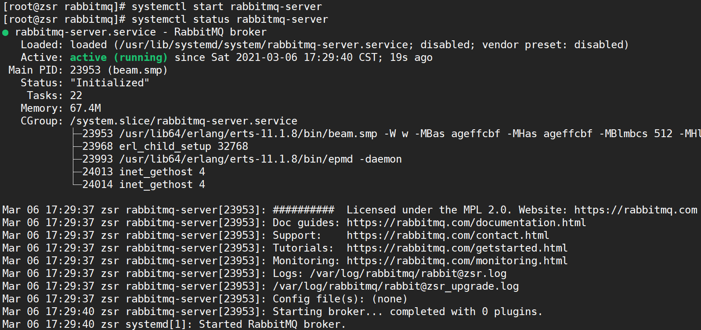

### 管理界面与授权

```shell
# 打开RabbitMQWeb管理界面插件
rabbitmq-plugins enable rabbitmq_management
```

然后打开浏览器，访问`服务器公网ip:15672`（注意打开阿里云安全组以及防火墙的15672端口），就可以看到管理界面


`rabbitmq`有一个默认的账号密码`guest`，但该情况仅限于本机localhost进行访问，所以需要添加一个远程登录的用户

```shell
# 添加用户
rabbitmqctl add_user admin admin
# 为用户添加资源权限(授予访问虚拟机根节点的所有权限)
rabbitmqctl set_permissions -p / admin "." "." ".*"
# 设置用户角色,分配操作权限
rabbitmqctl set_user_tags admin administrator
# 修改密码
rabbitmqctl change_ password 用户名 新密码
# 删除用户
rabbitmqctl delete_user 用户名
# 查看用户清单
rabbitmqctl list_users
```

 这样就可以用`admin/admin`用户登录Web控制台了。s

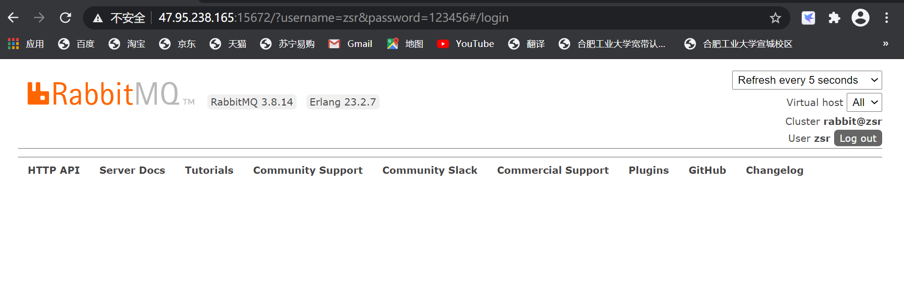

## RabbitMQ集群搭建

在RabbitMQ中，一个节点的服务其实也是作为一个集群来处理的，在web控制台的`admin-> cluster` 中可以看到集群的名字，并且可以在页面上修改。而多节点的集群有两种方式

- **默认的普通集群模式**：

这种模式使用Erlang语言天生具备的集群方式搭建。这种集群模式下，**集群的各个节点之间只会有相同的元数据，即队列结构，而消息不会进行冗余，只存在一个节点中。**消费时，如果消费的不是存有数据的节点， RabbitMQ会临时在节点之间进行数据传输，将消息从存有数据的节点传输到消费的节点。

> 这种集群模式的消息可靠性不是很高。因为如果其中有个节点服务宕机了，那这个节点上的数据就无法消费了，需要等到这个节点服务恢复后才能消费，而这时，消费者端已经消费过的消息就有可能给不了服务端正确应答，服务起来后，就会再次消费这些消息，造成这部分消息重复消费。 另外，如果消息没有做持久化，重启就消息就会丢失。
>
> 并且，这种集群模式也不支持高可用，即当某一个节点服务挂了后，需要手动重启服务，才能保证这一部分消息能正常消费。
>
> 这种集群模式只适合一些对消息安全性不是很高的场景。而在使用这种模式时，消费者应该尽量的连接上每一个节点，减少消息在集群中的传输。

- **镜像模式**：

这种模式是在普通集群模式基础上的一种增强方案，这也就是RabbitMQ的官方HA高可用方案。需要在搭建了普通集群之后再补充搭建。其本质区别在于，**这种模式会在镜像节点中间主动进行消息同步，而不是在客户端拉取消息时临时同步。**并且在集群内部有一个算法会选举产生`master`和`slave`，当一个`master`挂了后，也会自动选出一个来。从而给整个集群提供高可用能力。

> 这种模式的消息可靠性更高，因为每个节点上都存着全量的消息。而他的弊端也是明显的，集群内部的网络带宽会被这种同步通讯大量的消耗，进而降低整个集群的性能。这种模式下，队列数量最好不要过多。

### 搭建普通集群

1. 同步集群节点中的cookie

默认会在 `/var/lib/rabbitmq/` 目录下生成一个 `.erlang.cookie`。 里面有一个字符串。需要将集群中三个节点的cookie字符串一致。

实验中将`worker1`和`worker3`加入到`worker2`的RabbitMQ集群中，所以将`worker2`的`.erlang.cookie`文件分发到`worker1`和`worker3`。

2. 将`worker1`的服务加入到`worker2`的集群中

首先需要保证`worker1`上的rabbitmq服务是正常启动的。 然后执行以下指令：

```shell
rabbitmqctl stop_app
rabbitmqctl join_cluster --ram rabbit@worker2
rabbitmqctl start_app
```

> --ram 表示以Ram节点加入集群。RabbitMQ的集群节点分为disk和ram。disk节点会将元数据保存到硬盘当中，而ram节点只是在内存中保存元数据。
>
> 1. 由于ram节点减少了很多与硬盘的交互，所以，ram节点的元数据使用性能会比较高。但是，同时，这也意味着元数据的安全性是不如disk节点的。在我们这个集群中，worker1和worker3都以ram节点的身份加入到worker2集群里，因此，是存在单点故障的。如果worker2节点服务崩溃，那么元数据就有可能丢失。在企业进行部署时，性能与安全性需要自己进行平衡。
>
> 2. 这里说的元数据仅仅只包含交换机、队列等的定义，而不包含具体的消息。因此，ram节点的性能提升，仅仅体现在对元数据进行管理时，比如修改队列queue，交换机exchange，虚拟机vhosts等时，与消息的生产和消费速度无关。
>
> 3. 如果一个集群中，全部都是ram节点，那么元数据就有可能丢失。这会造成集群停止之后就启动不起来了。RabbitMQ会尽量阻止创建一个全是ram节点的集群，但是并不能彻底阻止。所以，综合考虑，官方其实并不建议使用ram节点，更推荐保证集群中节点的资源投入，使用disk节点。

然后同样把`worer3`上的rabbitmq加入到`worker2`的集群中，加入完成后，可以在`worker2`的Web管理界面上看到集群的节点情况：


> 也可以用后台指令查看集群状态 `rabbitmqctl cluster_status`

### 搭建镜像集群

这样就完成了普通集群的搭建。 在此基础上，可以继续搭建**镜像集群**。

通常在生产环境中，为了减少RabbitMQ集群之间的数据传输，在配置镜像策略时，会针对固定的虚拟主机`virtual host`来配置。

> RabbitMQ中的`vritual host`可以类比为MySQL中的库，针对每个虚拟主机，可以配置不同的权限、策略等。并且不同虚拟主机之间的数据是相互隔离的。

首先创建一个`/mirror`的虚拟主机，然后再添加给对应的镜像策略：

```shell
rabbitmqctl add_vhost /mirror
rabbitmqctl set_policy ha-all --vhost "/mirror" "^" '{"ha-mode":"all"}'
```

同样，这些配置的策略也可以在Web控制台操作。另外也提供了HTTP API来进行这些操作。


> 这些参数需要大致了解下。其中，`pattern`是队列的匹配规则，`^`表示全部匹配。 `^ ha \` 这样的配置表示以ha开头。通常就用虚拟主机来区分就够了，这个队列匹配规则就配置成全匹配。
>
> `HA mode`：可选值 `all, exactly, nodes`。生产上通常为了保证高可用，就配 `all`
>
> - all：队列镜像到集群中的所有节点。当新节点加入集群时，队列也会被镜像到这个节点。
>- exactly：需要搭配一个数字类型的参数(`ha-params`)。队列镜像到集群中指定数量的节点。如果集群内节点数少于这个数字，则队列镜像到集群内的所有节点。如果集群内节点少于这个数，当一个包含镜像的节点停止服务后，新的镜像就不会去另外找节点进行镜像备份了。
> - nodes：需要搭配一个字符串类型的参数。将队列镜像到指定的节点上。如果指定的队列不在集群中，不会报错。当声明队列时，如果指定的所有镜像节点都不在线，那队列会被创建在发起声明的客户端节点上。
> 

通常镜像模式的集群已经足够满足大部分的生产场景了。虽然其对系统资源消耗比较高，但是在生产环境中，系统的资源都是会做预留的，所以正常的使用是没有问题的。但是在做业务集成时，还是需要注意队列数量不宜过多，并且尽量不要让RabbitMQ产生大量的消息堆积。

> 这样搭建起来的RabbitMQ已经具备了集群特性，往任何一个节点上发送消息，消息都会及时同步到各个节点中。而在实际企业部署时，往往会以RabbitMQ的镜像队列作为基础，再增加一些运维手段，进一步提高集群的安全性和实用性。
>
> 例如，增加`keepalived`保证每个RabbitMQ的稳定性，当某一个节点上的RabbitMQ服务崩溃时，可以及时重新启动起来。另外，也可以增加`HA-proxy`来做前端的负载均衡，通过`HA-proxy`增加一个前端转发的虚拟节点，应用可以像使用一个单点服务一样使用一个RabbitMQ集群。

## RabbitMQ基础概念

RabbitMQ是基于`AMQP`协议开发的一个MQ产品，可以参照下图来理解RabbitMQ当中的基础概念：

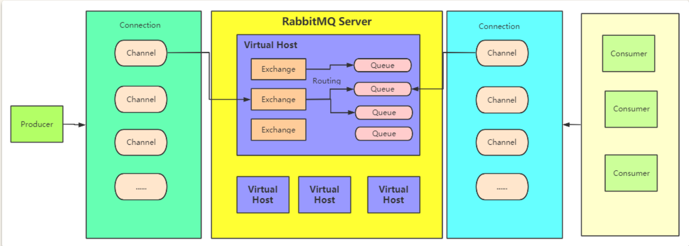

**虚拟主机 `virtual host`**

RabbitMQ出于服务器复用的想法，可以在一个RabbitMQ集群中划分出多个虚拟主机，每一个虚拟主机都有AMQP的全套基础组件，并且可以针对每个虚拟主机进行权限以及数据分配，并且不同虚拟主机之间是完全隔离的。

**连接 Connection**

 客户端与RabbitMQ进行交互，首先就需要建立一个TPC连接，这个连接就是Connection。

**信道 Channel**

 一旦客户端与RabbitMQ建立了连接，就会分配一个AMQP信道 Channel。每个信道都会被分配一个唯一的ID。也可以理解为是客户端与RabbitMQ实际进行数据交互的通道，我们后续的大多数的数据操作都是在信道 Channel 这个层面展开的。

 RabbitMQ为了减少性能开销，也会在一个Connection中建立多个Channel，这样便于客户端进行多线程连接，这些连接会复用同一个Connection的TCP通道，所以在实际业务中，对于Connection和Channel的分配也需要根据实际情况进行考量。

**交换机 Exchange**

 这是RabbitMQ中进行数据路由的重要组件。消息发送到RabbitMQ中后，会首先进入一个交换机，然后由交换机负责将数据转发到不同的队列中。RabbitMQ中有多种不同类型的交换机来支持不同的路由策略。从Web管理界面就能看到，在每个虚拟主机中，RabbitMQ都会默认创建几个不同类型的交换机来。

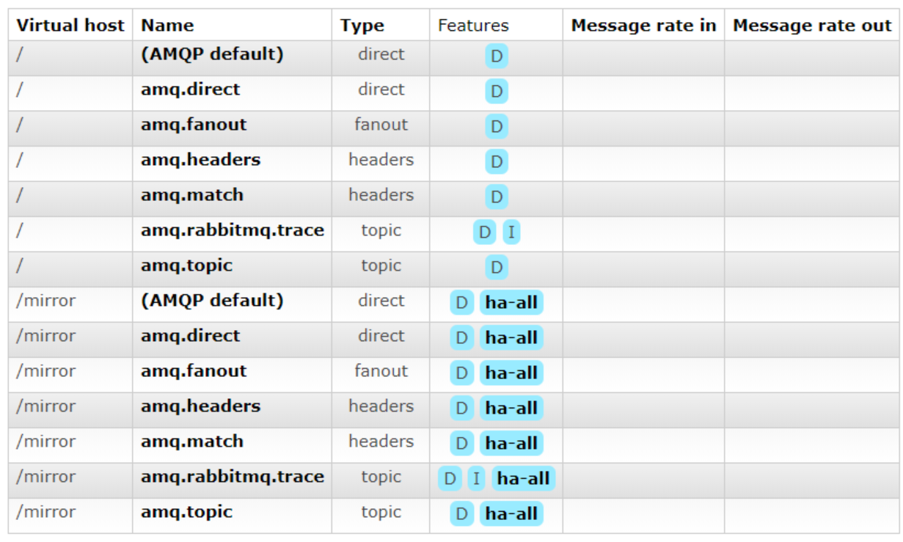

 交换机多用来与生产者打交道。生产者发送的消息通过Exchange交换机分配到各个不同的Queue队列上，而对于消息消费者来说，通常只需要关注自己感兴趣的队列就可以了。

**队列 Queue**

 队列是实际保存数据的最小单位。队列结构天生就具有FIFO的顺序，消息最终都会被分发到不同的队列当中，然后才被消费者进行消费处理。这也是最近RabbitMQ功能变动最大的地方。最为常用的是经典队列Classic。RabbitMQ 3.8.X版本添加了Quorum队列，3.9.X又添加了Stream队列。

#### Classic 经典队列

 这是RabbitMQ最为经典的队列类型。在单机环境中，拥有比较高的消息可靠性。


 在这个图中可以看到，经典队列可以选择是否持久化(**Durability**)以及是否自动删除(**Auto delete**)两个属性。

其中，Durability有两个选项，Durable和Transient。 Durable表示队列会将消息保存到硬盘，这样消息的安全性更高。但是同时，由于需要有更多的IO操作，所以生产和消费消息的性能，相比Transient会比较低。

Auto delete属性如果选择为是，那队列将在至少一个消费者已经连接，然后所有的消费者都断开连接后删除自己。

后面的Arguments部分，还有非常多的参数，可以点击后面的问号逐步了解。

> 其实这时，应该结合kafka和RocketMQ这几个MQ产品，对队列有一个更全面的理解。在MQ当中，队列其实是MQ集群中的一个数据分片的最小单位。在MQ集群中，一个Topic会对应多个队列，而这些队列会均匀的分配到集群的各个节点当中。

#### Quorum 仲裁队列

 仲裁队列，是RabbitMQ从3.8.0版本，引入的一个新的队列类型，整个3.8.X版本，也都是在围绕仲裁队列进行完善和优化。仲裁队列相比Classic经典队列，在分布式环境下对消息的可靠性保障更高。官方文档中表示，未来会使用Quorum仲裁队列代替传统Classic队列。


> 关于Quorum的详细介绍见 https://www.rabbitmq.com/quorum-queues.html，这里只是对其中的重点进行下解读

 Quorum是基于Raft一致性协议实现的一种新型的分布式消息队列，他实现了持久化，多备份的FIFO队列，主要就是针对RabbitMQ的镜像模式设计的。简单理解就是quorum队列中的消息需要有集群中多半节点同意确认后，才会写入到队列中。这种队列类似于RocketMQ当中的DLedger集群。这种方式可以保证消息在集群内部不会丢失。同时，Quorum是以牺牲很多高级队列特性为代价，来进一步保证消息在分布式环境下的高可靠。

 从整体功能上来说，Quorum队列是在Classic经典队列的基础上做减法，因此对于RabbitMQ的长期使用者而言，其实是会影响使用体验的。他与普通队列的区别：

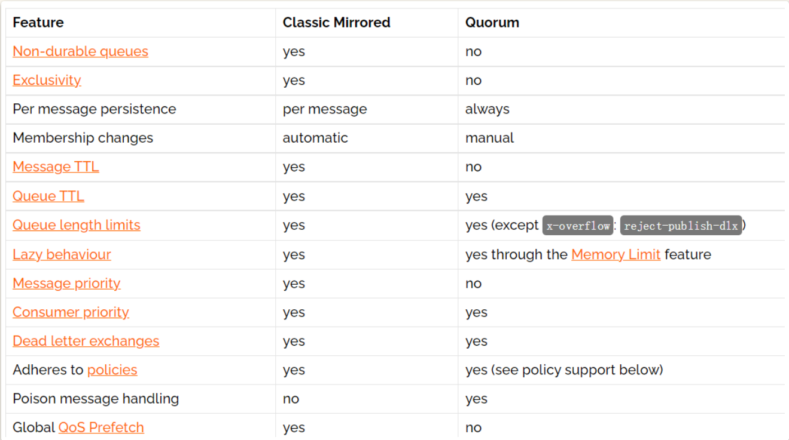

 从官方这个比较图就能看到，Quorum队列大部分功能都是在Classic队列基础上做减法，比如Non-durable queues表示是非持久化的内存队列。Exclusivity表示独占队列，即表示队列只能由声明该队列的Connection连接来进行使用，包括队列创建、删除、收发消息等，并且独占队列会在声明该队列的Connection断开后自动删除。

 其中有个特例就是这个Poison Message(有毒的消息)。所谓毒消息是指消息一直不能被消费者正常消费(可能是由于消费者失败或者消费逻辑有问题等)，就会导致消息不断的重新入队，这样这些消息就成为了毒消息。这些读消息应该有保障机制进行标记并及时删除。Quorum队列会持续跟踪消息的失败投递尝试次数，并记录在"x-delivery-count"这样一个头部参数中。然后，就可以通过设置 Delivery limit参数来定制一个毒消息的删除策略。当消息的重复投递次数超过了Delivery limit参数阈值时，RabbitMQ就会删除这些毒消息。当然，如果配置了死信队列的话，就会进入对应的死信队列。

**Quorum队列更适合于 队列长期存在，并且对容错、数据安全方面的要求比低延迟、不持久等高级队列更能要求更严格的场景。**例如 电商系统的订单，引入MQ后，处理速度可以慢一点，但是订单不能丢失。

也对应以下一些不适合使用的场景：

1、一些临时使用的队列：比如transient临时队列，exclusive独占队列，或者经常会修改和删除的队列。
2、对消息低延迟要求高： 一致性算法会影响消息的延迟。
3、对数据安全性要求不高：Quorum队列需要消费者手动通知或者生产者手动确认。
4、队列消息积压严重 ： 如果队列中的消息很大，或者积压的消息很多，就不要使用Quorum队列。Quorum队列当前会将所有消息始终保存在内存中，直到达到内存使用极限。

#### Stream队列

 Stream队列是RabbitMQ自3.9.0版本开始引入的一种新的数据队列类型，也是目前官方最为推荐的队列类型。这种队列类型的消息是持久化到磁盘并且具备分布式备份的，更适合于消费者多，读消息非常频繁的场景。

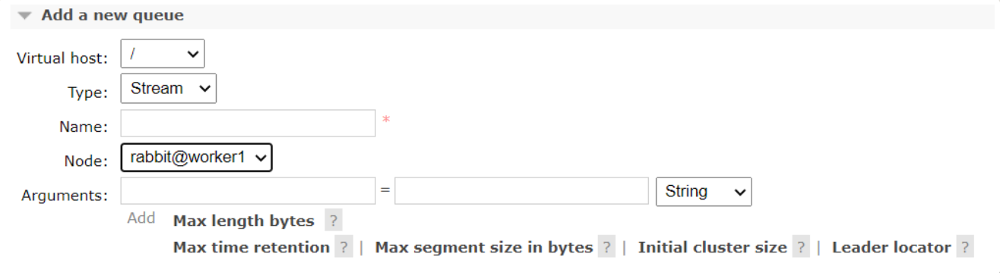

> Stream队列的官方文档地址: https://www.rabbitmq.com/streams.html

 Stream队列的核心是以append-only只添加的日志来记录消息，整体来说，就是消息将以append-only的方式持久化到日志文件中，然后通过调整每个消费者的消费进度offset，来实现消息的多次分发。下方有几个属性也都是来定义日志文件的大小以及保存时间。如果你熟悉Kafka或者RocketMQ，会对这种日志记录消息的方式非常熟悉。这种队列提供了RabbitMQ已有的其他队列类型不太好实现的四个特点：
1、large fan-outs 大规模分发

 当想要向多个订阅者发送相同的消息时，以往的队列类型必须为每个消费者绑定一个专用的队列。如果消费者的数量很大，这就会导致性能低下。而Stream队列允许任意数量的消费者使用同一个队列的消息，从而消除绑定多个队列的需求。

2、Replay/Time-travelling 消息回溯

 RabbitMQ已有的这些队列类型，在消费者处理完消息后，消息都会从队列中删除，因此，无法重新读取已经消费过的消息。而Stream队列允许用户在日志的任何一个连接点开始重新读取数据。

3、Throughput Performance 高吞吐性能

 Strem队列的设计以性能为主要目标，对消息传递吞吐量的提升非常明显。

4、Large logs 大日志

 RabbitMQ一直以来有一个让人诟病的地方，就是当队列中积累的消息过多时，性能下降会非常明显。但是Stream队列的设计目标就是以最小的内存开销高效地存储大量的数据。

 整体上来说，RabbitMQ的Stream队列，其实有很多地方借鉴了其他MQ产品的优点，在保证消息可靠性的基础上，着力提高队列的消息吞吐量以及消息转发性能。因此，Stream也是在视图解决一个RabbitMQ一直以来，让人诟病的缺点，就是当队列中积累的消息过多时，性能下降会非常明显的问题。RabbitMQ以往更专注于企业级的内部使用，但是从这些队列功能可以看到，Rabbitmq也在向更复杂的互联网环境靠拢，未来对于RabbitMQ的了解，也需要随着版本推进，不断更新。

 但是，从整体功能上来讲，队列只不过是一个实现FIFO的数据结构而已，这种数据结构其实是越简单越好。而当前RabbitMQ区分出这么多种队列类型，其实极大的增加了应用层面的使用难度，应用层面必须有一些不同的机制兼容各种队列。所以，在未来版本中，RabbitMQ很可能还是会将这几种队列类型最终统一成一种类型。例如官方已经说明未来会使用Quorum队列类型替代经典队列，到那时，应用层很多工具就可以得到简化，比如不需要再设置durable和exclusive属性。虽然Quorum队列和Stream队列目前还没有合并的打算，但是在应用层面来看，他们两者是冲突的，是一种竞争关系，未来也很有可能最终统一保留成一种类型。至于未来走向如何，我们可以在后续版本拭目以待。

## RabbitMQ编程模型

 RabbitMQ的使用生态已经相当庞大，支持非常多的语言。而就以java而论，也已经支持非常多的扩展。我们接下来会从原生API、SpringBoot集成、SpringCloudStream集成，三个角度来详细学习RabbitMQ的编程模型。在学习编程模型时，要注意下，新推出的Stream队列，他的客户端跟另外两种队列稍有不同。

### 原生API

 使用RabbitMQ提供的原生客户端API进行交互。先来了解下如何使用Classic和Quorum队列。至于Stream队列，目前他使用的是和这两个队列不同的客户端，所以会在后面一个章节单独讨论。

#### maven依赖

```xml
<dependency>
    <groupId>com.rabbitmq</groupId>
    <artifactId>amqp-client</artifactId>
    <version>5.9.0</version>
</dependency>
```

#### 基础编程模型

 这些各种各样的消息模型其实都对应一个比较统一的基础编程模型。

##### step1、首先创建连接，获取Channel

```
ConnectionFactory factory = new ConnectionFactory();
factory.setHost("localhost");

connection = factory.newConnection();
channel = connection.createChannel();
```

##### step2、声明queue队列

关键代码：

```java
 channel.queueDeclare(String queue, boolean durable, boolean exclusive, boolean autoDelete, Map<String, Object> arguments);
```

> api说明：
>
> Declare a queue
> Parameters:
> **queue** the name of the queue
> **durable** true if we are declaring a durable queue (the queue will survive a server restart)
> **exclusive** true if we are declaring an exclusive queue (restricted to this connection)
> **autoDelete** true if we are declaring an autodelete queue (server will delete it when no longer in use)
> **arguments** other properties (construction arguments) for the queue
> Returns:
> a declaration-confirm method to indicate the queue was successfully declared
> Throws:
> java.io.IOException - if an error is encountered
> See Also:
> com.rabbitmq.client.AMQP.Queue.Declare
> com.rabbitmq.client.AMQP.Queue.DeclareOk

如果要声明一个Quorum队列，则只需要在后面的arguments中传入一个参数，**x-queue-type**，参数值设定为**quorum**。

```java
Map<String,Object> params = new HashMap<>();
params.put("x-queue-type","quorum");
//声明Quorum队列的方式就是添加一个x-queue-type参数，指定为quorum。默认是classic
channel.queueDeclare(QUEUE_NAME, true, false, false, params);
```

> 注意：1、对于Quorum类型，durable参数就必须是true了，设置成false的话，会报错。同样，exclusive参数必须设置为false

如果要声明一个Stream队列，则 **x-queue-type**参数要设置为 **stream** .

```java
  Map<String,Object> params = new HashMap<>();
        params.put("x-queue-type","stream");
        params.put("x-max-length-bytes", 20_000_000_000L); // maximum stream size: 20 GB
        params.put("x-stream-max-segment-size-bytes", 100_000_000); // size of segment files: 100 MB
        channel.queueDeclare(QUEUE_NAME, true, false, false, params);
```

> 注意：1、同样，durable参数必须是true，exclusive必须是false。 --你应该会想到，对于这两种队列，这两个参数就是多余的了，未来可以直接删除。
>
> 2、x-max-length-bytes 表示日志文件的最大字节数。x-stream-max-segment-size-bytes 每一个日志文件的最大大小。这两个是可选参数，通常为了防止stream日志无限制累计，都会配合stream队列一起声明。

 声明的队列，如果服务端没有，那么会自动创建。但是如果服务端有了这个队列，那么声明的队列属性必须和服务端的队列属性一致才行。

##### step3、Producer根据应用场景发送消息到queue

关键代码：

```java
channel.basicPublish(String exchange, String routingKey, BasicProperties props,message.getBytes("UTF-8")) ;1
```

> api说明：
> Publish a message. Publishing to a non-existent exchange will result in a channel-level protocol exception, which closes the channel. Invocations of Channel#basicPublish will eventually block if a resource-driven alarm is in effect.
> Parameters:
> **exchange** the exchange to publish the message to
> **routingKey** the routing key
> **props** other properties for the message - routing headers etc
> **body** the message body

其中exchange是一个Producer与queue的中间交互机制。可以让Producer把消息按一定的规则发送到不同的queue，不需要的话就传空字符串

##### step4、Consumer消费消息

定义消费者，消费消息进行处理，并向RabbitMQ进行消息确认。确认了之后就表明这个消息已经消费完了，否则RabbitMQ还会继续让别的消费者实例来处理。

主要收集了两种消费方式
**1、被动消费模式**，Consumer等待rabbitMQ 服务器将message推送过来再消费。一般是启一个一直挂起的线程来等待。
关键代码

```
channel.basicConsume(String queue, boolean autoAck, Consumer callback);1
```

> api说明：
> Start a non-nolocal, non-exclusive consumer, with a server-generated consumerTag.
> Parameters:
> **queue** the name of the queue
> **autoAck** true if the server should consider messages acknowledged once delivered; false if the server should expect explicit acknowledgements
> **callback** an interface to the consumer object
> Returns:
> the consumerTag generated by the server

其中autoAck是个关键。autoAck为true则表示消息发送到该Consumer后就被Consumer消费掉了，不需要再往其他Consumer转发。为false则会继续往其他Consumer转发。
要注意如果每个Consumer一直为false，会导致消息不停的被转发，不停的吞噬系统资源，最终造成宕机。

**2、另一种是主动消费模式。**Comsumer主动到rabbitMQ服务器上去获取指定的messge进行消费。
关键代码

```
GetResponse response = channel.basicGet(QUEUE_NAME, boolean autoAck);1
```

> api说明：
> Retrieve a message from a queue using com.rabbitmq.client.AMQP.Basic.Get
> Parameters:
> **queue** the name of the queue
> **autoAck** true if the server should consider messages acknowledged once delivered; false if the server should expect explicit acknowledgements
> Returns:
> a GetResponse containing the retrieved message data
> Throws:
> java.io.IOException - if an error is encountered
> See Also:
> com.rabbitmq.client.AMQP.Basic.Get
> com.rabbitmq.client.AMQP.Basic.GetOk
> com.rabbitmq.client.AMQP.Basic.GetEmpty

**3.Stream队列消费** 在当前版本下，消费Stream队列时，需要注意三板斧的设置。

- channel必须设置basicQos属性。
- 正确声明Stream队列。
- 消费时需要指定offset。

具体参看示例代码。注意其中的注释。

```java
Connection connection = RabbitMQUtil.getConnection();
        Channel channel = connection.createChannel();
        //1、这个属性必须设置。
        channel.basicQos(100);
        //2、声明Stream队列
        Map<String,Object> params = new HashMap<>();
        params.put("x-queue-type","stream");
        params.put("x-max-length-bytes", 20_000_000_000L); // maximum stream size: 20 GB
        params.put("x-stream-max-segment-size-bytes", 100_000_000); // size of segment files: 100 MB
        channel.queueDeclare(QUEUE_NAME, true, false, false, params);

        //Consumer接口还一个实现QueueConsuemr 但是代码注释过期了。
        Consumer myconsumer = new DefaultConsumer(channel) {
            @Override
            public void handleDelivery(String consumerTag, Envelope envelope,
                                       AMQP.BasicProperties properties, byte[] body)
                    throws IOException {
                System.out.println("========================");
                String routingKey = envelope.getRoutingKey();
                System.out.println("routingKey >" + routingKey);
                String contentType = properties.getContentType();
                System.out.println("contentType >" + contentType);
                long deliveryTag = envelope.getDeliveryTag();
                System.out.println("deliveryTag >" + deliveryTag);
                System.out.println("content:" + new String(body, "UTF-8"));
                // (process the message components here ...)
                //消息处理完后，进行答复。答复过的消息，服务器就不会再次转发。
                //没有答复过的消息，服务器会一直不停转发。
                channel.basicAck(deliveryTag, false);
            }
        };
        //3、消费时，必须指定offset。 可选的值：
        // first: 从日志队列中第一个可消费的消息开始消费
        // last: 消费消息日志中最后一个消息
        // next: 相当于不指定offset，消费不到消息。
        // Offset: 一个数字型的偏移量
        // Timestamp:一个代表时间的Data类型变量，表示从这个时间点开始消费。例如 一个小时前 Date timestamp = new Date(System.currentTimeMillis() - 60 * 60 * 1_000)
        Map<String,Object> consumeParam = new HashMap<>();
        consumeParam.put("x-stream-offset","next");
        channel.basicConsume(QUEUE_NAME, false,consumeParam, myconsumer);

        channel.close();
```

> 这三点要尤其注意，因为当前版本的错误提示非常让人着急。

##### step5、完成以后关闭连接，释放资源

```java
 channel.close(); 
```

#### 官网的消息场景

原生API重点就是学习并理解RabbitMQ的官方消息模型。具体参见 https://www.rabbitmq.com/getstarted.html 。其中可以看到，RabbitMQ官方提供了总共七种消息模型，这其中，6 RPC部分是使用RabbitMQ来实现RPC远程调用，这个场景通常不需要使用MQ来实现，所以也就不当作重点来学习。而7 Publisher Confirms是当前版本新引进来的一种消息模型，对保护消息可靠性有很重要的意义。

这些消息模型基本上涵盖了日常开发中的绝大部分场景，而对于他们的API使用，其实都是大同小异，非常容易上手，并且在实际开发中，一般也有其他更好的框架来整合RabbitMQ使用 。所以对这一部分的学习，理解业务场景是最为重要的。


##### 1：hello world体验

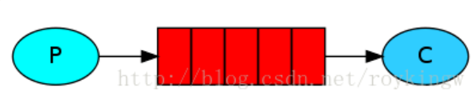

最直接的方式，P端发送一个消息到一个指定的queue，中间不需要任何exchange规则。C端按queue方式进行消费。
关键代码：(其实关键的区别也就是几个声明上的不同。)
producer:

```java
channel.queueDeclare(QUEUE_NAME,false,false,false,null);
channel.basicPublish("", QUEUE_NAME, null, message.getBytes("UTF-8"));
```

consumer:

```java
channel.queueDeclare(QUEUE_NAME, false, false, false, null);
```

##### 2： Work queues 工作序列

这就是kafka同一groupId的消息分发模式

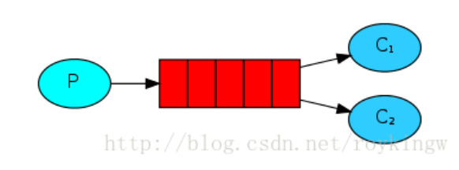

工作任务模式，领导部署一个任务，由下面的一个员工来处理。
producer:

```java
channel.queueDeclare(TASK_QUEUE_NAME, true, false, false, null); //任务一般是不能因为消息中间件的服务而被耽误的，所以durable设置成了true，这样，即使rabbitMQ服务断了，这个消息也不会消失
channel.basicPublish("", TASK_QUEUE_NAME,MessageProperties.PERSISTENT_TEXT_PLAIN,
        message.getBytes("UTF-8"));123
```

Consumer:

```java
channel.queueDeclare(TASK_QUEUE_NAME, true, false, false, null);
channel.basicQos(1);
channel.basicConsume(TASK_QUEUE_NAME, false, consumer);123
```

这个模式应该是最常用的模式，也是官网讨论比较详细的一种模式，所以官网上也对这种模式做了重点讲述。

- 首先。Consumer端的autoAck字段设置的是false,这表示consumer在接收到消息后不会自动反馈服务器已消费了message，而要改在对message处理完成了之后，再调用channel.basicAck来通知服务器已经消费了该message.这样即使Consumer在执行message过程中出问题了，也不会造成message被忽略，因为没有ack的message会被服务器重新进行投递。
  但是，这其中也要注意一个很常见的BUG，就是如果所有的consumer都忘记调用basicAck()了，就会造成message被不停的分发，也就造成不断的消耗系统资源。这也就是 Poison Message(毒消息)
- 其次，官方特意提到的message的持久性。关键的message不能因为服务出现问题而被忽略。还要注意，官方特意提到，所有的queue是不能被多次定义的。如果一个queue在开始时被声明为durable，那在后面再次声明这个queue时，即使声明为 not durable，那这个queue的结果也还是durable的。
- 然后，是中间件最为关键的分发方式。这里，RabbitMQ默认是采用的fair dispatch，也叫round-robin模式，就是把消息轮询，在所有consumer中轮流发送。这种方式，没有考虑消息处理的复杂度以及consumer的处理能力。而他们改进后的方案，是consumer可以向服务器声明一个prefetchCount，我把他叫做预处理能力值。channel.basicQos(prefetchCount);表示当前这个consumer可以同时处理几个message。这样服务器在进行消息发送前，会检查这个consumer当前正在处理中的message(message已经发送，但是未收到consumer的basicAck)有几个，如果超过了这个consumer节点的能力值，就不再往这个consumer发布。
  这种模式，官方也指出还是有问题的，消息有可能全部阻塞，所有consumer节点都超过了能力值，那消息就阻塞在服务器上，这时需要自己及时发现这个问题，采取措施，比如增加consumer节点或者其他策略
  `Note about queue size If all the workers are busy, your queue can fill up. You will want to keep an eye on that, and maybe add more workers, or have some other strategy.`
- 另外 官网上没有深入提到的，就是还是没有考虑到message处理的复杂程度。有的message处理可能很简单，有的可能很复杂，现在还是将所有message的处理程度当成一样的。还是有缺陷的，但是目前也只看到dubbo里对单个服务有权重值的概念，涉及到了这个问题。

##### 3：Publish/Subscribe 订阅 发布 机制

type为**fanout** 的exchange：

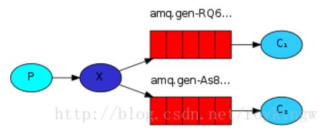

这个机制是对上面的一种补充。也就是把preducer与Consumer进行进一步的解耦。producer只负责发送消息，至于消息进入哪个queue，由exchange来分配。如上图，就是把producer发送的消息，交由exchange同时发送到两个queue里，然后由不同的Consumer去进行消费。
关键代码 ===》 producer: //只负责往exchange里发消息，后面的事情不管。

```
channel.exchangeDeclare(EXCHANGE_NAME, "fanout");
channel.basicPublish(EXCHANGE_NAME, "", null, message.getBytes("UTF-8"));12
```

receiver: //将消费的目标队列绑定到exchange上。

```
channel.exchangeDeclare(EXCHANGE_NAME, "fanout");
String queueName = channel.queueDeclare().getQueue();
channel.queueBind(queueName, EXCHANGE_NAME, "");123
```

关键处就是type为”fanout” 的exchange,这种类型的exchange只负责往所有已绑定的队列上发送消息。

##### 4：Routing 基于内容的路由

type为”direct” 的exchange


这种模式一看图就清晰了。 在上一章 exchange 往所有队列发送消息的基础上，增加一个路由配置，指定exchange如何将不同类别的消息分发到不同的queue上。
关键代码===> Producer:

```
channel.exchangeDeclare(EXCHANGE_NAME, "direct");
channel.basicPublish(EXCHANGE_NAME, routingKey, null, message.getBytes("UTF-8"));12
```

Receiver:

```
channel.exchangeDeclare(EXCHANGE_NAME, "direct");
channel.queueBind(queueName, EXCHANGE_NAME, routingKey1);
channel.queueBind(queueName, EXCHANGE_NAME, routingKey2);
channel.basicConsume(queueName, true, consumer);1234
```

##### 5：Topics 话题

type为"topic" 的exchange

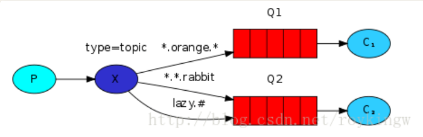
这个模式也就在上一个模式的基础上，对routingKey进行了模糊匹配
单词之间用,隔开，* 代表一个具体的单词。# 代表0个或多个单词。
关键代码===> Producer:

```
channel.exchangeDeclare(EXCHANGE_NAME, "topic");
channel.basicPublish(EXCHANGE_NAME, routingKey, null, message.getBytes("UTF-8"));12
```

Receiver:

```
channel.exchangeDeclare(EXCHANGE_NAME, "topic");
channel.queueBind(queueName, EXCHANGE_NAME, routingKey1);
channel.queueBind(queueName, EXCHANGE_NAME, routingKey2);
channel.basicConsume(queueName, true, consumer);1234
```

##### 6：RPC 远程调用

远程调用是同步阻塞的调用远程服务并获取结果。
RPC远程调用机制其实并不是消息中间件的处理强项。毕竟消息队列机制很大程度上来说就是为了缓冲同步RPC调用造成的瞬间高峰。而RabbitMQ的同步调用示例，看着也确实怪怪的。并且，RPC远程调用的场景，也有太多可替代的技术会比用消息中间件处理得更优雅，更流畅。

```
A note on RPC
Although RPC is a pretty common pattern in computing, it’s often criticised. The problems arise when a programmer is not aware whether a function call is local or if it’s a slow RPC. Confusions like that result in an unpredictable system and adds unnecessary complexity to debugging. Instead of simplifying software, misused RPC can result in unmaintainable spaghetti code.
Bearing that in mind, consider the following advice:
● Make sure it’s obvious which function call is local and which is remote.
● Document your system. Make the dependencies between components clear.
● Handle error cases. How should the client react when the RPC server is down for a long time?
When in doubt avoid RPC. If you can, you should use an asynchronous pipeline - instead of RPC-like blocking, results are asynchronously pushed to a next computation stage.
```

官网上这一大堆说明，其实我觉得就是表明，叫你不要用消息中间件来做RPC。所以关于这个RPC调用功能，就不再多做解释了。代码实现可以参见官网，或者配套的示例代码。

##### 7：Publisher Confirms 发送者消息确认

 RabbitMQ的消息可靠性是非常高的，但是他以往的机制都是保证消息发送到了MQ之后，可以推送到消费者消费，不会丢失消息。但是发送者发送消息是否成功是没有保证的。我们可以回顾下，发送者发送消息的基础API：Producer.basicPublish方法是没有返回值的，也就是说，一次发送消息是否成功，应用是不知道的，这在业务上就容易造成消息丢失。而这个模块就是通过给发送者提供一些确认机制，来保证这个消息发送的过程是成功的。

> 如果了解了这个机制就会发现，这个消息确认机制就是跟RocketMQ的事务消息机制差不多的。而对于这个机制，RocketMQ的支持明显更优雅。

 发送者确认模式默认是不开启的，所以如果需要开启发送者确认模式，需要手动在channel中进行声明。

```java
channel.confirmSelect();
```

 在官网的示例中，重点解释了三种策略：

 **1、发布单条消息**

 即发布一条消息就确认一条消息。核心代码：

```java
for (int i = 0; i < MESSAGE_COUNT; i++) {
    String body = String.valueOf(i);
    channel.basicPublish("", queue, null, body.getBytes());
    channel.waitForConfirmsOrDie(5_000);
}
```

 channel.waitForConfirmsOrDie(5_000);这个方法就会在channel端等待RabbitMQ给出一个响应，用来表明这个消息已经正确发送到了RabbitMQ服务端。但是要注意，这个方法会同步阻塞channel，在等待确认期间，channel将不能再继续发送消息，也就是说会明显降低集群的发送速度即吞吐量。

> 官方说明了，其实channel底层是异步工作的，会将channel阻塞住，然后异步等待服务端发送一个确认消息，才解除阻塞。但是我们在使用时，可以把他当作一个同步工具来看待。
>
> 然后如果到了超时时间，还没有收到服务端的确认机制，那就会抛出异常。然后通常处理这个异常的方式是记录错误日志或者尝试重发消息，但是尝试重发时一定要注意不要使程序陷入死循环。

 **2、发送批量消息**

 之前单条确认的机制会对系统的吞吐量造成很大的影响，所以稍微中和一点的方式就是发送一批消息后，再一起确认。

 核心代码：

```java
   int batchSize = 100;
            int outstandingMessageCount = 0;

            long start = System.nanoTime();
            for (int i = 0; i < MESSAGE_COUNT; i++) {
                String body = String.valueOf(i);
                ch.basicPublish("", queue, null, body.getBytes());
                outstandingMessageCount++;

                if (outstandingMessageCount == batchSize) {
                    ch.waitForConfirmsOrDie(5_000);
                    outstandingMessageCount = 0;
                }
            }

            if (outstandingMessageCount > 0) {
                ch.waitForConfirmsOrDie(5_000);
            }
```

 这种方式可以稍微缓解下发送者确认模式对吞吐量的影响。但是也有个固有的问题就是，当确认出现异常时，发送者只能知道是这一批消息出问题了， 而无法确认具体是哪一条消息出了问题。所以接下来就需要增加一个机制能够具体对每一条发送出错的消息进行处理。

 **3、异步确认消息**

 实现的方式也比较简单，Producer在channel中注册监听器来对消息进行确认。核心代码就是一个：

```java
channel.addConfirmListener(ConfirmCallback var1, ConfirmCallback var2);
```

 按说监听只要注册一个就可以了，那为什么这里要注册两个呢？如果对照下RocketMQ的事务消息机制，这就很容易理解了。发送者在发送完消息后，就会执行第一个监听器callback1，然后等服务端发过来的反馈后，再执行第二个监听器callback2。

 然后关于这个ConfirmCallback，这是个监听器接口，里面只有一个方法： void handle(long sequenceNumber, boolean multiple) throws IOException; 这方法中的两个参数，

- sequenceNumer：这个是一个唯一的序列号，代表一个唯一的消息。在RabbitMQ中，他的消息体只是一个二进制数组，并不像RocketMQ一样有一个封装的对象，所以默认消息是没有序列号的。而RabbitMQ提供了一个方法`int sequenceNumber = channel.getNextPublishSeqNo());`来生成一个全局递增的序列号。然后应用程序需要自己来将这个序列号与消息对应起来。`没错！是的！需要客户端自己去做对应！`
- multiple：这个是一个Boolean型的参数。如果是false，就表示这一次只确认了当前一条消息。如果是true，就表示RabbitMQ这一次确认了一批消息，在sequenceNumber之前的所有消息都已经确认完成了。

> 对比下RocketMQ的事务消息机制，有没有觉得很熟悉，但是又很别扭？当然，考虑到这个对于RabbitMQ来说还是个新鲜玩意，所以有理由相信这个机制在未来会越来越完善。

### SpringBoot集成

 SpringBoot官方就集成了RabbitMQ，所以RabbitMQ与SpringBoot的集成是非常简单的。不过，SpringBoot集成RabbitMQ的方式是按照Spring的一套统一的MQ模型创建的，因此SpringBoot集成插件中对于生产者、消息、消费者等重要的对象模型，与RabbitMQ原生的各个组件有对应关系，但是并不完全相同。这一点需要在后续试验过程中加深理解。

#### 引入依赖

 SpringBoot官方集成了RabbitMQ，只需要快速引入依赖包即可使用。RabbitMQ与SpringBoot集成的核心maven依赖就下面一个。

```
<dependency>
	<groupId>org.springframework.boot</groupId>
	<artifactId>spring-boot-starter-amqp</artifactId>
</dependency>
```

> 要特别注意下版本。我们这里采用的是SpringBoot的2.6.7版本的依赖发布包。不同版本下的配置方式会有变化。

 然后所有的基础运行环境都在application.properties中进行配置。所有配置以spring.rabbitmq开头。通常按照示例进行一些基础的必要配置就可以跑了。关于详细的配置信息，可以参见RabbitProperties，源码中有各个字段说明。

 如果需要更详细的配置资料，那就需要到官方的github仓库上去查了。但是国内访问github的这个速度，你是知道的。

#### 配置生产者

 基础的运行环境参数以及生产者的一些默认属性配置都集中到了application.properties配置文件中。所有配置项都以spring.rabbitmq开头。

> 关于详细的配置信息，可以参见RabbitProperties类的源码，源码中有各个字段的简单说明。
>
> 如果需要更详细的配置资料，那就需要去官方的github仓库上去查了。github地址： https://github.com/spring-projects/spring-amqp 。但是国内访问github的速度，你知道的。

#### 声明队列

 所有的exchange, queue, binding的配置，都需要以对象的方式声明。默认情况下，这些业务对象一经声明，应用就会自动到RabbitMQ上常见对应的业务对象。但是也是可以配置成绑定已有业务对象的。

> 业务对象的声明方式，具体请参见示例工程。
>
> 详细的属性声明，同样参见github仓库。

#### 使用RabbitmqTemplate对象发送消息

 生产者的所有属性都已经在application.properties配置文件中进行配置。项目启动时，就会在Spring容器中初始化一个RabbitmqTemplate对象，然后所有的发送消息操作都通过这个对象来进行。

#### 使用@RabbitListener注解声明消费者

 消费者都是通过@RabbitListener注解来声明。注解中包含了声明消费者队列时所需要的重点参数。对照原生API，这些参数就不难理解了。

但是当要消费Stream队列时，还是要重点注意他的三个必要的步骤：

- channel必须设置basicQos属性。 channel对象可以在@RabbitListener声明的消费者方法中直接引用，Spring框架会进行注入。
- 正确声明Stream队列。 通过往Spring容器中注入Queue对象的方式声明队列。在Queue对象中传入声明Stream队列所需要的参数。
- 消费时需要指定offset。 可以通过注入Channel对象，使用原生API传入offset属性。

 使用SpringBoot框架集成RabbitMQ后，开发过程可以得到很大的简化，所以使用过程并不难，对照一下示例就能很快上手。但是，需要理解一下的是，SpringBoot集成后的RabbitMQ中的很多概念，虽然都能跟原生API对应上，但是这些模型中间都是做了转换的，比如Message，就不是原生RabbitMQ中的消息了。使用SpringBoot框架，尤其需要加深对RabbitMQ原生API的理解，这样才能以不变应万变，深入理解各种看起来简单，但是其实坑很多的各种对象声明方式。

#### 关于Stream队列

 在目前版本下，使用RabbitMQ的SpringBoot框架集成，可以正常声明Stream队列，往Stream队列发送消息，但是无法直接消费Stream队列了。

 关于这个问题，还是需要从Stream队列的三个重点操作入手。SpringBoot框架集成RabbitMQ后，为了简化编程模型，就把channel，connection等这些关键对象给隐藏了，目前框架下，无法直接接入这些对象的注入过程，所以无法直接使用。

 如果非要使用Stream队列，那么有两种方式，一种是使用原生API的方式，在SpringBoot框架下自行封装。另一种是使用RabbitMQ的Stream 插件。在服务端通过Strem插件打开TCP连接接口，并配合单独提供的Stream客户端使用。这种方式对应用端的影响太重了，并且并没有提供与SpringBoot框架的集成，还需要自行完善，因此选择使用的企业还比较少。

 这里就不详细介绍使用方式了。关于Stream插件的使用和配置方式参见官方文档：https://www.rabbitmq.com/stream.html。配合Stream插件使用的客户端有Java和GO两个版本。其中Java版本客户端参见git仓库：https://github.com/rabbitmq/rabbitmq-stream-java-client 。

> 其实关于Stream队列，现在也不需要着急上手，只是把他当作一种特殊的队列类型，上手了解即可。因为一方面太新的技术，往往还需要小白鼠多多验证。另一方面，现在RabbitMQ多种队列并存的状态，在不久肯定会得到简化，到时候，应用层的使用方式也肯定会跟着变化。
>
> 推荐自己以前写的一篇博文 https://blog.csdn.net/roykingw/article/details/78404956 可以作为大家了解SpringBoot集成RabbitMQ的一个入门博文。

### SpringCloudStream集成

> 这是我们VIP课程中唯一一次给大家详细讲解SpringCloudStream这个框架。后续MQ产品会用到，但是就不会对框架做更多分析了。
>
> SpringCloudStream框架由于编程方式非常简单，所以在很多技术非常扎实的大型企业中，SpringCloudStream框架的使用频率会比SpringBoot框架更高。

 SpringCloudStream 是一个构建高扩展和事件驱动的微服务系统的框架，用于连接共有消息系统，官网地址： https://spring.io/projects/spring-cloud-stream 。整体上是把各种花里胡哨的MQ产品抽象成了一套非常简单的统一的编程框架，以实现事件驱动的编程模型。社区官方实现了RabbitMQ，Apache Kafka，Kafka Stream和Amazon Kinesis这几种产品，而其他还有很多产品比如RocketMQ，都是由产品方自行提供扩展实现。所以可以看到，对于RabbitMQ，使用SpringCloudStream框架算是一种比较成熟的集成方案。但是需要主要注意的是，SpringCloudStream框架集成的版本通常是比RabbitMQ落后几个版本的，使用时需要注意。

 SpringCloudStream框架封装出了三个最基础的概念来对各种消息中间件提供统一的抽象：

- Destination Binders:负责集成外部消息系统的组件。
- Destination Binding:由Binders创建的，负责沟通外部消息系统、消息发送者和消息消费者的桥梁。
- Message:消息发送者与消息消费者沟通的简单数据结构。

 可以看到，这个模型非常简单，使用时也会非常方便。但是简单，意味着SCStream中的各种概念模型，与RabbitMQ的基础概念之间是有比较大的差距的，例如Exchange、Queue这些原生概念，集成到SCStream框架时，都需要注意如何配置，如何转换。

#### 引入依赖

 RabbitMQ的SpringCloudStream支持是由Spring社区官网提供的，所以这也是相当成熟的一种集成方案。但是要注意，SpringCloudStream框架集成的版本通常是比RabbitMQ产品本身落后几个版本的，使用时需要注意。

 他的核心依赖也就一个：

```xml
  <dependency>
            <groupId>org.springframework.cloud</groupId>
            <!-- artifactId>spring-cloud-starter-stream-rabbit</artifactId -->
            <artifactId>spring-cloud-stream-binder-rabbit</artifactId>
        </dependency>
```

> 这两个Maven依赖没有什么特别大的区别，实际上，他们的github代码库是在一起的。仓库地址：https://github.com/spring-cloud/spring-cloud-stream-binder-rabbit
>
> 依赖的版本通常建议使用SpringCloud的整体版本控制。 org.springframework.cloud#spring-cloud-dependencies#Hoxton.SR6，这样各个组件之间的版本比较安全。不建议贸然尝试新版本。

#### 基础使用方法：

 使用SCStream框架集成RabbitMQ，编程模型非常的简单。我们先在本地搭建一个RabbitMQ服务，按照以下三步就可以完成与RabbitMQ的对接。

1、声明Sink 消息消费者

```java
@Component
@EnableBinding(Sink.class)
public class MessageReceiver {
 private Logger logger = LoggerFactory.getLogger(MessageReceiver.class);

 @EventListener
 @StreamListener(Sink.INPUT)
 public void process(Object message) {
        System.out.println("received message : " + message);
        logger.info("received message : {}", message);
    }
}
```

2、使用Source 消息生产者 发送消息

```java
@Component
@EnableBinding(Source.class)
public class MessageSender {

 @Autowired
 private Source source;
 
 public void sendMessage(Object message) {
  MessageBuilder<Object> builder = MessageBuilder.withPayload(message);
  source.output().send(builder.build());
 }
}
```

3、在SpringBoot的配置文件中，增加配置

```properties
server.port=8080

spring.cloud.stream.bindings.output.destination=streamExchange

spring.cloud.stream.bindings.input.destination=streamExchange
spring.cloud.stream.bindings.input.group=stream
spring.cloud.stream.bindings.input.content-type=text/plain
```

 这样三个步骤，就完成了与本地RabbitMQ的对接。

 接下来增加SpringBoot启动类，以及测试用的Controller就可以启动测试了。

```java
@SpringBootApplication
public class SCApplication {

 public static void main(String[] args) {
  SpringApplication.run(SCApplication.class, args);
 }
}
@RestController
//@EnableBinding(Source.class)
public class SendMessageController {

 @Autowired
 private Source source;
 
 @GetMapping("/send")
 public Object send(String message) {
  MessageBuilder<String> messageBuilder = MessageBuilder.withPayload(message);
  source.output().send(messageBuilder.build());
  return "message sended : "+message;
 }
}
```

 启动应用后，访问Controller提供的测试端口 http://localhost:8080/send?message=123 。后台就能收到这个消息。

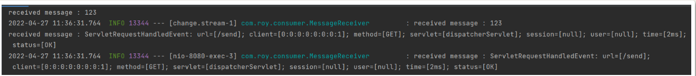

> 这里可以看到，当前消费者不光收到了MQ消息，还收到了一些系统事件。这些系统事件需要添加@EventListener注解才能接收到。

#### 理解SpringCloudStream干了些什么

 非常简单的几行代码，你甚至都不需要感知RabbitMQ的存在，就完成了与RabbitMQ的对接。但是，简单的背后，意味着，如果你要深入使用更多功能，需要有更扎实的技术基础，对SpringCloudStream有更深入的了解。

 我们先来了解下，在刚才的简单示例当中，SpringCloudStream都干了些什么事情。

1、配置RabbitMQ服务器

 在SpringBoot的autoconfigure包当中，有个 RabbitProperties类，这个类就会解析application.properties中以spring.rabbitmq开头的配置。里面配置了跟RabbitMQ相关的主要参数，包含服务器地址等。里面对每个参数也都提供了默认值。默认就是访问本地的RabbitMQ服务。

```properties
#这几个是默认配置。
spring.rabbitmq.host=localhost
spring.rabbitmq.port=5672
spring.rabbitmq.username=guest
spring.rabbitmq.password=guest
spring.rabbitmq.virtual-host=/
```

2、在RabbitMQ中声明Exchange和Queue

 既然是要对接RabbitMQ，那么最终还是需要与RabbitMQ服务器进行交互的。从RabbitMQ的管理页面上来看，SCStream帮我们在RabbitMQ的根虚拟机上创建了一个topic类型的scstreamExchange交换机，然后在这个交换机上绑定了一个scstreamExchange.stream队列，绑定的RoutingKey是#。 而程序中的消息发送者是将消息发送到scstreamExchange交换机，然后RabbitMQ将消息转发到scstreamExchange.stream队列，消息接收者从队列接收到消息。这个流程，就是Spring Cloud Stream在背后为我们做的事情。 在这里可以尝试对应RabbitMQ的基础概念以及SCStream框架中的基础概念，整理一下他们之间的对应关系。

 其实这个示例也演示了SCStream的特点。SCStream框架帮我们屏蔽了与消息中间件的交互细节，开发人员甚至都不需要感知消息中间件的存在，将更多的关注点放到业务处理的细节里。实际上，就我们这个简单的示例，只需要将maven中的spring-cloud-starter-stream-rabbit依赖，换成spring-cloud-starter-stream-kafka，就可以完成与本地Kafka服务的交互，代码不需要做任何的改动。

#### 深入玩转SCStream

 这里需要注意，SCStream框架的设计目的，是为了实现一套简明的事件驱动模型。在这个事件驱动模型中，是没有RabbitMQ中这些Exchange、queue或者是kafka中的Topic之类的这些功能的，所以这也意味着，如果想要使用RabbitMQ的一些特性功能，比如Quorum队列，死信队列，懒加载队列等，反而会比较麻烦。这就需要对各种基础概念有更深的了解。

##### 1、配置Binder

 SCStream是通过Binder来定义一个外部消息服务器。具体对于RabbitMQ来说，Binder就是一个Exchange的抽象。默认情况下，RabbitMQ的binder使用了SpringBoot的ConnectionFactory，所以，他也支持spring-boot-starter-amqp组件中提供的对RabbitMQ的所有配置信息。这些配置信息在application.properties里都以spring.rabbitmq开头。

 而在SCStream框架中，也支持配置多个Binder访问不同的外部消息服务器(例如同时访问kafka和rabbitmq，或者同时访问rabbitmq的多个virtual-host)，就可以通过Binder进行定义。配置的方式都是通过spring.cloud.stream.binders.[bindername].environment.[props]=[value]的格式来进行配置。另外，如果配置了多个binder，也可以通过spring.cloud.stream.default-binder属性指定默认的binder。例如

```properties
spring.cloud.stream.binders.testbinder.environment.spring.rabbitmq.host=localhost
spring.cloud.stream.binders.testbinder.environment.spring.rabbitmq.port=5672
spring.cloud.stream.binders.testbinder.environment.spring.rabbitmq.username=guest
spring.cloud.stream.binders.testbinder.environment.spring.rabbitmq.password=guest
```

 这个配置方式就配置了一个名为testbinder的Binder。

##### 2、Binding配置

 Binding是SCStream中实际进行消息交互的桥梁。在RabbitMQ中，一个binding可以对应消费者的一个queue，在发送消息时，也可以直接对应一个exchange。在SCStream中，就是通过将Binding和Binder建立绑定关系，然后客户端就之需要通过Binding来进行实际的消息收发。

 在SCStream框架中，配置Binding首先需要进行声明。声明Binding的方式是在应用中通过@EnableBinding注解，向Spring容器中逐日一个Binding接口对象。在这个接口中，增加@Input注解指定接收消息的Binding，而通过@Output注解指定发送消息的Binding。在SCStream中，默认提供了Source、Sink、Processor三个接口对象，这三个对象都是简单的接口，可以直接拿来使用，当然也可以配置自己的Binding接口对象。比如Source，他的定义就是这样的：

```java
public interface Source {
 String OUTPUT = "output";
 @Output(Source.OUTPUT)
 MessageChannel output();
}
```

 通过这个@Output直接，就声明出了一个Binding对象，他的名字就叫做output。对于RabbitMQ，就对应一个queue。SCStream就会将这个output声明为一个消息发送队列。

 接下来就可以在应用中使用@EnableBinding(Source.class)，声明这个Binding对象。接下来，就可以在Spring应用中使用@Autowired注入，然后通过source.output()方法获取到MesasgeChannel对象，进而发送消息了。

 这时，如果不对output这个Binding做任何配置，应用启动后，会在RabbitMQ中声明出一个默认的exchange和queue。但是默认的名字都太奇怪，而且很多细节功能不够好用。所以，通常都会对这个Binding进行配置。配置的方式都是在application.properties中配置。所有配置都是按照**spring.cloud.stream.binding.[bindingname].[props]=[value]**的格式进行指定。例如：

```properties
spring.cloud.stream.bindings.output.destination=scstreamExchange
spring.cloud.stream.bindings.output.group=myoutput

spring.cloud.stream.bindings.output.binder=testbinder
```

 这样就指定了output这个Binding对应的Exchange。

> 注意：1、如果不希望每个Binding都单独指定Binder，就可以配置默认的Binder。
>
> 2、对于binding，可以指定group所属组的属性。Group这个概念在RabbitMQ中是不存在的，但是SCStream会按照这个group属性，声明一个名为scstreamExchange.myoutput的queue队列，并与scstreamExchange建立绑定关系。

##### 3、SCStream的分组消费策略

 通过Binding，即可以声明消息生产者，也可以声明消息消费者。基础的配置方式是差不多的。参见之前的示例，不难理解。

 下面重点来看下这个group组属性。消费者组的概念，在RabbitMQ中是不存在的。但是，如果你接触过Kafka或者RocketMQ，那么对于组，你就不会陌生了。SCStream中的消费者分组策略，其实整体来看是一种类似于Kafka的分组消费机制。即，不同group的消费者，都会消费到所有的message消息，而在同一个goup中，每个message消息，只会被消费一次。这种分组消费的策略，严格来说，在RabbitMQ中是不存在的，RabbitMQ是通过不同类型的Exchange来实现不同的消费策略。而使用SCStream框架，就可以直接在RabbitMQ中实现这种分组消费的策略。

```properties
spring.cloud.stream.bindings.consumer1.group=stream
spring.cloud.stream.bindings.consuemr2.group=stream
spring.cloud.stream.bindings.consumer3.group=stream

spring.cloud.stream.bindings.consumer4.group=stream2
```

例如这样，就声明了两个消费者组。consumer1,consumer2,consumer3是一个组，consuemr4是另一个组。接下来，可以自行验证一下消息的分发过程。

 对于这种分组消费的策略，SCStream框架不光提供了实现，同时还提供了扩展。可以对每个组进行分区(partition，是不是感觉越来越像Kafka了？)。

 例如做这样的配置

```properties
#消息生产者端配置
#启动发送者分区
spring.cloud.stream.bindings.output.producer.partitioned=true
#指定参与消息分区的消费端节点数量
spring.cloud.stream.bindings.output.producer.partition-count=2
#只有消费端分区ID为1的消费端能接收到消息
spring.cloud.stream.bindings.output.producer.partition-key-expression=1

#消息消费者端配置
#启动消费分区
spring.cloud.stream.bindings.input.consumer.partitioned=true
#参与分区的消费端节点个数
spring.cloud.stream.bindings.input.consumer.instance-count=2
#设置该实例的消费端分区ID
spring.cloud.stream.bindings.input.consumer.instance-index=1
```

 通过这样的分组策略，当前这个消费者实例就只会消费奇数编号的消息，而偶数编号的消息则不会发送到这个消费者中。**注意：**这并不是说偶数编号的消息就不会被消费，只是不会被当前这个实例消费而已。

> SCStream框架虽然实现了这种分组策略机制，但是其实是不太严谨的，当把分区数量和分区ID不按套路分配时，并没有太多的检查和日志信息，但是就是收不到消息。
>
> 另外，在@StreamListener注解中还有condition属性也可以配置消费者的分配逻辑，该属性支持一个SPELl表达式，只接收满足条件的消息。

##### 4、使用原生消息转发机制

 SCStream其实自身实现了一套事件驱动的流程。这种流程，对于各种不同的MQ产品都是一样的。但是，毕竟每个MQ产品的实现机制和功能特性是不一样的，所以，SCStream还是提供了一套针对各个MQ产品的兼容机制。

 在RabbitMQ的实现中，所有个性化的属性配置实现都是以spring.cloud.stream.rabbit开头，支持对binder、producer、consumer进行单独配置。

```properties
#绑定exchange
spring.cloud.stream.binding.<bindingName>.destination=fanoutExchange
#绑定queue
spring.cloud.stream.binding.<bindingName>.group=myQueue
#不自动创建queue
spring.cloud.stream.rabbit.bindings.<bindingName>.consumer.bindQueue=false
#不自动声明exchange(自动声明的exchange都是topic)
spring.cloud.stream.rabbit.bindings.<bindingName>.consumer.declareExchange=false
#队列名只声明组名(前面不带destination前缀)
spring.cloud.stream.rabbit.bindings.<bindingName>.consumer.queueNameGroupOnly=true
#绑定rouytingKey
spring.cloud.stream.rabbit.bindings.<bindingName>.consumer.bindingRoutingKey=myRoutingKey
#绑定exchange类型
spring.cloud.stream.rabbit.bindings.<bindingName>.consumer.exchangeType=<type>
#绑定routingKey
spring.cloud.stream.rabbit.bindings.<bindingName>.producer.routingKeyExpression='myRoutingKey'
```

 通过这些配置可以按照RabbitMQ原生的方式进行声明。例如，SCStream自动创建的Exchange都是Topic类型的，如果想要用其他类型的Exchange交换机，就可以手动创建交换机，然后在应用中声明不自动创建交换机。

 所有可配置的属性，参见github仓库中的说明。例如，如果需要声明一个Quorum仲裁队列，那么只要给这个Binding配置quorum.enabled属性，值为true就可以了。

> Stream队列目前尚不支持。RabbitMQ周边生态的发展肯定是比产品自身的发展速度要慢的，由此也可见，目前阶段，Stream队列离大规模使用还是有一点距离的。

##### 5、使用SCStream配置死信队列

 死信(Dead letter)队列是RabbitMQ中的一个高级功能，所谓死信，就是长期没有人消费的消息。RabbitMQ中有以下几种情况会产生死信：

- 消息被拒绝(basic.reject/baskc.nack)并且设置消息不重新返回队列 (配置 spring.rabbitmq.listener.default-requeue-rejected=true=false 。这个属性默认是true，就是消息处理失败后，就会重新返回队列，后续重新投递。但是这里需要注意，如果队列已经满了，那就会循环不断的报错，这时候就要考虑死信了)
- 队列达到最大长度
- 消息TTL过期

 在RabbitMQ中，有一类专门处理死信的Exchange交换机和Queue队列。通过RabbitMQ的死信队列功能，可以很好的用来实现延迟队列或者消息补发之类的功能。

 RabbitMQ的死信队列实现机制，是在正常队列上声明一个死信交换机dlExchange，然后这个死信交换机dlExchange可以像正常交换机Exchange一样，去绑定队列，分发消息等。其配置方式，就是在队列中增加声明几个属性来指定死信交换机。而这几个队列属性，即可以在服务器上直接配置，也可以用原生API配置，还可以用SpringBoot的方式声明Queue队列来实现，并且在SCStream框架中也支持定制。主要就是这几个属性：

```
x-dead-letter-exchange:	mirror.dlExchange   对应的死信交换机
x-dead-letter-routing-key:	mirror.messageExchange1.messageQueue1  死信交换机routing-key
x-message-ttl:	3000  消息过期时间
durable:	true  持久化，这个是必须的。
```

 配置完成后，在管理页面也能看到队列信息：

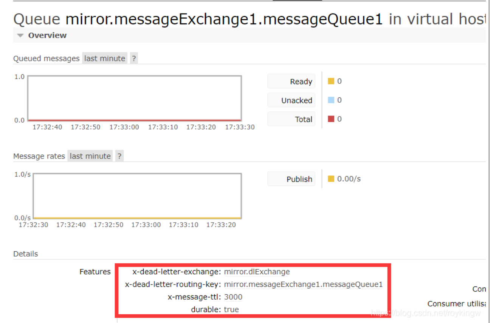

 这样配置完成后，在当前队列中的消息，经过3秒无人消费，就会通过指定的死信交换机mirror.dlExchange，分发到对应的死信队列中。

 关于如何配置这些属性，在之前声明Quorum仲裁队列和Stream队列时，都有说明。

 而在SCStream框架中，就可以通过以下的方式进行配置：

```properties
spring.cloud.stream.rabbit.bindings.input.destination=DlqExchange
spring.cloud.stream.rabbit.bindings.input.group=dlQueue

spring.cloud.stream.rabbit.bindings.output.destination=messageExchange1
spring.cloud.stream.rabbit.bindings.output.producer.required-groups=messageQueue1
spring.cloud.stream.rabbit.rabbit.bindings.output.producer.autoBindDlq=true
spring.cloud.stream.rabbit.rabbit.bindings.output.producer.ttl=3000
spring.cloud.stream.rabbit.rabbit.bindings.output.producer.deadLetterExchange=DlqExchange
spring.cloud.stream.rabbit.rabbit.bindings.output.producer.deadLetterQueueName=DlqExchange.dlQueue
```

 通过这样的一组配置，从output这个Binding发送的消息，经过3秒后，就会被input这个Binding对应的消费者消费到了。

##### 6、扩展的事件监听机制

 另外，在SCStream框架的Sink消费者端，还可以添加@EventListener注解。加入这个注解后，这个Sink消费者，不光可以消费MQ消息，还能监控很多Spring内的事件，像 AsyncConsumerStartedEvent、ApplicationReadyEvent(springBoot启动事件)、ServletRequestHandledEvent(请求响应事件)等等。而使用这些功能，我们可以将Spring的应用事件作为业务事件一样处理，这对于构建统一的Spring应用监控体系是非常有用的。

##### 7、SCStream框架总结

 对于事件驱动这个应用场景来说，SCStream框架绝对是一个举足轻重的产品。一方面，他极大的简化的事件驱动的开发过程，让技术人员可以减少对于不同MQ产品的适应过程，更多的关注业务逻辑。另一方面，SCStream框架对各种五花八门的MQ产品提供了一种统一的实现流程，从而可以极大的减少应用对于具体MQ产品的依赖，极大提高应用的灵活性。例如如果应用某一天想要从RabbitMQ切换成Kafka或者RocketMQ等其他的MQ产品，如果采用其他框架，需要对应用程序做非常大的改动。但是，如果使用SCStream框架，那么基本上就是换Maven依赖，调整相关配置就可以了。应用代码基本不需要做任何改动。

 当然，SCStream框架使用非常方便的背后，也意味着更高的学习门槛。如果只是最简单的使用MQ产品，那你当然可以不用感知MQ产品的存在，就用SCStream框架进行快速的开发。但是，当你需要深入的使用MQ产品时，那就不光需要学习MQ产品本身，还需要学习具体MQ产品模型如何与SCStream的基础模型对应以及转换。这其实对技术反而提出了更高的要求。所以SCStream在一些技术非常扎实的大厂用得比较多，而在一些传统的IT企业，反而有点Hold不住，还不如原生API和SpringBoot集成来得更方便。

 你也可以试试，通过学习，能不能Hold住这个神奇的框架。

