# Redis

[官网](https://redis.io/)

[中文网](http://www.redis.cn)

## CAP + BASE

> 传统的 ACID 分别是什么？

### ACID

- A (Atomicity) 原子性

> 原子性很容易理解，也就是说事务里的所有操作要么全部做完，要么都不做，事务成功的条件是事务
> 里的所有操作都成功，只要有一个操作失败，整个事务就失败，需要回滚。
> 比如银行转账，从 A 账户转 100 元至 B 账户，分为两个步骤：
> 1）从 A 账户取 100 元；
> 2）存入 100 元至 B 账户。
> 这两步要么一起完成，要么一起不完成，如果只完成第一步，第二步失败，钱会莫名其妙少了 100 元。

- C (Consistency) 一致性

> 事务前后数据的完整性必须保持一致。

- I (Isolation) 隔离性

> 所谓的独立性是指并发的事务之间不会互相影响，如果一个事务要访问的数据正在被另外一个事务修 改，只要另外一个事务未提交，它所访问的数据就不受未提交事务的影
> 响。比如现有有个交易是从 A 账户转 100 元至 B 账户，在这个交易还未完成的情况下，如果此时 B 查询自己的账户，是看不到新增加 的 100 元的

- D (Durability) 持久性

> 持久性是指一旦事务提交后，它所做的修改将会永久的保存在数据库上，即使出现宕机也不会丢失。

### CAP 理论

- C : Consistency（强一致性）
- A : Availability（可用性）
- P : Partition tolerance（分区容错性）

**CAP 理论就是说在分布式存储系统中，最多只能实现上面的两点 。**

> 而由于当前的网络硬件肯定会出现延迟丢包等问题，所以 分区容错性是我们必须需要实现 的。 所以我们只能在一致性和可用性之间进行权衡，没有 NoSQL 系统能同时保证这三点。 注意：分布式架构的时候必须做出取舍。 一致性和可用性之间取一个平衡。多余大多数 web 应用，其实并不需要强一致性。 因此牺牲 C 换取 P，这是目前分布式数据库产品的方向

**一致性与可用性的决择**

> 对于 web2.0 网站来说，关系数据库的很多主要特性却往往无用武之地

**数据库事务一致性需求**

> 很多 web 实时系统并不要求严格的数据库事务，对读一致性的要求很低， 有些场合对写一致性要求并不 高。允许实现最终一致性。

**数据库的写实时性和读实时性需求**

> 对关系数据库来说，插入一条数据之后立刻查询，是肯定可以读出来这条数据的，但是对于很多 web 应 用来说，并不要求这么高的实时性，比方说发一条消息之 后，过几秒乃至十几秒之后，我的订阅者才看 到这条动态是完全可以接受的。

**对复杂的 SQL 查询，特别是多表关联查询的需求**

> 任何大数据量的 web 系统，都非常忌讳多个大表的关联查询，以及复杂的数据分析类型的报表查询，特 别是 SNS 类型的网站，从需求以及产品设计角度，就避免了这种情况的产生。往往更多的只是单表的主 键查询，以及单表的简单条件分页查询，SQL 的功能被极大的弱化了。

**CAP 理论的核心** 是：一个分布式系统不可能同时很好的满足一致性，可用性和分区容错性这三个需求， 最多只能同时较好的满足两个。因此，根据 CAP 原理将 NoSQL 数据库分成了满足 CA 原则、满足 CP 原则和满足 AP 原则三
大类：

- CA - 单点集群，满足一致性，可用性的系统，通常在可扩展性上不太强大。
- CP - 满足一致性，分区容忍必的系统，通常性能不是特别高。
- AP - 满足可用性，分区容忍性的系统，通常可能对一致性要求低一些。

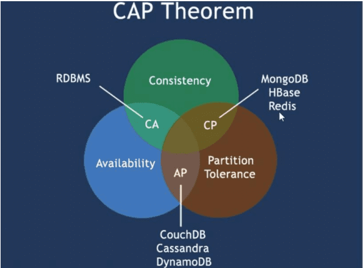

### BASE 理论

> BASE 理论是由 eBay 架构师提出的。BASE 是对 CAP 中一致性和可用性权衡的结果，其来源于对大规模互 联网分布式系统实践的总结，是基于 CAP 定律逐步演化而来。其核心思想是即使无法做到强一致性，但 每个应用都可以根据自身业务特点，采用适当的方式来使系统达到最终一致性。

**BASE 就是为了解决关系数据库强一致性引起的问题而引起的可用性降低而提出的解决方案。**

- 基本可用(Basically Available)：基本可用是指分布式系统在出现故障的时候，允许损失部分可用性，即保证核心可用。电商大促时，为了应对访问量激增，部分用户可能会被引导到降级页面，服务层也可能只提供降级服务。这就是损失部分可用性的体现。

- 软状态(Soft State)：软状态是指允许系统存在中间状态，而该中间状态不会影响系统整体可用性。分布式存储中一般一份数据至少会有三个副本，允许不同节点间副本同步的延时就是软状态的体现。MySQL Replication 的异步复制也是一种体现。

- 最终一致性(Eventual Consistency)： 最终一致性是指系统中的所有数据副本经过一定时间后，最终能够达到一致的状态。弱一致性和强一致性相反，最终一致性是弱一致性的一种特殊情况。

> 它的思想是通过让系统放松对某一时刻数据一致性的要求来换取系统整体伸缩性和性能上改观。为什么这么说呢，缘由就在于大型系统往往由于地域分布和极高性能的要求，不可能采用分布式事务来完成这些指标，要想获得这些指标，我们必须采用另外一种方式来完成，这里 BASE 就是解决这个问题的办法！

1. 分布式：不同的多台服务器上面部署不同的服务模块（工程），他们之间通过 Rpc 通信和调用，对外提供服务和组内协作。
2. 集群：不同的多台服务器上面部署相同的服务模块，通过分布式调度软件进行统一的调度，对外提供服务和访问。

## Redis 基础

### Linux 安装

[下载地址](http://download.redis.io/releases/redis-5.0.7.tar.gz)

1. 下载获得 redis-5.0.7.tar.gz 后将它放到我们 Linux 的目录下 /opt
2. /opt 目录下，解压命令 ： tar -zxvf redis-5.0.7.tar.gz
3. 解压完成后出现文件夹：redis-5.0.
4. 进入目录： cd redis-5.0.
5. 在 redis-5.0.7 目录下执行 make 命令

```shell
# 运行make命令时可能会出现的错误解析：
# 1. 安装gcc (gcc是linux下的一个编译程序，是c程序的编译工具)
yum install gcc-c++
# 版本测试:
gcc-v
# 2. 二次make
# 3. Jemalloc/jemalloc.h: 没有那个文件或目录
make distclean
make
```

6. 如果 make 完成后继续执行 make install
7. 查看默认安装目录：usr/local/bin/usr 这是一个非常重要的目录，类似于 windows 下的 Program Files，存放用户的程序
8. 拷贝配置文件（备用）

```shell
cd /usr/local/bin
ls -l
# 在redis的解压目录下备份redis.conf
mkdir myredis
cp redis.conf myredis  # 拷一个备份，养成良好的习惯，我们就修改这个文件
# 修改配置保证可以后台应用
vim redis.conf
```

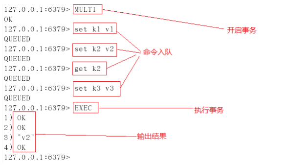

- A、redis.conf 配置文件中 daemonize 守护线程，默认是 NO。
- B、daemonize 是用来指定 redis 是否要用守护线程的方式启动。

**daemonize 设置 yes 或者 no 区别**

- daemonize:yes

redis 采用的是单进程多线程的模式。当 redis.conf 中选项 daemonize 设置成 yes 时，代表开启守护进程模式。在该模式下，redis 会在后台运行，并将进程 pid 号写入至 redis.conf 选项 pidfile 设置的文件中，此时 redis 将一直运行，除非手动 kill 该进程。

- daemonize:no

当 daemonize 选项设置成 no 时，当前界面将进入 redis 的命令行界面，exit 强制退出或者关闭连接工具(putty,xshell 等)都会导致 redis 进程退出。

**启动测试**

```shell
# 【shell】启动redis服务
cd /usr/local/bin
redis-server /opt/redis-5.0.7/redis.conf

# redis客户端连接===> 观察地址的变化，如果连接ok,是直接连上的，redis默认端口号 6379
redis-cli -p 6379
127.0.0.1:6379> ping
PONG
127.0.0.1:6379> set k1 helloworld
OK
127.0.0.1:6379> get k
"helloworld"

# 【shell】ps显示系统当前进程信息
ps -ef | grep redis
root 16005  1  0 04 :45? 00 :00:00 redis-server
127.0.0.1:
root 16031  15692  0 04 :47 pts/0 00 :00:00 redis-cli -p 6379
root 16107  16076  0 04 :51 pts/2 00 :00:00 grep --color=auto redis

# 【redis】关闭连接
127.0.0.1:6379> shutdown
not connected> exit

# 【shell】ps显示系统当前进程信息
ps -ef | grep redis
root 16140  16076  0 04 :53 pts/2 00 :00:00 grep --color=auto redis
```

### 五大数据类型

#### 字符串 String

> 1. String 是 redis 最基本的类型，你可以理解成 Memcached 一模一样的类型，一个 key 对应一个 value。<br>
> 2. String 类型是二进制安全的，意思是 redis 的 string 可以包含任何数据，比如 jpg 图片或者序列化的对象。<br>
> 3. String 类型是 redis 最基本的数据类型，一个 redis 中字符串 value 最多可以是 512M。<br>
> 
> String 数据结构是简单的 key-value 类型，value 其实不仅可以是 String，也可以是数字。
> 
> **常规 key-value 缓存应用：**常规计数：微博数，粉丝数等。

**常用命令说明：**

`单值单Value`

```shell
#### # ===================================================
# set、get、del、append、strlen
# ===================================================
127.0.0.1:6379> set key1 value1 # 设置值
OK
127.0.0.1:6379> get key1  # 获得key
"value1"
127.0.0.1:6379> del key1  # 删除key
(integer) 1
127.0.0.1:6379> keys *  # 查看全部的key
(empty list or set)
127.0.0.1:6379> exists key1 # 确保 key1 不存在
(integer) 0
127.0.0.1:6379> append key1 "hello" # 对不存在的 key 进行 APPEND ，等同于 SET
key1 "hello"
(integer) 5 # 字符长度
127.0.0.1:6379> APPEND key1 "-2333" # 对已存在的字符串进行 APPEND
(integer) 10 # 长度从 5 个字符增加到 10 个字符
127.0.0.1:6379> get key1
"hello-2333"
127.0.0.1:6379> STRLEN key1 # # 获取字符串的长度
(integer) 10

# ===================================================
# incr、decr 一定要是数字才能进行加减，+1 和 -1。
# incrby、decrby 命令将 key 中储存的数字加上指定的增量值。
# ===================================================

127.0.0.1:6379> set views 0 # 设置浏览量为 0
OK
127.0.0.1:6379> incr views  # 浏览 + 1
(integer) 1
127.0.0.1:6379> incr views  # 浏览 + 1
(integer) 2
127.0.0.1:6379> decr views  # 浏览 - 1
(integer) 1
127.0.0.1:6379> incrby views 10 # +10
(integer) 11
127.0.0.1:6379> decrby views 10 # -10
(integer) 1

# ===================================================
# range [范围]
# getrange 获取指定区间范围内的值，类似between...and的关系，从零到负一表示全部
# ===================================================
127.0.0.1:6379> set key2 abcd123456  # 设置key2的值
OK
127.0.0.1:6379> getrange key2 0 -1 # 获得全部的值
"abcd123456"
127.0.0.1:6379> getrange key2 0 2 # 截取部分字符串
"abc"

# ===================================================
# setrange 设置指定区间范围内的值，格式是setrange key值 具体值
# ===================================================
127.0.0.1:6379> get key2
"abcd123456"
127.0.0.1:6379> SETRANGE key2 1 xx # 替换值
(integer) 10
127.0.0.1:6379> get key2
"axxd123456"

# ===================================================
# setex（set with expire）键秒值
# setnx（set if not exist）
# ===================================================
127.0.0.1:6379> setex key3 60 expire  # 设置过期时间
OK

127.0.0.1:6379> ttl key3  # 查看剩余的时间
(integer) 55
127.0.0.1:6379> setnx mykey "redis" # 如果不存在就设置，成功返回 1
(integer) 1
127.0.0.1:6379> setnx mykey "mongodb" # 如果存在就设置，失败返回 0
(integer) 0
127.0.0.1:6379> get mykey
"redis"

# ===================================================
# mset Mset 命令用于同时设置一个或多个 key-value 对。
# mget Mget 命令返回所有(一个或多个)给定 key 的值。
# 如果给定的 key 里面，有某个 key 不存在，那么这个 key 返回特殊值 nil 。
# msetnx 当所有 key 都成功设置，返回 1 。
# 如果所有给定 key 都设置失败(至少有一个 key 已经存在)，那么返回 0 。原子操
作
# ===================================================
127.0.0.1:6379> mset k10 v10 k11 v11 k12 v12
OK
127.0.0.1:6379> keys *
1 ) "k12"
2 ) "k11"
3 ) "k10"
127.0.0.1:6379> mget k10 k11 k12 k13
1 ) "v10"
2 ) "v11"
3 ) "v12"
4 ) (nil)
127.0.0.1:6379> msetnx k10 v10 k15 v15 # 原子性操作！
(integer) 0
127.0.0.1:6379> get key15
(nil)

# 传统对象缓存
set user:1 value(json数据)

# 可以用来缓存对象
mset user:1:name zhangsan user:1:age 2
mget user:1:name user:1:age

# ===================================================
# getset（先get再set）
# ===================================================
127.0.0.1:6379> getset db mongodb # 没有旧值，返回 nil
(nil)
127.0.0.1:6379> get db
"mongodb"
127.0.0.1:6379> getset db redis # 返回旧值 mongodb
"mongodb"
127.0.0.1:6379> get db
"redis"
```

#### 列表 List

> Redis 列表是简单的字符串列表，按照插入顺序排序，你可以添加一个元素到列表的头部（左边）或者尾部（右边）。<br>
> 它的底层实际是个链表!
> list 就是链表，略有数据结构知识的人都应该能理解其结构。使用 Lists 结构，我们可以轻松地实现最新消息排行等功能。List 的另一个应用就是消息队列，可以利用 List 的 PUSH 操作，将任务存在 List 中，然后工 作线程再用 POP 操作将任务取出进行执行。Redis 还提供了操作 List 中某一段的 api，你可以直接查询，删 除 List 中某一段的元素。
> Redis 的 list 是每个子元素都是 String 类型的双向链表，可以通过 push 和 pop 操作从列表的头部或者尾部添加或者删除元素，这样 List 即可以作为栈，也可以作为队列。
> 
`单值多Value`

```shell
#### # ===================================================
# Lpush：将一个或多个值插入到列表头部。（左）
# rpush：将一个或多个值插入到列表尾部。（右）
# lrange：返回列表中指定区间内的元素，区间以偏移量 START 和 END 指定。
# 其中 0 表示列表的第一个元素， 1 表示列表的第二个元素，以此类推。
# 你也可以使用负数下标，以 -1 表示列表的最后一个元素， -2 表示列表的倒数第二个元素，以此
类推。
# ===================================================
127.0.0.1:6379> LPUSH list "one"
(integer) 1
127.0.0.1:6379> LPUSH list "two"
(integer) 2

127.0.0.1:6379> RPUSH list "right"
(integer) 3
127.0.0.1:6379> Lrange list 0 -1
1 ) "two"
2 ) "one"
3 ) "right"
127.0.0.1:6379> Lrange list 0 1
1 ) "two"
2 ) "one"

# ===================================================
# lpop 命令用于移除并返回列表的第一个元素。当列表 key 不存在时，返回 nil 。
# rpop 移除列表的最后一个元素，返回值为移除的元素。
# ===================================================
127.0.0.1:6379> Lpop list
"two"
127.0.0.1:6379> Rpop list
"right"
127.0.0.1:6379> Lrange list 0 -1
1 ) "one"

# ===================================================
# Lindex，按照索引下标获得元素（-1代表最后一个， 0 代表是第一个）
# ===================================================
127.0.0.1:6379> Lindex list 1
(nil)
127.0.0.1:6379> Lindex list 0
"one"
127.0.0.1:6379> Lindex list -1
"one"

# ===================================================
# llen 用于返回列表的长度。
# ===================================================
127.0.0.1:6379> flushdb
OK
127.0.0.1:6379> Lpush list "one"
(integer) 1
127.0.0.1:6379> Lpush list "two"
(integer) 2
127.0.0.1:6379> Lpush list "three"
(integer) 3
127.0.0.1:6379> Llen list # 返回列表的长度
(integer) 3

# ===================================================
# lrem key 根据参数 COUNT 的值，移除列表中与参数 VALUE 相等的元素。
# ===================================================
127.0.0.1:6379> lrem list 1 "two"
(integer) 1
127.0.0.1:6379> Lrange list 0 -1
1 ) "three"
2 ) "one"

# ===================================================
# Ltrim key 对一个列表进行修剪(trim)，就是说，让列表只保留指定区间内的元素，不在指定区
间之内的元素都将被删除。
# ===================================================

127.0.0.1:6379> RPUSH mylist "hello"
(integer) 1
127.0.0.1:6379> RPUSH mylist "hello"
(integer) 2
127.0.0.1:6379> RPUSH mylist "hello2"
(integer) 3
127.0.0.1:6379> RPUSH mylist "hello3"
(integer) 4
127.0.0.1:6379> ltrim mylist 1 2
OK
127.0.0.1:6379> lrange mylist 0 -1
1 ) "hello"
2 ) "hello2"

# ===================================================
# rpoplpush 移除列表的最后一个元素，并将该元素添加到另一个列表并返回。
# ===================================================
127.0.0.1:6379> rpush mylist "hello"
(integer) 1
127.0.0.1:6379> rpush mylist "foo"
(integer) 2
127.0.0.1:6379> rpush mylist "bar"
(integer) 3
127.0.0.1:6379> rpoplpush mylist myotherlist
"bar"
127.0.0.1:6379> lrange mylist 0 -1
1 ) "hello"
2 ) "foo"
127.0.0.1:6379> lrange myotherlist 0 -1
1 ) "bar"

# ===================================================
# lset key index value 将列表 key 下标为 index 的元素的值设置为 value 。
# ===================================================
127.0.0.1:6379> exists list  # 对空列表(key 不存在)进行 LSET
(integer) 0
127.0.0.1:6379> lset list 0 item # 报错
(error) ERR no such key

127.0.0.1:6379> lpush list "value1" # 对非空列表进行 LSET
(integer) 1
127.0.0.1:6379> lrange list 0 0
1 ) "value1"
127.0.0.1:6379> lset list 0 "new" # 更新值
OK
127.0.0.1:6379> lrange list 0 0
1 ) "new"
127.0.0.1:6379> lset list 1 "new" # index 超出范围报错
(error) ERR index out of range

# ===================================================
# linsert key before/after pivot value 用于在列表的元素前或者后插入元素。
# 将值 value 插入到列表 key 当中，位于值 pivot 之前或之后。
# ===================================================
redis> RPUSH mylist "Hello"
(integer) 1
redis> RPUSH mylist "World"
(integer) 2

redis> LINSERT mylist BEFORE "World" "There"
(integer) 3
redis> LRANGE mylist 0 -1
1 ) "Hello"
2 ) "There"
3 ) "World"
```

**性能总结**

- 它是一个字符串链表，left，right 都可以插入添加
- 如果键不存在，创建新的链表
- 如果键已存在，新增内容
- 如果值全移除，对应的键也就消失了
- 链表的操作无论是头和尾效率都极高，但假如是对中间元素进行操作，效率就很惨淡了。

#### 集合 Set

> Redis 的 Set 是 String 类型的无序集合，它是通过 HashTable 实现的!
> 在微博应用中，可以将一个用户所有的关注人存在一个集合中，将其所有粉丝存在一个集合。Redis 还为集合提供了求交集、并集、差集等操作，可以非常方便的实现如共同关注、共同喜好、二度好友等功能，对上面的所有集合操作，你还可以使用不同的命令选择将结果返回给客户端还是存集到一个新的集合中。

`单值多value`

```shell
#### # ===================================================
# sadd 将一个或多个成员元素加入到集合中，不能重复
# smembers 返回集合中的所有的成员。
# sismember 命令判断成员元素是否是集合的成员。
# ===================================================
127.0.0.1:6379> sadd myset "hello"
(integer) 1
127.0.0.1:6379> sadd myset "kuangshen"
(integer) 1
127.0.0.1:6379> sadd myset "kuangshen"
(integer) 0
127.0.0.1:6379> SMEMBERS myset
1 ) "kuangshen"
2 ) "hello"
127.0.0.1:6379> SISMEMBER myset "hello"
(integer) 1
127.0.0.1:6379> SISMEMBER myset "world"
(integer) 0

# ===================================================
# scard，获取集合里面的元素个数
# ===================================================
127.0.0.1:6379> scard myset
(integer) 2

# ===================================================
# srem key value 用于移除集合中的一个或多个成员元素
# ===================================================
127.0.0.1:6379> srem myset "kuangshen"
(integer) 1

127.0.0.1:6379> SMEMBERS myset
1 ) "hello"

# ===================================================
# srandmember key 命令用于返回集合中的一个随机元素。
# ===================================================
127.0.0.1:6379> SMEMBERS myset
1 ) "kuangshen"
2 ) "world"
3 ) "hello"
127.0.0.1:6379> SRANDMEMBER myset
"hello"
127.0.0.1:6379> SRANDMEMBER myset 2
1 ) "world"
2 ) "kuangshen"
127.0.0.1:6379> SRANDMEMBER myset 2
1 ) "kuangshen"
2 ) "hello"

# ===================================================
# spop key 用于移除集合中的指定 key 的一个或多个随机元素
# ===================================================
127.0.0.1:6379> SMEMBERS myset
1 ) "kuangshen"
2 ) "world"
3 ) "hello"
127.0.0.1:6379> spop myset
"world"
127.0.0.1:6379> spop myset
"kuangshen"
127.0.0.1:6379> spop myset
"hello"

# ===================================================
# smove SOURCE DESTINATION MEMBER
# 将指定成员 member 元素从 source 集合移动到 destination 集合。
# ===================================================
127.0.0.1:6379> sadd myset "hello"
(integer) 1
127.0.0.1:6379> sadd myset "world"
(integer) 1
127.0.0.1:6379> sadd myset "kuangshen"
(integer) 1
127.0.0.1:6379> sadd myset2 "set2"
(integer) 1
127.0.0.1:6379> smove myset myset2 "kuangshen"
(integer) 1
127.0.0.1:6379> SMEMBERS myset
1 ) "world"
2 ) "hello"
127.0.0.1:6379> SMEMBERS myset2
1 ) "kuangshen"
2 ) "set2"

# ===================================================
- 数字集合类
  - 差集： sdiff
  - 交集： sinter
  - 并集： sunion
# ===================================================
127.0.0.1:6379> sadd key1 "a"
(integer) 1
127.0.0.1:6379> sadd key1 "b"
(integer) 1
127.0.0.1:6379> sadd key1 "c"
(integer) 1
127.0.0.1:6379> sadd key2 "c"
(integer) 1
127.0.0.1:6379> sadd key2 "d"
(integer) 1
127.0.0.1:6379> sadd key2 "e"
(integer) 1
127.0.0.1:6379> SDIFF key1 key2 # 差集
1 ) "a"
2 ) "b"
127.0.0.1:6379> SINTER key1 key2 # 交集
1 ) "c"
127.0.0.1:6379> SUNION key1 key2 # 并集
1 ) "a"
2 ) "b"
3 ) "c"
4 ) "e"
5 ) "d"
```

#### 哈希 Hash

> Redis hash 是一个键值对集合。<br>
> Redis hash 是一个 String 类型的 field 和 value 的映射表，hash 特别适合用于存储对象。<br>
> 类似 Java 里面的 `Map<String,Object>`<br>
> Redis hash 是一个 string 类型的 field 和 value 的映射表，hash 特别适合用于存储对象。存储部分变更的数据，如用户信息等。

`kv模式不变，但V是一个键值对`

```shell
#### # ===================================================

# hset、hget 命令用于为哈希表中的字段赋值 。
# hmset、hmget 同时将多个field-value对设置到哈希表中。会覆盖哈希表中已存在的字段。
# hgetall 用于返回哈希表中，所有的字段和值。
# hdel 用于删除哈希表 key 中的一个或多个指定字段
# ===================================================
127.0.0.1:6379> hset myhash field1 "kuangshen"
(integer) 1
127.0.0.1:6379> hget myhash field1
"kuangshen"
127.0.0.1:6379> HMSET myhash field1 "Hello" field2 "World"
OK
127.0.0.1:6379> HGET myhash field1
"Hello"
127.0.0.1:6379> HGET myhash field2
"World"
127.0.0.1:6379> hgetall myhash
1 ) "field1"
2 ) "Hello"
3 ) "field2"
4 ) "World"
127.0.0.1:6379> HDEL myhash field1
(integer) 1
127.0.0.1:6379> hgetall myhash
1 ) "field2"
2 ) "World"

# ===================================================
# hlen 获取哈希表中字段的数量。
# ===================================================
127.0.0.1:6379> hlen myhash
(integer) 1
127.0.0.1:6379> HMSET myhash field1 "Hello" field2 "World"
OK
127.0.0.1:6379> hlen myhash
(integer) 2

# ===================================================
# hexists 查看哈希表的指定字段是否存在。
# ===================================================
127.0.0.1:6379> hexists myhash field1
(integer) 1
127.0.0.1:6379> hexists myhash field3
(integer) 0

# ===================================================
# hkeys 获取哈希表中的所有域（field）。
# hvals 返回哈希表所有域(field)的值。
# ===================================================
127.0.0.1:6379> HKEYS myhash
1 ) "field2"
2 ) "field1"
127.0.0.1:6379> HVALS myhash
1 ) "World"
2 ) "Hello"

# ===================================================
# hincrby 为哈希表中的字段值加上指定增量值。
# ===================================================
127.0.0.1:6379> hset myhash field 5
(integer) 1
127.0.0.1:6379> HINCRBY myhash field 1
(integer) 6
127.0.0.1:6379> HINCRBY myhash field -1
(integer) 5
127.0.0.1:6379> HINCRBY myhash field -10
(integer) -5

# ===================================================
# hsetnx 为哈希表中不存在的的字段赋值 。
# ===================================================
127.0.0.1:6379> HSETNX myhash field1 "hello"
(integer) 1 # 设置成功，返回 1 。
127.0.0.1:6379> HSETNX myhash field1 "world"
(integer) 0 # 如果给定字段已经存在，返回 0 。
127.0.0.1:6379> HGET myhash field1
"hello"
```

#### 有序集合 Zset

> Redis zset 和 set 一样，也是 String 类型元素的集合，且不允许重复的成员。<br>
> 不同的是每个元素都会关联一个 double 类型的分数。<br><br>
> Redis 正是通过分数来为集合中的成员进行从小到大的排序，zset 的成员是唯一的，但是分数（Score）<br>
> 却可以重复。<br>
> 和 set 相比，sorted set 增加了一个权重参数 score，使得集合中的元素能够按 score 进行有序排列，比如一个存储全班同学成绩的 sorted set，其集合 value 可以是同学的学号，而 score 就可以是其考试得分，这样在数据插入集合的时候，就已经进行了天然的排序。可以用 sorted set 来做带权重的队列，比如普通消息的 score 为 1 ，重要消息的 score 为 2 ，然后工作线程可以选择按 score 的倒序来获取工作任务。让重要的任务优先执行。
> 排行榜应用，取 TOP N 操作 ！

`在set基础上，加一个score值。之前set是k1 v1 v2 v3，现在zset是 k1 score1 v1 score2 v2`

```shell
#### # ===================================================
# zadd 将一个或多个成员元素及其分数值加入到有序集当中。
# zrange 返回有序集中，指定区间内的成员
# ===================================================
127.0.0.1:6379> zadd myset 1 "one"
(integer) 1
127.0.0.1:6379> zadd myset 2 "two" 3 "three"
(integer) 2
127.0.0.1:6379> ZRANGE myset 0 -1
1 ) "one"
2 ) "two"
3 ) "three"

# ===================================================
# zrangebyscore 返回有序集合中指定分数区间的成员列表。有序集成员按分数值递增(从小到大)
次序排列。
# ===================================================
127.0.0.1:6379> zadd salary 2500 xiaoming
(integer) 1
127.0.0.1:6379> zadd salary 5000 xiaohong
(integer) 1
127.0.0.1:6379> zadd salary 500 kuangshen
(integer) 1
# Inf无穷大量+∞,同样地,-∞可以表示为-Inf。
127.0.0.1:6379> ZRANGEBYSCORE salary -inf +inf # 显示整个有序集
1 ) "kuangshen"
2 ) "xiaoming"
3 ) "xiaohong"
127.0.0.1:6379> ZRANGEBYSCORE salary -inf +inf withscores # 递增排列
1 ) "kuangshen"
2 ) "500"
3 ) "xiaoming"
4 ) "2500"
5 ) "xiaohong"
6 ) "5000"
127.0.0.1:6379> ZREVRANGE salary 0 -1 WITHSCORES  # 递减排列
1 ) "xiaohong"
2 ) "5000"
3 ) "xiaoming"
4 ) "2500"
5 ) "kuangshen"
6 ) "500"
127.0.0.1:6379> ZRANGEBYSCORE salary -inf 2500 WITHSCORES # 显示工资 <=2500
的所有成员
1 ) "kuangshen"
2 ) "500"
3 ) "xiaoming"
4 ) "2500"

#### # ===================================================
# zrem 移除有序集中的一个或多个成员
# ===================================================
127.0.0.1:6379> ZRANGE salary 0 -1
1 ) "kuangshen"
2 ) "xiaoming"
3 ) "xiaohong"
127.0.0.1:6379> zrem salary kuangshen
(integer) 1
127.0.0.1:6379> ZRANGE salary 0 -1
1 ) "xiaoming"
2 ) "xiaohong"

# ===================================================
# zcard 命令用于计算集合中元素的数量。
# ===================================================
127.0.0.1:6379> zcard salary
(integer) 2
OK

# ===================================================
# zcount 计算有序集合中指定分数区间的成员数量。
# ===================================================
127.0.0.1:6379> zadd myset 1 "hello"
(integer) 1
127.0.0.1:6379> zadd myset 2 "world" 3 "kuangshen"
(integer) 2
127.0.0.1:6379> ZCOUNT myset 1 3
(integer) 3
127.0.0.1:6379> ZCOUNT myset 1 2
(integer) 2

# ===================================================
# zrank 返回有序集中指定成员的排名。其中有序集成员按分数值递增(从小到大)顺序排列。
# ===================================================
127.0.0.1:6379> zadd salary 2500 xiaoming
(integer) 1
127.0.0.1:6379> zadd salary 5000 xiaohong
(integer) 1
127.0.0.1:6379> zadd salary 500 kuangshen
(integer) 1
127.0.0.1:6379> ZRANGE salary 0 -1 WITHSCORES  # 显示所有成员及其 score 值
1 ) "kuangshen"
2 ) "500"
3 ) "xiaoming"
4 ) "2500"
5 ) "xiaohong"
6 ) "5000"
127.0.0.1:6379> zrank salary kuangshen  # 显示 kuangshen 的薪水排名，最少
(integer) 0
127.0.0.1:6379> zrank salary xiaohong # 显示 xiaohong 的薪水排名，第三
(integer) 2

# ===================================================
# zrevrank 返回有序集中成员的排名。其中有序集成员按分数值递减(从大到小)排序。
# ===================================================
127.0.0.1:6379> ZREVRANK salary bright
```

### Redis 键（key）

```shell
# keys * 查看所有的key
127.0.0.1:6379> keys *
(empty list or set)
127.0.0.1:6379> set name qinjiang
OK
127.0.0.1:6379> keys *
1 ) "name"

# exists key 的名字，判断某个key是否存在
127.0.0.1:6379> EXISTS name
(integer) 1
127.0.0.1:6379> EXISTS name1
(integer) 0

# move key db ---> 当前库就没有了，被移除了
127.0.0.1:6379> move name 1
(integer) 1
127.0.0.1:6379> keys *
(empty list or set)

# expire key 秒钟：为给定 key 设置生存时间，当 key 过期时(生存时间为 0 )，它会被自动删
除。
# ttl key 查看还有多少秒过期，-1 表示永不过期，-2 表示已过期
127.0.0.1:6379> set name qinjiang
OK

127.0.0.1:6379> EXPIRE name 10
(integer) 1
127.0.0.1:6379> ttl name
(integer) 4
127.0.0.1:6379> ttl name
(integer) 3
127.0.0.1:6379> ttl name
(integer) 2
127.0.0.1:6379> ttl name
(integer) 1
127.0.0.1:6379> ttl name
(integer) -2
127.0.0.1:6379> keys *
(empty list or set)

# type key 查看你的key是什么类型
127.0.0.1:6379> set name qinjiang
OK
127.0.0.1:6379> get name
"qinjiang"
127.0.0.1:6379> type name
string
```

### 三种特殊数据类型

#### GEO 地理位置

> Redis 的 GEO 特性在 Redis 3.2 版本中推出， 这个功能可以将用户给定的地理位置信息储存起来， 并对这些信息进行操作。来实现诸如附近位置、摇一摇这类依赖于地理位置信息的功能。geo 的数据类型为 zset。
> GEO 的数据结构总共有六个常用命令：geoadd、geopos、geodist、georadius、georadiusbymember、gethash

[官方文档](https://www.redis.net.cn/order/3685.html)

##### geoadd

```shell
# 语法
geoadd key longitude latitude member...

# 将给定的空间元素(纬度、经度、名字)添加到指定的键里面。
# 这些数据会以有序集he的形式被储存在键里面，从而使得georadius和georadiusbymember这样的命令可以在之后通过位置查询取得这些元素。
# geoadd命令以标准的x,y格式接受参数,所以用户必须先输入经度,然后再输入纬度。
# geoadd能够记录的坐标是有限的:非常接近两极的区域无法被索引。
# 有效的经度介于-180-180度之间，有效的纬度介于-85.05112878 度至 85.05112878 度之间。，当用户尝试输入一个超出范围的经度或者纬度时,geoadd命令将返回一个错误。

# 测试：百度搜索经纬度查询，模拟真实数据
127.0.0.1:6379> geoadd china:city 116.23 40.22 北京 121.48 31.40 上海 106.54 29.40 重庆 108.93 34.23 西安
(integer) 4
```

##### geopos

```shell
geopos key member [member...]
#从key里返回所有给定位置元素的位置（经度和纬度）

# 测试：
127.0.0.1:6379> geopos china:city 上海
1 ) 1 ) "121.48000091314315796"
2 ) "31.40000025319353938"
127.0.0.1:6379> geopos china:city 新疆
1 ) (nil)
```

##### geodist

```shell
geodist key member1 member2 [unit]

# 返回两个给定位置之间的距离，如果两个位置之间的其中一个不存在,那么命令返回空值。
# 指定单位的参数unit必须是以下单位的其中一个：
# m表示单位为米 km表示单位为千米 mi表示单位为英里 ft表示单位为英尺
# 如果用户没有显式地指定单位参数,那么geodist默认使用米作为单位。
# geodist命令在计算距离时会假设地球为完美的球形,在极限情况下,这一假设最大会造成0.5%的误差。

# 测试：
127.0.0.1:6379> geodist china:city 北京 上海
"1088785.4302"
127.0.0.1:6379> geodist china:city 北京 上海 km
"1088.7854"
```

##### georadius

```shell
# 语法
georadius key longitude latitude radius m|km|ft|mi [withcoord][withdist]
[withhash][asc|desc][count count]
# 以给定的经纬度为中心， 找出某一半径内的元素

# 测试：重新连接 redis-cli，增加参数 --raw ，可以强制输出中文，不然会乱码
redis-cli --raw -p 6379
# 在 china:city 中寻找坐标 100 30 半径为 1000km 的城市
127.0.0.1:6379> georadius china:city 100 30 1000 km
重庆
西安

# withdist 返回位置名称和中心距离
127.0.0.1:6379> georadius china:city 100 30 1000 km withdist
重庆
635.2850
西安
963.3171

# withcoord 返回位置名称和经纬度
127.0.0.1:6379> georadius china:city 100 30 1000 km withcoord
重庆
106.54000014066696167
29.39999880018641676
西安
108.92999857664108276
34.23000121926852302

# withdist withcoord 返回位置名称 距离 和经纬度 count 限定寻找个数
127.0.0.1:6379> georadius china:city 100 30 1000 km withcoord withdist count
1
重庆
635.2850
106.54000014066696167
29.39999880018641676
```

##### georadiusbymember

```shell
#### # 语法
georadiusbymember key member radius m|km|ft|mi [withcoord][withdist]
[withhash][asc|desc][count count]
# 找出位于指定范围内的元素，中心点是由给定的位置元素决定

# 测试：
127.0.0.1:6379> GEORADIUSBYMEMBER china:city 北京 1000 km
北京
西安
```


##### geohash

```shell
# 语法
geohash key member [member...]
# Redis使用geohash将二维经纬度转换为一维字符串，字符串越长表示位置更精确,两个字符串越相似表示距离越近。

# 测试：
127.0.0.1:6379> geohash china:city 北京 上海
wx4sucu47r0
wtw6sk5n300
```

##### zrem

> GEO 没有提供删除成员的命令，但是因为 GEO 的底层实现是 zset，所以可以借用 zrem 命令实现对地理位置信息的删除.

```shell
127.0.0.1:6379> geoadd china:city 116.23 40.22 beijin
1
127.0.0.1:6379> zrange china:city 0 -1 # 查看全部的元素
重庆
西安
上海
beijin
北京
127.0.0.1:6379> zrem china:city beijin  # 移除元素
1
```

#### HyperLogLog

**简介**

Redis 在 2.8.9 版本添加了 HyperLogLog 结构。
Redis HyperLogLog 是用来做基数统计的算法，HyperLogLog 的优点是，在输入元素的数量或者体积 非常非常大时，计算基数所需的空间总是固定 的、并且是很小的。
在 Redis 里面，每个 HyperLogLog 键只需要花费 12 KB 内存，就可以计算接近 2^64 个不同元素的基 数。这和计算基数时，元素越多耗费内存就越多的集合形成鲜明对比。

> HyperLogLog 则是一种算法，它提供了不精确的去重计数方案。举个栗子：假如我要统计网页的 UV（浏览用户数量，一天内同一个用户多次访问只能算一次），传统的解决方案是使用 Set 来保存用户 id，然后统计 Set 中的元素数量来获取页面 UV。但这种方案只能承载少量用户，一旦用户数量大起来就需要消耗大量的空间来存储用户 id。我的目的是统计用户数量而不是保存用户，这简直是个吃力不讨好的方案！而使用 Redis 的 HyperLogLog 最多需要 12k 就可以统计大量的用户数，尽管它大概有 0.81%的错误率，但对于统计 UV 这种不需要很精确的数据是可以忽略不计的。

**基数：**比如数据集 {1, 3, 5, 7, 5, 7, 8}， 那么这个数据集的基数集为 {1, 3, 5 ,7, 8}, 基数(不重复元素)为 5 。基数估计就是在误差可接受的范围内，快速计算基数。

##### 基本命令

| 命令                                    | 描述                                                |
| --------------------------------------- | --------------------------------------------------- |
| PFADD key element [element...]          | 添加指定元素到 HyperLogLog 中。                     |
| PFCOUNT key [key...]                    | 返回给定 HyperLogLog 的基数估算值。                 |
| PFMERGE destkey sourcekey[sourcekey...] | 将多个 HyperLogLog 合并为一个 HyperLogLog，并集计算 |

##### 示例

```shell
127.0.0.1: 6379 > PFADD mykey a b c d e f g h i j
1
127.0.0.1: 6379 > PFCOUNT mykey
10
127.0.0.1: 6379 > PFADD mykey2 i j z x c v b n m
1
127.0.0.1: 6379 > PFMERGE mykey3 mykey mykey2
OK
127.0.0.1: 6379 > PFCOUNT mykey3
15
```

#### BitMap

**简介**

在开发中，可能会遇到这种情况：需要统计用户的某些信息，如活跃或不活跃，登录或者不登录；又如需要记录用户一年的打卡情况，打卡了是 1 ， 没有打卡是 0 ，如果使用普通的 key/value 存储，则要记录 365 条记录，如果用户量很大，需要的空间也会很大，所以 Redis 提供了 Bitmap 位图这中数据结构，Bitmap 就是通过操作二进制位来进行记录，即为 0 和 1；如果要记录 365 天的打卡情况，使用 Bitmap 表示的形式大概如下：0101000111000111...，这样就可以大幅度节约内存， 365 天相当于 365 bit，又 1 字节 = 8 bit , 所以相当于使用 46 个字节即可。

> BitMap 就是通过一个 bit 位来表示某个元素对应的值或者状态, 其中的 key 就是对应元素本身，实际上底层也是通过对字符串的操作来实现。Redis 从 2.2 版本之后新增了 setbit, getbit, bitcount 等几个 bitmap 相关命令。

##### setbit 设置操作

```shell
SETBIT key offset value : 设置 key 的第 offset 位为 value (1 或 0)
# 使用 bitmap 来记录上述事例中一周的打卡记录如下所示：
# 周一： 1 ，周二： 0 ，周三： 0 ，周四： 1 ，周五： 1 ，周六： 0 ，周天： 0 （ 1 为打卡， 0 为不打卡）
127.0.0.1:6379> setbit sign 0 1
0
127.0.0.1:6379> setbit sign 1 0
0
127.0.0.1:6379> setbit sign 2 0
0
127.0.0.1:6379> setbit sign 3 1
0
127.0.0.1:6379> setbit sign 4 1
0
127.0.0.1:6379> setbit sign 5 0
0
127.0.0.1:6379> setbit sign 6 0
0
```

##### getbit 获取操作

```shell
GETBIT key offset 获取 offset 设置的值，未设置过默认返回 0
127.0.0.1:6379> getbit sign 3 # 查看周四是否打卡
1
127.0.0.1:6379> getbit sign 6 # 查看周七是否打卡
0
```

##### bitcount 统计操作

```shell
bitcount key [start, end] 统计 key 上位为 1 的个数
127.0.0.1:6379> bitcount sign
3
```

## Redis 事务

### 理论

**Redis 事务**
> Redis 事务的本质是一组命令的集合。事务支持一次执行多个命令，一个事务中所有命令都会被序列化。在事务执行过程，会按照顺序串行化执行队列中的命令，其他客户端提交的命令请求不会插入到事务执行命令序列中。<br/>
> 总结说：redis 事务就是一次性、顺序性、排他性的执行一个队列中的一系列命令。

**Redis 事务没有隔离级别的概念**

> 批量操作在发送 `EXEC` 命令前被放入队列缓存，并不会被实际执行！

**Redis 不保证原子性**

> Redis 中，单条命令是原子性执行的，但事务不保证原子性，且没有回滚。事务中任意命令执行失败，其余的命令仍会被执行。

**Redis 事务的三个阶段**

> - 开始事务
> - 命令入队
> - 执行事务

### 事务相关命令

```shell
watch key1 key2...  #监视一或多个key,如果在事务执行之前，被监视的key被其他命令改动，则事务被打断 （ 类似乐观锁 ）
multi # 标记一个事务块的开始（ queued ）
exec # 执行所有事务块的命令 （ 一旦执行exec后，之前加的监控锁都会被取消掉 ）
discard # 取消事务，放弃事务块中的所有命令
unwatch # 取消watch对所有key的监控
```

### 实践

**正常执行**


**放弃事务**

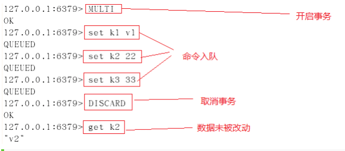

若在事务队列中存在命令性错误（类似于 java 编译性错误），则执行 EXEC 命令时，所有命令都不会执行

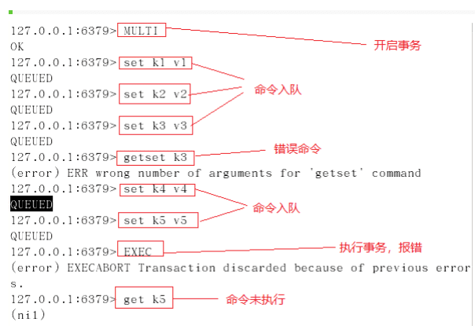

若在事务队列中存在语法性错误（类似于 java 的 1/0 的运行时异常），则执行 EXEC 命令时，其他正确命令会被执行，错误命令抛出异常。

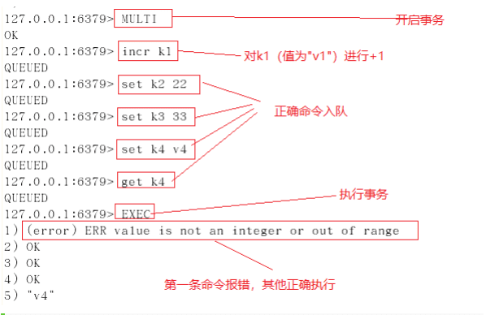

### Watch 监控

#### 悲观锁

> 悲观锁(Pessimistic Lock),顾名思义，就是很悲观，每次去拿数据的时候都认为别人会修改，所以每次在拿数据的时候都会上锁，这样别人想拿到这个数据就会 block 直到它拿到锁。传统的关系型数据库里面就用到了很多这种锁机制，比如行锁，表锁等，读锁，写锁等，都是在操作之前先上锁。

#### 乐观锁

> 乐观锁(Optimistic Lock),顾名思义，就是很乐观，每次去拿数据的时候都认为别人不会修改，所以不会上锁。但是在更新的时候会判断一下再此期间别人有没有去更新这个数据，可以使用版本号等机制，乐观锁适用于多读的应用类型，这样可以提高吞吐量，乐观锁策略：提交版本必须大于记录当前版本才能执行更新。

#### 测试

1. 初始化信用卡可用余额和欠额

```shell
127.0.0.1:6379> set balance 100
OK
127.0.0.1:6379> set debt 0
OK
```

2. 使用 watch 检测 balance，事务期间 balance 数据未变动，事务执行成功

```shell
127.0.0.1:6379> watch balance
OK
127.0.0.1:6379> MULTI
OK
127.0.0.1:6379> decrby balance 20
QUEUED
127.0.0.1:6379> incrby debt 20
QUEUED
127.0.0.1:6379> exec
1 ) (integer) 80
2 ) (integer) 20
```

3. 使用 watch 检测 balance，事务期间 balance 数据变动，事务执行失败！

```shell
#### # 窗口一
127.0.0.1:6379> watch balance
OK
127.0.0.1:6379> MULTI  # 执行完毕后，执行窗口二代码测试
OK
127.0.0.1:6379> decrby balance 20
QUEUED
127.0.0.1:6379> incrby debt 20
QUEUED
127.0.0.1:6379> exec  # 修改失败！
(nil)

# 窗口二
127.0.0.1:6379> get balance
"80"
127.0.0.1:6379> set balance 200
OK

# 窗口一：出现问题后放弃监视，然后重来！
127.0.0.1:6379> UNWATCH  # 放弃监视
OK
127.0.0.1:6379> watch balance
OK
127.0.0.1:6379> MULTI
OK
127.0.0.1:6379> decrby balance 20
QUEUED
127.0.0.1:6379> incrby debt 20
```

> - 一但执行 EXEC 开启事务的执行后，无论事务使用执行成功， WARCH 对变量的监控都将被取消。故当事务执行失败后，需重新执行 WATCH 命令对变量进行监控，并开启新的事务进行操作。<br/>
> - watch 指令类似于乐观锁，在事务提交时，如果 watch 监控的多个 KEY 中任何 KEY 的值已经被其他客户端更改，则使用 EXEC 执行事务时，事务队列将不会被执行，同时返回 Nullmulti-bulk 应答以通知调用者事务执行失败。

## Redis.conf

### 基本配置

> 位置：Redis 的配置文件位于 Redis 安装目录下，文件名为 redis.conf

```shell
config get *  # 获取全部的配置
```

配置文件的地址：

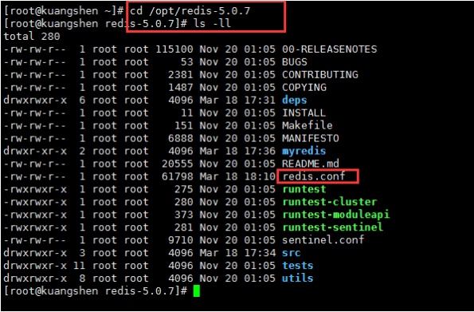

一般情况下，会单独拷贝出来一份进行操作。来保证初始文件的安全。

#### Units 单位

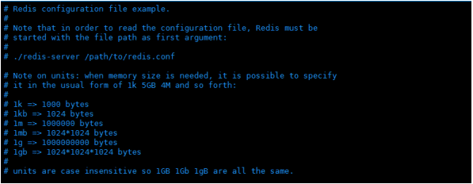

1. 配置大小单位，开头定义了一些基本的度量单位，只支持 bytes，不支持 bit
2. 对大小写不敏感

#### INCLUDES 包含

和 Spring 配置文件类似，可以通过 includes 包含，redis.conf 可以作为总文件，可以包含其他文件！

#### NETWORK 网络配置

```shell
bind 127.0.0.1  # 绑定的ip
protected-mode yes # 保护模式
port 6379 # 默认端口
```

#### GENERAL 通用

```shell
daemonize yes # 默认情况下，Redis不作为守护进程运行。需要开启的话，改为 yes
# 可通过upstart和systemd管理Redis守护进程
supervised no  
# 以后台进程方式运行redis，则需要指定pid 文件
pidfile /var/run/redis_6379.pid  

loglevel notice 
# 日志级别。可选项有：
# debug（记录大量日志信息，适用于开发、测试阶段）；
# verbose（较多日志信息）；
# notice（适量日志信息，使用于生产环境）；
# warning（仅有部分重要、关键信息才会被记录）。

# 日志文件的位置，当指定为空字符串时，为标准输出
logfile "" 
# 设置数据库的数目。默认的数据库是DB 0
databases 16 
# 是否总是显示logo
always-show-logo yes 
```

#### SNAPSHOPTING 快照

```shell
# 900秒（ 15 分钟）内至少 1 个key值改变（则进行数据库保存--持久化）
save 900 1
# 300秒（ 5 分钟）内至少 10 个key值改变（则进行数据库保存--持久化）
save 300 10
# 60秒（ 1 分钟）内至少 10000 个key值改变（则进行数据库保存--持久化）
save 60 10000

# 持久化出现错误后，是否依然进行继续进行工作
stop-writes-on-bgsave-error yes

# 使用压缩rdb文件 yes：压缩，但是需要一些cpu的消耗。no：不压缩，需要更多的磁盘空间
rdbcompression yes

# 是否校验rdb文件，更有利于文件的容错性，但是在保存rdb文件的时候，会有大概10%的性能损耗
rdbchecksum yes

# dbfilenamerdb文件名称
dbfilename dump.rdb

# dir 数据目录，数据库的写入会在这个目录。rdb、aof文件也会写在这个目录
dir./  
```

#### REPLICATION 复制 我们后面讲主从复制再给大家讲解！这里先跳过！

#### SECURITY 安全

访问密码的查看，设置和取消

```shell
# 启动redis
# 连接客户端

# 获得和设置密码
config get requirepass
config set requirepass "123456"

# 测试ping，发现需要验证
127.0.0.1:6379> ping
NOAUTH Authentication required.
# 验证
127.0.0.1:6379> auth 123456
OK
127.0.0.1:6379> ping
PONG
```

#### 限制

```shell
maxclients 10000 # 设置能连上redis的最大客户端连接数量
maxmemory <bytes> # redis配置的最大内存容量
maxmemory-policy noeviction # maxmemory-policy 内存达到上限的处理策略
# volatile-lru：利用LRU算法移除设置过过期时间的key。
# volatile-random：随机移除设置过过期时间的key。
# volatile-ttl：移除即将过期的key，根据最近过期时间来删除（辅以TTL）
# allkeys-lru：利用LRU算法移除任何key。
# allkeys-random：随机移除任何key。
# noeviction：不移除任何key，只是返回一个写错误。
```

#### append only 模式

```shell
appendonly no # 是否以append only模式作为持久化方式，默认使用的是rdb方式持久化，这种方式在许多应用中已经足够用了
appendfilename "appendonly.aof" # appendfilename AOF 文件名称
appendfsync everysec
# appendfsync aof持久化策略的配置
# no表示不执行fsync，由操作系统保证数据同步到磁盘，速度最快。
# always表示每次写入都执行fsync，以保证数据同步到磁盘。
# everysec表示每秒执行一次fsync，可能会导致丢失这1s数据。
```

具体的会在后面持久化配置部分

### 常见配置介绍

- 1、Redis 默认不是以守护进程的方式运行，可以通过该配置项修改，使用 yes 启用守护进程

> `daemonize no`

- 2、当 Redis 以守护进程方式运行时，Redis 默认会把 `pid` 写入`/var/run/redis.pid` 文件，可以通过 `pidfile` 指定

> `pidfile /var/run/redis.pid`

- 3、指定 Redis 监听端口，默认端口为 6379

> `port 6379`

- 4、绑定的主机地址

> `bind 127.0.0.1`

- 5、当 客户端闲置多长时间后关闭连接，如果指定为 0 ，表示关闭该功能

> `timeout 300`

- 6、指定日志记录级别，Redis 总共支持四个级别：`debug`、`verbose`、`notice`、`warning`，默认为 `verbose`

> `loglevel verbose`

- 7、日志记录方式，默认为标准输出，如果配置 Redis 为守护进程方式运行，而这里又配置为日志记录方式为标准输出，则日志将会发送给`/dev/null`

> `logfile stdout`

- 8、设置数据库的数量，默认数据库为 0 ，可以使用 SELECT 命令在连接上指定数据库 id

> `databases 16`

- 9、指定在多长时间内，有多少次更新操作，就将数据同步到数据文件，可以多个条件配合

> save Redis 默认配置文件中提供了三个条件： `save 900 1 save 300 10 save 60 10000` 分别表示 900 秒（ 15 分钟）内有 1 个更改， 300 秒（ 5 分钟）内有 10 个更改以及 60 秒内有 10000 个更改。

- 10、指定存储至本地数据库时是否压缩数据，默认为 yes，Redis 采用 LZF 压缩，如果为了节省 CPU 时间，可以关闭该选项，但会导致数据库文件变的巨大

> `rdbcompression yes`

- 11、指定本地数据库文件名，默认值为 `dump.rdb`

> `dbfilename dump.rdb`

- 12、指定本地数据库存放目录

> `dir./`

- 13、设置当本机为 `slav` 服务时，设置 `master` 服务的 IP 地址及端口，在 Redis 启动时，它会自动从 `master` 进行数据同步

> `slaveof`

- 14、当 `master` 服务设置了密码保护时，`slav` 服务连接 `master` 的密码

> `masterauth`

- 15、设置 Redis 连接密码，如果配置了连接密码，客户端在连接 Redis 时需要通过 `AUTH` 命令提供密码，默认关闭

> `requirepass foobared`

- 16、设置同一时间最大客户端连接数，默认无限制，Redis 可以同时打开的客户端连接数为 Redis 进程可以打开的最大文件描述符数，如果设置 `maxclients 0`，表示不作限制。当客户端连接数到达限制时，Redis 会关闭新的连接并向客户端返回 max number of clients reached 错误信息

> `maxclients 128`

- 17、指定 Redis 最大内存限制，Redis 在启动时会把数据加载到内存中，达到最大内存后，Redis 会先尝试清除已到期或即将到期的 Key，当此方法处理后，仍然到达最大内存设置，将无法再进行写入操作，但仍然可以进行读取操作。Redis 新的 vm 机制，会把 Key 存放内存，Value 会存放在 swap 区

> `maxmemory`

- 18、指定是否在每次更新操作后进行日志记录，Redis 在默认情况下是异步的把数据写入磁盘，如果不开启，可能会在断电时导致一段时间内的数据丢失。因为redis 本身同步数据文件是按上面 save 条件来同步的，所以有的数据会在一段时间内只存在于内存中。默认为 no

> `appendonly no`

- 19、指定更新日志文件名，默认为 `appendonly.aof`

> `appendfilename appendonly.aof`

- 20、指定更新日志条件，共有 3 个可选值：

> `no`：表示等操作系统进行数据缓存同步到磁盘（快）<br>
> `always`：表示每次更新操作后手动调用 fsync()将数据写到磁盘（慢，安全）<br>
> `everysec`：表示每秒同步一次（折衷，默认值）<br>
> `appendfsync everysec`：表示每秒钟将缓冲区中的数据同步到磁盘上<br>

- 21、指定是否启用虚拟内存机制，默认值为 no，简单的介绍一下，VM 机制将数据分页存放，由 Redis 将访问量较少的页即冷数据 swap 到磁盘上，访问多的页面由磁盘自动换出到内存中（在后面的文章我会仔细分析 Redis 的 VM 机制）

> `vm-enabled no`

- 22、虚拟内存文件路径，默认值为`/tmp/redis.swap`，不可多个 Redis 实例共享

> `vm-swap-file /tmp/redis.swap`

- 23、将所有大于 `vm-max-memory` 的数据存入虚拟内存,无论 `vm-max-memory` 设置多小,所有索引数据都是内存存储的(Redis 的索引数据 就是 keys),也就是说,当 `vm-max-memory` 设置为 0 的时候,其实是所有 value 都存在于磁盘。默认值为 0

> `vm-max-memory 0`

- 24、`Redis swap` 文件分成了很多的 page，一个对象可以保存在多个 page 上面，但一个 page 上不能被多个对象共享，`vm-page-size` 是要根据存储的 数据大小来设定的，作者建议如果存储很多小对象，page 大小最好设置为 32或者 64bytes；如果存储很大大对象，则可以使用更大的 page，如果不 确定，就使用默认值

> `vm-page-size 32`

- 25、设置 swap 文件中的 page 数量，由于页表（一种表示页面空闲或使用的 bitmap）是在放在内存中的，，在磁盘上每 8 个 pages 将消耗 1byte 的内存。

> `vm-pages 134217728`

- 26、设置访问 swap 文件的线程数,最好不要超过机器的核数,如果设置为 0,那么所有对 swap 文件的操作都是串行的，可能会造成比较长时间的延迟。默认值为 4

> `vm-max-threads 4`

- 27、设置在向客户端应答时，是否把较小的包合并为一个包发送，默认为开启

> `glueoutputbuf yes`

- 28、指定在超过一定的数量或者最大的元素超过某一临界值时，采用一种特殊的哈希算法

> `hash-max-zipmap-entries 64<br>`
> `hash-max-zipmap-value 512`

- 29、指定是否激活重置哈希，默认为开启（后面在介绍 Redis 的哈希算法时具体介绍）

> `activerehashing yes`

- 30、指定包含其它的配置文件，可以在同一主机上多个 Redis 实例之间使用同一份配置文件，而同时各个实例又拥有自己的特定配置文件

> `include /path/to/local.conf`

## Redis 的持久化

> Redis 是内存数据库，如果不将内存中的数据库状态保存到磁盘，那么一旦服务器进程退出，服务器中的数据库状态也会消失。所以 Redis 提供了持久化功能！

### RDB（Redis DataBase）

#### 什么是 RDB

> 在指定的时间间隔内将内存中的数据集快照写入磁盘，也就是行话讲的 Snapshot 快照，它恢复时是将快照文件直接读到内存里。
> 
> Redis 会单独创建（fork）一个子进程来进行持久化，会先将数据写入到一个临时文件中，待持久化过程都结束了，再用这个临时文件替换上次持久化好的文件。整个过程中，主进程是不进行任何 IO 操作的。这就确保了极高的性能。如果需要进行大规模数据的恢复，且对于数据恢复的完整性不是非常敏感，那 RDB 方式要比 AOF 方式更加的高效。RDB 的缺点是最后一次持久化后的数据可能丢失。

#### Fork

> Fork 的作用是复制一个与当前进程一样的进程。新进程的所有数据（变量，环境变量，程序计数器等）数值都和原进程一致，但是是一个全新的进程，并作为原进程的子进程。

**Rdb 保存的是 `dump.rdb` 文件**

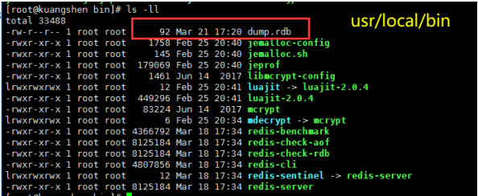

#### 配置位置及 SNAPSHOTTING 解析

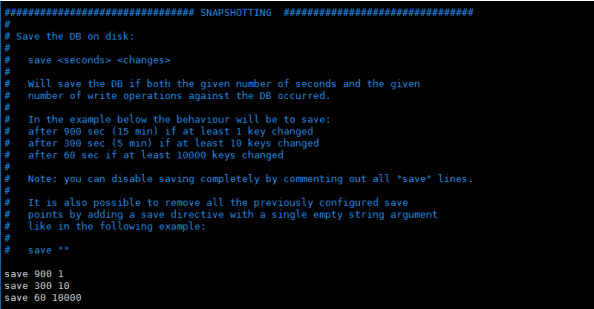

#### 这里的触发条件机制，我们可以修改测试一下：

```shell
save 120 10 # 120秒内修改 10 次则触发RDB
```

RDB 是整合内存的压缩过的 Snapshot，RDB 的数据结构，可以配置复合的快照触发条件。 默认：

- 1 分钟内改了 1 万次
- 5 分钟内改了 10 次
- 15 分钟内改了 1 次

如果想禁用 RDB 持久化的策略，只要不设置任何 save指令，或者给 save 传入一个空字符串参数也可以。若要修改完毕需要立马生效，可以手动使用 save 命令！立马生效!

#### 其余命令解析

`Stop-writes-on-bgsave-error`：如果配置为 no，表示你不在乎数据不一致或者有其他的手段发现和控制，默认为 yes。

`rbdcompression`：对于存储到磁盘中的快照，可以设置是否进行压缩存储。如果是的话，redis 会采用 LZF 算法进行压缩，如果你不想消耗 CPU 来进行压缩的话，可以设置为关闭此功能。

`rdbchecksum`：在存储快照后，还可以让 redis 使用 CRC64 算法来进行数据校验，但是这样做会增加大约 10%的性能消耗，如果希望获取到最大的性能提升，可以关闭此功能。默认为 yes。

#### 触发 RDB 快照

1. 配置文件中默认的快照配置，建议多用一台机子作为备份，复制一份 dump.rdb
2. 命令 save 或者是 bgsave

  1. save 时只管保存，其他不管，全部阻塞
  2. bgsave，Redis 会在后台异步进行快照操作，快照同时还可以响应客户端请求。可以通过 lastsave 命令获取最后一次成功执行快照的时间。

3. 执行 flushall 命令，也会产生 dump.rdb 文件，但里面是空的，无意义!
4. 退出的时候也会产生 dump.rdb 文件！

#### 如何恢复

1. 将备份文件（dump.rdb）移动到 redis 安装目录并启动服务即可
2. CONFIG GET dir 获取目录

```shell
127.0.0.1:6379> config get dir
dir
/usr/local/bin
```

#### 优点和缺点

**优点：**

- 适合大规模的数据恢复
- 对数据完整性和一致性要求不高

**缺点：**

- 在一定间隔时间做一次备份，所以如果 redis 意外 down 掉的话，就会丢失最后一次快照后的所有修改
- Fork 的时候，内存中的数据被克隆了一份，大致 2 倍的膨胀性需要考虑。

#### 小结

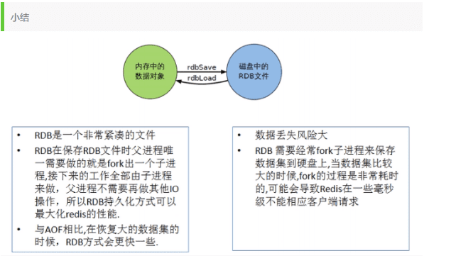

### AOF（Append Only File）

> 以日志的形式来记录每个写操作，将 Redis 执行过的所有指令记录下来（读操作不记录），只许追加文件但不可以改写文件，redis 启动之初会读取该文件重新构建数据，换言之，redis 重启的话就根据日志文件的内容将写指令从前到后执行一次以完成数据的恢复工作

`AOF保存的是 appendonly.aof 文件`

#### 配置

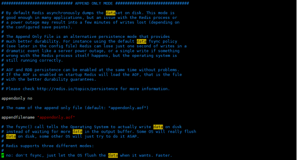

```shell
appendonly no # 是否以append only模式作为持久化方式，默认使用的是rdb方式持久化，这种方式在许多应用中已经足够用了

appendfilename "appendonly.aof" # appendfilename AOF 文件名称

# appendfsync aof持久化策略的配置
appendfsync everysec
# no表示不执行fsync，由操作系统保证数据同步到磁盘，速度最快。
# always表示每次写入都执行fsync，以保证数据同步到磁盘。
# everysec表示每秒执行一次fsync，可能会导致丢失这1s数据。

No-appendfsync-on-rewrite # 重写时是否可以运用Appendfsync，用默认no即可，保证数据安全性

Auto-aof-rewrite-min-size # 设置重写的基准值

Auto-aof-rewrite-percentage #设置重写的基准值
```

#### AOF 启动/修复/恢复

**正常恢复：**

- 启动：设置 Yes，修改默认的 appendonly no，改为 yes
- 将有数据的 aof 文件复制一份保存到对应目录（config get dir）
- 恢复：重启 redis 然后重新加载

**异常恢复：**

- 启动：设置 Yes
- 故意破坏 appendonly.aof 文件！
- 修复： redis-check-aof --fix appendonly.aof 进行修复
- 恢复：重启 redis 然后重新加载

#### Rewrite

> AOF 采用文件追加方式，文件会越来越大，为避免出现此种情况，新增了重写机制，当 AOF 文件的大小超过所设定的阈值时，Redis 就会启动 AOF 文件的内容压缩，只保留可以恢复数据的最小指令集，可以使用命令 `bgrewriteaof` ！

#### 重写原理

> AOF 文件持续增长而过大时，会 fork 出一条新进程来将文件重写（也是先写临时文件最后再 rename），遍历新进程的内存中数据，每条记录有一条的 Set 语句。重写 aof 文件的操作，并没有读取旧的 aof 文件，这点和快照有点类似！

#### 触发机制

在Redis中，AOF触发机制有以下几种方式：

1. 每个命令都触发：每当客户端执行一个写操作的命令时，Redis会立即将该命令写入AOF文件。这是最安全的方式，可以保证每条写操作都被持久化，但也会导致频繁的磁盘写入操作，对性能有一定影响。

2. 按时间触发：Redis可以配置一个时间间隔，例如每秒钟，当经过指定的时间间隔后，Redis会将这段时间内的所有写操作命令一次性写入AOF文件。这种方式可以减少磁盘写入的频率，提高性能，但在发生故障时可能会丢失最后一次时间间隔内的写操作。

3. 混合触发：Redis还可以采用混合的方式，结合上述两种方式。例如可以先按时间触发将一部分操作写入AOF文件，然后在接收到特定命令或达到一定条件时，立即将剩余的操作写入AOF文件。这种方式兼具了实时性和性能的考虑。

需要注意的是，无论采用何种触发机制，Redis都提供了持久化策略的配置选项，可以根据实际需求进行灵活的调整。常见的持久化策略有：

- always：每个命令都立即写入AOF文件，保证最高的数据安全性。
- everysec：每秒钟将操作日志写入AOF文件一次，平衡了性能和数据安全性。
- no：完全禁用AOF持久化，仅依靠内存快照（RDB）来进行数据恢复。

通过合理配置AOF触发机制和持久化策略，可以在满足数据安全性要求的前提下，兼顾Redis服务器的性能和效率。

#### 优点和缺点

**优点：**

- 每修改同步：appendfsync always 同步持久化，每次发生数据变更会被立即记录到磁盘，性能较差但数据完整性比较好
- 每秒同步： appendfsync everysec 异步操作，每秒记录 ，如果一秒内宕机，有数据丢失
- 不同步： appendfsync no 从不同步

**缺点：**

- 相同数据集的数据而言，aof 文件要远大于 rdb 文件，恢复速度慢于 rdb。
- Aof 运行效率要慢于 rdb，每秒同步策略效率较好，不同步效率和 rdb 相同。

#### 小结

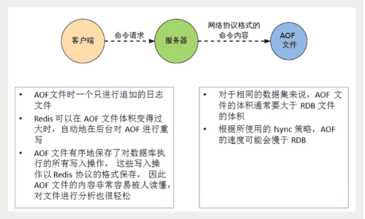

### 总结

1. RDB 持久化方式能够在指定的时间间隔内对你的数据进行快照存储
2. AOF 持久化方式记录每次对服务器写的操作，当服务器重启的时候会重新执行这些命令来恢复原始的数据，AOF 命令以 Redis 协议追加保存每次写的操作到文件末尾，Redis 还能对 AOF 文件进行后台重写，使得 AOF 文件的体积不至于过大。
3. 只做缓存，如果你只希望你的数据在服务器运行的时候存在，你也可以不使用任何持久化
4. 同时开启两种持久化方式
   - 在这种情况下，当 redis 重启的时候会优先载入 AOF 文件来恢复原始的数据，因为在通常情况下 AOF 文件保存的数据集要比 RDB 文件保存的数据集要完整。
   - RDB的数据不实时，同时使用两者时服务器重启也只会找 AOF 文件，那要不要只使用 AOF 呢？作者建议不要，因为 RDB 更适合用于备份数据库（AOF 在不断变化不好备份），快速重启，而且不会有 AOF 可能潜在的 Bug，留着作为一个万一的手段。
5. 性能建议

   - 因为 RDB 文件只用作后备用途，建议只在 Slave 上持久化 RDB 文件，而且只要 15 分钟备份一次就够了，只保留 save 900 1 这条规则。
   - 如果 Enable AOF ，好处是在最恶劣情况下也只会丢失不超过两秒数据，启动脚本较简单只 load 自己的 AOF 文件就可以了，代价一是带来了持续的 IO，二是 AOF rewrite 的最后将 rewrite 过程中产生的新数据写到新文件 造成的阻塞几乎是不可避免的。只要硬盘许可，应该尽量减少 AOF rewrite 的频率，AOF 重写的基础大小默认值 64M 太小了，可以设到 5G 以上，默认超过原大小 100%大小重写可以改到适当的数值。
   - 如果不 Enable AOF ，仅靠 Master-Slave Repllcation 实现高可用性也可以，能省掉一大笔 IO，也减少了 rewrite 时带来的系统波动。代价是如果 Master/Slave 同时倒掉，会丢失十几分钟的数据，启动脚本也要比较两个 Master/Slave 中的 RDB 文件，载入较新的那个，微博就是这种架构。

## Redis 发布订阅

- Redis 发布订阅(pub/sub)是一种消息通信模式：发送者(pub)发送消息，订阅者(sub)接收消息。
- Redis 客户端可以订阅任意数量的频道。

订阅/发布消息图：

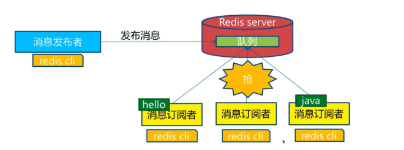

下图展示了频道 channel1 ， 以及订阅这个频道的三个客户端 —— client2 、 client5 和 client1 之间的


当有新消息通过 PUBLISH 命令发送给频道 channel1 时， 这个消息就会被发送给订阅它的三个客户端：

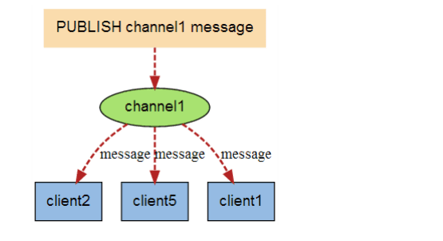

### 命令

这些命令被广泛用于构建即时通信应用，比如网络聊天室(chatroom)和实时广播、实时提醒等。

| 命令 | 描述 |
| --- | --- |
| `PSUBSCRIBE pattern [pattern ...]` | 订阅一个或多个符合给定模式的频道。 |
| `PUBSUB subcommand [argument [argument ...]]` | 查看订阅与发布系统状态。 |
| `PUBLISH channel message` | 将信息发送到指定的频道。 |
| `PUNSUBSCRIBE [pattern [pattern ...]]` | 退订所有给定模式的频道。 |
| `SUBSCRIBE channel [channel ...]` | 订阅给定的一个或多个频道的信息。 |
| `UNSUBSCRIBE [channel [channel ...]]` | 退订给定的频道。 |

### 测试

以下实例演示了发布订阅是如何工作的。在我们实例中我们创建了订阅频道名为 redisChat :

```shell
redis 127.0.0.1:6379> SUBSCRIBE redisChat

Reading messages... (press Ctrl-C to quit)
1 ) "subscribe"
2 ) "redisChat"
3 ) (integer) 1
```

现在，我们先重新开启个 redis 客户端，然后在同一个频道 redisChat 发布两次消息，订阅者就能接收到消息。

```shell
redis 127.0.0.1:6379> PUBLISH redisChat "Hello,Redis"
(integer) 1
redis 127.0.0.1:6379> PUBLISH redisChat "Hello，Kuangshen"
(integer) 1

# 订阅者的客户端会显示如下消息
1 ) "message"
2 ) "redisChat"
3 ) "Hello,Redis"
1 ) "message"
2 ) "redisChat"
3 ) "Hello，Kuangshen"
```

### 原理

- Redis 是使用 C 实现的，通过分析 Redis 源码里的 pubsub.c 文件，了解发布和订阅机制的底层实现，籍此加深对 Redis 的理解。
- Redis 通过 PUBLISH 、SUBSCRIBE 和 PSUBSCRIBE 等命令实现发布和订阅功能。通过 SUBSCRIBE 命令订阅某频道后，redis-server 里维护了一个字典，字典的键就是一个个 channel，而字典的值则是一个链表，链表中保存了所有订阅这个 channel 的客户端。SUBSCRIBE 命令的关键，就是将客户端添加到给定 channel 的订阅链表中。
- 通过 PUBLISH 命令向订阅者发送消息，redis-server 会使用给定的频道作为键，在它所维护的 channel 字典中查找记录了订阅这个频道的所有客户端的链表，遍历这个链表，将消息发布给所有订阅者。
- Pub/Sub 从字面上理解就是发布（Publish）与订阅（Subscribe），在 Redis 中，你可以设定对某一个 key 值进行消息发布及消息订阅，当一个 key 值上进行了消息发布后，所有订阅它的客户端都会收到相应的消息。这一功能最明显的用法就是用作实时消息系统，比如普通的即时聊天，群聊等功能。

### 使用场景

1. Pub/Sub 构建实时消息系统
2. Redis 的 Pub/Sub 系统可以构建实时的消息系统
3. 比如很多用 Pub/Sub 构建的实时聊天系统的例子。

## Redis 主从复制

### 概念

> 主从复制，是指将一台 Redis 服务器的数据，复制到其他的 Redis 服务器。前者称为主节点`(master/leader)`，后者称为从节点`(slave/follower)`；数据的复制是单向的，只能由主节点到从节点。Master 以写为主，Slave 以读为主。
> 默认情况下，每台 Redis 服务器都是主节点；且一个主节点可以有多个从节点(或没有从节点)，但一个从节点只能有一个主节点。

主从复制的作用主要包括：

- **数据冗余：**主从复制实现了数据的热备份，是持久化之外的一种数据冗余方式。
- **故障恢复：**当主节点出现问题时，可以由从节点提供服务，实现快速的故障恢复；实际上是一种服务的冗余。
- **负载均衡：**在主从复制的基础上，配合读写分离，可以由主节点提供写服务，由从节点提供读服务（即写 Redis 数据时应用连接主节点，读 Redis 数据时应用连接从节点），分担服务器负载；尤其是在写少读多的场景下，通过多个从节点分担读负载，可以大大提高 Redis 服务器的并发量。
- **高可用基石：**除了上述作用以外，主从复制还是哨兵和集群能够实施的基础，因此说主从复制是 Redis 高可用的基础。

一般来说，要将 Redis 运用于工程项目中，只使用一台 Redis 是万万不能的，原因如下：

- **从结构上：**单个 Redis 服务器会发生单点故障，并且一台服务器需要处理所有的请求负载，压力较大；
- **从容量上：**单个 Redis 服务器内存容量有限，就算一台 Redis 服务器内存容量为 256G，也不能将所有内存用作 Redis 存储内存，一般来说，单台 Redis 最大使用内存不应该超过 20G。

> 电商网站上的商品，一般都是一次上传，无数次浏览的，说专业点也就是"多读少写"。 对于这种场景，我们可以使如下这种架构：

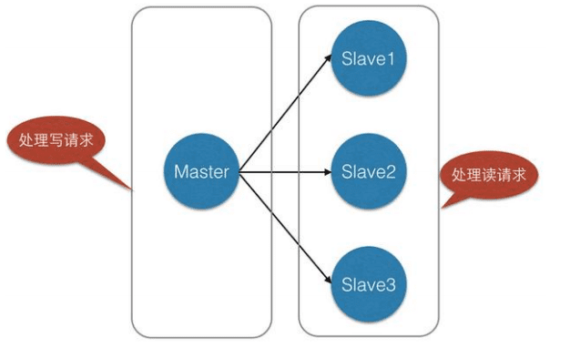

### 环境配置

#### 基本配置

配从库不配主库，从库配置：

```shell
slaveof 主库ip 主库端口 # 配置主从
info replication # 查看信息
```

每次与 master 断开之后，都需要重新连接，除非配置进 `redis.conf` 文件！

#### 修改 conf 文件

准备工作：配置主从复制，至少需要三个，一主二从！配置三个客户端！


1. 拷贝多个 redis.conf 文件

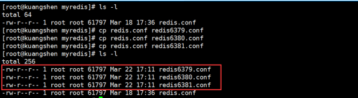

2. 指定端口 6379 ，依次类推
3. 开启 `daemonize yes`
4. `Pid` 文件名字 `pidfile /var/run/redis_6379.pid` , 依次类推
5. `Log` 文件名字 `logfile "6379.log"` , 依次类推
6. `Dump.rdb` 名字 `dbfilename dump6379.rdb` , 依次类推


**上面都配置完毕后，3 个服务通过 3 个不同的配置文件开启，准备环境就 OK 了！**

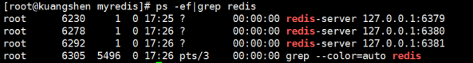

### 一主二从

- 1 、环境初始化

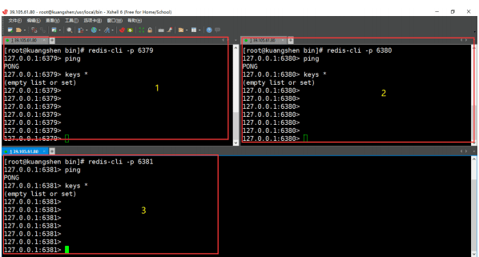

默认三个都是 Master 主节点

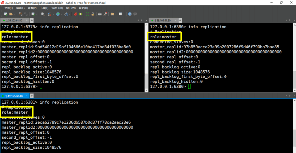

- 2 、配置为一个 Master 两个 Slave


- 3 、在主机设置值，在从机都可以取到！从机不能写值！


测试一：主机挂了，查看从机信息，主机恢复，再次查看信息

测试二：从机挂了，查看主机信息，从机恢复，查看从机信息

#### 层层链路

> 上一个 Slave 可以是下一个 slave 和 Master，Slave 同样可以接收其他 slaves 的连接和同步请求，那么该 slave 作为了链条中下一个的 master，可以有效减轻 master 的写压力！

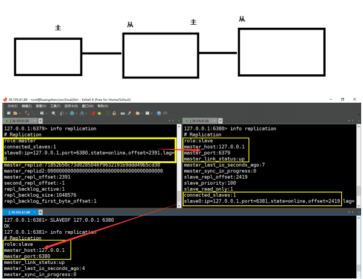

> 测试： 6379 设置值以后 6380 和 6381 都可以获取到！OK！

#### 取代主节点

> 一主二从的情况下，如果主机断了，从机可以使用命令 `SLAVEOF NO ONE` 将自己改为主机！这个时候其余的从机链接到这个节点。对一个从属服务器执行命令 `SLAVEOF NO ONE` 将使得这个从属服务器关闭复制功能，并从从属服务器转变回主服务器，原来同步所得的数据集不会被丢弃。

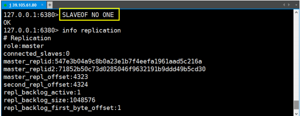

主机再回来，也只是一个光杆司令了，从机为了正常使用跑到了新的主机上！

#### 复制原理

> `Slave` 启动成功连接到 `master` 后会发送一个 `sync` 命令 `Master` 接到命令，启动后台的存盘进程，同时收集所有接收到的用于修改数据集命令，在后台进程执行完毕之后，`master` 将传送整个数据文件到 `slave`，并完成一次完全同步。全量复制：而 `slave` 服务在接收到数据库文件数据后，将其存盘并加载到内存中。增量复制：`Master` 继续将新的所有收集到的修改命令依次传给 `slave`，完成同步但是只要是重新连接 `master`，一次完全同步（全量复制）将被自动执行

### 哨兵模式

#### 概述

> 主从切换技术的方法是：当主服务器宕机后，需要手动把一台从服务器切换为主服务器，这就需要人工干预，费事费力，还会造成一段时间内服务不可用。这不是一种推荐的方式，更多时候，我们优先考虑哨兵模式。Redis 从 2.8 开始正式提供了 `Sentinel（哨兵）` 架构来解决这个问题。谋朝篡位的自动版，能够后台监控主机是否故障，如果故障了根据投票数自动将从库转换为主库。哨兵模式是一种特殊的模式，首先 Redis 提供了哨兵的命令，哨兵是一个独立的进程，作为进程，它会独立运行。其原理是 **哨兵通过发送命令，等待 Redis 服务器响应，从而监控运行的多个 Redis 实例。**

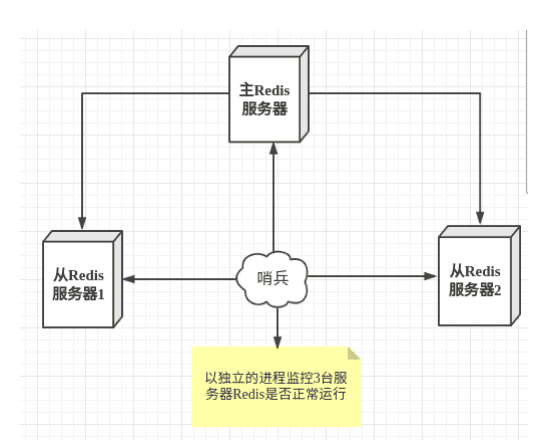

这里的哨兵有两个作用

- 通过发送命令，让 Redis 服务器返回监控其运行状态，包括主服务器和从服务器。
- 当哨兵监测到 `master` 宕机，会自动将 `slave` 切换成 `master`，然后通过 发布订阅模式 通知其他的从服务器，修改配置文件，让它们切换主机。

> 然而一个哨兵进程对 Redis 服务器进行监控，可能会出现问题，为此，我们可以使用多个哨兵进行监控。各个哨兵之间还会进行监控，这样就形成了多哨兵模式。


> 假设主服务器宕机，哨兵 1 先检测到这个结果，系统并不会马上进行 `failover` 过程，仅仅是哨兵 1 主观的认为主服务器不可用，这个现象成为 主观下线 。当后面的哨兵也检测到主服务器不可用，并且数量达到一定值时，那么哨兵之间就会进行一次投票，投票的结果由一个哨兵发起，进行 `failover`[故障转移]操作。切换成功后，就会通过发布订阅模式，让各个哨兵把自己监控的从服务器实现切换主机，这个过程称为客观下线 。

#### 配置测试

1. 调整结构， 6379 带着 80 、 81
2. 自定义的 `/myredis` 目录下新建 `sentinel.conf` 文件，名字千万不要错
3. 配置哨兵，填写内容
   - `sentinel monitor` 被监控主机名字 `127.0.0.1 6379 1`
   - 上面最后一个数字 1 ，表示主机挂掉后 `slave` 投票看让谁接替成为主机，得票数多少后成为主机
4. 启动哨兵
   - `Redis-sentinel /myredis/sentinel.conf`
   - 上述目录依照各自的实际情况配置，可能目录不同
5. 正常主从演示
6. 原有的 `Master` 挂了
7. 投票新选
8. 重新主从继续开工，`info replication` 查查看
9. 问题：如果之前的 `master` 重启回来，会不会双 `master` 冲突？ 之前的回来只能做小弟了

#### 哨兵模式的优缺点

**优点：**

- 哨兵集群模式是基于主从模式的，所有主从的优点，哨兵模式同样具有。
- 主从可以切换，故障可以转移，系统可用性更好。
-  哨兵模式是主从模式的升级，系统更健壮，可用性更高。

**缺点：**

- Redis 较难支持在线扩容，在集群容量达到上限时在线扩容会变得很复杂。
- 实现哨兵模式的配置也不简单，甚至可以说有些繁琐

#### 哨兵配置说明

```shell
# Example sentinel.conf

# 哨兵sentinel实例运行的端口 默认 26379
port 26379

# 哨兵sentinel的工作目录
dir /tmp

# 哨兵sentinel监控的redis主节点的 ip port
# master-name 可以自己命名的主节点名字 只能由字母A-z、数字0-9 、这三个字符".-_"组成。
# quorum 配置多少个sentinel哨兵统一认为master主节点失联 那么这时客观上认为主节点失联了
# sentinel monitor <master-name> <ip> <redis-port> <quorum>
sentinel monitor mymaster 127.0.0.1 6379 2

# 当在Redis实例中开启了requirepass foobared 授权密码 这样所有连接Redis实例的客户端都
要提供密码
# 设置哨兵sentinel 连接主从的密码 注意必须为主从设置一样的验证密码
# sentinel auth-pass <master-name> <password>
sentinel auth-pass mymaster MySUPER--secret-0123passw0rd

# 指定多少毫秒之后 主节点没有应答哨兵sentinel 此时 哨兵主观上认为主节点下线 默认 30 秒
# sentinel down-after-milliseconds <master-name> <milliseconds>
sentinel down-after-milliseconds mymaster 30000

# 这个配置项指定了在发生failover主备切换时最多可以有多少个slave同时对新的master进行 同步，这个数字越小，完成failover所需的时间就越长，但是如果这个数字越大，就意味着越 多的slave因为replication而不可用。可以通过将这个值设为 1 来保证每次只有一个slave 处于不能处理命令请求的状态。
# sentinel parallel-syncs <master-name> <numslaves>
sentinel parallel-syncs mymaster 1

# 故障转移的超时时间 failover-timeout 可以用在以下这些方面：
# 1. 同一个sentinel对同一个master两次failover之间的间隔时间。
# 2. 当一个slave从一个错误的master那里同步数据开始计算时间。直到slave被纠正为向正确的master那里同步数据时。
# 3.当想要取消一个正在进行的failover所需要的时间。
# 4.当进行failover时，配置所有slaves指向新的master所需的最大时间。不过，即使过了这个超时，slaves依然会被正确配置为指向master，但是就不按parallel-syncs所配置的规则来了
# 默认三分钟
# sentinel failover-timeout <master-name> <milliseconds>
sentinel failover-timeout mymaster 180000

# SCRIPTS EXECUTION

# 配置当某一事件发生时所需要执行的脚本，可以通过脚本来通知管理员，例如当系统运行不正常时发邮件通知相关人员。
# 对于脚本的运行结果有以下规则：
# 若脚本执行后返回 1 ，那么该脚本稍后将会被再次执行，重复次数目前默认为 10
# 若脚本执行后返回 2 ，或者比 2 更高的一个返回值，脚本将不会重复执行。
# 如果脚本在执行过程中由于收到系统中断信号被终止了，则同返回值为 1 时的行为相同。
# 一个脚本的最大执行时间为60s，如果超过这个时间，脚本将会被一个SIGKILL信号终止，之后重新执行。

# 通知型脚本:当sentinel有任何警告级别的事件发生时（比如说redis实例的主观失效和客观失效等等），将会去调用这个脚本，这时这个脚本应该通过邮件，SMS等方式去通知系统管理员关于系统不正常运行的信息。调用该脚本时，将传给脚本两个参数，一个是事件的类型，一个是事件的描述。如果sentinel.conf配置文件中配置了这个脚本路径，那么必须保证这个脚本存在于这个路径，并且是可执行的，否则sentinel无法正常启动成功。
# 通知脚本
# sentinel notification-script <master-name> <script-path>
sentinel notification-script mymaster /var/redis/notify.sh

# 客户端重新配置主节点参数脚本
# 当一个master由于failover而发生改变时，这个脚本将会被调用，通知相关的客户端关于master地址已经发生改变的信息。
# 以下参数将会在调用脚本时传给脚本:
# <master-name> <role> <state> <from-ip> <from-port> <to-ip> <to-port>
# 目前<state>总是“failover”,
# <role>是“leader”或者“observer”中的一个。
# 参数 from-ip, from-port, to-ip, to-port是用来和旧的master和新的master(即旧的slave)通信的
# sentinel client-reconfig-script <master-name> <script-path>
sentinel client-reconfig-script mymaster /var/redis/reconfig.sh
```

## 缓存穿透和雪崩

> Redis 缓存的使用，极大的提升了应用程序的性能和效率，特别是数据查询方面。但同时，它也带来了一些问题。其中，最要害的问题，就是数据的一致性问题，从严格意义上讲，这个问题无解。如果对数据的一致性要求很高，那么就不能使用缓存。
> 
> 另外的一些典型问题就是，缓存穿透、缓存雪崩和缓存击穿。目前，业界也都有比较流行的解决方案。

### 缓存穿透

#### 概念

> 缓存穿透的概念很简单，用户想要查询一个数据，发现 redis 内存数据库没有，也就是缓存没有命中，于是向持久层数据库查询。发现也没有，于是本次查询失败。当用户很多的时候，缓存都没有命中，于是都去请求了持久层数据库。这会给持久层数据库造成很大的压力，这时候就相当于出现了缓存穿透。

#### 布隆过滤器

> 布隆过滤器是一种数据结构，对所有可能查询的参数以 hash 形式存储，在控制层先进行校验，不符合则丢弃，从而避免了对底层存储系统的查询压力；

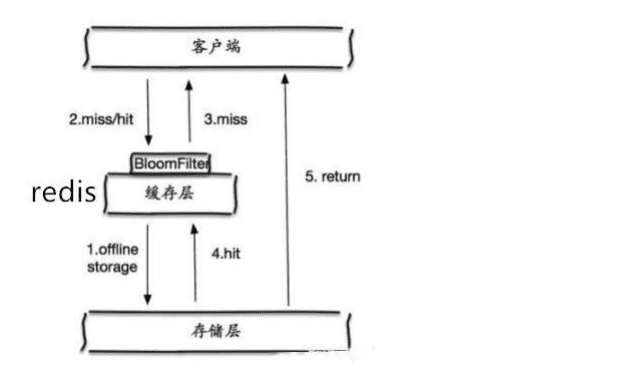

#### 缓存空对象

> 当存储层不命中后，即使返回的空对象也将其缓存起来，同时会设置一个过期时间，之后再访问这个数据将会从缓存中获取，保护了后端数据源；


**但是这种方法会存在两个问题：**

1. 如果空值能够被缓存起来，这就意味着缓存需要更多的空间存储更多的键，因为这当中可能会有很多的空值的键；
2. 即使对空值设置了过期时间，还是会存在缓存层和存储层的数据会有一段时间窗口的不一致，这对于需要保持一致性的业务会有影响。

### 缓存击穿

#### 概述

> 这里需要注意和缓存击穿的区别，缓存击穿，是指一个 key 非常热点，在不停的扛着大并发，大并发集中对这一个点进行访问，当这个 key 在失效的瞬间，持续的大并发就穿破缓存，直接请求数据库，就像在一个屏障上凿开了一个洞。
> 
> 当某个 key 在过期的瞬间，有大量的请求并发访问，这类数据一般是热点数据，由于缓存过期，会同时访问数据库来查询最新数据，并且回写缓存，会导使数据库瞬间压力过大。

#### 设置热点数据永不过期

从缓存层面来看，没有设置过期时间，所以不会出现热点 key 过期后产生的问题。

#### 加互斥锁

分布式锁：使用分布式锁，保证对于每个 key 同时只有一个线程去查询后端服务，其他线程没有获得分布式锁的权限，因此只需要等待即可。这种方式将高并发的压力转移到了分布式锁，因此对分布式锁的考验很大。

### 缓存雪崩

#### 概念

> 缓存雪崩，是指在某一个时间段，缓存集中过期失效。
> 
> 产生雪崩的原因之一，比如在写本文的时候，马上就要到双十二零点，很快就会迎来一波抢购，这波商品时间比较集中的放入了缓存，假设缓存一个小时。那么到了凌晨一点钟的时候，这批商品的缓存就都过期了。而对这批商品的访问查询，都落到了数据库上，对于数据库而言，就会产生周期性的压力波峰。于是所有的请求都会达到存储层，存储层的调用量会暴增，造成存储层也会挂掉的情况。

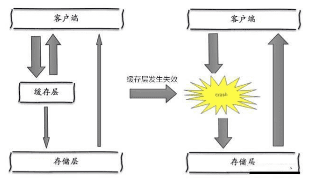

> 其实集中过期，倒不是非常致命，比较致命的缓存雪崩，是缓存服务器某个节点宕机或断网。因为自然形成的缓存雪崩，一定是在某个时间段集中创建缓存，这个时候，数据库也是可以顶住压力的。无非就是对数据库产生周期性的压力而已。而缓存服务节点的宕机，对数据库服务器造成的压力是不可预知的，很有可能瞬间就把数据库压垮。

#### redis 高可用

> 这个思想的含义是，既然 redis 有可能挂掉，那我多增设几台 redis，这样一台挂掉之后其他的还可以继续工作，其实就是搭建的集群。

#### 限流降级

> 这个解决方案的思想是，在缓存失效后，通过加锁或者队列来控制读数据库写缓存的线程数量。比如对某个 key 只允许一个线程查询数据和写缓存，其他线程等待。

#### 数据预热

> 数据加热的含义就是在正式部署之前，我先把可能的数据先预先访问一遍，这样部分可能大量访问的数据就会加载到缓存中。在即将发生大并发访问前手动触发加载缓存不同的 key，设置不同的过期时间，让缓存失效的时间点尽量均匀。

## Jedis

> Jedis 是 Redis 官方推荐的 Java 连接开发工具。要在 Java 开发中使用好 Redis 中间件，必须对 Jedis 熟悉才能写成漂亮的代码

### 测试联通

1. 新建一个普通的 Maven 项目
2. 导入 redis 的依赖！

```xml
<!-- https://mvnrepository.com/artifact/redis.clients/jedis -->
<dependency>
    <groupId>redis.clients</groupId>
    <artifactId>jedis</artifactId>
    <version>3.2.0</version>
</dependency>
<dependency>
<groupId>com.alibaba</groupId>
<artifactId>fastjson</artifactId>
<version>1.2.58</version>
</dependency>
```

3. 编写测试代码

```java
package com.kuang.ping;

import redis.clients.jedis.Jedis;

public class Ping {
    public static void main(String[] args) {
        Jedis jedis = new Jedis("127.0.0.1", 6379);
        System.out.println("连接成功");
        //查看服务是否运行
        System.out.println("服务正在运行: " + jedis.ping());
    }
}
```

4. 启动redis服务
5. 启动测试，结果

```shell
# 连接成功
# 服务正在运行:PONG
```

### 常用 API

#### 基本操作

```java
public class TestPassword {
    public static void main(String[] args) {
        Jedis jedis = new Jedis("127.0.0.1", 6379);
        //验证密码，如果没有设置密码这段代码省略
        // jedis.auth("password");
        jedis.connect(); //连接
        jedis.disconnect(); //断开连接
        jedis.flushAll(); //清空所有的key
    }
}
```

#### key

| 方法                         | 描述                           |
| ---------------------------- | ------------------------------ |
| `flushDB()`                  | 清空当前选择数据库中的所有数据 |
| `exists("key")`              | 判断指定键是否存在             |
| `set("key", "value")`        | 新增或修改指定键的值           |
| `keys("*")`                  | 获取系统中所有的键             |
| `del("key")`                 | 删除指定键及其对应的值         |
| `type("key")`                | 获取指定键对应的值的类型       |
| `randomKey()`                | 随机返回一个键                 |
| `rename("oldKey", "newKey")` | 重命名指定键                   |
| `get("key")`                 | 获取指定键对应的值             |
| `select(index)`              | 选择指定索引的数据库           |
| `dbSize()`                   | 返回当前选择数据库中键的数量   |
| `flushAll()`                 | 删除所有数据库中的所有键和值   |

```java
public class TestKey {
    public static void main(String[] args) {
        Jedis jedis = new Jedis("127.0.0.1", 6379);

        System.out.println("清空数据：" + jedis.flushDB());
        System.out.println("判断某个键是否存在：" + jedis.exists("username"));
        System.out.println("新增<'username','kuangshen'>的键值对：" + jedis.set("username", "kuangshen"));
        System.out.println("新增<'password','password'>的键值对：" + jedis.set("password", "password"));
        System.out.print("系统中所有的键如下：");
        Set<String> keys = jedis.keys("*");
        System.out.println(keys);
        System.out.println("删除键password:" + jedis.del("password"));
        System.out.println("判断键password是否存在：" + jedis.exists("password"));
        System.out.println("查看键username所存储的值的类型：" + jedis.type("username"));
        System.out.println("随机返回key空间的一个：" + jedis.randomKey());
        System.out.println("重命名key：" + jedis.rename("username", "name"));
        System.out.println("取出改后的name：" + jedis.get("name"));
        System.out.println("按索引查询：" + jedis.select(0));
        System.out.println("删除当前选择数据库中的所有key：" + jedis.flushDB());
        System.out.println("返回当前数据库中key的数目：" + jedis.dbSize());
        System.out.println("删除所有数据库中的所有key：" + jedis.flushAll());
    }
}
```

#### String

| 方法                                                               | 描述                                                 |
| ------------------------------------------------------------------ | ---------------------------------------------------- |
| `set("key1", "value1")`                                            | 新增或修改指定键的值为 "value1"                      |
| `del("key01", "key02")`                                            | 删除多个键及其对应的值                               |
| `get("key1")`                                                      | 获取键 "key1" 对应的值（超过有效时间，返回 null）    |
| `append("key3", "End")`                                            | 在键 "key3" 的值后面追加 "End"                       |
| `mset("key01", "value01", "key02", "value02", "key03", "value03")` | 批量设置多个键值对                                   |
| `mget("key01", "key02", "key03")`                                  | 获取多个键对应的值                                   |
| `setnx("key1", "value1")`                                          | 当键 "key1" 不存在时，新增键值对                     |
| `setex("key3", 2, "value3")`                                       | 新增键值对，并设置有效时间为 2 秒                    |
| `getSet("key2", "key2GetSet")`                                     | 获取键 "key2" 的原值，并将其更新为 "key2GetSet"      |
| `getrange("key2", 2, 4)`                                           | 获取键 "key2" 的值的子串，起始位置为 2，结束位置为 4 |

```java
public class TestString {
    public static void main(String[] args) {
        Jedis jedis = new Jedis("127.0.0.1", 6379);

        jedis.flushDB();
        System.out.println("===========增加数据===========");
        System.out.println(jedis.set("key1", "value1"));
        System.out.println(jedis.set("key2", "value2"));
        System.out.println(jedis.set("key3", "value3"));

        System.out.println("删除键key2:" + jedis.del("key2"));
        System.out.println("获取键key2:" + jedis.get("key2"));
        System.out.println("修改key1:" + jedis.set("key1", "value1Changed"));
        System.out.println("获取key1的值：" + jedis.get("key1"));
        System.out.println("在key3后面加入值：" + jedis.append("key3", "End"));
        System.out.println("key3的值：" + jedis.get("key3"));
        System.out.println("增加多个键值对：" + jedis.mset("key01", "value01", "key02", "value02", "key03", "value03"));
        System.out.println("获取多个键值对：" + jedis.mget("key01", "key02", "key03"));
        System.out.println("获取多个键值对：" + jedis.mget("key01", "key02", "key03", "key04"));
        System.out.println("删除多个键值对：" + jedis.del("key01", "key02"));
        System.out.println("获取多个键值对：" + jedis.mget("key01", "key02", "key03"));

        jedis.flushDB();
        System.out.println("===========新增键值对防止覆盖原先值==============");
        System.out.println(jedis.setnx("key1", "value1"));
        System.out.println(jedis.setnx("key2", "value2"));
        System.out.println(jedis.setnx("key2", "value2-new"));
        System.out.println(jedis.get("key1"));
        System.out.println(jedis.get("key2"));

        System.out.println("===========新增键值对并设置有效时间=============");
        System.out.println(jedis.setex("key3", 2, "value3"));
        System.out.println(jedis.get("key3"));
        try {
            TimeUnit.SECONDS.sleep(3);
        } catch (InterruptedException e) {
            e.printStackTrace();
        }
        System.out.println(jedis.get("key3"));

        System.out.println("===========获取原值，更新为新值==========");
        System.out.println(jedis.getSet("key2", "key2GetSet"));
        System.out.println(jedis.get("key2"));

        System.out.println("获得key2的值的字串：" + jedis.getrange("key2", 2, 4));
    }
}
```

#### List

| 方法                                                                                              | 描述                                                                  |
| ------------------------------------------------------------------------------------------------- | --------------------------------------------------------------------- |
| `lpush("collections", "ArrayList", "Vector", "Stack", "HashMap", "WeakHashMap", "LinkedHashMap")` | 在列表左侧添加多个元素                                                |
| `lrange("collections", 0, num)`                                                                   | `num = -1`：获取列表中所有元素，`num != -1`：获取列表中指定区间的元素 |
| `lrem("collections", 2, "HashMap")`                                                               | 删除列表中指定元素的个数                                              |
| `ltrim("collections", 0, 3)`                                                                      | 删除列表中指定区间之外的元素                                          |
| `lpop("collections")`                                                                             | 列表左侧出栈                                                          |
| `rpush("collections", "EnumMap")`                                                                 | 在列表右侧添加单个元素                                                |
| `rpop("collections")`                                                                             | 列表右侧出栈                                                          |
| `lset("collections", 1, "LinkedArrayList")`                                                       | 修改列表指定下标的元素内容                                            |
| `llen("collections")`                                                                             | 获取列表的长度                                                        |
| `lindex("collections", 2)`                                                                        | 获取列表指定下标的元素                                                |
| `lpush("sortedList", "3", "6", "2", "0", "7", "4")`                                               | 在排序列表左侧添加多个元素                                            |
| `sort("sortedList")`                                                                              | 对排序列表进行排序                                                    |

```java
public class TestList {
    public static void main(String[] args) {
        Jedis jedis = new Jedis("127.0.0.1", 6379);
        jedis.flushDB();
        System.out.println("===========添加一个list===========");
        jedis.lpush("collections", "ArrayList", "Vector", "Stack", "HashMap", "WeakHashMap", "LinkedHashMap");
        jedis.lpush("collections", "HashSet");
        jedis.lpush("collections", "TreeSet");
        jedis.lpush("collections", "TreeMap");
        System.out.println("collections的内容：" + jedis.lrange("collections", 0, -1));//-1代表倒数第一个元素，-2代表倒数第二个元素,end为-1表示查询全部

        System.out.println("collections区间0-3的元素：" + jedis.lrange("collections", 0, 3));
        System.out.println("===============================");
        // 删除列表指定的值 ，第二个参数为删除的个数（有重复时），后add进去的值先被删，类似于出栈
        System.out.println("删除指定元素个数：" + jedis.lrem("collections", 2, "HashMap"));
        System.out.println("collections的内容：" + jedis.lrange("collections", 0, -1));
        System.out.println("删除下表0-3区间之外的元素：" + jedis.ltrim("collections", 0, 3));
        System.out.println("collections的内容：" + jedis.lrange("collections", 0, -1));
        System.out.println("collections列表出栈（左端）：" + jedis.lpop("collections"));
        System.out.println("collections的内容：" + jedis.lrange("collections", 0, -1));
        System.out.println("collections添加元素，从列表右端，与lpush相对应：" + jedis.rpush("collections", "EnumMap"));
        System.out.println("collections的内容：" + jedis.lrange("collections", 0, -1));
        System.out.println("collections列表出栈（右端）：" + jedis.rpop("collections"));
        System.out.println("collections的内容：" + jedis.lrange("collections", 0, -1));
        System.out.println("修改collections指定下标 1 的内容：" + jedis.lset("collections", 1, "LinkedArrayList"));
        System.out.println("collections的内容：" + jedis.lrange("collections", 0, -1));
        System.out.println("===============================");
        System.out.println("collections的长度：" + jedis.llen("collections"));
        System.out.println("获取collections下标为 2 的元素：" + jedis.lindex("collections", 2));
        System.out.println("===============================");
        jedis.lpush("sortedList", "3", "6", "2", "0", "7", "4");
        System.out.println("sortedList排序前：" + jedis.lrange("sortedList", 0, -1));
        System.out.println(jedis.sort("sortedList"));
        System.out.println("sortedList排序后：" + jedis.lrange("sortedList", 0, -1));
    }
}
```

#### Set

| 方法                                   | 描述                                           |
| -------------------------------------- | ---------------------------------------------- |
| `sadd(key, member1, member2, ...)`     | 向集合中添加元素，不重复                       |
| `smembers(key)`                        | 获取集合中所有元素                             |
| `srem(key, member1, member2, ...)`     | 从集合中删除一个或多个元素                     |
| `spop(key)`                            | 随机移除集合中的一个元素                       |
| `scard(key)`                           | 返回集合中元素的数量                           |
| `sismember(key, member)`               | 判断元素是否在集合中                           |
| `smove(srcKey, dstKey, member)`        | 将集合srcKey中的元素member移到集合dstKey中     |
| `sinter(key1, key2, ...)`              | 返回多个集合的交集                             |
| `sunion(key1, key2, ...)`              | 返回多个集合的并集                             |
| `sdiff(key1, key2, ...)`               | 返回多个集合的差集                             |
| `sinterstore(dstKey, key1, key2, ...)` | 求多个集合的交集，并将结果保存到dstKey的集合中 |

```java
public class TestSet {
    public static void main(String[] args) {
        Jedis jedis = new Jedis("127.0.0.1", 6379);
        jedis.flushDB();
        System.out.println("============向集合中添加元素（不重复）============");
        System.out.println(jedis.sadd("eleSet", "e1", "e2", "e4", "e3", "e0", "e8", "e7", "e5"));
        System.out.println(jedis.sadd("eleSet", "e6"));
        System.out.println(jedis.sadd("eleSet", "e6"));
        System.out.println("eleSet的所有元素为：" + jedis.smembers("eleSet"));
        System.out.println("删除一个元素e0：" + jedis.srem("eleSet", "e0"));

        System.out.println("eleSet的所有元素为：" + jedis.smembers("eleSet"));
        System.out.println("删除两个元素e7和e6：" + jedis.srem("eleSet", "e7", "e6"));
        System.out.println("eleSet的所有元素为：" + jedis.smembers("eleSet"));
        System.out.println("随机的移除集合中的一个元素：" + jedis.spop("eleSet"));
        System.out.println("随机的移除集合中的一个元素：" + jedis.spop("eleSet"));
        System.out.println("eleSet的所有元素为：" + jedis.smembers("eleSet"));
        System.out.println("eleSet中包含元素的个数：" + jedis.scard("eleSet"));
        System.out.println("e3是否在eleSet中：" + jedis.sismember("eleSet", "e3"));
        System.out.println("e1是否在eleSet中：" + jedis.sismember("eleSet", "e1"));
        System.out.println("e1是否在eleSet中：" + jedis.sismember("eleSet", "e5"));
        System.out.println("=================================");
        System.out.println(jedis.sadd("eleSet1", "e1", "e2", "e4", "e3", "e0", "e8", "e7", "e5"));
        System.out.println(jedis.sadd("eleSet2", "e1", "e2", "e4", "e3", "e0", "e8"));
        System.out.println("将eleSet1中删除e1并存入eleSet3中：" + jedis.smove("eleSet1", "eleSet3", "e1"));//移到集合元素
        System.out.println("将eleSet1中删除e2并存入eleSet3中：" + jedis.smove("eleSet1", "eleSet3", "e2"));
        System.out.println("eleSet1中的元素：" + jedis.smembers("eleSet1"));
        System.out.println("eleSet3中的元素：" + jedis.smembers("eleSet3"));
        System.out.println("============集合运算=================");
        System.out.println("eleSet1中的元素：" + jedis.smembers("eleSet1"));
        System.out.println("eleSet2中的元素：" + jedis.smembers("eleSet2"));
        System.out.println("eleSet1和eleSet2的交集:" + jedis.sinter("eleSet1", "eleSet2"));
        System.out.println("eleSet1和eleSet2的并集:" + jedis.sunion("eleSet1", "eleSet2"));
        System.out.println("eleSet1和eleSet2的差集:" + jedis.sdiff("eleSet1", "eleSet2"));//eleSet1中有，eleSet2中没有
        jedis.sinterstore("eleSet4", "eleSet1", "eleSet2");//求交集并将交集保存到dstkey的集合
        System.out.println("eleSet4中的元素：" + jedis.smembers("eleSet4"));
    }
}
```

#### Hash

| 方法                                   | 描述                                                 |
| -------------------------------------- | ---------------------------------------------------- |
| `jedis.hmset("hash", map)`             | 添加名称为hash的hash元素                             |
| `jedis.hmget("hash", "key3", "key4")`  | 获取hash中的值                                       |
| `jedis.hset("hash", "key5", "value5")` | 向名称为hash的hash中添加key为key5，value为value5元素 |
| `jedis.hgetAll("hash")`                | 获取散列hash的所有键值对                             |
| `jedis.hkeys("hash")`                  | 获取散列hash的所有键                                 |
| `jedis.hvals("hash")`                  | 获取散列hash的所有值                                 |
| `jedis.hincrBy("hash", "key6", 6)`     | 将key6保存的值加上一个整数，如果key6不存在则添加key6 |
| `jedis.hdel("hash", "key2")`           | 删除一个或者多个键值对                               |
| `jedis.hlen("hash")`                   | 获取散列hash中键值对的个数                           |
| `jedis.hexists("hash", "key2")`        | 判断hash中是否存在key2                               |

```java
public class TestHash {
    public static void main(String[] args) {
        Jedis jedis = new Jedis("127.0.0.1", 6379);
        jedis.flushDB();
        Map<String, String> map = new HashMap<>();
        map.put("key1", "value1");
        map.put("key2", "value2");
        map.put("key3", "value3");
        map.put("key4", "value4");
        //添加名称为hash（key）的hash元素
        jedis.hmset("hash", map);
        //向名称为hash的hash中添加key为key5，value为value5元素
        jedis.hset("hash", "key5", "value5");
        System.out.println("散列hash的所有键值对为：" + jedis.hgetAll("hash"));//return Map<String,String>

        System.out.println("散列hash的所有键为：" + jedis.hkeys("hash"));//return
        Set<String>
        System.out.println("散列hash的所有值为：" + jedis.hvals("hash"));//return
        List<String>
        System.out.println("将key6保存的值加上一个整数，如果key6不存在则添加key6：" + jedis.hincrBy("hash", "key6", 6));
        System.out.println("散列hash的所有键值对为：" + jedis.hgetAll("hash"));
        System.out.println("将key6保存的值加上一个整数，如果key6不存在则添加key6：" + jedis.hincrBy("hash", "key6", 3));
        System.out.println("散列hash的所有键值对为：" + jedis.hgetAll("hash"));
        System.out.println("删除一个或者多个键值对：" + jedis.hdel("hash", "key2"));
        System.out.println("散列hash的所有键值对为：" + jedis.hgetAll("hash"));
        System.out.println("散列hash中键值对的个数：" + jedis.hlen("hash"));
        System.out.println("判断hash中是否存在key2：" + jedis.hexists("hash", "key2"));
        System.out.println("判断hash中是否存在key3：" + jedis.hexists("hash", "key3"));
        System.out.println("获取hash中的值：" + jedis.hmget("hash", "key3"));
        System.out.println("获取hash中的值：" + jedis.hmget("hash", "key3", "key4"));
    }
}
```

### 事务

| 方法               | 描述                                                         |
| ------------------ | ------------------------------------------------------------ |
| `jedis.multi()`    | 开启事务                                                     |
| `multi.exec()`     | 执行进入队列的命令                                           |
| `multi.discard()`  | 出现异常，回滚                                               |
| `multi.watch(key)` | 监视key，如果在事务执行之前key被其他命令所改动，则事务被打断 |

```java
package com.kuang.multi;

import com.alibaba.fastjson.JSONObject;
import redis.clients.jedis.Jedis;
import redis.clients.jedis.Transaction;

public class TestMulti {
    public static void main(String[] args) {
        //创建客户端连接服务端，redis服务端需要被开启
        Jedis jedis = new Jedis("127.0.0.1", 6379);
        jedis.flushDB();

        JSONObject jsonObject = new JSONObject();
        jsonObject.put("hello", "world");
        jsonObject.put("name", "java");
        //开启事务
        Transaction multi = jedis.multi();
        String result = jsonObject.toJSONString();
        try {
            //向redis存入一条数据
            multi.set("json", result);
            //再存入一条数据
            multi.set("json2", result);
            //这里引发了异常，用 0 作为被除数
            int i = 100 / 0;
            //如果没有引发异常，执行进入队列的命令
            multi.exec();
        } catch (Exception e) {
            e.printStackTrace();
            //如果出现异常，回滚
            multi.discard();
        } finally {
            System.out.println(jedis.get("json"));
            System.out.println(jedis.get("json2"));
            //最终关闭客户端
            jedis.close();
        }
    }
}
```

## SpringBoot 整合

### 基础使用

> 在 SpringBoot 中一般使用 RedisTemplate 提供的方法来操作 Redis。

- `JedisPoolConfig` (这个是配置连接池)
- `RedisConnectionFactory` 这个是配置连接信息，这里的 `RedisConnectionFactory` 是一个接口，我们需要使用它的实现类，在 SpringD Data Redis 方案中提供了以下四种工厂模型：
  - `JredisConnectionFactory`
  - `JedisConnectionFactory`
  - `LettuceConnectionFactory`
  - `SrpConnectionFactory`
- `RedisTemplate` 基本操作

1. 导入依赖

```xml
<dependency>
    <groupId>org.springframework.boot</groupId>
    <artifactId>spring-boot-starter-data-redis</artifactId>
</dependency>
```

2. yaml 配置

```yml
spring:
  redis:
    host: 127.0.0.1
    port: 6379
    password: 123456
    jedis:
      pool:
        max-active: 8
        max-wait: -1ms
        max-idle: 500
        min-idle: 0
    lettuce:
    shutdown-timeout: 0ms
```

3. 测试

```java
@SpringBootTest
class SpringbootRedisApplicationTests {
    @Autowired
    private RedisTemplate<String, String> redisTemplate;
    @Test
    void contextLoads() {
        redisTemplate.opsForValue().set("myKey", "myValue");
        System.out.println(redisTemplate.opsForValue().get("myKey"));
    }
}
```

### 封装工具类

1. 新建一个 SpringBoot 项目
2. 导入 redis 的启动器

```xml
<dependency>
    <groupId>org.springframework.boot</groupId>
    <artifactId>spring-boot-starter-data-redis</artifactId>
</dependency>
```

3. 配置 redis，可以查看 `RedisProperties` 分析

```yml
# Redis服务器地址
spring.redis.host=127.0.0.1
# Redis服务器连接端口
spring.redis.port= 6379
```

4. 分析 `RedisAutoConfiguration` 自动配置类

```java
@Configuration(proxyBeanMethods = false)
@ConditionalOnClass(RedisOperations.class)
@EnableConfigurationProperties(RedisProperties.class)
@Import({LettuceConnectionConfiguration.class, JedisConnectionConfiguration.class})
public class RedisAutoConfiguration {
    @Bean
    @ConditionalOnMissingBean(name = "redisTemplate")
    public RedisTemplate<Object, Object>
    redisTemplate(RedisConnectionFactory redisConnectionFactory) throws UnknownHostException {
        RedisTemplate<Object, Object> template = new RedisTemplate<>();
        template.setConnectionFactory(redisConnectionFactory);
        return template;
    }

    @Bean
    @ConditionalOnMissingBean
    public StringRedisTemplate stringRedisTemplate(RedisConnectionFactory redisConnectionFactory) throws UnknownHostException {
        StringRedisTemplate template = new StringRedisTemplate();
        template.setConnectionFactory(redisConnectionFactory);
        return template;
    }
}
```

> 通过源码可以看出，SpringBoot 自动帮我们在容器中生成了一个 `RedisTemplate` 和一个 `StringRedisTemplate。`<br/>
> 但是，这个 `RedisTemplate` 的泛型是`<Object,Object>`，写代码不方便，需要写好多类型转换的代码；我们需要一个泛型为`<String,Object>`形式的 `RedisTemplate。`<br/>
> 并且，这个 `RedisTemplate` 没有设置数据存在 Redis 时，key 及 value 的序列化方式。<br/>
> 看到这个`@ConditionalOnMissingBean` 注解后，就知道如果 Spring 容器中有了 `RedisTemplate` 对象了，这个自动配置的 `RedisTemplate` 不会实例化。因此我们可以直接自己写个配置类，配置 `RedisTemplate。`

5. 既然自动配置不好用，就重新配置一个 `RedisTemplate`

```java
package com.kuang.config;

import com.fasterxml.jackson.annotation.JsonAutoDetect;
import com.fasterxml.jackson.annotation.PropertyAccessor;
import com.fasterxml.jackson.databind.ObjectMapper;
import org.springframework.context.annotation.Bean;
import org.springframework.context.annotation.Configuration;
import org.springframework.data.redis.connection.RedisConnectionFactory;
import org.springframework.data.redis.core.RedisTemplate;
import org.springframework.data.redis.serializer.Jackson2JsonRedisSerializer;
import org.springframework.data.redis.serializer.StringRedisSerializer;

@Configuration
public class RedisConfig {

    @Bean
    @SuppressWarnings("all")
    public RedisTemplate<String, Object> redisTemplate(RedisConnectionFactory factory) {
        RedisTemplate<String, Object> template = new RedisTemplate<String, Object>();
        template.setConnectionFactory(factory);
        Jackson2JsonRedisSerializer jackson2JsonRedisSerializer = new Jackson2JsonRedisSerializer(Object.class);
        ObjectMapper om = new ObjectMapper();
        om.setVisibility(PropertyAccessor.ALL, JsonAutoDetect.Visibility.ANY);
        om.enableDefaultTyping(ObjectMapper.DefaultTyping.NON_FINAL);
        jackson2JsonRedisSerializer.setObjectMapper(om);
        StringRedisSerializer stringRedisSerializer = new StringRedisSerializer();

        // key采用String的序列化方式
        template.setKeySerializer(stringRedisSerializer);
        // hash的key也采用String的序列化方式
        template.setHashKeySerializer(stringRedisSerializer);
        // value序列化方式采用jackson
        template.setValueSerializer(jackson2JsonRedisSerializer);
        // hash的value序列化方式采用jackson
        template.setHashValueSerializer(jackson2JsonRedisSerializer);
        template.afterPropertiesSet();
        return template;
    }
}
```

7. 写一个 Redis 工具类（直接用 `RedisTemplate` 操作 Redis，需要很多行代码，因此直接封装好一个 `RedisUtils`，这样写代码更方便点。这个`RedisUtils` 交给 Spring 容器实例化，使用时直接注解注入。）

```java
package com.kuang.utils;

import org.springframework.beans.factory.annotation.Autowired;
import org.springframework.data.redis.core.RedisTemplate;
import org.springframework.stereotype.Component;
import org.springframework.util.CollectionUtils;

import java.util.List;
import java.util.Map;
import java.util.Set;
import java.util.concurrent.TimeUnit;

@Component
public final class RedisUtil {

    @Autowired
    private RedisTemplate<String, Object> redisTemplate;
// =============================common============================

    /**
     * 指定缓存失效时间
     * @param key 键
     * @param time 时间(秒)
     */
    public boolean expire(String key, long time) {
        try {
            if (time > 0) {
                redisTemplate.expire(key, time, TimeUnit.SECONDS);
            }
            return true;
        } catch (Exception e) {
            e.printStackTrace();
            return false;
        }
    }

    /**
     * 根据key 获取过期时间
     * @param key 键 不能为null
     * @return 时间(秒) 返回 0 代表为永久有效
     */
    public long getExpire(String key) {
        return redisTemplate.getExpire(key, TimeUnit.SECONDS);
    }

    /**
     * 判断key是否存在
     * @param key 键
     * @return true 存在 false不存在
     */
    public boolean hasKey(String key) {
        try {
            return redisTemplate.hasKey(key);
        } catch (Exception e) {
            e.printStackTrace();
            return false;
        }
    }

    /**
     * 删除缓存
     * @param key 可以传一个值 或多个
     */
    @SuppressWarnings("unchecked")
    public void del(String... key) {
        if (key != null && key.length > 0) {
            if (key.length == 1) {
                redisTemplate.delete(key[0]);
            } else {
                redisTemplate.delete(CollectionUtils.arrayToList(key));
            }
        }
    }
// ============================String=============================

    /**
     * 普通缓存获取
     * @param key 键
     * @return 值
     */
    public Object get(String key) {
        return key == null ? null : redisTemplate.opsForValue().get(key);
    }

    /**
     * 普通缓存放入
     * @param key 键
     * @param value 值
     * @return true成功 false失败
     */
    public boolean set(String key, Object value) {
        try {
            redisTemplate.opsForValue().set(key, value);
            return true;
        } catch (Exception e) {
            e.printStackTrace();
            return false;
        }
    }

    /**
     普通缓存放入并设置时间
     * @param key 键
     * @param value 值
     * @param time 时间(秒) time要大于 0 如果time小于等于 0 将设置无限期
     * @return true成功 false 失败
     */
    public boolean set(String key, Object value, long time) {
        try {
            if (time > 0) {
                redisTemplate.opsForValue().set(key, value, time,
                        TimeUnit.SECONDS);
            } else {
                set(key, value);
            }
            return true;
        } catch (Exception e) {
            e.printStackTrace();
            return false;
        }
    }

    /**
     递增
     * @param key 键
     * @param delta 要增加几(大于0)
     */
    public long incr(String key, long delta) {
        if (delta < 0) {
            throw new RuntimeException("递增因子必须大于0");
        }
        return redisTemplate.opsForValue().increment(key, delta);
    }

    /**
     * 递减
     * @param key 键
     * @param delta 要减少几(小于0)
     */
    public long decr(String key, long delta) {
        if (delta < 0) {
            throw new RuntimeException("递减因子必须大于0");
        }
        return redisTemplate.opsForValue().increment(key, -delta);
    }

// ================================Map=================================

    /**
     * HashGet
     * @param key 键 不能为null
     * @param item 项 不能为null
     */
    public Object hget(String key, String item) {
        return redisTemplate.opsForHash().get(key, item);
    }

    /**
     * 获取hashKey对应的所有键值
     * @param key 键
     * @return 对应的多个键值
     */
    public Map<Object, Object> hmget(String key) {
        return redisTemplate.opsForHash().entries(key);
    }

    /**
     * HashSet
     * @param key 键
     * @param map 对应多个键值
     */
    public boolean hmset(String key, Map<String, Object> map) {
        try {
            redisTemplate.opsForHash().putAll(key, map);
            return true;
        } catch (Exception e) {
            e.printStackTrace();
            return false;
        }
    }

    /**
     * HashSet 并设置时间
     * @param key 键
     * @param map 对应多个键值
     * @param time 时间(秒)
     * @return true成功 false失败
     */
    public boolean hmset(String key, Map<String, Object> map, long time) {
        try {
            redisTemplate.opsForHash().putAll(key, map);
            if (time > 0) {
                expire(key, time);
            }
            return true;
        } catch (Exception e) {
            e.printStackTrace();
            return false;
        }
    }

    /**
     * 向一张hash表中放入数据,如果不存在将创建
     *
     * @param key 键
     * @param item 项
     * @param value 值
     * @return true 成功 false失败
     */
    public boolean hset(String key, String item, Object value) {
        try {
            redisTemplate.opsForHash().put(key, item, value);
            return true;
        } catch (Exception e) {
            e.printStackTrace();
            return false;
        }
    }

    /**
     * 向一张hash表中放入数据,如果不存在将创建
     *
     * @param key 键
     * @param item 项
     * @param value 值
     * @param time 时间(秒) 注意:如果已存在的hash表有时间,这里将会替换原有的时间
     * @return true 成功 false失败
     */
    public boolean hset(String key, String item, Object value, long time) {
        try {
            redisTemplate.opsForHash().put(key, item, value);
            if (time > 0) {
                expire(key, time);
            }
            return true;
        } catch (Exception e) {
            e.printStackTrace();
            return false;
        }
    }

    /**
     * 删除hash表中的值
     *
     * @param key 键 不能为null
     * @param item 项 可以使多个 不能为null
     */
    public void hdel(String key, Object... item) {
        redisTemplate.opsForHash().delete(key, item);
    }

    /**
     * 判断hash表中是否有该项的值
     *
     * @param key 键 不能为null
     * @param item 项 不能为null
     * @return true 存在 false不存在
     */
    public boolean hHasKey(String key, String item) {
        return redisTemplate.opsForHash().hasKey(key, item);
    }

    /**
     * hash递增 如果不存在,就会创建一个 并把新增后的值返回
     *
     * @param key 键
     * @param item 项
     * @param by 要增加几(大于0)
     */
    public double hincr(String key, String item, double by) {
        return redisTemplate.opsForHash().increment(key, item, by);
    }

    /**
     * hash递减
     *
     * @param key 键
     * @param item 项
     * @param by 要减少记(小于0)
     */
    public double hdecr(String key, String item, double by) {
        return redisTemplate.opsForHash().increment(key, item, -by);
    }
// ============================set=============================

    /**
     * 根据key获取Set中的所有值
     * @param key 键
     */
    public Set<Object> sGet(String key) {
        try {
            return redisTemplate.opsForSet().members(key);
        } catch (Exception e) {
            e.printStackTrace();
            return null;
        }
    }

    /**
     * 根据value从一个set中查询,是否存在
     *
     * @param key 键
     * @param value 值
     * @return true 存在 false不存在
     */
    public boolean sHasKey(String key, Object value) {
        try {
            return redisTemplate.opsForSet().isMember(key, value);
        } catch (Exception e) {
            e.printStackTrace();
            return false;
        }
    }

    /**
     * 将数据放入set缓存
     *
     * @param key 键
     * @param values 值 可以是多个
     * @return 成功个数
     */
    public long sSet(String key, Object... values) {
        try {
            return redisTemplate.opsForSet().add(key, values);
        } catch (Exception e) {
            e.printStackTrace();
            return 0;
        }
    }

    /**
     * 将set数据放入缓存
     *
     * @param key 键
     * @param time 时间(秒)
     * @param values 值 可以是多个
     * @return 成功个数
     */
    public long sSetAndTime(String key, long time, Object... values) {
        try {
            Long count = redisTemplate.opsForSet().add(key, values);
            if (time > 0)
                expire(key, time);
            return count;
        } catch (Exception e) {
            e.printStackTrace();
            return 0;
        }
    }

    /**
     * 获取set缓存的长度
     * @param key 键
     */
    public long sGetSetSize(String key) {
        try {
            return redisTemplate.opsForSet().size(key);
        } catch (Exception e) {
            e.printStackTrace();
            return 0;
        }
    }

    /**
     * 移除值为value的
     *
     * @param key 键
     * @param values 值 可以是多个
     * @return 移除的个数
     */

    public long setRemove(String key, Object... values) {
        try {
            Long count = redisTemplate.opsForSet().remove(key, values);
            return count;
        } catch (Exception e) {
            e.printStackTrace();
            return 0;
        }
    }
// ===============================list=================================

    /**
     * 获取list缓存的内容
     *
     * @param key 键
     * @param start 开始
     * @param end 结束 0 到 -1代表所有值
     */
    public List<Object> lGet(String key, long start, long end) {
        try {
            return redisTemplate.opsForList().range(key, start, end);
        } catch (Exception e) {
            e.printStackTrace();
            return null;
        }
    }

    /**
     * 获取list缓存的长度
     *
     * @param key 键
     */
    public long lGetListSize(String key) {
        try {
            return redisTemplate.opsForList().size(key);
        } catch (Exception e) {
            e.printStackTrace();
            return 0;
        }
    }

    /**
     * 通过索引 获取list中的值
     *
     * @param key 键
     * @param index 索引 index>=0时， 0 表头， 1 第二个元素，依次类推；index<0
    时，-1，表尾，-2倒数第二个元素，依次类推
     */
    public Object lGetIndex(String key, long index) {
        try {
            return redisTemplate.opsForList().index(key, index);
        } catch (Exception e) {
            e.printStackTrace();
            return null;
        }
    }

    /**
     * 将list放入缓存
     *
     * @param key 键
     * @param value 值
     */
    public boolean lSet(String key, Object value) {
        try {
            redisTemplate.opsForList().rightPush(key, value);
            return true;
        } catch (Exception e) {
            e.printStackTrace();
            return false;
        }
    }

    /**
     * 将list放入缓存
     * @param key 键
     * @param value 值
     * @param time 时间(秒)
     */
    public boolean lSet(String key, Object value, long time) {
        try {
            redisTemplate.opsForList().rightPush(key, value);
            if (time > 0)
                expire(key, time);
            return true;
        } catch (Exception e) {
            e.printStackTrace();
            return false;
        }
    }

    /**
     * 将list放入缓存
     *
     * @param key 键
     * @param value 值
     * @return
     */
    public boolean lSet(String key, List<Object> value) {
        try {
            redisTemplate.opsForList().rightPushAll(key, value);
            return true;
        } catch (Exception e) {
            e.printStackTrace();
            return false;
        }
    }

    /**
     * 将list放入缓存
     *
     * @param key 键
     * @param value 值
     * @param time 时间(秒)
     * @return
     */
    public boolean lSet(String key, List<Object> value, long time) {
        try {
            redisTemplate.opsForList().rightPushAll(key, value);
            if (time > 0)
                expire(key, time);
            return true;
        } catch (Exception e) {
            e.printStackTrace();
            return false;
        }
    }

    /**
     * 根据索引修改list中的某条数据
     *
     * @param key 键
     * @param index 索引
     * @param value 值
     * @return
     */
    public boolean lUpdateIndex(String key, long index, Object value) {
        try {
            redisTemplate.opsForList().set(key, index, value);
            ren true;
        } catch (Exception e) {
            e.printStackTrace();
            return false;
        }
    }

    /**
     * 移除N个值为value
     *
     * @param key 键
     * @param count 移除多少个
     * @param value 值
     * @return 移除的个数
     */
    public long lRemove(String key, long count, Object value) {
        try {
            Long remove = redisTemplate.opsForList().remove(key, count, value);
            return remove;
        } catch (Exception e) {
            e.printStackTrace();
            return 0;
        }
    }
}
```
