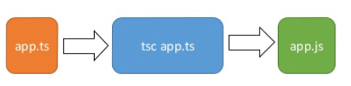

# TypeScript

TypeScript 是 JavaScript 的一个超集，支持 ECMAScript 6 标准。

TypeScript 由微软开发的自由和开源的编程语言。

TypeScript 设计目标是开发大型应用，它可以编译成纯 JavaScript，编译出来的 JavaScript 可以运行在任何浏览器上。

## 语言特性

TypeScript 是一种给 JavaScript 添加特性的语言扩展。增加的功能包括：

- 类型批注和编译时类型检查
- 类型推断
- 类型擦除
- 接口
- 枚举
- Mixin
- 泛型编程
- 名字空间
- 元组
- Await

以下功能是从 ECMA 2015 反向移植而来：

- 类
- 模块
- lambda 函数的箭头语法
- 可选参数以及默认参数

## 安装TypeScript

```powershell
npm config set registry https://registry.npmmirror.com
npm install -g typescript
tsc -v
# ts转换为js
tsc tsc app.ts 
```

ts转换为js


## 数据类型

any、number、string、boolean、Array、元组、enum、void、undefined、null、never

```ts
// 启用 --strictNullChecks
let x: number;
x = 1; // 编译正确
x = undefined;    // 编译错误
x = null;    // 编译错误

//  可以用 | 来支持多种类型
let x: number | null | undefined;
x = 1; // 编译正确
x = undefined;    // 编译正确
x = null;    // 编译正确
```

类型断言

```ts
var str = '1' 
var str2:number = <number> <any> str   //str、str2 是 string 类型
console.log(str2)
// 1
```

类型推断

## TypeScript 接口

在接口中使用联合类型

```ts
interface RunOptions { 
    program:string; 
    commandline:string[]|string|(()=>string); 
} 
// commandline 是字符串
var options:RunOptions = {program:"test1",commandline:"Hello"}; 
console.log(options.commandline)  
// commandline 是字符串数组
options = {program:"test1",commandline:["Hello","World"]}; 
console.log(options.commandline[0]); 
console.log(options.commandline[1]);  
// commandline 是一个函数表达式
options = {program:"test1",commandline:()=>{return "**Hello World**";}}; 
var fn:any = options.commandline; 
console.log(fn());
```

接口和数组

```ts
interface namelist { 
   [index:number]:string 
}
// 类型一致，正确
var list2:namelist = ["Google","Runoob","Taobao"]
// 错误元素 1 不是 string 类型
// var list2:namelist = ["Runoob",1,"Taobao"]
```

接口多继承

```ts
interface IParent1 { 
    v1:number 
} 
interface IParent2 { 
    v2:number 
} 
interface Child extends IParent1, IParent2 { } 
var Iobj:Child = { v1:12, v2:23} 
console.log("value 1: "+Iobj.v1+" value 2: "+Iobj.v2)
```

## 类

TypeScript 是面向对象的 JavaScript。

- 子类只能继承一个父类，TypeScript 不支持继承多个类，但支持多重继承，且继承类的方法可以重写
  
- static 关键字用于定义类的数据成员（属性和方法）为静态的，静态成员可以直接通过类名调用。

- instanceof 运算符用于判断对象是否是指定的类型，如果是返回 true，否则返回 false。

- TypeScript 中，可以使用访问控制符来保护对类、变量、方法和构造方法的访问。

  - public（默认） : 公有，可以在任何地方被访问。

  - protected : 受保护，可以被其自身以及其子类访问。

  - private : 私有，只能被其定义所在的类访问。

- 类可以实现接口，使用关键字 implements

```ts
interface IRoot { 
   str:string;
}
class Root { 
    str:string;
    static num:number;
    private str1:string = "world" 
    doPrint():void {
        console.log("父类的 doPrint() 方法。") 
    } 
} 
 
class Child extends Root {} 
class Leaf extends Child {
    doPrint():void { 
        super.doPrint() // 调用父类的函数
        console.log("子类的 doPrint()方法。")
    }
} // 多重继承，继承了 Child 和 Root 类
 
var obj = new Leaf(); 
obj.str ="hello"
Leaf.num = 12
console.log(obj.str)
console.log(obj.doPrint())
console.log("obj 对象是 Leaf 类实例化来的吗？ " + obj instanceof Leaf)
console.log(obj.str1)     // 编译错误，不可访问
// hello
// 父类的 doPrint() 方法。
// 子类的 doPrint()方法。
```

## 对象

传递对象参数

```ts
var sites = { 
    site1:"Runoob", 
    site2:"Google",
}; 
var invokesites = function(obj: { site1:string, site2 :string }) { 
    console.log("site1 :"+obj.site1) 
    console.log("site2 :"+obj.site2) 
} 
invokesites(sites)
```

**鸭子类型**：是动态类型的一种风格，是多态(polymorphism)的一种形式。在这种风格中，一个对象有效的语义，不是由继承自特定的类或实现特定的接口，而是由"当前方法和属性的集合"决定。

```ts
interface IPoint { 
    x:number 
    y:number 
} 
function addPoints(p1:IPoint,p2:IPoint):IPoint { 
    var x = p1.x + p2.x 
    var y = p1.y + p2.y 
    return {x:x,y:y} 
} 
// 正确
var newPoint = addPoints({x:3,y:4},{x:5,y:1})  
// 错误 
var newPoint2 = addPoints({x:1},{x:4,y:3})
```

## TypeScript 命名空间

命名空间一个最明确的目的就是解决重名问题。

```ts
// IShape.ts 文件
namespace Drawing { 
    export interface IShape { 
        draw(); 
    }
}

// Circle.ts 文件
// <reference path = "IShape.ts" /> 
namespace Drawing { 
    export class Circle implements IShape { 
        public draw() { 
            console.log("Circle is drawn"); 
        }  
    }
}

// Triangle.ts 文件
// <reference path = "IShape.ts" /> 
namespace Drawing { 
    export class Triangle implements IShape { 
        public draw() { 
            console.log("Triangle is drawn"); 
        } 
    } 
}

// TestShape.ts 文件
// <reference path = "IShape.ts" />   
// <reference path = "Circle.ts" /> 
// <reference path = "Triangle.ts" />  
function drawAllShapes(shape:Drawing.IShape) { 
    shape.draw(); 
} 
drawAllShapes(new Drawing.Circle());
drawAllShapes(new Drawing.Triangle());
```

## TypeScript 模块

TypeScript 模块的设计理念是可以更换的组织代码。
模块是在其自身的作用域里执行，并不是在全局作用域，这意味着定义在模块里面的变量、函数和类等在模块外部是不可见的，除非明确地使用 export 导出它们。

模块使用模块加载器去导入其它的模块。 在运行时，模块加载器的作用是在执行此模块代码前去查找并执行这个模块的所有依赖。 大家最熟知的JavaScript模块加载器是服务于 Node.js 的 CommonJS 和服务于 Web 应用的 Require.js。

此外还有有 SystemJs 和 Webpack。

```ts
// IShape.ts 文件
export interface IShape { 
   draw(); 
}

// Circle.ts 文件
import shape = require("./IShape"); 
export class Circle implements shape.IShape { 
   public draw() { 
      console.log("Cirlce is drawn (external module)"); 
   } 
}

// Triangle.ts 文件
import shape = require("./IShape"); 
export class Triangle implements shape.IShape { 
   public draw() { 
      console.log("Triangle is drawn (external module)"); 
   } 
}

import shape = require("./IShape"); 
import circle = require("./Circle"); 
import triangle = require("./Triangle");  
 
function drawAllShapes(shapeToDraw: shape.IShape) {
   shapeToDraw.draw(); 
} 
 
drawAllShapes(new circle.Circle()); 
drawAllShapes(new triangle.Triangle());
```

## TypeScript 声明文件

TypeScript 作为 JavaScript 的超集，在开发过程中不可避免要引用其他第三方的 JavaScript 的库。虽然通过直接引用可以调用库的类和方法，但是却无法使用TypeScript 诸如类型检查等特性功能。为了解决这个问题，需要将这些库里的函数和方法体去掉后只保留导出类型声明，而产生了一个描述 JavaScript 库和模块信息的声明文件。通过引用这个声明文件，就可以借用 TypeScript 的各种特性来使用库文件了。

declare 定义的类型只会用于编译时的检查，编译结果中会被删除。

```ts
jQuery('#foo');
// index.ts(1,1): error TS2304: Cannot find name 'jQuery'.
declare var jQuery: (selector: string) => any;
jQuery('#foo');
```

**声明文件**
声明文件以 .d.ts 为后缀，例如：`runoob.d.ts`
声明文件或模块的语法格式如下：

```ts
declare module Module_Name {
}
```

TypeScript 引入声明文件语法格式：`<reference path = " runoob.d.ts" />`

实例

CalcThirdPartyJsLib.js 文件

```js
var Runoob;  
(function(Runoob) {
    var Calc = (function () { 
        function Calc() { 
        } 
    })
    Calc.prototype.doSum = function (limit) {
        var sum = 0; 
 
        for (var i = 0; i <= limit; i++) { 
            sum = sum + i; 
        }
        return sum; 
    }
    Runoob.Calc = Calc; 
    return Calc; 
})(Runoob || (Runoob = {})); 
var test = new Runoob.Calc();
```

设置声明文件 Calc.d.ts文件

```ts
declare module Runoob { 
   export class Calc { 
      doSum(limit:number) : number; 
   }
}
```

把声明文件加入到 TypeScript 中，CalcTest.ts 文件

```ts
// <reference path = "Calc.d.ts" /> 
var obj = new Runoob.Calc(); 
// obj.doSum("Hello"); // 编译错误
console.log(obj.doSum(10));
```

测试

```html
<!DOCTYPE html>
<html>

<head>
  <meta charset="utf-8">
  <title>TypeScript学习</title>
  <script src="CalcThirdPartyJsLib.js"></script>
  <script src="CalcTest.js"></script>
</head>

<body>
  <h1>声明文件测试</h1>
</body>

</html>
```
