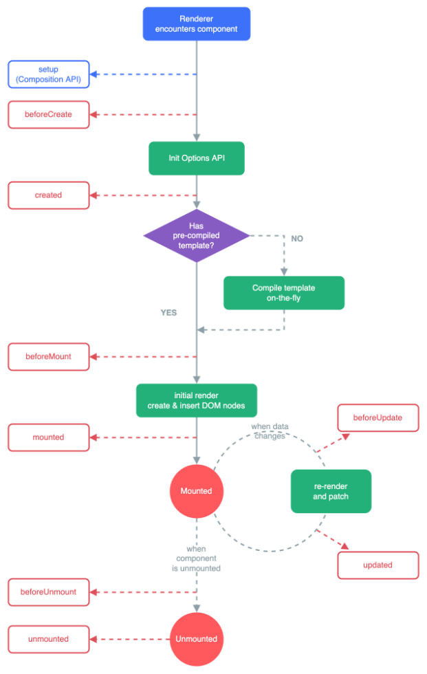
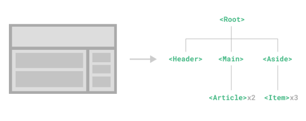
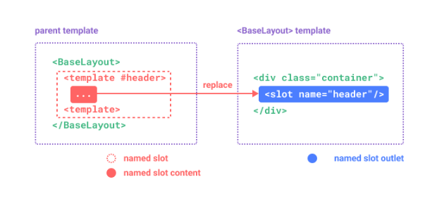
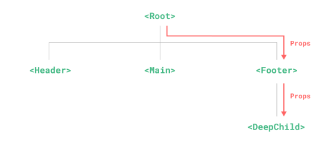
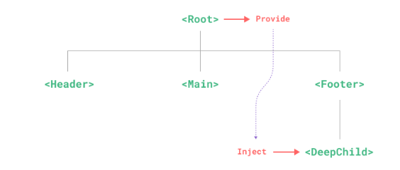
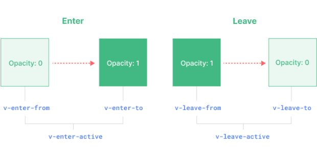

# Vue3

## 基础

### 响应式

**响应式对象**是 [JavaScript 代理](https://developer.mozilla.org/en-US/docs/Web/JavaScript/Reference/Global_Objects/Proxy)，其行为就和普通对象一样。不同的是，Vue 能够拦截对响应式对象所有属性的访问和修改，以便进行依赖追踪和触发更新。

#### ref()

- 推荐使用 [`ref()`](https://cn.vuejs.org/api/reactivity-core.html#ref) 函数来声明响应式状态
- `ref()` 接收参数，并将其包裹在一个带有 `.value` 属性的 ref 对象中返回
- 当一个组件首次渲染时，Vue 会**追踪**在渲染过程中使用的每一个 ref。然后，当一个 ref 被修改时，它会**触发**追踪它的组件的一次重新渲染。
- 深层响应性：`ref()`会使它的值具有深层响应性。这意味着即使改变嵌套对象或数组时，变化也会被检测到；对于浅层 ref，只有 `.value` 的访问会被追踪。

```vue
<script>
import { ref } from 'vue'
export default {
	setup() {
    const count = ref(0)
    function increment() {
      // 在 JavaScript 中需要 .value
      count.value++
    }
    // 需要暴露函数
    return {
      count,
      increment
    }
  }
}
</script>
<template>
  <button @click="increment">
    {{ count }}
  </button>
</template>
```

#### DOM更新时机

修改了响应式状态时，DOM 会被自动更新。但是DOM 更新不是同步的。Vue 会在`next tick`更新周期中缓冲所有状态的修改，以确保不管进行了多少次状态修改，每个组件都只会被更新一次。

要等待 DOM 更新完成后再执行额外的代码，可以使用 [nextTick()](https://cn.vuejs.org/api/general.html#nexttick) 全局 API：

```js
import { nextTick } from 'vue'

async function increment() {
  count.value++
  await nextTick()
  // 现在 DOM 已经更新了
}
```

#### reactive()

- 与将内部值包装在特殊对象中的 ref 不同，`reactive()` 将使对象本身具有响应性

- `reactive()` 返回的是一个原始对象的 [Proxy](https://developer.mozilla.org/en-US/docs/Web/JavaScript/Reference/Global_Objects/Proxy)，它和原始对象是不相等的
- 只有代理对象是响应式的，更改原始对象不会触发更新。因此，使用 Vue 的响应式系统的最佳实践是 **仅使用你声明对象的代理版本**。
- 对同一个原始对象调用 `reactive()` 会总是返回同样的代理对象，而对一个已存在的代理对象调用 `reactive()` 会返回其本身

```vue
<script setup>
import { reactive } from 'vue'
const state = reactive({ count: 0 })

const raw = {}
const proxy = reactive(raw)
// 代理对象和原始对象不是全等的
console.log(proxy === raw) // false
// 在同一个对象上调用 reactive() 会返回相同的代理
console.log(reactive(raw) === proxy) // true
// 在一个代理上调用 reactive() 会返回它自己
console.log(reactive(proxy) === proxy) // true
</script>
<template>
	<button @click="state.count++">
  	{{ state.count }}
	</button>
</template>
```

**局限性：**

1. **有限的值类型**：它只能用于对象类型 (对象、数组和如 `Map`、`Set` 这样的[集合类型](https://developer.mozilla.org/en-US/docs/Web/JavaScript/Reference/Global_Objects#keyed_collections))。它不能持有如 `string`、`number` 或 `boolean` 这样的[原始类型](https://developer.mozilla.org/en-US/docs/Glossary/Primitive)。

2. **不能替换整个对象**：由于 Vue 的响应式跟踪是通过属性访问实现的，因此我们必须始终保持对响应式对象的相同引用。这意味着我们不能轻易地“替换”响应式对象，因为这样的话与第一个引用的响应性连接将丢失：

```js
let state = reactive({ count: 0 })

// 上面的 ({ count: 0 }) 引用将不再被追踪
// (响应性连接已丢失！)
state = reactive({ count: 1 })
```

3. **对解构操作不友好**：当我们将响应式对象的原始类型属性解构为本地变量时，或者将该属性传递给函数时，我们将丢失响应性连接：

```js
const state = reactive({ count: 0 })

// 当解构时，count 已经与 state.count 断开连接
let { count } = state
// 不会影响原始的 state
count++

// 该函数接收到的是一个普通的数字
// 并且无法追踪 state.count 的变化
// 我们必须传入整个对象以保持响应性
callSomeFunction(state.count)
```

由于这些限制，建议使用 `ref()` 作为声明响应式状态的主要 API。

#### ref 解包细节

##### 作为 reactive 对象的属性

一个 ref 会在作为响应式对象的属性被访问或修改时自动解包。换句话说，它的行为就像一个普通的属性：

```js
const count = ref(0)
const state = reactive({
  count
})

console.log(state.count) // 0

state.count = 1
console.log(count.value) // 1
```

如果将一个新的 ref 赋值给一个关联了已有 ref 的属性，那么它会替换掉旧的 ref：

```js
const otherCount = ref(2)

state.count = otherCount
console.log(state.count) // 2
// 原始 ref 现在已经和 state.count 失去联系
console.log(count.value) // 1
```

只有当嵌套在一个深层响应式对象内时，才会发生 ref 解包。当其作为[浅层响应式对象](https://cn.vuejs.org/api/reactivity-advanced.html#shallowreactive)的属性被访问时不会解包。

##### 数组和集合的注意事项

与 reactive 对象不同的是，当 ref 作为响应式数组或原生集合类型(如 `Map`) 中的元素被访问时，它**不会**被解包：

```js
const books = reactive([ref('Vue 3 Guide')])
// 这里需要 .value
console.log(books[0].value)

const map = reactive(new Map([['count', ref(0)]]))
// 这里需要 .value
console.log(map.get('count').value)
```

##### 在模板中解包的注意事项

在模板渲染上下文中，只有顶级的 ref 属性才会被解包。

在下面的例子中，`count` 和 `object` 是顶级属性，但 `object.id` 不是：

```js
const count = ref(0)
const object = { id: ref(1) }

{{ count + 1 }} // 正常
{{ object.id + 1 }} // 错误
// 如果 ref 是文本插值的最终计算值 (即 {{ }} 标签)，那么它将被解包
{{ object.id }} // 正常
// 为了解决 object.id 没有被解包的问题 可以将 id 解构为一个顶级属性
const { id } = object
{{ id + 1 }}
```

### 计算属性

在模板中需要不止一次计算，推荐使用**计算属性**来描述依赖响应式状态的复杂逻辑。

- Getter 不应有副作用：**不要在 getter 中做异步请求或者更改 DOM**！getter 的职责应该仅为计算和返回该值。
- 避免直接修改计算属性值

#### 基础示例

```vue
<script setup>
import { reactive, computed } from 'vue'

const author = reactive({
  name: 'John Doe',
  books: [
    'Vue 2 - Advanced Guide',
    'Vue 3 - Basic Guide',
    'Vue 4 - The Mystery'
  ]
})

// 一个计算属性 ref
const publishedBooksMessage = computed(() => {
  return author.books.length > 0 ? 'Yes' : 'No'
})
</script>

<template>
  <p>Has published books:</p>
  <span>{{ publishedBooksMessage }}</span>
</template>
```

`computed()` 方法期望接收一个 getter 函数，返回值为一个**计算属性 ref**。和其他一般的 ref 类似，你可以通过`publishedBooksMessage.value` 访问计算结果。计算属性 ref 也会在模板中自动解包，因此在模板表达式中引用时无需添加 `.value`。

Vue 的计算属性会自动追踪响应式依赖。它会检测到 `publishedBooksMessage` 依赖于 `author.books`，所以当 `author.books` 改变时，任何依赖于 `publishedBooksMessage` 的绑定都会同时更新。

#### 计算属性缓存 vs 方法

在表达式中像这样调用一个函数也会获得和计算属性相同的结果

```js
<p>{{ calculateBooksMessage() }}</p>
// 组件中
function calculateBooksMessage() {
  return author.books.length > 0 ? 'Yes' : 'No'
}
```

两种方式在结果上确实是完全相同的，然而，不同之处在于**计算属性值会基于其响应式依赖被缓存**。一个计算属性仅会在其响应式依赖更新时才重新计算。这意味着只要 `author.books` 不改变，无论多少次访问 `publishedBooksMessage` 都会立即返回先前的计算结果，而不用重复执行 getter 函数。

这也解释了为什么下面的计算属性永远不会更新，因为 `Date.now()` 并不是一个响应式依赖：

```js
const now = computed(() => Date.now())
```

#### 可写计算属性

计算属性默认是只读的。当你尝试修改一个计算属性时，你会收到一个运行时警告。只在某些特殊场景中你可能才需要用到“可写”的属性，你可以通过同时提供 getter 和 setter 来创建：

```vue
<script setup>
import { ref, computed } from 'vue'

const firstName = ref('John')
const lastName = ref('Doe')

const fullName = computed({
  // getter
  get() {
    return firstName.value + ' ' + lastName.value
  },
  // setter
  set(newValue) {
  // 注意：我们这里使用的是解构赋值语法
    [firstName.value, lastName.value] = newValue.split(' ')
  }	
})
</script>
```

现在当你再运行 `fullName.value = 'John Doe'` 时，setter 会被调用而 `firstName` 和 `lastName` 会随之更新。

### Class 与 Style 绑定

#### 绑定 HTML class

1. **绑定对象：**给 `:class` (`v-bind:class` 的缩写) 传递一个对象来动态切换 class

```vue
<script setup>
const isActive = ref(true)
const hasError = ref(false)
// 绑定对象
const classObject = reactive({
  active: true,
  'text-danger': false
})
// 绑定一个返回对象的计算属性
const isActiveC = ref(true)
const error = ref(null)

const classObjectC = computed(() => ({
  active: isActiveC.value && !error.value,
  'text-danger': error.value && error.value.type === 'fatal'
}))
</script>
<template>
	<div
  	class="static"
    :class="{ active: isActive, 'text-danger': hasError }"
    ></div>
	<div :class="classObject"></div>
	<div :class="classObjectC"></div>
</template>
```

2. **绑定数组：**给 `:class` 绑定一个数组来渲染多个 CSS class

```vue
<script setup>
const activeClass = ref('active')
const errorClass = ref('text-danger')
</script>
<template>
	<div :class="[activeClass, errorClass]"></div>
	<div :class="[isActive ? activeClass : '', errorClass]"></div>
	<div :class="[{ active: isActive }, errorClass]"></div>
</template>
```

3. **在组件上使用：**对于只有一个根元素的组件，当你使用了 `class` attribute 时，这些 class 会被添加到根元素上并与该元素上已有的 class 合并

```vue
<!-- 在使用组件时 -->
<MyComponent :class="{ active: isActive }" />

<!-- MyComponent 模板使用 $attrs 时 -->
<p class="foo bar">Hi!</p>
<p :class="$attrs.class">Hi!</p>

<!-- 渲染出的结果 -->
<p class="foo bar baz boo">Hi!</p>
```

#### 绑定内联样式

1. **绑定对象：**`:style` 支持绑定 JavaScript 对象值，对应的是 [HTML 元素的 `style` 属性](https://developer.mozilla.org/en-US/docs/Web/API/HTMLElement/style)

```vue
<script setup>
const activeColor = ref('red')
const fontSize = ref(30)

// 直接绑定一个样式对象通常是一个好主意，这样可以使模板更加简洁
const styleObject = reactive({
  color: 'red',
  fontSize: '13px'
})
</script>
<template>
	<div :style="{ color: activeColor, fontSize: fontSize + 'px' }"></div>
	<div :style="styleObject"></div>
</template>
```

2. **绑定数组：**`:style` 绑定一个包含多个样式对象的数组。这些对象会被合并后渲染到同一元素上

```vue
<div :style="[baseStyles, overridingStyles]"></div>
```

### 条件渲染

**`v-if` vs. `v-show`**

`v-if` 是“真实的”按条件渲染，因为它确保了在切换时，条件区块内的事件监听器和子组件都会被销毁与重建。

`v-if` 也是**惰性**的：如果在初次渲染时条件值为 false，则不会做任何事。条件区块只有当条件首次变为 true 时才被渲染。

相比之下，`v-show` 简单许多，元素无论初始条件如何，始终会被渲染，只有 CSS `display` 属性会被切换。

总的来说，`v-if` 有更高的切换开销，而 `v-show` 有更高的初始渲染开销。因此，如果需要频繁切换，则使用 `v-show` 较好；如果在运行时绑定条件很少改变，则 `v-if` 会更合适。

### 列表渲染

#### 基础示例

```vue
<script setup>
const parentMessage = ref('Parent')
const items = ref([{ message: 'Foo' }, { message: 'Bar' }])
const myObject = reactive({
  title: 'How to do lists in Vue',
  author: 'Jane Doe',
  publishedAt: '2016-04-10'
})
</script>
<template>
  <li v-for="(item, index) in items">
    {{ parentMessage }} - {{ index }} - {{ item.message }}
    </li>
  <li v-for="(value, key, index) in myObject">
    {{ index }}. {{ key }}: {{ value }}
  </li>
	<!-- n 的初值是从 1 开始 -->
	<span v-for="n in 10">{{ n }}</span>
</template>
```

#### 通过 key 管理状态

Vue 默认按照“就地更新”的策略来更新通过 `v-for` 渲染的元素列表。当数据项的顺序改变时，Vue 不会随之移动 DOM 元素的顺序，而是就地更新每个元素，确保它们在原本指定的索引位置上渲染。

默认模式是高效的，但**只适用于列表渲染输出的结果不依赖子组件状态或者临时 DOM 状态 (例如表单输入值) 的情况**。

```vue
<template v-for="todo in todos" :key="todo.name">
  <li>{{ todo.name }}</li>
  <!-- 组件上使用 v-for 不会自动将任何数据传递给组件 -->
  <MyComponent
    v-for="(item, index) in items"
    :item="item"
    :index="index"
    :key="item.id"
  />
</template>
```

#### 数组变化侦测

Vue 能够侦听响应式数组的变更方法，并在它们被调用时触发相关的更新。这些变更方法包括：

- `push()`
- `pop()`
- `shift()`
- `unshift()`
- `splice()`
- `sort()`
- `reverse()`

非变更方法：

- `filter()`
- `concat()`
- `slice()`

1. **替换一个数组：**将旧数组替换为新数组

```js
// `items` 是一个数组的 ref
items.value = items.value.filter((item) => item.message.match(/Foo/))
```

> 这并不会导致 Vue 丢弃现有的 DOM 并重新渲染整个列表。Vue通过虚拟DOM、组件化开发、列表渲染和虚拟列表等技术手段，有效地最大化了对DOM元素的重用，因此用另一个包含部分重叠对象的数组来做替换，仍会是一种非常高效的操作。

2. **展示过滤或排序后的结果：**创建返回已过滤或已排序数组的计算属性

```vue
<script setup>
const sets = ref([
  [1, 2, 3, 4, 5],
  [6, 7, 8, 9, 10]
])
function even(numbers) {
  return numbers.filter((number) => number % 2 === 0)
}
</script>
<template>
  <ul v-for="numbers in sets">
    <li v-for="n in even(numbers)">{{ n }}</li>
  </ul>
</template>
```

### 事件处理

使用 `v-on` 指令 (简写为 `@`) 来监听 DOM 事件

1. **内联事件处理器**：事件被触发时执行的内联 JavaScript 语句 (与 `onclick` 类似)。

```vue
<script setup>
const count = ref(0)
// 在内联处理器中调用方法
function say(message) {
  alert(message)
}
// 在内联事件处理器中访问事件参数
function warn(message, event) {
  // 这里可以访问原生事件
  if (event) {
    event.preventDefault()
  }
  alert(message)
}
</script>
<template>
  <button @click="count++">Add 1</button>
  <p>Count is: {{ count }}</p>
	<button @click="say('hello')">Say hello</button>
  <!-- 使用特殊的 $event 变量 -->
  <button @click="warn('Form cannot be submitted yet.', $event)">
    Submit
  </button>
  <!-- 使用内联箭头函数 -->
  <button @click="(event) => warn('Form cannot be submitted yet.', event)">
    Submit
  </button>
</template>
```

2. **方法事件处理器**：一个指向组件上定义的方法的属性名或是路径。

```vue
<script setup>
const name = ref('Vue.js')

function greet(event) {
  alert(`Hello ${name.value}!`)
  // `event` 是 DOM 原生事件
  if (event) {
    alert(event.target.tagName)
  }
}
</script>
<template>
  <!-- `greet` 是上面定义过的方法名 -->
  <button @click="greet">Greet</button>
</template>
```

方法事件处理器会自动接收原生 DOM 事件并触发执行。在上面的例子中，我们能够通过被触发事件的 `event.target.tagName` 访问到该 DOM 元素。

#### 事件修饰符

Vue 为 `v-on` 提供了**事件修饰符**。修饰符是用 `.` 表示的指令后缀，包含以下这些：

- `.stop`
- `.prevent`
- `.self`
- `.capture`
- `.once`
- `.passive`

```vue
<!-- 单击事件将停止传递 -->
<a @click.stop="doThis"></a>

<!-- 提交事件将不再重新加载页面 -->
<form @submit.prevent="onSubmit"></form>

<!-- 修饰语可以使用链式书写 -->
<a @click.stop.prevent="doThat"></a>

<!-- 也可以只有修饰符 -->
<form @submit.prevent></form>

<!-- 仅当 event.target 是元素本身时才会触发事件处理器 -->
<!-- 例如：事件处理器不来自子元素 -->
<div @click.self="doThat">...</div>

<!-- 添加事件监听器时，使用 `capture` 捕获模式 -->
<!-- 例如：指向内部元素的事件，在被内部元素处理前，先被外部处理 -->
<div @click.capture="doThis">...</div>

<!-- 点击事件最多被触发一次 -->
<a @click.once="doThis"></a>

<!-- 滚动事件的默认行为 (scrolling) 将立即发生而非等待 `onScroll` 完成 -->
<!-- .passive 修饰符一般用于触摸事件的监听器，可以用来改善移动端设备的滚屏性能。 -->
<!-- 以防其中包含 `event.preventDefault()` -->
<div @scroll.passive="onScroll">...</div>
```

#### 按键修饰符

- `.enter`
- `.tab`
- `.delete` (捕获“Delete”和“Backspace”两个按键)
- `.esc`
- `.space`
- `.up`
- `.down`
- `.left`
- `.right`

- `.ctrl`
- `.alt`
- `.shift`
- `.meta`
- `.exact`：`.exact` 修饰符允许控制触发一个事件所需的确定组合的系统按键修饰符。
- `.left .right .middle`：鼠标按键触发的事件

```vue
<!-- 仅在 `key` 为 `Enter` 时调用 `submit` -->
<input @keyup.enter="submit" />

<!-- Alt + Enter -->
<input @keyup.alt.enter="clear" />

<!-- Ctrl + 点击 -->
<div @click.ctrl="doSomething">Do something</div>

<!-- 当按下 Ctrl 时，即使同时按下 Alt 或 Shift 也会触发 -->
<button @click.ctrl="onClick">A</button>

<!-- 仅当按下 Ctrl 且未按任何其他键时才会触发 -->
<button @click.ctrl.exact="onCtrlClick">A</button>

<!-- 仅当没有按下任何系统按键时触发 -->
<button @click.exact="onClick">A</button>
```

### 表单输入绑定

`v-model` 指令帮我们简化了表单输入框的内容同步给 JavaScript 中相应的变量的步骤

#### 基础示例

```vue
<!-- 文本框 -->
<input
  :value="text"
  @input="event => text = event.target.value">
<input v-model="text">

<!-- 多行文本 -->
<textarea v-model="text"></textarea>

<!-- 复选框 -->
<div>Checked names: {{ checkedNames }}</div>

<input type="checkbox" id="jack" value="Jack" v-model="checkedNames">
<label for="jack">Jack</label>

<input type="checkbox" id="john" value="John" v-model="checkedNames">
<label for="john">John</label>

<input type="checkbox" id="mike" value="Mike" v-model="checkedNames">
<label for="mike">Mike</label>

<!-- 单选按钮 -->
<div>Picked: {{ picked }}</div>

<input type="radio" id="one" value="One" v-model="picked" />
<label for="one">One</label>

<input type="radio" id="two" value="Two" v-model="picked" />
<label for="two">Two</label>

<!-- 值绑定 -->
<input type="radio" v-model="pick" :value="first" />
<input type="radio" v-model="pick" :value="second" />

<!-- 选择器 -->
<script setup>
const selected = ref('A')

const options = ref([
  { text: 'One', value: 'A' },
  { text: 'Two', value: 'B' },
  { text: 'Three', value: 'C' }
])
</script>
<div>Selected: {{ selected }}</div>

<!-- <select v-model="selected" multiple> 多选 -->
<select v-model="selected">
  <option v-for="option in options" :key="option.value" :value="option.value">
    {{ option.text }}
  </option>
</select>

<div>Selected: {{ selected }}</div>
```

#### 修饰符

##### .lazy

默认情况下，`v-model` 会在每次 `input` 事件后更新数据 ([IME 拼字阶段的状态](https://cn.vuejs.org/guide/essentials/forms.html#vmodel-ime-tip)例外)。你可以添加 `lazy` 修饰符来改为在每次 `change` 事件后更新数据：

```vue
<!-- 在 "change" 事件后同步更新而不是 "input" -->
<input v-model.lazy="msg" />
```

##### .number

如果你想让用户输入自动转换为数字，你可以在 `v-model` 后添加 `.number` 修饰符来管理输入：

```vue
<input v-model.number="age" />
```

如果该值无法被 `parseFloat()` 处理，那么将返回原始值。`number` 修饰符会在输入框有 `type="number"` 时自动启用。

##### .trim

如果你想要默认自动去除用户输入内容中两端的空格，你可以在 `v-model` 后添加 `.trim` 修饰符：

```vue
<input v-model.trim="msg" />
```

### 生命周期钩子

`onMounted` 钩子：可以用来在组件完成初始渲染并创建 DOM 节点后运行代码

```vue
<script setup>
import { onMounted } from 'vue'

onMounted(() => {
  console.log(`the component is now mounted.`)
})
</script>
```

> 当调用 `onMounted` 时，Vue 会自动将回调函数注册到当前正被初始化的组件实例上。这意味着这些钩子应当在组件初始化时被**同步**注册。



### 监听器

使用 [`watch` 函数](https://cn.vuejs.org/api/reactivity-core.html#watch)在每次响应式状态发生变化时触发回调函数

#### 基本示例

```vue
<script setup>
import { ref, watch } from 'vue'

const question = ref('')
const answer = ref('Questions usually contain a question mark. ;-)')
// 可以直接侦听一个 ref
watch(question, async (newQuestion, oldQuestion) => {
  if (newQuestion.indexOf('?') > -1) {
    answer.value = 'Thinking...'
    try {
      const res = await fetch('https://yesno.wtf/api')
      answer.value = (await res.json()).answer
    } catch (error) {
      answer.value = 'Error! Could not reach the API. ' + error
    }
  }
})
</script>
<template>
  <p>
    Ask a yes/no question:
    <input v-model="question" />
  </p>
  <p>{{ answer }}</p>
</template>
```

#### 监听数据源类型

`watch` 的第一个参数可以是不同形式的“数据源”：它可以是一个 ref (包括计算属性)、一个响应式对象、一个 getter 函数、或多个数据源组成的数组：

```js
const x = ref(0)
const y = ref(0)

// 单个 ref
watch(x, (newX) => {
  console.log(`x is ${newX}`)
})

// getter 函数
watch(
  () => x.value + y.value,
  (sum) => {
    console.log(`sum of x + y is: ${sum}`)
  }
)

// 多个来源组成的数组
watch([x, () => y.value], ([newX, newY]) => {
  console.log(`x is ${newX} and y is ${newY}`)
})

// 监听对象属性值
const obj = reactive({ count: 0 })
// 提供一个该属性的getter 函数
watch(
  () => obj.count,
  (count) => {
    console.log(`count is: ${count}`)
  }
)
```

#### 深层监听器

直接给 `watch()` 传入一个响应式对象，会隐式地创建一个深层监听器——该回调函数在所有嵌套的变更时都会被触发：

```js
const obj = reactive({ count: 0 })

watch(obj, (newValue, oldValue) => {
  // 在嵌套的属性变更时触发
  // 注意：`newValue` 此处和 `oldValue` 是相等的
  // 因为它们是同一个对象！
})

obj.count++

// 等价于显式地加上 `deep` 选项，强制转成深层监听器
watch(
  () => state.someObject,
  (newValue, oldValue) => {
    // 注意：`newValue` 此处和 `oldValue` 是相等的
    // *除非* state.someObject 被整个替换了
  },
  { 
    deep: true 
  	// 立即执行，且当 `source` 改变时再次执行
  	immediate: true
  }
)
```

#### watchEffect()

对于有多个依赖项的监听器来说，使用 `watchEffect()` 可以消除手动维护依赖列表的负担。此外，如果需要侦听一个嵌套数据结构中的几个属性，`watchEffect()` 可能会比深度监听器更有效，因为它将只跟踪回调中被使用到的属性，而不是递归地跟踪所有的属性。

```js
const todoId = ref(1)
const data = ref(null)

watch(todoId, async () => {
  const response = await fetch(
    `https://jsonplaceholder.typicode.com/todos/${todoId.value}`
  )
  data.value = await response.json()
}, { immediate: true })

// 使用 watchEffect()简化
watchEffect(async () => {
  const response = await fetch(
    `https://jsonplaceholder.typicode.com/todos/${todoId.value}`
  )
  data.value = await response.json()
})
```

#### watch vs. watchEffect

`watch` 和 `watchEffect` 都能响应式地执行有副作用的回调。它们之间的主要区别是追踪响应式依赖的方式：

- `watch` 只追踪明确侦听的数据源。它不会追踪任何在回调中访问到的东西。另外，仅在数据源确实改变时才会触发回调。`watch` 会避免在发生副作用时追踪依赖，因此，我们能更加精确地控制回调函数的触发时机。
- `watchEffect`，则会在副作用发生期间追踪依赖。它会在同步执行过程中，自动追踪所有能访问到的响应式属性。这更方便，而且代码往往更简洁，但有时其响应性依赖关系会不那么明确。

#### 回调的触发时机

当响应式状态更改时，它可能会同时触发 Vue 组件更新和监听器回调。

默认情况下，用户创建的监听器回调，都会在 Vue 组件更新**之前**被调用。这意味着你在监听器回调中访问的 DOM 将是被 Vue 更新之前的状态。

如果想在监听器回调中能访问被 Vue 更新**之后**的 DOM，你需要指明 `flush: 'post'` 选项：

```js
watch(source, callback, {
  flush: 'post'
})

watchEffect(callback, {
  flush: 'post'
})
```

后置刷新的 `watchEffect()` 有个更方便的别名 `watchPostEffect()`：

```js
import { watchPostEffect } from 'vue'

watchPostEffect(() => {
  /* 在 Vue 更新后执行 */
})
```

#### 停止监听器

在 `setup()` 或 `<script setup>` 中用同步语句创建的监听器，会自动绑定到宿主组件实例上，并且会在宿主组件卸载时自动停止。因此，在大多数情况下，无需关心怎么停止一个监听器。

一个关键点是，监听器必须用**同步**语句创建：如果用异步回调创建一个监听器，那么它不会绑定到当前组件上，必须手动停止它，以防内存泄漏。如下方这个例子：

```vue
<script setup>
import { watchEffect } from 'vue'

// 它会自动停止
watchEffect(() => {})

// ...这个则不会！
setTimeout(() => {
  watchEffect(() => {})
}, 100)

// 要手动停止一个监听器，请调用 `watch` 或 `watchEffect` 返回的函数 
const unwatch = watchEffect(() => {})
// ...当该监听器不再需要时
unwatch()

// 需要异步请求得到的数据
const data = ref(null)

watchEffect(() => {
  if (data.value) {
    // 数据加载后执行某些操作...
  }
})
</script>
```

### 模板引用

使用特殊的 `ref` attribute实现直接访问底层 DOM 元素，它允许我们在一个特定的 DOM 元素或子组件实例被挂载后，获得对它的直接引用。

#### 访问模板引用

为了通过组合式 API 获得该模板引用，我们需要声明一个同名的 ref：

```vue
<script setup>
import { ref, onMounted } from 'vue'

// 声明一个 ref 来存放该元素的引用
// 必须和模板里的 ref 同名
const input = ref(null)

onMounted(() => {
  input.value.focus()
})
</script>

<template>
  <input ref="input" />
</template>
```

#### v-for 中的模板引用

> 需要 v3.2.25 及以上版本

当在 `v-for` 中使用模板引用时，对应的 ref 中包含的值是一个数组，它将在元素被挂载后包含对应整个列表的所有元素：

```vue
<script setup>
import { ref, onMounted } from 'vue'

const list = ref([1, 2, 3])
const itemRefs = ref([])
onMounted(() => {
  alert(itemRefs.value.map(i => i.textContent))
})
</script>
<template>
  <ul>
    <li v-for="item in list" ref="itemRefs">
      {{ item }}
    </li>
  </ul>
</template>
```

#### 函数模板引用

除了使用字符串值作名字，`ref` attribute 还可以绑定为一个函数，会在每次组件更新时都被调用。该函数会收到元素引用作为其第一个参数：

```vue
<input :ref="(el) => { /* 将 el 赋值给一个数据属性或 ref 变量 */ }">
```

注意我们这里需要使用动态的 `:ref` 绑定才能够传入一个函数。当绑定的元素被卸载时，函数也会被调用一次，此时的 `el` 参数会是 `null`。你当然也可以绑定一个组件方法而不是内联函数。

#### 组件上的 ref

模板引用也可以被用在一个子组件上。这种情况下引用中获得的值是组件实例：

```vue
<script setup>
import { ref, onMounted } from 'vue'
import Child from './Child.vue'

const child = ref(null)

onMounted(() => {
  // child.value 是 <Child /> 组件的实例
})
</script>

<template>
  <Child ref="child" />
</template>
```

### 组件基础

组件允许我们将 UI 划分为独立的、可重用的部分，并且可以对每个部分进行单独的思考。在实际应用中，组件常常被组织成层层嵌套的树状结构：



#### 使用组件

当使用构建步骤时，一般会将 Vue 组件定义在一个单独的 `.vue` 文件中，这被叫做[单文件组件](https://cn.vuejs.org/guide/scaling-up/sfc.html) (简称 SFC)：

```vue
<script setup>
import { ref } from 'vue'

const count = ref(0)
</script>

<template>
  <button @click="count++">You clicked me {{ count }} times.</button>
</template>
```

父组件

```vue
<script setup>
import ButtonCounter from './ButtonCounter.vue'
</script>

<template>
  <h1>Here is a child component!</h1>
  <ButtonCounter />
  <ButtonCounter />
  <ButtonCounter />
</template>
```

每一个组件都维护着自己的状态，是不同的 `count`。这是因为每使用一个组件，就创建了一个新的**实例**。

#### 传递 props

Props 是一种特别的 attributes，可以在组件上声明注册。要传递给博客文章组件一个标题，我们必须在组件的 props 列表上声明它。这里要用到 [`defineProps`](https://cn.vuejs.org/api/sfc-script-setup.html#defineprops-defineemits) 宏：

```vue
<!-- BlogPost.vue -->
<script setup>
const props = defineProps(['title'])
console.log(props.title)
</script>

<template>
  <h4>{{ title }}</h4>
</template>
```

`defineProps` 是一个仅 `<script setup>` 中可用的编译宏命令，并不需要显式地导入。声明的 props 会自动暴露给模板。`defineProps` 会返回一个对象，其中包含了可以传递给组件的所有 props。

如果不使用 `<script setup>`，props 必须以 `props` 选项的方式声明，props 对象会作为 `setup()` 函数的第一个参数被传入：

```vue
<script>
export default {
  props: ['title'],
  setup(props) {
    console.log(props.title)
  }
}
</script>
```

父组件中

```vue
<script setup>
const posts = ref([
  { id: 1, title: 'My journey with Vue' },
  { id: 2, title: 'Blogging with Vue' },
  { id: 3, title: 'Why Vue is so fun' }
])
</script>
<template>
  <BlogPost
    v-for="post in posts"
    :key="post.id"
    :title="post.title"
   />
</template>
```

#### 监听事件

与父组件进行事件交互，在`<script setup>` 中可以通过 [`defineEmits`](https://cn.vuejs.org/api/sfc-script-setup.html#defineprops-defineemits) 宏来声明需要抛出的事件：

```vue
<!-- BlogPost.vue -->
<script setup>
defineProps(['title'])
defineEmits(['enlarge-text'])
</script>
<template>
  <div class="blog-post">
    <h4>{{ title }}</h4>
    <button @click="$emit('enlarge-text')">Enlarge text</button>
  </div>
</template>
```

如果不使用 `<script setup>`，可以通过 `emits` 选项定义组件会抛出的事件。你可以从 `setup()` 函数的第二个参数，即 setup 上下文对象上访问到 `emit` 函数：

```vue
<script>
export default {
  emits: ['enlarge-text'],
  setup(props, ctx) {
    ctx.emit('enlarge-text')
  }
}
</script>
```

父组件

```vue
<script setup>
const posts = ref([
  { id: 1, title: 'My journey with Vue' },
  { id: 2, title: 'Blogging with Vue' },
  { id: 3, title: 'Why Vue is so fun' }
])
const postFontSize = ref(1)
</script>
<template>
	<div :style="{ fontSize: postFontSize + 'em' }">
    <BlogPost
      v-for="post in posts"
      :key="post.id"
      :title="post.title"
      @enlarge-text="postFontSize += 0.1"
     />
  </div>
</template>
```

#### 动态组件

通过 Vue 的 `<component>` 元素和特殊的 `is` attribute 实现

```vue
<!-- currentTab 改变时组件也改变 -->
<component :is="tabs[currentTab]"></component>
```

在上面的例子中，被传给 `:is` 的值可以是以下几种：

- 被注册的组件名
- 导入的组件对象

当使用 `<component :is="...">` 来在多个组件间作切换时，被切换掉的组件会被卸载。我们可以通过[`<KeepAlive>` 组件](https://cn.vuejs.org/guide/built-ins/keep-alive.html)强制被切换掉的组件仍然保持“存活”的状态。

## 深入组件

### 组件注册

一个 Vue 组件在使用前需要先被“注册”，这样 Vue 才能在渲染模板时找到其对应的实现。组件注册有两种方式：全局注册和局部注册。

#### 全局注册

我们可以使用 [Vue 应用实例](https://cn.vuejs.org/guide/essentials/application.html)的 `app.component()` 方法，让组件在当前 Vue 应用中全局可用。

```js
import { createApp } from 'vue'

const app = createApp({})

app.component(
  // 注册的名字
  'MyComponent',
  // 组件的实现
  {
    /* ... */
  }
)
```

如果使用单文件组件，你可以注册被导入的 `.vue` 文件：

```js
import MyComponent from './App.vue'

app.component('MyComponent', MyComponent)
```

#### 局部注册

全局注册虽然很方便，但有以下几个问题：

1. 全局注册，但并没有被使用的组件无法在生产打包时被自动移除 (也叫“tree-shaking”)。如果你全局注册了一个组件，即使它并没有被实际使用，它仍然会出现在打包后的 JS 文件中。
2. 全局注册在大型项目中使项目的依赖关系变得不那么明确。在父组件中使用子组件时，不太容易定位子组件的实现。和使用过多的全局变量一样，这可能会影响应用长期的可维护性。

相比之下，局部注册的组件需要在使用它的父组件中显式导入，并且只能在该父组件中使用。它的优点是使组件之间的依赖关系更加明确，并且对 tree-shaking 更加友好。

在使用 `<script setup>` 的单文件组件中，导入的组件可以直接在模板中使用，无需注册：

```vue
<script setup>
import ComponentA from './ComponentA.vue'
</script>

<template>
  <ComponentA />
</template>
```

### Props

在使用 `<script setup>` 的单文件组件中，props 可以使用 `defineProps()` 宏来声明：

```vue
<script setup>
const props = defineProps(['foo'])
// 使用对象的形式
defineProps({
  title: String,
  likes: Number
})
console.log(props.foo)
</script>
```

#### 单向数据流

所有的 props 都遵循着**单向绑定**原则，props 因父组件的更新而变化，自然地将新的状态向下流往子组件，而不会逆向传递。

导致你想要更改一个 prop 的需求通常来源于以下两种场景：

1. **prop 被用于传入初始值；而子组件想在之后将其作为一个局部数据属性**。在这种情况下，最好是新定义一个局部数据属性，从 props 上获取初始值即可：

   ```js
   const props = defineProps(['initialCounter'])
   
   // 计数器只是将 props.initialCounter 作为初始值
   // 像下面这样做就使 prop 和后续更新无关了
   const counter = ref(props.initialCounter)
   ```

2. **需要对传入的 prop 值做进一步的转换**。在这种情况中，最好是基于该 prop 值定义一个计算属性：

   ```js
   const props = defineProps(['size'])
   
   // 该 prop 变更时计算属性也会自动更新
   const normalizedSize = computed(() => props.size.trim().toLowerCase())
   ```

3. **更改对象 / 数组类型的 props**，当对象或数组作为 props 被传入时，虽然子组件无法更改 props 绑定，但仍然**可以**更改对象或数组内部的值。这是因为 JavaScript 的对象和数组是按引用传递，在大多数场景下，子组件应该[抛出一个事件](https://cn.vuejs.org/guide/components/events.html)来通知父组件做出改变。

#### Prop校验

Vue 组件可以更细致地声明对传入的 props 的校验要求。

```js
defineProps({
  // 基础类型检查
  // （给出 `null` 和 `undefined` 值则会跳过任何类型检查）
  propA: Number,
  // 多种可能的类型
  propB: [String, Number],
  // 必传，且为 String 类型
  propC: {
    type: String,
    required: true
  },
  // Number 类型的默认值
  propD: {
    type: Number,
    default: 100
  },
  // 对象类型的默认值
  propE: {
    type: Object,
    // 对象或数组的默认值
    // 必须从一个工厂函数返回。
    // 该函数接收组件所接收到的原始 prop 作为参数。
    default(rawProps) {
      return { message: 'hello' }
    }
  },
  // 自定义类型校验函数
  propF: {
    validator(value) {
      // The value must match one of these strings
      return ['success', 'warning', 'danger'].includes(value)
    }
  },
  // 函数类型的默认值
  propG: {
    type: Function,
    // 不像对象或数组的默认，这不是一个
    // 工厂函数。这会是一个用来作为默认值的函数
    default() {
      return 'Default function'
    }
  }
})
```

一些补充细节：

- 所有 prop 默认都是可选的，除非声明了 `required: true`。
- 除 `Boolean` 外的未传递的可选 prop 将会有一个默认值 `undefined`。
- `Boolean` 类型的未传递 prop 将被转换为 `false`。这可以通过为它设置 `default` 来更改——例如：设置为 `default: undefined` 将与非布尔类型的 prop 的行为保持一致。
- 如果声明了 `default` 值，那么在 prop 的值被解析为 `undefined` 时，无论 prop 是未被传递还是显式指明的 `undefined`，都会改为 `default` 值。

### 组件事件

#### 基础示例

在组件的模板表达式中，可以直接使用 `$emit` 方法触发自定义事件 (例如：在 `v-on` 的处理函数中)：

```vue
<!-- MyComponent -->
<button @click="$emit('increaseBy', 1)">
  Increase by 1
</button>
```

父组件可以通过 `v-on` (缩写为 `@`) 来监听事件：

```vue
<MyButton @increase-by="(n) => count += n" />
<MyButton @increase-by="increaseCount" />
<script setup>
function increaseCount(n) {
  count.value += n
}
</script>
```

像组件与 prop 一样，事件的名字也提供了自动的格式转换。注意这里我们触发了一个以 camelCase 形式命名的事件，但在父组件中可以使用 kebab-case 形式来监听。与 [prop 大小写格式](https://cn.vuejs.org/guide/components/props.html#prop-name-casing)一样，在模板中我们也推荐使用 kebab-case 形式来编写监听器。

> 和原生 DOM 事件不一样，组件触发的事件**没有冒泡机制**。你只能监听直接子组件触发的事件。平级组件或是跨越多层嵌套的组件间通信，应使用一个外部的事件总线，或是使用一个[全局状态管理方案](https://cn.vuejs.org/guide/scaling-up/state-management.html)。

#### 声明式触发事件

组件可以显式地通过 [`defineEmits()`](https://cn.vuejs.org/api/sfc-script-setup.html#defineprops-defineemits) 宏来声明它要触发的事件：

```vue
<script setup>
const emit = defineEmits(['inFocus', 'submit'])

function buttonClick() {
  emit('submit')
}
</script>
```

> `defineEmits()` 宏**不能**在子函数中使用。如上所示，它必须直接放置在 `<script setup>` 的顶级作用域下。

如果显式地使用了 `setup` 函数而不是 `<script setup>`，则事件需要通过 [`emits`](https://cn.vuejs.org/api/options-state.html#emits) 选项来定义，`emit` 函数也被暴露在 `setup()` 的上下文对象上：

```vue
<script setup>
export default {
  emits: ['inFocus', 'submit'],
  setup(props, ctx) {
    ctx.emit('submit')
  }
}
</script>
```

#### 事件校验

要为事件添加校验，那么事件可以被赋值为一个函数，接受的参数就是抛出事件时传入 `emit` 的内容，返回一个布尔值来表明事件是否合法。

```vue
<script setup>
const emit = defineEmits({
  // 没有校验
  click: null,

  // 校验 submit 事件
  submit: ({ email, password }) => {
    if (email && password) {
      return true
    } else {
      console.warn('Invalid submit event payload!')
      return false
    }
  }
})

function submitForm(email, password) {
  emit('submit', { email, password })
}
</script>
```

### v-model

`v-model` 可以在组件上使用以实现双向绑定。

#### 基础示例

```vue
<input v-model="searchText" />
<!-- 等价于 -->
<input
  :value="searchText"
  @input="searchText = $event.target.value"
/>
```

当使用在一个组件上时，`v-model` 会被展开为如下的形式：

```vue
<CustomInput v-model="searchText" />
<!-- 转化为 -->
<CustomInput
  :modelValue="searchText"
  @update:modelValue="newValue => searchText = newValue"
/>
```

要让这个例子实际工作起来，`<CustomInput>` 组件内部需要做两件事：

1. 将内部原生 `<input>` 元素的 `value` attribute 绑定到 `modelValue` prop
2. 当原生的 `input` 事件触发时，触发一个携带了新值的 `update:modelValue` 自定义事件

```vue
<!-- CustomInput.vue -->
<script setup>
defineProps(['modelValue'])
defineEmits(['update:modelValue'])
</script>

<template>
  <input
    :value="modelValue"
    @input="$emit('update:modelValue', $event.target.value)"
  />
</template>
```

另一种在组件内实现 `v-model` 的方式是使用一个可写的，同时具有 getter 和 setter 的 `computed` 属性。`get` 方法需返回 `modelValue` prop，而 `set` 方法需触发相应的事件：

```vue
<!-- CustomInput.vue -->
<script setup>
import { computed } from 'vue'

const props = defineProps(['modelValue'])
const emit = defineEmits(['update:modelValue'])

const value = computed({
  get() {
    return props.modelValue
  },
  set(value) {
    emit('update:modelValue', value)
  }
})
</script>

<template>
  <input v-model="value" />
</template>
```

#### 多个 v-model 绑定

组件上的每一个 `v-model` 都会同步不同的 prop，而无需额外的选项：

```vue
<UserName
  v-model:first-name="first"
  v-model:last-name="last"
/>
```

```vue
<!-- UserName.vue -->
<script setup>
defineProps({
  firstName: String,
  lastName: String
})

defineEmits(['update:firstName', 'update:lastName'])
</script>

<template>
  <input
    type="text"
    :value="firstName"
    @input="$emit('update:firstName', $event.target.value)"
  />
  <input
    type="text"
    :value="lastName"
    @input="$emit('update:lastName', $event.target.value)"
  />
</template>
```

#### 处理 v-model 修饰符

创建一个自定义的修饰符 `capitalize`，它会自动将 `v-model` 绑定输入的字符串值第一个字母转为大写：

```vue
<MyComponent v-model.capitalize="myText" />
```

组件的 `v-model` 上所添加的修饰符，可以通过 `modelModifiers` prop 在组件内访问到。在下面的组件中，声明了 `modelModifiers` 这个 prop，它的默认值是一个空对象。

有了这个 prop，我们就可以检查 `modelModifiers` 对象的键，并编写一个处理函数来改变抛出的值。在下面的代码里，我们就是在每次 `<input />` 元素触发 `input` 事件时将值的首字母大写：

```vue
<script setup>
const props = defineProps({
  modelValue: String,
  modelModifiers: { default: () => ({}) }
})

defineEmits(['update:modelValue'])

console.log(props.modelModifiers) // { capitalize: true }
function emitValue(e) {
  let value = e.target.value
  if (props.modelModifiers.capitalize) {
    value = value.charAt(0).toUpperCase() + value.slice(1)
  }
  emit('update:modelValue', value)
}
</script>

<template>
  <input
    type="text"
    :value="modelValue"
    @input="$emit('update:modelValue', $event.target.value)"
  />
  <input type="text" :value="modelValue" @input="emitValue" />
</template>
```

#### 带参数的 v-model 修饰符

对于又有参数又有修饰符的 `v-model` 绑定，生成的 prop 名将是 `arg + "Modifiers"`。举例来说：

```vue
<MyComponent v-model:title.capitalize="myText">
```

相应的声明应该是：

```js
const props = defineProps(['title', 'titleModifiers'])
defineEmits(['update:title'])

console.log(props.titleModifiers) // { capitalize: true }
```

这里是另一个例子，展示了如何在使用多个不同参数的 `v-model` 时使用修饰符：

```vue
<UserName
  v-model:first-name.capitalize="first"
  v-model:last-name.uppercase="last"
/>
```

```vue
<script setup>
const props = defineProps({
  firstName: String,
  lastName: String,
  firstNameModifiers: { default: () => ({}) },
  lastNameModifiers: { default: () => ({}) }
})
defineEmits(['update:firstName', 'update:lastName'])

console.log(props.firstNameModifiers) // { capitalize: true }
console.log(props.lastNameModifiers) // { uppercase: true}
</script>
```

### 透传 Attributes

“透传 attribute”指的是传递给一个组件，却没有被该组件声明为 [props](https://cn.vuejs.org/guide/components/props.html) 或 [emits](https://cn.vuejs.org/guide/components/events.html#defining-custom-events) 的 attribute 或者 `v-on` 事件监听器。最常见的例子就是 `class`、`style` 和 `id`。

当一个组件以单个元素为根作渲染时，透传的 attribute 会自动被添加到根元素上。

#### 基础示例

举例来说，假如我们有一个 `<MyButton>` 组件，它的模板长这样：

```html
<!-- <MyButton> 的模板 -->
<button @click="onClick">click me</button>
```

一个父组件使用了这个组件，并且传入了 `class`：

```vue
<MyButton class="large" />
```

最后渲染出的 DOM 结果是：

```html
<button class="large">click me</button>
```

这里，`<MyButton>` 并没有将 `class` 声明为一个它所接受的 prop，所以 `class` 被视作透传 attribute，自动透传到了 `<MyButton>` 的根元素上。`click` 监听器会被添加到 `<MyButton>` 的根元素，即那个原生的 `<button>` 元素之上。

#### 深层组件继承

有些情况下一个组件会在根节点上渲染另一个组件。例如，我们重构一下 `<MyButton>`，让它在根节点上渲染 `<BaseButton>`：

```vue
<!-- <MyButton/> 的模板，只是渲染另一个组件 -->
<BaseButton />
```

此时 `<MyButton>` 接收的透传 attribute 会直接继续传给 `<BaseButton>`。

请注意：

1. 透传的 attribute 不会包含 `<MyButton>` 上声明过的 props 或是针对 `emits` 声明事件的 `v-on` 侦听函数，换句话说，声明过的 props 和侦听函数被 `<MyButton>`“消费”了。
2. 透传的 attribute 若符合声明，也可以作为 props 传入 `<BaseButton>`。

#### 禁用 Attributes 继承

在组件选项中设置 `inheritAttrs: false` 禁用 attribute 继承，从 3.3 开始可以直接在 `<script setup>` 中使用 [`defineOptions`](https://cn.vuejs.org/api/sfc-script-setup.html#defineoptions)：

```vue
<script setup>
defineOptions({
  inheritAttrs: false
})
// ...setup 逻辑
</script>
```

透传进来的 attribute 可以在模板的表达式中直接用 `$attrs` 访问到。

```vue
<span>Fallthrough attribute: {{ $attrs }}</span>
```

`$attrs` 对象包含了除组件所声明的 `props` 和 `emits` 之外的所有其他 attribute，例如 `class`，`style`，`v-on` 监听器等等。

有几点需要注意：

- 和 props 有所不同，透传 attributes 在 JavaScript 中保留了它们原始的大小写，所以像 `foo-bar` 这样的一个 attribute 需要通过 `$attrs['foo-bar']` 来访问。
- 像 `@click` 这样的一个 `v-on` 事件监听器将在此对象下被暴露为一个函数 `$attrs.onClick`。

#### 多根节点的 Attributes 继承

和单根节点组件有所不同，有着多个根节点的组件没有自动 attribute 透传行为。如果 `$attrs` 没有被显式绑定，将会抛出一个运行时警告。

```vue
<CustomLayout id="custom-layout" @click="changeValue" />
```

如果 `<CustomLayout>` 有下面这样的多根节点模板，由于 Vue 不知道要将 attribute 透传到哪里，所以会抛出一个警告。

```vue
<header>...</header>
<main>...</main>
<footer>...</footer>
```

如果 `$attrs` 被显式绑定，则不会有警告：

```vue
<header>...</header>
<main v-bind="$attrs">...</main>
<footer>...</footer>
```

#### 在 JavaScript 中访问透传 Attributes

如果需要，可以在 `<script setup>` 中使用 `useAttrs()` API 来访问一个组件的所有透传 attribute：

```vue
<script setup>
import { useAttrs } from 'vue'

const attrs = useAttrs()
</script>
```

如果没有使用 `<script setup>`，`attrs` 会作为 `setup()` 上下文对象的一个属性暴露：

```js
export default {
  setup(props, ctx) {
    // 透传 attribute 被暴露为 ctx.attrs
    console.log(ctx.attrs)
  }
}
```

需要注意的是，虽然这里的 `attrs` 对象总是反映为最新的透传 attribute，但它并不是响应式的 (考虑到性能因素)。你不能通过侦听器去监听它的变化。如果你需要响应性，可以使用 prop。或者你也可以使用 `onUpdated()` 使得在每次更新时结合最新的 `attrs` 执行副作用。

### 插槽 Slots

使用插槽为子组件传递一些模板片段，让子组件在它们的组件中渲染这些片段。

#### 基本示例

```vue
<FancyButton>
  Click me! <!-- 插槽内容 -->
</FancyButton>
```

而 `<FancyButton>` 的模板是这样的：

```vue
<button class="fancy-btn">
  <slot></slot> <!-- 插槽出口 -->
</button>
```

最终渲染出的 DOM 是这样：

```html
<button class="fancy-btn">Click me!</button>
```

`<slot>` 元素是一个**插槽出口** (slot outlet)，标示了父元素提供的**插槽内容** (slot content) 将在哪里被渲染。


#### 具名插槽

`<slot>` 元素可以有一个特殊的 attribute `name`，用来给各个插槽分配唯一的 ID，以确定每一处要渲染的内容：

```html
<!-- BaseLayout.vue 组件 -->
<div class="container">
  <header>
    <slot name="header"></slot>
  </header>
  <main>
    <slot></slot>
  </main>
  <footer>
    <slot name="footer"></slot>
  </footer>
</div>
```

这类带 `name` 的插槽被称为具名插槽 (named slots)。没有提供 `name` 的 `<slot>` 出口会隐式地命名为“default”。

要为具名插槽传入内容，我们需要使用一个含 `v-slot` 指令的 `<template>` 元素，并将目标插槽的名字传给该指令：

```vue
<BaseLayout>
  <template v-slot:header>
    <!-- header 插槽的内容放这里 -->
  </template>
</BaseLayout>
```

`v-slot` 有对应的简写 `#`，因此 `<template v-slot:header>` 可以简写为 `<template #header>`。其意思就是“将这部分模板片段传入子组件的 header 插槽中”。



下面我们给出完整的、向 `<BaseLayout>` 传递插槽内容的代码，指令均使用的是缩写形式：

```vue
<BaseLayout>
  <template #header>
    <h1>Here might be a page title</h1>
  </template>

  <template #default>
    <p>A paragraph for the main content.</p>
    <p>And another one.</p>
  </template>

  <template #footer>
    <p>Here's some contact info</p>
  </template>
</BaseLayout>
```

现在 `<template>` 元素中的所有内容都将被传递到相应的插槽。最终渲染出的 HTML 如下：

```html
<div class="container">
  <header>
    <h1>Here might be a page title</h1>
  </header>
  <main>
    <p>A paragraph for the main content.</p>
    <p>And another one.</p>
  </main>
  <footer>
    <p>Here's some contact info</p>
  </footer>
</div>
```

#### 作用域插槽

插槽的内容无法访问到子组件的状态，插槽内容**无法访问**子组件的数据。

##### 基本示例

在某些场景下通过 **作用域插槽** 同时使用父组件域内和子组件域内的数据

```vue
<!-- <MyComponent> 的模板 -->
<div>
  <slot :text="greetingMessage" :count="1"></slot>
</div>
```

当需要接收插槽 props 时，默认插槽和具名插槽的使用方式有一些小区别。下面我们将先展示默认插槽如何接受 props，通过子组件标签上的 `v-slot` 指令，直接接收到了一个插槽 props 对象：

```vue
<MyComponent v-slot="slotProps">
  {{ slotProps.text }} {{ slotProps.count }}
</MyComponent>
```

##### 具名作用域插槽

具名作用域插槽的工作方式也是类似的，插槽 props 可以作为 `v-slot` 指令的值被访问到：`v-slot:name="slotProps"`。当使用缩写时是这样：

```vue
<MyComponent>
  <template #header="headerProps">
    {{ headerProps }}
  </template>

  <template #default="defaultProps">
    {{ defaultProps }}
  </template>

  <template #footer="footerProps">
    {{ footerProps }}
  </template>
</MyComponent>
```

向具名插槽中传入 props：

```vue
<slot name="header" message="hello"></slot>
```

注意插槽上的 `name` 是一个 Vue 特别保留的 attribute，不会作为 props 传递给插槽。因此最终 `headerProps` 的结果是 `{ message: 'hello' }`。

### Prop 逐级透传问题

从父组件向子组件传递数据时，会使用 [props](https://cn.vuejs.org/guide/components/props.html)。如果某个深层的子组件需要一个较远的祖先组件中的部分数据。在这种情况下，如果仅使用 props 则必须将其沿着组件链逐级传递下去，这会非常麻烦：



`provide` 和 `inject` 可以帮助我们解决这一问题。一个父组件相对于其所有的后代组件，会作为**依赖提供者**。任何后代的组件树，无论层级有多深，都可以**注入**由父组件提供给整条链路的依赖。



#### Provide (提供)

要为组件后代提供数据，需要使用到 [`provide()`](https://cn.vuejs.org/api/composition-api-dependency-injection.html#provide) 函数：

```vue
<script setup>
import { provide } from 'vue'

provide(/* 注入名 */ 'message', /* 值 */ 'hello!')
</script>
```

`provide()` 函数接收两个参数。第一个参数被称为**注入名**，可以是一个字符串或是一个 `Symbol`。后代组件会用注入名来查找期望注入的值。一个组件可以多次调用 `provide()`，使用不同的注入名，注入不同的依赖值。

第二个参数是提供的值，值可以是任意类型，包括响应式的状态，比如一个 ref：

```js
import { ref, provide } from 'vue'

const count = ref(0)
provide('key', count)
```

提供的响应式状态使后代组件可以由此和提供者建立响应式的联系。

**应用层 Provide：**在应用级别提供的数据在该应用内的所有组件中都可以注入。

```js
import { createApp } from 'vue'

const app = createApp({})

app.provide(/* 注入名 */ 'message', /* 值 */ 'hello!')
```

#### Inject (注入)

要注入上层组件提供的数据，需使用 [`inject()`](https://cn.vuejs.org/api/composition-api-dependency-injection.html#inject) 函数：

```vue
<script setup>
import { inject } from 'vue'

const message = inject('message', '这是默认值')
</script>
```

#### 和响应式数据配合使用

当提供 / 注入响应式的数据时，**建议尽可能将任何对响应式状态的变更都保持在供给方组件中**。

```vue
<!-- 在供给方组件内 -->
<script setup>
import { provide, ref } from 'vue'

const location = ref('North Pole')

function updateLocation() {
  location.value = 'South Pole'
}

provide('location', {
  location,
  updateLocation
})
</script>
```

```vue
<!-- 在注入方组件 -->
<script setup>
import { inject } from 'vue'

const { location, updateLocation } = inject('location')
</script>

<template>
  <button @click="updateLocation">{{ location }}</button>
</template>
```

如果想确保提供的数据不能被注入方的组件更改，你可以使用 [`readonly()`](https://cn.vuejs.org/api/reactivity-core.html#readonly) 来包装提供的值。

```vue
<script setup>
import { ref, provide, readonly } from 'vue'

const count = ref(0)
provide('read-only-count', readonly(count))
</script>
```

#### 使用 Symbol 作注入名

推荐在一个单独的文件中导出这些注入名 Symbol：

```js
// keys.js
export const myInjectionKey = Symbol()
```

```js
// 在供给方组件中
import { provide } from 'vue'
import { myInjectionKey } from './keys.js'

provide(myInjectionKey, { /*
  要提供的数据
*/ });
```

```js
// 注入方组件
import { inject } from 'vue'
import { myInjectionKey } from './keys.js'

const injected = inject(myInjectionKey)
```

### 异步组件

仅在需要时再从服务器加载相关组件。Vue 提供了 [`defineAsyncComponent`](https://cn.vuejs.org/api/general.html#defineasynccomponent) 方法来实现此功能：

```vue
<script setup>
import { defineAsyncComponent } from 'vue'
import { defineAsyncComponent } from 'vue'

const Comp1 = defineAsyncComponent(() => {
  return new Promise((resolve, reject) => {
    // ...从服务器获取组件
    resolve(/* 获取到的组件 */)
  })
})
const Comp2 = defineAsyncComponent(() =>
  import('./components/MyComponent.vue')
)
// 包含特殊状态
const Comp3 = defineAsyncComponent({
  // 加载函数
  loader: () => import('./Foo.vue'),

  // 加载异步组件时使用的组件
  loadingComponent: LoadingComponent,
  // 展示加载组件前的延迟时间，默认为 200ms
  delay: 200,

  // 加载失败后展示的组件
  errorComponent: ErrorComponent,
  // 如果提供了一个 timeout 时间限制，并超时了
  // 也会显示这里配置的报错组件，默认值是：Infinity
  timeout: 3000
})
</script>

<template>
  <Comp1 />
  <Comp2 />
	<Comp3 />
</template>
```

## 逻辑复用

### 组合式函数

“组合式函数”(Composables) 是一个利用 Vue 的组合式 API 来封装和复用**有状态逻辑**的函数。

#### 基本示例

**鼠标跟踪器示例**

1. 组合式API实现

```vue
<script setup>
import { ref, onMounted, onUnmounted } from 'vue'

const x = ref(0)
const y = ref(0)

function update(event) {
  x.value = event.pageX
  y.value = event.pageY
}

onMounted(() => window.addEventListener('mousemove', update))
onUnmounted(() => window.removeEventListener('mousemove', update))
</script>

<template>Mouse position is at: {{ x }}, {{ y }}</template>
```

2. 组合式函数

```js
// event.js
import { onMounted, onUnmounted } from 'vue'

export function useEventListener(target, event, callback) {
  // 如果你想的话，
  // 也可以用字符串形式的 CSS 选择器来寻找目标 DOM 元素
  onMounted(() => target.addEventListener(event, callback))
  onUnmounted(() => target.removeEventListener(event, callback))
}
```

```js
// mouse.js
import { ref } from 'vue'
import { useEventListener } from './event'

export function useMouse() {
  const x = ref(0)
  const y = ref(0)

  useEventListener(window, 'mousemove', (event) => {
    x.value = event.pageX
    y.value = event.pageY
  })

  return { x, y }
}
```

下面是它在组件中使用的方式：

```vue
<script setup>
import { useMouse } from './mouse.js'

const { x, y } = useMouse()
</script>

<template>Mouse position is at: {{ x }}, {{ y }}</template>
```

#### 异步状态示例

```js
// fetch.js
import { ref, watchEffect, toValue } from 'vue'

export function useFetch(url) {
  const data = ref(null)
  const error = ref(null)

  watchEffect(() => {
    // 在 fetch 之前重置状态
    data.value = null
    error.value = null
    // toValue() 将可能的 ref 或 getter 解包
    fetch(toValue(url))
      .then((res) => res.json())
      .then((json) => (data.value = json))
      .catch((err) => (error.value = err))
  })

  return { data, error }
}
```

```vue
<script setup>
import { useFetch } from './fetch.js'

const url = ref('/initial-url')\
// 接收 ref
const { data, error } = useFetch(url)
// 接收 一个getter函数
const { data, error } = useFetch(() => `${url.value}`)
// 这将会重新触发 fetch
url.value = '/new-url'

</script>
<template>
  <div v-if="error">Oops! Error encountered: {{ error.message }}</div>
  <div v-else-if="data">
    Data loaded:
    <pre>{{ data }}</pre>
  </div>
  <div v-else>Loading...</div>
</template>
```

`toValue()` 是一个在 3.3 版本中新增的 API。它的设计目的是将 ref 或 getter 规范化为值。如果参数是 ref，它会返回 ref 的值；如果参数是函数，它会调用函数并返回其返回值。

#### 约定和最佳实践

1. **命名：**组合式函数约定用驼峰命名法命名，并以“use”作为开头。
2. **输入参数：**即便不依赖于 ref 或 getter 的响应性，组合式函数也可以接收它们作为参数。如果你正在编写一个可能被其他开发者使用的组合式函数，最好处理一下输入参数是 ref 或 getter 而非原始值的情况。可以利用 [`toValue()`](https://cn.vuejs.org/api/reactivity-utilities.html#tovalue) 工具函数来实现。
3. **返回值：**组合式函数始终返回一个包含多个 ref 的普通的非响应式对象，这样该对象在组件中被解构为 ref 之后仍可以保持响应性。
4. **副作用：**在组合式函数中的确可以执行副作用：
   1. 如果应用用到了[服务端渲染](https://cn.vuejs.org/guide/scaling-up/ssr.html) (SSR)，请确保在组件挂载后才调用的生命周期钩子中执行 DOM 相关的副作用，例如：`onMounted()`。这些钩子仅会在浏览器中被调用，因此可以确保能访问到 DOM。
   2. 确保在 `onUnmounted()` 时清理副作用。举例来说，如果一个组合式函数设置了一个事件监听器，它就应该在 `onUnmounted()` 中被移除。当然也可以像之前的 `useEventListener()` 示例那样，使用一个组合式函数来自动帮你做这些事。
5. **使用限制：**组合式函数只能在 `<script setup>` 或 `setup()` 钩子中被调用。在这些上下文中，它们也只能被**同步**调用。

#### 与其他模式的比较

##### 和 Mixin 的对比

Vue 2 的用户可能会对 [mixins](https://cn.vuejs.org/api/options-composition.html#mixins) 选项比较熟悉。它也让我们能够把组件逻辑提取到可复用的单元里。然而 mixins 有三个主要的短板：

1. **不清晰的数据来源**：当使用了多个 mixin 时，实例上的数据属性来自哪个 mixin 变得不清晰，这使追溯实现和理解组件行为变得困难。这也是我们推荐在组合式函数中使用 ref + 解构模式的理由：让属性的来源在消费组件时一目了然。
2. **命名空间冲突**：多个来自不同作者的 mixin 可能会注册相同的属性名，造成命名冲突。若使用组合式函数，你可以通过在解构变量时对变量进行重命名来避免相同的键名。
3. **隐式的跨 mixin 交流**：多个 mixin 需要依赖共享的属性名来进行相互作用，这使得它们隐性地耦合在一起。而一个组合式函数的返回值可以作为另一个组合式函数的参数被传入，像普通函数那样。

基于上述理由，我们不再推荐在 Vue 3 中继续使用 mixin。保留该功能只是为了项目迁移的需求和照顾熟悉它的用户。

##### 和无渲染组件的对比

在组件插槽一章中，我们讨论过了基于作用域插槽的[无渲染组件](https://cn.vuejs.org/guide/components/slots.html#renderless-components)。我们甚至用它实现了一样的鼠标追踪器示例。

组合式函数相对于无渲染组件的主要优势是：组合式函数不会产生额外的组件实例开销。当在整个应用中使用时，由无渲染组件产生的额外组件实例会带来无法忽视的性能开销。

我们推荐在纯逻辑复用时使用组合式函数，在需要同时复用逻辑和视图布局时使用无渲染组件。

##### 和 React Hooks 的对比

如果你有 React 的开发经验，你可能注意到组合式函数和自定义 React hooks 非常相似。组合式 API 的一部分灵感正来自于 React hooks，Vue 的组合式函数也的确在逻辑组合能力上与 React hooks 相近。然而，Vue 的组合式函数是基于 Vue 细粒度的响应性系统，这和 React hooks 的执行模型有本质上的不同。这一话题在[组合式 API 的常见问题](https://cn.vuejs.org/guide/extras/composition-api-faq.html#comparison-with-react-hooks)中有更细致的讨论。

### 自定义指令

自定义指令主要是为了重用涉及普通元素的底层 DOM 访问的逻辑。

#### 基本示例

下面是一个自定义指令的例子，当一个 input 元素被 Vue 插入到 DOM 中后，它会被自动聚焦：

```vue
<script setup>
// 在模板中启用 v-focus
const vFocus = {
  mounted: (el) => el.focus()
}
</script>

<template>
  <input v-focus />
</template>
```

在没有使用 `<script setup>` 的情况下，自定义指令需要通过 `directives` 选项注册：

```js
export default {
  setup() {
    /*...*/
  },
  directives: {
    // 在模板中启用 v-focus
    focus: {
      /* ... */
    }
  }
}
```

将一个自定义指令全局注册到应用层级也是一种常见的做法：

```js
const app = createApp({})

// 使 v-focus 在所有组件中都可用
app.directive('focus', {
  /* ... */
})
```

#### 指令钩子

一个指令的定义对象可以提供几种钩子函数 (都是可选的)：

```js
const myDirective = {
  // 在绑定元素的 attribute 前
  // 或事件监听器应用前调用
  created(el, binding, vnode, prevVnode) {
    // 下面会介绍各个参数的细节
  },
  // 在元素被插入到 DOM 前调用
  beforeMount(el, binding, vnode, prevVnode) {},
  // 在绑定元素的父组件
  // 及他自己的所有子节点都挂载完成后调用
  mounted(el, binding, vnode, prevVnode) {},
  // 绑定元素的父组件更新前调用
  beforeUpdate(el, binding, vnode, prevVnode) {},
  // 在绑定元素的父组件
  // 及他自己的所有子节点都更新后调用
  updated(el, binding, vnode, prevVnode) {},
  // 绑定元素的父组件卸载前调用
  beforeUnmount(el, binding, vnode, prevVnode) {},
  // 绑定元素的父组件卸载后调用
  unmounted(el, binding, vnode, prevVnode) {}
}
```

**钩子参数**

指令的钩子会传递以下几种参数：

- `el`：指令绑定到的元素。这可以用于直接操作 DOM。
- `binding`：一个对象，包含以下属性。
  - `value`：传递给指令的值。例如在 `v-my-directive="1 + 1"` 中，值是 `2`。
  - `oldValue`：之前的值，仅在 `beforeUpdate` 和 `updated` 中可用。无论值是否更改，它都可用。
  - `arg`：传递给指令的参数 (如果有的话)。例如在 `v-my-directive:foo` 中，参数是 `"foo"`。
  - `modifiers`：一个包含修饰符的对象 (如果有的话)。例如在 `v-my-directive.foo.bar` 中，修饰符对象是 `{ foo: true, bar: true }`。
  - `instance`：使用该指令的组件实例。
  - `dir`：指令的定义对象。
- `vnode`：代表绑定元素的底层 VNode。
- `prevNode`：代表之前的渲染中指令所绑定元素的 VNode。仅在 `beforeUpdate` 和 `updated` 钩子中可用。

举例来说，像下面这样使用指令：

```vue
<div v-example:foo.bar="baz">
```

`binding` 参数会是一个这样的对象：

```js
{
  arg: 'foo',
  modifiers: { bar: true },
  value: /* `baz` 的值 */,
  oldValue: /* 上一次更新时 `baz` 的值 */
}
```

### 插件

插件 (Plugins) 是一种能为 Vue 添加全局功能的工具代码。

插件没有严格定义的使用范围，但是插件发挥作用的常见场景主要包括以下几种：

1. 通过 [`app.component()`](https://cn.vuejs.org/api/application.html#app-component) 和 [`app.directive()`](https://cn.vuejs.org/api/application.html#app-directive) 注册一到多个全局组件或自定义指令。
2. 通过 [`app.provide()`](https://cn.vuejs.org/api/application.html#app-provide) 使一个资源[可被注入](https://cn.vuejs.org/guide/components/provide-inject.html)进整个应用。
3. 向 [`app.config.globalProperties`](https://cn.vuejs.org/api/application.html#app-config-globalproperties) 中添加一些全局实例属性或方法
4. 一个可能上述三种都包含了的功能库 (例如 [vue-router](https://github.com/vuejs/vue-router-next))。

**插件示例**

试着写一个简单的 `i18n` ([国际化 (Internationalization)](https://en.wikipedia.org/wiki/Internationalization_and_localization) 的缩写) 插件。

希望有一个翻译函数，这个函数接收一个以 `.` 作为分隔符的 `key` 字符串，用来在用户提供的翻译字典中查找对应语言的文本。期望的使用方式如下：

```vue
<h1>{{ $translate('greetings.hello') }}</h1>
```

这个函数应当能够在任意模板中被全局调用。这一点可以通过在插件中将它添加到 `app.config.globalProperties` 上来实现：

```js
// plugins/i18n.js
export default {
  install: (app, options) => {
    // 注入一个全局可用的 $translate() 方法
    app.config.globalProperties.$translate = (key) => {
      // 获取 `options` 对象的深层属性
      // 使用 `key` 作为索引
      return key.split('.').reduce((o, i) => {
        if (o) return o[i]
      }, options)
    }
  }
}
```

用于查找的翻译字典对象则应当在插件被安装时作为 `app.use()` 的额外参数被传入：

```js
import i18nPlugin from './plugins/i18n'

app.use(i18nPlugin, {
  greetings: {
    hello: 'Bonjour!'
  }
})
```

这样，我们一开始的表达式 `$translate('greetings.hello')` 就会在运行时被替换为 `Bonjour!` 了。

## 内置组件

Vue 提供了两个内置组件，可以帮助你制作基于状态变化的过渡和动画：

- `<Transition>` 会在一个元素或组件进入和离开 DOM 时应用动画。
- `<TransitionGroup>` 会在一个 `v-for` 列表中的元素或组件被插入，移动，或移除时应用动画。

### Transition

#### 基本示例

`<Transition>` 是一个内置组件，这意味着它在任意别的组件中都可以被使用，无需注册。它可以将进入和离开动画应用到通过默认插槽传递给它的元素或组件上。进入或离开可以由以下的条件之一触发：

- 由 `v-if` 所触发的切换
- 由 `v-show` 所触发的切换
- 由特殊元素 `<component>` 切换的动态组件
- 改变特殊的 `key` 属性

以下是最基本用法的示例：

```vue
<button @click="show = !show">Toggle</button>
<Transition name="fade" type="transition">
  <p v-if="show">hello</p>
</Transition>
```

```css
.fade-enter-active,
.fade-leave-active {
  transition: opacity 0.5s ease;
}

.fade-enter-from,
.fade-leave-to {
  opacity: 0;
}
```

当一个 `<Transition>` 组件中的元素被插入或移除时，会发生下面这些事情：

1. Vue 会自动检测目标元素是否应用了 CSS 过渡或动画。如果是，则一些 [CSS 过渡 class](https://cn.vuejs.org/guide/built-ins/transition.html#transition-classes) 会在适当的时机被添加和移除。
2. 如果有作为监听器的 [JavaScript 钩子](https://cn.vuejs.org/guide/built-ins/transition.html#javascript-hooks)，这些钩子函数会在适当时机被调用。
3. 如果没有探测到 CSS 过渡或动画、也没有提供 JavaScript 钩子，那么 DOM 的插入、删除操作将在浏览器的下一个动画帧后执行。

#### 基于 CSS 的过渡效果

##### CSS 过渡 class

一共有 6 个应用于进入与离开过渡效果的 CSS class。



1. `v-enter-from`：进入动画的起始状态。在元素插入之前添加，在元素插入完成后的下一帧移除。
2. `v-enter-active`：进入动画的生效状态。应用于整个进入动画阶段。在元素被插入之前添加，在过渡或动画完成之后移除。这个 class 可以被用来定义进入动画的持续时间、延迟与速度曲线类型。
3. `v-enter-to`：进入动画的结束状态。在元素插入完成后的下一帧被添加 (也就是 `v-enter-from` 被移除的同时)，在过渡或动画完成之后移除。
4. `v-leave-from`：离开动画的起始状态。在离开过渡效果被触发时立即添加，在一帧后被移除。
5. `v-leave-active`：离开动画的生效状态。应用于整个离开动画阶段。在离开过渡效果被触发时立即添加，在过渡或动画完成之后移除。这个 class 可以被用来定义离开动画的持续时间、延迟与速度曲线类型。
6. `v-leave-to`：离开动画的结束状态。在一个离开动画被触发后的下一帧被添加 (也就是 `v-leave-from` 被移除的同时)，在过渡或动画完成之后移除。

`v-enter-active` 和 `v-leave-active` 给我们提供了为进入和离开动画指定不同速度曲线的能力。

##### CSS 的 transition

`<Transition>` 一般都会搭配[原生 CSS 过渡](https://developer.mozilla.org/en-US/docs/Web/CSS/CSS_Transitions/Using_CSS_transitions)一起使用，正如在上面的例子中所看到的那样。这个 `transition` CSS 属性是一个简写形式，使我们可以一次定义一个过渡的各个方面，包括需要执行动画的属性、持续时间和[速度曲线](https://developer.mozilla.org/en-US/docs/Web/CSS/easing-function)。

下面是一个更高级的例子，它使用了不同的持续时间和速度曲线来过渡多个属性：

```vue
<Transition name="slide-fade" type="transition">
  <p v-if="show">hello</p>
</Transition>
```

```css
/*
  进入和离开动画可以使用不同
  持续时间和速度曲线。
*/
.slide-fade-enter-active {
  transition: all 0.3s ease-out;
}

.slide-fade-leave-active {
  transition: all 0.8s cubic-bezier(1, 0.5, 0.8, 1);
}

.slide-fade-enter-from,
.slide-fade-leave-to {
  transform: translateX(20px);
  opacity: 0;
}
```

##### CSS 的 animation

[原生 CSS 动画](https://developer.mozilla.org/en-US/docs/Web/CSS/CSS_Animations/Using_CSS_animations)和 CSS transition 的应用方式基本上是相同的，只有一点不同，那就是 `*-enter-from` 不是在元素插入后立即移除，而是在一个 `animationend` 事件触发时被移除。

对于大多数的 CSS 动画，我们可以简单地在 `*-enter-active` 和 `*-leave-active` class 下声明它们。下面是一个示例：

```vue
<Transition name="bounce" type="animation">
  <p v-if="show" style="text-align: center;">
    Hello here is some bouncy text!
  </p>
</Transition>
```

```css
.bounce-enter-active {
  animation: bounce-in 0.5s;
}
.bounce-leave-active {
  animation: bounce-in 0.5s reverse;
}
@keyframes bounce-in {
  0% {
    transform: scale(0);
  }
  50% {
    transform: scale(1.25);
  }
  100% {
    transform: scale(1);
  }
}
```

##### 自定义过渡 class

可以向 `<Transition>` 传递以下的 props 来指定自定义的过渡 class：

- `enter-from-class`
- `enter-active-class`
- `enter-to-class`
- `leave-from-class`
- `leave-active-class`
- `leave-to-class`

传入的这些 class 会覆盖相应阶段的默认 class 名。这个功能在 Vue 的动画机制下集成其他的第三方 CSS 动画库时非常有用，比如 [Animate.css](https://daneden.github.io/animate.css/)：

```vue
<!-- 假设已经在页面中引入了 Animate.css -->
<Transition
  name="custom-classes"
  enter-active-class="animate__animated animate__tada"
  leave-active-class="animate__animated animate__bounceOutRight"
>
  <p v-if="show">hello</p>
</Transition>
```

##### JavaScript 钩子

```html
<Transition
  @before-enter="onBeforeEnter"
  @enter="onEnter"
  @after-enter="onAfterEnter"
  @enter-cancelled="onEnterCancelled"
  @before-leave="onBeforeLeave"
  @leave="onLeave"
  @after-leave="onAfterLeave"
  @leave-cancelled="onLeaveCancelled"
  :css="false"
>
  <!-- ... -->
</Transition>
```

在使用仅由 JavaScript 执行的动画时，最好是添加一个 `:css="false"` prop。这显式地向 Vue 表明可以跳过对 CSS 过渡的自动探测。除了性能稍好一些之外，还可以防止 CSS 规则意外地干扰过渡效果。

| 钩子函数             | 描述                                                         |
| -------------------- | ------------------------------------------------------------ |
| onBeforeEnter(el)    | 在元素被插入到 DOM 之前被调用，用于设置元素的 "enter-from" 状态 |
| onEnter(el, done)    | 在元素被插入到 DOM 之后的下一帧被调用，用于开始进入动画      |
| onAfterEnter(el)     | 当进入过渡完成时调用                                         |
| onEnterCancelled(el) | 当进入过渡在完成之前被取消时调用                             |
| onBeforeLeave(el)    | 在 leave 钩子之前调用，大多数情况下只用到 leave 钩子         |
| onLeave(el, done)    | 在离开过渡开始时调用，用于开始离开动画                       |
| onAfterLeave(el)     | 在离开过渡完成、且元素已从 DOM 中移除时调用                  |
| onLeaveCancelled(el) | 仅在 v-show 过渡中可用，当离开过渡在完成之前被取消时调用     |

##### 可复用过渡效果

得益于 Vue 的组件系统，过渡效果是可以被封装复用的。要创建一个可被复用的过渡，我们需要为 `<Transition>` 组件创建一个包装组件，并向内传入插槽内容：

```vue
<!-- MyTransition.vue -->
<script>
// JavaScript 钩子逻辑...
</script>

<template>
  <!-- 包装内置的 Transition 组件 -->
  <Transition
    name="my-transition"
    @enter="onEnter"
    @leave="onLeave">
    <slot></slot> <!-- 向内传递插槽内容 -->
  </Transition>
</template>

<style>
/*
  必要的 CSS...
  注意：避免在这里使用 <style scoped>
  因为那不会应用到插槽内容上
*/
</style>
```

现在 `MyTransition` 可以在导入后像内置组件那样使用了：

```vue
<MyTransition>
  <div v-if="show">Hello</div>
</MyTransition>
```

##### 过渡方式

```vue
<!-- 出现时过渡:在某个节点初次渲染时应用一个过渡效果 -->
<Transition appear></Transition>
<!-- 过渡模式:先执行离开动画，然后在其完成之后再执行元素的进入动画 -->
<Transition mode="out-in"></Transition>
<!-- 组件间过渡 -->
<Transition name="fade" mode="out-in">
  <component :is="activeComponent"></component>
</Transition>
<!-- 动态过渡:根据状态变化动态地应用不同类型的过渡 -->
<Transition :name="transitionName"></Transition>
```

### TransitionGroup

#### 和 Transition 的区别

`<TransitionGroup>` 支持和 `<Transition>` 基本相同的 props、CSS 过渡 class 和 JavaScript 钩子监听器，但有以下几点区别：

- 默认情况下，它不会渲染一个容器元素。但你可以通过传入 `tag` prop 来指定一个元素作为容器元素来渲染。
- [过渡模式](https://cn.vuejs.org/guide/built-ins/transition.html#transition-modes)在这里不可用，因为此处不再是在互斥的元素之间进行切换。
- 列表中的每个元素都**必须**有一个独一无二的 `key` attribute。
- CSS 过渡 class 会被应用在列表内的元素上，**而不是**容器元素上。

#### 进入 / 离开移动动画

这里是 `<TransitionGroup>` 对一个 `v-for` 列表添加进入 / 离开动画的示例：

```vue
<TransitionGroup name="list" tag="ul">
  <li v-for="item in items" :key="item">
    {{ item }}
  </li>
</TransitionGroup>
```

```css
.list-move, /* 对移动中的元素应用的过渡 */
.list-enter-active,
.list-leave-active {
  transition: all 0.5s ease;
}
.list-enter-from,
.list-leave-to {
  opacity: 0;
  transform: translateX(30px);
}
/* 确保将离开的元素从布局流中删除
  以便能够正确地计算移动的动画。 */
.list-leave-active {
  position: absolute;
}
```

#### 渐进延迟列表动画

通过在 JavaScript 钩子中读取元素的 data attribute，我们可以实现带渐进延迟的列表动画。首先，我们把每一个元素的索引渲染为该元素上的一个 data attribute。以下是一个基于 [GreenSock library](https://greensock.com/) 的动画示例：

```vue
<script setup>
import { ref, computed } from 'vue'
import gsap from 'gsap'

const list = [
  { msg: 'Bruce Lee' },
  { msg: 'Jackie Chan' },
  { msg: 'Chuck Norris' },
  { msg: 'Jet Li' },
  { msg: 'Kung Fury' }
]

const query = ref('')

const computedList = computed(() => {
  return list.filter((item) => item.msg.toLowerCase().includes(query.value))
})

function onBeforeEnter(el) {
  el.style.opacity = 0
  el.style.height = 0
}

function onEnter(el, done) {
  gsap.to(el, {
    opacity: 1,
    height: '1.6em',
    delay: el.dataset.index * 0.15,
    onComplete: done
  })
}

function onLeave(el, done) {
  gsap.to(el, {
    opacity: 0,
    height: 0,
    delay: el.dataset.index * 0.15,
    onComplete: done
  })
}
</script>

<template>
  <input v-model="query" />
  <TransitionGroup
    tag="ul"
    :css="false"
    @before-enter="onBeforeEnter"
    @enter="onEnter"
    @leave="onLeave"
  >
    <li
      v-for="(item, index) in computedList"
      :key="item.msg"
      :data-index="index"
    >
      {{ item.msg }}
    </li>
  </TransitionGroup>
</template>
```

### KeepAlive

`<KeepAlive>` 是一个内置组件，它的功能是在多个组件间动态切换时缓存被移除的组件实例。

#### 基本示例

默认情况下，一个组件实例在被替换掉后会被销毁。这会导致它丢失其中所有已变化的状态——当这个组件再一次被显示时，会创建一个只带有初始状态的新实例。

想要组件能在被“切走”的时候保留它们的状态。要解决这个问题，我们可以用 `<KeepAlive>` 内置组件将这些动态组件包装起来：

```vue
<KeepAlive>
  <component :is="activeComponent" />
</KeepAlive>

<!-- 可以通过 include 和 exclude prop 来选择缓存内部的哪些组件实例 -->
<!-- 以英文逗号分隔的字符串 -->
<KeepAlive include="a,b">
  <component :is="view" />
</KeepAlive>

<!-- 正则表达式 (需使用 `v-bind`) -->
<KeepAlive :include="/a|b/">
  <component :is="view" />
</KeepAlive>

<!-- 数组 (需使用 `v-bind`) -->
<KeepAlive :include="['a', 'b']">
  <component :is="view" />
</KeepAlive>
```

#### 最大缓存实例数

可以通过传入 `max` prop 来限制可被缓存的最大组件实例数。`<KeepAlive>` 的行为在指定了 `max` 后类似一个 [LRU 缓存](https://en.wikipedia.org/wiki/Cache_replacement_policies#Least_recently_used_(LRU))：如果缓存的实例数量即将超过指定的那个最大数量，则最久没有被访问的缓存实例将被销毁，以便为新的实例腾出空间。

```vue
<KeepAlive :max="10">
  <component :is="activeComponent" />
</KeepAlive>
```

#### 缓存实例的生命周期

当一个组件实例从 DOM 上移除但因为被 `<KeepAlive>` 缓存而仍作为组件树的一部分时，它将变为**不活跃**状态而不是被卸载。当一个组件实例作为缓存树的一部分插入到 DOM 中时，它将重新**被激活**。

一个持续存在的组件可以通过 [`onActivated()`](https://cn.vuejs.org/api/composition-api-lifecycle.html#onactivated) 和 [`onDeactivated()`](https://cn.vuejs.org/api/composition-api-lifecycle.html#ondeactivated) 注册相应的两个状态的生命周期钩子：

```vue
<script setup>
import { onActivated, onDeactivated } from 'vue'

onActivated(() => {
  // 调用时机为首次挂载
  // 以及每次从缓存中被重新插入时
})

onDeactivated(() => {
  // 在从 DOM 上移除、进入缓存
  // 以及组件卸载时调用
})
</script>
```

> 注意
>
> - `onActivated` 在组件挂载时也会调用，并且 `onDeactivated` 在组件卸载时也会调用。
> - 这两个钩子不仅适用于 `<KeepAlive>` 缓存的根组件，也适用于缓存树中的后代组件。

### Teleport

`<Teleport>` 是一个内置组件，它可以将一个组件内部的一部分模板“传送”到该组件的 DOM 结构外层的位置去。

#### 基本示例

有时我们可能会遇到这样的场景：一个组件模板的一部分在逻辑上从属于该组件，但从整个应用视图的角度来看，它在 DOM 中应该被渲染在整个 Vue 应用外部的其他地方。

```vue
<div class="outer">
  <h3>Tooltips with Vue 3 Teleport</h3>
  <div>
    <MyModal />
  </div>
</div>
```

实现 `<MyModal>`

```vue
<script setup>
import { ref } from 'vue'

const open = ref(false)
</script>

<template>
  <button @click="open = true">Open Modal</button>

  <div v-if="open" class="modal">
    <p>Hello from the modal!</p>
    <button @click="open = false">Close</button>
  </div>
</template>

<style scoped>
.modal {
  position: fixed;
  z-index: 999;
  top: 20%;
  left: 50%;
  width: 300px;
  margin-left: -150px;
}
</style>
```

当在初始 HTML 结构中使用这个组件时，会有一些潜在的问题：

- `position: fixed` 能够相对于浏览器窗口放置有一个条件，那就是不能有任何祖先元素设置了 `transform`、`perspective` 或者 `filter` 样式属性。也就是说如果我们想要用 CSS `transform` 为祖先节点 `<div class="outer">` 设置动画，就会不小心破坏模态框的布局！
- 这个模态框的 `z-index` 受限于它的容器元素。如果有其他元素与 `<div class="outer">` 重叠并有更高的 `z-index`，则它会覆盖住我们的模态框。

`<Teleport>` 提供了一个更简单的方式来解决此类问题，让我们不需要再顾虑 DOM 结构的问题。让我们用 `<Teleport>` 改写一下 `<MyModal>`：

```vue
<button @click="open = true">Open Modal</button>
<!-- 动态地传入一个 disabled prop:可以实现在桌面端将一个组件当做浮层来渲染，但在移动端则当作行内组件。 -->
<Teleport to="body" :disabled="isMobile">
  <div v-if="open" class="modal">
    <p>Hello from the modal!</p>
    <button @click="open = false">Close</button>
  </div>
</Teleport>
```

`<Teleport>` 接收一个 `to` prop 来指定传送的目标。`to` 的值可以是一个 CSS 选择器字符串，也可以是一个 DOM 元素对象。这段代码的作用就是告诉 Vue“把以下模板片段**传送到 `body`** 标签下”。通过元素选择器选择元素。

#### 多个 Teleport 共享目标

```vue
<Teleport to="#modals">
  <div>A</div>
</Teleport>
<Teleport to="#modals">
  <div>B</div>
</Teleport>
```

渲染的结果为：

```html
<div id="modals">
  <div>A</div>
  <div>B</div>
</div>
```

## 路由

> vue-router 官网：https://router.vuejs.org/zh/

### 新功能

#### 组合式API

引入 `setup` 和 Vue 的[组合式 API](https://v3.vuejs.org/guide/composition-api-introduction.html)，开辟了新的可能性，但要想充分发挥 Vue Router 的潜力，我们需要使用一些新的函数来代替访问 `this` 和组件内导航守卫。

##### 在 `setup` 中访问路由和当前路由

因为我们在 `setup` 里面没有访问 `this`，所以我们不能再直接访问 `this.$router` 或 `this.$route`。作为替代，我们使用 `useRouter` 和 `useRoute` 函数：

```js
import { useRouter, useRoute } from 'vue-router'

export default {
  setup() {
    const router = useRouter()
    const route = useRoute()

    function pushWithQuery(query) {
      router.push({
        name: 'search',
        query: {
          ...route.query,
          ...query,
        },
      })
    }
  },
}
```

`route` 对象是一个响应式对象，所以它的任何属性都可以被监听，但你应该**避免监听整个 `route`** 对象。在大多数情况下，你应该直接监听你期望改变的参数。

```js
import { useRoute } from 'vue-router'
import { ref, watch } from 'vue'

export default {
  setup() {
    const route = useRoute()
    const userData = ref()

    // 当参数更改时获取用户信息
    watch(
      () => route.params.id,
      async newId => {
        userData.value = await fetchUser(newId)
      }
    )
  },
}
```

请注意，在模板中我们仍然可以访问 `$router` 和 `$route`，所以不需要在 `setup` 中返回 `router` 或 `route`。

##### 导航守卫

虽然你仍然可以通过 `setup` 函数来使用组件内的导航守卫，但 Vue Router 将更新和离开守卫作为 组合式 API 函数公开：

```js
import { onBeforeRouteLeave, onBeforeRouteUpdate } from 'vue-router'
import { ref } from 'vue'

export default {
  setup() {
    // 与 beforeRouteLeave 相同，无法访问 `this`
    onBeforeRouteLeave((to, from) => {
      const answer = window.confirm(
        'Do you really want to leave? you have unsaved changes!'
      )
      // 取消导航并停留在同一页面上
      if (!answer) return false
    })

    const userData = ref()

    // 与 beforeRouteUpdate 相同，无法访问 `this`
    onBeforeRouteUpdate(async (to, from) => {
      //仅当 id 更改时才获取用户，例如仅 query 或 hash 值已更改
      if (to.params.id !== from.params.id) {
        userData.value = await fetchUser(to.params.id)
      }
    })
  },
}
```

组合式 API 守卫也可以用在任何由 `<router-view>` 渲染的组件中，它们不必像组件内守卫那样直接用在路由组件上。

##### `useLink`

Vue Router 将 RouterLink 的内部行为作为一个组合式函数 (composable) 公开。它接收一个类似 `RouterLink` 所有 prop 的响应式对象，并暴露底层属性来构建你自己的 `RouterLink` 组件或生成自定义链接：

```js
import { RouterLink, useLink } from 'vue-router'
import { computed } from 'vue'

export default {
  name: 'AppLink',

  props: {
    // 如果使用 TypeScript，请添加 @ts-ignore
    ...RouterLink.props,
    inactiveClass: String,
  },

  setup(props) {
    const {
      // 解析出来的路由对象
      route,
      // 用在链接里的 href
      href,
      // 布尔类型的 ref 标识链接是否匹配当前路由
      isActive,
      // 布尔类型的 ref 标识链接是否严格匹配当前路由
      isExactActive,
      // 导航至该链接的函数
      navigate
      } = useLink(props)

    const isExternalLink = computed(
      () => typeof props.to === 'string' && props.to.startsWith('http')
    )

    return { isExternalLink, href, navigate, isActive }
  },
}
```

注意在 RouterLink 的 `v-slot` 中可以访问与 `useLink` 组合式函数相同的属性。

#### 动态路由

对路由的添加通常是通过 `routes` 选项来完成的，但是在某些情况下，你可能想在应用程序已经运行的时候添加或删除路由。具有可扩展接口(如 [Vue CLI UI](https://cli.vuejs.org/dev-guide/ui-api.html) )这样的应用程序可以使用它来扩展应用程序。

##### 添加路由

动态路由主要通过两个函数实现。`router.addRoute()` 和 `router.removeRoute()`。它们**只**注册一个新的路由，也就是说，如果新增加的路由与当前位置相匹配，就需要你用 `router.push()` 或 `router.replace()` 来**手动导航**，才能显示该新路由。我们来看一个例子：

想象一下，只有一个路由的以下路由：

```js
const router = createRouter({
  history: createWebHistory(),
  routes: [{ path: '/:articleName', component: Article }],
})
```

进入任何页面，`/about`，`/store`，或者 `/3-tricks-to-improve-your-routing-code` 最终都会呈现 `Article` 组件。如果我们在 `/about` 上添加一个新的路由：

```js
router.addRoute({ path: '/about', component: About })
```

页面仍然会显示 `Article` 组件，我们需要手动调用 `router.replace()` 来改变当前的位置，并覆盖我们原来的位置（而不是添加一个新的路由，最后在我们的历史中两次出现在同一个位置）：

```js
router.addRoute({ path: '/about', component: About })
// 我们也可以使用 this.$route 或 route = useRoute() （在 setup 中）
router.replace(router.currentRoute.value.fullPath)
```

记住，如果你需要等待新的路由显示，可以使用 `await router.replace()`。

##### 在导航守卫中添加路由

如果你决定在导航守卫内部添加或删除路由，你不应该调用 `router.replace()`，而是通过返回新的位置来触发重定向：

```js
router.beforeEach(to => {
  if (!hasNecessaryRoute(to)) {
    router.addRoute(generateRoute(to))
    // 触发重定向
    return to.fullPath
  }
})
```

上面的例子有两个假设：第一，新添加的路由记录将与 `to` 位置相匹配，实际上导致与我们试图访问的位置不同。第二，`hasNecessaryRoute()` 在添加新的路由后返回 `false`，以避免无限重定向。

因为是在重定向中，所以我们是在替换将要跳转的导航，实际上行为就像之前的例子一样。而在实际场景中，添加路由的行为更有可能发生在导航守卫之外，例如，当一个视图组件挂载时，它会注册新的路由。

##### 删除路由

有几个不同的方法来删除现有的路由：

- 通过添加一个名称冲突的路由。如果添加与现有途径名称相同的途径，会先删除路由，再添加路由：

  ```js
  router.addRoute({ path: '/about', name: 'about', component: About })
  // 这将会删除之前已经添加的路由，因为他们具有相同的名字且名字必须是唯一的
  router.addRoute({ path: '/other', name: 'about', component: Other })
  ```

- 通过调用 `router.addRoute()` 返回的回调：

  ```js
  const removeRoute = router.addRoute(routeRecord)
  removeRoute() // 删除路由如果存在的话
  ```

  当路由没有名称时，这很有用。

- 通过使用 `router.removeRoute()` 按名称删除路由：

  ```js
  router.addRoute({ path: '/about', name: 'about', component: About })
  // 删除路由
  router.removeRoute('about')
  ```

  需要注意的是，如果你想使用这个功能，但又想避免名字的冲突，可以在路由中使用 `Symbol` 作为名字。

当路由被删除时，**所有的别名和子路由也会被同时删除**

##### 添加嵌套路由

要将嵌套路由添加到现有的路由中，可以将路由的 *name* 作为第一个参数传递给 `router.addRoute()`，这将有效地添加路由，就像通过 `children` 添加的一样：

```js
router.addRoute({ name: 'admin', path: '/admin', component: Admin })
router.addRoute('admin', { path: 'settings', component: AdminSettings })
```

这等效于：

```js
router.addRoute({
  name: 'admin',
  path: '/admin',
  component: Admin,
  children: [{ path: 'settings', component: AdminSettings }],
})
```

##### 查看现有路由

Vue Router 提供了两个功能来查看现有的路由：

- [`router.hasRoute()`](https://router.vuejs.org/zh/api/interfaces/router#Methods-hasRoute)：检查路由是否存在。
- [`router.getRoutes()`](https://router.vuejs.org/zh/api/interfaces/router#Methods-getRoutes)：获取一个包含所有路由记录的数组。

### 从 Vue2 迁移

在 Vue Router API 从 v3（Vue2）到 v4（Vue3）的重写过程中，大部分的 Vue Router API 都没有变化，但是在迁移程序时，可能会遇到一些破坏性的变化。

##### new Router 变成 createRouter

Vue Router 不再是一个类，而是一组函数。现在你不用再写 `new Router()`，而是要调用 `createRouter`:

```js
// 以前是
// import Router from 'vue-router'
import { createRouter } from 'vue-router'

const router = createRouter({
  // ...
})
```

##### 新的 `history` 配置取代 `mode`

`mode: 'history'` 配置已经被一个更灵活的 `history` 配置所取代。根据你使用的模式，你必须用适当的函数替换它：

- `"history"`: `createWebHistory()`
- `"hash"`: `createWebHashHistory()`
- `"abstract"`: `createMemoryHistory()`

下面是一个完整的代码段：

```js
import { createRouter, createWebHistory } from 'vue-router'
// 还有 createWebHashHistory 和 createMemoryHistory

createRouter({
  history: createWebHistory(),
  routes: [],
})
```

在 SSR 上使用时，你需要手动传递相应的 history：

```js
// router.js
let history = isServer ? createMemoryHistory() : createWebHistory()
let router = createRouter({ routes, history })
// 在你的 server-entry.js 中的某个地方
router.push(req.url) // 请求 url
router.isReady().then(() => {
  // 处理请求
})
```

**原因**：为未使用的 history 启用摇树，以及为高级用例（如原生解决方案）实现自定义 history。

##### 移动了 `base` 配置

现在，`base` 配置被作为 `createWebHistory` (其他 history 也一样)的第一个参数传递：

```js
import { createRouter, createWebHistory } from 'vue-router'
createRouter({
  history: createWebHistory('/base-directory/'),
  routes: [],
})
```

##### `<router-view>`、`<keep-alive>` 和 `<transition>`

`transition` 和 `keep-alive` 现在必须通过 `v-slot` API 在 `RouterView` **内部**使用：

```vue
<router-view v-slot="{ Component }">
  <transition>
    <keep-alive>
      <component :is="Component" />
    </keep-alive>
  </transition>
</router-view>
```

**原因**: 这是一个必要的变化。详见 [related RFC](https://github.com/vuejs/rfcs/blob/master/active-rfcs/0034-router-view-keep-alive-transitions.md).

##### 所有的导航现在都是异步的

所有的导航，包括第一个导航，现在都是异步的，这意味着，如果你使用一个 `transition`，你可能需要等待路由 *ready* 好后再挂载程序：

```js
app.use(router)
// 注意：在服务器端，你需要手动跳转到初始地址。
router.isReady().then(() => app.mount('#app'))
```

否则会有一个初始过渡，就像你提供了 `appear` 属性到 `transition` 一样，因为路由会显示它的初始地址（什么都没有），然后显示第一个地址。

请注意，**如果在初始导航时有导航守卫**，你可能不想阻止程序渲染，直到它们被解析，除非你正在进行服务器端渲染。否则，在这种情况下，不等待路由准备好挂载应用会产生与 Vue2 中相同的结果。

##### 将内容传递给路由组件的 `<slot>`

之前你可以直接传递一个模板，通过嵌套在 `<router-view>` 组件下，由路由组件的 `<slot>` 来渲染：

```html
<router-view>
  <p>In Vue Router 3, I render inside the route component</p>
</router-view>
```

由于 `<router-view>` 引入了 `v-slot` API，你必须使用 `v-slot` API 将其传递给 `<component>`：

```html
<router-view v-slot="{ Component }">
  <component :is="Component">
    <p>In Vue Router 3, I render inside the route component</p>
  </component>
</router-view>
```

##### 将 `parent` 从路由地址中删除

`parent` 属性已从标准化路由地址（`this.$route` 和 `router.resolve` 返回的对象）中删除。你仍然可以通过 `matched` 数组访问它：

```js
const parent = this.$route.matched[this.$route.matched.length - 2]
```

**原因**：同时存在 `parent` 和 `children` 会造成不必要的循环引用，而属性可以通过 `matched` 来检索。

##### 删除未命名的参数

由于取消了 `path-to-regexp`，所以不再支持未命名的参数：

- `/foo(/foo)?/suffix` 变成 `/foo/:_(foo)?/suffix`
- `/foo(foo)?` 变成 `/foo:_(foo)?`
- `/foo/(.*)` 变成 `/foo/:_(.*)`

##### `options` 中需要配置 `routes`

`options` 中的 `routes` 属性现在是必需的。

````options` 中需要配置 `routes`
createRouter({ routes: [] })
```

**原因**：路由的设计是为了创建路由，尽管你可以在以后添加它们。在大多数情况下，你至少需要一条路由，一般每个应用都会编写一次。

##### 不存在的命名路由

跳转或解析不存在的命名路由会产生错误：

```js
// 哎呀，我们的名字打错了
router.push({ name: 'homee' }) // 报错
router.resolve({ name: 'homee' }) // 报错
```

**原因**：以前，路由会导航到 `/`，但不显示任何内容（而不是主页）。抛出一个错误更有意义，因为我们不能生成一个有效的 URL 进行导航

##### 命名路由缺少必要的 `params`

在没有传递所需参数的情况下跳转或解析命名路由，会产生错误：

```js
// 给与以下路由:
const routes = [{ path: '/users/:id', name: 'user', component: UserDetails }]

// 缺少 `id` 参数会失败
router.push({ name: 'user' })
router.resolve({ name: 'user' })
```

**原因**：同上。

##### 带有空 `path` 的命名子路由不再添加斜线

给予任何空 `path` 的嵌套命名路由：

```js
const routes = [
  {
    path: '/dashboard',
    name: 'dashboard-parent',
    component: DashboardParent,
    children: [
      { path: '', name: 'dashboard', component: DashboardDefault },
      {
        path: 'settings',
        name: 'dashboard-settings',
        component: DashboardSettings,
      },
    ],
  },
]
```

现在，导航或解析到命名的路由 `dashboard` 时，会产生一个**不带斜线的** URL：

```js
router.resolve({ name: 'dashboard' }).href // '/dashboard'
```

这对子级 `redirect` 有重要的副作用，如下所示：

```js
const routes = [
  {
    path: '/parent',
    component: Parent,
    children: [
      // 现在将重定向到 `/home` 而不是 `/parent/home`
      { path: '', redirect: 'home' },
      { path: 'home', component: Home },
    ],
  },
]
```

请注意，如果 `path` 是 `/parent/`，这也可以，因为 `home` 到 `/parent/` 的相对地址确实是 `/parent/home`，但 `home` 到 `/parent` 的相对地址是 `/home`。

**原因**：这是为了使尾部的斜线行为保持一致：默认情况下，所有路由都允许使用尾部的斜线。可以通过使用 `strict` 配置和手动添加(或不添加)斜线来禁用它。

## 状态管理

### 新特性：组合式API

可以通过调用 `useStore` 函数，来在 `setup` 钩子函数中访问 store。这与在组件中使用选项式 API 访问 `this.$store` 是等效的。

```js
import { useStore } from 'vuex'

export default {
  setup () {
    const store = useStore()
  }
}
```

#### 访问 State 和 Getter

为了访问 state 和 getter，需要创建 `computed` 引用以保留响应性，这与在选项式 API 中创建计算属性等效。

```js
import { computed } from 'vue'
import { useStore } from 'vuex'

export default {
  setup () {
    const store = useStore()
    return {
      // 在 computed 函数中访问 state
      count: computed(() => store.state.count),
      // 在 computed 函数中访问 getter
      double: computed(() => store.getters.double)
    }
  }
}
```

#### 访问 Mutation 和 Action

要使用 mutation 和 action 时，只需要在 `setup` 钩子函数中调用 `commit` 和 `dispatch` 函数。

```js
import { useStore } from 'vuex'

export default {
  setup () {
    const store = useStore()
    return {
      // 使用 mutation
      increment: () => store.commit('increment'),
      // 使用 action
      asyncIncrement: () => store.dispatch('asyncIncrement')
    }
  }
}
```

#### 示例

查看[组合式 API 案例](https://github.com/vuejs/vuex/tree/4.0/examples/composition)，以便了解使用 Vuex 和 Vue 的组合式 API 的应用案例。
