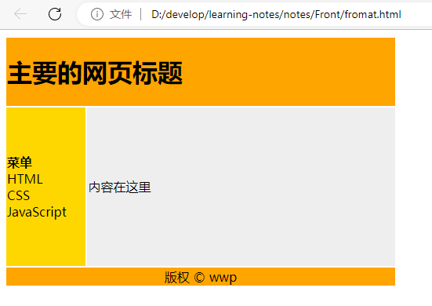

# HTML

## HTML 基础

### 基本标签

| 标签          | 描述                                         |
| ------------- | -------------------------------------------- |
| h1 - h6       | 标题                                         |
| p             | 段落                                         |
| a             | 标签                                         |
| img           | 图像                                         |
| br            | 换行                                         |
| hr            | 水平线                                       |
| strong、b     | 加粗                                         |
| em、i         | 斜体                                         |
| base          | 所有的链接标签的默认链接                     |
| link          | 定义了文档与外部资源之间的关系               |
| table、tr、td | 表格                                         |
| ul、li        | 无序列表                                     |
| ol、li        | 有序列表                                     |
| div           | 定义了文档的区域，块级                       |
| span          | 用来组合文档中的行内元素， 内联元素          |
| form          | 定义供用户输入的表单                         |
| input         | 定义输入域                                   |
| textarea      | 定义文本域 (一个多行的输入控件)              |
| label         | 定义了 `input` 元素的标签，一般为输入标题    |
| fieldset      | 定义了一组相关的表单元素，并使用外框包含起来 |
| legend        | 定义了 `fieldset` 元素的标题                 |
| select        | 定义了下拉选项列表                           |
| optgroup      | 定义选项组                                   |
| option        | 定义下拉列表中的选项                         |
| button        | 定义一个点击按钮                             |
| iframe        | 可以显示一个目标链接的页面                   |

### 布局

使用 `div` 元素布局

```html
<!DOCTYPE html>
<html>
<head>
    <meta charset="utf-8">
    <title>div布局</title>
</head>
<body>
    <div id="container" style="width:500px">
        <div id="header" style="background-color:#FFA500;">
            <h1 style="margin-bottom:0;">主要的网页标题</h1>
        </div>
        <div id="menu" style="background-color:#FFD700;height:200px;width:100px;float:left;">
            <b>菜单</b><br>
            HTML<br>
            CSS<br>
            JavaScript</div>
        <div id="content" style="background-color:#EEEEEE;height:200px;width:400px;float:left;">
            内容在这里</div>
        <div id="footer" style="background-color:#FFA500;clear:both;text-align:center;">
            版权 © wwp</div>
    </div>
</body>
</html>
```

使用表格布局

```html
<!DOCTYPE html>
<html>

<head>
    <meta charset="utf-8">
    <title>表格布局</title>
</head>
<body>
    <table width="500" border="0">
        <tr>
            <td colspan="2" style="background-color:#FFA500;">
                <h1>主要的网页标题</h1>
            </td>
        </tr>
        <tr>
            <td style="background-color:#FFD700;width:100px;">
                <b>菜单</b><br>
                HTML<br>
                CSS<br>
                JavaScript
            </td>
            <td style="background-color:#eeeeee;height:200px;width:400px;">
                内容在这里</td>
        </tr>
        <tr>
            <td colspan="2" style="background-color:#FFA500;text-align:center;">
                版权 © wwp</td>
        </tr>
    </table>
</body>
</html>
```

运行结果



### 速查列表

**HTML 基本文档**

```html
<!DOCTYPE html>
<html>
<head>
    <title>文档标题</title>
</head>
<body>
    可见文本...
</body>
</html>
```

**基本标签（Basic Tags）**

```html
<h1>最大的标题</h1>
<h2> . . . </h2>
<h3> . . . </h3>
<h4> . . . </h4>
<h5> . . . </h5>
<h6>最小的标题</h6>
 
<p>这是一个段落。</p>
<br> （换行）
<hr> （水平线）
<!-- 这是注释 -->
```

**文本格式化（Formatting）**

```html
<b>粗体文本</b>
<code>计算机代码</code>
<em>强调文本</em>
<i>斜体文本</i>
<kbd>键盘输入</kbd> 
<pre>预格式化文本</pre>
<small>更小的文本</small>
<strong>重要的文本</strong>
 
<abbr> （缩写）
<address> （联系信息）
<bdo> （文字方向）
<blockquote> （从另一个源引用的部分）
<cite> （工作的名称）
<del> （删除的文本）
<ins> （插入的文本）
<sub> （下标文本）
<sup> （上标文本）
```

**链接（Links）**

```html
普通的链接：<a href="http://www.example.com/">链接文本</a>
图像链接： <a href="http://www.example.com/"></a>
邮件链接： <a href="mailto:webmaster@example.com">发送e-mail</a>
书签：
<a id="tips">提示部分</a>
<a href="#tips">跳到提示部分</a>
```

**图片（Images）**

```html

```

**样式/区块（Styles/Sections）**

```html
<style type="text/css">
h1 {color:red;}
p {color:blue;}
</style>
<div>文档中的块级元素</div>
<span>文档中的内联元素</span>
```

**无序列表**

```html
<ul>
    <li>项目</li>
    <li>项目</li>
</ul>
```

**有序列表**

```html
<ol>
    <li>第一项</li>
    <li>第二项</li>
</ol>
```

**定义列表**

```html
<dl>
  <dt>项目 1</dt>
    <dd>描述项目 1</dd>
  <dt>项目 2</dt>
    <dd>描述项目 2</dd>
</dl>
```

**表格（Tables）**

```html
<table border="1">
  <tr>
    <th>表格标题</th>
    <th>表格标题</th>
  </tr>
  <tr>
    <td>表格数据</td>
    <td>表格数据</td>
  </tr>
</table>
```

**框架（Iframe）**

```html
<iframe src="demo_iframe.htm"></iframe>
```

**表单（Forms）**

```html
<form action="demo_form.php" method="post/get">
<input type="text" name="email" size="40" maxlength="50">
<input type="password">
<input type="checkbox" checked="checked">
<input type="radio" checked="checked">
<input type="submit" value="Send">
<input type="reset">
<input type="hidden">
<select>
<option>苹果</option>
<option selected="selected">香蕉</option>
<option>樱桃</option>
</select>
<textarea name="comment" rows="60" cols="20"></textarea>
 
</form>
```

**实体（Entities）**

```html
&lt; 等同于 <
&gt; 等同于 >
&#169; 等同于 ©
```

## HTML5


HTML5包含两个部分的更新，分别是`文档`和`web api`

### 文档

[HTML5元素表](http://www.html5star.com/manual/html5label-meaning/)

#### 元素语义化

元素语义化是指**每个HTML元素都代表着某种含义，在开发中应该根据元素含义选择元素**

元素语义化的好处：

1. 利于SEO（搜索引擎优化）
2. 利于无障碍访问
3. 利于浏览器的插件分析网页

#### 新增元素

##### 多媒体

可以使用`audio`元素表达一个音频

可以使用`video`元素表达一个视频

它们均具有以下属性

| 属性名   | 含义             | 类型     |
| -------- | ---------------- | -------- |
| src      | 多媒体的文件路径 | 普通属性 |
| controls | 是否显示播放控件 | 布尔属性 |
| autoplay | 是否自动播放     | 布尔属性 |
| loop     | 是否循环播放     | 布尔属性 |
| muted    | 静音播放         | 布尔属性 |

> 新版浏览器不允许「带声音的自动播放」，可能将来甚至不允许自动播放
>
> 浏览器希望播放行为由用户决定

##### 文章结构

为了让搜索引擎和浏览器更好的理解文档内容，HTML5新增了多个元素来表达内容的含义。

下面的示例中，使用了HTML5的新增元素来表达一篇文章

```html
<!-- article：一篇文章 -->
<article>
  <!-- header：文章头部信息 -->
  <header>
    <h1>文章标题</h1>
    <!-- blockquote：引用信息 -->
    <blockquote>此文章引用的文献：xxxx</blockquote>
  </header>
  <!-- aside: 文章的其他附加信息 -->
  <aside>
    <span>作者：xxxx</span>
    <span>发布日期：xxx</span>
    <span>浏览量：xxx</span>
  </aside>
  <!-- section：章节 -->
  <section>
    <h2>章节1</h2>
    <p>段落1</p>
    <p>段落2</p>
    <p>段落3</p>
    <p>段落4</p>
  </section>
  <!-- section：章节 -->
  <section>
    <h2>章节2</h2>
    <p>段落1</p>
    <p>段落2</p>
    <p>段落3</p>
    <p>段落4</p>
  </section>
  <!-- section：章节 -->
  <section>
    <h2>章节3</h2>
    <p>段落1</p>
    <p>段落2</p>
    <p>段落3</p>
    <p>段落4</p>
  </section>
  <!-- 页脚 -->
  <footer>
    <p>参考资料</p>
    <!-- cite表示外部站点的引用 -->
    <cite>xxxxxxx</cite>
    <cite>xxxxxxx</cite>
    <cite>xxxxxxx</cite>
    <cite>xxxxxxx</cite>
    <cite>xxxxxxx</cite>
    <cite>xxxxxxx</cite>
  </footer>
</article>
```

#### 新增属性

##### 自定义数据属性


##### input的新增属性

> [MDN input详细文档](https://developer.mozilla.org/zh-CN/docs/Web/HTML/Element/input)

进入下面的地址查看各种属性及其效果

http://mdrs.yuanjin.tech/html/html-manual/input-property.html

### web api

#### 使用css选择器选中元素

```js
// 使用css选择器选中匹配的第一个元素
document.querySelector('css选择器');
// 使用css选择器选中匹配的所有元素，返回伪数组
document.querySelectorAll('css选择器');
```

#### 控制类样式

```js
// 添加类样式
dom.classList.add('a');  // <div class="a"></div>
dom.classList.add('b');  // <div class="a b"></div>
dom.classList.add('c');  // <div class="a b c"></div>

// 是否包含某个类样式
dom.classList.contains('a');  // true 

// 移除类样式
dom.classList.remove('a');  // <div class="b c"></div>

// 切换类样式
dom.classList.toggle('a'); // <div class="a b c"></div>
dom.classList.toggle('a'); // <div class="b c"></div>
dom.classList.toggle('a'); // <div class="a b c"></div>
```

#### 本地存储

`localStorage`，永久保存到本地

`sessionStorage`，临时保存到本地，关闭浏览器后消失

```js
// 保存一个键值对到本地，值必须是字符串
localStorage.setItem('key', 'value');
// 根据键，读取本地保存的值
localStorage.getItem('key');
// 清除所有保存的内容
localStorage.clear();
// 根据键，清除指定的内容
localStorage.removeItem('key');

// 保存一个键值对到本地，值必须是字符串
sessionStorage.setItem('key', 'value');
// 根据键，读取本地保存的值
sessionStorage.getItem('key');
// 清除所有保存的内容
sessionStorage.clear();
// 根据键，清除指定的内容
sessionStorage.removeItem('key');
```

无论是`localStorage`还是`sessionStorage`，它们都只能保存字符串，如果需要保存对象或数组，可以先将对象和数组转换为`JSON`字符串再进行保存

```js
JSON.stringify(obj); // 将对象或数组转换为JSON搁置
JSON.parse(jsonString); // 将JSON格式的字符串转换为对象或数组
```

#### 渲染帧

浏览器会不断的对网页进行渲染，通常情况下的速度为每秒渲染60次，每一次渲染称之为**一帧**，因此又可以说：浏览器的渲染速率是60帧

但这不是一定的，它会受到各种因素的影响，因此，帧率往往会有浮动

浮动的帧率就导致一个问题，我们在使用`setInterval`等计时器实现某些动画效果时，如何才能保证每一帧只执行一次动画效果呢？


为了解决该问题，HTML5新增API`requestAnimationFrame`，用于在每一帧渲染**之前**做某些事

```js
requestAnimationFrame(function(){
  // 传入一个回调函数，该函数在下一帧渲染之前自动运行
  // 通常，可以利用该回调函数，在下一帧渲染前改动元素的状态
})
```

`raq`的回调函数仅执行一次，因此，要实现连贯的动画，通常使用下面的代码结构

```js
// 该函数负责在下一帧渲染前，执行一次元素状态变化
function changeOnce(){
  requestAnimationFrame(function(){
    if(动画是否应该停止){
      return;
    }
    改变元素状态
    changeOnce(); // 改变完成后，继续注册下一针的变化
  })
}
changeOnce();
```

#### 音视频API

> [MDN详细文档](https://developer.mozilla.org/zh-CN/docs/Web/API/HTMLMediaElement)

针对`video`和`audio`元素，HTML5新增了音视频的API，让开发者可以使用JS控制它们

**音视频属性**

| 属性名       | 含义                                                         |
| ------------ | ------------------------------------------------------------ |
| currentTime  | 当前播放时间，单位为秒。为其赋值将会使媒体跳到一个新的时间。 |
| loop         | 对应HTML标签`loop`属性，决定该媒体是否循环播放.              |
| controls     | 对应HTML标签`controls`属性，控制是否显示用户播放界面的控制 HTML |
| src          | 对应HTML标签`src`属性，获取和设置播放地址                    |
| volume       | 表示音频的音量。值从0.0（静音）到1.0（最大音量）。           |
| playbackRate | 播放倍速。1为正常。                                          |
| duration     | 总时长，单位为秒。                                           |
| paused       | 当前是否是暂停状态                                           |
| muted        | 是否静音                                                     |

**音视频方法**

| 方法名  | 含义     |
| ------- | -------- |
| play()  | 开始播放 |
| pause() | 暂停播放 |

**事件**

| 事件名     | 含义                                                      |
| ---------- | --------------------------------------------------------- |
| pause      | 暂停时触发                                                |
| ended      | 结束时触发                                                |
| play       | 开始播放时触发                                            |
| timeupdate | 属性`currentTime`变化时触发。会随着播放进度的变化不断触发 |
| loadeddata | 事件在第一帧数据加载完成后触发                            |
