# 软件杯

## 作品简介

[**风电大数据监控管理平台**](https://gitee.com/star_wwp/wind-power-web)

### 概述

风电大数据监控管理平台是一款风电数据监控可视化及功率预测算法系统，旨在提供对风电场的实时数据监控、可视化展示和功率预测分析，以帮助运维人员实时掌握风电场的运行状态、优化运维管理，并提供异常检测告警和信息管理等功能，使系统更贴近于真实应用场景，方便操作人员使用。

###	算法部分

####	功率预测模型

对于官方给定的数据，历史功率和天气以及未来天气预测数据预测未来的功率。经过各种模型的训练、测试，最终选择使用MLP模型，并在采样数据上进行模型的训练，可以达到最高的准确率。

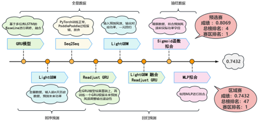

图 2.1 模型尝试

2.2	性能劣化分析模型

对于风机长时间内功率不稳定的情况，根据一段时间内风速-功率变化散点图，利用深度学习图像分类模型预测可能出现的劣化异常。利用PaddlePaddle构建卷积神经网络模型，通过输入不同类型的风-功率散点图，从而预测可能出现的劣化类别。

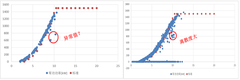

图 2.2 风-功率散点图

###	系统部分

### 数据流图

根据系统数据流向绘制的数据流图如下，对于风机传感器实时采集到的数据先进行预处理，然后对数据进行异常检测，如果显示异常，则直接记录在异常记录表中并及时报警。对于没有异常的数据，把其插入到时序数据库中，并进行统计，将结果也记录在统计数据表中。而模型依赖的未来天气数据存储在预测表中，通过调用模型接口，模型会把预测结果填回预测表中，并进行展示。

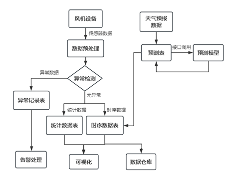

图 2.3 数据流图

####	系统设计

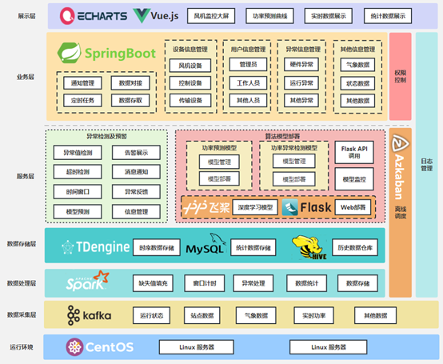

图 3.1 系统架构图

根据任务不同，把系统分为了若干层，包括数据采集层、数据处理层、数据存储层、服务层、业务层以及展示层六个层次，每个层次的任务都在图中标识。
 
**数据采集层**：数据采集模块使用Kafka作为数据传输的中间件，实现实时数据的采集、传输和存储，具体包括运行状态、气象数据等实时数据。

**数据处理层**：系统使用Spark Streaming接收来自Kafka的实时数据，并对其进行实时处理，并将处理过后的数据存入数据库中。处理操作包括：缺失值填充、异常值过滤、窗口计时、数据统计等等，数据处理后分别存入到时序数据表、统计数据表、异常数据表中。

**数据存储层**：负责存储系统所需的全部数据，对于设备实时传输的数据要按时间、设备分别存储到相应的时序数据表中，而对功率或其他字段进行统计的数据，要存入统计数据表中，对于往年历史数据，可以导入数据仓库中以便后续分析。

**服务层**：主要提供了异常检测和模型调用两大服务，对于异常检测模块，基于异常值检测、设置超时窗口、区间异常检测、模型劣化分析等方式实现各种异常的检测和告警。对于算法模型部署模块，利用PaddlePaddle搭建深度学习算法模型并部署在Flask平台中以供业务系统调用，并实现模型的管理功能。

**业务层**：搭建后端管理系统，实现通知管理、定时任务、数据对接以及数据管理功能，对前端可视化系统提供数据支持，同时提供对设备、人员、告警等信息的管理。

**展示层**：实现数据可视化，包括监控数据可视化、3D模型控制可视化，功率曲线可视化、信息管理可视化等等。

**其他**：通过Azkaban构建离线任务调度，实现数据的自动分时导出。

####	系统展示

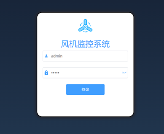

图 3.2 系统登录界面

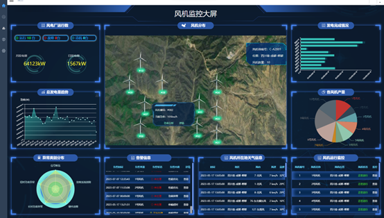

图 3.3 风机监控大屏

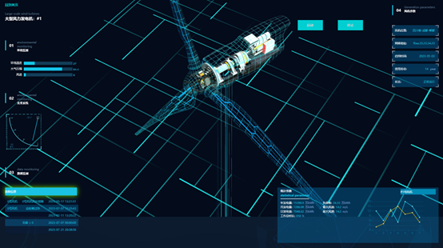

图 3.4 风机3D监控模型

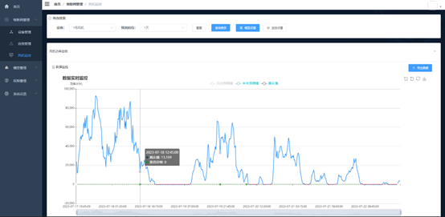

图 3.5 风机功率实时监控

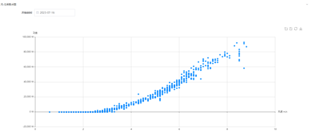

图 3.6 风机历史功率分析

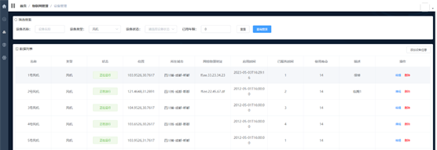

图 3.7 设备信息管理

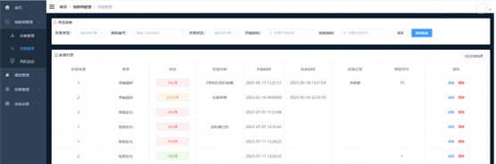

图 3.8 告警信息管理

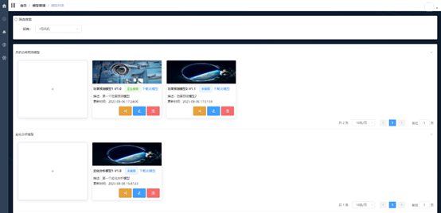

图 3.9 模型管理

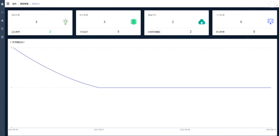

图 3.10 模型统计
